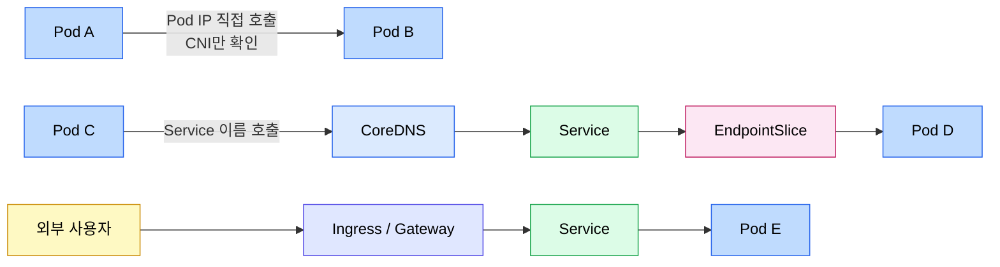

# 네트워킹

> Kubernetes 네트워킹은 Pod IP 모델 위에 Service, DNS, Ingress/Gateway API, NetworkPolicy가 층을 이루는 구조입니다. 이 문서는 전체 지도를 잡고, 세부 구현은 04-02부터 04-06까지의 문서로 나눠 읽습니다. 파일 번호 순서가 곧 권장 학습 순서입니다 — 04-02 Pod·Linux 기반, 04-03 오버레이·BGP, 04-04 Service, 04-05 DNS, 04-06 Ingress/Gateway 순으로 한 단씩 위로 올라갑니다.


## 학습 목표
> 네트워크 장애를 계층별로 분리해서 볼 수 있도록 큰 흐름을 먼저 고정합니다.

이 장에서 확인할 목표는 다음과 같습니다:

1. Kubernetes 네트워킹의 기본 요구사항을 Pod IP 모델과 연결해 설명할 수 있습니다.
2. CNI, CoreDNS, Service dataplane, Ingress Controller의 책임을 구분할 수 있습니다.
3. Pod-to-Pod, Pod-to-Service, External-to-Service 요청 경로를 구분할 수 있습니다.
4. NetworkPolicy가 연결성 위에 얹히는 정책 계층임을 이해할 수 있습니다.
5. Service Mesh가 Kubernetes 기본 네트워킹 위에서 어떤 문제를 추가로 푸는지 선을 그을 수 있습니다.


## 1. 네트워크 모델
> Kubernetes는 Pod가 클러스터 안에서 직접 통신할 수 있다는 전제를 모든 네트워크 기능의 기반으로 삼습니다.

Kubernetes 공식 문서가 제시하는 핵심 요구사항은 단순합니다. 모든 Pod는 고유한 IP를 가져야 하고, Pod끼리는 NAT 없이 서로 통신할 수 있어야 하며, 노드의 에이전트도 해당 Pod와 통신할 수 있어야 합니다. 이 요구사항 덕분에 애플리케이션은 "내가 어느 노드에 떠 있는가"보다 "상대 Pod 또는 Service가 어디에 있는가"에 집중할 수 있습니다.

이 모델의 구현은 CNI(Container Network Interface) 플러그인에 맡겨집니다. Calico, Cilium, Flannel 같은 구현체가 Pod IP 할당, 노드 간 라우팅, 오버레이/언더레이 네트워크 구성을 담당합니다. 즉 CNI는 Pod 네트워크를 만드는 계층이고, Service 라우팅이나 DNS 이름 해석을 전부 담당하는 계층은 아닙니다.

Pod IP는 안정적인 주소가 아닙니다. Pod가 재생성되면 IP가 바뀔 수 있고, Deployment가 롤링 업데이트되면 백엔드 Pod 집합도 계속 변합니다. 그래서 Kubernetes는 Service, EndpointSlice, DNS를 함께 사용해 "변하는 Pod 집합"을 "안정적인 이름과 가상 IP" 뒤에 숨깁니다.


## 2. 책임 분리 지도
> 네트워크 장애를 빠르게 좁히려면 컴포넌트가 맡은 일을 섞지 않아야 합니다.

Kubernetes 네트워크 계층은 다음처럼 나눠서 보는 것이 가장 안전합니다:

- CNI: Pod IP를 만들고 노드 간 Pod-to-Pod 경로를 구성합니다.
- CoreDNS: Service와 Pod 이름을 DNS 질의에 응답합니다.
- Service dataplane: Service VIP 또는 ClusterIP로 들어온 트래픽을 Ready endpoint로 전달합니다.
- Ingress Controller: 외부 HTTP/HTTPS 요청을 host/path 규칙에 따라 Service로 보냅니다.
- Gateway API Controller: GatewayClass, Gateway, Route 리소스를 읽어 더 확장된 진입 계층을 구현합니다.
- NetworkPolicy 구현체: Pod 간 ingress/egress 허용 규칙을 적용합니다.

전체 관계는 다음과 같다:

```mermaid
graph TB
    EXT["외부 클라이언트"]
    GW["Ingress / Gateway API<br/>외부 HTTP(S) 진입"]
    SVC["Service<br/>안정적인 내부 진입점"]
    DNS["CoreDNS<br/>Service 이름 해석"]
    DP["kube-proxy 또는 CNI dataplane<br/>Service VIP -> endpoint"]
    CNI["CNI plugin<br/>Pod IP와 노드 간 경로"]
    NP["NetworkPolicy<br/>허용 규칙"]
    PODA["Pod A"]
    PODB["Pod B"]

    EXT --> GW
    GW --> SVC
    PODA -->|"Service 이름 조회"| DNS
    DNS --> SVC
    SVC --> DP
    DP --> PODB
    CNI -.-> PODA
    CNI -.-> PODB
    NP -.-> PODA
    NP -.-> PODB

    style EXT fill:#fef9c3,stroke:#ca8a04,color:#000
    style GW fill:#e0e7ff,stroke:#4f46e5,color:#000
    style SVC fill:#dcfce7,stroke:#16a34a,color:#000
    style DNS fill:#dbeafe,stroke:#2563eb,color:#000
    style DP fill:#ede9fe,stroke:#7c3aed,color:#000
    style CNI fill:#f3f4f6,stroke:#6b7280,color:#000
    style NP fill:#fee2e2,stroke:#dc2626,color:#000
    style PODA fill:#bfdbfe,stroke:#2563eb,color:#000
    style PODB fill:#bfdbfe,stroke:#2563eb,color:#000
```



장애를 볼 때도 이 그림의 순서로 쪼갭니다. Pod IP끼리 직접 통신이 안 되면 CNI와 노드 라우팅을 먼저 봅니다. IP로는 붙는데 이름이 안 풀리면 CoreDNS를 봅니다. 이름은 ClusterIP로 풀리는데 Pod로 가지 않으면 Service, EndpointSlice, kube-proxy 또는 dataplane을 봅니다. 경로는 있는데 특정 Pod 사이만 막히면 NetworkPolicy를 봅니다.


## 3. 대표 트래픽 경로
> 같은 "통신 실패"라도 어떤 경로인지에 따라 봐야 할 리소스가 달라집니다.

Pod-to-Pod 직접 통신은 CNI 경로만 탑니다. 가장 단순하지만 Pod IP가 바뀌기 쉬워 애플리케이션 간 통신의 기본 방식으로는 적합하지 않습니다. 디버깅할 때 "CNI 자체가 살아 있는가"를 확인하는 용도로 유용합니다.

Pod-to-Service 통신은 DNS와 Service dataplane을 함께 탑니다. 클라이언트 Pod가 `backend.default.svc.cluster.local`을 조회하면 CoreDNS가 Service의 ClusterIP를 반환하고, kube-proxy 또는 CNI dataplane이 해당 VIP를 실제 EndpointSlice의 Ready Pod로 연결합니다.

External-to-Service 통신은 Ingress, Gateway API, NodePort, LoadBalancer 같은 외부 진입 계층을 거칩니다. HTTP/HTTPS 라우팅은 보통 Ingress 또는 Gateway API에서 처리하고, 최종 backend는 다시 Service입니다.

흐름을 비교하면 다음과 같다:




## 4. 세부 문서로 나누어 읽기
> 공식 문서처럼 Service, Ingress, DNS를 분리해 읽는 편이 개념이 덜 섞입니다.

네트워킹 세부 주제는 다음 문서에서 따로 다룹니다:

| 주제 | 문서 | 다루는 범위 |
|------|------|-------------|
| Pod 네트워크와 Linux 기반 | [Pod 네트워크와 Linux 기반](04-02.Pod%20%EB%84%A4%ED%8A%B8%EC%9B%8C%ED%81%AC%EC%99%80%20Linux%20%EA%B8%B0%EB%B0%98.md) | Pause 컨테이너, network namespace, veth, bridge, Pod CIDR, CNI, kube-proxy dataplane(iptables/nftables/IPVS/eBPF) |
| 오버레이와 노드 간 트래픽 | [오버레이와 노드 간 트래픽](04-03.%EC%98%A4%EB%B2%84%EB%A0%88%EC%9D%B4%EC%99%80%20%EB%85%B8%EB%93%9C%20%EA%B0%84%20%ED%8A%B8%EB%9E%98%ED%94%BD.md) | VXLAN 캡슐화, 네이티브 라우팅, Cilium BGP·IPAM 모드, MetalLB L2/BGP, ECMP 경로 제한 |
| Service와 EndpointSlice | [Service와 EndpointSlice](04-04.Service%EC%99%80%20EndpointSlice.md) | ClusterIP, VIP, EndpointSlice, kube-proxy/dataplane, Service 타입, 트래픽 정책 |
| DNS와 CoreDNS | [DNS와 CoreDNS](04-05.DNS%EC%99%80%20CoreDNS.md) | Service/Pod DNS 레코드, Headless Service, `dnsPolicy`, `dnsConfig`, CoreDNS ConfigMap |
| Ingress와 Gateway API | [Ingress와 Gateway API](04-06.Ingress%EC%99%80%20Gateway%20API.md) | Ingress 리소스, Ingress Controller, Gateway API 역할 분리, TLS 진입 |
| NetworkPolicy | [RBAC과 보안](../07_security/07-01.RBAC%EA%B3%BC%20%EB%B3%B4%EC%95%88.md) | default-deny, ingress/egress 허용, namespace 경계와 보안 정책 |

Pod IP가 어떻게 할당되고 패킷이 노드 사이를 어떻게 건너가는지에 관한 Linux 기반 메커니즘은 04-02 문서에서 별도로 다룹니다. Service나 DNS 같은 상위 추상이 헷갈리기 시작할 때 그 문서로 한 단계 내려가면 디버깅 진입점이 분명해집니다.

이 문서에는 세부 YAML과 구현 차이를 길게 두지 않습니다. 대신 어느 계층을 먼저 봐야 하는지, 그리고 더 깊은 설명이 어느 문서에 있는지를 연결하는 역할을 합니다.


## 5. 디버깅 진입 순서
> "네트워크가 안 된다"를 구체적인 실패 지점으로 쪼개야 합니다.

내부 통신이 안 되면 다음 순서로 확인합니다:

1. Pod IP끼리 직접 통신되는지 확인합니다. 실패하면 CNI, 노드 라우팅, NetworkPolicy를 먼저 봅니다.
2. Service 이름이 ClusterIP로 해석되는지 확인합니다. 실패하면 CoreDNS와 Pod의 `resolv.conf`를 봅니다.
3. Service에 Ready endpoint가 있는지 확인합니다. 없으면 selector, readiness probe, EndpointSlice를 봅니다.
4. ClusterIP로 접근되는지 확인합니다. 실패하면 kube-proxy, CNI dataplane, Service port/targetPort를 봅니다.
5. 외부 요청만 실패하면 Ingress Controller, Ingress/Gateway 규칙, LoadBalancer/NodePort 노출을 봅니다.

자주 쓰는 확인 명령은 다음과 같습니다:

```bash
kubectl get pods -o wide
kubectl get svc
kubectl get endpointslices
kubectl get ingress
kubectl run dns-test --image=busybox:1.36 -it --rm -- nslookup kubernetes.default
```


## 6. 점검 질문
> 본문 개념을 운영 판단 질문으로 다시 점검합니다.

### Q1. CNI, CoreDNS, kube-proxy는 무엇을 각각 담당하는가?

CNI는 Pod에 IP를 붙이고 Pod 간 네트워크 경로를 만듭니다. CoreDNS는 Service와 Pod 이름을 DNS로 해석합니다. kube-proxy는 Service의 ClusterIP나 NodePort 요청을 실제 Pod IP로 전달합니다.

장애를 나눠 보면 더 명확합니다. Pod끼리 IP 직접 통신이 안 되면 CNI 쪽을 먼저 봅니다. 이름은 안 풀리는데 IP로는 붙으면 CoreDNS 문제일 가능성이 높습니다. 이름은 풀리는데 Service로만 실패하면 kube-proxy나 EndpointSlice 쪽을 의심합니다.

운영 디버깅에서는 이 셋을 섞지 않는 것이 핵심입니다. "네트워크가 안 된다"가 아니라 "경로 생성, 이름 해석, Service 포워딩 중 어디가 실패했는가"로 나눠야 합니다.

### Q2. kube-proxy의 iptables 모드와 IPVS 모드 차이는?

iptables 모드는 Service와 Endpoint 변경 시 리눅스 iptables 규칙을 생성·삭제합니다. 규칙 체인을 O(n) 선형 탐색하므로 Service 수가 많아질수록 지연이 증가합니다. Pod 수 1,000개 미만의 소규모 클러스터에는 기본값으로 충분합니다.

IPVS 모드는 커널의 IP Virtual Server를 사용해 해시 테이블 기반 O(1) 조회를 제공합니다. Service 10,000개에서도 밀리초 수준의 지연을 유지합니다. ipvsadm 커널 모듈이 필요합니다. kube-proxy CPU 사용률이 높거나 Service 응답 시간이 증가할 때 전환을 검토합니다.

IPVS 모드에서도 NodePort, IP Masquerade, NetworkPolicy는 여전히 iptables를 사용한다는 점을 알아야 합니다. IPVS의 `sh`(Source Hashing) 알고리즘은 소스 IP를 해싱해 항상 같은 Pod로 라우팅하므로 SessionAffinity와 유사하지만, SessionAffinity는 conntrack 기반이라 작동 방식이 다릅니다.

### Q3. ClusterIP Service의 내부 로드밸런싱 동작 과정은?

클라이언트 Pod가 `http://backend:80`으로 요청하면 CoreDNS가 `backend.default.svc.cluster.local`을 ClusterIP(10.96.5.10)로 해석합니다. iptables PREROUTING 체인의 KUBE-SERVICES 규칙이 매칭되고, 확률 기반으로 KUBE-SEP 체인 중 하나를 선택해 DNAT로 Pod IP로 포워딩합니다.

같은 TCP 연결 내 패킷은 conntrack으로 같은 Pod로 유지됩니다. Service ClusterIP는 실제 네트워크 인터페이스에 할당되지 않고 iptables 규칙으로만 존재합니다. Endpoint가 0개일 때 Service로 요청하면 타임아웃이 발생합니다.

최신 Kubernetes에서는 백엔드 표현을 `EndpointSlice`로 관리하는 것이 기본입니다. 그래서 기존 `kubectl get endpoints`만 보지 말고 `kubectl get endpointslices`도 같이 확인하는 습관이 필요합니다.

```bash
kubectl get endpoints <service-name>   # Endpoint 목록 확인
kubectl run dnstest --image=busybox:1.28 -it --rm -- nslookup <service-name>
```

### Q4. Ingress Controller와 Ingress 리소스의 관계는?

Ingress 리소스는 라우팅 규칙을 선언한 YAML이고, Ingress Controller는 규칙을 실제 구현하는 Pod입니다. Ingress Controller가 API 서버를 watch해 Ingress 리소스를 감지하면 nginx.conf를 재생성하고 graceful reload를 실행합니다.

여러 Ingress Controller를 동시에 설치할 수 있으며 `ingressClassName`으로 어떤 Controller가 처리할지 지정합니다. Ingress Controller가 다운되면 502/503 오류가 발생하므로 Deployment로 배포해 자동 복구가 되도록 해야 합니다.

GCP 클러스터에서 Ingress를 사용할 때는 nginx-ingress의 NodePort(31292)를 Worker 노드 IP와 함께 사용합니다.

```bash
# Ingress 상태 확인
kubectl get ingress -A
kubectl describe ingress <name>

# Ingress Controller 로그
kubectl logs -n ingress-nginx -l app.kubernetes.io/name=ingress-nginx
```

### Q5. NetworkPolicy의 기본 동작은?

NetworkPolicy가 없으면 클러스터 내 모든 Pod은 서로 자유롭게 통신할 수 있습니다. NetworkPolicy를 적용하는 순간 해당 Pod에 대한 기본 동작이 차단으로 전환됩니다. 이후 규칙에 명시적으로 허용된 트래픽만 통과합니다.

`podSelector: {}`는 같은 네임스페이스 내 모든 Pod를 선택합니다. policyTypes에 Ingress만 명시하면 Egress는 여전히 모두 허용됩니다. 여러 정책이 같은 Pod에 적용되면 OR 연산(합집합)으로 처리되므로, 하나의 정책만 허용해도 트래픽이 통과합니다.

NetworkPolicy는 CNI 플러그인이 구현해야 작동합니다. 개인 GCP 클러스터는 Flannel을 사용하는데 Flannel은 NetworkPolicy를 지원하지 않습니다. 실제 NetworkPolicy를 테스트하려면 Calico나 Cilium이 필요합니다.

```bash
kubectl get networkpolicy -A
kubectl describe networkpolicy <name>
```

### Q6. Headless Service의 DNS 동작 차이는?

일반 ClusterIP Service는 DNS 조회 시 ClusterIP 하나를 반환합니다. kube-proxy가 Pod 선택을 담당합니다. 클라이언트는 백엔드 Pod를 알 수 없습니다.

Headless Service(`clusterIP: None`)는 DNS 조회 시 모든 Ready Pod의 IP 목록을 반환합니다. ClusterIP가 없으므로 kube-proxy 규칙이 생성되지 않습니다. 클라이언트가 직접 Pod를 선택해야 합니다.

StatefulSet과 함께 쓰면 각 Pod에 대한 안정적인 DNS 이름이 생성됩니다(`pod-name.service-name.namespace.svc.cluster.local`). Pod가 재시작되어 IP가 바뀌어도 DNS 이름은 유지됩니다.

```bash
# DNS 테스트
kubectl run dnstest --image=busybox:1.28 -it --rm -- nslookup nginx-headless
kubectl run dnstest --image=busybox:1.28 -it --rm -- nslookup web-0.nginx-headless
```

Headless Service에서 SessionAffinity는 의미가 없습니다. ClusterIP가 없으므로 kube-proxy가 관여하지 않기 때문입니다.

### Q7. GCP 클러스터에서 LoadBalancer 타입 Service 접근 방법은?

kubeadm으로 구성한 개인 GCP 클러스터는 클라우드 컨트롤러 매니저가 없어 LoadBalancer 타입 Service의 External IP가 `<pending>` 상태로 유지됩니다.

외부 접근을 위한 대안은 두 가지입니다. NodePort Service를 만들고 Worker 노드의 외부 IP와 NodePort를 사용하거나, 설치된 nginx-ingress(NodePort 31292/31726)를 통해 Ingress로 접근하는 방법입니다.

```bash
# NodePort Service 생성
kubectl expose deployment nginx --type=NodePort --port=80
kubectl get svc nginx  # NodePort 번호 확인

# Worker 노드 IP 확인
kubectl get nodes -o wide   # EXTERNAL-IP 컬럼

# 접근 테스트 (Worker 노드 IP + NodePort)
curl http://<worker-node-external-ip>:<nodeport>
```

NodePort를 통한 외부 접근 시 기본적으로 SNAT이 발생해 클라이언트 IP가 노드 IP로 바뀝니다. 클라이언트 IP를 보존하려면 `externalTrafficPolicy: Local`을 설정하되, 해당 노드에 Pod가 없으면 요청이 실패한다는 점을 유의합니다.

### Q8. Pod-to-Pod, Pod-to-Service, External-to-Service 트래픽 경로 차이는?

Pod-to-Pod 직접 통신은 kube-proxy를 거치지 않고 CNI 네트워크를 통해 직접 전달됩니다. NAT 없이 출발지 IP가 보존됩니다. 가장 빠른 경로지만 Pod IP는 임시적이므로 권장하지 않습니다.

Pod-to-Service 통신은 CoreDNS가 Service 이름을 ClusterIP로 해석하고, iptables가 DNAT로 Pod IP로 포워딩합니다. 출발지 IP는 보존됩니다(클러스터 내부이므로 SNAT 불필요).

External-to-Service(NodePort)는 외부 클라이언트 IP가 SNAT되어 노드 IP로 변경된 뒤 Pod로 전달됩니다(`externalTrafficPolicy: Cluster` 기본값). Ingress Controller를 통한 접근은 클라이언트 IP가 X-Forwarded-For 헤더에 담겨 전달됩니다.

### Q9. dev 환경에서 DNS 정책은 어떻게 가져가는가?

대부분의 dev 환경에서는 `dnsPolicy: ClusterFirst`를 그대로 둡니다. Service 이름 해석이 바로 되고, CoreDNS 기본 설정을 그대로 활용할 수 있기 때문입니다. 학습용 Pod, 일반 API, 배치 Pod는 이 기본값이면 충분합니다.

```yaml
apiVersion: v1
kind: Pod
metadata:
  name: api-dev
spec:
  dnsPolicy: ClusterFirst
  containers:
  - name: api
    image: nginx:1.29
```

노드 네트워크를 직접 쓰는 Pod는 예외입니다. `hostNetwork: true`를 사용하면 `dnsPolicy: ClusterFirstWithHostNet`으로 맞춰야 클러스터 내부 Service 이름 해석을 유지할 수 있습니다.

```yaml
apiVersion: v1
kind: Pod
metadata:
  name: node-agent
  namespace: kube-system
spec:
  hostNetwork: true
  dnsPolicy: ClusterFirstWithHostNet
  containers:
  - name: agent
    image: busybox:1.36
    command: ["sh", "-c", "sleep 3600"]
```

`dnsPolicy: None`은 정말 필요한 경우에만 씁니다. 예를 들어 특정 외부 DNS 서버, 사내 search domain, `ndots` 조정이 꼭 필요할 때 `dnsConfig`와 함께 사용합니다. dev 환경에서 기본값처럼 쓰기에는 운영 부담이 큽니다.

### Q10. DNS 기반 서비스 디스커버리의 캐싱 문제와 해결은?

CoreDNS의 기본 TTL은 30초입니다. Service ClusterIP는 변경되지 않으므로 긴 TTL도 안전합니다. 반면 Headless Service의 Pod IP 목록은 Pod 재시작 시 변경되는데, 클라이언트 DNS 캐시가 오래된 IP를 반환하면 30초간 연결 실패가 발생합니다.

Java 애플리케이션은 JVM 수준의 DNS 캐시가 별도로 존재합니다. `networkaddress.cache.ttl`을 10초 이하로 설정해야 CoreDNS의 TTL이 의미를 가집니다. Go는 기본적으로 DNS를 캐싱하지 않습니다.

근본 해결책은 클라이언트 라이브러리에서 DNS 실패 시 즉시 재조회하는 재시도 로직을 구현하거나, 연결 풀에서 실패한 IP를 제거하고 재연결하는 것입니다. CoreDNS TTL을 5초로 단축하면 DNS 쿼리가 증가해 CoreDNS 부하가 높아지므로 권장하지 않습니다.

### Q11. Kubernetes 네트워킹과 Service Mesh는 어디서 역할이 갈라지는가?

Kubernetes 네트워킹은 연결성과 기본 노출을 담당합니다. CNI는 Pod 네트워크, Service는 안정된 내부 엔드포인트, Ingress와 Gateway API는 외부 진입, NetworkPolicy는 기본 접근 제어를 맡습니다.

Service Mesh는 그 위에서 서비스 간 호출 정책을 다룹니다. 예를 들어 가중치 기반 트래픽 분할, 재시도와 타임아웃의 공통화, 서비스 간 mTLS, L7 관측성은 기본 Kubernetes 네트워킹만으로는 충분히 풀기 어렵습니다.

실무에서 헷갈리지 않는 기준은 이렇습니다. "붙을 수 있는가"는 Kubernetes 네트워킹, "어떤 정책으로 호출을 제어할 것인가"는 Service Mesh입니다. 따라서 Service로도 연결이 안 되면 메시를 보기 전에 CNI, DNS, kube-proxy부터 확인해야 합니다.

### Q12. Pause 컨테이너는 왜 존재하는가?

Pod 안 모든 컨테이너가 같은 네트워크 네임스페이스를 공유하려면 그 네임스페이스를 누군가 만들고 끝까지 쥐고 있어야 합니다. Pause 컨테이너가 그 역할을 합니다. 가장 먼저 만들어져 네트워크와 IPC 네임스페이스를 생성하고, PID 1 자리에서 시그널만 처리하며 무한 sleep으로 살아 있습니다.

이 구조가 사이드카 패턴의 기반입니다. 메인 컨테이너가 재시작되어도 Pause는 살아 있으므로 사이드카는 같은 네임스페이스를 잃지 않습니다. 같은 Pod 안 컨테이너가 `localhost:8080`으로 서로를 호출할 수 있는 이유도 이 공유된 네임스페이스 때문입니다.

확인은 노드 안에서 합니다. `crictl ps -a | grep pause`로 Pause 컨테이너가 Pod마다 하나씩 떠 있는 모습이 보이고, `lsns -t net`을 보면 네트워크 네임스페이스가 Pod 단위로 묶여 있습니다.

### Q13. veth pair와 Linux bridge는 Pod 네트워크에서 어떤 역할인가?

veth pair는 양 끝이 가상 NIC인 케이블 같은 자료구조입니다. CNI 플러그인이 Pod를 만들 때 veth pair를 만들어 한쪽 끝(`eth0`)을 Pod 네임스페이스에 넣고, 반대쪽 끝을 노드 root 네임스페이스의 Linux bridge(`cni0` 등)에 꽂습니다.

이 한 쌍이 Pod 네임스페이스와 노드 root 네임스페이스 사이의 유일한 통로입니다. 같은 노드의 Pod끼리 통신할 때는 bridge에 꽂힌 veth들이 ARP로 서로를 찾아 직접 패킷을 주고받습니다. 노드를 벗어날 때만 노드의 라우팅 테이블과 NIC을 탑니다.

운영 디버깅에서는 노드에서 `ip link show type veth`, `bridge link show`, `ip -n <pod-ns> route`를 차례로 보면서 veth → bridge → 라우팅 테이블 순으로 따라갑니다. veth가 보이지 않으면 CNI 호출이 실패한 상태일 가능성이 큽니다.

### Q14. Pod CIDR이 노드별로 분할되면 노드 간 통신은 어떻게 되는가?

클러스터에는 보통 큰 Pod 네트워크(`10.244.0.0/16`)가 있고 노드마다 `/24`처럼 잘려 분배됩니다. 각 노드의 라우팅 테이블에는 자기 /24가 `dev cni0`로 직접 잡히고, 다른 노드의 /24는 그 노드 외부 IP를 next hop으로 잡는 라우팅 항목이 들어갑니다.

즉 노드가 자기 Pod CIDR의 라우터 역할을 합니다. Pod에서 다른 노드의 Pod로 보낸 패킷은 자기 노드 라우팅 테이블에서 next hop을 찾고 underlay(VPC, 물리 NIC, VXLAN 오버레이 등)로 전달됩니다. 받은 노드는 dst가 자기 /24이므로 bridge로 보내고 결국 veth 너머 Pod에 도착합니다.

이 모델이 깨지는 가장 흔한 두 케이스를 알아 둡니다.

1. 보안 그룹이나 사내 방화벽이 노드 간 Pod CIDR 트래픽을 막는 경우.
2. Pod CIDR과 사내망 IP가 겹쳐 Pod에서 사내 서비스가 보이지 않는 경우.

둘 다 클러스터 안에서는 정상으로 보이고 외부 패스가 들어가야 드러납니다.

### Q15. kube-proxy가 iptables에서 nftables로 전환하는 배경은?

iptables 모드는 오랜 기본값이지만 Service 수가 늘어나면 규칙 체인이 거대해집니다. KUBE-SERVICES → KUBE-SVC-* → KUBE-SEP-* 체인을 선형으로 따라 내려가야 매칭되므로 endpoint 수에 따라 첫 패킷 지연이 늘어나고, 규칙 추가·삭제마다 전체 체인을 다시 쓰는 비용이 듭니다.

nftables 모드는 1.31에서 beta로 들어와 1.33에서 GA가 됐습니다. 같은 의미를 nft 표현으로 다시 적되 set과 map 자료구조로 매칭을 해시 기반에 가깝게 만듭니다. Service 수가 늘어도 매칭 시간이 안정적이고, 부분 갱신 효율도 높습니다. 새 클러스터라면 nftables 모드를 기본으로 두는 편이 자연스럽습니다.

다만 nftables는 kube-proxy 자체의 dataplane 교체이므로, eBPF 기반 CNI(Cilium 등)가 kube-proxy를 통째로 대체하는 결정과는 의사결정 축이 다릅니다. 후자는 CNI 교체가 따라붙습니다.

운영 확인 명령은 다음과 같습니다:

```bash
kubectl -n kube-system get pods -l k8s-app=kube-proxy
kubectl -n kube-system logs -l k8s-app=kube-proxy | grep -i 'proxier\|mode'
nft list ruleset | grep -i kube     # 노드에서 직접 확인
```

### Q16. Cilium IPAM 모드 변경이 위험한 이유는?

Cilium은 Pod IP 할당을 두 가지 모드로 할 수 있습니다. `kubernetes` 모드는 노드의 `spec.podCIDR`(kubeadm/kubespray가 주입한 /24)을 그대로 쓰고, `cluster-pool` 모드는 Cilium 자체가 클러스터 풀을 관리해 별도 CIDR을 노드에 분배합니다. 두 모드는 노드별 Pod CIDR의 출처와 갱신 주체가 다르므로 서로 호환되지 않습니다.

운영 중 모드를 바꾸면 노드의 Pod CIDR이 즉시 다른 값으로 재할당될 수 있습니다. 그 순간 기존 Pod IP는 더 이상 새로운 Pod CIDR 안에 있지 않게 되므로 노드 라우팅과 eBPF 맵의 endpoint 항목이 불일치하고, Pod 사이 통신이 광범위하게 끊깁니다. 실제 사고 사례에서는 Cilium Helm 업그레이드 도중 `ipam.mode: kubernetes`로 잘못 머지된 한 줄 때문에 Pod 간 통신이 전부 차단됐고, Helm 롤백으로 CNI는 복구됐지만 그 사이 분산 DB 헬스체크 실패가 누적돼 정합성 복구 작업이 추가로 필요했습니다.

이 사례에서 배울 운영 규칙은 두 가지입니다. CNI 설정 변경은 Day-2 변경이 아니라 클러스터 재구성에 가까운 신중함이 필요합니다. 그리고 IPAM 모드처럼 한 번 정해지면 되돌리기 어려운 옵션은 클러스터 최초 설계 단계에서 못박고, 그 이후에는 Helm values diff를 두 사람 이상이 점검한 다음에야 적용합니다. CNI 변경 직후에는 Pod 간 통신, kube-dns, 분산 미들웨어 헬스체크 세 가지를 분리해 모니터링합니다.

상세 내용은 [오버레이와 노드 간 트래픽](04-03.%EC%98%A4%EB%B2%84%EB%A0%88%EC%9D%B4%EC%99%80%20%EB%85%B8%EB%93%9C%20%EA%B0%84%20%ED%8A%B8%EB%9E%98%ED%94%BD.md) 3절에서 다룹니다.


## 7. Service Mesh와의 경계
> Kubernetes 네트워킹은 "붙을 수 있는가"를, Service Mesh는 "어떤 정책으로 호출할 것인가"를 더 깊게 다룹니다.

Kubernetes 기본 네트워킹은 연결성과 기본 노출을 책임집니다. CNI는 Pod 네트워크를 만들고, Service와 EndpointSlice는 변하는 Pod 집합에 안정적인 진입점을 제공하고, Ingress와 Gateway API는 외부 진입을 다루며, NetworkPolicy는 L3/L4 수준의 접근 제어를 제공합니다.

Service Mesh는 그 위에서 서비스 간 호출 정책을 다룹니다. 예를 들어 가중치 기반 트래픽 분할, 재시도와 타임아웃의 공통화, 서비스 간 mTLS, L7 관측성은 기본 Kubernetes 네트워킹만으로는 충분하지 않습니다.

따라서 장애 분석도 순서가 중요합니다. Service로도 연결이 안 되면 메시를 보기 전에 CNI, DNS, Service, EndpointSlice를 먼저 확인합니다. 연결은 되지만 트래픽 정책, 보안, 관측성이 문제라면 Service Mesh 문서로 넘어갑니다.


## 다음 단계
> 세부 주제는 Service와 EndpointSlice, Ingress와 Gateway API, DNS와 CoreDNS 문서로 이어집니다.

다음으로는 Service가 실제 Pod 집합을 어떻게 추적하고, Ingress/Gateway가 외부 요청을 Service로 어떻게 연결하며, CoreDNS가 Service discovery를 어떻게 제공하는지 각각 분리해서 봅니다.


## 관련 문서
> 네트워크 세부 문서와 서비스 메시 문서를 함께 둡니다.

- [Pod 네트워크와 Linux 기반](04-02.Pod%20%EB%84%A4%ED%8A%B8%EC%9B%8C%ED%81%AC%EC%99%80%20Linux%20%EA%B8%B0%EB%B0%98.md) — Pause·netns·veth·Pod CIDR·CNI·kube-proxy dataplane
- [오버레이와 노드 간 트래픽](04-03.%EC%98%A4%EB%B2%84%EB%A0%88%EC%9D%B4%EC%99%80%20%EB%85%B8%EB%93%9C%20%EA%B0%84%20%ED%8A%B8%EB%9E%98%ED%94%BD.md) — VXLAN·네이티브 라우팅·BGP·MetalLB·ECMP
- [Service와 EndpointSlice](04-04.Service%EC%99%80%20EndpointSlice.md) — Service 내부 동작과 백엔드 추적
- [DNS와 CoreDNS](04-05.DNS%EC%99%80%20CoreDNS.md) — 서비스 디스커버리와 DNS 운영
- [Ingress와 Gateway API](04-06.Ingress%EC%99%80%20Gateway%20API.md) — 외부 트래픽 진입 계층
- [서비스 메시 기초](../../service-mesh/01-01.%EC%84%9C%EB%B9%84%EC%8A%A4%20%EB%A9%94%EC%8B%9C%20%EA%B8%B0%EC%B4%88.md) — 서비스 간 L7 정책과 보안
