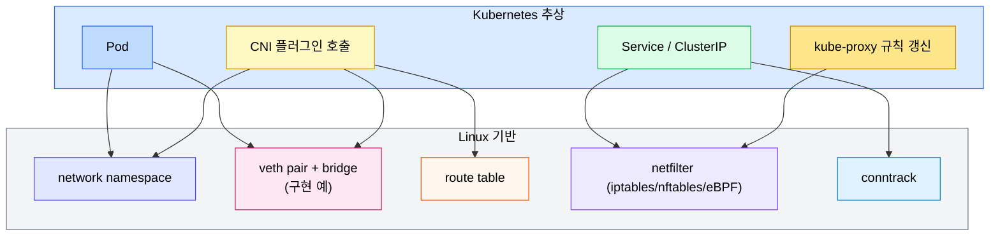
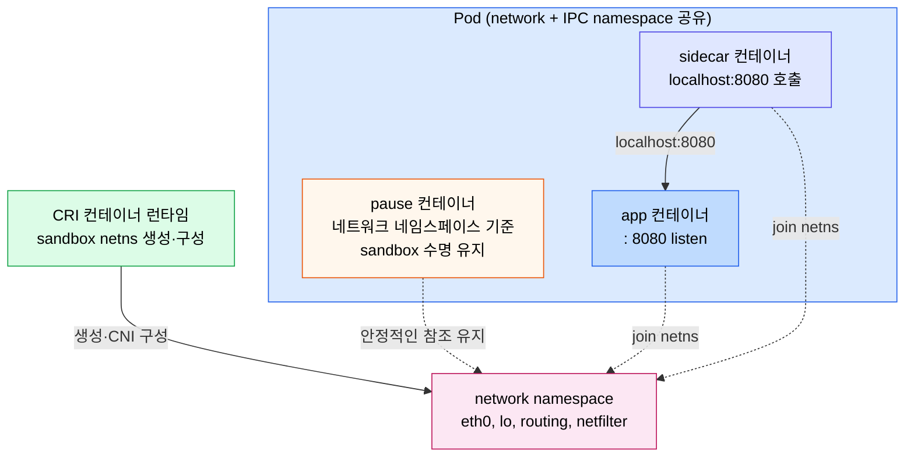
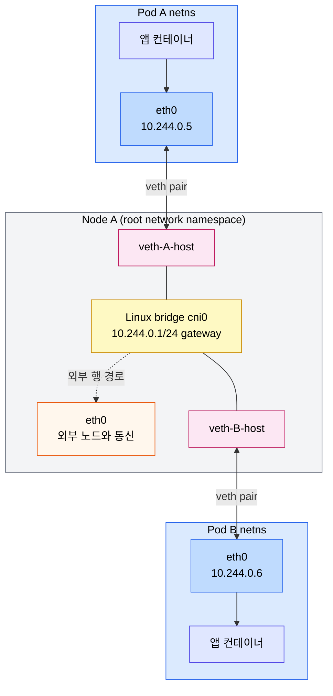
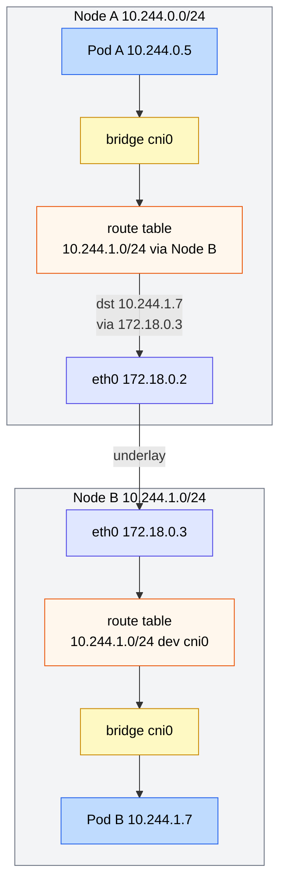
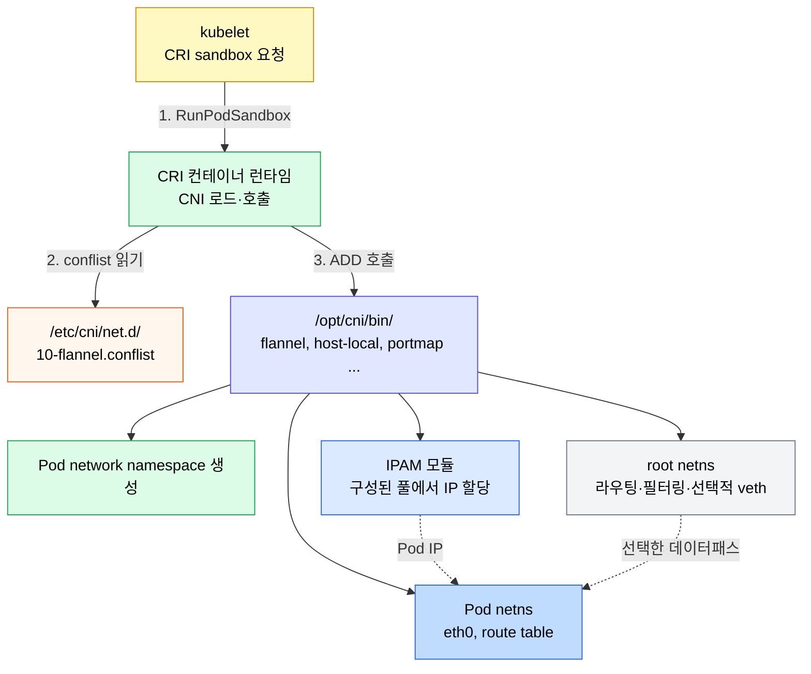
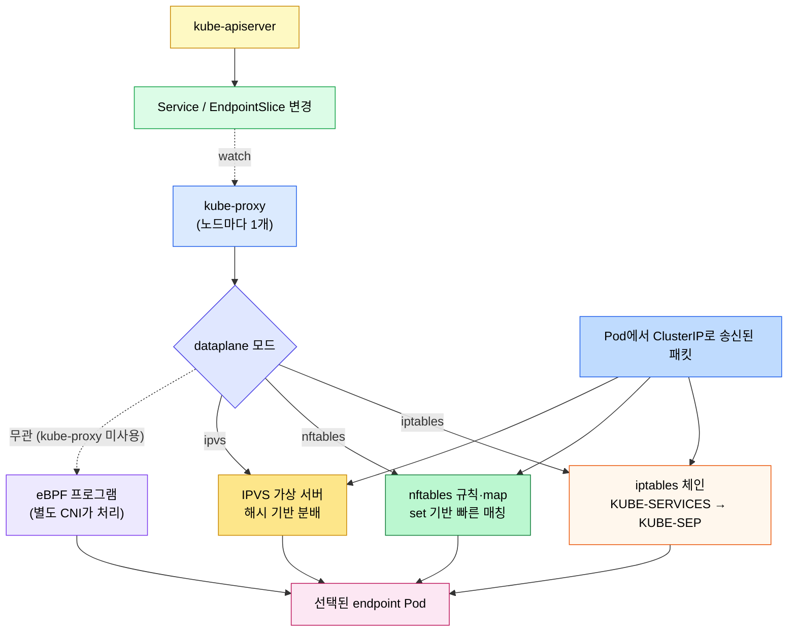
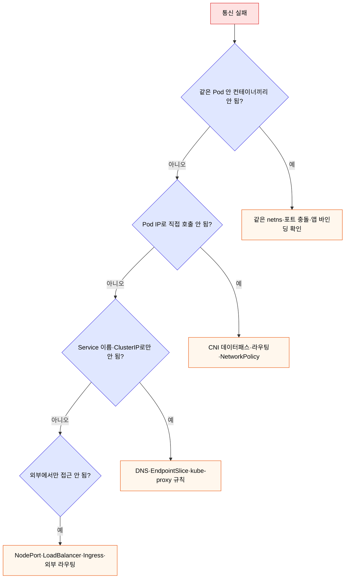

# Pod 네트워크와 Linux 기반
---
> Kubernetes 네트워킹은 새로운 기술이 아니라 Linux 네트워크 네임스페이스, veth pair, bridge, 라우팅 테이블, netfilter를 묶어 놓은 추상입니다. Pause 컨테이너부터 Pod CIDR, kube-proxy의 dataplane까지 한 줄기로 따라가면 Service나 DNS 같은 상위 추상이 어디서 시작되는지 보입니다.

[인터랙티브 시각화](04-02-pod-network.html)에서 같은 흐름을 노드 토폴로지 위에서 단계별로 따라갈 수 있습니다. 본 장은 Kubernetes 추상이 닿는 깊이까지만 다룹니다. 한 단계 더 내려가 커널 자료구조·netfilter hook·conntrack까지 보고 싶으면 [02_os/networking/01-01.네트워킹 기초](../../../02_os/networking/01-01.%EB%84%A4%ED%8A%B8%EC%9B%8C%ED%82%B9%20%EA%B8%B0%EC%B4%88.md)로 넘어가면 됩니다.


## 학습 목표
> Pod 네트워크의 Linux 기반 메커니즘을 보고, Service 위에서만 머무르던 디버깅 시야를 한 단계 아래로 넓힙니다.

이 장에서 확인할 목표는 다음과 같습니다:

1. "Kubernetes는 그냥 Linux다"라는 명제가 네트워크 영역에서 무엇을 의미하는지 설명할 수 있습니다.
2. Pause 컨테이너가 왜 존재하는지, Pod 안 다른 컨테이너와 어떻게 네트워크 네임스페이스를 공유하는지 설명할 수 있습니다.
3. bridge 기반 CNI에서 Pod 네트워크 네임스페이스와 root 네임스페이스를 veth pair가 어떻게 연결하는지 그릴 수 있습니다.
4. 노드별 Pod CIDR 모델에서 노드 간 Pod 통신이 어떤 라우팅 경로를 따르는지 설명할 수 있습니다.
5. CNI 플러그인과 kube-proxy의 dataplane(iptables, nftables, IPVS, eBPF)이 각각 어디까지 책임지는지 구분할 수 있습니다.


## 1. Linux 네트워킹 스택과 Kubernetes의 관계
> Pod 네트워킹은 새로운 프로토콜이 아니라 Linux의 네임스페이스, 라우팅, netfilter를 그대로 씁니다.

노드 한 대를 떼어 놓고 보면 일반적인 Linux 서버입니다. 외부와 통신하는 NIC(`eth0`), 라우팅 테이블, netfilter(iptables 또는 nftables) 규칙, conntrack 연결 추적이 그대로 있습니다. Kubernetes는 이 위에 컨테이너용 네트워크 네임스페이스를 만들고, 그 사이를 가상 인터페이스로 잇는 자동화 계층을 얹은 것에 가깝습니다.

KubeCon 발표에서도 강조하듯이 Pod 네트워크 트러블슈팅은 결국 두 질문으로 좁혀집니다.

1. 패킷이 어느 네임스페이스에서 어떤 인터페이스를 거쳐 어디로 가야 하는가.
2. 그 경로 위에서 netfilter가 어떤 NAT 또는 drop 규칙을 적용하는가.

두 질문은 모두 Linux 도구(`ip`, `iptables`, `nft`, `conntrack`)로 검증할 수 있습니다.

이 장의 모든 추상은 다음 매핑으로 환원됩니다:




## 2. Pause 컨테이너 — Pod의 네트워크 네임스페이스 보유자
> 노드에서 `crictl ps`나 `docker ps`를 처음 보면 정체불명의 `pause` 컨테이너가 잔뜩 있습니다. 이 컨테이너가 Pod의 네트워크와 IPC 네임스페이스를 붙잡아 두는 핵심 역할을 합니다.

Pod는 "여러 컨테이너가 같은 네트워크와 같은 IPC를 공유한다"는 추상입니다. Linux에서 이 공유는 같은 네트워크 네임스페이스에 join하는 방식으로 구현됩니다. 네임스페이스는 프로세스나 열린 파일 디스크립터 등의 참조가 남아 있는 동안 유지됩니다. Kubernetes는 특정 애플리케이션 컨테이너의 수명에 Pod sandbox를 묶지 않기 위해 별도 infra 컨테이너를 네임스페이스의 안정적인 기준으로 삼습니다.

Pause 컨테이너는 Pod마다 가장 먼저 만들어지며 공유 네임스페이스의 기준이 됩니다. 이 컨테이너는 애플리케이션 로직을 수행하지 않고 대기 상태로 남아 sandbox의 수명을 유지합니다. 다른 컨테이너는 CRI가 준비한 이 sandbox의 네임스페이스에 join합니다. Pod가 프로세스 네임스페이스까지 공유하는지는 `shareProcessNamespace` 설정에 따라 다르므로, pause가 다른 컨테이너의 자식 프로세스를 항상 수거한다고 일반화하면 안 됩니다.

이 구조 덕분에 같은 Pod 안 두 컨테이너는 `localhost`로 서로를 호출할 수 있습니다. 동일한 네트워크 스택을 공유하므로 한쪽 컨테이너의 8080 포트는 다른 컨테이너에서도 같은 8080으로 보입니다. 반대로 한 Pod 안에서 두 컨테이너가 같은 포트를 쓰려고 하면 충돌합니다.

Pod 내부 구조를 그리면 다음과 같습니다.



확인 명령은 간단합니다. 노드에 들어가 `crictl ps -a | grep pause`로 Pause 컨테이너 목록을 보고, `lsns -t net`으로 네트워크 네임스페이스가 Pod 단위로 묶여 있는 모습을 확인할 수 있습니다.


## 3. 네트워크 네임스페이스 — Linux 네트워크 스택의 격리된 복사본
> 네트워크 네임스페이스는 가상 머신이 아니라 Linux 커널이 제공하는 "스택 한 벌의 격리"입니다. 이 격리 덕분에 같은 노드 안에서도 여러 Pod가 8080 포트를 동시에 쓸 수 있습니다.

네트워크 네임스페이스는 이름 그대로 네트워크 자원의 이름공간입니다. 인터페이스 목록, 라우팅 테이블, ARP 캐시, netfilter 룰셋, 그리고 포트 점유 상태가 네임스페이스마다 별도로 존재합니다. `ip netns add demo` 한 번이면 새 네임스페이스가 만들어지고, 그 안에서는 외부 노드의 `eth0`가 보이지 않습니다.

이 모델이 컨테이너 네트워크의 핵심입니다. Nginx 컨테이너 5개를 같은 노드에서 띄워도 각자 다른 네임스페이스에 있으면 모두 80 포트를 점유할 수 있습니다. 노드의 root 네임스페이스 입장에서는 그냥 5개의 격리된 가상 인터페이스가 추가된 것일 뿐입니다.

네임스페이스 안에는 보통 두 인터페이스가 있습니다.

- `lo`: 루프백. `localhost` 통신용
- `eth0`: 이 네임스페이스의 외부 통신용 가상 NIC입니다. veth pair의 한쪽이 여기 붙습니다.

Pod 안에서 `ip addr`을 실행하면 일반적으로 `eth0`에 Pod IP가 설정된 모습을 볼 수 있습니다. 다만 주소 범위, 기본 게이트웨이, 호스트 연결 방식은 CNI와 IPAM 구성에 따라 다릅니다. 예를 들어 bridge 기반 플러그인은 veth와 bridge 게이트웨이를 쓰지만, 다른 플러그인은 라우팅이나 eBPF 데이터패스를 쓸 수 있습니다.


## 4. veth pair와 Linux bridge — 대표적인 Pod 연결 모델
> veth pair의 한쪽을 Pod에 두고 반대쪽을 노드의 bridge에 연결하는 구조는 대표적인 CNI 구현 예입니다. 모든 CNI가 bridge를 쓰는 것은 아닙니다.

veth pair는 양 끝이 가상 NIC인 케이블 같은 자료구조입니다. 한쪽으로 들어간 패킷은 곧바로 반대쪽으로 나옵니다. bridge 기반 CNI는 이 pair를 만들어 한쪽을 Pod 네임스페이스로 옮기고 반대쪽을 노드의 Linux bridge에 붙입니다.

Linux bridge는 노드 root 네임스페이스에 있는 가상 L2 스위치입니다. 같은 bridge에 꽂힌 veth들은 ARP를 통해 서로 직접 통신할 수 있습니다. 즉, 같은 노드의 두 Pod 사이 트래픽은 노드 NIC을 거치지 않고 bridge 안에서 끝납니다. 노드 외부로 나가야 하는 트래픽만 노드의 라우팅 테이블과 `eth0`를 탑니다.

같은 노드 두 Pod 사이의 패킷 흐름을 그리면 다음과 같습니다.



이 그림은 bridge 기반 CNI의 같은 노드 Pod-to-Pod 경로를 보여 줍니다. Service나 DNS는 아직 등장하지 않았으며, 다른 CNI는 bridge 대신 라우팅이나 eBPF 데이터패스로 같은 도달성을 구현할 수 있습니다.


## 5. Pod CIDR과 노드 라우팅 — 노드별 CIDR 모델
> 클러스터 CIDR을 노드별로 나누고 노드를 라우터로 쓰는 구조는 대표적인 구현 방식입니다. CNI가 독자 IPAM을 쓰거나 다른 데이터패스를 쓰면 `spec.podCIDR`과 bridge 경로가 이 그림과 다를 수 있습니다.

Kubernetes node IPAM을 쓰는 구성에서는 `kubectl get nodes -o yaml`로 노드별 `spec.podCIDR`을 확인할 수 있습니다. 예를 들어 worker-1은 `10.244.0.0/24`, worker-2는 `10.244.1.0/24`, worker-3은 `10.244.2.0/24`를 받을 수 있습니다. 이 모델의 CNI는 해당 노드에 할당된 범위에서 Pod IP를 분배합니다.

노드 간 Pod 통신은 이 분할을 이용합니다. 패킷의 목적지가 자기 /24 안이면 bridge로 보내고, 다른 노드의 /24면 라우팅 테이블이 그 노드의 외부 IP로 패킷을 보냅니다. KubeCon 발표가 보여 준 `ip route` 출력이 이 구조를 한눈에 드러냅니다.

```pseudocode
default via 172.18.0.1 dev eth0
10.244.0.0/24 dev cni0 scope link        # 자기 노드 Pod CIDR
10.244.1.0/24 via 172.18.0.3 dev eth0    # worker-2를 통해
10.244.2.0/24 via 172.18.0.4 dev eth0    # worker-3을 통해
```

이 예제의 핵심은 노드가 다른 노드의 Pod CIDR로 가는 라우팅 항목을 갖는다는 점입니다. 클라우드 라우팅 테이블, VXLAN 오버레이, BGP, eBPF 데이터패스는 이 도달성을 서로 다른 위치와 방식으로 구현합니다.

노드 간 흐름을 그리면 다음과 같습니다.



이 모델이 깨지는 가장 흔한 사례 두 가지를 기억해 두면 디버깅이 빠릅니다.

1. 노드 간 underlay에서 Pod CIDR 트래픽이 막힌 경우. 클라우드 보안 그룹, 사내 방화벽, MTU 문제일 때가 많습니다.
2. Pod CIDR이 사내망과 겹치는 경우. Pod에서 사내 서비스 IP를 호출했는데 클러스터 내부로만 라우팅돼 사내 망에 가지 못하는 식입니다.


## 6. CNI 플러그인의 실제 동작
> CNI는 표준이고, Kubernetes 1.24 이후에는 CRI 컨테이너 런타임이 CNI 설정과 플러그인을 로드해 Pod sandbox 네트워크를 구성합니다.

CNI(Container Network Interface)는 OCI에서 분리된 작은 표준입니다. 핵심은 두 가지뿐입니다.

1. 노드 위 `/etc/cni/net.d/*.conflist` 같은 설정 파일에서 사용할 플러그인 체인을 정합니다.
2. kubelet의 CRI 요청을 받은 컨테이너 런타임이 설정된 CNI 플러그인 체인을 호출합니다.

플러그인이 받는 명령은 `ADD`, `DEL`, `CHECK`, `VERSION`처럼 단순합니다. `ADD`가 들어오면 플러그인은 구현에 맞는 인터페이스·주소·라우팅을 구성합니다.

1. Pod 네트워크 네임스페이스에 인터페이스와 루프백을 준비합니다.
2. IPAM 플러그인이나 CNI 자체 IPAM으로 Pod IP를 할당합니다.
3. 선택한 데이터패스에 맞게 Pod와 노드의 라우팅·필터링·오버레이 상태를 구성합니다.

공통점은 런타임이 CNI 계약을 통해 Pod 네트워크를 준비한다는 점입니다. Calico의 BGP, Flannel의 VXLAN, Cilium의 eBPF처럼 IPAM과 데이터패스 구현은 서로 다릅니다.

kubelet, 컨테이너 런타임, CNI의 관계를 그리면 다음과 같습니다.



CNI 디버깅이 필요할 때 가장 먼저 보는 것은 다음 셋입니다.

```bash
ls /etc/cni/net.d/
cat /etc/cni/net.d/10-*.conflist
journalctl -u kubelet | grep -i cni
```

플러그인 바이너리가 `/opt/cni/bin/`에 빠져 있거나 conflist와 IPAM 설정이 어긋나면 새 Pod가 `ContainerCreating`에서 멈춥니다.


## 7. kube-proxy의 dataplane — iptables, nftables, IPVS, eBPF
> CNI는 Pod끼리 닿게 만들고, kube-proxy는 그 위에서 Service VIP 트래픽을 endpoint로 라우팅합니다. 같은 일을 어떤 Linux 도구로 구현하느냐가 dataplane 모드 선택입니다.

kube-proxy는 노드마다 떠 있는 단순한 프로세스입니다. API 서버를 watch해 Service와 EndpointSlice 변경을 받고, 각 노드의 netfilter 규칙을 그 변경에 맞게 갱신합니다. Pod에서 ClusterIP로 보낸 패킷이 실제 Pod IP로 DNAT 되는 그 규칙이 여기서 만들어집니다.

dataplane 구현 모드는 네 가지를 같은 자리에서 비교해 두면 좋습니다.

| 모드 | 메커니즘 | 규칙 매칭 | 노트 |
|------|----------|----------|------|
| iptables | netfilter (xtables) 규칙 체인 | O(n) 선형 | 작은 클러스터의 오랜 기본값 |
| nftables | netfilter (nft) 규칙 + map | 해시 기반 O(1) | 1.31에서 beta, 1.33 GA. 명시적으로 선택하는 차세대 모드 |
| IPVS | 커널 IP Virtual Server + iptables | 해시 기반 O(1) | Kubernetes 1.35부터 deprecated, 대체는 nftables 모드 |
| eBPF | 커널 훅에서 직접 처리 | 프로그램 가능 | Cilium 등 CNI가 kube-proxy 자체를 대체할 때 사용 |

KubeCon 발표 이후 가장 큰 변화는 nftables 모드의 부상입니다. iptables 모드는 Service 수가 늘면 `iptables-save | wc -l`이 수만 줄까지 커지고, 규칙 체인 선형 탐색 때문에 첫 패킷 지연이 올라갑니다. nftables 모드는 같은 의미를 새로운 nft 표현으로 다시 적되 map과 set 자료구조를 활용해 Service 수가 늘어도 매칭 시간을 일정하게 유지합니다.

운영 판단 기준은 단순합니다. kube-proxy의 기본은 여전히 iptables 모드이며, nftables를 쓰려면 `--proxy-mode nftables` 또는 설정 파일의 `mode: nftables`로 명시해야 합니다. 큰 클러스터에서 iptables 규칙 갱신과 첫 패킷 지연이 문제라면 nftables 전환을 검토할 수 있습니다. eBPF는 단순히 "kube-proxy 모드를 바꾸는" 수준이 아니라 CNI를 통째로 바꾸는 결정이라 별도 검토가 필요합니다.

nftables 모드는 Linux 커널 5.13 이상과 `nft` 1.0.0 이상이 필요합니다. iptables 모드와 호환성도 완전히 같지 않습니다. 예를 들어 nftables 모드의 NodePort는 기본적으로 노드의 기본 IP에서만 도달할 수 있어, iptables 모드에서 로컬 루프백을 포함한 여러 주소로 NodePort를 쓰던 검증 절차는 그대로 유지되지 않습니다. 전환 전에 커널·`nft` 버전, NodePort 접근 주소, 로컬 방화벽과 모니터링 스크립트의 호환성을 검증합니다.

NetworkPolicy는 kube-proxy 모드의 부가 기능이 아닙니다. 정책 지원 여부와 실제 필터링 위치는 CNI 플러그인의 구현에 따라 결정됩니다.

IPVS 모드는 성능을 위한 신규 대규모 클러스터 선택지로 보면 안 됩니다. Kubernetes 1.35에서 deprecated되었으며, Kubernetes 프록시 의미를 더 잘 구현하는 nftables 모드가 성능 중심의 대체 경로입니다. 기존 IPVS 클러스터는 바로 제거되는 것은 아니지만, 새 구성은 nftables의 전환 조건을 우선 검토합니다.

kube-proxy 동작 모형은 다음과 같습니다.




## 8. 점검 질문
> 본문 개념을 운영 판단 질문으로 다시 점검합니다.

### Q1. Pause 컨테이너가 죽으면 Pod 안의 다른 컨테이너에 무슨 일이 일어나는가?

Pause는 Pod sandbox를 대표하고 공유 네임스페이스의 기준이 됩니다. Pause 프로세스가 종료해도 다른 컨테이너가 같은 netns를 참조하고 있다면 커널의 참조가 남아 즉시 삭제되지 않습니다. 다만 CRI가 Pod sandbox 상태를 잃었다고 판단하면 kubelet은 sandbox와 연결된 애플리케이션 컨테이너를 재생성해 새 네트워크 컨텍스트로 옮깁니다.

운영자에게는 Pod sandbox 재생성 동안의 잠깐 끊김과 컨테이너 재시작으로 보입니다. Pause 자체의 안정성 문제로 이런 일이 일어나는 경우는 드물고, 대부분은 노드의 메모리 압박이나 런타임·sandbox 오류가 원인입니다.

`kubectl describe pod`는 애플리케이션 컨테이너 상태를 보는 데는 유용하지만, Pod sandbox나 pause 프로세스의 OOM 원인을 항상 노출하지는 않습니다. sandbox 재생성 원인은 `crictl pods -a`, `crictl inspectp <sandbox-id>`, 컨테이너 런타임 로그, kubelet 로그, 그리고 노드의 kernel·OOM 로그를 함께 보며 확인합니다.

### Q2. 같은 Pod 안 두 컨테이너가 같은 포트에서 listen하면 어떻게 되는가?

Pod 안 컨테이너는 같은 netns를 공유하므로 IP와 포트도 한 풀에 있습니다. 두 컨테이너가 같은 포트에서 listen 시도하면 두 번째 컨테이너의 `bind`는 `EADDRINUSE`로 실패합니다. 사이드카 패턴에서 Envoy가 9090에 listen하는데 메인 컨테이너도 9090에 메트릭 endpoint를 두려는 경우가 흔한 충돌입니다.

해결은 각 컨테이너의 listen 포트를 분리하는 것입니다. 옛 K8s에서는 hostNetwork 같은 트릭이 쓰였지만 보안 비용이 큽니다. 메인은 8080·메트릭은 9090, Envoy admin은 9901처럼 명시적으로 분리합니다.

### Q3. 노드별 Pod CIDR 모델에서 CIDR이 다른 이유와 충돌 시 증상은?

노드별 CIDR 모델에서는 각 노드가 겹치지 않는 주소 블록을 받습니다. controller-manager의 `--allocate-node-cidrs=true`와 `--cluster-cidr=10.244.0.0/16` 같은 설정을 사용하면 노드마다 `10.244.1.0/24`, `10.244.2.0/24` 식으로 분배할 수 있습니다. 독자 IPAM을 쓰는 CNI는 다른 방식으로 주소 풀을 관리할 수 있습니다.

CIDR이 충돌하거나 잘못 분배되면 두 노드가 같은 Pod IP를 만들 수 있습니다. 증상은 "두 Pod의 IP가 같은데 어느 노드 응답이 돌아올지 알 수 없는" 라우팅 혼란입니다. iptables/ipvs 규칙이 한 IP에 두 backend를 만드는 식의 사고가 따라옵니다. `kubectl get nodes -o jsonpath='{.items[*].spec.podCIDR}'`로 노드별 CIDR을 확인해 충돌이 없는지 봅니다.

### Q4. CNI 플러그인 변경(flannel → calico)을 무중단으로 할 수 있는가?

거의 불가능합니다. CNI는 노드의 라우팅·iptables 설정을 직접 만들고, Pod의 netns를 그 위에서 구성합니다. 플러그인 교체 중에는 두 CNI의 dataplane이 같은 노드에서 충돌하므로 일관성 깨진 상태가 됩니다.

실무 절차는 노드 단위 cordon·drain → CNI 교체 → 노드 재가입입니다. 클러스터 전체로 보면 Rolling 방식이지만, 같은 노드의 Pod는 CNI 교체 동안 잠시 끊기거나 다시 만들어집니다. Multus는 Pod에 보조 네트워크 인터페이스를 추가하는 멀티 네트워크 구성용이며, 기본 CNI의 무중단 교체를 보장하는 기능은 아닙니다.

### Q5. kube-proxy의 iptables·IPVS·eBPF 모드는 운영 시 무엇이 다른가?

`iptables` 모드는 가장 호환성이 높고 단순합니다. Service 1개당 chain이 추가되므로 Service 수가 1만 단위로 늘면 룰 평가 비용이 선형으로 증가합니다. 작은~중간 클러스터에 충분합니다.

`IPVS` 모드는 해시 테이블로 Service를 찾지만, kube-proxy가 필요로 하는 일부 의미를 IPVS API에 맞추기 어렵고 iptables도 함께 사용합니다. Kubernetes 1.35부터 deprecated이므로 신규 대규모 클러스터는 IPVS 대신 nftables 모드를 우선 검토합니다.

`eBPF` 기반 kube-proxy 대체는 Cilium이 커널 훅에 프로그램을 로드해 Service 트래픽을 처리하는 방식입니다. 성능은 워크로드, 커널 버전, Cilium 설정, 사용하는 tc·XDP 모드에 따라 달라지므로 항상 가장 빠르다고 단정할 수 없습니다. 연결 추적 또한 설정에 따라 eBPF map을 활용하거나 Linux netfilter conntrack과 상호작용할 수 있으므로 "conntrack을 자체 관리한다"고 일괄 설명하면 안 됩니다. 매니지드 Kubernetes에서는 커널과 네트워크 기능 제약도 확인해야 합니다.

### Q6. veth를 쓰는 CNI에서 pair 한쪽이 손상되면 어떻게 발견하는가?

`ip -n <netns> link`로 Pod 안에서 `eth0` 상태를, 호스트 root netns에서 `ip link`로 짝(`veth-xxxx`) 상태를 봅니다. 한쪽만 `DOWN`이면 짝이 손상된 것입니다.

증상은 "Pod 내부에서 외부로 ping이 안 가지만 컨테이너는 살아 있음"입니다. `tcpdump -i veth-xxxx`로 호스트 측에서 패킷이 들어오는지 확인하고, 없으면 Pod 내부 발신 자체가 막힌 것입니다. 주로 CNI 플러그인 버그나 노드 커널 issue가 원인이라 임시 해결은 Pod를 다른 노드로 옮기는 것입니다.

### Q7. Pod IP가 외부에서 직접 접근되지 않는 이유는?

Pod IP는 클러스터 내부 routable subnet 안에서만 유효합니다. 노드 간에는 CNI가 라우팅을 만들지만, 외부 인터넷은 그 routing table을 모릅니다. 외부에서 Pod에 직접 도달하려면 LoadBalancer Service나 NodePort, Ingress를 통해 NAT돼야 합니다.

외부에서 Pod IP로 직접 도달하는 경로가 NetworkPolicy를 자동으로 우회하는 것은 아닙니다. 정책을 지원하는 CNI가 해당 ingress 경로에서 필터를 적용하면 Pod IP로 직접 온 트래픽도 정책 평가를 받습니다. 다만 CNI별 정책 구현, `hostNetwork` Pod, 노드 트래픽 처리는 다르므로 외부 경로의 적용 범위를 사전에 검증해야 합니다. 안정적인 진입점과 주소 추상화가 필요하면 Service를 사용합니다.

### Q8. Kubernetes 네트워킹의 4규칙을 잊었을 때 어떤 사고가 생기는가?

본문에 정리된 4규칙(NAT 없는 Pod-to-Pod, NAT 없는 노드-to-Pod, Pod의 자기 IP 인식, Service VIP를 통한 안정 진입)을 어기면 다양한 사고가 납니다. NAT를 끼우면 NetworkPolicy의 source IP 매칭이 깨져 정책이 의도와 다르게 작동하고, Pod가 자기 IP를 모르면 메트릭 라벨링·로깅에서 잘못된 IP가 찍힙니다.

특히 hostNetwork: true를 켠 Pod는 노드 IP를 그대로 쓰므로 4규칙의 1·2번이 깨집니다. 호스트 IP 접근이 필요한 시스템 Pod 외에는 hostNetwork를 쓰지 않는 편이 안전합니다.


## 9. Kubernetes 네트워킹 4규칙 정리
> KubeCon 발표는 Kubernetes 네트워크의 모든 통신 패턴을 네 가지 규칙으로 압축해 보여 줍니다. 디버깅 진입점 선택에 그대로 쓸 수 있습니다.

규칙 자체는 단순하지만, 각 규칙 뒤에 어떤 Linux 메커니즘이 깔려 있는지 같이 알면 장애 분리가 빨라집니다.

| 규칙 | 통신 패턴 | Linux 기반 | 진단 진입점 |
|------|----------|-----------|------------|
| 1 | 같은 Pod 안 컨테이너 끼리 | 같은 netns + `lo` | Pod 안에서 `localhost:port` 동작 확인 |
| 2 | Pod ↔ Pod | CNI 데이터패스(예: veth + bridge, 라우팅, eBPF) | Pod IP 직접 ping/curl |
| 3 | Pod ↔ Service | DNS + netfilter (DNAT) + conntrack | DNS 분리 검증, EndpointSlice 확인 |
| 4 | 외부 ↔ Service | NodePort/LoadBalancer + Ingress + netfilter (SNAT/DNAT) | 노드 NIC에서 패킷 캡처, Ingress 로그 |

세 번째와 네 번째 규칙에서 처음으로 Service라는 추상이 등장합니다. 그 이전(1, 2)은 모두 CNI와 Linux 자체 기능만으로 끝납니다. "통신이 안 된다"고 할 때 어느 규칙에서 깨졌는지 결정하지 않으면 디버깅이 무한히 길어집니다.

진단 순서를 그림으로 잡으면 다음과 같습니다.




## 다음 단계
> Pod 네트워크의 Linux 기반을 잡았으면, 그 위에서 Service와 DNS가 어떻게 추상을 얹는지 다시 읽으면 흐름이 다르게 보인다.

- Service VIP가 어떻게 endpoint로 풀리는지: [Service와 EndpointSlice](04-04.Service%EC%99%80%20EndpointSlice.md)
- Service 이름 해석과 CoreDNS 운영: [DNS와 CoreDNS](04-05.DNS%EC%99%80%20CoreDNS.md)
- 외부 진입과 라우팅: [Ingress와 Gateway API](04-06.Ingress%EC%99%80%20Gateway%20API.md)
- 단계별 패킷 흐름을 직접 따라가고 싶다면: [인터랙티브 시각화](04-02-pod-network.html)


## 관련 문서
> 본 장과 짝을 이루는 점검 문서, 그리고 한 단계 위 메시 계층 문서를 함께 둡니다.

- [네트워킹](04-01.%EB%84%A4%ED%8A%B8%EC%9B%8C%ED%82%B9.md) — Ch04 전체 지도
- [서비스 메시 기초](../../service-mesh/01_foundation/01-01.%EC%84%9C%EB%B9%84%EC%8A%A4%20%EB%A9%94%EC%8B%9C%20%EA%B8%B0%EC%B4%88.md) — 본 장 위에서 L7 정책이 추가될 때 어디가 바뀌는지
