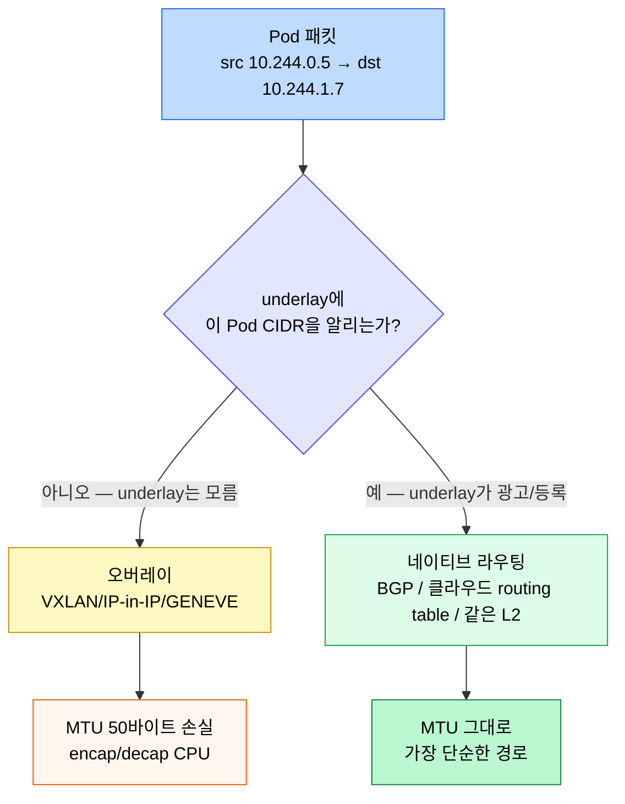
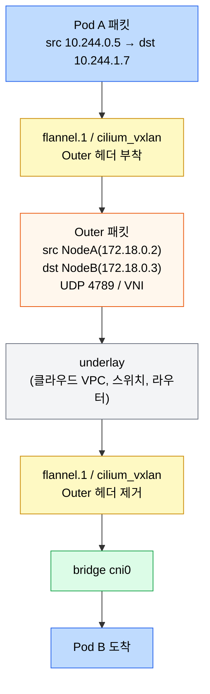
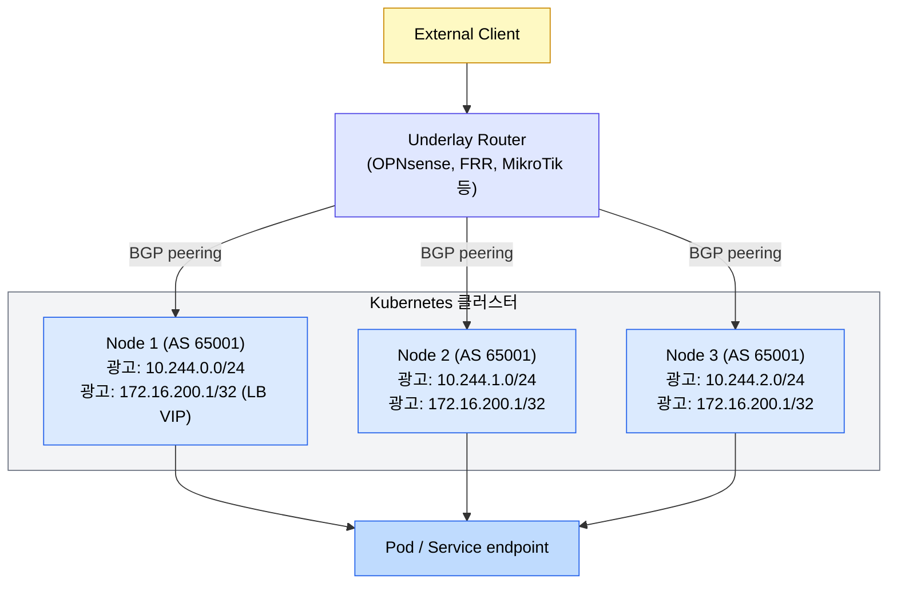

# 오버레이와 노드 간 트래픽
---
> 노드 간 Pod 트래픽을 운반하는 방식은 두 갈래입니다. 패킷을 한 번 더 감싸는 오버레이(VXLAN, IP-in-IP)와, 그대로 라우팅하는 네이티브 라우팅입니다. 그 위에 외부 LoadBalancer를 올리려면 클라우드가 없는 환경에서는 BGP나 MetalLB 같은 별도 메커니즘이 필요합니다. 04-02가 한 노드 안의 Pod 네트워크를 다뤘다면, 본 장은 그 너머 노드 사이와 외부 진입까지를 잇습니다.

[인터랙티브 시각화](04-03-overlay-bgp.html)에서 같은 흐름을 단계별로 따라갈 수 있습니다.


## 학습 목표
> 클러스터 외부에서 Pod까지 트래픽이 닿는 경로를 underlay 인프라 관점에서 설명할 수 있게 만듭니다.

이 장에서 확인할 목표는 다음과 같습니다:

1. VXLAN 오버레이가 어떤 헤더 구조로 노드 간 패킷을 캡슐화하는지 그릴 수 있습니다.
2. 오버레이와 네이티브 라우팅의 MTU·CPU 트레이드오프를 비교할 수 있습니다.
3. Cilium의 IPAM 모드(`kubernetes` vs `cluster-pool`) 차이가 운영에 어떤 위험을 만드는지 설명할 수 있습니다.
4. Cilium BGP 컨트롤 플레인이 Pod CIDR과 LoadBalancer VIP를 외부 라우터로 광고하는 방식을 설명할 수 있습니다.
5. MetalLB의 L2 모드와 BGP 모드, ECMP 경로 제한이 가용성과 분산에 미치는 영향을 판단할 수 있습니다.


## 1. 노드 간 Pod 트래픽의 두 갈래
> Pod CIDR은 Kubernetes 안에서만 유효한 가상 네트워크입니다. 그 패킷을 노드 underlay(클라우드 VPC, 사내 IP 망)에 태우는 방식이 오버레이냐 네이티브 라우팅이냐로 갈립니다.

오버레이는 Pod 패킷을 노드 IP 헤더로 한 번 더 감쌉니다. 노드 사이 underlay는 자기가 운반하는 안쪽 패킷이 무엇인지 모르며, 단지 노드 IP 사이의 트래픽으로만 봅니다. 대표 구현은 VXLAN(UDP 4789 위 L2 over L3), IP-in-IP, GENEVE입니다.

네이티브 라우팅은 캡슐화 없이 Pod IP 그대로 underlay를 탑니다. 그러려면 underlay가 "어느 노드가 어떤 Pod CIDR을 책임지는가"를 알아야 합니다. 클라우드 라우팅 테이블에 직접 항목을 박는 방식, BGP로 광고하는 방식, 같은 L2 세그먼트 안에서 ARP로 푸는 방식이 있습니다.



선택은 클러스터가 위치한 underlay에 달려 있습니다. 클라우드는 보통 SDN이 BGP나 routing table 통합을 제공하므로 네이티브 라우팅이 자연스럽습니다. 사내 다중 서브넷이나 통제권 없는 네트워크 위에서는 오버레이가 가장 일반적인 선택입니다.


## 2. VXLAN 오버레이의 헤더와 흐름
> VXLAN은 L2 프레임을 UDP 위에 실어 노드 IP 사이로 옮기는 표준입니다. 캡슐화된 패킷을 풀고 감싸는 위치만 잘 잡아 두면 동작이 직관적입니다.

VXLAN 헤더는 24비트 VNI(VXLAN Network Identifier)를 가지며, UDP 4789 포트 위에 얹힙니다. Outer IP 헤더가 노드 IP, Inner Ethernet/IP 헤더가 원래 Pod 패킷입니다. 한 패킷이 추가로 메는 무게는 50바이트(Outer IP 20 + UDP 8 + VXLAN 8 + Inner Ethernet 14)입니다. underlay MTU가 1500이면 Pod 입장에서 쓸 수 있는 MTU는 1450으로 줄어듭니다.

흐름은 단순합니다. CNI가 만든 오버레이 인터페이스(Flannel의 `flannel.1`, Cilium의 `cilium_vxlan` 등)가 outer 헤더를 붙여 노드 NIC로 빼고, 반대편 노드의 같은 인터페이스가 헤더를 떼어 bridge 또는 veth로 보냅니다.



오버레이가 만드는 흔한 함정 두 가지를 알아 두면 시간을 아낄 수 있습니다.

1. MTU 미설정. underlay MTU가 1500이고 Pod에 그대로 1500을 주면 VXLAN 헤더를 못 붙이는 점보 패킷이 fragment 되거나 drop 됩니다. CNI가 자동으로 1450을 잡지 않는 경우 명시적으로 설정합니다.
2. UDP 4789 차단. 사내 방화벽이 UDP를 막거나 ECMP 해싱이 깨져 노드 간 통신이 일부만 되는 사례가 있습니다.


## 3. 네이티브 라우팅과 IPAM 모드
> 캡슐화 없이 Pod 패킷이 underlay를 흐르려면, "어느 노드가 어떤 Pod CIDR을 책임지는지" underlay에 알려야 합니다. CNI의 IPAM 모드와 라우팅 광고 방식이 그 통로입니다.

Cilium은 두 IPAM 모드를 제공합니다.

`kubernetes` 모드는 노드의 `spec.podCIDR`을 그대로 씁니다. kubeadm/Kubespray가 `--pod-network-cidr`로 잘라 놓은 /24를 노드별로 따라가므로 다른 CNI와의 호환성이 좋습니다.

`cluster-pool` 모드는 Cilium 자체가 클러스터 풀(`clusterPoolIPv4PodCIDRList`)을 관리하고 Cilium 노드 객체에 별도 CIDR을 발급합니다. Kubernetes의 `podCIDR`과 무관해집니다. Cilium 단독 운영 환경에서는 이 모드가 더 유연합니다.

두 모드를 섞어 쓰면 안 된다는 점이 운영의 핵심입니다. 발표에서 공유된 실제 사고 사례를 그대로 기억해 두면 좋습니다. 이미 `cluster-pool`로 운영 중이던 클러스터에서 Helm 차트 업그레이드 도중 `ipam.mode`를 `kubernetes`로 잘못 바꿔 머지하면서 노드의 Pod CIDR이 갑자기 바뀌었고, Pod 간 통신이 전부 끊겼습니다. Cilium 자체는 헬름 롤백으로 복구됐지만, 그 사이 헬스체크 실패로 분산 DB 클러스터의 정합성이 깨져 추가 복구 작업이 필요했습니다.

이 사례에서 배울 두 가지는 다음과 같습니다. CNI 설정 변경은 클러스터 전체 영향이라 평상시 Day-2 변경 절차가 아니라 클러스터 재구성에 가까운 신중함이 필요합니다. 그리고 IPAM 모드처럼 한 번 정해지면 되돌리기 어려운 옵션은 클러스터 최초 설계 단계에서 못박고, 그 이후로는 Helm values diff를 두 사람 이상이 점검한 다음에야 적용합니다.


## 4. Cilium BGP 컨트롤 플레인
> 네이티브 라우팅을 underlay 라우터까지 잇는 가장 깔끔한 방법은 BGP입니다. Cilium은 BGP 컨트롤 플레인을 내장해 Pod CIDR과 LoadBalancer VIP를 외부 라우터에 직접 광고합니다.

Cilium BGP는 각 노드가 Cilium agent 안에서 BGP 스피커가 되는 구조입니다. 현행 설정에서는 `CiliumBGPClusterConfig`가 노드별 BGP 인스턴스와 피어를 선택하고, `CiliumBGPPeerConfig`가 타이머·인증·address family를 공유하며, `CiliumBGPAdvertisement`가 Pod CIDR과 Service VIP 등 광고할 prefix를 정의합니다. Cilium operator는 이 설정을 노드별 `CiliumBGPNodeConfig`로 변환합니다.

Cilium BGP Control Plane은 외부 라우터에 경로를 광고할 뿐 Cilium 데이터패스를 프로그래밍하지 않습니다. 클러스터 내부의 Pod 도달성은 CNI 라우팅·터널·eBPF 설정이 별도로 제공해야 합니다.

광고할 수 있는 prefix는 두 가지입니다. 하나는 노드의 Pod CIDR로, 외부 라우터가 "10.244.1.0/24는 노드 B의 IP로 가라"는 라우팅을 학습합니다. 다른 하나는 LoadBalancer Service의 외부 IP로, 동일 VIP를 여러 노드가 광고하면 ECMP로 분산됩니다.



여기서 짚고 갈 사실 두 가지가 있습니다. BGP는 본래 라우팅 프로토콜이지 로드밸런서가 아닙니다. 같은 prefix가 여러 next-hop으로 광고되면 BGP는 보통 가장 비용이 낮은 한 경로만 고르고 나머지는 standby로 둡니다. 분산을 위해서는 라우터에서 ECMP(Equal-Cost Multi-Path)를 명시적으로 켜야 합니다.

ECMP의 최대 경로 수와 해싱 방식은 라우터 구현에 따라 다릅니다. 따라서 노드 수가 많은 클러스터는 특정 장비의 고정된 수치를 일반화하지 말고, 사용 중인 라우터의 공식 사양과 실제 라우팅 테이블로 수용 가능한 next-hop 수를 검증해야 합니다.


## 5. MetalLB — 클라우드 없는 LoadBalancer
> 사내·홈랩처럼 클라우드 컨트롤러 매니저가 없는 환경에서 `type: LoadBalancer`를 살리는 가장 흔한 선택이 MetalLB입니다. L2 모드와 BGP 모드 두 갈래입니다.

L2 모드는 같은 L2 세그먼트 안에서 ARP/NDP로 VIP를 한 노드가 책임집니다. 그 노드 NIC의 MAC이 VIP의 ARP 응답을 차지합니다. 설정이 가장 단순하지만 모든 트래픽이 한 노드에 몰리는 단점이 있고, 그 노드가 죽으면 다른 노드로 페일오버하기까지 ARP 재광고 시간만큼 짧은 끊김이 생깁니다.

BGP 모드는 Cilium BGP와 같은 원리로 VIP를 외부 라우터로 광고합니다. ECMP가 켜져 있으면 여러 노드로 분산되고, 라우팅 컨버전스 시간 안에 페일오버가 끝납니다. 다만 라우터가 BGP를 이해해야 하고 ASN 설계가 필요합니다.

| 항목 | L2 모드 | BGP 모드 |
|------|---------|----------|
| 부하 분산 | 한 노드가 단독 | ECMP로 여러 노드 |
| 페일오버 시간 | 수 초 (ARP 캐시) | 수 초 (BGP 컨버전스) |
| 라우터 요구사항 | 없음 (같은 L2) | BGP 지원 |
| 적합한 환경 | 홈랩, 단일 서브넷 | 데이터센터, 여러 서브넷 |
| 클라우드 가능 | AWS는 ARP 차단으로 불가 | 클라우드 종속적 |

Cilium BGP Control Plane과 MetalLB BGP 모드는 같은 클러스터에 공존할 수 있습니다. 문제는 두 컨트롤러가 같은 Service VIP나 Pod prefix를 동시에 소유·광고할 때 생기며, 이 경우 중복 경로와 예상하지 못한 next-hop이 만들어질 수 있습니다. 함께 사용하려면 예를 들어 Cilium은 Pod CIDR만, MetalLB는 별도 IP 풀의 Service VIP만 광고하도록 selector와 주소 풀을 분리합니다. 하나의 컨트롤러로 통합할지는 운영 복잡도와 광고 소유권을 기준으로 판단합니다.


## 6. 점검 질문
> 본문 개념을 운영 판단 질문으로 다시 점검합니다.

### Q1. VXLAN 오버레이의 MTU는 왜 1450(또는 1430)으로 자주 설정되나?

VXLAN은 원본 이더넷 프레임을 UDP로 캡슐화합니다. 외부 IP 헤더(20) + UDP 헤더(8) + VXLAN 헤더(8) + 내부 이더넷 헤더(14) 합 50바이트의 오버헤드가 추가됩니다. 노드 간 물리 MTU가 1500이면 안쪽 페이로드가 가질 수 있는 최대치는 1450입니다.

MTU를 잘못 설정하면 큰 패킷이 fragment되거나 ICMP `Fragmentation Needed`가 차단된 환경에서 PMTUD가 깨져 무음 패킷 손실이 일어납니다. 증상은 "ping은 잘 가는데 큰 HTTP 응답에서 끊김"입니다. CNI 설정에서 `tunnel.mtu`를 명시하고, `ip link show flannel.1` 같은 명령으로 실제 인터페이스 MTU를 확인합니다.

### Q2. 네이티브 라우팅과 VXLAN 오버레이를 어떻게 선택하는가?

네이티브 라우팅은 노드 간 네트워크가 Pod CIDR 라우팅을 자체적으로 알 수 있을 때 가능합니다. 클라우드(VPC route) 또는 자체 BGP 라우팅이 있는 환경이 이에 해당합니다. 캡슐화 오버헤드가 없어 latency가 가장 낮습니다.

VXLAN 오버레이는 노드 간 네트워크가 Pod CIDR을 알지 못해도 동작합니다. UDP 4789를 통과시키면 그만입니다. 클라우드 외부, 멀티 AS, 데이터센터 간 같은 환경에 자연스럽습니다. 단, 50바이트 오버헤드와 캡슐화 비용이 있습니다.

선택 기준은 underlay가 Pod CIDR을 안정적으로 라우팅할 수 있는지입니다. 가능하면 네이티브 라우팅을, 그렇지 않으면 오버레이를 검토합니다. 터널 모드 전환은 클러스터 전체의 도달성과 MTU에 영향을 주므로, 노드별 혼합이 자동으로 지원된다고 가정하지 말고 선택한 CNI의 전환 절차를 따릅니다.

### Q3. BGP 컨트롤 플레인이 깨지면 어떤 증상이 보이는가?

Cilium BGP나 Calico BGP에서 인접 노드와의 BGP peering이 끊기면, 그 노드로 가는 Pod CIDR 라우팅이 사라집니다. 다른 노드의 라우팅 테이블에서 해당 prefix가 빠지므로, 그 노드의 Pod로 향하는 트래픽이 라우팅 실패합니다.

증상은 "특정 노드의 Pod에만 도달 못 함"입니다. `kubectl get nodes`는 정상, Pod도 Running, 그러나 `kubectl exec`이나 Service를 통한 접근이 timeout됩니다. `cilium bgp peers` 또는 `calicoctl node status`로 BGP 세션 상태를 확인하고, `ip route show` / `ip rule list`로 라우팅 테이블에 prefix가 있는지 봅니다.

복구는 BGP 데몬 재시작 또는 ToR 스위치와의 BGP 설정 재검증입니다. 운영에서는 BGP graceful restart 옵션을 켜 두면 데몬 재시작 중에도 라우팅이 일정 시간 유지됩니다.

### Q4. MetalLB의 두 모드(Layer 2 vs BGP) 중 무엇을 고르는가?

`Layer 2` 모드는 ARP/NDP 기반입니다. 한 노드만 LB IP를 ARP 응답으로 광고하고, 모든 트래픽이 그 노드로 들어온 뒤 kube-proxy로 분산됩니다. 단일 active announcer는 진입 대역폭의 병목이지만, 다른 적합한 노드가 광고를 인계하므로 그 노드 하나가 영구적인 SPOF인 것은 아닙니다. 노드 장애 시에는 페일오버와 이웃 캐시 갱신 동안 일시적인 끊김이 생길 수 있습니다.

`BGP` 모드는 노드들이 ToR 스위치에 LB IP를 BGP로 광고합니다. ECMP로 여러 노드에 트래픽이 분산됩니다. 진입 분산과 내장 failover가 있어 운영적으로 더 견고합니다. 단, ToR 스위치가 BGP를 받을 수 있어야 하므로 인프라 의존이 큽니다.

작은 dev/lab은 Layer 2가 충분합니다. 프로덕션에서는 BGP가 안정적입니다. MetalLB가 클라우드 LB의 대체라기보다, on-prem이나 베어메탈 환경에서 LB가 없을 때의 보충재라는 점을 잊지 않습니다.

### Q5. tunnel 모드에서 노드 간 통신이 안 될 때 어디서부터 보는가?

세 단계로 좁힙니다.

먼저 **물리/가상 네트워크 도달성**. `ping <other-node-ip>`이 가는지 확인하고, UDP 4789(VXLAN 기본 포트)나 사용 중인 포트가 노드 간 방화벽에서 막히지 않는지 봅니다. 클라우드 보안 그룹이 자주 누락됩니다.

다음 **VXLAN 인터페이스 상태**. `ip link show <vxlan-iface>`로 UP 여부, `bridge fdb show dev <vxlan-iface>`로 FDB(MAC↔VTEP IP)가 채워졌는지 확인합니다. FDB가 비어 있으면 컨트롤 플레인(보통 etcd 기반)이 노드 정보를 전파하지 못한 것입니다.

마지막 **양쪽 노드 모두에서 tcpdump**. `tcpdump -i <phys-iface> udp port 4789`로 캡슐화된 패킷이 보이는지, `tcpdump -i <vxlan-iface>`로 디캡슐화된 안쪽 패킷이 보이는지를 비교합니다. 한쪽만 보이면 그 단계에서 막힌 것입니다.

### Q6. Pod CIDR을 같은 클러스터에서 늘릴 수 있는가?

대부분 클러스터에서 노드별 podCIDR과 클러스터 전체 cidr 변경은 무중단으로 어렵습니다. controller-manager 설정·CNI ConfigMap·노드별 라우팅·iptables 모두 일관되게 변경돼야 하므로 사실상 클러스터 재구축에 가깝습니다.

회피 패턴은 두 가지입니다. 클러스터 cidr을 처음부터 충분히 크게 잡아 두는 것(예: `/14` ~ `/16`)이 가장 안전합니다. 또는 멀티 CIDR 지원 CNI를 쓰면 추가 cidr 풀을 후속 도입할 수 있습니다(Cilium의 multi-pool, Calico의 IPPool). 운영자가 이미 cidr 부족에 직면했다면 클러스터 마이그레이션 외에 깔끔한 길이 거의 없습니다.

### Q7. 외부 LoadBalancer가 없는 클러스터(예: kubeadm dev)에서 Service 외부 노출은 어떤 선택지가 있나?

`NodePort` 모드는 모든 노드의 30000~32767 포트에 매핑합니다. 외부에서 `<node-ip>:<nodeport>`로 직접 접근 가능. dev나 임시 검증에 충분합니다.

`MetalLB` 같은 자체 LB는 LoadBalancer 타입을 흉내 내며, 클러스터 IP 대신 LAN IP를 LB IP로 광고합니다. 진짜 LB처럼 동작하지만 별도 컴포넌트 운영이 필요합니다.

`Ingress` Controller(예: ingress-nginx)는 Service를 NodePort로 두고 그 위에서 호스트/경로 라우팅을 합니다. HTTP/HTTPS 단일 진입점이 되며, dev에서 가장 자주 쓰입니다.

### Q8. Cilium BGP와 Calico BGP는 어떤 점에서 다른가?

운영 모델은 비슷하지만 컨트롤 플레인 통합 위치가 다릅니다. Calico는 BGP 데몬(`bird`)을 노드별로 두고 calico-node Pod가 관리합니다. Cilium은 자체 agent가 BGP 기능을 내장해 별도 데몬 없이 운영됩니다. operationally는 Cilium 쪽이 컴포넌트 수가 적어 단순합니다.

기능 측면에서 두 솔루션은 ToR 스위치와의 peering과 ECMP 분산을 구성할 수 있지만, Cilium BGP Control Plane은 현재 BFD를 지원하지 않습니다. Cilium에서 빠른 장애 감지가 필요하면 `CiliumBGPPeerConfig`의 hold·keepalive 타이머를 조정하되 최소값과 피어 부하를 함께 검토합니다. Cilium은 `CiliumBGPClusterConfig`·`CiliumBGPPeerConfig`·`CiliumBGPAdvertisement`로 peering과 Service VIP 광고를 Kubernetes API에 표현하며, Calico는 BGP 운영 역사가 더 깁습니다.

선택은 클러스터 전반의 CNI 선택과 묶입니다. CNI를 Cilium으로 가는 결정이 우선이고, BGP는 그 결정을 따라가는 식이 일반적입니다.


## 7. 디버깅 진입점
> 노드 간 Pod 통신이 이상해지면 underlay 계층부터 확인하는 순서가 정해져 있습니다. 막연히 "네트워크가 안 된다"가 아니라 어디서 막혔는지를 좁혀 봅니다.

확인 순서는 다음과 같습니다:

1. 같은 노드 안 Pod끼리 통신이 되는지 봅니다. 안 되면 CNI 자체나 bridge 설정 문제입니다.
2. 노드 간 Pod 통신이 안 되면 underlay에서 노드 IP 사이가 살아 있는지 확인합니다 (`ping`, `traceroute`).
3. 오버레이 모드면 UDP 4789(VXLAN) 또는 IP-in-IP 프로토콜이 underlay에서 막혀 있지 않은지, MTU가 50바이트 여유를 두는지 봅니다.
4. 네이티브 라우팅 모드면 노드의 라우팅 테이블(`ip route`)에 다른 노드의 Pod CIDR이 등록돼 있는지, BGP/Cloud routing이 광고를 정상 수신했는지 확인합니다.
5. LoadBalancer VIP가 외부에서 안 닿으면 라우터의 BGP 세션 상태와 광고된 prefix 목록을 봅니다.

자주 쓰는 명령은 다음과 같습니다:

```bash
kubectl get nodes -o wide
kubectl get ciliumnode -o yaml | grep -E "podCIDR|cidrs"
ip route | grep 10.244
cilium bgp peers
cilium bgp routes advertised ipv4 unicast
ip -d link show flannel.1     # VXLAN 인터페이스 상세
tcpdump -i any -n 'udp port 4789'
```


## 다음 단계
> 본 장에서 분기되는 후속 주제를 안내합니다.

- 한 노드 안 Pod 네트워크 메커니즘: [Pod 네트워크와 Linux 기반](04-02.Pod%20%EB%84%A4%ED%8A%B8%EC%9B%8C%ED%81%AC%EC%99%80%20Linux%20%EA%B8%B0%EB%B0%98.md)
- Service VIP가 어떻게 endpoint로 풀리는지: [Service와 EndpointSlice](04-04.Service%EC%99%80%20EndpointSlice.md)
- 외부 HTTP/HTTPS 진입과 Gateway API: [Ingress와 Gateway API](04-06.Ingress%EC%99%80%20Gateway%20API.md)
- eBPF 디테일과 Hubble: `eBPF와 Cilium` <!-- 링크 끊김(2026-08): ../../service-mesh/05_comparison/02-01.eBPF와 Cilium.md -->


## 관련 문서
> 본 장과 같이 읽으면 좋은 네트워크·서비스 메시 문서를 함께 둡니다.

- [네트워킹](04-01.%EB%84%A4%ED%8A%B8%EC%9B%8C%ED%82%B9.md) — Ch04 전체 지도
- [Pod 네트워크와 Linux 기반](04-02.Pod%20%EB%84%A4%ED%8A%B8%EC%9B%8C%ED%81%AC%EC%99%80%20Linux%20%EA%B8%B0%EB%B0%98.md) — 한 노드 안 메커니즘
- `eBPF와 Cilium` <!-- 링크 끊김(2026-08): ../../service-mesh/05_comparison/02-01.eBPF와 Cilium.md --> — Cilium 아키텍처 본편
