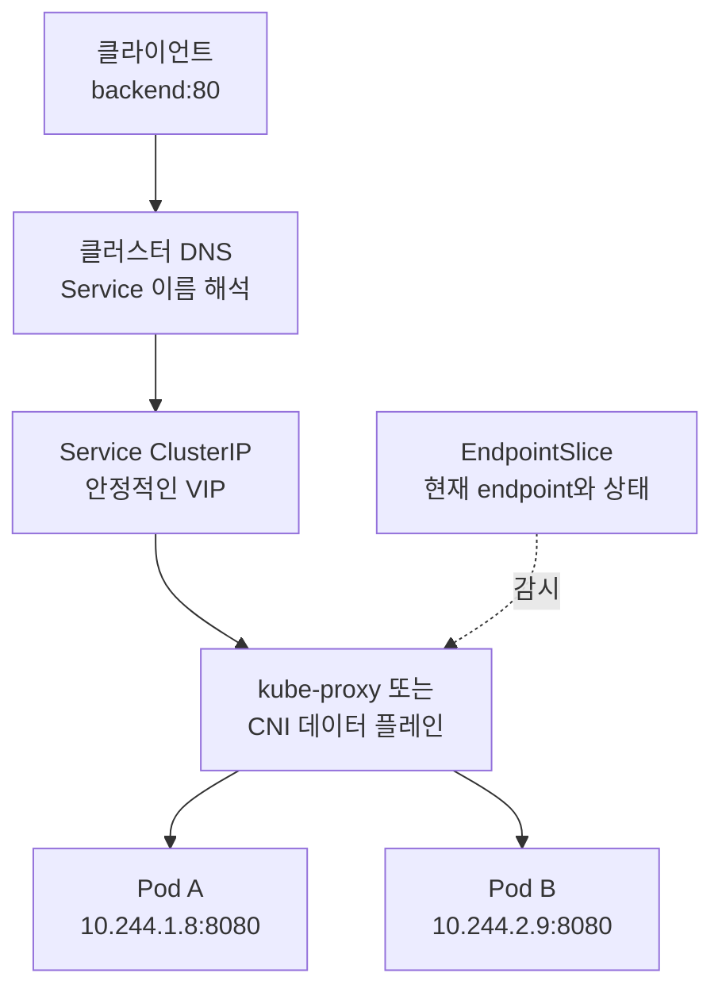

# Service와 EndpointSlice
---

> Service는 바뀌는 백엔드 집합과 클라이언트를 분리하고, EndpointSlice는 현재 사용할 수 있는 네트워크 endpoint를 확장 가능한 단위로 전달합니다.


## 학습 목표
> 이 문서를 읽고 나면 Service의 주소·포트·백엔드 선택을 구분하고, EndpointSlice를 근거로 연결 장애를 진단할 수 있습니다.

학습을 마치면 다음을 할 수 있어야 합니다.

1. Service가 Pod IP의 수명과 클라이언트의 수명을 분리하는 원리를 설명할 수 있습니다.
2. ClusterIP·NodePort·LoadBalancer·ExternalName·headless Service를 노출 범위에 맞춰 선택할 수 있습니다.
3. EndpointSlice의 주소 유형, 조건, 소유권, 분할 방식을 해석할 수 있습니다.
4. ClusterIP 정적 할당과 `internalTrafficPolicy`의 실패 조건을 예측할 수 있습니다.
5. Service 장애를 selector, EndpointSlice, 포트, 데이터 플레인 순서로 진단할 수 있습니다.


## 1. Service가 필요한 이유
> Pod는 교체될 수 있지만, 호출 계약은 교체 주기와 무관하게 유지되어야 합니다.

Deployment는 원하는 replica 수를 맞추기 위해 Pod를 만들고 없앱니다. 각 Pod는 자체 IP를 받지만 새로 만들어진 Pod가 이전 IP를 유지한다는 보장은 없습니다. 프런트엔드가 백엔드 Pod IP를 직접 저장하면 롤링 업데이트만으로도 호출 대상이 사라집니다.

Service는 논리적 endpoint 집합과 그 집합에 접근하는 정책을 API 객체로 정의합니다. 일반적인 Service는 selector로 Pod를 찾고, 컨트롤 플레인은 일치하는 Pod를 EndpointSlice에 반영합니다. 클라이언트는 개별 Pod의 생성·삭제를 추적하지 않고 Service의 안정적인 이름이나 가상 IP(Virtual IP, VIP)를 사용합니다.

이 구조는 애플리케이션이 Kubernetes 전용 서비스 발견 코드를 반드시 구현하지 않아도 된다는 데 의미가 있습니다. Kubernetes API를 직접 읽는 클라이언트는 EndpointSlice를 발견할 수 있고, 일반 애플리케이션은 DNS와 Service VIP를 이용할 수 있습니다.



Service 이름은 최대 63자의 label입니다. v1.36에서는 `RelaxedServiceNameValidation` feature gate가 beta이며 기본 활성화되어 이름이 숫자로 시작할 수 있습니다. 이름은 영숫자로 시작하고 끝나야 하고 중간에는 소문자 영숫자와 `-`를 쓸 수 있으므로, feature gate를 끈 클러스터의 기존 RFC 1035 label 검증과 혼동하지 않아야 합니다.


## 2. Service 정의와 포트 계약
> `port`는 클라이언트 계약이고 `targetPort`는 백엔드 구현 세부 사항입니다.

다음 Service는 `app.kubernetes.io/name: MyApp` label을 가진 Pod를 선택합니다. 클라이언트는 Service의 80번 포트로 접속하고 실제 연결은 Pod의 9376번 포트로 전달됩니다.

```yaml
apiVersion: v1
kind: Service
metadata:
  name: my-service
spec:
  selector:
    app.kubernetes.io/name: MyApp
  ports:
    - name: http
      protocol: TCP
      port: 80
      targetPort: app-http
```

`targetPort`를 생략하면 `port`와 같은 값이 기본으로 사용됩니다. 숫자 대신 Pod의 named port를 지정하면 새 버전의 Pod가 실제 포트 번호를 바꾸더라도 동일한 이름만 유지해 Service 정의를 바꾸지 않을 수 있습니다. 서로 다른 Pod가 같은 named port에 서로 다른 숫자를 사용해도 EndpointSlice가 포트 조합별로 나누어 표현할 수 있습니다.

Service의 기본 프로토콜은 TCP이며 API가 지원하는 UDP와 SCTP 등도 지정할 수 있습니다. 하나의 Service에 여러 포트를 선언할 때는 모든 포트에 이름을 붙여 모호성을 없애야 합니다. 포트 이름도 소문자 영숫자와 `-`만 사용하고 영숫자로 시작하고 끝나야 합니다.

`appProtocol`은 각 Service port의 애플리케이션 프로토콜을 알려 주는 힌트입니다. IANA service name, `kubernetes.io/h2c`, `kubernetes.io/ws`, `kubernetes.io/wss`, 또는 `example.com/custom` 같은 구현체 전용 접두사 값을 쓸 수 있습니다. 이 값은 대응 EndpointSlice로 복사되므로 프록시가 프로토콜을 이해하는 데 활용할 수 있지만, 그 자체가 L7 라우팅을 만들어 주지는 않습니다.


## 3. selector가 없는 Service
> selector가 없으면 안정적인 Service 진입점은 만들되 백엔드 목록의 책임은 사용자가 가집니다.

외부 데이터베이스를 클러스터 내부 이름으로 감싸거나, 다른 클러스터의 백엔드를 연결하거나, 점진적으로 Kubernetes로 이전할 때 selector 없는 Service를 사용할 수 있습니다. 컨트롤 플레인은 어떤 Pod를 골라야 할지 모르므로 EndpointSlice를 자동 생성하지 않습니다.

수동 EndpointSlice에는 Service를 연결하는 `kubernetes.io/service-name` label과 관리 주체를 나타내는 `endpointslice.kubernetes.io/managed-by` label을 지정합니다. Service port의 이름과 EndpointSlice port의 이름도 맞춰야 합니다.

```yaml
apiVersion: v1
kind: Service
metadata:
  name: external-db
spec:
  ports:
    - name: postgres
      port: 5432
---
apiVersion: discovery.k8s.io/v1
kind: EndpointSlice
metadata:
  name: external-db-1
  labels:
    kubernetes.io/service-name: external-db
    endpointslice.kubernetes.io/managed-by: cluster-admins
addressType: IPv4
ports:
  - name: postgres
    protocol: TCP
    port: 5432
endpoints:
  - addresses: ["10.4.5.6"]
  - addresses: ["10.4.5.7"]
```

수동 endpoint에는 IPv4·IPv6 loopback, link-local 주소, 다른 Service의 ClusterIP를 넣을 수 없습니다. kube-proxy는 Service VIP를 다른 Service의 백엔드로 사용하는 중첩 프록시를 지원하지 않기 때문입니다.

selector 없는 Service를 통한 일반 트래픽 전달은 가능하지만, API 서버는 Pod에 매핑되지 않은 endpoint로 프록시하지 않습니다. 따라서 `kubectl port-forward service/external-db ...`는 권한 경계를 우회하는 프록시가 될 수 있어 실패합니다.


## 4. EndpointSlice API
> EndpointSlice는 큰 백엔드 목록을 작은 변경 단위로 나누고 상태와 topology 정보를 함께 전달합니다.

EndpointSlice는 Kubernetes v1.21에서 stable이 되었으며 kube-proxy가 내부 Service 트래픽을 전달할 때 사용하는 source of truth입니다. 한 Slice는 Service 이름, IP family, 프로토콜, 포트 조합이 같은 endpoint를 묶습니다. 기본 최대치는 Slice당 100개 endpoint이고 kube-controller-manager의 `--max-endpoints-per-slice`로 최대 1000까지 조정할 수 있습니다.

각 Slice의 `addressType`은 `IPv4` 또는 `IPv6`입니다. dual-stack Service는 주소 family가 다르므로 최소 두 Slice가 필요합니다. 각 endpoint에는 선택적인 `hostname`, `nodeName`, `zone`을 기록할 수 있으며, hostname은 endpoint의 DNS label 이름을 제공하고 Node·zone 정보는 로컬·topology 기반 라우팅의 근거가 됩니다.

### endpoint 조건

`conditions`는 단순 Ready 여부보다 종료 과정까지 표현합니다.

| 조건 | 의미 | Pod와의 관계 |
|---|---|---|
| `serving` | 현재 응답을 제공할 수 있음 | Pod의 Ready 조건에 대응합니다. |
| `terminating` | 삭제 timestamp가 생겨 종료 중임 | 컨테이너가 완전히 끝나기 전부터 true일 수 있습니다. |
| `ready` | 보통 `serving && !terminating`의 축약 | `publishNotReadyAddresses: true`이면 항상 true로 게시됩니다. |

Service 프록시는 보통 terminating endpoint를 제외합니다. 다만 사용할 수 있는 endpoint가 모두 terminating이면서 일부가 serving이면 롤링 업데이트 중 트래픽 손실을 줄이기 위해 그 endpoint로 전달할 수 있습니다. 따라서 `ready=false`만 보고 애플리케이션이 즉시 응답 불가능하다고 단정하면 종료 중 동작을 놓칠 수 있습니다.

### 관리와 소유권

컨트롤 플레인이 만든 Slice의 `endpointslice.kubernetes.io/managed-by` 값은 `endpointslice-controller.k8s.io`입니다. Slice에는 Service owner reference와 `kubernetes.io/service-name` label이 있어 어떤 Service에 속하는지 식별할 수 있습니다. 별도 controller나 service mesh가 Slice를 관리한다면 서로 덮어쓰지 않도록 고유한 managed-by 값을 써야 합니다.

### 분할과 중복

EndpointSlice controller는 모든 Slice를 완벽히 채우는 것보다 전체 노드로 전파되는 update 수를 줄이는 쪽을 우선합니다. 예를 들어 기존 두 Slice에 각각 5자리씩 남아 있는데 endpoint 10개가 추가되면 두 Slice를 모두 수정하기보다 새 Slice 하나를 만들 수 있습니다. kube-proxy가 모든 노드에서 Slice를 watch하므로 객체 하나 생성이 여러 객체 수정보다 저렴할 수 있기 때문입니다.

watch와 cache의 반영 시점이 달라 같은 endpoint가 잠시 여러 Slice에 중복될 수도 있습니다. EndpointSlice를 직접 소비하는 클라이언트는 Service에 속한 모든 Slice를 모은 뒤 주소와 포트가 같은 endpoint를 deduplication해야 합니다.

### Endpoints API의 현재 상태

기존 Endpoints API와 EndpointSlice mirroring은 Kubernetes v1.33부터 deprecated입니다. Endpoints는 dual-stack을 표현하지 못하고 `trafficDistribution`에 필요한 정보가 없으며, endpoint가 1000개를 넘으면 `endpoints.kubernetes.io/over-capacity: truncated` annotation과 함께 목록이 잘립니다. 신규 client와 selector 없는 Service는 Endpoints가 아니라 EndpointSlice를 사용해야 합니다.

호환성 mirroring도 모든 Endpoints 객체에 적용되지는 않습니다. 다음 조건 중 하나라도 해당하면 control plane은 EndpointSlice로 mirror하지 않습니다.

- Endpoints에 `endpointslice.kubernetes.io/skip-mirror: "true"` label이 있습니다.
- Endpoints에 `control-plane.alpha.kubernetes.io/leader` annotation이 있습니다.
- 대응 Service가 존재하지 않습니다.
- 대응 Service의 selector가 `nil`이 아닙니다.

하나의 Endpoints에 여러 subset이나 IP family가 있으면 여러 EndpointSlice로 나뉠 수 있습니다. mirroring은 subset마다 최대 1000개 주소까지만 처리하므로 이 경로를 대규모 backend의 정본으로 사용해서는 안 됩니다.


## 5. Service 타입
> Service 타입은 내부 VIP에서 시작해 어떤 외부 진입 계층을 더할지 결정합니다.

| 타입 | 제공하는 진입점 | 핵심 용도 |
|---|---|---|
| `ClusterIP` | 클러스터 내부 VIP | 내부 서비스 간 통신의 기본값입니다. |
| `NodePort` | ClusterIP와 모든 선택된 Node IP의 같은 포트 | 외부 로드밸런서의 기반 또는 제한된 직접 노출에 씁니다. |
| `LoadBalancer` | 외부 로드밸런서와 보통 NodePort·ClusterIP | provider가 구현한 L4 진입점에 씁니다. |
| `ExternalName` | 외부 이름을 가리키는 DNS CNAME | 프록시 없이 이름만 별칭으로 제공합니다. |

타입은 대체로 중첩됩니다. NodePort는 ClusterIP 위에 Node port를 더하고, LoadBalancer는 보통 NodePort 위에 외부 로드밸런서를 더합니다. 다만 구현체가 Pod로 직접 전달한다면 `allocateLoadBalancerNodePorts: false`로 LoadBalancer의 NodePort 할당을 끌 수 있습니다.

### ClusterIP

`ClusterIP`는 기본 타입이며 API 서버에 설정된 Service CIDR에서 VIP를 할당받습니다. `.spec.clusterIP: None`은 IP를 할당하지 않는 headless Service이므로 일반 ClusterIP와 구분해야 합니다.

사용자가 `.spec.clusterIP`를 지정해 정적 IP를 요청할 수도 있습니다. 주소는 `service-cluster-ip-range` 안의 유효한 IPv4 또는 IPv6 주소여야 하며, 범위 밖이거나 이미 할당된 주소면 API 서버가 요청을 거부합니다.

### NodePort

NodePort는 모든 대상 Node에서 같은 포트를 Service로 전달합니다. 기본 범위는 30000~32767이며, 직접 `nodePort`를 지정하면 범위와 충돌을 사용자가 책임져야 합니다. 기본 범위는 정적 할당용 30000~30085와 동적 할당용 30086~32767로 나뉘고, 동적 할당은 위쪽 band를 먼저 사용합니다.

여러 NIC가 있는 Node에서 어느 주소로 NodePort를 열지 제한하려면 kube-proxy의 `--nodeport-addresses` 또는 설정 파일의 `nodePortAddresses`에 CIDR을 지정합니다. 빈 목록이 기본이며 이 경우 사용 가능한 모든 인터페이스 주소가 후보입니다.

### LoadBalancer

Kubernetes 자체는 외부 로드밸런서를 구현하지 않습니다. cloud-controller-manager나 별도 controller가 비동기로 장비를 만들고 결과를 `.status.loadBalancer`에 기록합니다. 지원 구현체가 없는 클러스터에서 `EXTERNAL-IP`가 계속 pending인 것은 Service 객체가 고장 난 것이 아니라 외부 구현이 없다는 신호입니다.

`spec.loadBalancerIP`는 의미가 구현체마다 다르고 dual-stack을 표현하지 못해 v1.24부터 deprecated입니다. 구현체 고유 annotation이나 Gateway API를 사용해야 합니다. `loadBalancerClass`는 기본 provider가 아닌 구현체를 선택하며 한 번 설정하면 바꿀 수 없습니다.

혼합 프로토콜 LoadBalancer Service는 v1.26에서 stable이지만 실제 지원 프로토콜은 provider 제약을 받습니다. `status.loadBalancer.ingress.ipMode`는 controller가 `VIP` 또는 `Proxy`로 기록해 외부 IP가 목적지 주소로 유지되는지, Node/Pod 주소로 바뀌어 전달되는지를 알립니다. 내부 전용 LoadBalancer 설정은 표준 필드가 아니라 provider별 annotation을 사용하므로 해당 provider 문서를 확인해야 합니다.

### ExternalName

ExternalName은 `spec.externalName`을 CNAME으로 반환할 뿐, kube-proxy 규칙이나 EndpointSlice를 만들지 않습니다. 숫자로 된 IPv4 형태 문자열도 IP가 아니라 DNS 이름으로 취급되어 정상적으로 해석되지 않습니다.

HTTP의 `Host` header와 TLS 인증서 이름은 클라이언트가 호출한 Service 이름과 외부 원본 이름이 달라 실패할 수 있습니다. ExternalName은 네트워크 프록시가 아니라 DNS 별칭이라는 점을 먼저 확인해야 합니다.


## 6. Headless Service
> Headless Service는 플랫폼의 VIP 부하 분산을 제거하고 endpoint 발견을 클라이언트에 맡깁니다.

`.spec.clusterIP: None`을 지정하면 ClusterIP가 할당되지 않고 kube-proxy도 Service를 처리하지 않습니다. 클러스터 DNS는 단일 VIP 대신 endpoint 주소를 돌려주므로 StatefulSet의 개별 Pod 발견이나 클라이언트 측 load balancing에 적합합니다.

selector가 있는 headless Service에서는 EndpointSlice controller가 일치하는 Pod를 추적하고 DNS가 그 endpoint를 게시합니다. selector가 없는 경우 컨트롤 플레인이 EndpointSlice를 만들지 않으며, `port`와 `targetPort`가 같아야 합니다.

Headless라는 이름이 Service discovery 자체가 없다는 뜻은 아닙니다. 안정적인 DNS 이름과 EndpointSlice는 유지할 수 있지만, 어떤 endpoint를 선택하고 재시도할지는 클라이언트가 책임집니다.


## 7. Service 발견
> DNS는 생성 순서에 덜 민감하고 namespace 경계를 명시할 수 있어 일반적인 발견 방식입니다.

kubelet은 Pod를 시작할 때 그 시점에 존재하는 Service마다 `{SVCNAME}_SERVICE_HOST`와 `{SVCNAME}_SERVICE_PORT` 형식의 환경 변수를 넣습니다. Service를 나중에 만들면 이미 실행 중인 Pod의 환경 변수는 갱신되지 않습니다.

CoreDNS 같은 cluster-aware DNS는 Service API를 watch해 레코드를 만듭니다. 같은 namespace에서는 `my-service`, 다른 namespace에서는 `my-service.my-ns`처럼 조회하며 일반 Service 이름은 ClusterIP로 해석됩니다. named port는 `_http._tcp.my-service.my-ns` 형태의 SRV 질의로 포트도 발견할 수 있습니다.

ExternalName은 DNS만으로 동작하므로 클러스터 DNS가 유일한 접근 경로입니다. DNS 레코드의 상세 형태는 [DNS와 CoreDNS](04-05.DNS%EC%99%80%20CoreDNS.md)에서 이어서 다룹니다.


## 8. ClusterIP 할당
> ClusterIP는 동적 또는 정적으로 할당하며, allocator는 정적 주소 충돌 가능성을 줄이도록 범위를 두 band로 나눕니다.

동적 할당은 컨트롤 플레인이 Service CIDR에서 빈 주소를 고릅니다. 정적 할당은 사용자가 `.spec.clusterIP`를 지정합니다. 어느 방식이든 클러스터 전체에서 ClusterIP는 유일해야 하므로 같은 주소를 두 Service가 가질 수 없습니다.

CoreDNS처럼 잘 알려진 주소가 필요한 Service를 늦게 만들면 동적 allocator가 그 주소를 먼저 가져갈 수 있습니다. Kubernetes는 이 위험을 낮추기 위해 Service CIDR의 낮은 band를 정적 할당에 남기고 동적 할당은 높은 band부터 사용합니다.

낮은 band 크기는 `min(max(16, cidrSize / 16), 256)`입니다. 여기서 `cidrSize`는 CIDR의 전체 주소 개수이며, 결과는 최소 16개에서 최대 256개입니다.

| Service CIDR | 사용 가능한 주소 수 | 낮은 정적 band | 높은 동적 band |
|---|---:|---|---|
| `10.96.0.0/24` | 254 | `10.96.0.1`~`10.96.0.16` | `10.96.0.17`~`10.96.0.254` |
| `10.96.0.0/20` | 4094 | `10.96.0.1`~`10.96.1.0` | `10.96.1.1`~`10.96.15.254` |
| `10.96.0.0/16` | 65534 | `10.96.0.1`~`10.96.1.0` | `10.96.1.1`~`10.96.255.254` |

이 분할은 예약을 보장하는 별도 API가 아니라 충돌 가능성을 낮추는 allocation 전략입니다. 정적 주소를 쓸 때도 실제 중복 여부와 범위를 검증해야 합니다.


## 9. 트래픽 정책과 분산 선호
> traffic policy는 endpoint 후보를 강제로 제한하고, traffic distribution은 후보 중 가까운 endpoint를 선호합니다.

`internalTrafficPolicy`는 클러스터 안 Pod에서 시작한 트래픽의 후보 범위를 정합니다. 기본값 `Cluster`는 모든 Ready endpoint를 고려하고, `Local`은 요청이 시작된 Node의 endpoint만 고려합니다. 같은 Node 왕복은 latency, 처리량, 비용, 장애 범위를 줄일 수 있습니다.

```yaml
apiVersion: v1
kind: Service
metadata:
  name: my-service
spec:
  selector:
    app.kubernetes.io/name: MyApp
  ports:
    - port: 80
      targetPort: 9376
  internalTrafficPolicy: Local
```

`Local`은 선호가 아니라 엄격한 제한입니다. 요청 Pod와 같은 Node에 endpoint가 없으면 다른 Node의 endpoint가 있어도 그 Pod 관점에서는 endpoint가 0개인 Service처럼 동작합니다. 성능 최적화를 위해 켰다가 간헐 장애를 만들지 않으려면 DaemonSet 또는 topology spread 등으로 모든 필요한 Node에 백엔드가 존재하는지 확인해야 합니다.

`externalTrafficPolicy`는 NodePort나 LoadBalancer를 통해 들어온 외부 트래픽에 같은 `Cluster`·`Local` 선택을 적용합니다. `Local`은 불필요한 Node 간 hop과 source NAT를 피해 원본 client IP 보존에 유리하지만, 로컬 endpoint가 없는 Node와 Node별 부하 불균형을 함께 설계해야 합니다.

v1.36의 `.spec.trafficDistribution`은 엄격한 보장 대신 topology 선호를 나타냅니다. `PreferSameZone`은 같은 zone을, `PreferSameNode`는 같은 Node를 우선하며 가까운 endpoint가 없으면 다른 후보로 fallback할 수 있습니다. `PreferClose`는 `PreferSameZone`의 오래된 alias로 deprecated입니다.


## 10. session affinity와 externalIPs
> Service의 부가 라우팅 기능은 편리하지만 애플리케이션 수준 세션이나 외부 주소 관리까지 대신하지 않습니다.

`sessionAffinity: ClientIP`는 같은 client IP의 연결을 같은 Pod로 보내도록 시도합니다. `sessionAffinityConfig.clientIP.timeoutSeconds`로 유지 시간을 정하며 기본값은 10800초, 즉 3시간입니다. NAT 뒤의 여러 사용자는 같은 IP로 보여 한 Pod에 몰릴 수 있으므로 사용자별 세션 보장으로 해석하면 안 됩니다.

`externalIPs`는 관리자가 이미 Node로 라우팅되게 만든 외부 IP를 Service port에 연결하는 필드입니다. Kubernetes는 이 주소를 할당하거나 외부 라우팅을 구성하지 않습니다. 이 기능은 v1.36에서 deprecated이므로 새 설계는 외부 load balancer controller나 Gateway API를 사용해야 합니다.


## 11. 진단 순서
> Service 장애는 안정적인 진입점, 백엔드 목록, 실제 listener를 분리해서 확인해야 합니다.

다음 순서로 확인하면 어느 계층에서 계약이 끊겼는지 좁힐 수 있습니다.

1. `kubectl get svc my-service -o yaml`로 타입, ClusterIP, port, targetPort, traffic policy를 확인합니다.
2. `kubectl get pod -l app.kubernetes.io/name=MyApp -o wide`로 selector가 실제 Pod를 고르는지 확인합니다.
3. `kubectl get endpointslice -l kubernetes.io/service-name=my-service -o yaml`로 주소, port, `ready`·`serving`·`terminating`, nodeName을 확인합니다.
4. Pod IP와 targetPort로 직접 연결해 애플리케이션 listener와 readiness를 확인합니다.
5. Pod 직접 연결은 성공하지만 ClusterIP만 실패하면 kube-proxy 또는 CNI Service 데이터 플레인을 확인합니다. ClusterIP는 일반적으로 Node나 Pod의 네트워크 인터페이스에 직접 바인딩된 주소가 아니므로 `ip addr`에 보이지 않는다는 사실만으로 장애라고 판단하지 않습니다.
6. 내부 연결은 성공하지만 외부만 실패하면 NodePort, LoadBalancer controller, provider health check를 확인합니다.

`kubectl get endpoints`는 deprecated API의 1000개 truncation을 숨길 수 있으므로 진단의 정본으로 삼지 않습니다. EndpointSlice가 여러 개일 수 있고 endpoint가 일시 중복될 수 있다는 점도 결과를 읽을 때 고려합니다.


## 12. 실습 재현 절차
> 현재 연결된 Kubernetes v1.36 클러스터가 없어 실행 결과를 기록하지 않았으며, 아래 절차는 실습 환경에서 직접 관찰하기 위한 재현 순서입니다.

이 문서에서는 실행하지 않은 `kubectl` 출력을 예시로 만들지 않습니다. v1.36 클러스터가 준비되면 다음 순서로 selector, EndpointSlice 조건, Local 정책을 검증합니다.

1. 앞의 `my-service` Service와 label이 일치하는 backend Pod를 적용합니다.
2. `kubectl get svc my-service -o yaml`로 할당된 ClusterIP와 port 계약을 확인합니다.
3. `kubectl get endpointslice -l kubernetes.io/service-name=my-service -o yaml`로 `hostname`, 주소, port, 세 조건을 관찰합니다.
4. `internalTrafficPolicy: Local`을 적용한 뒤 endpoint가 있는 Node와 없는 Node의 client Pod에서 각각 Service를 호출합니다.
5. 관찰한 출력에는 클러스터 버전, CNI, kube-proxy 대체 여부를 함께 기록해 구현 차이를 구분합니다.

```bash
kubectl version
kubectl get svc my-service -o yaml
kubectl get endpointslice \
  -l kubernetes.io/service-name=my-service \
  -o yaml
kubectl get pods -o wide
```


## 관련 문서
> Service 앞뒤의 이름 해석과 외부 진입 계층을 함께 연결합니다.

- [네트워킹](04-01.%EB%84%A4%ED%8A%B8%EC%9B%8C%ED%82%B9.md) — Kubernetes 네트워킹 전체 지도입니다.
- [DNS와 CoreDNS](04-05.DNS%EC%99%80%20CoreDNS.md) — Service와 Pod DNS 레코드를 설명합니다.
- [Ingress와 Gateway API](04-06.Ingress%EC%99%80%20Gateway%20API.md) — HTTP(S) 외부 진입 계층을 설명합니다.
