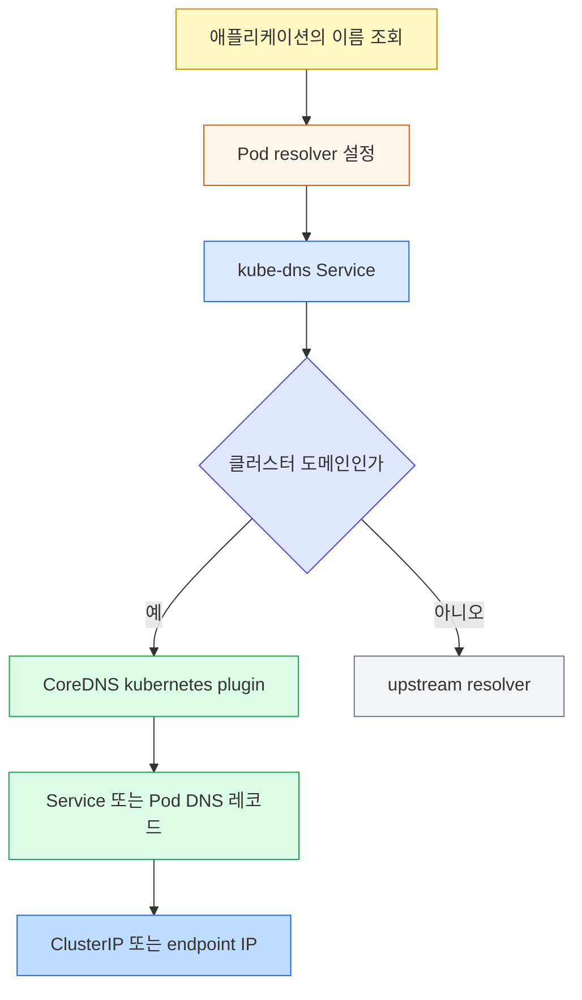

# DNS와 CoreDNS 점검
---
> Service와 Pod DNS 레코드, Pod resolver 정책, CoreDNS 운영을 설명할 수 있는지 회상 중심으로 점검합니다.


## 1. 회상 지도

> 이름이 어떤 레코드로 바뀌고 어디에서 실패할 수 있는지 먼저 복원합니다.

답을 보기 전에 다음 흐름을 빈 종이에 그려 봅니다:




## 2. 점검 질문

> 각 질문에 한 문장 결론과 이유를 말한 뒤 정답을 확인합니다.

1. `backend`라는 짧은 이름이 다른 네임스페이스의 Service를 찾지 못하는 이유는 무엇입니까?
2. 일반 Service와 Headless Service의 A/AAAA 응답은 어떻게 다릅니까?
3. Headless Service의 이름 있는 포트에 대한 SRV 응답은 무엇을 가리킵니까?
4. StatefulSet Pod가 `db-0.db.default.svc.cluster.local`이라는 이름을 얻으려면 어떤 조건이 필요합니까?
5. `publishNotReadyAddresses: true`가 필요한 상황은 언제입니까?
6. `setHostnameAsFQDN: true`가 Pod를 `Pending`에 머물게 할 수 있는 이유는 무엇입니까?
7. `ClusterFirst`, `Default`, `ClusterFirstWithHostNet`, `None`의 차이는 무엇입니까?
8. search domain과 `ndots: 5`가 외부 DNS 지연을 늘릴 수 있는 이유는 무엇입니까?
9. DNS search 목록의 Kubernetes 제한은 얼마입니까?
10. Windows Pod에서 `kubernetes.default`가 실패할 수 있는 이유는 무엇입니까?
11. CoreDNS의 `kubernetes`, `forward`, `cache` 플러그인은 각각 무엇을 담당합니까?
12. `kubernetes.default`는 조회되지만 특정 Service만 조회되지 않을 때 다음 확인 대상은 무엇입니까?
13. `dnsConfig.nameservers`의 최대 개수와 `dnsPolicy: None`일 때의 최소 조건은 무엇입니까?


## 3. 정답과 해설

> 정답은 레코드 계약과 resolver 동작을 연결해 설명해야 합니다.

1. 짧은 이름은 Pod 네임스페이스의 search suffix부터 확장되기 때문입니다. 다른 네임스페이스는 `backend.prod` 또는 FQDN으로 조회해야 합니다.
2. 일반 Service는 Service의 ClusterIP를 반환하고, Headless Service는 준비된 backing endpoint의 IP 목록을 반환합니다. 전자는 dataplane이 backend를 고르고 후자는 클라이언트가 endpoint를 고릅니다.
3. Headless Service의 SRV 응답은 각 backing Pod의 FQDN과 이름 있는 포트를 반환합니다. 일반 Service의 SRV 응답은 Service FQDN과 포트를 가리킵니다.
4. Pod에 `hostname: db-0`, `subdomain: db`가 있고 같은 네임스페이스에 `db`라는 Headless Service가 있어야 합니다. Service selector가 Pod를 선택해야 endpoint 기반 레코드가 만들어집니다.
5. 준비되지 않은 Pod도 안정된 peer 이름으로 먼저 발견해야 하는 부트스트랩 상황에 씁니다. 기본 동작은 Ready endpoint만 DNS에 게시합니다.
6. 커널 호스트명 필드에는 64자 제한이 있기 때문입니다. 완전한 FQDN이 이 제한을 넘으면 kubelet이 호스트명을 설정하지 못합니다.
7. `ClusterFirst`는 클러스터 DNS를 기본으로 사용하고, `Default`는 노드 resolver를 상속하며, `ClusterFirstWithHostNet`은 hostNetwork Pod에 클러스터 DNS를 적용합니다. `None`은 `dnsConfig`로 전체 DNS 설정을 직접 제공하게 합니다.
8. 점이 5개 미만인 이름은 여러 search suffix와 결합해 먼저 질의될 수 있기 때문입니다. 외부 이름 하나가 여러 NXDOMAIN 질의를 만든 뒤에야 절대 이름으로 조회될 수 있습니다.
9. search domain은 최대 32개, 전체 문자열 길이는 2,048자입니다. 노드 설정, Pod 설정, 병합 결과 각각에 적용됩니다.
10. Windows는 점이 있는 이름을 FQDN으로 보고 search를 이어 가지 않으며 네임스페이스 suffix 하나만 사용합니다. 완전한 FQDN이나 `kubernetes`를 사용하고 `Resolve-DnsName`으로 확인합니다.
11. `kubernetes`는 Service·Pod 레코드를 만들고, `forward`는 비클러스터 질의를 upstream으로 전달하며, `cache`는 응답을 재사용해 부하와 지연을 줄입니다.
12. Service 이름·네임스페이스·ClusterIP와 EndpointSlice 상태를 확인합니다. CoreDNS 전체보다 대상 오브젝트나 이름 범위의 문제일 가능성이 높습니다.
13. nameserver는 최대 3개이며, `dnsPolicy: None`이면 `dnsConfig`와 nameserver 한 개 이상이 필요합니다.


## 4. 장애 시나리오

> 증상에서 바로 CoreDNS를 재시작하지 말고 실패 구간을 한 단계씩 좁힙니다.

`kubernetes.default` 조회도 실패하면 Pod의 `/etc/resolv.conf`, `dnsPolicy`, kube-dns Service, CoreDNS Pod와 로그, UDP/TCP 53 NetworkPolicy 순으로 확인합니다. 대상 Service만 실패하면 이름과 네임스페이스, Service 및 EndpointSlice를 봅니다. `nslookup`은 성공하지만 애플리케이션만 실패하면 런타임 DNS 캐시와 커넥션 풀을 확인합니다.

```bash
kubectl -n kube-system get pods -l k8s-app=kube-dns
kubectl run dns-test --image=busybox:1.36 -it --rm -- nslookup kubernetes.default
kubectl get service,endpointslice -n default
kubectl -n kube-system logs deploy/coredns
```

이 명령의 출력은 클러스터마다 달라지므로 여기서는 꾸며 쓰지 않습니다. 실제 점검에서는 각 명령의 시각과 출력, 변경 전후 결과를 함께 기록해야 DNS 장애와 일시적인 캐시 효과를 구분할 수 있습니다.


## 관련 문서

> 레코드가 가리키는 Service 계층과 본문 설명을 함께 복습합니다.

- [DNS와 CoreDNS](04-05.DNS%EC%99%80%20CoreDNS.md) — 질문의 개념 설명과 구성 예시
- [Service와 EndpointSlice](04-04.Service%EC%99%80%20EndpointSlice.md) — ClusterIP와 endpoint가 DNS 응답 뒤에서 동작하는 방식
