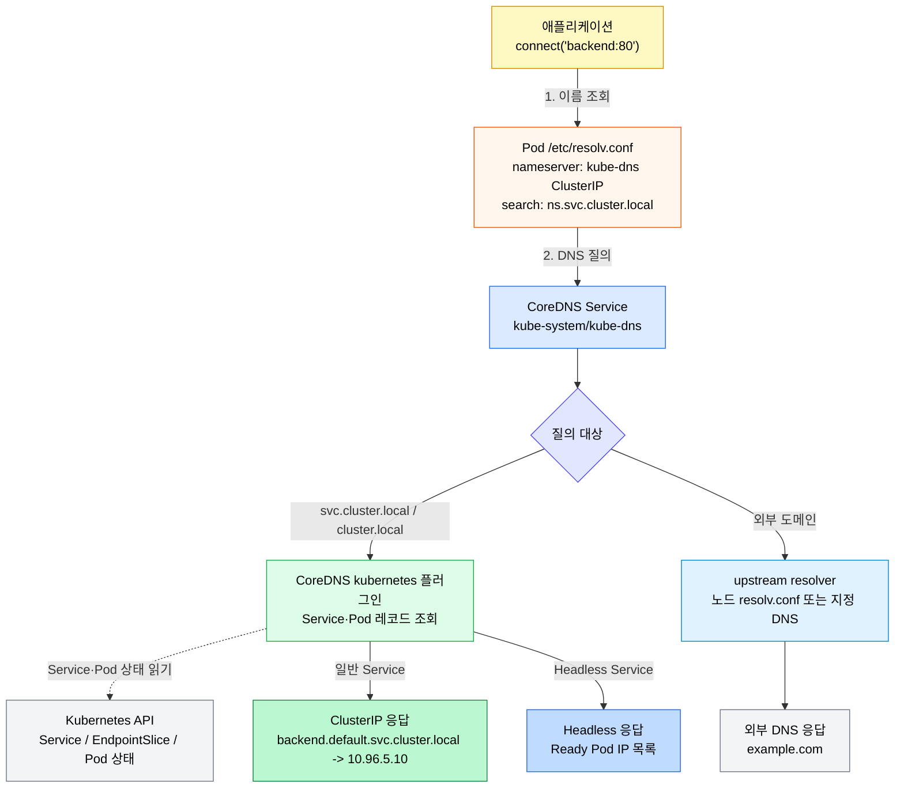
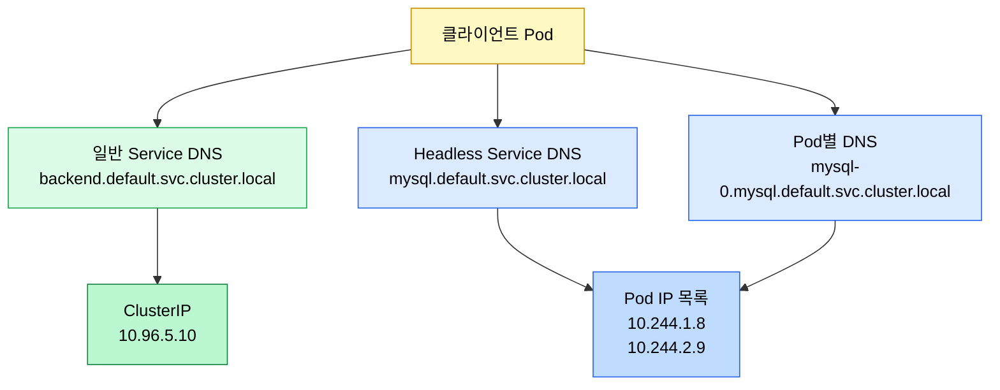
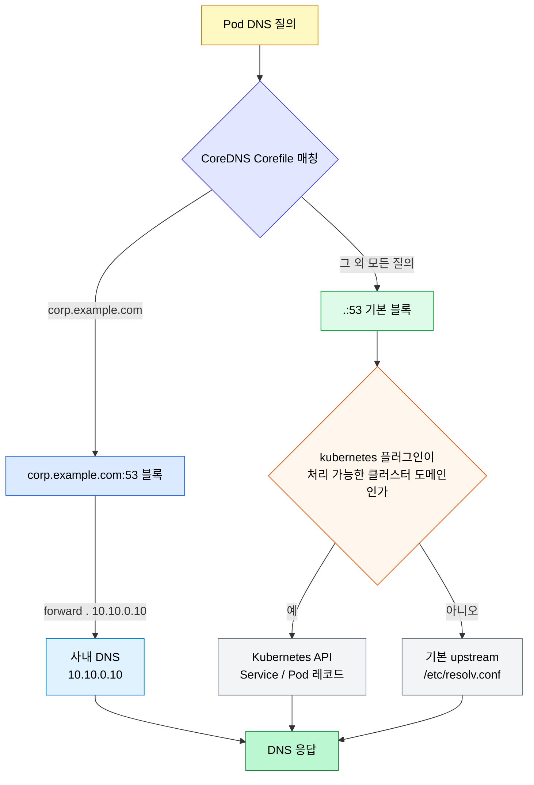
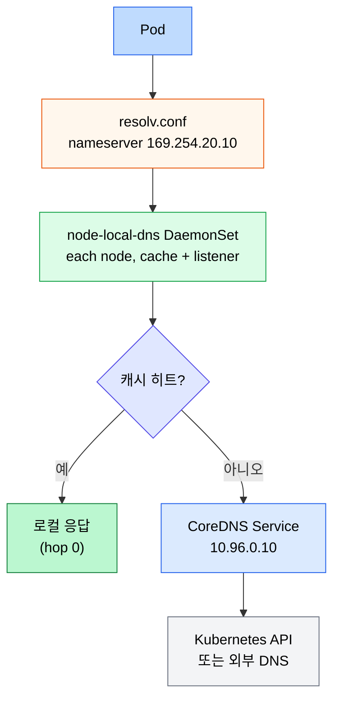
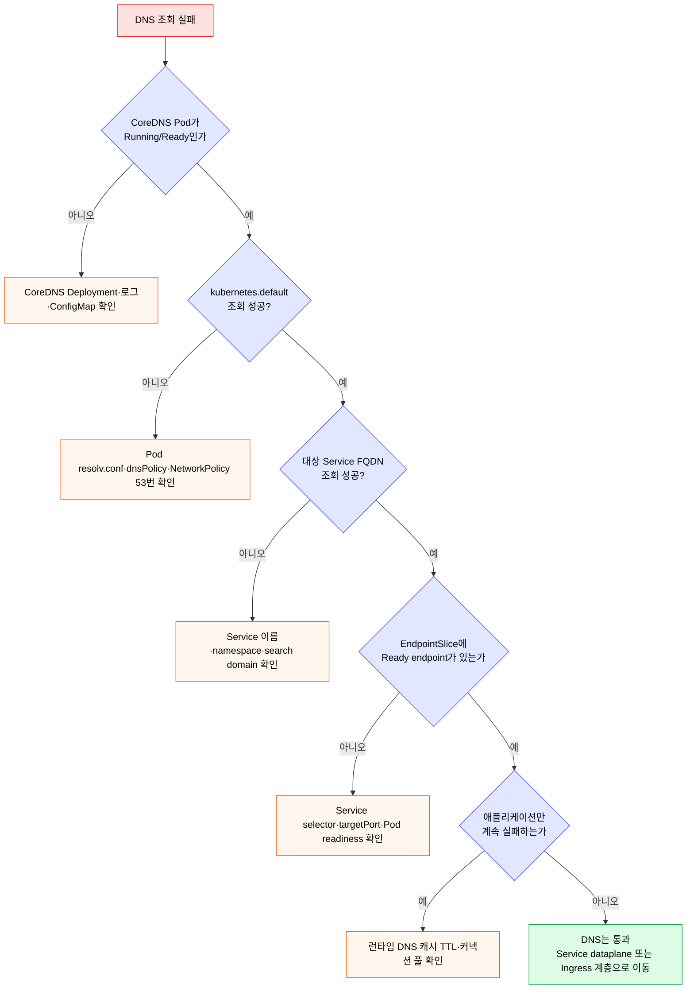

# DNS와 CoreDNS

> Kubernetes에서 애플리케이션은 보통 IP가 아니라 Service 이름으로 통신합니다. CoreDNS는 이 이름을 ClusterIP, Headless Service의 Pod IP 목록, 또는 외부 DNS로 해석하는 서비스 디스커버리 계층입니다.


## 학습 목표
> DNS 문제를 Service 문제와 분리해서 진단할 수 있도록 레코드와 CoreDNS 운영 방식을 정리합니다.

이 장에서 확인할 목표는 다음과 같습니다:

1. 일반 Service와 Headless Service의 DNS 응답 차이를 설명할 수 있습니다.
2. Service FQDN과 같은 네임스페이스 짧은 이름 해석 방식을 이해할 수 있습니다.
3. Pod의 `dnsPolicy`, `dnsConfig`, `/etc/resolv.conf`가 DNS 조회에 미치는 영향을 설명할 수 있습니다.
4. CoreDNS ConfigMap으로 stub domain과 upstream nameserver를 설정하는 방식을 이해할 수 있습니다.
5. DNS 장애를 CoreDNS, Service, NetworkPolicy, 클라이언트 캐시 관점으로 나눠 진단할 수 있습니다.


## 1. Service DNS 기본
> Service 이름은 클러스터 내부 통신의 기본 인터페이스입니다.

Service가 생성되면 Kubernetes DNS는 Service 이름에 대한 레코드를 제공합니다. 일반적인 ClusterIP Service는 하나의 A/AAAA 레코드로 Service의 ClusterIP를 반환합니다.

Service FQDN 형식은 다음과 같다:

```text
<service-name>.<namespace>.svc.<cluster-domain>
```

기본 클러스터 도메인이 `cluster.local`이라면 `backend` Service의 전체 이름은 다음과 같다:

```text
backend.default.svc.cluster.local
```

같은 네임스페이스의 Pod에서는 짧은 이름 `backend`만 써도 됩니다. Pod의 `/etc/resolv.conf`에 search domain이 들어가 있어서 `backend` 질의가 `backend.<namespace>.svc.cluster.local`까지 확장됩니다.

Service 이름 해석 흐름은 다음처럼 나뉜다:




## 2. 일반 Service와 Headless Service
> 일반 Service는 ClusterIP 하나를 반환하고, Headless Service는 backing Pod IP 목록을 반환합니다.

일반 Service는 DNS 질의에 ClusterIP를 반환합니다. 이후 실제 Pod 선택은 Service dataplane이 담당합니다. 클라이언트는 백엔드 Pod가 몇 개인지, 어느 Pod가 선택되는지 알 필요가 없습니다.

Headless Service는 `clusterIP: None`으로 만듭니다. 이 경우 DNS는 ClusterIP 하나가 아니라 Service 뒤의 Ready Pod IP 목록을 반환합니다. StatefulSet처럼 각 Pod를 직접 식별해야 하는 워크로드에서 중요합니다.



Headless Service를 사용할 때는 클라이언트가 여러 DNS 응답을 처리할 수 있어야 합니다. 일부 클라이언트는 첫 번째 IP만 쓰거나 DNS 캐시를 오래 잡아 장애 전환이 느릴 수 있습니다. 데이터베이스 드라이버나 메시지 브로커 클라이언트의 DNS 캐시 정책까지 함께 확인해야 합니다.


## 3. Pod DNS와 resolv.conf
> Pod의 DNS 동작은 kubelet이 주입한 `/etc/resolv.conf`와 `dnsPolicy`에 의해 결정됩니다.

일반 Pod의 기본 DNS 정책은 `ClusterFirst`입니다. 클러스터 도메인에 속한 이름은 CoreDNS로 질의하고, 그 외 도메인은 CoreDNS가 upstream nameserver로 전달합니다.

Pod 내부의 `/etc/resolv.conf`는 보통 다음과 유사하다:

```text
search default.svc.cluster.local svc.cluster.local cluster.local
nameserver 10.96.0.10
options ndots:5
```

`ndots:5`는 점이 5개 미만인 이름을 먼저 search domain과 조합해 조회하게 만듭니다. 그래서 `backend` 같은 짧은 이름이 같은 네임스페이스 Service로 자연스럽게 확장됩니다. 반대로 외부 도메인 조회가 많은 애플리케이션에서는 불필요한 내부 DNS 질의가 늘어날 수 있으므로 성능 분석 시 `ndots` 영향을 의심할 수 있습니다.

주요 `dnsPolicy`는 다음과 같다:

| 정책 | 의미 | 사용 시점 |
|------|------|----------|
| `ClusterFirst` | 클러스터 DNS 우선 | 일반 애플리케이션 기본값 |
| `Default` | 노드의 DNS 설정 사용 | 클러스터 DNS를 쓰지 않는 특수 Pod |
| `ClusterFirstWithHostNet` | hostNetwork Pod가 클러스터 DNS 사용 | 노드 에이전트, CNI/모니터링 계열 |
| `None` | `dnsConfig`로 직접 지정 | 특수한 DNS 구성 |

hostNetwork Pod는 네트워크 네임스페이스를 노드와 공유합니다. 이때 클러스터 Service 이름 해석이 필요하면 `ClusterFirstWithHostNet`을 명시해야 합니다.


## 4. dnsConfig
> Pod 단위로 search domain, nameserver, resolver option을 조정할 수 있습니다.

대부분의 애플리케이션은 기본 `ClusterFirst`를 유지하는 것이 안전합니다. 사내 DNS 도메인을 추가하거나 `ndots`를 조정해야 할 때만 `dnsConfig`를 사용합니다.

```yaml
apiVersion: v1
kind: Pod
metadata:
  name: app-with-custom-dns
spec:
  dnsPolicy: ClusterFirst
  dnsConfig:
    searches:
      - default.svc.cluster.local
      - svc.cluster.local
      - corp.example.com
    options:
      - name: ndots
        value: "2"
  containers:
    - name: app
      image: nginx:1.29
```

`dnsPolicy: None`은 모든 DNS 설정을 직접 책임지겠다는 뜻입니다. Service discovery까지 깨질 수 있으므로 dev 환경에서 습관적으로 쓰면 안 됩니다. 특별한 네트워크 요구가 없다면 `ClusterFirst`를 기본으로 두고 필요한 옵션만 최소 조정합니다.


## 5. CoreDNS 구성
> CoreDNS는 보통 `kube-system` 네임스페이스의 Deployment와 ConfigMap으로 운영됩니다.

CoreDNS는 Kubernetes 클러스터의 기본 DNS 서버 역할을 합니다. `kube-system` 네임스페이스에서 `coredns` Deployment와 `coredns` ConfigMap을 확인할 수 있습니다.

```bash
kubectl -n kube-system get deploy coredns
kubectl -n kube-system get configmap coredns -o yaml
```

대표적인 Corefile 구조는 다음과 같다:

```text
.:53 {
    errors
    health
    ready
    kubernetes cluster.local in-addr.arpa ip6.arpa {
        pods insecure
        fallthrough in-addr.arpa ip6.arpa
    }
    forward . /etc/resolv.conf
    cache 30
    reload
    loadbalance
}
```

`kubernetes` 플러그인은 Service와 Pod 레코드를 Kubernetes API에서 읽어 응답합니다. `forward`는 CoreDNS가 모르는 외부 도메인을 upstream resolver로 넘긴다. `cache`는 DNS 응답을 일정 시간 캐시해 CoreDNS와 API 서버 부하를 줄입니다.


## 6. 커스텀 도메인과 upstream nameserver
> 특정 사내 도메인만 별도 DNS로 보내고 나머지는 기본 upstream으로 보내는 구성이 가능합니다.

사내 도메인 `corp.example.com`은 사내 DNS로 보내고, 나머지 외부 도메인은 기본 resolver로 보내고 싶다면 CoreDNS ConfigMap에 별도 서버 블록을 추가합니다.

```text
corp.example.com:53 {
    errors
    cache 30
    forward . 10.10.0.10
}

.:53 {
    errors
    health
    ready
    kubernetes cluster.local in-addr.arpa ip6.arpa {
        pods insecure
        fallthrough in-addr.arpa ip6.arpa
    }
    forward . /etc/resolv.conf
    cache 30
    reload
    loadbalance
}
```

이 방식은 클러스터 전체 DNS 동작을 바꾸므로 영향 범위가 큽니다. 특정 Pod만 다른 DNS 동작이 필요하면 CoreDNS 전역 설정보다 Pod의 `dnsConfig`가 더 안전할 수 있습니다.

CoreDNS 서버 블록과 upstream 분기 흐름은 다음처럼 읽으면 된다:



CoreDNS ConfigMap을 바꾼 뒤에는 rollout 상태와 로그를 확인한다:

```bash
kubectl -n kube-system rollout status deployment/coredns
kubectl -n kube-system logs deploy/coredns
```


## 7. NodeLocal DNS Cache
> 클러스터가 커지면 CoreDNS가 모든 Pod의 DNS 질의를 받는 단일 지점이 됩니다. NodeLocal DNS Cache는 노드마다 로컬 캐시 DNS를 둬 첫 질의만 CoreDNS로 가게 만듭니다.

기본 설정에서 Pod의 `nameserver`는 `kube-dns` Service ClusterIP(`10.96.0.10`)다. 즉 모든 Pod가 노드 사이를 건너 CoreDNS로 직접 질의합니다. 클러스터 규모가 커지거나 짧은 TTL의 외부 도메인을 자주 조회하는 워크로드가 늘면 CoreDNS Pod가 CPU/메모리 한계에 부딪히고, conntrack 테이블에 UDP DNS 엔트리가 가득 차서 패킷이 drop 되는 사례가 보고됩니다.

NodeLocal DNS Cache는 노드마다 DaemonSet으로 캐시 DNS를 띄우고, Pod의 nameserver를 그 로컬 IP로 가로챈다. 캐시에 응답이 있으면 노드 안에서 끝나고, 없을 때만 CoreDNS로 forwarding합니다. Kubespray 같은 일부 배포본은 이 설정을 기본 활성으로 가져오므로 Pod에 들어가서 `cat /etc/resolv.conf`를 보면 `nameserver`가 `169.254.20.10` 같은 로컬 링크 주소로 잡혀 있습니다.



도입할 때 알아 둘 운영 포인트는 다음과 같습니다.

**Pod의 resolv.conf가 의도대로 잡혔는지 확인합니다.** node-local-dns DaemonSet이 떠 있어도 kubelet이 Pod에 주입하는 nameserver를 자동으로 바꾸지 않습니다. cluster DNS IP를 dummy 인터페이스로 노드에 할당하는 trick을 쓰거나(공식 manifest 방식), `--cluster-dns` 플래그를 로컬 IP로 변경하거나, kube-proxy 모드에 따라 패킷 가로채기를 다르게 설정해야 합니다. Kubespray는 이 모든 걸 기본 자동화합니다.

**캐시 DNS가 죽으면 그 노드의 모든 Pod가 동시에 DNS 장애를 봅니다.** 단일 캐시 Pod가 노드 단위 SPOF가 됩니다. 따라서 해당 DaemonSet은 readiness probe와 함께 health endpoint(보통 8080/health)로 모니터링하고, 재시작 정책을 명확히 둔다.

**TCP fallback 경로를 함께 설정합니다.** 일부 응답(특히 큰 TXT 레코드, DNSSEC)은 UDP를 넘는 크기라 TCP로 전환됩니다. node-local-dns는 기본으로 TCP도 listen 하지만, 통신 경로의 NetworkPolicy가 TCP 53도 허용하는지 확인합니다.

**클러스터 DNS 자체 디버깅은 헷갈릴 수 있습니다.** Pod에서 nslookup이 빠르게 응답해도 그건 캐시 hit일 뿐 CoreDNS가 정상이라는 보장은 아닙니다. 캐시 우회 테스트가 필요하면 Pod의 `dnsConfig`로 `nameserver`를 임시로 CoreDNS Service IP로 박은 임시 Pod를 띄워 비교합니다.

```bash
kubectl -n kube-system get daemonset node-local-dns
kubectl -n kube-system logs -l k8s-app=node-local-dns | head -50
kubectl run dns-bypass --image=busybox:1.36 -it --rm \
  --overrides='{"spec":{"dnsPolicy":"None","dnsConfig":{"nameservers":["10.96.0.10"]}}}' \
  -- nslookup kubernetes.default
```


## 8. 점검 질문
> 본문 개념을 운영 판단 질문으로 다시 점검합니다.

### Q1. Pod에서 `nslookup my-svc`가 안 될 때 어디부터 보는가?

`/etc/resolv.conf`를 먼저 봅니다. 정상이면 `nameserver 10.96.0.10`(클러스터 DNS Service IP), `search default.svc.cluster.local svc.cluster.local cluster.local`이 들어 있습니다. 잘못된 nameserver가 있으면 그 시점에 dnsPolicy 설정이 꼬인 것이다(예: `Default`로 노드의 `/etc/resolv.conf`를 그대로 받음).

다음 CoreDNS 자체. `kubectl get pod -n kube-system -l k8s-app=kube-dns`로 Pod가 살아 있는지, `kubectl logs -n kube-system <coredns-pod>`로 에러를 봅니다. 마지막으로 Service가 실제로 존재하는지(`kubectl get svc my-svc`), selector가 Pod에 매칭되는지를 봅니다.

가장 자주 낚이는 것은 namespace 누락입니다. `my-svc`는 같은 네임스페이스 내에서만 짧은 이름으로 해석되고, 다른 네임스페이스 서비스는 `my-svc.<other-ns>`로 적어야 합니다.

### Q2. `search` 도메인 다섯 개와 `ndots: 5`가 만드는 비효율은?

기본 Pod의 `/etc/resolv.conf`는 `search ns.svc.cluster.local svc.cluster.local cluster.local`(3개) + `options ndots:5`로 설정됩니다. `ndots:5`는 "도메인에 점이 5개 미만이면 search 도메인을 차례로 시도한다"는 뜻입니다.

문제는 외부 도메인 lookup에서입니다. `api.example.com`(점 2개)을 조회하면 `api.example.com.ns.svc.cluster.local`, `api.example.com.svc.cluster.local`, `api.example.com.cluster.local`을 차례로 시도한 뒤 마지막에 `api.example.com.`을 묻습니다. 즉 1회 lookup이 4회 네트워크 round-trip이 됩니다.

해결책은 두 가지입니다. 외부 도메인은 `api.example.com.`처럼 끝에 `.`을 붙여 절대 도메인으로 명시하는 패턴, 또는 Pod의 `dnsConfig.options`에 `{name: ndots, value: "1"}`로 ndots를 낮추는 패턴입니다.

### Q3. NodeLocal DNS Cache는 어떤 사고를 막는가?

각 노드에 DNS 캐시 Pod(`node-local-dns`)가 있고, Pod의 `/etc/resolv.conf`는 그 캐시(169.254.20.10 같은 link-local IP)를 가리킵니다. 캐시 hit이면 클러스터 CoreDNS까지 가지 않습니다.

장점은 두 가지입니다.

1. **CoreDNS 부하 감소**. 트래픽 1/10 ~ 1/20 수준으로 줄어듭니다.
2. **conntrack table pollution 방지**. UDP DNS 패킷은 conntrack을 만드는데, 노드 안에서 끝나므로 conntrack 폭증이 줄어듭니다. iptables 모드 kube-proxy의 노드 conntrack 부하 문제를 크게 완화합니다.

운영 시 점검은 CoreDNS와 NodeLocal DNS Cache 둘 다 모니터링합니다. NodeLocal DNS가 죽으면 그 노드의 모든 Pod가 DNS lookup에 실패하므로, NodeLocal DNS Cache는 자체 DaemonSet에 healthcheck와 readinessProbe를 충실히 둡니다.

### Q4. CoreDNS의 Corefile에서 `forward .`을 잘못 설정하면 어떤 사고가 나는가?

`forward .` 라인은 클러스터 외부 도메인의 forwarder를 정의합니다. 잘못된 nameserver(예: 노드의 `/etc/resolv.conf`가 가리키는 사내 DNS가 응답하지 않음)를 적으면 외부 도메인 lookup이 모두 timeout됩니다.

로그에는 `i/o timeout` 또는 `no such host` 에러가 반복됩니다. CoreDNS Pod 자체는 살아 있어도 모든 외부 도메인이 안 됩니다. 진단은 CoreDNS Pod 안에서 직접 `nslookup api.example.com <forwarder-ip>`로 forwarder 자체의 응답을 확인하는 것입니다.

운영 보호 장치로 `forward . /etc/resolv.conf`처럼 노드의 resolv.conf를 그대로 사용하는 패턴이 흔합니다. 노드가 IP를 알아서 받아들이는 환경에 강합니다. 사내 DNS를 명시할 때는 backup forwarder 1~2개를 함께 둡니다.

### Q5. Headless Service의 SRV 레코드는 어떻게 동작하는가?

Headless Service에 `port`가 정의돼 있으면 CoreDNS는 SRV 레코드를 자동 생성합니다. `_<port-name>._tcp.<svc>.<ns>.svc.cluster.local`로 조회하면 모든 ready Pod의 endpoint(host, port)가 반환됩니다.

쓰임은 클라이언트가 IP뿐 아니라 포트도 동적으로 받아야 할 때입니다. Cassandra, Kafka 클라이언트가 SRV 조회로 모든 브로커를 발견하는 패턴이 표준입니다. StatefulSet과 결합해 `pod-0._gossip._tcp...`처럼 개별 Pod 단위 SRV도 가능합니다.

### Q6. dnsPolicy의 네 종류는 어떤 시나리오에 쓰는가?

`ClusterFirst`(기본)는 클러스터 DNS를 우선 쓰고 모르는 도메인은 forward. 일반 워크로드의 기본값.

`ClusterFirstWithHostNet`은 hostNetwork: true Pod가 클러스터 DNS를 쓰게 만듭니다. 그냥 hostNetwork면 노드의 `/etc/resolv.conf`를 받기 때문에 클러스터 Service 이름을 해석하지 못합니다.

`Default`는 노드의 `/etc/resolv.conf`를 그대로 사용. 클러스터 DNS를 거치지 않습니다. 클러스터 외부 시스템과만 통신하는 Pod에 가끔 씁니다.

`None`은 `dnsConfig`를 100% 직접 제어할 때. 특수한 사이드카·DNS 테스트 Pod 외에는 쓸 일이 거의 없습니다.

### Q7. CoreDNS replica를 얼마나 두는 게 적절한가?

기본은 2개입니다. 작은 클러스터에서는 충분합니다. 노드 수·Pod 수가 늘면 lookup QPS도 같이 올라갑니다. 일반적인 경험치는 100노드당 1~2 replica를 더하는 정도지만, NodeLocal DNS Cache가 켜져 있으면 그 비율이 크게 낮아집니다.

지표는 `coredns_dns_request_duration_seconds`의 p99와 `coredns_panic_count_total`입니다. p99가 100ms를 넘기 시작하면 replica를 늘리거나 NodeLocal을 도입합니다. panic 카운트가 0보다 크면 메모리·연결 누수 등을 의심하고 CoreDNS 버전 업그레이드를 검토합니다.

HPA를 CoreDNS에 거는 패턴도 있지만, DNS 쿼리는 짧고 burst가 심해 HPA가 안정적으로 따라가기 어렵습니다. 일반적으로 충분한 replica + PDB로 정적 운영이 더 자연스럽습니다.

### Q8. CoreDNS 자체 장애 시 가용성은 어떻게 지키는가?

운영 차원에서 PDB(`minAvailable: 1` 이상)와 `topologySpreadConstraints`(노드 분산)는 기본입니다. 한 노드 점검에서 CoreDNS 두 replica가 모두 빠지지 않게 합니다.

추가 보호는 NodeLocal DNS Cache입니다. 노드 단의 캐시가 있어 CoreDNS 일시 장애 동안에도 캐시 안의 도메인은 계속 응답합니다. 캐시 만료(보통 30초~5분) 동안만 영향입니다.

마지막 안전망은 `forward` 옵션의 `health_check`와 fallthrough입니다. CoreDNS forwarder가 응답이 없으면 다음 forwarder로 넘어가는 설정을 두면, 한 forwarder 장애가 전체 lookup을 막지 않습니다.


## 9. DNS 장애 진단
> DNS 장애는 CoreDNS 자체 문제, Service 레코드 문제, 네트워크 정책 문제, 클라이언트 캐시 문제로 나눠 봅니다.

확인 순서는 다음과 같다:

1. CoreDNS Pod가 Running/Ready인지 확인합니다.
2. 테스트 Pod에서 `kubernetes.default`와 대상 Service 이름을 조회합니다.
3. Service와 EndpointSlice가 정상인지 확인합니다.
4. NetworkPolicy가 DNS egress(UDP/TCP 53)를 막고 있지 않은지 확인합니다.
5. 애플리케이션 런타임의 DNS 캐시 TTL을 확인합니다.

명령은 다음처럼 시작한다:

```bash
kubectl -n kube-system get pods -l k8s-app=kube-dns
kubectl run dns-test --image=busybox:1.36 -it --rm -- nslookup kubernetes.default
kubectl run dns-test --image=busybox:1.36 -it --rm -- nslookup backend.default.svc.cluster.local
kubectl -n kube-system logs deploy/coredns
```

NetworkPolicy를 default-deny로 운영하는 네임스페이스에서는 DNS egress 허용을 자주 빠뜨린다. 이 경우 애플리케이션은 외부 API뿐 아니라 내부 Service 이름도 해석하지 못합니다.

DNS 장애는 다음 순서로 좁히면 된다:



```yaml
apiVersion: networking.k8s.io/v1
kind: NetworkPolicy
metadata:
  name: allow-dns-egress
spec:
  podSelector: {}
  policyTypes:
    - Egress
  egress:
    - to:
        - namespaceSelector:
            matchLabels:
              kubernetes.io/metadata.name: kube-system
      ports:
        - protocol: UDP
          port: 53
        - protocol: TCP
          port: 53
```


## 다음 단계
> DNS로 Service를 찾은 뒤, 외부 사용자는 Ingress나 Gateway API를 통해 들어옵니다.

내부 서비스 디스커버리는 DNS와 Service가 담당합니다. 외부 HTTP/HTTPS 요청을 클러스터 안의 Service로 연결하는 방식은 다음 장의 Ingress와 Gateway API에서 다룹니다.


## 관련 문서
> DNS 앞뒤의 네트워크 계층을 함께 봅니다.

- [네트워킹](04-01.%EB%84%A4%ED%8A%B8%EC%9B%8C%ED%82%B9.md) — Ch04 전체 지도
- [Service와 EndpointSlice](04-04.Service%EC%99%80%20EndpointSlice.md) — DNS가 반환하는 Service 뒤쪽 구조
- [Ingress와 Gateway API](04-06.Ingress%EC%99%80%20Gateway%20API.md) — 외부 진입과 Service 연결
- [실습: _practice 장애 시나리오](../_practice/poc/README.md) — DNS 해석 실패 진단 매니페스트와 진단 명령
