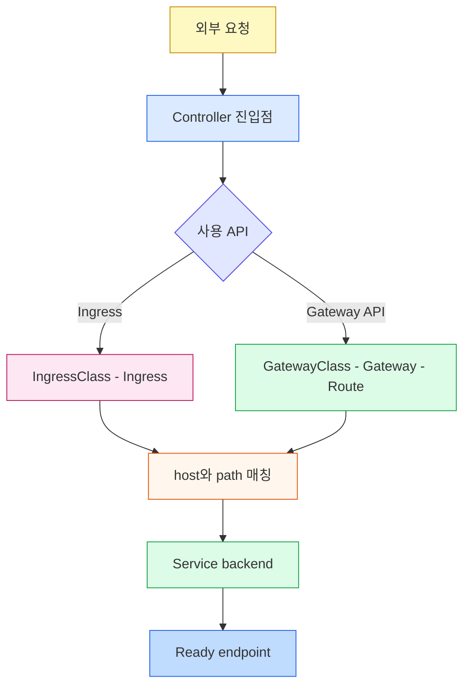

# Ingress와 Gateway API 점검
---

> 선언과 Controller, Ingress 매칭 규칙, Gateway API의 역할 분리와 적합성 상태를 회상 중심으로 점검합니다.


## 1. 회상 지도

> 한 요청이 어떤 선언을 거쳐 Service backend에 도달하는지 복원합니다.




## 2. 점검 질문

> 객체가 생성되었다는 사실과 실제 트래픽 처리를 구분해 답합니다.

1. Ingress를 생성해도 Controller가 없으면 트래픽이 흐르지 않는 이유는 무엇입니까?
2. Ingress 규칙에서 `host`를 생략하면 어떤 요청이 후보가 됩니까?
3. `Exact`, `Prefix`, `ImplementationSpecific`은 어떻게 다릅니까?
4. 여러 path가 일치할 때 표준 우선순위는 무엇입니까?
5. 어떤 규칙에도 맞지 않는 요청은 어디로 갑니까?
6. resource backend와 Service backend는 어떻게 다릅니까?
7. `*.example.com`은 어떤 호스트와 일치하고 어떤 호스트와 일치하지 않습니까?
8. `ingressClassName`, `IngressClass.spec.controller`, `parameters.scope`는 무엇을 정합니까?
9. 여러 Ingress Controller를 한 클러스터에서 운영할 때 무엇을 분리해야 합니까?
10. GatewayClass, Gateway, HTTPRoute의 소유자는 왜 나뉩니까?
11. Gateway가 다른 네임스페이스의 Route를 받으려면 무엇이 필요합니까?
12. Gateway API의 Core 기능과 Extended 기능 구분이 필요한 이유는 무엇입니까?
13. Gateway API CRD만 설치했는데 트래픽이 흐르지 않는 이유는 무엇입니까?
14. HTTPRoute가 Gateway에 실제로 연결됐는지는 어디에서 확인합니까?
15. Ingress에서 Gateway API로 옮길 때 객체를 어떻게 나눠 매핑합니까?
16. Gateway API standard 채널의 stable 리소스와 Experimental Route 리소스는 무엇입니까?
17. Ingress 규칙을 업데이트할 때 `edit`, `apply`, `replace`는 어떻게 다릅니까?
18. Ingress로 가용성 존 장애를 견디려면 왜 제공자와 Controller 문서를 확인해야 합니까?


## 3. 정답과 해설

> 정답은 API 객체의 책임과 구현체의 책임을 나누어 설명해야 합니다.

1. Ingress는 원하는 라우팅 상태를 선언할 뿐 프록시 프로세스를 만들지 않기 때문입니다. Controller가 Ingress를 감시하고 실제 로드 밸런서나 프록시 설정을 갱신해야 합니다.
2. Controller 진입 IP로 들어온 모든 호스트가 규칙 후보가 됩니다. host를 지정하면 HTTP `Host` 헤더까지 일치해야 합니다.
3. `Exact`는 대소문자를 포함한 전체 경로 일치, `Prefix`는 `/`로 구분한 경로 요소 접두사 일치입니다. `ImplementationSpecific`의 해석은 Controller에 맡겨집니다.
4. 가장 긴 일치 경로가 우선하고 길이가 같으면 `Exact`가 `Prefix`보다 우선합니다. 그 밖의 충돌 해결은 구현체 범위입니다.
5. Ingress의 `spec.defaultBackend` 또는 Controller가 제공하는 기본 backend로 갑니다. 둘 다 어떻게 구성되는지는 Controller 문서를 확인해야 합니다.
6. Service backend는 Service 이름과 포트를 지정하고, resource backend는 같은 네임스페이스의 다른 리소스를 group·kind·name으로 참조합니다. 둘은 동시에 지정할 수 없습니다.
7. `api.example.com`처럼 label 하나를 대신하지만 `v1.api.example.com`이나 `example.com`과는 일치하지 않습니다.
8. `ingressClassName`은 Ingress가 사용할 클래스를 선택하고 `spec.controller`는 그 클래스를 처리할 Controller를 식별합니다. `parameters.scope`는 구현별 설정 리소스가 클러스터 범위인지 네임스페이스 범위인지 정합니다.
9. 각 Ingress에 `ingressClassName`을 지정하고 Controller가 담당할 IngressClass를 분리해야 합니다. leader-election ID 같은 추가 분리 설정은 선택한 Controller 구현 문서를 확인합니다.
10. 인프라 관리자는 구현체를, 플랫폼팀은 listener와 TLS를, 애플리케이션팀은 자신의 host·path·backend를 소유하기 위해 나뉩니다. 이 경계가 공유 진입점의 RBAC와 멀티테넌시를 단순하게 만듭니다.
11. Gateway listener의 `allowedRoutes.namespaces`가 해당 Route 네임스페이스를 허용해야 합니다. 기본값은 같은 네임스페이스의 Route만 허용합니다.
12. 모든 Controller가 모든 선택 기능을 구현하지 않기 때문입니다. 필요한 프로필과 기능의 공식 conformance report를 확인해야 이식성을 과대평가하지 않습니다.
13. CRD는 API 스키마만 추가합니다. `GatewayClass.spec.controllerName`을 인식하고 dataplane을 구성하는 Controller가 별도로 필요합니다.
14. Route의 `status.parents[].conditions`에서 `Accepted`, `ResolvedRefs` 같은 조건을 확인합니다. 생성 성공만으로 parent 연결과 backend 참조 성공을 보장하지 않습니다.
15. IngressClass와 Controller는 GatewayClass와 Controller로, 외부 포트와 TLS는 Gateway listener로, host·path·backend는 HTTPRoute로 나눕니다. 기능별 어노테이션은 표준 Route filter나 구현체 확장으로 다시 평가합니다.
16. stable 리소스는 `GatewayClass`, `Gateway`, `HTTPRoute`, `GRPCRoute`입니다. `TCPRoute`, `TLSRoute`, `UDPRoute`는 Experimental 채널에 속하므로 별도 CRD와 Controller 지원이 필요합니다.
17. `edit`은 저장된 오브젝트를 대화형으로 수정하고, `apply`는 관리하는 매니페스트를 선언적으로 반영합니다. `replace`는 전체 리소스를 교체하므로 리소스 버전 충돌과 기존 필드 보존을 더 주의해야 합니다. 어떤 방식을 쓰든 Controller의 반영 상태와 이벤트를 확인합니다.
18. 가용성 존 분산은 Ingress 스펙이 공통으로 정의하지 않기 때문입니다. 제공자와 Controller마다 트래픽 분산, 외부 로드 밸런서, replica와 backend의 존 배치가 다르므로 해당 구현 문서와 실제 장애 시나리오로 검증해야 합니다.


## 4. 운영 판정 시나리오

> 응답 코드와 상태 조건을 함께 봐야 선언 오류와 backend 장애를 분리할 수 있습니다.

Ingress의 `ADDRESS`가 비어 있으면 Controller와 class 선택부터 확인합니다. `ADDRESS`가 있지만 404이면 host·path와 default backend를 확인하고, 502나 503이면 Service port, EndpointSlice와 Pod readiness를 확인합니다. Gateway API에서는 Gateway와 Route의 conditions가 `Accepted=True`, `ResolvedRefs=True`인지 먼저 확인한 뒤 dataplane 로그로 이동합니다.

```bash
kubectl get ingress,ingressclass -A
kubectl describe ingress <name> -n <namespace>
kubectl get gatewayclass,gateway,httproute -A
kubectl describe httproute <name> -n <namespace>
kubectl get service,endpointslice -n <namespace>
```

이 명령은 실제 클러스터의 Controller와 주소 할당 방식에 따라 출력이 달라집니다. 점검 기록에는 class 이름, Controller 식별자, Route conditions, Service port와 endpoint 준비 상태를 같은 시각 기준으로 남겨야 원인을 재현할 수 있습니다.


## 관련 문서

> 본문과 backend 계층을 함께 보며 라우팅 선언에서 Pod까지 연결합니다.

- [Ingress와 Gateway API](04-06.Ingress%EC%99%80%20Gateway%20API.md) — 리소스 모델, TLS, 운영 예시
- [Service와 EndpointSlice](04-04.Service%EC%99%80%20EndpointSlice.md) — backend Service와 Ready endpoint의 실제 동작
