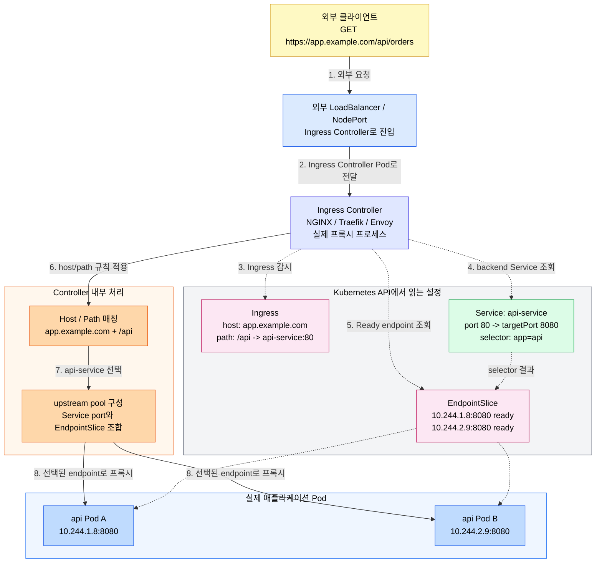
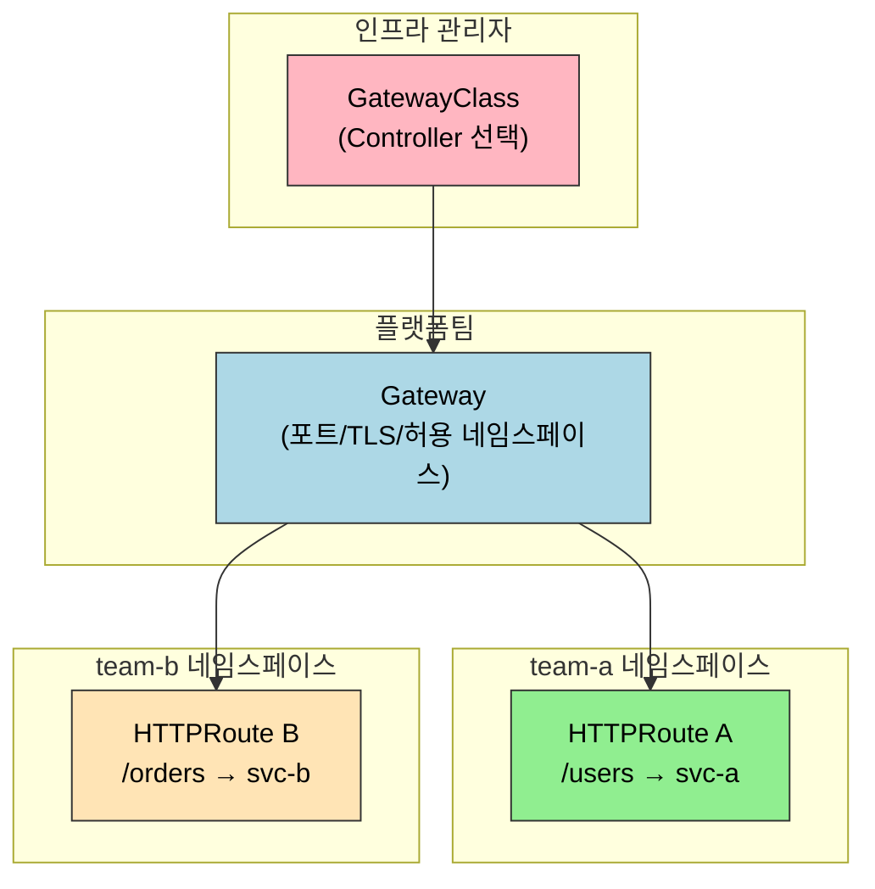
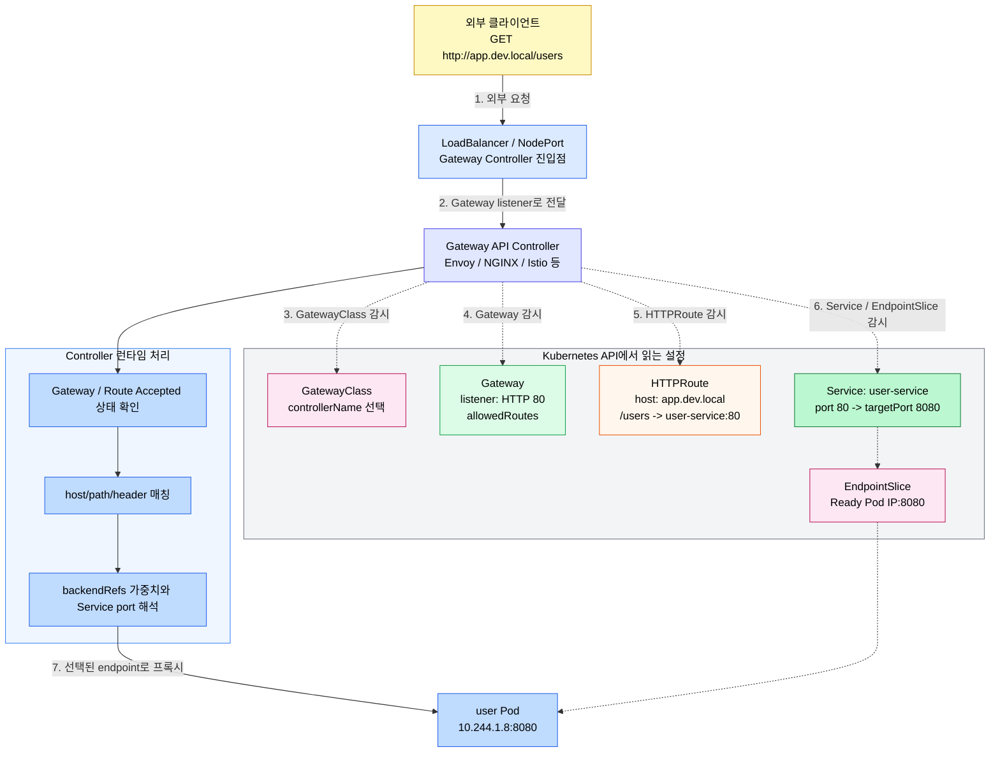
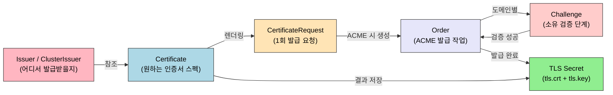

# Ingress와 Gateway API
---

> Ingress는 선언이고 Ingress Controller가 실행입니다. Gateway API는 이 역할을 더 세밀하게 분리해 대규모 조직의 멀티테넌시 요구를 표준으로 흡수합니다.


## 학습 목표
> 외부 트래픽 라우팅이 Ingress에서 Gateway API로 어떻게 확장되는지 봅니다.

이 장에서 확인할 목표는 다음과 같습니다:

1. Ingress 리소스와 Ingress Controller의 관계를 설명할 수 있습니다.
2. Gateway API의 세 역할 계층인 `GatewayClass`, `Gateway`, Route가 왜 분리되었는지 이해하고, stable Route 종류인 `HTTPRoute`와 `GRPCRoute`를 구분할 수 있습니다.
3. TLS 종단 위치(Ingress vs Pod)의 차이와 선택 기준을 설명할 수 있습니다.
4. `cert-manager`로 TLS 인증서를 자동화하는 방법을 이해할 수 있습니다.
5. Ingress 어노테이션 의존의 한계와 Gateway API가 주는 이식성 개선을 설명할 수 있습니다.
6. dev/온프레미스 환경에서 Ingress와 Gateway API를 어떤 순서로 도입할지 판단할 수 있습니다.


## 1. Ingress와 Ingress Controller
> 오래된 표준인 Ingress가 무엇을 해결했고 어디까지가 한계였는지 정리합니다.

공식 문서 기준으로 Ingress는 stable API이지만 frozen 상태입니다. 즉 제거되는 것은 아니고, 안정적으로 계속 쓸 수 있지만 새 기능은 더 이상 Ingress 스펙에 추가되지 않습니다. 그래서 현재 운영에서는 Ingress를 이해하고 쓸 수 있어야 하고, 신규 설계에서는 Gateway API를 함께 고려해야 합니다.

### 1.1 선언과 실행의 분리

`kind: Ingress`를 `kubectl apply`로 생성하면 Kubernetes API에 오브젝트가 저장됩니다. 이것은 "이런 규칙으로 트래픽을 라우팅해 달라"는 의도의 선언입니다. Ingress Controller가 없으면 선언만 API에 남고 아무 일도 일어나지 않습니다. `kubectl get ingress`의 `ADDRESS` 필드가 비어 있거나 `<pending>`인 상태입니다.

Deployment가 선언되면 kube-controller-manager 내장 컨트롤러가 Pod를 만드는 것과 달리, Ingress Controller는 내장되어 있지 않습니다. 어떤 구현체를 쓸지는 클러스터 운영자가 선택해서 별도로 설치해야 합니다.

### 1.2 Ingress에서 Service까지 이어지는 방식

Ingress는 최종 Pod를 직접 참조하지 않고 Service를 backend로 참조합니다. Ingress 규칙에는 `backend.service.name`과 `backend.service.port`가 들어가고, Ingress Controller는 이 값을 기준으로 요청을 어느 Service로 보낼지 결정합니다.

요청 흐름을 단순화하면 다음과 같습니다:



여기서 Service는 "라우팅 대상의 이름과 포트"를 안정적으로 제공하고, EndpointSlice는 그 Service 뒤의 실제 Pod IP 목록을 제공합니다. Ingress Controller는 API 서버를 감시하면서 Ingress, Service, EndpointSlice 변화를 읽고 자신의 프록시 설정을 갱신합니다.

세부 구현은 Controller마다 다를 수 있습니다. 어떤 Controller는 Service의 ClusterIP로 트래픽을 보내 kube-proxy 경로를 타고, 어떤 Controller는 EndpointSlice의 Pod IP를 upstream으로 직접 구성해 Service VIP를 우회합니다. 운영자가 기억해야 할 공통점은 Ingress YAML이 Pod를 직접 고르지 않고, Service와 EndpointSlice 상태가 최종 라우팅 성공 여부를 결정한다는 점입니다.

그래서 Ingress 장애를 볼 때는 `Ingress 규칙 -> Service 존재와 port -> EndpointSlice의 Ready endpoint -> Pod readiness` 순서로 확인하는 것이 빠릅니다. Ingress가 맞아도 Service port가 틀리거나 EndpointSlice가 비어 있으면 Controller는 보낼 백엔드를 찾지 못해 502, 503 또는 컨트롤러별 기본 에러를 반환합니다.

### 1.3 경로 매칭 규칙

Ingress는 세 가지 `pathType`을 지원합니다.

`Exact`는 경로가 대소문자까지 정확히 일치해야 매칭됩니다. `/api`는 `/api`에만 매칭되고 `/api/users`에는 매칭되지 않습니다. `Prefix`는 `/`로 나눈 경로 요소 단위로 접두사 매칭합니다. `/api`는 `/api/users`에 매칭되지만 `/apiV2`에는 매칭되지 않습니다. 문자열 접두사가 아니라 경로 요소 접두사입니다. `ImplementationSpecific`은 Controller가 별도 규칙으로 처리하거나 `Prefix`·`Exact`와 같게 처리할 수 있어 이식성이 없습니다.

여러 경로가 동시에 일치하면 가장 긴 경로가 우선합니다. 경로 길이가 같으면 `Exact`가 `Prefix`보다 우선합니다. 그 밖의 충돌 처리 방식은 Ingress 표준이 정하지 않으므로 Controller 문서를 확인해야 합니다.

### 1.4 Ingress 어노테이션의 한계

Ingress 스펙 자체는 호스트, 경로, TLS만 정의합니다. 속도 제한, 인증, URL 리라이트, 타임아웃 같은 실무 기능은 모두 Controller별 어노테이션에 의존합니다. `nginx.ingress.kubernetes.io/limit-rps: "10"`은 Traefik에서 동작하지 않습니다. Controller를 바꾸면 어노테이션을 전부 재작성해야 합니다.

### 1.5 공식 Ingress 모델의 나머지 경계

Ingress 규칙은 선택적인 `host`와 `http.paths` 목록으로 구성됩니다. `host`를 생략하면 Controller 진입 IP로 들어오는 모든 호스트가 규칙 후보가 되고, 지정하면 HTTP `Host` 헤더가 일치해야 합니다. 각 path에는 `pathType`과 Service 또는 resource backend가 필요하며, host와 path가 모두 맞는 요청만 backend로 전달됩니다.

규칙에 맞지 않는 요청은 **기본 backend(DefaultBackend)** 로 갑니다. `spec.defaultBackend`를 Ingress에 직접 지정할 수 있고, 지정하지 않으면 Controller가 자체 기본 backend를 제공할 수 있습니다. Ingress가 규칙 없이 default backend만 정의하는 단일 Service 노출 형태도 유효합니다.

대부분의 backend는 Service지만, **resource backend**는 같은 네임스페이스의 다른 Kubernetes 리소스를 `apiGroup`, `kind`, `name`으로 참조합니다. Service backend와 resource backend는 상호 배타적이며, 실제로 어떤 리소스 종류를 지원하는지는 Controller 구현에 달려 있습니다.

```yaml
spec:
  defaultBackend:
    resource:
      apiGroup: k8s.example.com
      kind: StorageBucket
      name: static-assets
```

호스트에는 `*.example.com`처럼 DNS label 하나만 대신하는 와일드카드를 쓸 수 있습니다. 따라서 `api.example.com`은 일치하지만 `v1.api.example.com`과 루트인 `example.com`은 일치하지 않습니다. 와일드카드는 HTTP `Host` 헤더에만 적용되며 임의의 정규식이 아닙니다.

`spec.ingressClassName`은 이 Ingress를 처리할 구현 구성을 선택합니다. `IngressClass.spec.controller`는 Controller 식별자이고 `parameters`는 구현체별 설정 리소스를 참조하며, `parameters.scope`가 `Cluster`이면 클러스터 범위, `Namespace`이면 특정 네임스페이스 범위입니다. 예전 `kubernetes.io/ingress.class` 어노테이션은 deprecated이며, 기본 IngressClass는 `ingressclass.kubernetes.io/is-default-class: "true"`로 표시합니다. 기본 클래스를 둘 이상 두면 class를 생략한 새 Ingress의 생성을 admission controller가 거부합니다.

Kubernetes는 Ingress Controller를 기본 제공하지 않습니다. Kubernetes 프로젝트가 직접 지원하고 유지보수하는 구현은 AWS와 GCE Ingress Controller이며, 공식 페이지의 나머지 목록은 Kubernetes 프로젝트가 책임지지 않는 서드파티입니다. 하나의 클러스터에서 여러 Controller를 운영할 때는 IngressClass로 대상을 분리하고, leader-election 같은 추가 설정은 선택한 Controller 문서를 따라야 합니다.

### 1.6 Ingress 업데이트와 가용성 경계

존재하는 Ingress의 규칙을 바꾸려면 Kubernetes API에 저장된 오브젝트를 수정하면 됩니다. 직접 편집이 필요하면 `kubectl edit ingress <name>`을 사용하고, 소스 매니페스트를 관리하면 `kubectl apply -f ingress.yaml`로 업데이트합니다. 전체 리소스를 교체하는 `kubectl replace -f ingress.yaml`도 가능하지만, 리소스 버전 충돌과 기존 필드를 함께 비교해야 하므로 다음 원하는 상태를 선언하는 `apply`가 일반적인 운영 방식입니다.

업데이트가 성공하면 Controller가 API 변경을 감지하고 로드 밸런서나 프록시 설정을 갱신합니다. 이 과정의 반영 속도와 지연 시간은 Controller와 클라우드 구현에 따라 다르므로, 업데이트 전후 `kubectl describe ingress <name>`의 상태와 Controller 이벤트를 함께 확인해야 합니다.

가용성 존 장애를 견디는 범위는 Ingress 스펙의 공통 기능이 아닙니다. 트래픽을 여러 실패 영역으로 분산하는지는 클라우드 제공자와 Ingress Controller 구현에 따라 다르므로, 노드와 Controller replica, Service backend의 존 배치, 클라우드 외부 로드 밸런서의 배치 방식을 함께 검증해야 합니다.


## 2. Gateway API
> 역할 분리와 확장성을 기준으로 Gateway API의 설계를 설명합니다.

Gateway API는 Kubernetes 공식 문서에서 Ingress API의 successor로 설명됩니다. 핵심 차이는 "모든 책임을 Ingress 하나에 몰아넣지 않는다"는 점입니다. Ingress가 하나의 리소스로 호스트, 경로, TLS, 구현체 의존 기능까지 모두 짊어졌다면, Gateway API는 역할을 나누어 멀티팀 운영과 이식성을 더 잘 지원합니다.

### 2.1 역할 분리 모델

Gateway API는 책임을 세 역할 계층으로 분리합니다. 인프라 구현은 `GatewayClass`, 트래픽 수신 지점은 `Gateway`, 애플리케이션 라우팅은 `HTTPRoute`나 `GRPCRoute` 같은 Route 종류가 담당합니다.

`GatewayClass`는 인프라 관리자 영역입니다. 어떤 Controller 구현체를 사용할지 정의합니다. 변경 빈도가 낮고 일반 개발자는 접근 권한이 없습니다.

`Gateway`는 플랫폼팀 영역입니다. 어떤 포트에서, 어떤 프로토콜로, 어떤 TLS 인증서를 사용해 트래픽을 수신할지 정의합니다. `allowedRoutes`로 어떤 네임스페이스의 Route를 허용할지 제어합니다.

`HTTPRoute`는 애플리케이션 개발자 영역입니다. 내 서비스로 오는 트래픽의 라우팅 규칙만 정의합니다. `parentRefs`로 공유 Gateway를 참조하고 자신의 호스트명/경로만 작성합니다. 각 팀이 자신의 네임스페이스에서 독립적으로 Route를 관리합니다.



공식 문서 기준으로 `Gateway`는 기본적으로 같은 네임스페이스의 Route만 받습니다. 다른 네임스페이스 Route를 붙이려면 `allowedRoutes`를 명시해야 합니다. 이 제약이 있기 때문에 Gateway API는 "처음부터 멀티테넌시와 권한 경계"를 고려한 구조라고 볼 수 있습니다.

`allowedRoutes`는 Route가 Gateway listener에 붙을 권한만 제어합니다. Route가 다른 네임스페이스의 Service를 `backendRefs`로 참조하려면 대상 네임스페이스 소유자가 `ReferenceGrant`로 별도 허가해야 하므로, 진입 권한과 백엔드 참조 권한을 혼동해서는 안 됩니다.

요청이 실제 애플리케이션까지 이동하는 흐름은 다음과 같습니다:



### 2.2 표준 기능

Gateway API는 자주 쓰는 기능을 스펙에 직접 포함해 어노테이션 의존을 줄입니다. 다만 Controller 간 이식성은 구현체가 지원하는 Core·Extended 기능과 공식 적합성 결과 범위 안에서만 기대해야 합니다.

| 기능 | HTTPRoute 필드 |
|------|---------------|
| 트래픽 가중치 분할 | `backendRefs[].weight` |
| 헤더 기반 라우팅 | `matches[].headers` |
| URL 리라이트 | `filters[].urlRewrite` |
| 리다이렉트 | `filters[].requestRedirect` |
| 헤더 조작 | `filters[].requestHeaderModifier` |

### 2.3 다중 프로토콜 지원

Ingress는 HTTP/HTTPS 전용입니다. Gateway API Standard Channel의 핵심 stable 라우팅 리소스 네 종류는 `GatewayClass`, `Gateway`, `HTTPRoute`, `GRPCRoute`입니다. 다른 네임스페이스의 리소스 참조를 허가하는 `ReferenceGrant`도 GA 상태로 Standard Channel에 포함됩니다. `GRPCRoute`는 gRPC 서비스명과 메서드명으로 라우팅합니다. `TCPRoute`, `TLSRoute`, `UDPRoute`는 Experimental Channel의 리소스이므로 별도 CRD 설치와 구현체 지원 여부를 확인해야 합니다.

### 2.4 Ingress와 Gateway API를 어떻게 선택할까

개인 클러스터나 작은 팀에서는 Ingress만으로도 충분한 경우가 많습니다. 호스트/경로 라우팅, TLS 종료, 몇 가지 NGINX 어노테이션 정도면 요구사항을 충족하는 경우가 많기 때문입니다. 이 단계에서는 복잡한 리소스 분리보다 단순성이 더 중요합니다.

반대로 여러 팀이 하나의 진입점을 공유하고, 플랫폼팀과 애플리케이션팀의 권한을 나눠야 하고, 추후 Controller 교체 가능성까지 고려한다면 Gateway API가 더 자연스럽습니다. 핵심 기준은 "라우팅 기능이 많은가"보다 "누가 무엇을 소유해야 하는가"에 가깝습니다.

실무 판단을 단순화하면 이렇습니다. 단일 팀과 단일 ingress-nginx면 Ingress부터, 멀티팀 공유 게이트웨이와 교차 네임스페이스 라우트가 필요하면 Gateway API를 검토합니다. 즉 Ingress는 빠른 시작에 강하고, Gateway API는 팀 경계와 확장성에 강합니다.

여기서 한 번 더 선을 그을 필요가 있습니다. 이 장의 Gateway API는 Kubernetes의 north-south 진입과 공유 게이트웨이 관점입니다. 반면 Service Mesh 문서에서 다시 등장하는 Gateway API와 `HTTPRoute`는 east-west 서비스 간 정책이나 메시 구현체와 연결되는 문맥이 더 강합니다. 같은 리소스 이름이 나와도 "클러스터 진입"을 다루는지, "서비스 간 트래픽 제어"를 다루는지 맥락을 나눠서 읽어야 합니다.

### 2.5 설계 원칙과 적합성 확인

Gateway API는 역할 지향적이고, 이식 가능하며, 표현력이 높고, 확장 가능한 API를 설계 원칙으로 둡니다. 여기서 이식 가능하다는 말은 모든 기능이 모든 구현에서 같다는 뜻이 아니라, 여러 구현이 공통으로 제공하는 Core 기능과 선택적인 Extended 기능을 적합성 프로필로 구분한다는 뜻입니다. Controller를 선택할 때는 제품 소개보다 공식 conformance report에서 필요한 리소스와 기능의 지원 상태를 확인해야 합니다.

Gateway API 리소스는 Kubernetes 내장 API가 아니라 CRD로 설치됩니다. CRD만 설치해도 트래픽은 흐르지 않으며, `GatewayClass.spec.controllerName`을 인식하는 Controller가 함께 있어야 합니다. Ingress에서 옮길 때도 YAML 필드만 바꾸지 말고 IngressClass와 Controller를 GatewayClass와 Controller로, Ingress의 host/path를 HTTPRoute로, 진입 포트와 TLS를 Gateway listener로 나눠 매핑해야 합니다.

`GRPCRoute`는 HTTPRoute와 같은 Gateway에 연결되지만 gRPC service와 method를 기준으로 요청을 매칭합니다. `HTTPRoute`와 `GRPCRoute`가 같은 hostname에 연결되면 HTTP/2 요청의 콘텐츠 유형과 Route 규칙에 따라 어느 Route가 처리할지 결정됩니다. Route가 Gateway에 붙었는지는 생성 성공만으로 판단하지 않고 `status.parents[].conditions`의 `Accepted`, `ResolvedRefs` 같은 조건을 확인해야 합니다.


## 3. TLS 관리
> 외부 공개 환경에서 인증서 자동화가 왜 기본값이 되는지 다룹니다.

### 3.1 TLS 종단 위치

`TLS Termination`은 Ingress Controller에서 TLS를 종단하고 Pod로는 평문 HTTP를 보내는 방식입니다. 인증서 관리가 중앙화되고 L7 기능(경로 라우팅, 헤더 조작)을 사용할 수 있습니다. 대부분의 웹 서비스에 적합합니다.

`TLS Passthrough`는 Ingress Controller가 암호화된 트래픽을 그대로 Pod로 전달하는 방식입니다. 지원하는 Controller는 TLS ClientHello의 SNI를 이용해 라우팅할 수 있지만 내용을 복호화하지 않습니다. 애플리케이션에서 TLS를 종단해야 하는 요구에 사용할 수 있으나 Ingress 표준 기능이 아니므로 Controller 지원과 설정을 확인해야 하며, HTTP 경로·헤더 같은 L7 기능은 사용할 수 없습니다.

### 3.2 cert-manager의 리소스 모델

cert-manager는 TLS 인증서 발급·갱신·교체를 자동화합니다. 각 단계가 별도 CR로 표현돼, Pod·Ingress·Gateway 어디에서 인증서를 쓰든 같은 흐름으로 동작합니다.



`Issuer`는 네임스페이스 범위, `ClusterIssuer`는 클러스터 범위입니다. 둘은 발급처(Let's Encrypt, 사내 CA, Vault PKI 등)를 정의합니다. `Certificate`는 운영자가 작성하는 "원하는 인증서"의 선언이며 도메인·키 알고리즘·갱신 주기 같은 스펙을 가집니다. `CertificateRequest`·`Order`·`Challenge`는 cert-manager가 내부 처리에서 자동 생성하는 객체로, 운영자가 직접 만들지 않습니다.

### 3.3 ACME 검증 방식: HTTP-01과 DNS-01

Let's Encrypt 같은 ACME 서버는 발급 전 도메인 소유를 검증합니다. cert-manager는 두 방식을 지원합니다.

| 검증 방식 | 동작 | 사용 시점 |
|---------|------|----------|
| HTTP-01 | ACME 서버가 `http://<domain>/.well-known/acme-challenge/<token>` 경로로 토큰을 조회. cert-manager가 임시 Ingress 규칙을 자동 생성 | 외부에서 80 포트 도달 가능한 일반 웹 서비스 |
| DNS-01 | ACME 서버가 `_acme-challenge.<domain>` TXT 레코드를 조회. cert-manager가 DNS 공급자 API로 레코드를 임시 생성 | 와일드카드 인증서(`*.example.com`), 외부에서 도달 불가능한 내부 도메인 |

```yaml
apiVersion: cert-manager.io/v1
kind: ClusterIssuer
metadata:
  name: letsencrypt-prod
spec:
  acme:
    server: https://acme-v02.api.letsencrypt.org/directory
    email: admin@example.com
    privateKeySecretRef:
      name: letsencrypt-prod
    solvers:
      - http01:
          ingress:
            class: nginx
      - dns01:
          cloudDNS:
            project: my-gcp-project
            serviceAccountSecretRef:
              name: clouddns-dns01-credentials
              key: key.json
        selector:
          dnsZones: ["example.com"]
```

위 ClusterIssuer는 두 솔버를 모두 등록합니다. `selector`가 매칭되는 도메인은 DNS-01로, 그렇지 않으면 HTTP-01로 검증됩니다. 와일드카드 인증서는 ACME 표준상 DNS-01만 가능하므로, `*.example.com`을 발급받으려면 DNS 공급자 API 자격증명을 cert-manager가 가져야 합니다.

GCP에서는 장기 JSON 키보다 Workload Identity와 같은 단기 인증을 우선 고려해야 합니다. JSON 키를 부득이하게 사용할 때는 DNS 레코드 변경에 필요한 최소 권한만 부여하고, Kubernetes Secret에만 저장하며 Git·문서·명령 기록에 절대 커밋하지 않습니다. 노출된 자격증명은 즉시 폐기하고 교체해야 합니다.

### 3.4 Ingress 어노테이션 vs 직접 Certificate

cert-manager 사용 패턴은 두 가지입니다.

**어노테이션 모드**에서는 cert-manager의 ingress-shim이 Ingress의 `tls.hosts`, `secretName`, issuer 어노테이션을 읽어 Certificate와 Secret을 만듭니다.

```yaml
apiVersion: networking.k8s.io/v1
kind: Ingress
metadata:
  name: app-ingress
  annotations:
    cert-manager.io/cluster-issuer: "letsencrypt-prod"
spec:
  ingressClassName: nginx
  tls:
    - hosts: ["app.example.com"]
      secretName: app-tls
  rules:
    - host: app.example.com
      http:
        paths:
          - path: /
            pathType: Prefix
            backend:
              service:
                name: app-service
                port: { number: 80 }
```

**직접 Certificate 모드**는 Ingress와 별도로 Certificate를 작성합니다. Pod가 Secret을 직접 마운트하거나, Gateway API의 `tls.certificateRefs`가 그 Secret을 참조하는 시나리오에 적합합니다.

```yaml
apiVersion: cert-manager.io/v1
kind: Certificate
metadata:
  name: app-cert
  namespace: production
spec:
  secretName: app-tls
  issuerRef:
    name: letsencrypt-prod
    kind: ClusterIssuer
  dnsNames:
    - app.example.com
    - api.example.com
  duration: 2160h    # 90일
  renewBefore: 360h  # 만료 15일 전 갱신
```

운영 관점에서는 Ingress가 표현 가능한 도메인은 어노테이션 모드가 단순합니다. Gateway API, mTLS sidecar, 데이터베이스 TLS 같은 시나리오에서는 Certificate를 직접 둡니다. 두 패턴은 결과적으로 같은 Secret을 만들므로, 같은 인증서를 여러 Ingress가 공유하는 경우에도 직접 모드가 자연스럽습니다.

### 3.5 Gateway API와의 연동

Gateway API의 `Gateway.spec.listeners[].tls.certificateRefs`는 TLS Secret을 직접 참조합니다. cert-manager가 만드는 Secret 이름을 그대로 적으면 됩니다.

```yaml
apiVersion: gateway.networking.k8s.io/v1
kind: Gateway
metadata:
  name: shared-gateway
spec:
  gatewayClassName: nginx
  listeners:
    - name: https
      port: 443
      protocol: HTTPS
      tls:
        mode: Terminate
        certificateRefs:
          - name: app-tls   # cert-manager가 만든 Secret
```

cert-manager는 Gateway의 `cert-manager.io/issuer` 또는 `cert-manager.io/cluster-issuer` **어노테이션**을 읽어 Certificate를 생성할 수 있습니다. 이 기능의 지원 여부와 활성화 방법은 Kubernetes 버전이 아니라 cert-manager 버전과 설정에 달려 있으며, cert-manager 1.15 문서에서는 beta 기능이고 `config.gatewayAPI.enabled: true` 설정이 필요합니다. Gateway API CRD가 cert-manager 시작 뒤에 설치됐다면 cert-manager Deployment를 재시작해야 합니다.

`08-02 TLS와 API 접근 보안`은 컨트롤 플레인 PKI(API 서버, etcd, kubelet 인증서)에 집중하고, 외부 트래픽 인증서 자동화는 본 절을 보면 됩니다.


## 4. 자체 관리 클러스터 환경
> 같은 리소스 모델을 유지하면서 환경별 노출 방식만 다르게 가져가는 원칙을 정리합니다.

자체 관리 클러스터에서는 Ingress Controller가 NodePort로 노출될 수 있습니다. 외부 LoadBalancer가 없다면 `ADDRESS` 필드가 비어 있을 수 있으므로 Controller 상태와 실제 노출 Service를 함께 확인합니다. 도메인 기반 테스트는 `/etc/hosts`에 노드 IP를 등록하거나, `curl -H "Host: myapp.example.com" http://<node-ip>:<http-node-port>` 형태로 호스트 헤더를 수동 지정합니다.

dev 환경에서는 보통 Ingress를 먼저 붙이고, Gateway API는 실험용 namespace에서 별도 Controller 지원 여부를 확인하며 도입합니다. 이유는 간단합니다. Ingress는 `ingress-nginx` 하나만 있으면 바로 테스트가 가능하지만, Gateway API는 CRD 설치 여부, `GatewayClass` 구현체, Controller 지원 범위를 같이 맞춰야 하기 때문입니다.

예를 들어 현재 dev 흐름은 다음처럼 가져가면 무난합니다.

1. 애플리케이션 Service는 `ClusterIP`로 유지합니다.
2. 외부 노출은 `ingress-nginx` NodePort를 통해 Ingress로 먼저 검증합니다.
3. 멀티팀 경계나 shared gateway 요구가 생기면 Gateway API CRD와 Controller를 별도 검증 환경에 올립니다.
4. `GatewayClass`와 `Gateway`는 플랫폼 영역으로 두고, 각 앱 팀은 `HTTPRoute`만 관리하게 나눕니다.

Ingress 기준의 dev 예시는 다음처럼 충분합니다.

```yaml
apiVersion: networking.k8s.io/v1
kind: Ingress
metadata:
  name: app-ingress
spec:
  ingressClassName: nginx
  rules:
  - host: app.dev.local
    http:
      paths:
      - path: /
        pathType: Prefix
        backend:
          service:
            name: app-service
            port:
              number: 80
```

Gateway API를 시험 도입할 때는 다음처럼 `Gateway`와 `HTTPRoute`를 나누는 식으로 시작하는 것이 좋습니다.

```yaml
apiVersion: gateway.networking.k8s.io/v1
kind: Gateway
metadata:
  name: shared-gateway
  namespace: infra
spec:
  gatewayClassName: nginx
  listeners:
  - name: http
    port: 80
    protocol: HTTP
    allowedRoutes:
      namespaces:
        from: Selector
        selector:
          matchLabels:
            gateway-access: shared
---
apiVersion: gateway.networking.k8s.io/v1
kind: HTTPRoute
metadata:
  name: app-route
  namespace: default
spec:
  parentRefs:
  - name: shared-gateway
    namespace: infra
  hostnames:
  - "app.dev.local"
  rules:
  - matches:
    - path:
        type: PathPrefix
        value: /
    backendRefs:
    - name: app-service
      port: 80
```

교차 네임스페이스 Route를 허용할 때는 `kubectl label namespace default gateway-access=shared`처럼 플랫폼팀이 승인한 네임스페이스에만 라벨을 부여합니다. `from: All`은 모든 네임스페이스의 Route 연결 가능성을 넓히므로 공유 Gateway에서는 피해야 합니다.

중요한 점은 Gateway API YAML을 쓴다고 자동으로 동작하는 것이 아니라는 점입니다. CRD만 설치되어 있어도 부족하고, 해당 `GatewayClass`를 실제로 처리하는 Controller가 있어야 합니다. 그래서 dev에서는 "CRD 설치 여부"와 "GatewayClass Accepted 상태"를 먼저 확인하는 루틴이 필요합니다.


## 5. 점검 질문
> Ingress와 Gateway API를 실제 운영 판단 질문으로 다시 점검합니다.

### Q1. Ingress Controller가 없으면 Ingress가 무용지물인 이유

Ingress 리소스는 선언입니다. Controller가 없으면 API에 오브젝트가 저장될 뿐 아무 일도 일어나지 않습니다.

```bash
kubectl get ingress <name> -n <namespace>
kubectl describe ingress <name> -n <namespace>
```

`ADDRESS`와 이벤트를 함께 확인하면 Controller가 이 Ingress를 인식했는지 판단할 수 있습니다.

심화 질문. Ingress Controller를 나중에 설치했을 때 기존 Ingress가 자동으로 인식되는가? Controller가 시작할 때 Kubernetes API에 List 요청을 보내 모든 기존 Ingress를 가져온다(List-Watch 패턴의 List 단계). 이후 Watch로 변경 사항을 감시합니다. Controller 설치 후 기존 Ingress가 자동으로 반영되므로 재적용이 필요 없습니다.

### Q2. Gateway API 역할 분리 모델

```bash
# Gateway API CRD 설치 확인
kubectl get crd | grep gateway.networking.k8s.io

# 없으면 설치
# 원격 매니페스트를 API 서버에 바로 적용하지 않고, 검토한 버전을 내려받아 내용을 확인합니다.
GATEWAY_API_VERSION="vX.Y.Z" # 공식 릴리스에서 검토한 고정 버전으로 바꿉니다.
curl -fL "https://github.com/kubernetes-sigs/gateway-api/releases/download/${GATEWAY_API_VERSION}/standard-install.yaml" -o standard-install.yaml
shasum -a 256 standard-install.yaml
# 해시 출력만으로 출처가 검증되지는 않습니다. 신뢰한 릴리스 정보와 내용이 일치하는지 확인한 뒤 실행합니다.
kubectl apply -f standard-install.yaml

# Selector가 이 실습 네임스페이스를 허용하도록 승인 라벨을 부여합니다.
kubectl label namespace ch19-smoke gateway-access=shared

# GatewayClass, Gateway, HTTPRoute 생성
kubectl apply -f - <<EOF
apiVersion: gateway.networking.k8s.io/v1
kind: GatewayClass
metadata:
  name: nginx
spec:
  controllerName: k8s.nginx.org/nginx-gateway-controller
---
apiVersion: gateway.networking.k8s.io/v1
kind: Gateway
metadata:
  name: main-gateway
  namespace: infra
spec:
  gatewayClassName: nginx
  listeners:
    - name: http
      port: 80
      protocol: HTTP
      allowedRoutes:
        namespaces:
          from: Selector
          selector:
            matchLabels:
              gateway-access: shared
---
apiVersion: gateway.networking.k8s.io/v1
kind: HTTPRoute
metadata:
  name: my-route
  namespace: ch19-smoke
spec:
  parentRefs:
    - name: main-gateway
      namespace: infra
  hostnames:
    - "test.example.com"
  rules:
    - matches:
        - path:
            type: PathPrefix
            value: /
      backendRefs:
        - name: nginx
          port: 80
EOF
```

이 예제를 실행하려면 먼저 `kubectl label namespace ch19-smoke gateway-access=shared`로 승인 라벨을 부여합니다. 라벨이 없는 네임스페이스의 Route는 의도적으로 Gateway에 연결되지 않습니다.

심화 질문. HTTPRoute가 존재하지 않는 Gateway를 `parentRefs`에서 참조하면 어떻게 되는가? HTTPRoute의 `status.parents[].conditions`에 `Accepted: False` 조건이 기록됩니다. `reason`에 "NoMatchingParent" 같은 원인이 명시됩니다. `kubectl describe httproute`로 확인할 수 있습니다.

추가 메모. 공식 Kubernetes 문서에서는 Gateway API를 Ingress의 후속 API로 안내하지만, 실제 사용 가능 기능은 설치한 Controller의 구현 범위에 따라 달라집니다. 따라서 실습 전에 `kubectl get gatewayclass`와 구현체의 conformance 문서를 함께 확인하는 습관이 필요합니다.

공식 문서 기준으로 Gateway는 기본적으로 같은 네임스페이스의 Route만 받습니다. 다른 네임스페이스 Route를 연결하려면 `allowedRoutes`를 명시해야 합니다. 따라서 "왜 내 HTTPRoute가 안 붙지?"라는 문제는 `parentRefs`뿐 아니라 Gateway listener의 `allowedRoutes`도 함께 봐야 합니다.

### Q3. TLS 종단 위치 비교

Ingress에서 TLS를 종단하면 Controller가 인증서를 관리하고 HTTP 내용을 볼 수 있어 경로 라우팅과 헤더 조작을 적용할 수 있습니다. Pod에서 종단하는 TLS Passthrough는 Controller가 내용을 복호화하지 않으므로 SNI 기반 호스트 라우팅만 가능하고, 경로 기반 라우팅과 헤더 조작 같은 L7 기능은 사용할 수 없습니다. Passthrough 활성화 방법은 Ingress 표준이 아니라 Controller별 설정입니다.

### Q4. PathType 동작 차이 확인

```bash
# 1.3의 Exact와 Prefix 규칙을 적용한 뒤 세 요청을 비교합니다.
NODE_IP=<worker-node-ip>
HTTP_NODE_PORT=<ingress-controller-http-node-port>
curl -H "Host: pathtest.example.com" "http://$NODE_IP:$HTTP_NODE_PORT/api"
curl -H "Host: pathtest.example.com" "http://$NODE_IP:$HTTP_NODE_PORT/api/users"
curl -H "Host: pathtest.example.com" "http://$NODE_IP:$HTTP_NODE_PORT/apiV2"
```

심화 질문. Ingress에서 `/api`를 Exact로, `/api`를 Prefix로 동시에 정의하면 어떤 것이 우선하는가? Exact가 항상 Prefix보다 우선합니다. `/api`로 정확히 오는 요청은 Exact 규칙의 백엔드로 가고, `/api/users` 같은 하위 경로는 Prefix 규칙을 따릅니다.

### Q5. Gateway API 다중 프로토콜 지원

Ingress는 HTTP/HTTPS 전용입니다. Gateway API는 프로토콜별 Route 리소스를 표준으로 정의합니다.

```bash
# stable API의 GRPCRoute 예시
kubectl apply -f - <<EOF
apiVersion: gateway.networking.k8s.io/v1
kind: GRPCRoute
metadata:
  name: grpc-route
  namespace: production
spec:
  parentRefs:
    - name: main-gateway
      namespace: infra
  hostnames:
    - "grpc.example.com"
  rules:
    - matches:
        - method:
            service: UserService
            method: GetUser
      backendRefs:
        - name: user-service
          port: 50051
EOF
```

TCPRoute, TLSRoute, UDPRoute는 Experimental 상태입니다. 사용 전에 Experimental 채널 CRD와 설치한 Controller의 지원 및 Conformance 현황을 확인해야 합니다.

심화 질문. TCPRoute는 어떤 기준으로 트래픽을 분기하는가? TCP 레벨에서는 HTTP 헤더나 경로 같은 L7 정보가 없습니다. TCPRoute는 포트 기반으로만 라우팅합니다. 같은 포트에서 여러 TCP 서비스를 구분하려면 TLSRoute를 사용하고 SNI(Server Name Indication)로 분기합니다.

### Q6. 여러 팀의 동일 호스트 충돌 해결

```bash
# team-a와 team-b가 같은 호스트/다른 경로 사용 (충돌 아님)
kubectl apply -f - <<EOF
apiVersion: gateway.networking.k8s.io/v1
kind: HTTPRoute
metadata:
  name: team-a-route
  namespace: team-a
spec:
  parentRefs:
    - name: main-gateway
      namespace: infra
  hostnames:
    - "api.myapp.com"
  rules:
    - matches:
        - path:
            type: PathPrefix
            value: /users
      backendRefs:
        - name: user-service
          port: 80
---
apiVersion: gateway.networking.k8s.io/v1
kind: HTTPRoute
metadata:
  name: team-b-route
  namespace: team-b
spec:
  parentRefs:
    - name: main-gateway
      namespace: infra
  hostnames:
    - "api.myapp.com"
  rules:
    - matches:
        - path:
            type: PathPrefix
            value: /orders
      backendRefs:
        - name: order-service
          port: 80
EOF

# 각 Route 상태 확인 (Accepted 조건 확인)
kubectl describe httproute team-a-route -n team-a
kubectl describe httproute team-b-route -n team-b
```

심화 질문. 같은 요청에 여러 HTTPRoute 규칙이 겹치면 어떻게 판단하는가? Gateway API 명세는 가장 구체적인 hostname과 path, method·header·query parameter 매칭 수를 차례로 비교합니다. 서로 다른 Route가 끝까지 같으면 생성 시각이 빠른 Route, 다시 같으면 `namespace/name` 사전순으로 결정합니다. 이 순서는 요청별 규칙 선택이므로 Route 전체가 거부됐다는 뜻이 아니며, `status.parents[].conditions`에 모든 패배 규칙의 상세 원인이 기록된다고 가정해서는 안 됩니다.

### Q7. dev 환경에서는 Ingress와 Gateway API를 어떤 순서로 가져가면 되나?

대부분의 dev 환경에서는 Ingress부터 시작하는 편이 현실적입니다. 이미 `ingress-nginx`가 있고 NodePort로 외부 접근만 열려 있다면 `ingressClassName: nginx` 하나로 바로 검증할 수 있기 때문입니다.

```bash
# 현재 ingress-nginx 동작 확인
kubectl get pods -n ingress-nginx
kubectl get svc -n ingress-nginx

# Host 헤더로 로컬 검증
NODE_IP=<worker-node-ip>
HTTP_NODE_PORT=<ingress-controller-http-node-port>
curl -H "Host: app.dev.local" "http://$NODE_IP:$HTTP_NODE_PORT/"
```

Gateway API는 "대체재"라기보다 "다음 단계 구조화"에 가깝습니다. CRD 설치 여부, `GatewayClass` 존재, 실제 Controller 지원 범위까지 확인해야 하므로 초기 dev 세팅으로는 비용이 더 듭니다.

```bash
# Gateway API 최소 확인 루틴
kubectl get crd | grep gateway.networking.k8s.io
kubectl get gatewayclass
kubectl get gateways -A
kubectl get httproutes -A
```

판단 기준은 단순합니다. 단일 팀과 단일 ingress-nginx면 Ingress로 충분합니다. 여러 팀이 하나의 진입점을 공유하고 `Gateway`와 `HTTPRoute`의 소유권을 분리해야 하면 Gateway API를 검토합니다.


## 6. 다음 단계
> 트래픽 진입 계층 위에서 배포 단위를 묶는 Helm으로 연결합니다.

다음 장(Helm 기초)에서는 반복되는 매니페스트를 패키지로 묶는 법을 다룹니다. Ingress 리소스도 Helm 차트로 관리 대상이 되며, 본 장에서 익힌 구조가 templating 관점에서 다시 등장합니다.


## 관련 문서
> 네트워킹 기초, 다음 장, 점검 문서를 함께 둡니다.

- [네트워킹](04-01.%EB%84%A4%ED%8A%B8%EC%9B%8C%ED%82%B9.md) — Ch04 전체 지도
- [Service와 EndpointSlice](04-04.Service%EC%99%80%20EndpointSlice.md) — Ingress backend가 참조하는 Service 구조
- [DNS와 CoreDNS](04-05.DNS%EC%99%80%20CoreDNS.md) — Service 이름 해석
- [Ingress와 Gateway API 점검](04-06.Ingress%EC%99%80%20Gateway%20API%20%EC%A0%90%EA%B2%80.md) — Ingress 매칭과 Gateway 역할 분리 회상 질문
- [Helm 기초](../10_packaging/10-01.Helm%20%EA%B8%B0%EC%B4%88.md) — 다음 장, 패키지 관리자로 배포 자동화
- [Gateway API와 트래픽](../../service-mesh/01_foundation/03-01.Gateway%20API%EC%99%80%20%ED%8A%B8%EB%9E%98%ED%94%BD.md) — Service Mesh 관점에서 다시 보는 후속 문서
