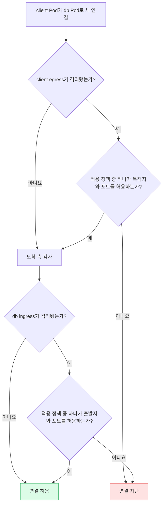

# NetworkPolicy
---
> NetworkPolicy는 Pod가 주고받는 L3·L4 연결을 허용 목록으로 제한하며, 실제 강제 여부는 CNI 네트워크 플러그인에 달려 있습니다.


## 학습 목표

> 정책 선택, 격리 방향, 허용 규칙을 분리해 읽고 실제 연결의 허용 여부를 판정하는 것이 목표입니다.

이 문서를 읽고 나면 다음 작업을 수행할 수 있습니다:

1. 출발 Pod의 egress와 도착 Pod의 ingress를 함께 평가해 연결 가능 여부를 설명할 수 있습니다.
2. `podSelector`, `namespaceSelector`, `ipBlock` 조합이 선택하는 대상을 YAML 들여쓰기까지 포함해 판별할 수 있습니다.
3. 기본 거부 정책을 설계하고 DNS, `hostNetwork`, 기존 연결 같은 운영 예외를 진단할 수 있습니다.


## 1. NetworkPolicy가 해결하는 문제

> 기본 Pod 네트워크의 전면 연결성을 애플리케이션 단위의 최소 허용 연결로 좁힙니다.

Kubernetes 네트워크 모델에서는 기본적으로 Pod가 다른 Pod와 통신할 수 있습니다. 이 전제는 서비스 발견을 단순하게 만들지만, 침해된 frontend Pod가 데이터베이스까지 접근하는 횡적 이동도 허용합니다. NetworkPolicy는 연결의 한쪽 또는 양쪽 끝이 Pod인 TCP·UDP·SCTP 트래픽을 IP 주소와 포트 수준에서 제한합니다.

정책은 방화벽 장비 자체가 아니라 Kubernetes API의 의도 선언입니다. CNI(Container Network Interface) 플러그인이 NetworkPolicy를 지원하고 실제 데이터 경로에 규칙을 설치해야 효력이 생깁니다. 지원하지 않는 플러그인에서 오브젝트만 생성하면 API 서버는 받아들이지만 트래픽은 바뀌지 않습니다.

NetworkPolicy는 애플리케이션 중심의 허용 목록입니다. Pod 자신에 대한 접근과 Pod가 실행 중인 노드에서 오가는 트래픽은 차단할 수 없으며, 일반적인 다른 endpoint나 Service 자체를 정책 대상으로 삼는 모델도 아닙니다.

> 이 개념은 클라우드 보안 그룹과 비슷하지만, 인스턴스가 아니라 label로 선택한 Pod 집합에 적용됩니다. 이 비유는 L3·L4 허용 목록까지 유효하며 정책 합산과 Pod 생명주기에서는 깨집니다.


## 2. 격리는 ingress와 egress가 독립적입니다

> Pod는 방향별로 비격리 상태에서 시작하며, 자신을 선택하는 정책이 해당 방향을 선언할 때 격리됩니다.

정책이 없는 Pod는 ingress와 egress 모두 비격리 상태이므로 모든 연결을 허용합니다. 어떤 NetworkPolicy가 Pod를 선택하고 `policyTypes`에 `Ingress`를 포함하면 ingress가 격리되며, `Egress`를 포함하면 egress가 격리됩니다. 한 방향이 격리되어도 다른 방향은 자동으로 격리되지 않습니다.

격리된 방향에서는 그 Pod에 적용되는 모든 정책의 허용 규칙을 합집합으로 계산합니다. 정책은 순서대로 평가하거나 서로 충돌하지 않으므로, 더 엄격한 정책을 추가해 기존 허용을 취소할 수 없습니다. 명시적 deny 규칙이 없고 허용 범위만 더해진다는 점이 핵심입니다.

출발 Pod에서 도착 Pod로 새 연결을 만들려면 출발 Pod의 egress와 도착 Pod의 ingress가 모두 허용해야 합니다. 허용된 연결의 응답 트래픽은 암묵적으로 허용되지만, 이것이 반대 방향의 새로운 연결까지 허용한다는 뜻은 아닙니다.



이 도식은 한쪽만 허용해서는 충분하지 않다는 사실을 보여 줍니다. 예를 들어 client egress가 `db:5432`를 허용해도 db ingress가 client를 허용하지 않으면 연결은 성립하지 않습니다.


## 3. NetworkPolicy 리소스를 읽는 법

> 정책의 대상, 격리 방향, 허용 상대와 포트를 서로 다른 필드로 읽어야 합니다.

`spec.podSelector`는 정책이 적용될 Pod를 같은 namespace 안에서 선택합니다. 빈 `{}`는 그 namespace의 모든 Pod를 선택합니다. NetworkPolicy는 namespace-scoped 리소스이므로 정책 자체를 다른 namespace의 Pod에 적용할 수는 없습니다.

`policyTypes`는 `Ingress`, `Egress` 또는 둘 다를 담습니다. 생략하면 `Ingress`가 기본이며 `egress` 규칙이 하나라도 있으면 `Egress`도 추가됩니다. 의도를 리뷰하기 쉽도록 운영 매니페스트에서는 명시하는 편이 안전합니다.

`ingress`의 각 규칙은 `from`과 `ports`를 모두 만족하는 연결을 허용하고, `egress`의 각 규칙은 `to`와 `ports`를 모두 만족하는 연결을 허용합니다. 규칙 목록끼리는 OR이고 한 규칙 안의 상대 조건과 포트는 AND입니다.

다음 정책은 `role=db` Pod를 양방향으로 격리하고, `app=api`인 같은 namespace의 Pod가 TCP 5432로 들어오는 것을 허용합니다. egress 규칙은 `kube-system` namespace의 모든 Pod를 대상으로 TCP·UDP 53을 허용하므로 DNS 전용 selector를 검증하지 않은 범용 예시이며, DNS 서버만 선택한다고 해석해서는 안 됩니다:

```yaml
apiVersion: networking.k8s.io/v1
kind: NetworkPolicy
metadata:
  name: db-minimum-access
  namespace: shop
spec:
  podSelector:
    matchLabels:
      role: db
  policyTypes:
    - Ingress
    - Egress
  ingress:
    - from:
        - podSelector:
            matchLabels:
              app: api
      ports:
        - protocol: TCP
          port: 5432
  egress:
    - to:
        - namespaceSelector:
            matchLabels:
              kubernetes.io/metadata.name: kube-system
      ports:
        - protocol: UDP
          port: 53
        - protocol: TCP
          port: 53
```

빈 규칙 목록과 모든 대상을 뜻하는 빈 상대 조건은 다릅니다. `ingress: []`는 ingress 허용이 하나도 없지만, `ingress: [{ }]`는 모든 ingress를 허용합니다. YAML의 빈 값 하나가 보안 의미를 뒤집으므로 `kubectl describe networkpolicy -n shop db-minimum-access`로 API가 해석한 결과를 확인해야 합니다.


## 4. 상대를 선택하는 네 가지 방식

> 상대는 같은 namespace의 Pod, namespace 전체, 특정 namespace 안의 Pod, 외부 CIDR로 표현합니다.

`podSelector`만 쓰면 정책과 같은 namespace에서 label이 맞는 Pod를 선택합니다. `namespaceSelector`만 쓰면 label이 맞는 모든 namespace의 모든 Pod를 선택합니다. namespace 이름을 전용 필드에 직접 쓸 수는 없지만 모든 namespace에 자동으로 붙는 불변 label `kubernetes.io/metadata.name`을 사용하면 이름으로 선택할 수 있습니다.

하나의 `from` 또는 `to` 항목 안에 `namespaceSelector`와 `podSelector`를 함께 쓰면 두 조건의 AND입니다. 서로 다른 목록 항목으로 쓰면 OR가 되어, 선택된 namespace의 모든 Pod 또는 로컬 namespace의 선택된 Pod를 허용합니다. 들여쓰기 차이가 허용 범위를 크게 넓힐 수 있습니다.

다음 예시는 `team=payments` label을 가진 namespace 안에서 `role=client`인 Pod만 선택합니다:

```yaml
from:
  - namespaceSelector:
      matchLabels:
        team: payments
    podSelector:
      matchLabels:
        role: client
```

`ipBlock`은 CIDR과 선택적 `except` 목록으로 IP 범위를 지정합니다. Pod IP는 수명이 짧고 예측하기 어려우므로 외부 네트워크를 표현하는 데 써야 합니다. LoadBalancer, 노드, Service 구현이 주소를 변환하면 NetworkPolicy 적용 전후 중 어느 시점에 변환하는지가 정해져 있지 않아 플러그인과 클라우드에 따라 원본 IP 대신 노드 IP를 볼 수도 있습니다.

여러 namespace를 선택하려면 namespace에 label을 붙이고 `matchExpressions`의 `In` 연산자를 사용할 수 있습니다. 이름 여러 개를 직접 나열하는 API는 없으므로 조직이 관리할 안정적인 namespace label 체계를 먼저 정해야 합니다.


## 5. 기본 정책 패턴

> 빈 선택자와 빈 규칙 목록을 조합해 namespace의 기본 허용 상태를 기본 거부로 바꿉니다.

정책이 전혀 없으면 namespace의 모든 ingress와 egress가 허용됩니다. 다음 정책은 모든 Pod를 양방향으로 선택하면서 허용 규칙을 제공하지 않으므로 완전한 기본 거부를 만듭니다:

```yaml
apiVersion: networking.k8s.io/v1
kind: NetworkPolicy
metadata:
  name: default-deny-all
  namespace: shop
spec:
  podSelector: {}
  policyTypes:
    - Ingress
    - Egress
```

ingress만 거부하려면 `policyTypes: [Ingress]`, egress만 거부하려면 `policyTypes: [Egress]`를 사용합니다. 반대로 모든 ingress를 명시적으로 허용하려면 `ingress: [{}]`, 모든 egress를 허용하려면 `egress: [{}]`를 둡니다. 모든 허용 정책은 합집합이므로 이 정책이 적용된 뒤 다른 정책으로 일부 연결을 다시 거부할 수 없습니다.

기본 egress 거부는 DNS도 막습니다. 애플리케이션이 Service 이름을 해석해야 한다면 클러스터 DNS의 실제 namespace, label, UDP·TCP 53 포트를 확인해 별도 허용해야 합니다. DNS 서버 IP를 막연히 가정하면 CNI나 배포 방식이 바뀔 때 이름 해석이 끊어집니다.


## 6. 포트와 프로토콜의 경계

> 표준 NetworkPolicy가 보장하는 범위는 TCP·UDP와 선택적 SCTP의 L4 연결입니다.

NetworkPolicy는 L4 정책이므로 HTTP 경로, TLS 인증서, 사용자 신원 같은 L7 조건을 표현하지 못합니다. SCTP 정책과 `endPort`는 CNI 지원도 필요합니다. ARP와 ICMP 같은 다른 프로토콜은 deny-all이나 allow 규칙에서 어떻게 처리되는지 표준이 정하지 않으므로 구현 문서를 확인해야 합니다.

Kubernetes v1.25부터 stable인 `endPort`는 연속 포트 범위를 허용합니다. `endPort`는 `port`보다 크거나 같아야 하고 `port`와 함께 숫자로 지정해야 합니다. 플러그인이 지원하지 않으면 시작 `port` 하나만 적용될 수 있어 NodePort 범위 등을 열기 전에 지원 여부를 검증해야 합니다.

```yaml
egress:
  - to:
      - ipBlock:
          cidr: 10.0.0.0/24
    ports:
      - protocol: TCP
        port: 32000
        endPort: 32767
```


## 7. 생명주기와 구현별 차이

> 정책은 분산된 데이터 경로에 비동기로 반영되므로 생성 순간과 기존 연결의 행동을 API만 보고 단정할 수 없습니다.

새 정책을 만들면 CNI가 처리하기 전까지 기존 Pod가 잠시 보호되지 않을 수 있습니다. 정책 처리가 끝난 뒤 생성되는 Pod는 컨테이너가 시작되는 첫 순간부터 격리되어야 하며 init, sidecar, 일반 컨테이너에 똑같이 적용됩니다. 허용 규칙은 격리 규칙보다 늦게 반영될 수 있어 새 Pod가 잠시 모든 연결을 잃을 가능성도 있습니다.

여러 노드에 분산 반영되기 때문에 정책이나 label 변경 직후 노드별로 짧은 불일치가 생길 수 있습니다. Kubernetes API에는 CNI가 정책 반영을 끝낸 정확한 시점을 알려 주는 표준 상태가 없습니다. 시작 전 특정 목적지가 반드시 필요하면 init container에서 도달 가능할 때까지 기다리고 애플리케이션도 일시적 실패를 재시도해야 합니다.

정책이나 label 변경이 이미 열린 연결을 종료하는지는 구현 정의입니다. 새 정책으로 앞으로의 연결을 막아도 기존 TCP 세션이 유지될 수 있으므로, 정책 변경을 세션 강제 종료 수단으로 간주해서는 안 됩니다.

`hostNetwork` Pod의 동작도 구현에 따라 다릅니다. CNI가 노드 트래픽과 구분해 일반 Pod처럼 정책을 적용하거나, 가장 흔하게는 selector에서 무시하고 노드 IP 트래픽으로 취급합니다. Pod와 같은 노드에서 오가는 트래픽은 항상 허용된다는 표준 예외도 함께 고려해야 합니다.


## 8. 표준 API로 할 수 없는 일

> NetworkPolicy의 의도는 최소 L3·L4 허용 목록이며, 전역 정책이나 명시적 거부 같은 기능은 범위 밖입니다.

표준 NetworkPolicy만으로는 다음 요구를 직접 구현할 수 없습니다:

- 모든 내부 트래픽을 공통 gateway로 강제하거나 TLS 조건을 검사하는 일
- Kubernetes 노드 신원이나 Service 이름을 직접 대상으로 삼는 일
- 제3자가 처리할 정책 요청을 표준 오브젝트로 생성하거나 관리하는 일
- 모든 namespace에 자동 적용되는 클러스터 전역 기본 정책을 선언하는 일
- 허용·차단 이벤트를 표준 API로 기록하거나 고급 도달성 질의를 수행하는 일
- 명시적 deny 규칙으로 다른 허용 정책의 결과를 취소하는 일
- loopback이나 상주 노드에서 Pod로 들어오는 트래픽을 막는 일

이 요구는 CNI 확장 정책, admission controller, service mesh, ingress controller 또는 운영체제 방화벽과 조합해야 합니다. 확장 기능은 구현체 종속이므로 표준 NetworkPolicy와 같은 이식성을 기대해서는 안 됩니다.


## 9. 개념 실습과 점검 순서

> 실제 클러스터가 없으면 예상 출력 대신 정책 판정표를 손으로 만들고, 클러스터가 있으면 연결 자체를 관찰합니다.

이 문서는 특정 CNI가 설치된 실습 환경을 전제하지 않으므로 실행 결과를 제시하지 않습니다. 먼저 `kubectl get networkpolicy -A`, `kubectl describe networkpolicy`, CNI 문서로 정책 지원 여부를 확인한 다음 임시 client Pod에서 허용 포트와 차단 포트를 각각 시도해야 합니다.

실습 전에는 출발 Pod label·namespace, 목적지 Pod label·namespace, 방향별 격리 여부, 허용 상대, protocol·port를 표로 적습니다. 실제 연결 결과가 다르면 Service 주소 변환, DNS egress, `hostNetwork`, CNI 반영 지연 순으로 좁히면 원인을 찾기 쉽습니다.


## 관련 문서

> 네트워크의 기반, Service 주소 변환, DNS 예외와 별도 점검 문제를 연결합니다.

- [네트워킹](04-01.%EB%84%A4%ED%8A%B8%EC%9B%8C%ED%82%B9.md) — Kubernetes 네트워크 모델의 전체 지도
- [Pod 네트워크와 Linux 기반](04-02.Pod%20%EB%84%A4%ED%8A%B8%EC%9B%8C%ED%81%AC%EC%99%80%20Linux%20%EA%B8%B0%EB%B0%98.md) — CNI가 정책을 집행하는 데이터 경로
- [Service와 EndpointSlice](04-04.Service%EC%99%80%20EndpointSlice.md) — `ipBlock` 판단을 어렵게 만드는 주소 변환
- [DNS와 CoreDNS](04-05.DNS%EC%99%80%20CoreDNS.md) — 기본 egress 거부 뒤 반드시 확인할 이름 해석 경로
- [NetworkPolicy 점검](04-07.NetworkPolicy%20%EC%A0%90%EA%B2%80.md) — 정책 판정과 운영 예외를 확인하는 면접 질문
