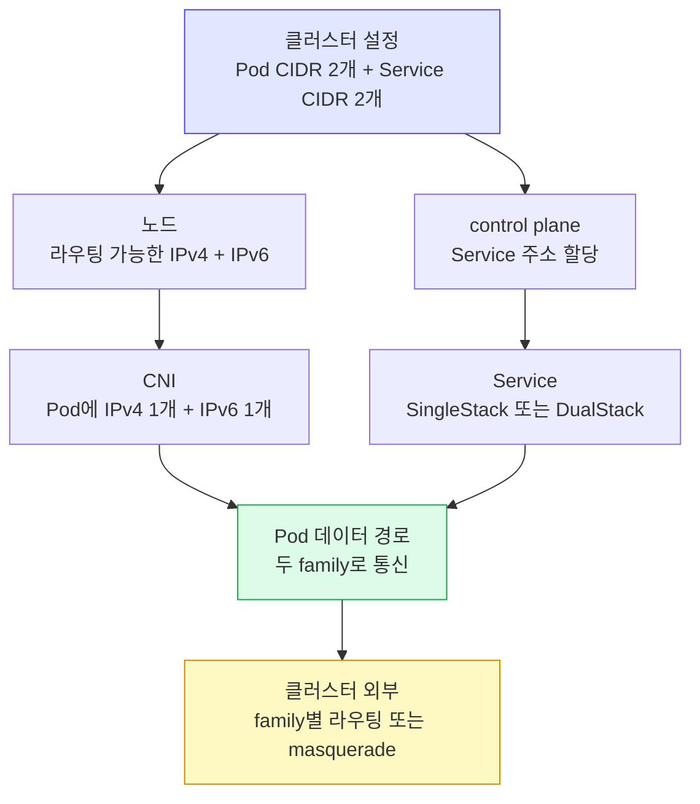

# IPv4와 IPv6 이중 스택
---
> 이중 스택은 Pod와 Service에 IPv4와 IPv6 주소 체계를 함께 제공하고, Service 정책으로 단일·이중 주소 할당을 선택하게 합니다.


## 학습 목표

> 클러스터 CIDR 설정과 Service 주소 정책을 분리해 이중 스택의 결과를 예측하는 것이 목표입니다.

이 문서를 읽고 나면 다음 작업을 수행할 수 있습니다:

1. 이중 스택 클러스터가 Pod, Service, 외부 egress에 제공하는 기능과 전제 조건을 설명할 수 있습니다.
2. `ipFamilyPolicy`, `ipFamilies`, `clusterIPs`, `clusterIP`의 관계를 이용해 Service 주소 할당 결과를 예측할 수 있습니다.
3. 기존 Service 전환, headless Service, LoadBalancer, Windows 제약을 고려해 도입 가능성을 판단할 수 있습니다.


## 1. 이중 스택의 의미와 지원 범위

> 하나의 클러스터에서 IPv4와 IPv6를 동시에 활성화해 각 Pod와 Service가 두 주소 체계를 사용할 수 있게 합니다.

IPv4/IPv6 이중 스택은 Kubernetes v1.23부터 stable이며 v1.21부터 기본 활성화되어 있습니다. 이 기능은 한 Pod에 IPv4 주소 하나와 IPv6 주소 하나를 할당하고, Service가 IPv4·IPv6 또는 둘 다를 사용하게 하며, Pod가 두 인터페이스 계열을 통해 클러스터 밖으로 나가게 합니다.

이중 스택은 IPv4를 IPv6로 자동 번역하는 기능이 아닙니다. 두 주소 체계가 각각 라우팅 가능한 데이터 경로를 갖고 애플리케이션과 인프라가 그 주소 체계를 지원해야 합니다. 한쪽 경로가 없으면 주소만 두 개 있어도 해당 family의 연결은 성공하지 않습니다.

> 이 개념은 한국어와 영어 안내 창구를 동시에 운영하는 것과 비슷합니다. 두 종류의 방문자를 받을 수 있다는 점까지 유효하지만, 한 요청을 자동 번역하거나 두 경로의 장애를 대신 복구하지는 않습니다.


## 2. 전제 조건과 구성 요소 설정

> control plane 플래그만이 아니라 노드 라우팅과 CNI까지 두 주소 체계를 지원해야 합니다.

공식 문서의 최소 조건은 Kubernetes 1.20 이상, 라우팅 가능한 IPv4·IPv6 인터페이스를 제공하는 인프라, 이중 스택을 지원하는 네트워크 플러그인입니다. 실제 운영에서는 노드, cloud provider, CNI, kube-proxy 또는 대체 dataplane, LoadBalancer가 모두 두 family를 처리하는지 확인해야 합니다.

핵심 구성은 다음과 같습니다:

- kube-apiserver의 `--service-cluster-ip-range`에 IPv4 CIDR과 IPv6 CIDR을 순서대로 지정합니다.
- kube-controller-manager의 `--cluster-cidr`와 `--service-cluster-ip-range`에 두 CIDR을 지정하고, 노드별 기본 마스크 `/24`(IPv4)와 `/64`(IPv6)를 필요에 맞게 조정합니다.
- kube-proxy의 `--cluster-cidr`에 두 Pod CIDR을 지정해 로컬·외부 트래픽 판단을 맞춥니다.
- bare metal 노드는 kubelet `--node-ip=<IPv4>,<IPv6>`를 지정하며, cloud provider가 선택한 주소를 덮어쓸 때도 이 옵션을 사용합니다.

첫 번째 Service CIDR의 주소 family는 Service 기본값과 기존 `clusterIP` 호환 필드의 기준이 됩니다. 따라서 CIDR 순서는 단순 표기가 아니라 클러스터의 기본 primary family를 결정하는 설계 선택입니다.



도식에서 control plane은 주소를 할당하지만 실제 패킷 전달은 노드와 CNI가 담당합니다. 이 경계를 구분해야 Service 오브젝트에는 주소가 있는데 연결되지 않는 장애를 진단할 수 있습니다.


## 3. Service의 주소 family 정책

> `ipFamilyPolicy`는 주소 개수를, `ipFamilies`는 사용할 family와 primary 순서를 결정합니다.

Service의 기본 주소 family는 kube-apiserver에 설정한 첫 번째 Service CIDR의 family입니다. `.spec.ipFamilyPolicy`는 세 값을 가집니다:

- `SingleStack`은 첫 번째 Service CIDR에서 ClusterIP 하나를 할당합니다.
- `PreferDualStack`은 가능하면 두 주소를 할당하고, 클러스터가 지원하지 않으면 단일 스택으로 낮춥니다.
- `RequireDualStack`은 두 주소를 요구하며, 클러스터가 지원하지 않으면 Service 생성에 실패합니다.

`.spec.ipFamilies`를 생략하면 클러스터 기본 순서를 따릅니다. `IPv4`, `IPv6`, `IPv4,IPv6`, `IPv6,IPv4`를 지정할 수 있고 첫 요소가 primary family입니다. 기존 Service의 primary family는 바꿀 수 없지만 secondary family는 추가하거나 제거할 수 있습니다.

`.spec.clusterIPs`가 실제 할당 주소 목록의 주 필드입니다. 호환성을 위한 단수 `.spec.clusterIP`는 `clusterIPs` 첫 요소로 계산되며, 그 family는 `ipFamilies` 첫 요소와 같습니다. 이중 스택이라고 해서 애플리케이션이 두 주소를 모두 사용한다는 보장은 없으므로 DNS 응답과 클라이언트의 address selection도 확인해야 합니다.

```yaml
apiVersion: v1
kind: Service
metadata:
  name: api
spec:
  selector:
    app: api
  ipFamilyPolicy: PreferDualStack
  ipFamilies:
    - IPv6
    - IPv4
  ports:
    - port: 80
      targetPort: 8080
```

이 Service는 이중 스택 클러스터에서 IPv6와 IPv4 주소를 그 순서로 받으며 `clusterIP`에는 IPv6 주소가 기록됩니다. 공식 문서는 이 명시적 dual-family 조합을 이중 스택 클러스터의 시나리오로만 설명하므로, 단일 스택 클러스터에서의 fallback 결과를 이 예시로 단정하지 않습니다. 이식성이 필요하면 대상 클러스터에서 API 검증 결과를 확인해야 합니다.


## 4. 새 Service 생성 시나리오

> 정책을 생략할 때와 dual-stack을 선호하거나 강제할 때의 실패 방식이 다릅니다.

새 Service에서 `ipFamilyPolicy`를 생략하면 일반적으로 `SingleStack`이 설정되고 첫 번째 Service CIDR에서 주소 하나를 받습니다. headless가 아닌 selector 없는 Service와 selector가 있는 headless Service도 이 기본 동작을 따릅니다. selector가 없는 headless Service는 예외이며, 정책을 생략하면 `RequireDualStack`이 기본입니다.

`PreferDualStack`은 이중 스택 클러스터에서 두 주소를 받고 단일 스택에서는 하나만 받습니다. `RequireDualStack`은 이중 스택 클러스터에서는 같은 결과지만 단일 스택에서 생성 실패한다는 차이가 있습니다. 가용 환경이 혼재하면 선호 정책이 이식성에 유리하고, 두 family가 기능 요구라면 강제 정책으로 잘못된 배포를 조기에 막습니다.

`ipFamilies: [IPv6, IPv4]`와 dual-stack 정책을 함께 지정하면 클러스터 기본이 IPv4-first여도 Service의 primary를 IPv6로 선택할 수 있습니다. 다만 생성 뒤 primary family는 바꿀 수 없으므로 이름과 주소 안정성이 중요한 Service는 생성 전에 순서를 결정해야 합니다.


## 5. 기존 Service와 전환 규칙

> 클러스터에 이중 스택을 활성화해도 기존 Service는 자동으로 주소가 두 개가 되지 않습니다.

기존 IPv4 또는 IPv6 Service는 이중 스택 활성화 뒤 `ipFamilyPolicy: SingleStack`으로 유지됩니다. control plane은 기존 주소 family를 `ipFamilies`에 기록하고 기존 ClusterIP를 `clusterIPs`에 보존합니다. 이는 업그레이드가 기존 클라이언트의 주소 가정을 갑자기 깨뜨리지 않게 합니다.

기존 headless Service에 selector가 있으면 `clusterIP: None`, `clusterIPs: [None]`을 유지합니다. `ipFamilyPolicy`는 `SingleStack`이고 `ipFamilies`는 첫 번째 Service CIDR의 family로 채워집니다.

단일 스택 Service를 이중 스택으로 바꾸려면 정책을 `PreferDualStack` 또는 `RequireDualStack`으로 수정합니다. Kubernetes가 빠진 secondary family 주소를 추가합니다. 이중 스택을 `SingleStack`으로 되돌리면 `clusterIPs` 첫 주소만 유지하고 그 family를 `ipFamilies`와 `clusterIP`에 남깁니다.

primary family는 유지되므로 전환 전 `clusterIPs` 순서를 반드시 확인해야 합니다. secondary 제거 과정에서 기대한 주소가 아니라 첫 주소가 남는 상황을 예방하기 위해서입니다.


## 6. Headless와 LoadBalancer 예외

> Service 유형에 따라 dual-stack 기본값과 외부 인프라 요구가 달라집니다.

selector가 없는 headless Service는 `ipFamilyPolicy`를 명시하지 않으면 `RequireDualStack`이 기본입니다. Kubernetes가 endpoint를 자동 선택하지 않는 형태이므로 주소 family를 명확히 관리해야 하며, 단일 스택 호환이 필요하면 정책을 명시적으로 지정합니다.

dual-stack LoadBalancer Service는 `type: LoadBalancer`와 `PreferDualStack` 또는 `RequireDualStack`을 함께 설정합니다. Kubernetes Service가 두 ClusterIP를 받아도 cloud provider가 IPv4·IPv6 LoadBalancer를 모두 지원하지 않으면 외부 주소는 기대대로 제공되지 않습니다. Service API와 외부 로드 밸런서의 지원 범위를 별도로 검증해야 합니다.


## 7. 클러스터 밖 egress

> 비공개 IPv6 주소는 이중 스택 할당만으로 인터넷에서 라우팅되지 않습니다.

Pod가 외부 인터넷에 도달하려면 각 family에 유효한 라우팅 경로가 필요합니다. 비공개로만 라우팅되는 IPv6 주소를 사용하는 경우 공개 IPv6로의 transparent proxy나 IP masquerading 같은 메커니즘이 필요합니다. `ip-masq-agent`는 이중 스택 클러스터의 masquerading을 지원하지만 CNI의 IPv6 지원도 전제입니다.

IPv4 egress가 성공한다고 IPv6 egress도 성공한다고 판단해서는 안 됩니다. family별 default route, 방화벽, NAT 또는 masquerade, DNS AAAA 응답을 나눠 확인해야 합니다.


## 8. Windows 지원 범위

> Windows는 IPv6-only 단일 스택을 지원하지 않으며 이중 스택 네트워크 모드에도 제약이 있습니다.

Windows 노드는 단일 스택 IPv6-only 네트워킹을 지원하지 않습니다. Pod와 노드의 IPv4/IPv6 이중 스택은 단일 family Service와 함께 지원되며 `l2bridge` 네트워크를 사용할 수 있습니다. Windows의 overlay(VXLAN) 네트워크는 이중 스택을 지원하지 않습니다.

Linux와 Windows가 섞인 클러스터에서는 control plane의 기능 상태만 보고 결정하면 안 됩니다. Windows CNI 모드, workload의 Service family 요구, cloud provider의 LoadBalancer 지원을 함께 확인해야 합니다.


## 9. 개념 실습과 검증 순서

> 실제 이중 스택 클러스터가 없으면 출력을 꾸미지 않고 매니페스트 결과를 예측한 뒤 지원 환경에서 확인합니다.

현재 문서는 dual-stack control plane과 CNI가 준비된 환경을 전제하지 않으므로 실행 결과를 제시하지 않습니다. 검증 환경에서는 `kubectl get nodes -o wide`로 노드 주소, `kubectl get pod -o wide`로 Pod 주소, `kubectl get service -o yaml`로 `ipFamilyPolicy`, `ipFamilies`, `clusterIPs`를 확인합니다.

Service를 만들기 전에는 클러스터 primary family, 원하는 fallback 여부, 필요한 primary family를 적고 결과를 예측합니다. 생성 뒤 두 family의 ClusterIP와 실제 endpoint에 각각 연결하고, 외부 egress와 LoadBalancer도 IPv4·IPv6를 따로 시험해야 합니다.


## 관련 문서

> 이중 스택의 기반 경로, Service 주소 필드와 별도 점검 문제를 연결합니다.

- [네트워킹](04-01.%EB%84%A4%ED%8A%B8%EC%9B%8C%ED%82%B9.md) — Kubernetes 네트워크 모델의 전체 지도
- [Pod 네트워크와 Linux 기반](04-02.Pod%20%EB%84%A4%ED%8A%B8%EC%9B%8C%ED%81%AC%EC%99%80%20Linux%20%EA%B8%B0%EB%B0%98.md) — family별 Pod 데이터 경로와 CNI 역할
- [Service와 EndpointSlice](04-04.Service%EC%99%80%20EndpointSlice.md) — `clusterIP`, endpoint, kube-proxy의 기반 개념
- [IPv4와 IPv6 이중 스택 점검](04-08.IPv4%EC%99%80%20IPv6%20%EC%9D%B4%EC%A4%91%20%EC%8A%A4%ED%83%9D%20%EC%A0%90%EA%B2%80.md) — Service 정책과 전환 규칙을 확인하는 면접 질문
