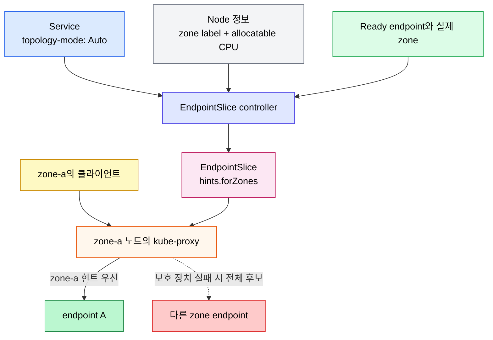

# 토폴로지 인지 라우팅
---
> 토폴로지 인지 라우팅(Topology Aware Routing)은 Service 트래픽이 시작된 zone과 가까운 endpoint를 우선 사용하도록 EndpointSlice 힌트를 제공하는 Kubernetes v1.23 베타 기능입니다.


## 학습 목표

> 같은 zone 우선 라우팅의 이점뿐 아니라 Auto 휴리스틱이 포기하는 조건까지 설명하는 것이 목표입니다.

이 장에서 확인할 목표는 다음과 같습니다:

1. EndpointSlice controller와 kube-proxy가 힌트를 생산하고 소비하는 흐름을 설명할 수 있습니다.
2. `service.kubernetes.io/topology-mode: Auto`가 endpoint를 zone에 배분하는 기준을 이해할 수 있습니다.
3. 보호 장치가 동작하면 왜 클러스터 전체 라우팅으로 되돌아가는지 설명할 수 있습니다.
4. 트래픽 편중, autoscaling, `internalTrafficPolicy: Local`과의 충돌을 판단할 수 있습니다.


## 1. 왜 필요한가

> 멀티 zone 클러스터에서 무조건 모든 endpoint를 후보로 삼으면 불필요한 zone 간 지연과 전송 비용이 생길 수 있습니다.

Service는 기본적으로 클러스터 전체의 Ready endpoint를 대상으로 트래픽을 전달합니다. 클라이언트와 endpoint가 다른 zone에 있으면 패킷이 zone 경계를 넘으며, 이 경로는 같은 zone 경로보다 지연이 길거나 과금 대상이 될 수 있습니다.

토폴로지 인지 라우팅은 Service의 endpoint를 물리적으로 이동하지 않습니다. EndpointSlice에 `hints.forZones`를 기록하고 kube-proxy 같은 dataplane 소비자가 현재 노드의 zone에 배정된 endpoint를 우선 후보로 좁힙니다. 따라서 이 기능은 스케줄링이 아니라 Service 라우팅 최적화입니다.

Kubernetes 1.27 이전에는 이 기능을 **Topology Aware Hints**라고 불렀고 `service.kubernetes.io/topology-aware-hints` 어노테이션으로 제어했습니다. 현재 공식 인터페이스는 `service.kubernetes.io/topology-mode: Auto`입니다.


## 2. 동작 구조

> 컨트롤 플레인은 endpoint별 zone 힌트를 계산하고, 각 노드의 kube-proxy는 자신의 zone에 맞는 힌트를 필터로 사용합니다.

다음 흐름은 힌트 생성과 실제 요청 전달을 분리해서 보여 줍니다:



### 2.1 EndpointSlice controller

`Auto` 휴리스틱은 각 zone의 노드가 보고한 **할당 가능 CPU(allocatable CPU)** 비율에 맞춰 endpoint 수를 배정합니다. zone-a의 할당 가능 CPU가 2이고 zone-b가 1이면, controller는 대략 2:1 비율로 endpoint를 각 zone의 트래픽에 배정하려고 합니다.

여기서 endpoint가 실제로 실행되는 zone과 `hints.forZones`의 zone은 같은 개념이 아닙니다. controller는 균형을 맞추기 위해 다른 zone의 endpoint를 특정 zone의 후보로 배정할 수 있습니다. 힌트는 endpoint의 위치가 아니라 “어느 zone에서 이 endpoint를 사용하라”는 라우팅 권고입니다.

힌트가 채워진 EndpointSlice의 핵심 부분은 다음과 같습니다:

```yaml
apiVersion: discovery.k8s.io/v1
kind: EndpointSlice
metadata:
  name: example-hints
  labels:
    kubernetes.io/service-name: example-svc
addressType: IPv4
ports:
  - name: http
    protocol: TCP
    port: 80
endpoints:
  - addresses: ["10.1.2.3"]
    conditions:
      ready: true
    zone: zone-a
    hints:
      forZones:
        - name: zone-a
```

### 2.2 kube-proxy

kube-proxy는 EndpointSlice controller가 기록한 힌트로 endpoint를 필터링합니다. 정상 조건에서는 같은 zone을 대상으로 하는 힌트가 붙은 endpoint로 연결하므로 zone 간 트래픽을 줄일 수 있습니다.

힌트는 강제적인 단일 zone 고정 규칙이 아닙니다. 일부 endpoint가 균형을 위해 다른 zone에 배정될 수 있고, 안전 조건이 충족되지 않으면 kube-proxy는 힌트를 무시하고 모든 zone의 endpoint를 사용합니다. 가용성을 해칠 정도로 후보를 좁히지 않는 것이 우선입니다.


## 3. 활성화와 적합 조건

> Service 어노테이션 하나로 요청할 수 있지만 endpoint 수와 트래픽 분포가 적절해야 실제 힌트가 생성됩니다.

Service에 다음 어노테이션을 설정합니다:

```yaml
apiVersion: v1
kind: Service
metadata:
  name: checkout
  annotations:
    service.kubernetes.io/topology-mode: Auto
spec:
  selector:
    app: checkout
  ports:
    - port: 80
      targetPort: 8080
```

공식 문서는 zone마다 endpoint가 3개 이상일 때 가장 잘 동작한다고 안내합니다. zone이 3개라면 전체 endpoint가 9개 이상이어야 하며, 이보다 적으면 controller가 균형 배분에 실패해 기본 클러스터 전체 라우팅으로 돌아갈 확률이 약 50%에 이릅니다.

유입 트래픽도 각 zone의 용량과 대략 비례해야 합니다. 한 zone에서 대부분의 요청이 시작되면 그 zone에 배정된 일부 endpoint만 과부하되고, 다른 zone의 여유 endpoint는 사용되지 않을 수 있습니다. 이 기능은 실시간 트래픽이나 endpoint 부하를 관찰해 재분배하는 로드 밸런서가 아닙니다.


## 4. 보호 장치와 fallback

> 힌트의 완전성과 균형을 보장하지 못하면 controller 또는 kube-proxy가 전체 endpoint 사용으로 되돌아갑니다.

보호 장치는 잘못된 부분 필터링으로 Service가 끊기는 것을 막습니다:

1. endpoint 수가 zone 수보다 적으면 controller는 모든 zone을 대표할 수 없으므로 힌트를 만들지 않습니다.
2. 각 zone의 예상 과부하를 허용 범위 아래로 맞출 수 없으면 controller는 불균형한 힌트를 만들지 않습니다.
3. 노드 하나라도 `topology.kubernetes.io/zone` 또는 allocatable CPU 정보가 없으면 컨트롤 플레인은 힌트를 설정하지 않습니다.
4. endpoint 하나라도 zone 힌트가 없으면 kube-proxy는 전환 중 상태로 보고 해당 Service의 모든 endpoint를 사용합니다.
5. 현재 노드의 zone을 대상으로 하는 힌트가 하나도 없으면 kube-proxy는 새 zone 추가 같은 상황으로 보고 모든 zone을 사용합니다.

예상 과부하는 실제 CPU 사용률이나 요청률을 측정한 값이 아닙니다. node capacity와 endpoint 개수로 계산한 배분 모델이므로, 보호 장치를 통과해도 특정 endpoint가 실제로 과부하될 수 있습니다.


## 5. 제약과 운영 판단

> zone 우선 최적화가 워크로드 배치와 트래픽 특성을 반영하지 못하는 경우에는 기본 라우팅이 더 안전합니다.

`internalTrafficPolicy: Local`인 Service에는 토폴로지 힌트를 사용하지 않습니다. Local 정책은 같은 **노드**의 endpoint만 선택하고, 토폴로지 인지 라우팅은 같은 **zone**을 우선하므로 같은 Service에 함께 적용할 수 없습니다. 서로 다른 Service에는 각각 사용할 수 있습니다.

기본 휴리스틱이 고려하지 않는 요소는 다음과 같습니다:

- Ready가 아닌 노드는 zone 비율 계산에서 제외하므로 대규모 노드 장애 중 배분이 예상과 달라질 수 있습니다.
- `node-role.kubernetes.io/control-plane` 또는 `node-role.kubernetes.io/master` 라벨 노드는 계산에서 제외하므로 그 노드에 실제 워크로드가 있어도 용량으로 반영되지 않습니다.
- Pod의 toleration과 실제 스케줄 가능 노드 부분집합을 고려하지 않으므로 특정 노드에만 배치되는 Service의 용량을 잘못 추정할 수 있습니다.
- 한 zone에 트래픽이 집중되면 HPA가 전체 평균에서 신호를 놓치거나 새 Pod가 다른 zone에 배치되어 증설 효과가 없을 수 있습니다.

운영에서는 Service별 요청 발생 zone, endpoint 수, zone별 부하를 먼저 확인해야 합니다. 비용을 줄이기 위해 켰지만 트래픽이 한 zone에 편중된다면 latency와 오류율이 오히려 증가할 수 있습니다.

Kubernetes 1.27에는 내장 Auto 휴리스틱이 맞지 않는 환경을 위한 사용자 정의 휴리스틱의 초기 기반이 포함되었습니다. 공식 문서는 이를 제한적인 구현으로 설명하므로, 일반 Service 설정만으로 임의 알고리즘을 선언할 수 있다고 해석하면 안 됩니다.

Service의 `.spec.trafficDistribution`도 endpoint 선택 선호도를 표현하는 밀접한 관련 인터페이스입니다. 공식 문서는 이 필드가 Kubernetes 안에서 더 유연한 트래픽 라우팅 선택지를 제공한다고 안내합니다. 토폴로지 인지 라우팅의 `service.kubernetes.io/topology-mode` 어노테이션과 같은 설정으로 보지 말고, 클러스터 버전이 지원하는 `trafficDistribution` 값과 의미를 Service 공식 문서에서 별도로 확인해야 합니다.


## 6. 점검 방법

> Service 어노테이션만 보지 말고 EndpointSlice 힌트와 노드 topology 정보를 함께 확인해야 합니다.

재현 가능한 클러스터에서는 다음 조회로 설정과 결과를 분리해 확인합니다:

```bash
kubectl get service checkout -o yaml
kubectl get endpointslice -l kubernetes.io/service-name=checkout -o yaml
kubectl get nodes -L topology.kubernetes.io/zone
kubectl get nodes -o custom-columns='NAME:.metadata.name,CPU:.status.allocatable.cpu,ZONE:.metadata.labels.topology\.kubernetes\.io/zone'
```

이 문서에서는 특정 멀티 zone 클러스터를 실행하지 않았으므로 출력은 제시하지 않습니다. 어노테이션이 있어도 `hints.forZones`가 없다면 endpoint 수, zone 라벨, allocatable CPU, Ready 노드, 제약 조건을 차례로 확인해야 합니다.


## 참고 자료

> 기능 상태와 세부 휴리스틱은 작성 시점의 Kubernetes v1.36 영문 공식 문서를 기준으로 했습니다.

- [Topology Aware Routing](https://kubernetes.io/docs/concepts/services-networking/topology-aware-routing/) - 조회일: 2026-07-12
- [Service의 trafficDistribution](https://kubernetes.io/docs/concepts/services-networking/service/#traffic-distribution) - 조회일: 2026-07-12


## 관련 문서

> Service와 EndpointSlice를 먼저 이해하고 면접 점검 문서로 fallback 조건을 복습할 수 있습니다.

- [Service와 EndpointSlice](04-04.Service%EC%99%80%20EndpointSlice.md)
- [토폴로지 인지 라우팅 점검](04-09.%ED%86%A0%ED%8F%B4%EB%A1%9C%EC%A7%80%20%EC%9D%B8%EC%A7%80%20%EB%9D%BC%EC%9A%B0%ED%8C%85%20%EC%A0%90%EA%B2%80.md)
- [Windows 네트워킹](04-10.Windows%20%EB%84%A4%ED%8A%B8%EC%9B%8C%ED%82%B9.md)
