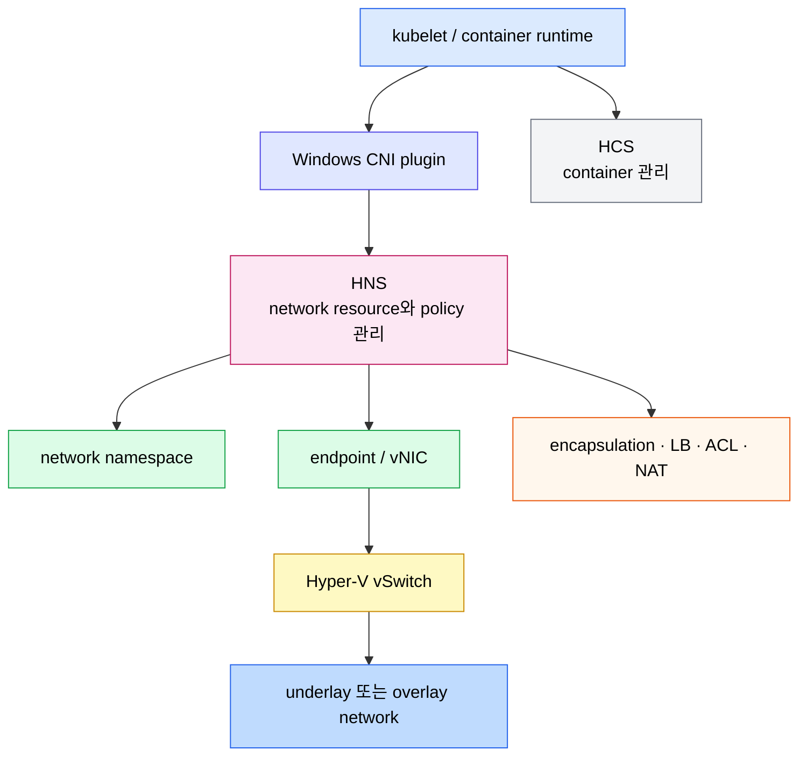
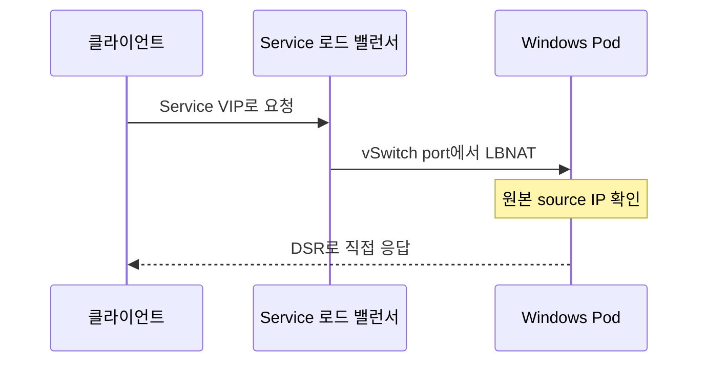

# Windows 네트워킹
---
> Kubernetes는 Linux와 Windows 노드를 한 클러스터에 둘 수 있지만, Windows Pod 네트워크는 HNS, HCS, vSwitch와 Windows용 CNI를 중심으로 구성됩니다.

## 학습 목표

> Linux 네트워킹 지식을 그대로 대입하지 않고 Windows 데이터플레인의 구성 요소와 제약을 구분합니다.

이 장에서 확인할 목표는 다음과 같습니다:

1. HNS, HCS, vNIC, vSwitch, CNI의 책임을 설명할 수 있습니다.
2. L2bridge, L2tunnel, Overlay, Transparent, NAT 모드의 패킷 처리를 비교할 수 있습니다.
3. Windows에서 지원하는 IPAM, 통신 흐름, Service 기능을 파악할 수 있습니다.
4. DSR이 source IP 보존과 반환 경로를 어떻게 바꾸는지 설명할 수 있습니다.
5. Windows 네트워킹 제한을 반영해 장애 진단 방법을 선택할 수 있습니다.

## 1. Windows 컨테이너 네트워크 구조

> Windows 컨테이너는 vNIC를 Hyper-V vSwitch에 연결하며 HCS와 HNS가 컨테이너와 네트워크 자원을 나누어 관리합니다.

Windows 컨테이너는 네트워킹 관점에서 가상 머신과 비슷합니다. 컨테이너마다 가상 네트워크 어댑터(vNIC)가 있고 이 어댑터가 Hyper-V 가상 스위치(vSwitch)에 연결됩니다. Kubernetes는 CNI 플러그인을 통해 이 구성을 요청합니다.

**Host Compute Service(HCS)**는 컨테이너 생명주기를 관리합니다. **Host Networking Service(HNS)**는 가상 네트워크와 vSwitch, endpoint와 vNIC, namespace, 캡슐화·부하 분산·ACL·NAT 정책을 관리합니다.

Linux는 DNS와 route 같은 설정을 `/etc` 아래 파일로 표현하는 경우가 많지만 Windows는 많은 구성을 Registry에 저장합니다. 컨테이너 Registry는 호스트와 분리되므로 호스트의 `/etc/resolv.conf` 같은 파일을 매핑하는 Linux 방식은 같은 효과를 내지 않습니다. Windows CNI는 컨테이너 문맥에서 Windows API와 HNS를 호출해 네트워크 정보를 구성해야 합니다.

## 2. 네트워크 모드

> Windows가 제공하는 다섯 모드는 underlay 연결, 주소 변환, 캡슐화 방식이 서로 다릅니다.

Linux와 Windows worker를 섞은 클러스터에서는 양쪽 OS를 모두 지원하는 네트워크 솔루션을 선택해야 합니다. “Windows에서 지원하는 모드”와 “현재 CNI가 혼합 클러스터에서 구현하는 모드”를 별도로 확인해야 합니다.

| 모드 | 연결과 패킷 변환 | 대표 플러그인 | 운영 특성 |
|------|------------------|---------------|-----------|
| L2bridge | 외부 vSwitch와 underlay에 연결하며 MAC을 host MAC으로 바꾸고 HNS OutboundNAT 정책에 따라 IP도 바꿀 수 있습니다. | win-bridge, Azure CNI, Flannel host-gateway | 성능이 좋지만 노드 간 연결을 위한 사용자 정의 경로가 필요합니다. |
| L2tunnel | L2bridge의 Azure 전용 형태로 패킷을 가상화 host에 보내 SDN 정책을 적용합니다. | Azure CNI | Azure vNET, Azure 서비스, NSG와 통합합니다. |
| Overlay | 네트워크별 subnet과 VNID를 두고 VXLAN 외부 헤더로 캡슐화합니다. | win-overlay, Flannel VXLAN | underlay와 격리하고 IP를 재사용할 수 있으며 Windows Server 2019에서는 KB4489899가 필요합니다. |
| Transparent | 외부 vSwitch에 붙고 원격 Pod 통신은 GENEVE 또는 STT 터널을 사용합니다. | ovn-kubernetes | 분산 ACL, IPAM, kube-proxy 없는 부하 분산, 별도 north-south NAT가 가능합니다. |
| NAT | 내부 vSwitch와 WinNAT를 사용하며 MAC과 IP를 host 값으로 변환합니다. | nat | 완전성을 위해 문서에 나오지만 Kubernetes에서는 사용하지 않습니다. |

Flannel은 Windows에서 VXLAN backend가 win-overlay에, host-gateway backend가 win-bridge에 위임합니다. Flanneld가 노드 subnet lease와 HNS 네트워크 생성을 돕고, CNI 플러그인은 `cni.conf`와 Flanneld가 만든 `subnet.env`를 합쳐 reference plugin과 IPAM에 전달합니다. 공식 문서는 VXLAN을 베타, host-gateway를 안정 지원으로 설명합니다.

## 3. 지원 통신과 IPAM

> TCP와 UDP의 주요 Pod·Service 흐름은 지원되지만 DNS 이름과 프로토콜별 제약을 함께 봐야 합니다.

Node, Pod, Service 사이에서 지원하는 TCP/UDP 흐름은 다음과 같습니다:

- Pod에서 Pod IP 또는 이름으로 통신합니다.
- Pod에서 Service ClusterIP, 점이 없는 PQDN, FQDN으로 통신합니다.
- Pod에서 외부 IP 또는 DNS 이름으로 통신합니다.
- Node에서 Pod로, Pod에서 Node로 통신합니다.

공식 문서의 `PQDN` 표기는 점이 없는 부분 한정 이름을 가리킵니다. 실제 이름 해석은 클러스터 DNS 설정과 Windows resolver 동작을 함께 확인해야 하며, TCP/UDP 지원 목록을 ICMP까지 지원된다는 뜻으로 확대하면 안 됩니다.

Windows에서 공식 페이지가 열거하는 IP 주소 관리(IPAM) 선택지는 `host-local`, Azure CNI 전용 `azure-vnet-ipam`, IPAM을 지정하지 않았을 때 fallback인 Windows Server IPAM입니다. CNI와 IPAM 조합은 사용하려는 네트워크 모드 및 클라우드 환경과 호환되어야 합니다.

## 4. DSR과 Service 부하 분산

> Direct Server Return은 응답이 로드 밸런서를 다시 통과하지 않게 해 지연과 부하를 줄이고 source IP 보존을 가능하게 합니다.

Windows의 **Direct Server Return(DSR)**에서는 IP fixup과 LBNAT가 컨테이너 vSwitch port에서 직접 일어납니다. Service 트래픽은 원래 Pod IP를 source IP로 유지해 도착하고, backend 응답은 로드 밸런서를 우회해 클라이언트로 직접 돌아갑니다.

`WinDSR` 기능은 Kubernetes v1.34에서 stable이 되었고 기본으로 활성화됩니다. 이 기능 상태는 Kubernetes가 DSR 경로를 안정 기능으로 제공한다는 뜻이지만, Windows node의 kube-proxy가 실제로 DSR 모드로 Service를 처리하도록 구성됐다는 뜻과는 구분해야 합니다. 공식 Windows Service 설정에 따라 kube-proxy의 `--enable-dsr=true` 구성과 지원 Windows OS build를 함께 확인합니다.

Windows 노드를 포함한 클러스터에서는 `NodePort`, `ClusterIP`, `LoadBalancer`, `ExternalName` Service를 사용할 수 있습니다. 기능별 최소 Windows OS와 활성화 조건은 다음과 같습니다.

| 기능 | 최소 Windows OS | 설정 | 효과와 제약 |
|------|-----------------|------|-------------|
| Session affinity | Windows Server 2022 | `spec.sessionAffinity: ClientIP` | 같은 클라이언트를 같은 Pod로 전달합니다. |
| DSR | Windows Server 2019 | kube-proxy `--enable-dsr=true` | 반환 경로가 로드 밸런서를 우회합니다. |
| Preserve-Destination | Windows Server version 1903 | Service 어노테이션 `preserve-destination: "true"`와 DSR | DNAT를 건너뛰어 Service VIP를 보존하고 node 간 forwarding을 끕니다. |
| IPv4/IPv6 dual-stack | Windows Server 2019 | dual-stack 클러스터 구성 | IPv4끼리, IPv6끼리 병렬 통신합니다. |
| Client IP preservation | Windows Server 2019 | `externalTrafficPolicy: Local`과 DSR | ingress source IP를 보존하고 node 간 forwarding을 끕니다. |

`externalTrafficPolicy: Local`은 원본 client IP를 보존하는 대신 node 간 forwarding을 사용하지 않습니다. 따라서 요청을 받은 node에 local endpoint가 없을 때의 동작을 확인해야 합니다. Windows Pod가 외부 트래픽을 받는 node에 배치되는지도 함께 검증합니다.

## 5. 제한 사항

> Linux에서 자연스럽게 쓰던 기능이나 진단 방법이 Windows에서는 지원되지 않거나 조건부로 동작합니다.

Windows node에서 지원하지 않는 네트워킹 기능은 다음과 같습니다:

- host networking mode를 지원하지 않습니다.
- 노드 자신에서 local NodePort로 접근할 수 없지만 다른 노드나 외부 클라이언트에서는 접근할 수 있습니다.
- Service 하나의 backend Pod 또는 고유 목적지 주소는 64개를 초과할 수 없습니다.
- overlay network에 연결된 Windows Pod끼리 IPv6로 통신할 수 없습니다.
- DSR을 사용하지 않는 모드에서 Local Traffic Policy를 지원하지 않습니다.

Windows node agent를 배치할 때는 Linux용 DaemonSet의 `hostNetwork` 전제를 그대로 옮기면 안 됩니다. 호스트 자원에 접근해야 한다면 Windows HostProcess 컨테이너나 CNI 공급자가 지원하는 node agent 배치 방식을 별도로 검토합니다.

win-overlay, win-bridge, Azure CNI를 통한 외부 ICMP 통신도 중요한 함정입니다. Windows VFP 데이터플레인은 ICMP packet transposition을 지원하지 않아 같은 네트워크의 Pod 간 `ping`은 동작할 수 있지만 외부 인터넷처럼 원격 네트워크를 거치는 `ping` 응답은 source로 돌아오지 못합니다. TCP/UDP는 동작하므로 외부 연결 진단에는 `ping` 대신 실제 포트에 대한 `curl` 같은 도구를 사용합니다.

추가 구현 제약은 다음과 같습니다:

- win-bridge와 win-overlay reference plugin은 `CHECK` 구현이 없어 CNI spec v0.4.0을 구현하지 않습니다.
- Windows의 Flannel VXLAN은 Flannel v0.12.0 이상에서도 Node에서 접근 가능한 Pod가 local Pod로 제한됩니다.
- Windows의 Flannel VXLAN은 VNI 4096과 UDP port 4789만 사용합니다.

## 6. 운영 점검

> OS와 CNI 조합, HNS network, Service 정책, 실제 TCP/UDP 경로를 순서대로 확인합니다.

Windows 환경에서 확인할 대상은 Node OS build와 Kubernetes 버전, CNI backend, HNS network와 endpoint, kube-proxy DSR 설정입니다. Linux 노드에서 쓰던 iptables나 `/etc/resolv.conf` 검사만으로 Windows dataplane 상태를 판단하면 원인을 놓칩니다.

이 문서는 Windows Kubernetes 노드를 실행하지 않았으므로 PowerShell 및 HNS 명령의 출력을 제시하지 않습니다. 실제 환경에서는 사용하는 CNI 공급자의 공식 진단 절차로 HNS network와 endpoint를 조회하고, `kubectl get pods -o wide`, `kubectl get service`, `kubectl get endpointslice` 결과와 대조해야 합니다. 연결 시험은 같은 node, 다른 node, Service VIP, 외부 TCP/UDP를 나눠 수행합니다.

## 참고 자료

> 구성 요소, 네트워크 모드, 제약은 작성 시점의 Kubernetes v1.36 영문 공식 문서를 기준으로 했습니다.

- [Networking on Windows](https://kubernetes.io/docs/concepts/services-networking/windows-networking/) - 조회일: 2026-07-12

## 관련 문서

> Linux Pod 네트워크와 비교하고 Service 문서에서 공통 추상화를 보완합니다.

- [Pod 네트워크와 Linux 기반](04-02.Pod%20%EB%84%A4%ED%8A%B8%EC%9B%8C%ED%81%AC%EC%99%80%20Linux%20%EA%B8%B0%EB%B0%98.md)
- [Service와 EndpointSlice](04-04.Service%EC%99%80%20EndpointSlice.md)
