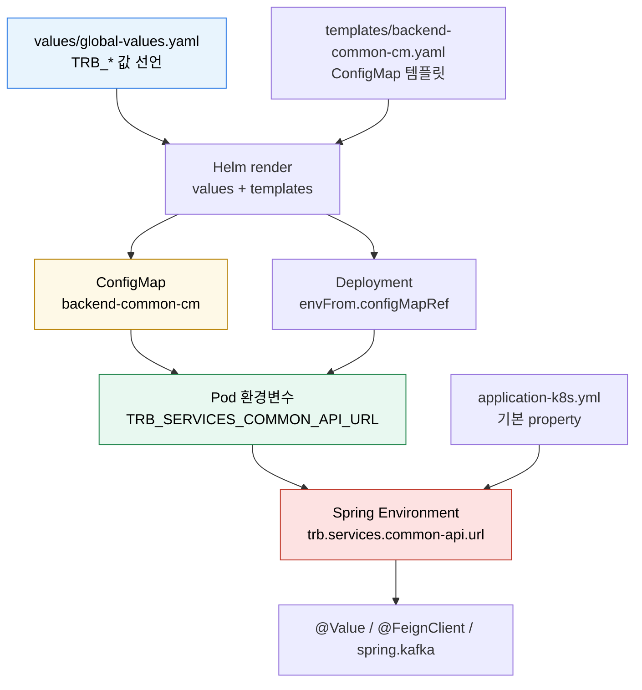

# K8s 환경변수와 Spring 설정 주입
---
> Kubernetes에서 Spring 설정이 바뀌는 과정은 파일을 직접 고치는 과정이 아니다. Helm이 ConfigMap과 Deployment를 렌더링하고, Pod가 환경변수를 받은 뒤, Spring Boot가 런타임 설정 우선순위로 YAML 값을 덮어쓰는 흐름이다.


## 학습 목표
> Helm values, ConfigMap, Pod 환경변수, Spring Boot 설정 해석을 한 흐름으로 연결한다.

이 장에서 확인할 목표는 다음과 같다:

1. Helm values가 Kubernetes ConfigMap으로 바뀌는 과정을 설명할 수 있다.
2. `envFrom.configMapRef`가 컨테이너 환경변수를 만드는 방식을 이해할 수 있다.
3. Spring Boot의 relaxed binding으로 환경변수가 YAML property에 매핑되는 원리를 설명할 수 있다.
4. ConfigMap 변경이 기존 Pod 환경변수에 즉시 반영되지 않는 이유를 설명할 수 있다.


## 1. 전체 흐름
> 값은 Git의 values 파일에서 시작하지만, Spring 애플리케이션이 읽는 것은 최종 Pod 환경변수다.

실무에서 자주 쓰는 구조는 다음과 같다. Git에는 Helm values 파일과 chart template이 있고, ArgoCD나 Helm이 이를 Kubernetes manifest로 렌더링한다. 렌더링 결과에는 ConfigMap과 Deployment가 포함된다.

Deployment는 ConfigMap을 `envFrom`으로 참조한다. Pod가 생성될 때 kubelet은 ConfigMap의 `data`를 컨테이너 환경변수로 넣고, Spring Boot는 프로세스 시작 시 그 환경변수를 읽어 `application-k8s.yml`의 property와 병합한다.



여기서 중요한 점은 `application-k8s.yml` 파일이 클러스터 안에서 수정되는 것이 아니라는 점이다. 파일은 컨테이너 이미지 안에 그대로 있고, 런타임 환경변수가 Spring 설정 우선순위에서 더 높은 값으로 병합된다.


## 2. Helm values는 ConfigMap 리소스가 된다
> values 파일은 입력값이고, 실제 클러스터에는 ConfigMap 리소스가 만들어진다.

예를 들어 values 파일에 다음처럼 공통 값을 둔다:

```yaml
global:
  configMap:
    enabled: true
    data:
      SPRING_PROFILES_ACTIVE: "k8s"
      TRB_SERVICES_COMMON_API_URL: "http://trb-app-common-api"
      TRB_QUEUE_BOOTSTRAP_SERVER: "redpanda:9092"
      TRB_QUEUE_SCHEMA_REGISTRY_URL: "http://schema-registry:8081"
```

Helm template은 이 값을 순회해서 ConfigMap `data`로 렌더링한다:

```yaml
apiVersion: v1
kind: ConfigMap
metadata:
  name: backend-common-cm
data:
  SPRING_PROFILES_ACTIVE: "k8s"
  TRB_SERVICES_COMMON_API_URL: "http://trb-app-common-api"
  TRB_QUEUE_BOOTSTRAP_SERVER: "redpanda:9092"
  TRB_QUEUE_SCHEMA_REGISTRY_URL: "http://schema-registry:8081"
```

이 단계에서 새 YAML 파일이 저장소에 생기는 것은 아니다. Helm이나 ArgoCD가 렌더링 결과를 만들고 Kubernetes API에 apply한다. 따라서 "values 파일이 덮어써진다"가 아니라 "클러스터의 ConfigMap 리소스가 원하는 상태로 갱신된다"고 이해해야 한다.


## 3. Deployment는 ConfigMap을 환경변수로 읽는다
> Pod는 ConfigMap을 직접 설정 파일로 해석하지 않고, Deployment 선언에 따라 환경변수나 볼륨으로 받는다.

환경변수로 주입하는 가장 단순한 방식은 `envFrom`이다:

```yaml
apiVersion: apps/v1
kind: Deployment
spec:
  template:
    spec:
      containers:
        - name: app
          image: example/app:1.0.0
          envFrom:
            - configMapRef:
                name: backend-common-cm
```

이렇게 하면 ConfigMap의 key가 그대로 컨테이너 환경변수 이름이 된다:

```bash
SPRING_PROFILES_ACTIVE=k8s
TRB_SERVICES_COMMON_API_URL=http://trb-app-common-api
TRB_QUEUE_BOOTSTRAP_SERVER=redpanda:9092
TRB_QUEUE_SCHEMA_REGISTRY_URL=http://schema-registry:8081
```

ConfigMap에 있는 값이 모두 애플리케이션 설정으로 자동 반영되는 것은 아니다. 컨테이너 프로세스가 그 환경변수를 읽어야 한다. Spring Boot 애플리케이션은 시작할 때 OS 환경변수를 property source로 등록하므로, 이 값들이 Spring 설정 후보가 된다.


## 4. Spring Boot는 환경변수를 property로 바꿔 읽는다
> Spring Boot는 환경변수 이름을 느슨한 규칙으로 property 이름에 매핑한다.

Spring Boot의 relaxed binding은 대문자와 언더스코어로 된 환경변수를 점과 하이픈이 있는 property 이름으로 해석할 수 있게 한다. 예를 들어 다음 환경변수는:

```bash
TRB_SERVICES_COMMON_API_URL=http://trb-app-common-api
```

Spring 안에서 다음 property로 사용할 수 있다:

```text
trb.services.common-api.url=http://trb-app-common-api
```

그래서 `application-k8s.yml`에 아래처럼 placeholder가 있어도:

```yaml
trb:
  services:
    common-api:
      url: ${TRB_SERVICES_COMMON_API_URL}
```

또는 코드가 property를 직접 참조해도:

```java
@FeignClient(url = "${trb.services.common-api.url}/common/api")
interface CommonClient {
}
```

최종 런타임 값은 ConfigMap에서 온 환경변수 값이 된다. `application-k8s.yml`은 "프로파일별 설정 구조"를 제공하고, Kubernetes 환경변수는 "배포 환경의 실제 값"을 제공하는 셈이다.


## 5. 중간 property를 두면 재사용하기 쉽다
> Spring이 요구하는 설정 키와 우리 서비스의 도메인 설정 키를 분리하면 설정 의도가 더 명확해진다.

DB 설정에서 자주 쓰는 패턴은 먼저 도메인 설정을 선언하고, Spring Boot 표준 설정이 이를 참조하게 하는 방식이다:

```yaml
trb:
  datasource:
    jdbc-url: ${TRB_DATASOURCE_JDBC_URL}
    username: ${TRB_DATASOURCE_USERNAME}
    password: ${TRB_DATASOURCE_PASSWORD}

spring:
  datasource:
    hikari:
      jdbc-url: ${trb.datasource.jdbc-url}
      username: ${trb.datasource.username}
      password: ${trb.datasource.password}
```

Kafka나 Redpanda도 같은 방식으로 둘 수 있다:

```yaml
trb:
  queue:
    bootstrap-server: ${TRB_QUEUE_BOOTSTRAP_SERVER}
    schema-registry-url: ${TRB_QUEUE_SCHEMA_REGISTRY_URL}

spring:
  kafka:
    bootstrap-servers: ${trb.queue.bootstrap-server}
    properties:
      schema.registry.url: ${trb.queue.schema-registry-url}
```

이 구조의 장점은 `trb.queue`가 "우리 앱이 바라보는 큐 접속 정보"라는 의미를 갖고, `spring.kafka`는 "Spring Kafka 라이브러리가 읽는 실제 설정"이라는 의미를 갖는다는 점이다. 나중에 다른 설정 클래스나 메시징 라이브러리가 같은 값을 재사용할 때도 중간 property가 있으면 의존성이 덜 흩어진다.


## 6. 설정 우선순위와 운영 주의점
> ConfigMap을 바꿨다고 이미 떠 있는 Pod의 환경변수가 즉시 바뀌지는 않는다.

Spring Boot는 여러 property source를 우선순위에 따라 합친다. 같은 키가 `application-k8s.yml`과 환경변수에 동시에 있으면, 일반적으로 환경변수 쪽 값이 더 높은 우선순위로 적용된다.

다만 환경변수는 Pod 생성 시점에 컨테이너 프로세스에 주입된다. ConfigMap 리소스가 나중에 바뀌어도 이미 실행 중인 프로세스의 환경변수는 자동으로 바뀌지 않는다. 그래서 ConfigMap 기반 환경변수를 바꾼 뒤에는 Deployment rollout이나 Pod 재시작이 필요하다.

확인할 때는 다음 순서로 보면 된다:

```bash
kubectl get configmap backend-common-cm -o yaml
kubectl get deployment <app-name> -o yaml
kubectl exec <pod-name> -- printenv | grep TRB_
kubectl logs <pod-name>
```

문제가 생겼을 때도 같은 순서로 좁힌다. ConfigMap에 값이 없으면 Helm values나 렌더링 문제이고, Deployment에 `envFrom`이 없으면 chart template 문제이며, Pod 환경변수는 있는데 Spring이 못 읽으면 property 이름이나 profile 활성화 문제다.


## 7. 정리
> Kubernetes 설정 주입은 "파일 덮어쓰기"가 아니라 "런타임 property source 조립"이다.

Kubernetes에서 Spring Boot 설정을 다룰 때 가장 많이 생기는 오해는 `application-k8s.yml`이 실제로 수정된다고 생각하는 것이다. 실제로는 이미지 안의 YAML, ConfigMap에서 온 환경변수, Spring Boot의 property binding이 시작 시점에 합쳐져 최종 설정이 만들어진다.

따라서 운영 기준은 다음처럼 잡는 편이 안전하다:

- 공통 값은 Helm values에서 ConfigMap으로 만든다.
- 앱 Deployment는 `envFrom`으로 공통 ConfigMap을 참조한다.
- Spring YAML은 환경변수를 명시적으로 받아 표준 설정 키에 연결한다.
- 배포 환경에서는 필수 환경변수에 기본값을 주지 않아 누락을 빠르게 드러낸다.
- ConfigMap 변경 후에는 rollout이 필요한지 반드시 확인한다.
