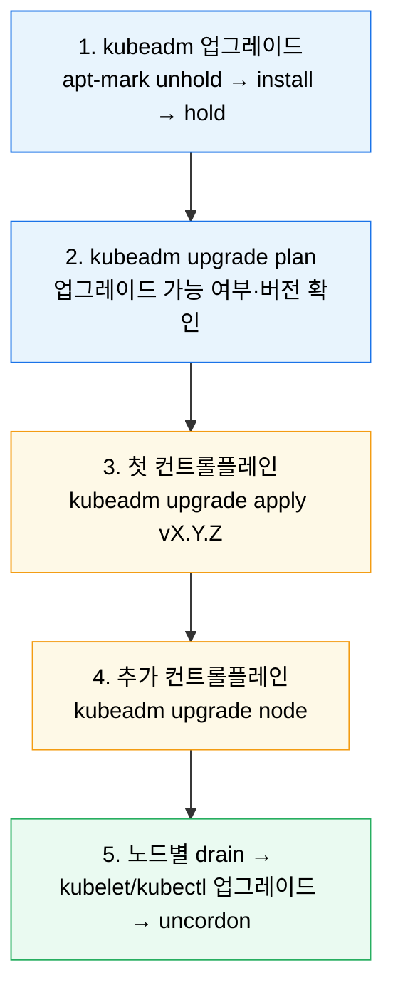
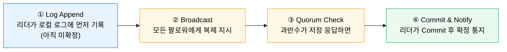
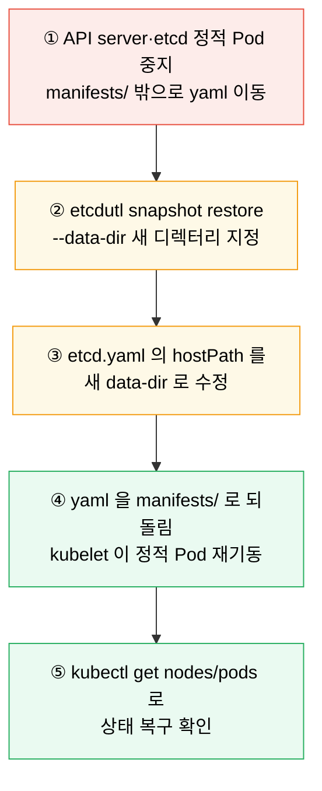

# 클러스터 업그레이드와 ETCD 백업·복구

---

> 운영에서 가장 위험한 두 작업은 업그레이드와 복구입니다. kubeadm 업그레이드는 버전 스큐 정책과 순서를 지키는 절차의 문제이고, etcd 복구는 스냅샷과 멤버십 재구성의 문제입니다. 그 사이에, etcd 가 애초에 어떻게 일관성을 보장하는지(Raft 합의)를 알아 두면 복구 절차가 왜 그렇게 생겼는지 이해가 깊어집니다. 셋 다 평소에는 거의 건드리지 않다가 사고가 나야 처음 해 보기 쉬운 작업이라, 절차를 손에 익혀 두는 것이 곧 가용성입니다.

## 학습 목표

> 자주 하지 않는 작업일수록 절차를 외우는 대신 "왜 이 순서인가" 를 이해해 둡니다.

이 장을 끝내면 다음에 답할 수 있습니다.

1. kubeadm 클러스터 업그레이드의 단계 순서를 컨트롤 플레인 → 워커 순으로 설명할 수 있습니다.
2. minor 버전 스킵이 왜 막혀 있는지, 버전 스큐 정책이 무엇을 보장하는지 설명할 수 있습니다.
3. etcd 가 Raft 합의로 강한 일관성을 얻는 방식과, 과반수(Quorum)가 왜 필요한지 설명할 수 있습니다.
4. etcd 스냅샷 백업과 복구의 흐름을, 정적 Pod 매니페스트를 옮기는 이유까지 설명할 수 있습니다.
5. 업그레이드 전 점검 항목과 복구 대비 항목을 분리해 정리할 수 있습니다.

## 사전 지식

> 이 장은 다음을 안다고 가정합니다.

1. kubeadm 으로 클러스터를 구성하거나 조인해 본 경험이 있습니다.
2. 정적 Pod(static Pod)가 `/etc/kubernetes/manifests/` 의 매니페스트로 kubelet 이 직접 띄우는 Pod 라는 점을 압니다.
3. `kubectl drain`·`cordon`·`uncordon` 의 의미를 한 줄로 설명할 수 있습니다.


## 1. kubeadm 업그레이드 원칙

> 업그레이드는 "한 번에 최신으로" 가 아니라 지원되는 순서를 한 단계씩 밟아 가는 작업입니다.

공식 문서 기준으로 kubeadm 클러스터는 **minor 버전을 건너뛰는 업그레이드를 지원하지 않습니다**. `1.31 → 1.33` 처럼 한 번에 올리지 못하고 `1.31 → 1.32 → 1.33` 으로 한 단계씩 올려야 합니다. 컨트롤 플레인 노드는 한 대씩 순차로 올리는 것이 원칙입니다.

이 제약의 근거가 버전 스큐 정책(version skew policy)입니다. kube-apiserver 가 가장 높은 버전을 유지하고, kubelet 은 apiserver 보다 같거나 낮되 허용 범위 안에 있어야 합니다. minor 한 칸씩만 올리면 이 범위가 항상 지켜지지만, 두 칸을 건너뛰면 컴포넌트 간 호환이 깨질 수 있어 막아 둔 것입니다.

### 전체 흐름



### 1-1. kubeadm 자체 업그레이드 (첫 컨트롤 플레인)

Debian/Ubuntu 계열에서는 패키지가 `hold` 로 고정돼 있으므로 잠시 풀고 목표 버전을 설치한 뒤 다시 고정합니다.

```bash
# 목표 minor 의 패키지 저장소를 먼저 활성화한 상태에서
sudo apt-mark unhold kubeadm
sudo apt-get update && sudo apt-get install -y kubeadm=1.32.0-1.1
sudo apt-mark hold kubeadm

kubeadm version   # 목표 버전인지 확인
```

### 1-2. 계획 확인과 적용

```bash
sudo kubeadm upgrade plan
# 업그레이드 가능 여부, 적용될 컴포넌트(apiserver/controller-manager/scheduler/etcd),
# CoreDNS·kube-proxy addon 버전을 표로 보여 줍니다.

sudo kubeadm upgrade apply v1.32.0
```

`kubeadm upgrade apply` 는 단순 패키지 교체가 아니라 컨트롤 플레인 정적 Pod 매니페스트를 새 버전으로 교체하고, addon(CoreDNS, kube-proxy)과 kubeadm 관리 인증서 갱신까지 함께 처리합니다. **두 번째 이후 컨트롤 플레인** 노드에서는 `apply` 대신 `kubeadm upgrade node` 를 씁니다.

### 1-3. kubelet·kubectl 업그레이드 (노드마다)

kubelet 의 minor 업그레이드 전에는 반드시 노드를 drain 합니다. 이는 권장이 아니라 스큐 정책상의 요구입니다.

```bash
kubectl drain <node-name> --ignore-daemonsets

sudo apt-mark unhold kubelet kubectl
sudo apt-get update && sudo apt-get install -y kubelet=1.32.0-1.1 kubectl=1.32.0-1.1
sudo apt-mark hold kubelet kubectl

sudo systemctl daemon-reload
sudo systemctl restart kubelet

kubectl uncordon <node-name>
```

워커 노드도 같은 패턴(drain → kubelet/kubectl 교체 → uncordon)을 한 대씩 반복합니다.


## 2. etcd와 Raft 합의

> 백업·복구를 논하기 전에, etcd 가 애초에 어떻게 "여러 노드에 복제해도 항상 같은 값" 을 보장하는지부터 봅니다. 그 근거가 Raft 합의 알고리즘입니다.

etcd 는 컨트롤 플레인의 모든 상태를 담는 저장소이자, 홀수 대(보통 3·5대)로 구성되는 분산 시스템입니다. 여러 대에 데이터를 복제하면서도 **어느 노드에서 읽어도 최신 값을 돌려주는 강한 일관성(strong consistency)** 을 Raft 합의 알고리즘으로 얻습니다. HA 를 위해 컨트롤 플레인을 여러 대로 늘릴 때, etcd 도 함께 늘어나 이 합의에 참여합니다.

### 2-1. 세 가지 노드 상태

Raft 에서 각 etcd 멤버는 항상 셋 중 한 상태입니다.

- **Leader(리더)** — 클러스터에 단 하나만 존재합니다. 모든 쓰기 요청을 받아 로그를 만들고 팔로워에게 복제를 지시합니다.
- **Follower(팔로워)** — 스스로 결정하지 않고 리더가 보내는 로그를 저장만 하는 수동적 참여자입니다.
- **Candidate(후보자)** — 리더가 사라졌다고 판단한 팔로워가 스스로 전환해 투표를 요청하는 과도기 상태입니다.

리더는 팔로워에게 주기적으로 **Heartbeat** 를 보냅니다. 팔로워가 **Election Timeout** 동안 Heartbeat 를 받지 못하면 리더가 죽었다고 보고 Candidate 로 전환해 투표를 요청하며, **과반수(Quorum)** 의 표를 얻은 후보가 새 리더가 됩니다.

### 2-2. 로그 복제 (Log Replication)

쓰기가 확정되는 과정은 네 단계입니다.



핵심은 **과반수가 저장을 확인해야만 Commit** 된다는 점입니다. 한두 노드가 응답하지 못해도 과반수만 살아 있으면 쓰기가 진행되므로, 이것이 고가용성의 근거가 됩니다.

### 2-3. 과반수가 Split-brain 을 막는다

**Split-brain** 은 네트워크 단절로 하나의 클러스터가 두 개 이상의 독립 그룹으로 쪼개지는 현상입니다. Raft 는 리더 선출과 데이터 확정 모두에 과반수 동의를 요구하므로, 쪼개진 그룹 중 **과반수를 넘지 못하는 쪽은 리더를 뽑지도, 쓰기를 하지도 못합니다.** 그래서 양쪽이 서로 다른 값을 확정해 데이터가 꼬이는 일이 원천 차단됩니다. etcd 를 3·5대처럼 홀수로 구성하는 이유도, 과반수 판정이 명확해지고 한 대(3대 중)·두 대(5대 중) 장애까지 견디기 위해서입니다.

이 일관성 보장이 있기에, 아래 스냅샷·복구는 "언제 어느 노드를 떠도 같은 상태" 라는 전제 위에서 안전하게 동작합니다.


## 3. etcd 스냅샷과 복구

> etcd 는 클러스터의 모든 상태를 담은 단일 저장소이므로, 최악을 대비한 스냅샷이 반드시 필요합니다.

### 3-1. 스냅샷 백업

kubeadm 클러스터에서 etcd 는 정적 Pod 로 떠 있고, 접속에 필요한 인증서 경로와 엔드포인트는 `/etc/kubernetes/manifests/etcd.yaml` 에서 확인할 수 있습니다.

```bash
ETCDCTL_API=3 etcdctl \
  --endpoints=https://127.0.0.1:2379 \
  --cacert=/etc/kubernetes/pki/etcd/ca.crt \
  --cert=/etc/kubernetes/pki/etcd/server.crt \
  --key=/etc/kubernetes/pki/etcd/server.key \
  snapshot save /var/lib/etcd-backup/snapshot-$(date +%F).db

# 무결성 확인
etcdutl snapshot status /var/lib/etcd-backup/snapshot-2026-05-30.db --write-out=table
```

### 3-2. 복구 흐름

복구는 "기존 멤버 위에 덮어쓰기" 가 아니라 **새 데이터 디렉터리로 클러스터를 다시 여는** 작업입니다. v3.5+ 부터 복구 도구는 `etcdctl` 이 아니라 `etcdutl` 이 권장입니다.



```bash
# ① 정적 Pod 내리기 (kubectl delete 는 정적 Pod 에 안 먹힘 → 매니페스트를 옮긴다)
sudo mv /etc/kubernetes/manifests/kube-apiserver.yaml /tmp/
sudo mv /etc/kubernetes/manifests/etcd.yaml /tmp/

# ② 새 데이터 디렉터리로 복구
sudo etcdutl snapshot restore /var/lib/etcd-backup/snapshot-2026-05-30.db \
  --data-dir /var/lib/etcd-restored

# ③ /tmp/etcd.yaml 의 etcd-data 볼륨 hostPath 를 /var/lib/etcd-restored 로 수정
# ④ 두 매니페스트를 manifests/ 로 되돌리면 kubelet 이 재기동
sudo mv /tmp/etcd.yaml /tmp/kube-apiserver.yaml /etc/kubernetes/manifests/
```

운영에서 새겨 둘 두 가지가 있습니다. 첫째, **스냅샷은 주기적으로 남기되 복구 절차까지 한 번은 리허설해 봐야** 합니다. 백업만 있고 복구를 안 해 본 팀은 사고 당일 처음 복구를 시도하게 됩니다. 둘째, **`--data-dir` 를 생략하면 안 됩니다.** 생략하면 현재 작업 디렉터리에 풀려 기존 데이터와 섞일 수 있습니다.


## 4. 실습 기록

> 개인 GCP K8s 클러스터(dev-server 1~3, asia-northeast3-a, kubeadm v1.31.14)에서 백업·확인까지 수행합니다. 업그레이드는 운영 클러스터를 깨뜨릴 수 있어, 실습에서는 백업·스냅샷 검증까지만 다루고 `upgrade plan` 은 dry 확인으로 멈춥니다.

### 실습 1: etcd 스냅샷 백업과 무결성 검증

```bash
# 컨트롤 플레인 노드에서
sudo mkdir -p /var/lib/etcd-backup
ETCDCTL_API=3 sudo etcdctl \
  --endpoints=https://127.0.0.1:2379 \
  --cacert=/etc/kubernetes/pki/etcd/ca.crt \
  --cert=/etc/kubernetes/pki/etcd/server.crt \
  --key=/etc/kubernetes/pki/etcd/server.key \
  snapshot save /var/lib/etcd-backup/snap-test.db
```

**예상 결과:**

```
{"level":"info","msg":"saved","path":"/var/lib/etcd-backup/snap-test.db"}
Snapshot saved at /var/lib/etcd-backup/snap-test.db
```

```bash
sudo etcdutl snapshot status /var/lib/etcd-backup/snap-test.db --write-out=table
```

**예상 결과:**

```
+----------+----------+------------+------------+
|   HASH   | REVISION | TOTAL KEYS | TOTAL SIZE |
+----------+----------+------------+------------+
| a1b2c3d4 |   123456 |       1789 |     4.7 MB |
+----------+----------+------------+------------+
```

**분석:** TOTAL KEYS 가 클러스터 오브젝트 수와 대략 비례합니다. status 가 정상 출력되면 그 스냅샷은 복구에 쓸 수 있는 유효한 파일입니다. 백업 직후 status 를 한 번 찍어 두는 습관이 "백업은 됐는데 깨진 파일" 사고를 막습니다.

### 실습 2: 업그레이드 가능 여부만 확인 (비파괴)

```bash
sudo kubeadm upgrade plan
```

**분석:** 실제 `apply` 없이 plan 만 돌리면 현재 버전에서 올라갈 수 있는 목표 버전과, 그때 교체될 컴포넌트·addon 목록을 보여 줍니다. 운영 클러스터에서 "지금 올릴 수 있나" 를 확인하는 안전한 첫 단계입니다.


## 5. 면접 대비 요약

### 한 줄 정의

kubeadm 업그레이드는 버전 스큐를 지키며 컨트롤 플레인 → 워커 순으로 minor 한 칸씩 올리는 절차이고, etcd 는 Raft 합의로 강한 일관성을 얻으며, 복구는 스냅샷으로 새 데이터 디렉터리에 클러스터를 다시 여는 작업입니다.

### 핵심 포인트 3가지

1. minor 스킵 불가 — 버전 스큐 정책이 컴포넌트 호환을 보장하므로 한 칸씩 올립니다.
2. etcd 는 Raft 로 리더를 뽑고 로그를 복제하며, 과반수(Quorum) 동의가 있어야 쓰기가 확정돼 Split-brain 을 막습니다.
3. etcd 복구는 정적 Pod 매니페스트를 옮겨 중지 → `etcdutl ... --data-dir` 로 복구 → hostPath 수정 → 매니페스트 복귀.

### 자주 묻는 질문

- **Q. 왜 minor 버전을 건너뛰면 안 됩니까?** 버전 스큐 정책상 apiserver 와 kubelet 의 허용 버전 차이를 넘기 때문입니다.
- **Q. etcd 를 왜 홀수 대로 구성합니까?** 과반수 판정이 명확해지고, 3대 중 1대·5대 중 2대 장애까지 견디면서 리더 선출과 쓰기가 계속되기 때문입니다.
- **Q. etcd 정적 Pod 를 왜 `kubectl delete` 하지 않습니까?** 정적 Pod 는 kubelet 이 매니페스트로 직접 관리해 API 로 지울 수 없고, 매니페스트를 옮겨야 멈춥니다.
- **Q. 복구 시 `--data-dir` 를 생략하면?** 현재 디렉터리에 풀려 기존 데이터와 섞일 수 있어 항상 새 경로를 지정합니다.


## 관련 문서

> 운영 심화편에서 보안과 점검 흐름으로 이어집니다.

- [클러스터 업그레이드와 ETCD 백업·복구 점검](05-01.%ED%81%B4%EB%9F%AC%EC%8A%A4%ED%84%B0%20%EC%97%85%EA%B7%B8%EB%A0%88%EC%9D%B4%EB%93%9C%EC%99%80%20ETCD%20%EB%B0%B1%EC%97%85%C2%B7%EB%B3%B5%EA%B5%AC%20%EC%A0%90%EA%B2%80.md) — 자가 점검
- [TLS와 API 접근 보안](05-02.TLS%EC%99%80%20API%20%EC%A0%91%EA%B7%BC%20%EB%B3%B4%EC%95%88.md) — 컨트롤 플레인 PKI
- [모니터링과 트러블슈팅](05-08.%EB%AA%A8%EB%8B%88%ED%84%B0%EB%A7%81%EA%B3%BC%20%ED%8A%B8%EB%9F%AC%EB%B8%94%EC%8A%88%ED%8C%85.md) — 장애 진단
