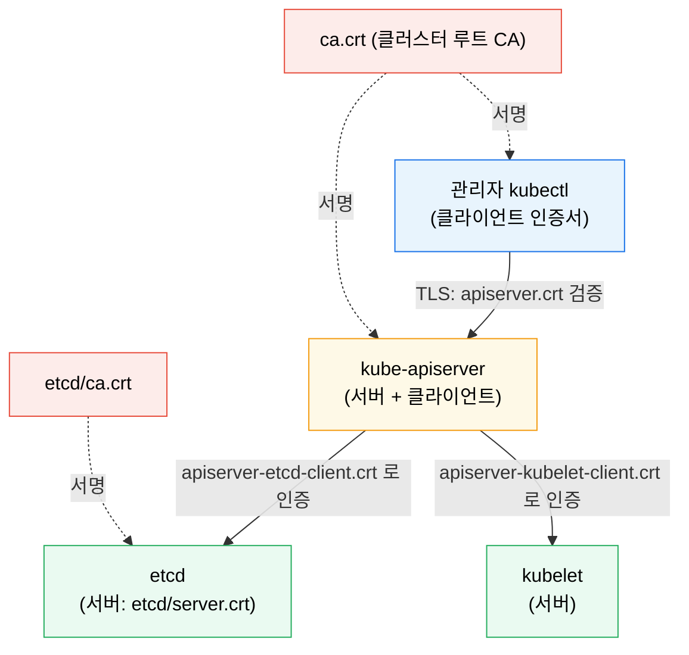
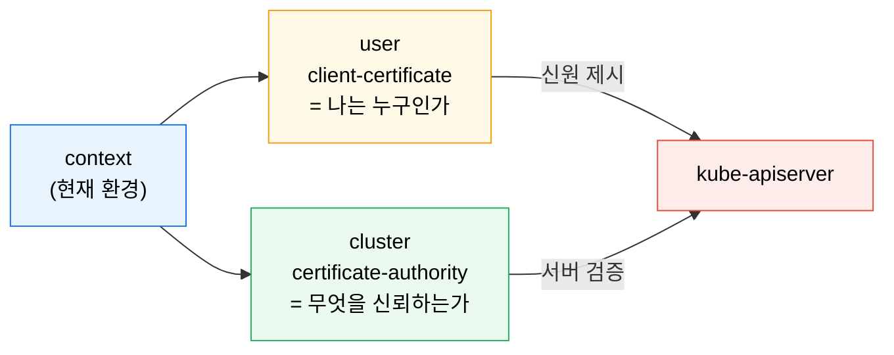

# TLS와 API 접근 보안

---

> Kubernetes 보안의 출발점은 API 서버와의 통신이 어떻게 보호되고 인증되는지 이해하는 것입니다. kubeconfig·인증서·CA 는 각각 다른 층위의 개념입니다. 본 장은 컨트롤 플레인 PKI(API 서버·etcd·kubelet 인증서)에 집중하고, 외부 트래픽 인증서 자동화(cert-manager·Issuer·Certificate)는 [04-06 Ingress와 Gateway API §3](../02_networking/02-06.Ingress%EC%99%80%20Gateway%20API.md#3-tls-관리)에서 다룹니다.

## 학습 목표

> RBAC 이전에 "누구로 접속했고, 무엇을 신뢰하는가" 를 먼저 분리합니다.

이 장을 끝내면 다음에 답할 수 있습니다.

1. API 서버·etcd·kubelet 이 TLS 로 어떻게 연결되는지 설명할 수 있습니다.
2. 서버 인증서와 클라이언트 인증서의 역할 차이를 설명할 수 있습니다.
3. kubeconfig 의 `cluster`·`user`·`context` 가 보안상 어떤 의미를 갖는지 설명할 수 있습니다.
4. 인증서 만료를 어떻게 점검·갱신하는지 설명할 수 있습니다.

## 사전 지식

> 이 장은 다음을 안다고 가정합니다.

1. TLS 핸드셰이크에서 서버 인증서가 "이 서버가 진짜인가" 를 증명한다는 점을 압니다.
2. CA(인증 기관)가 인증서에 서명해 신뢰 체인을 만든다는 개념을 압니다.
3. `kubectl` 이 kubeconfig 파일을 읽어 클러스터에 접속한다는 점을 압니다.


## 1. Kubernetes의 PKI 구조

> Kubernetes 는 여러 컴포넌트가 서로 TLS 로 통신하는 시스템입니다. TLS 는 "외부 사용자의 kubectl 접속" 만을 위한 것이 아니라 컨트롤 플레인 내부 통신 전체의 기반입니다.

kubeadm 으로 설치하면 인증서는 `/etc/kubernetes/pki` 에 모입니다. 핵심 인증서는 다음과 같습니다.

| 파일 | 종류 | 역할 |
|------|------|------|
| `ca.crt` | 루트 CA | 클러스터 일반 인증서를 서명·검증하는 최상위 CA |
| `apiserver.crt` | 서버 | API 서버가 HTTPS 서비스를 제공할 때 자신을 증명 |
| `apiserver-kubelet-client.crt` | 클라이언트 | API 서버가 각 노드 kubelet 에 접속할 때 자신을 인증 |
| `etcd/ca.crt` | 루트 CA | etcd 관련 인증서 전용 CA (apiserver CA 와 분리) |
| `etcd/server.crt` | 서버 | etcd 저장소가 자신을 증명 |
| `apiserver-etcd-client.crt` | 클라이언트 | API 서버가 etcd 에 접속할 때 자신을 인증 |

### 서버 인증서 vs 클라이언트 인증서

같은 PKI 안에서도 두 인증서의 방향이 다릅니다. **서버 인증서**는 서비스(API 서버·etcd·kubelet)가 "나는 진짜 그 서비스다" 를 클라이언트에게 증명합니다. **클라이언트 인증서**는 사용자나 컴포넌트(admin·controller-manager·scheduler)가 "나는 이런 신원이다" 를 서버에게 증명합니다. API 서버는 etcd·kubelet 에 접속할 때는 클라이언트가 되고, kubectl 요청을 받을 때는 서버가 되므로 양쪽 인증서를 모두 가집니다.




## 2. kubeconfig와 신뢰 경계

> kubeconfig 는 접속 설정 파일이면서 동시에 인증 실행 경로입니다.

kubeconfig(예: `admin.conf`)는 세 요소로 접속을 구성합니다.

- **cluster** — API 서버 주소와 서버를 검증할 `certificate-authority`(또는 `-data`). "무엇을 신뢰하는가".
- **user** — 클라이언트가 자신을 인증할 `client-certificate`·`client-key`(또는 `-data`). "나는 누구인가".
- **context** — 특정 user 와 특정 cluster 를 묶어 "지금 어느 환경으로 동작하는가" 를 정합니다.



```bash
kubectl config get-contexts
kubectl config current-context
kubectl config view --minify
```

공식 문서가 명시하는 경고가 하나 있습니다. **신뢰할 수 없는 kubeconfig 파일은 악성 코드 실행이나 파일 노출로 이어질 수 있으므로 셸 스크립트처럼 다뤄야 합니다.** kubeconfig 는 "어느 클러스터를 볼까" 를 정하는 편의 파일이 아니라 실제 인증과 신뢰 체인의 일부입니다.


## 3. 인증서 만료 점검과 갱신

> TLS 는 평소엔 안 보이지만 인증서 만료 순간 클러스터 전체 API 접속이 막히며 드러납니다.

kubeadm 클러스터는 만료를 명령 한 줄로 점검합니다.

```bash
sudo kubeadm certs check-expiration
```

갱신은 두 경로가 있습니다. 컨트롤 플레인 **업그레이드 시 kubeadm 이 자동 갱신**하고([08-01](05-01.%ED%81%B4%EB%9F%AC%EC%8A%A4%ED%84%B0%20%EC%97%85%EA%B7%B8%EB%A0%88%EC%9D%B4%EB%93%9C%EC%99%80%20ETCD%20%EB%B0%B1%EC%97%85%C2%B7%EB%B3%B5%EA%B5%AC.md) 참조), 필요하면 수동으로 갱신합니다.

```bash
sudo kubeadm certs renew all
# 갱신 후 컨트롤 플레인 정적 Pod 재시작이 필요합니다.
```


## 4. 실습 기록

> 개인 GCP K8s 클러스터(dev-server 1~3, kubeadm v1.31.14)에서 인증서 만료와 kubeconfig 구조를 확인합니다. 인증서 갱신은 운영 클러스터를 흔들 수 있어 실습에서는 점검·조회까지만 합니다.

### 실습 1: 인증서 만료 점검

```bash
sudo kubeadm certs check-expiration
```

**예상 결과:**

```
CERTIFICATE                EXPIRES                  RESIDUAL TIME   EXTERNALLY MANAGED
admin.conf                 May 28, 2027 06:00 UTC   364d            no
apiserver                  May 28, 2027 06:00 UTC   364d            no
apiserver-etcd-client      May 28, 2027 06:00 UTC   364d            no
apiserver-kubelet-client   May 28, 2027 06:00 UTC   364d            no
etcd-server                May 28, 2027 06:00 UTC   364d            no
```

**분석:** kubeadm 인증서의 기본 유효기간은 1년입니다. RESIDUAL TIME 이 한 달 안으로 줄기 전에 업그레이드(자동 갱신) 또는 `certs renew` 를 계획해야 합니다. 만료를 넘기면 kubectl 자체가 인증 실패로 막혀 복구 난도가 급등합니다.

### 실습 2: kubeconfig 신뢰 요소 확인

```bash
kubectl config view --minify
```

**분석:** 출력의 `cluster.certificate-authority-data`(서버 신뢰)와 `user.client-certificate-data`(내 신원)가 각각 §2 의 "무엇을 신뢰 / 나는 누구" 두 축에 대응합니다. 이 두 값이 곧 TLS 신뢰 체인의 양 끝입니다.


## 5. 면접 대비 요약

### 한 줄 정의

Kubernetes TLS 는 컨트롤 플레인 컴포넌트 간 서버·클라이언트 인증서로 통신을 보호하는 PKI 이고, kubeconfig 는 "무엇을 신뢰(cluster)" 와 "나는 누구(user)" 를 묶어 인증을 실행하는 파일입니다.

### 핵심 포인트 3가지

1. TLS 는 외부 접속뿐 아니라 apiserver·etcd·kubelet 내부 통신의 기반입니다.
2. 서버 인증서(서비스 증명)와 클라이언트 인증서(신원 증명)는 방향이 다르고, API 서버는 둘 다 가집니다.
3. kubeadm 인증서는 1년 만료라 `certs check-expiration` 으로 점검하고 업그레이드나 `renew` 로 갱신합니다.

### 자주 묻는 질문

- **Q. RBAC 과 TLS 는 어떻게 다릅니까?** TLS 는 "누구인가(인증)·무엇을 신뢰", RBAC 은 "무엇을 할 수 있나(인가)" 로 층이 다릅니다.
- **Q. etcd CA 가 클러스터 CA 와 분리된 이유는?** etcd 신뢰 영역을 컨트롤 플레인과 격리해, 한쪽 CA 유출이 다른 쪽으로 번지지 않게 합니다.
- **Q. 인증서가 만료되면 어떻게 됩니까?** API 접속 자체가 막혀 kubectl 도 안 되므로, 만료 전 갱신이 유일한 안전책입니다.


## 관련 문서

> 보안 장, 업그레이드 장, 외부 트래픽 인증서 자동화 장을 함께 읽으면 맥락이 자연스럽습니다.

- [TLS와 API 접근 보안 점검](05-02.TLS%EC%99%80%20API%20%EC%A0%91%EA%B7%BC%20%EB%B3%B4%EC%95%88%20%EC%A0%90%EA%B2%80.md) — 자가 점검
- [Ingress와 Gateway API](../02_networking/02-06.Ingress%EC%99%80%20Gateway%20API.md) — cert-manager 로 외부 트래픽 인증서 자동화
- [RBAC과 보안](05-09.RBAC%EA%B3%BC%20%EB%B3%B4%EC%95%88.md) — Admission·ServiceAccount 토큰
- [클러스터 업그레이드와 ETCD 백업·복구](05-01.%ED%81%B4%EB%9F%AC%EC%8A%A4%ED%84%B0%20%EC%97%85%EA%B7%B8%EB%A0%88%EC%9D%B4%EB%93%9C%EC%99%80%20ETCD%20%EB%B0%B1%EC%97%85%C2%B7%EB%B3%B5%EA%B5%AC.md)
