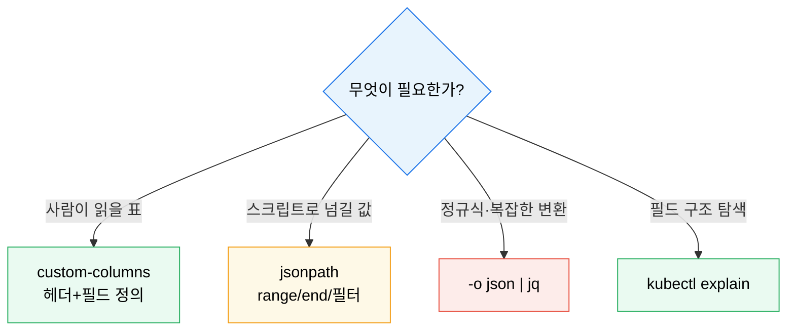
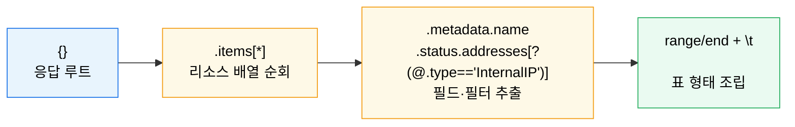

# JSONPath와 kubectl 고급 조회

---

> 운영에서는 리소스를 "보는 것" 보다 "필요한 필드만 빠르게 뽑는 것" 이 더 중요합니다. JSONPath 와 custom-columns 는 `kubectl` 출력에서 점검·자동화 루틴을 만드는 핵심 도구입니다.

## 학습 목표

> 사람이 읽는 출력과 스크립트가 읽는 출력을 분리해 다룹니다.

이 장을 끝내면 다음에 답할 수 있습니다.

1. `-o jsonpath=...` 출력 형식과 `range`·`end`·필터 표현식을 설명할 수 있습니다.
2. `custom-columns`·`--sort-by` 로 표 형태 출력과 정렬을 만들 수 있습니다.
3. JSONPath 가 정규식을 지원하지 않는다는 점과 `jq` 와의 경계를 설명할 수 있습니다.
4. 필드 구조를 모를 때 `kubectl explain` 으로 스키마를 찾을 수 있습니다.

## 사전 지식

> 이 장은 다음을 안다고 가정합니다.

1. `kubectl get`·`describe` 로 리소스를 조회해 본 경험이 있습니다.
2. JSON/YAML 의 중첩 구조(객체·배열)를 읽을 수 있습니다.
3. 셸 파이프(`|`)와 따옴표 이스케이프에 익숙합니다.


## 1. 왜 JSONPath인가

> `kubectl get` 기본 출력만으로는 반복 점검이 어렵습니다.

"모든 Pod 이름과 시작 시각", "모든 노드의 InternalIP", "restartCount 가 큰 컨테이너" 같은 조회는 표준 출력만으로는 불편합니다. JSONPath 는 필요한 필드만 뽑아 사람이 읽거나 스크립트로 넘길 수 있게 해 줍니다.

```bash
kubectl get pods -o=jsonpath="{range .items[*]}{.metadata.name}{'\t'}{.status.startTime}{'\n'}{end}"
```

출력 도구는 목적에 따라 갈라 씁니다.




## 2. 자주 쓰는 패턴

> 운영에서 반복되는 패턴 몇 개만 익혀도 생산성이 크게 오릅니다.

### 2-1. JSONPath — range·필터 표현식

```bash
# 현재 네임스페이스 Pod 이름
kubectl get pods -o=jsonpath="{range .items[*]}{.metadata.name}{'\n'}{end}"

# 노드 이름과 InternalIP (?() 필터: @ 는 현재 객체)
kubectl get nodes -o=jsonpath="{range .items[*]}{.metadata.name}{'\t'}{.status.addresses[?(@.type=='InternalIP')].address}{'\n'}{end}"

# 특정 Pod 의 재시작 횟수
kubectl get pod my-pod -o=jsonpath="{.status.containerStatuses[0].restartCount}"
```

`?(@.type=='InternalIP')` 처럼 `?()` 안에서 `@`(현재 객체) 조건으로 배열 원소를 골라낼 수 있습니다.

JSONPath 의 흐름은 "루트 → items 배열 → 각 원소의 필드" 로 내려갑니다.



### 2-2. custom-columns 와 정렬

```bash
# 사람이 읽을 표
kubectl get pods -o=custom-columns="NAME:.metadata.name,IMAGE:.spec.containers[0].image"

# 나이순 정렬
kubectl get pods --sort-by=.metadata.creationTimestamp

# 재시작 횟수순 정렬
kubectl get pods --sort-by=.status.containerStatuses[0].restartCount
```

### 2-3. JSONPath 의 한계와 jq 경계

공식 문서 기준으로 `kubectl` JSONPath 는 `range`·`end`·음수 인덱스·필터 표현식을 지원하지만 **정규식은 지원하지 않습니다**. 정규식 필터링이나 복잡한 변환이 필요하면 `-o json | jq ...` 조합이 적합합니다. `--sort-by` 도 다중 필드 정렬은 못 하므로 그때는 `sort`·`jq` 를 씁니다.

### 2-4. 필드 구조 탐색

```bash
kubectl explain pods.spec.containers           # 필드·타입·설명
kubectl explain pods.spec --recursive          # 전체 필드 트리
```


## 3. 실습 기록

> 개인 GCP K8s 클러스터(dev-server 1~3, kubeadm v1.31.14)에서 조회 패턴을 실행합니다. 모두 read-only 조회라 운영에 안전합니다.

### 실습 1: 노드 이름과 InternalIP 표 만들기

```bash
kubectl get nodes -o=jsonpath="{range .items[*]}{.metadata.name}{'\t'}{.status.addresses[?(@.type=='InternalIP')].address}{'\n'}{end}"
```

**예상 결과:**

```
dev-server-1    10.178.0.2
dev-server-2    10.178.0.3
dev-server-3    10.178.0.4
```

**분석:** `?(@.type=='InternalIP')` 필터가 addresses 배열에서 InternalIP 타입만 골라냅니다. ExternalIP·Hostname 을 섞지 않고 정확히 한 값을 뽑는 것이 필터 표현식의 핵심입니다.

### 실습 2: 재시작 많은 Pod 정렬

```bash
kubectl get pods -A --sort-by=.status.containerStatuses[0].restartCount | tail -5
```

**분석:** restartCount 가 큰 Pod 가 아래로 정렬되어, 반복 재시작(CrashLoopBackOff 후보)을 한눈에 찾습니다. 트러블슈팅([05-08](05-08.%EB%AA%A8%EB%8B%88%ED%84%B0%EB%A7%81%EA%B3%BC%20%ED%8A%B8%EB%9F%AC%EB%B8%94%EC%8A%88%ED%8C%85.md))의 첫 조회로 자주 씁니다.


## 4. 면접 대비 요약

### 한 줄 정의

JSONPath·custom-columns 는 `kubectl` 출력에서 필요한 필드만 뽑아 점검·자동화하는 도구이고, 정규식이 필요한 순간이 `jq` 로 넘어가는 경계입니다.

### 핵심 포인트 3가지

1. `range`/`end` 로 배열을 순회하고 `?(@.field==...)` 필터로 원소를 골라냅니다.
2. 사람이 읽을 표는 custom-columns, 정렬은 `--sort-by`, 정규식·복잡 변환은 `jq` 입니다.
3. 필드를 모르면 `kubectl explain ... --recursive` 로 스키마를 먼저 봅니다.

### 자주 묻는 질문

- **Q. JSONPath 로 정규식 필터가 됩니까?** 안 됩니다. `-o json | jq` 로 넘어가야 합니다.
- **Q. custom-columns 와 jsonpath 는 언제 갈라 씁니까?** 사람이 읽을 표는 custom-columns, 스크립트로 넘길 값 추출은 jsonpath 입니다.
- **Q. `?(@.type=='Ready')` 의 `@` 는 무엇입니까?** 필터가 평가하는 현재 객체(배열의 각 원소)를 가리킵니다.


## 관련 문서

> 트러블슈팅과 CKA 대비에서 직접 연결됩니다.

- [JSONPath와 kubectl 고급 조회 점검](05-03.JSONPath%EC%99%80%20kubectl%20%EA%B3%A0%EA%B8%89%20%EC%A1%B0%ED%9A%8C%20%EC%A0%90%EA%B2%80.md) — 자가 점검
- [모니터링과 트러블슈팅](05-08.%EB%AA%A8%EB%8B%88%ED%84%B0%EB%A7%81%EA%B3%BC%20%ED%8A%B8%EB%9F%AC%EB%B8%94%EC%8A%88%ED%8C%85.md) — 조회를 진단으로
- [CKA 대비와 문제 풀이 전략](05-04.CKA%20%EB%8C%80%EB%B9%84%EC%99%80%20%EB%AC%B8%EC%A0%9C%20%ED%92%80%EC%9D%B4%20%EC%A0%84%EB%9E%B5.md) — 시험에서의 조회 요령
