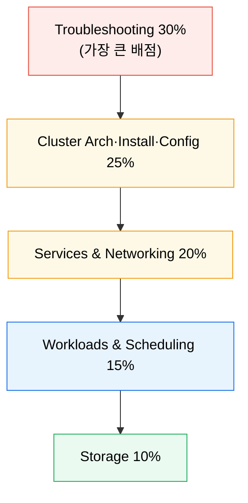
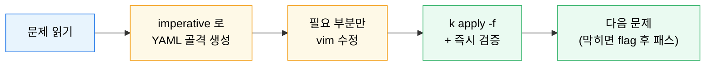

# CKA 대비와 문제 풀이 전략

---

> CKA 는 암기 시험이 아니라 명령줄에서 실제 작업을 수행하는 performance-based 시험입니다. 그래서 새 요약집을 만드는 것보다, 평소 실습 흐름을 시험 도메인 가중치에 맞춰 압축하는 편이 더 효과적입니다.

## 학습 목표

> 시험 정보를 최신 기준으로 짚되, 준비 방식은 실무 문서와 연결합니다.

이 장을 끝내면 다음에 답할 수 있습니다.

1. CKA 가 performance-based 시험이고 도메인별 가중치가 어떻게 나뉘는지 설명할 수 있습니다.
2. 가장 배점이 큰 영역(Troubleshooting·Cluster Architecture)부터 복습 우선순위를 세울 수 있습니다.
3. imperative 명령과 alias 로 풀이 속도를 올리는 방법을 설명할 수 있습니다.
4. 이 카테고리 문서를 시험 준비 체크리스트로 재활용할 수 있습니다.

## 사전 지식

> 이 장은 다음을 안다고 가정합니다.

1. 이 카테고리의 기반·네트워킹·스토리지·운영 문서를 한 번씩 읽었습니다.
2. `kubectl` 기본 동사(get/describe/apply/edit)에 익숙합니다.
3. YAML 매니페스트를 직접 작성·수정해 본 경험이 있습니다.


## 1. 시험 성격과 도메인 가중치

> 세부 문항보다 시험 성격·기준 버전·배점 분포를 먼저 확인합니다.

공식 페이지 기준으로 CKA 는 **2시간 performance-based** 시험이고, 합격선은 **66%**, 시험 환경은 최신 Kubernetes minor(2026 기준 v1.34~v1.35) 에 맞춰 갱신됩니다. 도메인 가중치는 다음과 같습니다.

| 도메인 | 비중 |
|--------|------|
| Troubleshooting | 30% |
| Cluster Architecture, Installation & Configuration | 25% |
| Services & Networking | 20% |
| Workloads & Scheduling | 15% |
| Storage | 10% |



Troubleshooting 과 Cluster Architecture 가 합쳐 55% 입니다. 오래된 블로그 요약본보다 공식 커리큘럼과 시험 버전을 먼저 확인하는 편이 안전합니다.


## 2. 준비 우선순위

> 시험은 넓게 묻지만, 실제 점수는 배점 큰 영역의 작업 속도에서 갈립니다.

가중치를 따라 우선순위를 세웁니다.

1. **Troubleshooting(30%)** — `kubectl get/describe/logs/exec`, 노드·Pod·서비스 장애 진단([10-01](05-08.%EB%AA%A8%EB%8B%88%ED%84%B0%EB%A7%81%EA%B3%BC%20%ED%8A%B8%EB%9F%AC%EB%B8%94%EC%8A%88%ED%8C%85.md))
2. **Cluster Architecture(25%)** — kubeadm 업그레이드·etcd 백업([08-01](05-01.%ED%81%B4%EB%9F%AC%EC%8A%A4%ED%84%B0%20%EC%97%85%EA%B7%B8%EB%A0%88%EC%9D%B4%EB%93%9C%EC%99%80%20ETCD%20%EB%B0%B1%EC%97%85%C2%B7%EB%B3%B5%EA%B5%AC.md)), RBAC([10-02](05-09.RBAC%EA%B3%BC%20%EB%B3%B4%EC%95%88.md))
3. **Services & Networking(20%)** — Service·Ingress·NetworkPolicy([02_networking](../02_networking/README.md))
4. **Workloads & Scheduling(15%)** — Deployment·rollout, 스케줄링([09-01](05-05.%EC%8A%A4%EC%BC%80%EC%A4%84%EB%A7%81%EA%B3%BC%20%EB%85%B8%EB%93%9C%20%EC%84%A0%ED%83%9D.md))
5. **Storage(10%)** — PVC·StorageClass·StatefulSet([03-01](../01_foundation/01-03.%EC%8A%A4%ED%86%A0%EB%A6%AC%EC%A7%80%EC%99%80%20%EC%83%81%ED%83%9C.md))

여기에 JSONPath([08-03](05-03.JSONPath%EC%99%80%20kubectl%20%EA%B3%A0%EA%B8%89%20%EC%A1%B0%ED%9A%8C.md))·`kubectl explain`·`drain`·`rollout undo` 같은 반복 명령이 붙습니다.


## 3. 풀이 속도 전략 — imperative 명령

> 시험은 시간 싸움이라, YAML 을 처음부터 손으로 쓰지 않고 imperative 로 골격을 뽑아 수정합니다.

시험 터미널에는 `k` alias(=`kubectl`)가 기본 설정돼 있고, 시작 시 자신만의 alias 를 추가할 수 있습니다.

```bash
# 시험 시작 직후 권장
alias k=kubectl
alias kdr='kubectl --dry-run=client -o yaml'

# YAML 골격을 빠르게 생성해 수정 (처음부터 작성 금지)
k create deploy web --image=nginx --dry-run=client -o yaml > deploy.yaml
k run tmp --image=busybox --dry-run=client -o yaml -- sleep 3600 > pod.yaml
k expose deploy web --port=80 --dry-run=client -o yaml > svc.yaml
```



시험 중에는 공식 문서(kubernetes.io/docs)·Blog·Helm·Gateway API 문서 접근이 허용됩니다. 외워서 풀기보다 자주 쓰는 YAML 의 위치를 미리 파악해 두는 편이 빠릅니다.


## 4. 실습 기록

> 개인 GCP K8s 클러스터(dev-server 1~3, kubeadm v1.31.14)에서 imperative 풀이 흐름을 시간 재며 연습합니다.

### 실습 1: imperative 로 Deployment 30초 안에 만들기

```bash
k create deploy web --image=nginx --replicas=3 --dry-run=client -o yaml > deploy.yaml
# resources·label 등 필요 부분만 vim 으로 추가
k apply -f deploy.yaml
k rollout status deploy/web
```

**예상 결과:**

```
deployment.apps/web created
Waiting for deployment "web" rollout to finish: 0 of 3 updated replicas are available...
deployment "web" successfully rolled out
```

**분석:** `--dry-run=client -o yaml` 로 골격을 뽑으면 apiVersion·kind·selector 를 외울 필요가 없습니다. CKA 에서 1~2분 걸릴 작업을 30초로 줄이는 핵심 습관입니다.

### 실습 2: 장애 진단 루틴 (Troubleshooting 30% 대비)

```bash
k get pods -A --field-selector=status.phase!=Running
k describe pod <문제Pod> | sed -n '/Events/,$p'
k logs <문제Pod> --previous
```

**분석:** 배점이 가장 큰 Troubleshooting 은 "어디를 먼저 보는가" 의 순서가 점수입니다. 비정상 Pod 추리기 → Events → 직전 로그 순서를 몸에 익혀 둡니다.


## 5. 면접·시험 대비 요약

### 한 줄 정의

CKA 는 2시간 performance-based 시험(합격 66%)으로, Troubleshooting 30%·Cluster Architecture 25% 가 배점의 절반을 넘으므로 그 두 영역의 작업 속도가 합격을 가릅니다.

### 핵심 포인트 3가지

1. 도메인 가중치(Troubleshooting 30% → Storage 10%) 순으로 복습 우선순위를 잡습니다.
2. YAML 은 imperative(`--dry-run=client -o yaml`)로 골격을 뽑아 수정해 시간을 법니다.
3. 시험 중 공식 문서 접근이 허용되므로 암기보다 "위치 파악" 이 빠릅니다.

### 자주 묻는 질문

- **Q. 가장 배점이 큰 도메인은?** Troubleshooting(30%)입니다.
- **Q. YAML 을 처음부터 손으로 써야 합니까?** 아닙니다. imperative 로 골격을 생성해 수정하는 편이 훨씬 빠릅니다.
- **Q. 시험 중 문서를 봐도 됩니까?** kubernetes.io/docs·Blog·Helm·Gateway API 문서는 허용됩니다.


## 관련 문서

> 시험 준비는 결국 실무 루틴과 연결될 때 오래 남습니다.

- [CKA 대비와 문제 풀이 전략 점검](05-04.CKA%20%EB%8C%80%EB%B9%84%EC%99%80%20%EB%AC%B8%EC%A0%9C%20%ED%92%80%EC%9D%B4%20%EC%A0%84%EB%9E%B5%20%EC%A0%90%EA%B2%80.md) — 자가 점검
- [JSONPath와 kubectl 고급 조회](05-03.JSONPath%EC%99%80%20kubectl%20%EA%B3%A0%EA%B8%89%20%EC%A1%B0%ED%9A%8C.md) — 조회 속도
- [모니터링과 트러블슈팅](05-08.%EB%AA%A8%EB%8B%88%ED%84%B0%EB%A7%81%EA%B3%BC%20%ED%8A%B8%EB%9F%AC%EB%B8%94%EC%8A%88%ED%8C%85.md) — 배점 1위 영역
