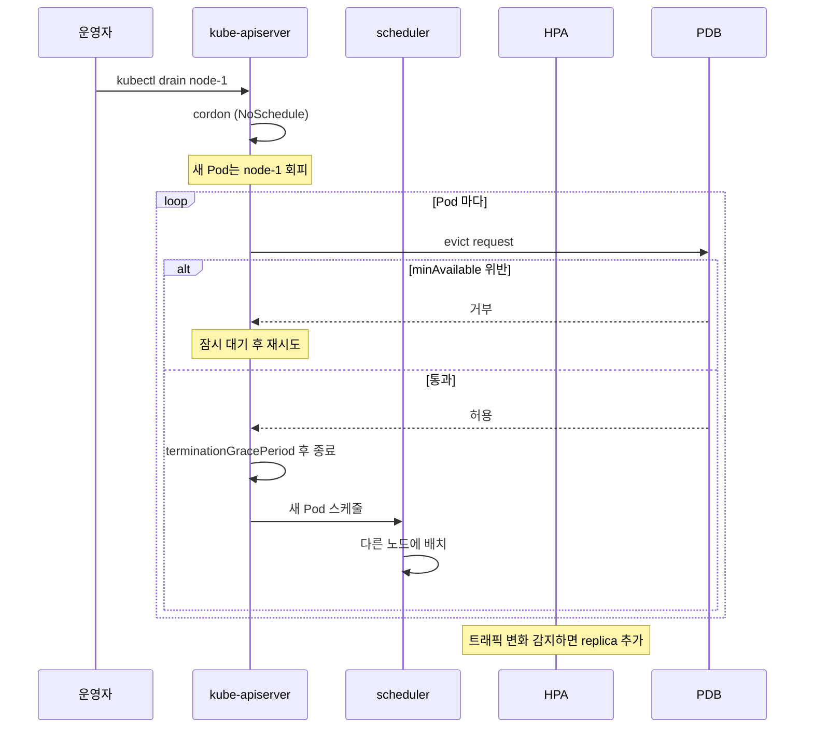

# 토폴로지 분산과 중단 정책

> 가용성은 두 가지에 깨집니다. 같은 워크로드가 한 곳에 몰려 있을 때, 그리고 점검·자동 퇴거 같은 중단이 동시에 너무 많이 일어날 때입니다. 앞은 Topology Spread Constraints로 분산을 만들고, 뒤는 PodDisruptionBudget으로 동시 중단의 상한을 둡니다. PriorityClass와 Eviction은 그 위에서 어떤 Pod가 살아남아야 하는지를 결정합니다.


## 학습 목표
> 분산 도구와 중단 가드를 함께 묶어 운영 가용성을 어떻게 표현하는지 정리합니다.

이 장에서 확인할 목표는 다음과 같다:

1. Topology Spread Constraints의 `maxSkew`·`whenUnsatisfiable` 의미를 설명할 수 있습니다.
2. podAntiAffinity 분산과 Topology Spread 분산의 역할 차이를 비교할 수 있습니다.
3. PodDisruptionBudget의 `minAvailable`·`maxUnavailable`이 자발적 중단에서 무엇을 보호하는지 설명할 수 있습니다.
4. PriorityClass와 Preemption이 어떤 조건에서 다른 Pod를 밀어내는지 이해할 수 있습니다.
5. node-pressure eviction과 API-initiated eviction이 다른 사고 시나리오에서 발생함을 구분할 수 있습니다.
6. 노드 점검(drain) 흐름에서 PDB·HPA·PriorityClass가 어떻게 협력하는지 설명할 수 있습니다.


## 1. 가용성을 깨는 두 축
> 분포와 중단을 분리해서 보는 출발점을 잡습니다.

같은 Deployment의 Pod 6개가 있어도 6개가 모두 한 노드에 있다면 그 노드 한 대의 장애로 100% 다운됩니다. 분포는 가용성의 정적 조건입니다. 6개가 두 zone에 3개씩 나뉘어 있어도, 점검·자동 퇴거가 한꺼번에 5개를 끌어내리면 가용성은 즉시 깨집니다. 중단의 동시성은 가용성의 동적 조건입니다.

이 두 축을 표현하는 도구가 다릅니다. 분포는 nodeAffinity·podAntiAffinity·Topology Spread Constraints가 다루고, 중단의 동시성은 PodDisruptionBudget·PriorityClass·Eviction 정책이 다룹니다. 두 군은 서로 보완하므로 한쪽만 둬도 다른 쪽이 무너지면 가용성이 깨집니다.


## 2. Topology Spread Constraints
> 클러스터에 같은 워크로드를 여러 토폴로지에 균형 있게 흩는 정밀 도구입니다.

### 2.1 표현 모델

Topology Spread Constraints는 같은 라벨의 Pod를 어떤 토폴로지(노드, zone, region) 단위로 얼마나 균형 있게 분산시킬지 한 줄로 표현합니다.

```yaml
spec:
  topologySpreadConstraints:
    - maxSkew: 1
      topologyKey: topology.kubernetes.io/zone
      whenUnsatisfiable: DoNotSchedule
      labelSelector:
        matchLabels:
          app: my-app
```

`maxSkew: 1`은 "어떤 zone에 있는 Pod 수와 가장 적은 zone의 Pod 수의 차이가 1을 넘으면 안 된다"는 의미입니다. 3개 zone에 6개 Pod를 배치할 때 `maxSkew: 1`은 [3, 2, 1]은 허용, [3, 3, 0]은 허용, [4, 2, 0]은 거부합니다. 차이 4-0=4가 maxSkew를 넘기 때문입니다.

`whenUnsatisfiable`은 위반 시 동작입니다. `DoNotSchedule`이면 위반 노드는 Filter 단계에서 제거되고, 적절한 노드가 없으면 Pending이 됩니다. `ScheduleAnyway`는 점수에만 영향을 주고 배치 자체는 허용합니다.

### 2.2 podAntiAffinity와 무엇이 다른가

podAntiAffinity는 "이 Pod 옆에 같은 라벨 Pod 두지 말라"는 페어 단위 제약입니다. Topology Spread는 "같은 라벨 Pod 집합의 분포가 균형이어야 한다"는 분포 단위 제약입니다. 표현이 다릅니다.

세 zone에 Pod 5개를 배치한다고 가정하자. podAntiAffinity required로 zone 분산을 걸면 4번째 Pod부터는 모든 zone에 이미 Pod가 있으므로 위반으로 판단되어 배치 불가가 될 수 있습니다. Topology Spread `maxSkew: 1`은 [2, 2, 1]을 허용하므로 5개를 깔끔하게 분산시킵니다.

운영 관점에서는 분산이 목적이라면 Topology Spread를, "이 Pod와 절대 같은 노드에 있으면 안 되는 Pod"가 목적이라면 podAntiAffinity를 씁니다. 두 도구는 같이 써도 되고, 그래야 하는 시나리오도 흔합니다. zone은 Topology Spread로 균형을 맞추고, 노드 단위는 podAntiAffinity preferred로 가산점을 주는 식입니다.


## 3. PodDisruptionBudget
> 자발적 중단의 동시성에 상한을 두는 안전 가드입니다.

### 3.1 보호하는 것은 자발적 중단입니다

K8s에서 Pod가 종료되는 사건은 두 종류로 나뉩니다.

| 종류 | 예시 | PDB 보호 |
|------|------|---------|
| 자발적(voluntary) 중단 | drain, kubectl delete pod, Cluster Autoscaler 노드 제거, 매니페스트 변경에 의한 RollingUpdate | 보호함 |
| 비자발적(involuntary) 중단 | 노드 하드웨어 고장, 커널 패닉, OOMKill, 네트워크 단절 | 보호 못 함 |

PDB는 evict API를 통과하는 자발적 중단에서만 동작합니다. 노드가 갑자기 죽으면 Pod도 같이 죽고, PDB는 이 흐름에 개입할 자리가 없습니다. 즉 PDB는 점검·롤아웃 중 가용성을 지키는 도구지, 재해 복구 도구가 아닙니다.

### 3.2 minAvailable vs maxUnavailable

```yaml
apiVersion: policy/v1
kind: PodDisruptionBudget
metadata:
  name: my-app-pdb
spec:
  minAvailable: 2          # 최소 2개는 항상 살아있어야
  selector:
    matchLabels:
      app: my-app
```

`minAvailable: 2`는 "라벨이 일치하는 Pod 중 최소 2개는 항상 동작 중이어야 한다"는 의미입니다. evict API는 이 조건을 위반하는 Pod의 종료 요청을 거부합니다. `maxUnavailable: 1`은 "동시에 종료될 수 있는 Pod는 1개까지"로 표현한 같은 의미의 다른 형식입니다.

값을 비율로도 둘 수 있습니다. `minAvailable: 50%`처럼 쓰면 Pod 수가 변하는 환경에서도 비율이 유지됩니다. HPA가 동작하는 워크로드는 비율로 두는 편이 안전합니다. 절대값으로 두면 HPA가 minReplicas를 줄였을 때 PDB가 모든 evict를 막아 점검이 멈춥니다.

### 3.3 운영 사례에서의 위치

대규모 매니페스트에서는 거의 모든 Stateful·Stateless 워크로드가 자체 PDB를 가집니다. 한 매니페스트 저장소를 보면 PodDisruptionBudget이 PrometheusRule(108)·NetworkPolicy(84)와 비슷한 빈도로 등장하기도 합니다. 이는 노드 점검·Cluster Autoscaler 축소·롤아웃이 동시 다발적으로 일어나는 운영 환경에서 PDB가 가용성 약속의 1차 강제 수단이기 때문입니다.

PDB가 너무 빡빡하면 drain이 무한정 멈춥니다. 너무 느슨하면 노드 점검 중 가용성이 무너집니다. 실무에서 가장 자주 쓰이는 시작점은 `minAvailable: replicas - 1`(또는 비율로 `(replicas - 1) / replicas`) 형태입니다. "한 번에 한 Pod씩 점검"이라는 명시적 약속을 코드화합니다.

### 3.4 PDB가 작동하지 않는 함정

세 가지가 자주 낚입니다.

1. **selector 불일치**. PDB의 selector가 Deployment의 라벨과 다르면 PDB는 0개의 Pod를 보호합니다. evict가 다 통과합니다. `kubectl get pdb -o wide`의 `ALLOWED DISRUPTIONS` 컬럼에서 `0`이 나오는지, 아니면 비어 있는지를 확인합니다.

2. **단일 replica 워크로드**. `replicas: 1`에 `minAvailable: 1`을 걸면 evict가 모두 차단됩니다. 노드 점검 자체가 영원히 안 됩니다. 단일 replica는 PDB로 풀 문제가 아니라 stateful 한 인스턴스를 두 개 이상으로 만드는 설계 단계의 문제입니다.

3. **비자발적 중단 기대**. 노드 갑작스런 다운에서 PDB가 가용성을 지킬 거라 믿으면 안 됩니다. 비자발적 중단은 PDB가 개입할 수 없으므로, 가용성은 분포(Topology Spread)와 replica 수로 미리 만들어 둬야 합니다.


## 4. PriorityClass와 Preemption
> 자원 부족 상황에서 어떤 Pod가 살아남는지 결정합니다.

### 4.1 우선순위가 의미를 가지는 순간

PriorityClass는 Pod의 `spec.priorityClassName`에 연결돼 정수 우선순위 값을 부여합니다. 이 값이 의미를 가지는 순간은 두 가지입니다.

1. **스케줄러가 자원이 부족할 때**다. 새 Pod가 Pending인데 Filter를 통과하는 노드가 없을 경우, 우선순위가 더 높으면 그 Pod는 더 낮은 우선순위 Pod를 노드에서 밀어내고(preemption) 자기를 배치할 수 있습니다.
2. **노드 자원 압박 시 eviction 순서**다. node-pressure eviction은 우선순위가 낮은 Pod부터 먼저 퇴거합니다.

### 4.2 시스템 우선순위와 사용자 우선순위

K8s는 `system-cluster-critical`(2,000,000,000)과 `system-node-critical`(2,000,001,000) 두 시스템 클래스를 기본 제공합니다. kube-system의 핵심 Pod(예: kube-proxy, CoreDNS)는 이 클래스를 가져 자원 부족에서도 가장 마지막에 퇴거됩니다.

사용자 정의는 일반적으로 1,000,000 이하 값을 씁니다. 너무 높은 값을 두면 시스템 Pod와 충돌하거나, 자기들끼리 어느 워크로드가 더 중요한지가 모호해집니다. 운영에서는 3~5단계 정도로 단순하게 묶어 두는 편이 관리하기 좋습니다(예: tier-0=900000 결제·인증, tier-1=500000 일반 서비스, tier-2=100000 배치, default=0).

### 4.3 Preemption의 부작용

Preemption은 운영자가 안 보는 사이에 일어나기 쉽습니다. 우선순위가 높은 Pod 하나가 들어오면, 그 노드의 우선순위 낮은 Pod가 종료되고 다른 노드로 옮겨집니다. 시스템이 알아서 균형을 맞추는 듯 보이지만, 옮겨지는 Pod도 자체 PDB·gracePeriod에 묶이므로 진동이 생길 수 있습니다.

`preemptionPolicy: Never`로 특정 PriorityClass의 preemption을 끌 수 있습니다. "우선순위는 높지만 다른 Pod를 밀어내지는 않는" 동작을 만들 때 씁니다. 정책상 preemption 자체를 금하고 싶을 때(특정 환경의 SLA 보장이 필요할 때) 모든 사용자 PriorityClass에 이 옵션을 켭니다.


## 5. Eviction
> 두 가지 다른 eviction 흐름을 분리해서 봅니다.

### 5.1 node-pressure eviction

kubelet이 노드 자원 압박을 감지해 Pod를 종료시키는 흐름입니다. 메모리·디스크·inode·PID가 임계값을 넘으면 kubelet이 자체 판단으로 Pod를 죽입니다. PDB는 개입하지 않습니다. 노드의 안전을 우선하는 비자발적 중단으로 분류됩니다.

순서는 BestEffort → Burstable(Requests를 많이 초과한 순) → Guaranteed다. 같은 QoS 안에서는 PriorityClass가 낮은 Pod가 먼저 죽습니다. eviction이 자주 일어나는 노드는 Requests 설정이 잘못됐거나(과다 oversubscription), eviction 임계값(`--eviction-hard`)이 너무 빡빡합니다.

### 5.2 API-initiated eviction

`/eviction` 서브리소스를 호출하는 eviction입니다. `kubectl drain`이 가장 흔한 호출자, controller-manager의 노드 비정상 taint 자동 적용도 이 경로를 씁니다. PDB가 검사되며 위반 시 거부됩니다. 자발적 중단입니다.

운영 도구가 만드는 거의 모든 점검 흐름은 이 경로입니다. 그래서 PDB 설계가 운영 가능성에 직결됩니다.


## 6. drain·HPA·PDB가 함께 움직일 때
> 노드 점검 한 번이 어떻게 세 도구의 협력으로 진행되는지 한 흐름으로 봅니다.



핵심은 세 도구가 서로 다른 시점에 개입한다는 점입니다. drain은 evict를 시작하고, PDB는 그 evict를 검사하고, HPA는 트래픽 신호로 replica를 따로 조정합니다. 점검 중 HPA가 minReplicas를 잘못 잡아 replica를 줄이면 PDB가 모든 evict를 막아 drain이 멈춥니다. 반대로 점검 중 트래픽이 늘어 HPA가 replica를 추가하려 하지만 다른 노드 자원이 없으면 새 Pod가 Pending이 되면서 점검 시간이 늘어납니다.

운영자는 이 세 가지를 묶어 점검 윈도우를 잡습니다. 점검 시작 전 한 번 더 확인할 항목은 단순합니다. PDB의 `ALLOWED DISRUPTIONS`가 1 이상인가, 같은 라벨 Pod의 다른 노드 분포가 충분한가, 점검 중 HPA가 replica를 줄일 신호(트래픽 감소·시간대 변화)는 없는가, 이 세 가지입니다.


## 7. 다음 단계
> 분산·중단 정책 다음으로 배치 워크로드와 컨테이너 라이프사이클로 이어 갑니다.

가용성 도구는 Stateless 서비스 외에도 Job·CronJob·DaemonSet 같은 배치 워크로드에서 똑같이 의미를 가집니다. 다음 장 [배치 워크로드](05-07.%EB%B0%B0%EC%B9%98%20%EC%9B%8C%ED%81%AC%EB%A1%9C%EB%93%9C.md)에서 Job·CronJob·DaemonSet·InitContainer·Sidecar 패턴과 컨테이너 라이프사이클을 정리합니다.


## 관련 문서
> 점검 문서, 직전 스케줄링 장, 다음 배치 장, 그리고 오토스케일링 장을 한 번에 모읍니다.

- [토폴로지 분산과 중단 정책 점검](05-06.%ED%86%A0%ED%8F%B4%EB%A1%9C%EC%A7%80%20%EB%B6%84%EC%82%B0%EA%B3%BC%20%EC%A4%91%EB%8B%A8%20%EC%A0%95%EC%B1%85%20%EC%A0%90%EA%B2%80.md) — 본 장의 점검 편
- [스케줄링과 노드 선택](05-05.%EC%8A%A4%EC%BC%80%EC%A4%84%EB%A7%81%EA%B3%BC%20%EB%85%B8%EB%93%9C%20%EC%84%A0%ED%83%9D.md) — 이전 장, kube-scheduler/Affinity/Taint
- [배치 워크로드](05-07.%EB%B0%B0%EC%B9%98%20%EC%9B%8C%ED%81%AC%EB%A1%9C%EB%93%9C.md) — 다음 장, Job/CronJob/DaemonSet
- [오토스케일링](05-11.%EC%98%A4%ED%86%A0%EC%8A%A4%EC%BC%80%EC%9D%BC%EB%A7%81.md) — HPA·VPA·Cluster Autoscaler와의 협력
