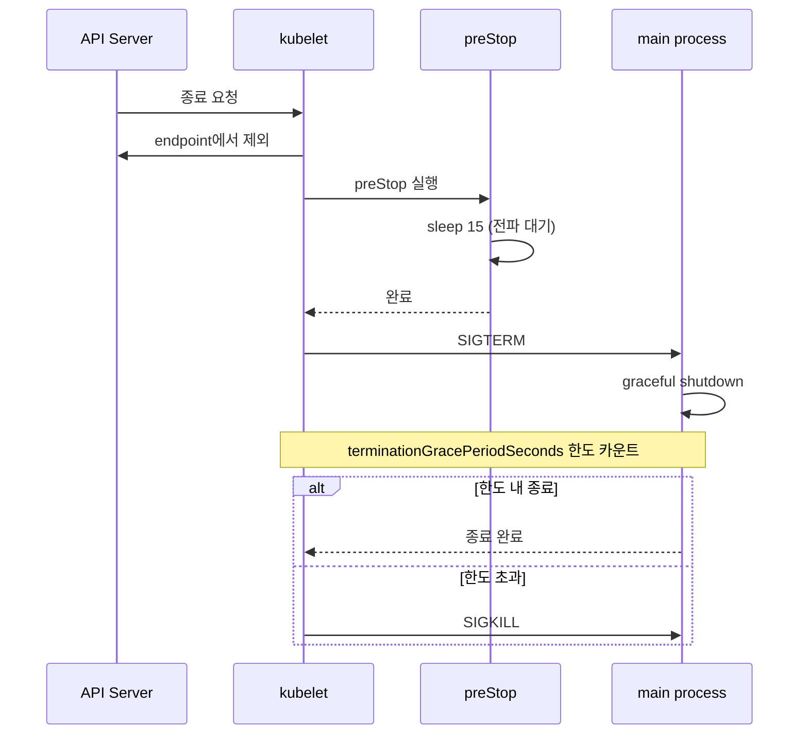

# 배치 워크로드

> Deployment가 "항상 N개의 Pod가 살아 있어야 한다"를 표현한다면, Job은 "한 번 끝까지 성공해라"를 표현합니다. CronJob은 그 Job을 시간표에 따라 반복하고, DaemonSet은 "노드마다 한 개"를 보장합니다. 컨테이너 라이프사이클(InitContainer·Sidecar·preStop)은 그 위에서 실행 순서와 종료 약속을 만듭니다.


## 학습 목표
> Stateless 서비스 외의 네 가지 워크로드 패턴을 한 번에 잡습니다.

이 장에서 확인할 목표는 다음과 같다:

1. Job의 `parallelism`·`completions`·`backoffLimit`·`ttlSecondsAfterFinished`가 각각 무엇을 제어하는지 설명할 수 있습니다.
2. CronJob의 `concurrencyPolicy`와 `startingDeadlineSeconds`가 다루는 시나리오를 구분할 수 있습니다.
3. DaemonSet이 Deployment와 다른 스케줄링·롤아웃 모델을 가짐을 이해합니다.
4. InitContainer의 직렬 실행 모델과 메인 컨테이너 시작 보장 흐름을 설명할 수 있습니다.
5. K8s 1.29+ 네이티브 Sidecar(`restartPolicy: Always`인 InitContainer)의 의미를 설명할 수 있습니다.
6. preStop 훅과 `terminationGracePeriodSeconds`가 어떻게 우아한 종료를 만드는지 정리할 수 있습니다.


## 1. 배치 워크로드란
> 항상 살아 있어야 하는 서비스와 끝까지 성공해야 하는 작업을 분리해서 봅니다.

Deployment의 의도는 "정상 상태(N개 replica)를 유지"다. 실패해도 ReplicaSet이 다시 만들고, 종료는 사용자가 명시적으로 요청하지 않는 한 일어나지 않습니다.

배치 워크로드의 의도는 다릅니다. Job은 "한 번의 작업이 성공할 때까지 시도하고, 성공하면 끝"입니다. CronJob은 그 Job을 시간표에 따라 반복합니다. DaemonSet은 모양은 Deployment와 비슷하지만 "각 노드마다 정확히 한 개"라는 토폴로지 제약을 가집니다. InitContainer·Sidecar는 Pod 안의 다른 컨테이너와 실행 순서·동시 실행 약속을 만듭니다.

이들은 운영 관점에서 다음 질문에 답해야 합니다. 끝나야 끝나는 작업을 어떻게 표현하나? 같은 시간에 두 번 도는 일을 어떻게 막나? 노드가 추가됐을 때 자동으로 새 Pod가 거기에도 떠야 하는 워크로드는? 메인 컨테이너 시작 전에 반드시 마쳐야 하는 초기화는?


## 2. Job — 한 번 성공해라
> 일회성 작업의 성공·실패·재시도를 제어하는 핵심 필드를 정리합니다.

### 2.1 기본 형태

```yaml
apiVersion: batch/v1
kind: Job
metadata:
  name: db-migration
spec:
  template:
    spec:
      restartPolicy: OnFailure
      containers:
      - name: migrator
        image: my-migrator:1.4.0
        command: ["./migrate.sh"]
  backoffLimit: 3
  ttlSecondsAfterFinished: 3600
```

`restartPolicy`는 `OnFailure` 또는 `Never`만 허용됩니다. 실패 시 재시작 동작이 두 정책에서 다릅니다. `OnFailure`는 같은 Pod 안에서 컨테이너만 재시작합니다. `Never`는 Pod 자체를 새로 만듭니다. 새 Pod가 만들어지면 ephemeral 상태(스크래치 디렉터리, 메모리)는 초기화됩니다.

### 2.2 parallelism과 completions

| 필드 | 의미 |
|------|------|
| `parallelism` | 동시에 실행할 Pod 개수 |
| `completions` | 성공으로 인정할 Pod 개수의 누적 합 |
| `completionMode: Indexed` | 각 Pod에 인덱스(0..completions-1)를 부여 |

`parallelism: 4, completions: 100`은 "한 번에 4개씩 동시 실행하며 누적 100개 성공이면 종료"를 의미합니다. 작업을 N개의 독립 단위로 나눠 분산 처리할 때 씁니다. `completionMode: Indexed`를 켜면 각 Pod가 `JOB_COMPLETION_INDEX` 환경변수에 0..99 중 하나를 받아, 자기 인덱스에 해당하는 데이터 분할만 처리합니다.

### 2.3 실패 정책

`backoffLimit`은 Pod 재시도 횟수의 상한입니다. 기본 6회. 이 한도를 넘으면 Job은 `Failed`로 표시되고 더 이상 새 Pod를 만들지 않습니다. 응용 단의 비결정성(외부 API 일시 장애)이 자주 일어난다면 한도를 넉넉히 두지만, 비결정 실패가 무한히 반복되면 비용만 쌓이므로 적정 상한이 필요합니다.

`activeDeadlineSeconds`는 Job 시작부터의 절대 시간 상한입니다. 이 시간이 지나면 실행 중인 Pod도 강제 종료됩니다. 시간이 오래 걸릴수록 환경 상태가 변해 결과가 일관되지 않을 작업(예: 야간 배치)에 자주 답니다.

`ttlSecondsAfterFinished`는 끝난 Job 객체의 자동 정리입니다. 1시간 후 Job·Pod·이벤트가 삭제돼 etcd가 깨끗해집니다. 이 값을 두지 않으면 끝난 Job들이 누적돼 `kubectl get job`이 길어지고 etcd 객체 수가 늘어납니다.


## 3. CronJob — 시간표에 따라 Job을 만듭니다
> 주기 작업의 시간 제어와 동시성 제어를 정리합니다.

### 3.1 기본 형태

```yaml
apiVersion: batch/v1
kind: CronJob
metadata:
  name: daily-report
spec:
  schedule: "0 2 * * *"            # 매일 02:00 UTC
  timeZone: "Asia/Seoul"           # K8s 1.27+
  concurrencyPolicy: Forbid
  startingDeadlineSeconds: 600
  successfulJobsHistoryLimit: 3
  failedJobsHistoryLimit: 1
  jobTemplate:
    spec:
      template:
        spec:
          restartPolicy: OnFailure
          containers:
          - name: reporter
            image: my-reporter:1.0
```

CronJob은 매 schedule 시점에 새 Job 객체를 만들고, Job이 Pod를 만듭니다. 이 두 단계의 분리가 중요합니다. CronJob 자체는 Pod를 직접 만들지 않으며, 모든 Job 옵션(parallelism, completions, backoffLimit 등)은 `jobTemplate.spec`에 그대로 둡니다.

### 3.2 concurrencyPolicy

이전 실행이 끝나기 전 다음 트리거가 오면 어떻게 할지 정합니다.

| 정책 | 동작 |
|------|------|
| `Allow` | 새 Job을 그냥 시작 (기본) |
| `Forbid` | 이전 Job이 끝날 때까지 새 Job을 건너뜀 |
| `Replace` | 이전 Job을 취소하고 새 Job을 시작 |

`Forbid`는 "두 번 돌면 안 되는" 작업(예: 같은 데이터를 읽고 쓰는 ETL)에 자연스럽습니다. `Replace`는 "최신 결과만 의미 있는" 작업(예: 최신 통계 계산)에 씁니다. 명시 없으면 `Allow`가 기본이라 이중 실행이 일어날 수 있어 의도와 어긋나는 경우가 흔합니다.

### 3.3 startingDeadlineSeconds

K8s 컨트롤러가 일시 멈췄다가 재기동된 직후, 놓친 schedule을 어떻게 처리할지 정합니다. `startingDeadlineSeconds: 600`은 "예정 시각으로부터 10분 안에 시작할 수 있으면 시작, 그보다 늦으면 건너뜀"입니다. 이 값이 없거나 너무 크면 컨트롤러 재기동 후 같은 시점의 Job이 한꺼번에 여러 개 만들어질 수 있습니다.

`timeZone` 필드는 K8s 1.27부터 GA다. 그 이전에는 컨트롤러의 UTC 기준으로 schedule이 해석됐습니다. 한국 시간 02:00을 의도해 `0 2 * * *`로 적었는데 UTC 기준이면 한국 11:00이 됩니다. 운영 클러스터가 1.27 이전이면 schedule을 UTC로 환산해 적든가, 별도 sidecar 도구로 시간대 변환을 합니다.


## 4. DaemonSet — 노드마다 한 개
> 클러스터 기능을 모든 노드에 1:1로 배치하는 컨트롤러를 정리합니다.

### 4.1 무엇이 다른가

DaemonSet은 Deployment처럼 Pod를 만들지만, 스케줄러는 평소처럼 결정에 개입하지 않습니다. 대신 Pod에 `nodeAffinity`가 자동 주입돼 "각 노드에 한 개씩"이라는 규칙으로 배치됩니다. 노드가 추가되면 그 노드용 Pod가 자동 생성되고, 노드가 제거되면 Pod도 같이 사라집니다.

쓰임은 "클러스터 기능"이 핵심입니다. CNI 플러그인(Cilium, Calico), 로그 수집기(Fluentd, Promtail), 노드 메트릭 수집기(node-exporter), 보안 에이전트가 대표 사례입니다. 이들은 노드별로 자체 데몬이 동작해야 하므로 Deployment 모델과 맞지 않습니다.

### 4.2 nodeSelector·Toleration의 자동 처리

DaemonSet은 일반 Pod가 가지지 않는 토렐레이션을 자동 부여합니다.

- `node.kubernetes.io/not-ready:NoExecute`
- `node.kubernetes.io/unreachable:NoExecute`
- `node.kubernetes.io/disk-pressure:NoSchedule`
- `node.kubernetes.io/memory-pressure:NoSchedule`
- `node.kubernetes.io/pid-pressure:NoSchedule`
- `node.kubernetes.io/unschedulable:NoSchedule`

비정상 노드도 진단·복구를 위해 DaemonSet Pod는 거기 머물러야 하므로 자동 toleration이 들어갑니다. 운영자가 굳이 직접 추가할 필요는 없습니다.

특정 노드에만 동작해야 하는 DaemonSet은 `spec.template.spec.nodeSelector` 또는 `nodeAffinity`로 제한합니다. 예: GPU 노드 전용 모니터링 에이전트는 `accelerator: nvidia-a100` 라벨 노드에만 배포되도록 nodeAffinity를 답니다.

### 4.3 롤아웃 전략

DaemonSet의 `updateStrategy`는 두 가지입니다.

| 전략 | 동작 |
|------|------|
| `RollingUpdate` (기본) | `maxUnavailable`만큼씩 노드를 한 번에 업데이트 |
| `OnDelete` | Pod가 수동 삭제될 때만 새 버전 적용 |

`RollingUpdate`는 클러스터 단위 롤아웃에 적합하지만, 모든 노드의 Pod가 한 번에 흔들리면 영향이 클 수 있습니다. `maxUnavailable: 10%`처럼 비율로 두면 큰 클러스터에서 단계적으로 진행됩니다. `OnDelete`는 노드별 점검 시점에 맞춰 천천히 업데이트하고 싶을 때 쓰지만, 잘못 잊으면 노드별 버전이 어긋납니다.


## 5. InitContainer — 시작 전 보장
> 메인 컨테이너 시작 전 직렬로 실행되는 초기화 모델을 정리합니다.

### 5.1 직렬 실행 모델

InitContainer는 Pod 스펙의 `spec.initContainers`에 선언합니다. 메인 컨테이너 시작 전 정의한 순서대로 하나씩 실행되며, 모두 성공해야 메인 컨테이너가 시작됩니다. 하나라도 실패하면 Pod는 실패 상태로 끝나고, `restartPolicy`에 따라 Pod 자체가 재시작되거나 그대로 남습니다.

```yaml
spec:
  initContainers:
    - name: wait-for-db
      image: busybox:1.36
      command: ['sh', '-c', 'until nc -z db.svc 5432; do sleep 2; done']
    - name: migrate
      image: my-migrator:1.4.0
      command: ['./migrate.sh']
  containers:
    - name: app
      image: my-app:2.0
```

위 예시는 "DB가 listen할 때까지 기다림 → 마이그레이션 실행 → 앱 시작" 흐름을 보장합니다. `wait-for-db`가 무한 루프에 빠지면 메인은 영원히 시작 안 합니다. `activeDeadlineSeconds`나 InitContainer 자체의 timeout 명령으로 상한을 둬야 합니다.

### 5.2 InitContainer가 적합한 경우

세 가지가 자주 쓰입니다.

1. **외부 의존성 대기**. DB·메시지 큐·시크릿 매니저가 준비됐는지 확인. 메인 컨테이너 안에 같은 로직을 넣으면 readiness가 늦어지고, 재시작이 잦아집니다.

2. **한 번만 실행할 초기화**. DB 마이그레이션, 설정 파일 생성, 인증서 가져오기. 메인 컨테이너 재시작 시에도 한 번만 실행되어야 하는 작업이 자연스럽습니다.

3. **메인과 다른 권한·이미지가 필요한 작업**. InitContainer는 자체 image와 securityContext를 가질 수 있습니다. 메인은 비-root로 실행하지만 초기화 단계는 root 권한이 필요한 경우 분리합니다.


## 6. Sidecar 컨테이너
> 1.29부터 네이티브로 인정된 사이드카 모델을 정리합니다.

### 6.1 옛 모델과 새 모델

전통적으로 Sidecar는 `spec.containers`에 메인과 함께 선언한 일반 컨테이너였습니다. 문제는 두 가지였습니다. Pod 시작 시 메인보다 사이드카가 늦게 준비되면 첫 요청을 놓치고, Pod 종료 시 메인이 먼저 끝나면 사이드카가 마지막 요청을 처리할 길이 없었습니다.

K8s 1.29부터 정식 GA된 네이티브 사이드카는 `spec.initContainers`에 `restartPolicy: Always`로 선언합니다.

```yaml
spec:
  initContainers:
    - name: log-shipper
      image: fluent-bit:2.2
      restartPolicy: Always   # K8s 1.29+ 네이티브 사이드카
      volumeMounts:
        - name: logs
          mountPath: /var/log/app
  containers:
    - name: app
      image: my-app:2.0
      volumeMounts:
        - name: logs
          mountPath: /var/log/app
```

스펙 위치는 InitContainer 영역이지만, `restartPolicy: Always` 때문에 동작은 다릅니다. 사이드카는 메인 컨테이너 시작 전에 시작되고(첫 요청 손실 방지), 메인이 종료된 뒤에도 잠깐 더 살아 있다가 정리됩니다(마지막 로그·트레이스 송신 보장).

### 6.2 어떤 워크로드에 적합한가

가장 흔한 세 가지가 거의 모든 사례를 덮습니다.

| 사이드카 종류 | 역할 | 예시 |
|---------------|------|------|
| 로그 수집기 | 메인의 로그를 외부 시스템으로 전송 | Fluent Bit, Promtail |
| 메트릭 수집기 | 메인의 내부 상태를 메트릭으로 노출 | jmx-exporter, redis-exporter |
| 프록시 | 메인의 트래픽을 가로채 mTLS·라우팅 | Envoy(Istio), Linkerd-proxy |

서비스 메시 사이드카는 별도 카테고리(`service-mesh`)에서 깊이 다룹니다. 본 카테고리에서는 일반 사이드카 모델만 고정합니다.


## 7. 컨테이너 라이프사이클
> 시작·종료에 끼우는 두 훅으로 우아한 종료를 만듭니다.

### 7.1 postStart와 preStop

```yaml
containers:
  - name: app
    image: my-app:2.0
    lifecycle:
      postStart:
        exec:
          command: ["sh", "-c", "register-service.sh"]
      preStop:
        exec:
          command: ["sh", "-c", "sleep 15 && nginx -s quit"]
    terminationGracePeriodSeconds: 30
```

`postStart`는 컨테이너 시작 직후 실행됩니다. 동기 실행이지만 **시작 완료 보장은 안 한다**. 컨테이너의 main process와 거의 동시에 시작되므로 race condition 가능성이 있습니다. 등록·캐시 워밍 같은 보조 작업에 쓰지만, "먼저 끝나야 한다"가 핵심이라면 InitContainer가 맞습니다.

`preStop`은 컨테이너 종료 직전 실행됩니다. 이 훅이 끝난 뒤 SIGTERM이 컨테이너의 main process로 전달됩니다. preStop에서 `sleep 15`를 두는 패턴은 Service의 endpoint 갱신이 클러스터 전체에 전파될 시간을 벌기 위함입니다. endpoint에서 빠지기 전 SIGTERM이 먼저 전달되면 그 사이의 요청은 502로 끝납니다.

### 7.2 terminationGracePeriodSeconds의 역할

`terminationGracePeriodSeconds`(기본 30초)는 preStop + SIGTERM 처리 + 강제 종료(SIGKILL)까지의 총 한도입니다. 이 한도가 끝나면 kubelet이 SIGKILL로 컨테이너를 강제 종료합니다.

JVM·Python처럼 종료 정리 시간이 긴 애플리케이션은 30초로 부족할 수 있습니다. 60~120초 정도로 늘리되, 너무 길게 두면 노드 drain 시 점검이 길어집니다. 균형은 워크로드별로 다릅니다.

종료 신호 흐름은 정리해 두면 디버깅이 쉽습니다.




## 8. 다음 단계
> Part 7 운영·관측·보안 묶음으로 이어 갑니다.

Ch09에서 스케줄링·중단·배치까지 정리하면, Pod의 "어디서·언제·어떻게 동작하는가"가 전부 채워집니다. 다음 묶음 [Ch10 모니터링과 트러블슈팅](05-08.%EB%AA%A8%EB%8B%88%ED%84%B0%EB%A7%81%EA%B3%BC%20%ED%8A%B8%EB%9F%AC%EB%B8%94%EC%8A%88%ED%8C%85.md)부터는 운영 중인 클러스터를 어떻게 관측하고, RBAC·자원·오토스케일링 같은 운영 정책을 어떻게 묶는지가 주제입니다.


## 관련 문서
> 점검 문서, 직전 분산·중단 장, 그리고 Stateless 워크로드 기본 장을 한 번에 모읍니다.

- [배치 워크로드 점검](05-07.%EB%B0%B0%EC%B9%98%20%EC%9B%8C%ED%81%AC%EB%A1%9C%EB%93%9C%20%EC%A0%90%EA%B2%80.md) — 본 장의 점검 편
- [토폴로지 분산과 중단 정책](05-06.%ED%86%A0%ED%8F%B4%EB%A1%9C%EC%A7%80%20%EB%B6%84%EC%82%B0%EA%B3%BC%20%EC%A4%91%EB%8B%A8%20%EC%A0%95%EC%B1%85.md) — 이전 장, Topology Spread/PDB
- [핵심 워크로드](../01_foundation/01-02.%ED%95%B5%EC%8B%AC%20%EC%9B%8C%ED%81%AC%EB%A1%9C%EB%93%9C.md) — Pod·Deployment·Service 기본
