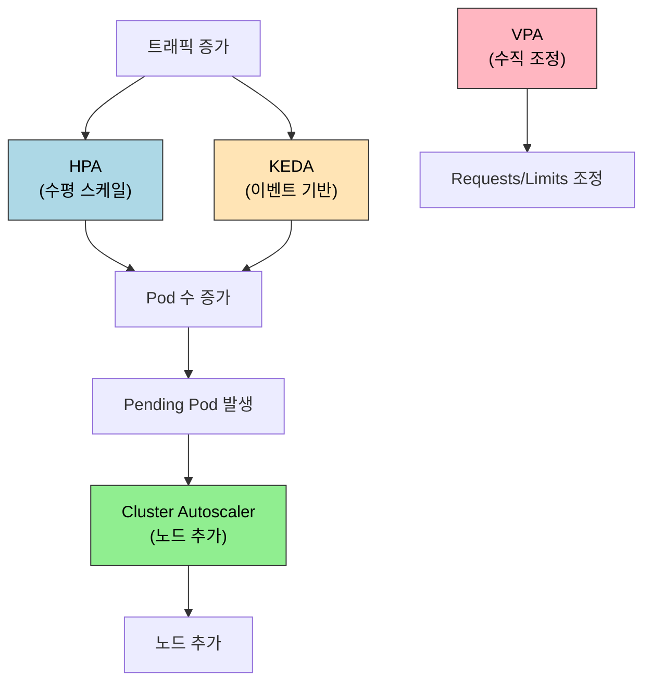

# 오토스케일링

> Kubernetes 오토스케일링은 세 축으로 동작한다. Pod를 수평으로 늘리는 HPA, Pod의 리소스를 수직으로 조정하는 VPA, 노드 자체를 추가하는 Cluster Autoscaler다. 세 가지가 어떻게 협력하고 어디서 충돌하는지 이해해야 한다.


## 학습 목표
> 스케일링 대상과 스케일링 신호를 분리해서 보는 장이다.

이 장에서 확인할 목표는 다음과 같다:

1. HPA의 메트릭 소스와 스케일 결정 공식을 설명할 수 있다.
2. VPA의 추천 모드와 자동 적용 모드의 차이를 구분할 수 있다.
3. KEDA가 HPA를 어떻게 확장하는지 이해할 수 있다.
4. Cluster Autoscaler가 노드를 추가·제거하는 조건을 설명할 수 있다.
5. HPA와 VPA를 동시에 사용할 때 충돌을 피하는 방법을 설명할 수 있다.
6. `Metrics Server`, Custom Metrics, External Metrics가 각각 언제 필요한지 설명할 수 있다.


## 1. Horizontal Pod Autoscaler (HPA)
> 가장 기본적인 워크로드 수평 확장이 어떤 신호로 동작하는지 설명한다.

### 1.1 스케일 결정 공식

HPA는 현재 메트릭 값과 목표 값의 비율로 필요한 replica 수를 계산한다.

```
원하는 replica = ceil(현재 replica × (현재 메트릭 / 목표 메트릭))
```

CPU 사용률이 목표 70%, 현재 사용률이 140%라면 현재 3개 replica는 `ceil(3 × 140/70) = 6`개로 늘어난다.

```yaml
apiVersion: autoscaling/v2
kind: HorizontalPodAutoscaler
metadata:
  name: my-app-hpa
spec:
  scaleTargetRef:
    apiVersion: apps/v1
    kind: Deployment
    name: my-app
  minReplicas: 2
  maxReplicas: 10
  metrics:
    - type: Resource
      resource:
        name: cpu
        target:
          type: Utilization
          averageUtilization: 70
```

HPA가 동작하려면 Pod에 Requests가 설정돼야 한다. CPU 사용률은 `현재 CPU 사용량 / CPU Requests`로 계산하므로 Requests가 없으면 분모가 없다.

공식 문서 기준으로 `autoscaling/v2` HPA는 `Resource`, `Pods`, `Object`, `External` 메트릭 타입을 지원한다. CPU·메모리처럼 기본 리소스 메트릭만 쓸 때는 보통 `Metrics Server`면 충분하지만, 요청 수나 큐 길이처럼 애플리케이션 지표로 스케일하려면 Custom Metrics 또는 External Metrics 경로가 필요하다.

### 1.2 behavior 필드로 스케일 속도 제어

기본 HPA는 빠르게 올라가고 느리게 내려온다. `behavior` 필드로 이 속도를 명시적으로 제어한다.

```yaml
spec:
  behavior:
    scaleUp:
      stabilizationWindowSeconds: 0      # 즉시 스케일 업
      policies:
        - type: Pods
          value: 4
          periodSeconds: 60              # 60초마다 최대 4개 추가
    scaleDown:
      stabilizationWindowSeconds: 300    # 5분간 안정화 후 스케일 다운
      policies:
        - type: Percent
          value: 10
          periodSeconds: 60             # 60초마다 최대 10% 감소
```

`stabilizationWindowSeconds`는 쿨다운 역할을 한다. 스케일 다운의 경우 5분 동안 최솟값을 기록하고, 그 값이 현재 replica보다 작을 때만 줄인다. 갑작스러운 메트릭 하락에 즉각 반응해 Pod를 줄였다가 다시 늘리는 진동을 방지한다.


## 2. Vertical Pod Autoscaler (VPA)
> 리소스 요청값 자체를 조정하는 방식의 장단점을 정리한다.

### 2.1 세 가지 모드

VPA는 Pod의 CPU와 메모리 Requests를 자동으로 조정한다. 세 가지 동작 모드가 있다.

`Off` 모드는 추천값만 계산하고 실제 적용은 하지 않는다. `kubectl describe vpa`로 추천값을 확인하고 수동으로 Deployment에 반영한다. 가장 안전한 시작점이다.

`Initial` 모드는 Pod 최초 생성 시에만 추천값을 적용한다. 실행 중인 Pod는 건드리지 않는다.

`Auto` 모드는 추천값이 현재 설정과 크게 다를 때 Pod를 재시작해 새 값을 적용한다. Pod 재시작이 허용되는 Stateless 워크로드에서만 사용한다.

### 2.2 HPA와의 충돌

CPU 메트릭을 기준으로 HPA와 VPA를 동시에 사용하면 충돌한다. VPA가 CPU Requests를 올리면 CPU 사용률(사용량/Requests)이 낮아지고, HPA가 이를 보고 replica를 줄이고, 그러면 다시 사용률이 올라가는 진동이 발생한다.

해결 방법은 메트릭을 분리하는 것이다. HPA는 CPU 기반, VPA는 메모리 기반으로 사용한다. 또는 HPA를 커스텀 메트릭(요청 수, 큐 깊이)으로 구성하고 VPA는 CPU/메모리를 관리한다. 실무에서는 VPA를 `Off` 모드로 두고 추천값을 주기적으로 반영하는 방식이 가장 많이 쓰인다.

또 하나의 최신 흐름은 In-Place Pod Resize다. Kubernetes는 재시작 없이 일부 리소스 조정을 지원하는 방향으로 발전하고 있지만, 운영 관점에서는 아직 "VPA가 알아서 안전하게 무중단 조정해 준다"고 단순화하면 안 된다. 현재도 많은 환경에서 재시작과 스케줄 재평가를 염두에 둔 설계가 필요하다.


## 3. KEDA: 이벤트 기반 오토스케일링
> 요청률이 아니라 외부 이벤트 양으로 스케일하는 경우를 다룬다.

### 3.1 HPA의 확장

HPA는 CPU와 메모리만 기본 메트릭 소스로 지원한다. 메시지 큐 깊이, Kafka 컨슈머 lag, HTTP 요청 수 같은 애플리케이션 수준 메트릭으로 스케일하려면 Custom Metrics API를 직접 구현해야 한다.

KEDA(Kubernetes Event-Driven Autoscaling)는 이 과정을 자동화한다. 50개 이상의 Scaler를 내장하며, Kafka, Redis, AWS SQS, Prometheus, HTTP 등을 바로 연결할 수 있다. KEDA는 내부적으로 HPA를 생성하고 External Metrics API를 통해 메트릭을 제공한다. 기존 HPA 인프라를 그대로 활용한다.

```yaml
apiVersion: keda.sh/v1alpha1
kind: ScaledObject
metadata:
  name: kafka-consumer-scaler
spec:
  scaleTargetRef:
    name: kafka-consumer
  minReplicaCount: 0    # 0으로 스케일 인 가능
  maxReplicaCount: 20
  triggers:
    - type: kafka
      metadata:
        bootstrapServers: redpanda:9092
        consumerGroup: my-group
        topic: orders
        lagThreshold: "100"   # 파티션당 lag이 100 초과 시 스케일 업
```

`minReplicaCount: 0`은 KEDA의 중요한 기능이다. 이벤트가 없을 때 Pod를 0개로 줄이고(Scale to Zero), 이벤트가 들어오면 자동으로 스케일 업한다. 일반 HPA는 minReplicas를 1 미만으로 설정할 수 없다.


## 4. Cluster Autoscaler
> Pod를 늘릴 공간이 부족할 때 노드 계층에서 어떤 일이 일어나는지 설명한다.

### 4.1 노드 추가 조건

Cluster Autoscaler는 Pod가 `Pending` 상태일 때 노드를 추가한다. 구체적으로 "스케줄 불가(Unschedulable)" 상태인 Pod가 있고, 새 노드를 추가하면 해당 Pod를 배치할 수 있을 때 노드 그룹을 확장한다. 단순히 노드 CPU가 높다고 추가하지 않는다. Pending Pod가 트리거다.

### 4.2 노드 제거 조건

노드 제거는 더 보수적이다. 노드의 모든 Pod가 다른 노드로 이동 가능하고, 노드 CPU/메모리 요청량이 일정 임계값 아래로 유지되는 시간이 충분히 길어야(기본 10분) 삭제된다. DaemonSet Pod와 로컬 스토리지를 사용하는 Pod는 이동 불가로 판단해 삭제를 막는다. `cluster-autoscaler.kubernetes.io/safe-to-evict: "false"` 어노테이션으로 특정 Pod를 삭제 대상에서 제외할 수 있다.


## 5. 스케일링 아키텍처 요약
> 여러 스케일링 도구를 한 그림으로 묶어 판단 기준을 정리한다.




## 6. 다음 단계
> 자동 확장이 끝까지 통하지 않을 때 어떤 실패가 남는지 사례 장으로 이어 간다.

오토스케일링은 트래픽과 메트릭이 정상 분포일 때 잘 동작한다. 그러나 단일 Pod 안에서 메모리 모델이 어긋나면 HPA로 Pod를 더 많이 띄워도 같은 OOMKill이 반복된다. 다음 장 [OOMKilled 사례 분석](05-12.OOMKilled%20%EC%82%AC%EB%A1%80%20%EB%B6%84%EC%84%9D.md)은 이 단원에서 다룬 Requests·Limits 신호가 실제 cgroup 메모리와 어긋난 한 사례를 따라가며, 자원 관리 장과 오토스케일링 장을 운영 관점에서 닫는다.


## 관련 문서
> 자원 관리 장과 OOMKilled 사례 장을 연결해 운영 흐름을 완성한다.

- [오토스케일링 점검](05-11.%EC%98%A4%ED%86%A0%EC%8A%A4%EC%BC%80%EC%9D%BC%EB%A7%81%20%EC%A0%90%EA%B2%80.md) — 본 장의 점검 편
- [자원 관리](05-10.%EC%9E%90%EC%9B%90%20%EA%B4%80%EB%A6%AC.md) — 이전 장, Requests/Limits와 QoS
- [OOMKilled 사례 분석](05-12.OOMKilled%20%EC%82%AC%EB%A1%80%20%EB%B6%84%EC%84%9D.md) — 다음 장, JVM heap과 cgroup의 어긋남
