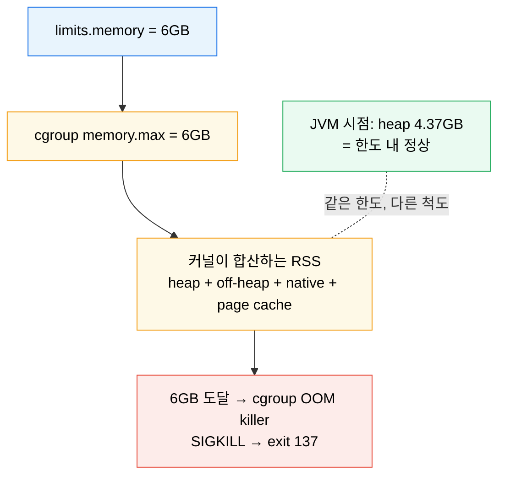
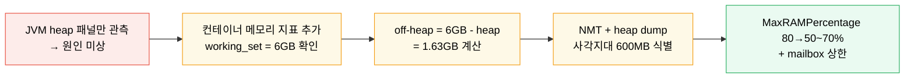

# OOMKilled 사례 분석 — Endowus Rebalance 서비스
---
> Pod 에 6GB 를 줬는데도 OOMKilled 가 반복됐다면, JVM 이 보는 메모리와 cgroup 이 보는 메모리가 어긋나 있을 가능성이 높습니다. Endowus 사례는 그 어긋남이 어디에서 600MB 까지 벌어지는지 추적한 기록입니다.


## 학습 목표
> 사례를 따라가며 "내가 보는 메모리" 와 "커널이 보는 메모리" 의 격차를 진단할 수 있게 만듭니다.

이 장을 끝내면 다음에 답할 수 있습니다.

1. cgroup 이 측정하는 컨테이너 메모리와 JVM heap 지표의 차이를 설명할 수 있습니다.
2. NMT(Native Memory Tracking)와 heap dump 를 조합해 모니터링 사각지대를 좁히는 흐름을 재현할 수 있습니다.
3. JVM `MaxRAMPercentage` 를 80% 에서 50~70% 로 낮춘 결정의 근거를 수치로 설명할 수 있습니다.

## 사전 지식
> 이 장은 다음을 안다고 가정합니다.

1. JVM heap 과 off-heap(Metaspace·DirectBuffer 등)의 구분을 압니다.
2. 컨테이너 `limits.memory` 가 cgroup `memory.max` 로 내려간다는 점을 압니다([10-03](05-10.%EC%9E%90%EC%9B%90%20%EA%B4%80%EB%A6%AC.md)).
3. `kubectl describe pod` 에서 종료 코드를 읽을 수 있습니다.


## 1. 문제: 6GB pod의 반복 OOMKilled

Endowus 는 자산 관리 플랫폼을 운영하며, 그 안에서 포트폴리오 리밸런싱을 담당하는 마이크로서비스 `Rebalance` 가 있습니다. 이 서비스의 Pod 에는 메모리 한도 6GB 가 할당돼 있었음에도 OOMKilled 로 반복 재시작됐습니다. 일반적인 직관은 "한도를 충분히 줬는데 왜 죽지?" 였고, 실제로 Java 애플리케이션 입장에서는 자기 자신이 한도를 넘긴 적이 없다고 보고했습니다.

이 어긋남이 사례의 출발점입니다. Kubernetes 의 `limits.memory` 는 컨테이너의 cgroup `memory.max` 로 그대로 내려가고, cgroup 은 JVM heap 만이 아니라 그 컨테이너에서 발생한 모든 물리 메모리(RSS, page cache 일부 포함)를 합산합니다. 즉 "Java 가 본 메모리" 와 "kernel 이 본 메모리" 가 다른 척도로 같은 한도를 두고 다투는 구조입니다.




## 2. 1차 진단: JVM heap만 보면 멀쩡하다

대시보드에서 Grafana JVM 패널을 먼저 봤을 때, OOMKilled 직전 heap 사용량은 4.37GB 였습니다. 이는 컨테이너 한도 6GB 의 약 73% 수준입니다. JVM 옵션은 `MaxRAMPercentage=80` 으로 설정돼 있어 Java 가 사용할 수 있는 최대 heap 은 4.8GB 였습니다. 따라서 heap 이 4.37GB 까지 올랐어도 Java 입장에서는 GC 가 동작할 여지가 있는 정상 구간이었습니다.

문제는 같은 시점에 cgroup `memory.current`(또는 Prometheus 의 `container_memory_working_set_bytes`)는 6GB 에 닿았다는 점입니다. JVM heap 만 보던 운영자는 "왜 OOM 이 나는지" 알 수 없었고, 죽기 직전에 heap 이 0 으로 떨어지는 그래프(=프로세스 종료의 흔적)만 반복해서 보고 있었습니다.

> 교훈: JVM 패널이 정상이라는 사실은 "컨테이너 메모리도 정상" 을 의미하지 않습니다. 두 지표는 다른 척도입니다.


## 3. 차이의 정체: off-heap 1.63GB

전체 컨테이너 메모리(6GB) – JVM heap(4.37GB) = 1.63GB. 이 1.63GB 가 off-heap, 즉 JVM heap 바깥에서 사용되는 메모리입니다. off-heap 은 다음 같은 영역의 합입니다.

- 메타스페이스(클래스 메타데이터)
- 코드 캐시(JIT 컴파일 결과)
- DirectByteBuffer/Unsafe.allocate 같은 native 버퍼
- JNI 호출이 사용하는 native 영역
- 스레드 스택
- GC 작업 메모리

Endowus 팀은 모니터링 도구로 관측 가능한 off-heap 을 합산했지만 약 1GB 까지만 설명됐습니다. 나머지 600MB 는 어떤 일반 도구로도 직접 보이지 않았습니다. 이 600MB 가 사각지대였습니다.


## 4. NMT와 heap dump로 사각지대 좁히기

JDK 는 native 메모리를 추적하는 도구로 NMT(Native Memory Tracking)를 제공합니다. JVM 시작 옵션에 `-XX:NativeMemoryTracking=summary`(또는 `detail`)를 넣으면 `jcmd <pid> VM.native_memory summary` 로 카테고리별 사용량을 덤프할 수 있습니다.

NMT 결과와 heap dump 를 교차 비교한 결과, 사라진 600MB 의 정체는 세 곳에서 나왔습니다.

1. **JImage — 153MB**
   JImage 는 JDK 9 이후 모듈화된 런타임 이미지(`lib/modules`)를 메모리에 매핑해 두는 영역입니다. JVM 이 부팅 시 클래스를 빠르게 찾기 위해 사용하며, 일반 모니터링(JMX, Micrometer)에서는 별도 카테고리로 잡히지 않습니다. NMT 에서만 `Internal` 또는 `Other` 로 표면화됩니다.

2. **Akka mailbox 버퍼**
   Rebalance 는 actor 기반 처리를 위해 Akka 를 쓰고 있었고, mailbox 크기가 보수적이지 않게 설정돼 있었습니다. 부하 패턴에 따라 메시지가 처리 속도보다 빠르게 적재되면서 mailbox 버퍼가 커지고, 이게 off-heap 에 쌓였습니다.

3. **Netty 네트워크 버퍼 — 256MB**
   Cassandra 드라이버가 내부적으로 Netty 를 사용하고, Netty 는 기동 시점에 CPU 코어 수에 비례해 direct buffer 풀을 사전 할당합니다. 멀티 코어 노드에서는 이 사전 할당량이 수백 MB 수준으로 늘어납니다. 이 영역은 `DirectByteBuffer` 로 잡히지만, Java heap 에는 포함되지 않습니다.

세 항목을 더하면 사각지대 600MB 가 거의 정확하게 메워집니다.


## 5. 합산: 왜 정확히 6GB에서 죽는가

```
JVM heap          4.37 GB
관측 가능 off-heap ~1.0  GB   (Metaspace, Code Cache, 일부 DirectBuffer 등)
사각지대 off-heap ~0.6  GB   (JImage 153MB + Akka mailbox + Netty 256MB)
─────────────────────────
총합              ~5.97 GB ≈ 컨테이너 한도 6GB
```

cgroup `memory.max` = 6GB 에 도달하면 커널은 먼저 page cache 회수를 시도하고, 회수가 충분치 않으면 cgroup OOM killer 가 SIGKILL 을 보냅니다. 이 동작은 `memory.events` 의 `oom_kill` 카운터로 확인할 수 있고, `kubectl describe pod` 에서는 종료 코드 137(=128+9)로 드러납니다(자세한 메커니즘은 [`../../02_os/kernel/01-04.cgroup 파일시스템 실습.md`](../../../02_os/kernel/01-04.cgroup%20%ED%8C%8C%EC%9D%BC%EC%8B%9C%EC%8A%A4%ED%85%9C%20%EC%8B%A4%EC%8A%B5.md) §7 참고).


## 6. 처방: heap 비율을 낮추고 mailbox를 줄였다

Endowus 팀이 적용한 조치는 단순합니다.

- JVM `MaxRAMPercentage` 를 80% 에서 50~70% 로 낮췄습니다. 6GB 컨테이너 기준으로 max heap 은 3.0~4.2GB 가 됩니다. 줄어든 heap 만큼 off-heap 이 쓸 여유가 늘어납니다.
- Akka mailbox 크기를 부하 특성에 맞게 보수적으로 줄였습니다. 처리 속도와 적재 속도의 격차가 끝없이 벌어지지 않도록 상한을 도입했습니다.
- Netty 와 JImage 는 코드 변경 없이 heap 비율 조정만으로 흡수했습니다. 이 둘은 컨테이너 안에서 본질적으로 필요한 메모리이므로 줄이는 게 아니라 "공간을 비워 두는" 방향으로 풀었습니다.

postmortem 에는 "OOM killed at least for now" 라는 문장이 적혀 있습니다. 영구 해결이 아니라 현재 부하 패턴에서 OOM 이 멈췄다는 뜻이고, 이 표현 자체가 운영 태도입니다. off-heap 은 라이브러리 업그레이드, CPU 코어 수 변화, 트래픽 패턴에 따라 다시 늘어날 수 있어 지속적으로 관찰해야 합니다.




## 7. 일반화 가능한 교훈

이 사례에서 일반화할 수 있는 운영 원칙은 세 가지입니다.

**첫째, 애플리케이션 시점 메모리와 컨테이너 시점 메모리는 다른 측정값입니다.**
JVM heap 그래프가 정상이라는 사실은 컨테이너 메모리가 정상임을 보장하지 않습니다. 운영 대시보드에는 항상 두 지표를 나란히 둬야 합니다.

| 시점 | 측정 대상 | 출처 |
|------|----------|------|
| Java | heap, metaspace, code cache | JMX, Micrometer, Prometheus JVM exporter |
| Kernel/cgroup | RSS 전체(heap + off-heap + native) | `memory.current`, `container_memory_working_set_bytes` |

**둘째, off-heap 은 "보이는 부분" 과 "보이지 않는 부분" 으로 나뉩니다.**
Metaspace, Code Cache, DirectByteBuffer 는 일반 모니터링에서도 잡히지만, JImage·내부 라이브러리 풀·JNI 영역 등은 NMT 없이는 표면화되지 않습니다. NMT 는 운영용으로 항상 켜둘 만한 비용입니다(부하 영향 5~10% 수준).

**셋째, MaxRAMPercentage 80% 는 컨테이너 환경에서 공격적입니다.**
JVM 기본 휴리스틱은 호스트 OS 를 가정해 만들어졌습니다. 컨테이너에서는 off-heap 을 위한 헤드룸이 더 필요하므로 50~70% 가 더 안전한 출발점입니다. 정확한 값은 NMT 로 측정한 off-heap 실측에 의존합니다.


## 8. 면접 대비 요약

### 한 줄 정의

컨테이너 OOMKilled 는 JVM heap 이 아니라 cgroup 이 합산하는 전체 메모리(heap + off-heap + native)가 `memory.max` 에 닿을 때 발생하므로, heap 패널만 보면 원인을 놓칩니다.

### 핵심 포인트 3가지

1. JVM heap 지표와 컨테이너 working_set 지표는 다른 척도라 둘을 나란히 봐야 합니다.
2. 보이지 않는 off-heap(JImage·Netty 풀·라이브러리 버퍼)은 NMT 로만 드러납니다.
3. 컨테이너에서는 `MaxRAMPercentage` 50~70% 로 off-heap 헤드룸을 비워 둡니다.

### 자주 묻는 질문

- **Q. heap 이 한도 아래인데 왜 OOMKilled 됩니까?** cgroup 은 heap 외 off-heap·native 까지 합산하기 때문입니다.
- **Q. 종료 코드 137 의 의미는?** 128+9, 즉 SIGKILL(9)로 OOM killer 가 종료시킨 흔적입니다.
- **Q. 사라진 off-heap 을 어떻게 찾습니까?** `-XX:NativeMemoryTracking` + `jcmd VM.native_memory` 로 카테고리별 추적합니다.


## 다음에 읽기

- [`./10-03.자원 관리.md`](05-10.%EC%9E%90%EC%9B%90%20%EA%B4%80%EB%A6%AC.md) — requests/limits 와 QoS 클래스의 이론
- [`./10-04.오토스케일링.md`](05-11.%EC%98%A4%ED%86%A0%EC%8A%A4%EC%BC%80%EC%9D%BC%EB%A7%81.md) — HPA 가 Requests 를 분모로 어떻게 쓰는가
- [`../../02_os/kernel/01-02.cgroup v2 깊이.md`](../../../02_os/kernel/01-02.cgroup%20v2%20%EA%B9%8A%EC%9D%B4.md) — cgroup v2 인터페이스 파일 전반
- [`../../02_os/kernel/01-04.cgroup 파일시스템 실습.md`](../../../02_os/kernel/01-04.cgroup%20%ED%8C%8C%EC%9D%BC%EC%8B%9C%EC%8A%A4%ED%85%9C%20%EC%8B%A4%EC%8A%B5.md) — `/sys/fs/cgroup` 을 직접 들여다보며 본 사례를 재현하는 실습
- [`../../02_os/kernel/01-06.cgroup 사례 — Endowus OOMKilled.md`](../../../02_os/kernel/01-06.cgroup%20%EC%82%AC%EB%A1%80%20%E2%80%94%20Endowus%20OOMKilled.md) — 같은 Endowus 사례를 커널 메커니즘(RSS 합산·페이지 단위 reclaim·exit 137·언어별 사각지대) 관점으로 풀이. K8s 10-05 가 운영 대시보드와 처방 중심이라면 이쪽은 NMT/힙덤프/memory.stat 추적 도구와 cgroup 페이지 단위 OOMKilled 발동 흐름 중심
