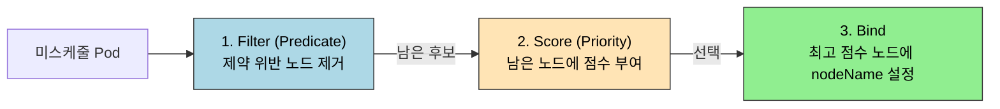

# 스케줄링과 노드 선택

> Pod를 만드는 것과 Pod가 어디서 동작할지 정하는 것은 다른 문제다. kube-scheduler는 모든 Pod에 대해 "어느 노드에 둘 것인가"를 두 단계(Filter → Score)로 결정하고, 그 결정을 운영자가 nodeSelector·Affinity·Taint/Toleration으로 좁혀 준다. 무엇을 어디에 둘 것인가가 가용성·비용·격리의 출발점이다.


## 학습 목표
> 스케줄러의 결정 흐름과 운영자가 그 결정에 개입하는 네 가지 도구를 정리한다.

이 장에서 확인할 목표는 다음과 같다:

1. kube-scheduler의 Filter·Score 두 단계가 각각 무엇을 평가하는지 설명할 수 있다.
2. nodeSelector와 nodeAffinity의 표현력 차이를 비교할 수 있다.
3. requiredDuringSchedulingIgnoredDuringExecution과 preferred 변형의 의미를 구분할 수 있다.
4. podAffinity·podAntiAffinity의 `topologyKey`가 왜 필수인지 설명할 수 있다.
5. Taint·Toleration이 nodeAffinity와 어떻게 보완 관계를 이루는지 설명할 수 있다.
6. dedicated 노드, GPU 노드, zone 분산 같은 실무 시나리오에서 어떤 도구를 쓰는지 판단할 수 있다.


## 1. 왜 스케줄러를 알아야 하는가
> Pod 생성과 노드 배치가 분리된 이유, 그리고 운영자가 개입해야 하는 이유를 정리한다.

`kubectl apply -f deployment.yaml`을 하면 Pod가 만들어지지만, "어느 노드에서 실행될지"는 그 명령에 들어 있지 않다. API 서버는 spec에 `nodeName`이 비어 있는 Pod를 etcd에 저장만 하고, 실제 노드 결정은 비동기로 동작하는 kube-scheduler 컴포넌트가 맡는다. 즉 Pod 생성과 배치는 두 단계로 분리돼 있고, 그 사이에 운영자가 정책을 끼워 넣을 자리가 있다.

운영자가 스케줄러의 기본 결정을 그대로 받아들이지 않는 이유는 세 가지로 모인다.

1. **하드웨어 제약**이다. GPU가 있는 노드에만 추론 워크로드를 두고, ARM 노드에는 ARM 빌드 이미지만 두어야 한다.
2. **격리 요구**다. 보안·과금 경계 때문에 특정 팀의 Pod는 그 팀 전용 노드에서만 동작해야 한다.
3. **가용성 요구**다. 한 zone이 죽어도 서비스를 지키려면 같은 Deployment의 Pod들이 두 zone 이상에 분산돼야 한다.

이 세 가지를 표현하는 도구가 nodeSelector·Affinity·Taint/Toleration·Topology Spread다.


## 2. kube-scheduler 흐름
> 결정이 어떤 두 단계를 거치는지 한 번에 잡는다.

kube-scheduler는 모든 미스케줄 Pod에 대해 다음 절차를 반복한다.



Filter 단계는 **하드 제약**을 평가한다. 노드 자원(CPU/메모리 Allocatable)이 Pod의 Requests를 수용할 수 있는가, nodeSelector·nodeAffinity의 required 조건을 만족하는가, Taint를 toleration으로 받아들일 수 있는가 등이 여기서 걸러진다. Filter를 통과한 노드가 한 곳도 없으면 Pod는 `Pending` 상태에서 `0/N nodes are available` 이벤트를 남긴다.

Score 단계는 **선호**를 평가한다. 잔여 자원이 많은 노드, 이미 같은 이미지가 캐시된 노드, preferredDuringScheduling을 만족하는 노드에 더 높은 점수를 준다. 점수가 가장 높은 노드 하나에 Bind하고, 그 결과로 Pod 객체에 `spec.nodeName`이 채워진다.

공식 문서 기준으로 `KubeSchedulerConfiguration`을 직접 작성하면 Filter·Score 플러그인 목록과 가중치를 조정할 수 있다. 다만 대부분의 운영 환경에서는 기본 프로필을 그대로 쓰고, 정책은 nodeSelector·Affinity·Taint 같은 워크로드 측 도구로 표현하는 편이 변경 폭이 작다.


## 3. nodeSelector
> 가장 단순한 노드 매칭 도구의 한계까지 정리한다.

nodeSelector는 Pod 스펙에 key-value 한 쌍을 적고, **모든 키가 일치하는 라벨을 가진 노드**에서만 실행하도록 강제한다.

```yaml
apiVersion: v1
kind: Pod
metadata:
  name: gpu-pod
spec:
  nodeSelector:
    accelerator: nvidia-a100
    workload-type: ml
  containers:
  - name: trainer
    image: pytorch/pytorch:latest
```

위 Pod는 `accelerator=nvidia-a100`과 `workload-type=ml` 라벨을 동시에 가진 노드에서만 동작한다. 라벨은 노드 운영자가 `kubectl label node <node> accelerator=nvidia-a100`처럼 부여한다.

nodeSelector의 한계는 표현력이다. `OR` 조건, "있으면 좋고 없어도 되는" 약한 선호, `NotIn` 같은 부정 매칭이 불가능하다. "GPU가 nvidia-a100이거나 nvidia-h100이면 모두 OK"라는 조건도 단일 nodeSelector로는 표현할 수 없다. 이 한계가 nodeAffinity가 필요한 이유다.


## 4. nodeAffinity
> required와 preferred 두 축으로 노드 매칭을 표현한다.

### 4.1 두 종류의 강도

nodeAffinity는 두 가지 강도를 제공한다.

| 종류 | 의미 | 위반 시 |
|------|------|--------|
| `requiredDuringSchedulingIgnoredDuringExecution` | 스케줄링 시 반드시 만족해야 함 | 만족 노드 없으면 Pending |
| `preferredDuringSchedulingIgnoredDuringExecution` | 가능하면 만족시키고, 없으면 다른 노드에서 실행 | 점수에만 영향, 배치 자체는 가능 |

이름의 `IgnoredDuringExecution`은 "스케줄링 후에는 라벨이 바뀌어도 Pod를 옮기지 않는다"는 뜻이다. K8s는 Pod 이동이 아니라 새 Pod 생성·기존 Pod 종료의 흐름으로 동작하기 때문이다.

### 4.2 표현 예시

```yaml
spec:
  affinity:
    nodeAffinity:
      requiredDuringSchedulingIgnoredDuringExecution:
        nodeSelectorTerms:
          - matchExpressions:
              - key: accelerator
                operator: In
                values: ["nvidia-a100", "nvidia-h100"]
      preferredDuringSchedulingIgnoredDuringExecution:
        - weight: 50
          preference:
            matchExpressions:
              - key: topology.kubernetes.io/zone
                operator: In
                values: ["asia-northeast3-a"]
```

required 블록은 "GPU가 a100 또는 h100"이라는 OR 조건을 표현한다. preferred 블록은 zone-a를 50점 가중치로 선호하지만, 다른 zone에서도 실행을 허용한다. 운영 관점에서는 required는 "절대 위반하면 안 되는 제약", preferred는 "유지되면 좋은 정렬"이라는 분리로 외워 두는 편이 안전하다.

`operator`는 `In`, `NotIn`, `Exists`, `DoesNotExist`, `Gt`, `Lt`를 지원한다. nodeSelector의 단순 등호와 비교하면 표현력이 본격적으로 늘어난다.


## 5. podAffinity와 podAntiAffinity
> 다른 Pod의 위치를 기준으로 배치를 정하는 두 도구를 다룬다.

### 5.1 무엇이 다른가

podAffinity는 "이 Pod와 같은 토폴로지에 있는 Pod 옆에 두고 싶다"고 말한다. 캐시 Pod를 같은 노드의 애플리케이션 Pod 옆에 두어 네트워크 홉을 줄이는 식이다. podAntiAffinity는 그 반대로 "같은 토폴로지 안에 두지 마라"고 말한다. 같은 Deployment의 Pod 3개를 서로 다른 노드에 분산시키는 가장 흔한 사례가 podAntiAffinity다.

### 5.2 topologyKey의 의미

```yaml
spec:
  affinity:
    podAntiAffinity:
      preferredDuringSchedulingIgnoredDuringExecution:
        - weight: 100
          podAffinityTerm:
            labelSelector:
              matchLabels:
                app: my-app
            topologyKey: kubernetes.io/hostname
```

`topologyKey`는 "어느 라벨 값이 같으면 같은 토폴로지로 본다"의 기준이다. `kubernetes.io/hostname`이면 노드 단위, `topology.kubernetes.io/zone`이면 zone 단위, `topology.kubernetes.io/region`이면 리전 단위다. 위 예시는 "같은 노드(hostname이 같은 노드)에 같은 app=my-app Pod가 있으면 가산점을 깎는다"는 뜻으로, Pod를 가능한 한 다른 노드에 분산시킨다.

`topologyKey`를 빼먹으면 Pod가 어디에 있을 때 충돌로 볼 것인지가 정의되지 않아 스케줄러가 거부한다. podAffinity는 표현력이 강한 만큼 Filter 단계에서 모든 후보 노드와 모든 기존 Pod를 비교해야 해서, 큰 클러스터에서는 비용이 크다. 100노드 이상이라면 required 변형은 신중히 쓰고, 분산은 다음 장의 Topology Spread Constraints로 옮기는 것이 현실적이다.


## 6. Taints와 Tolerations
> 노드가 Pod를 거부하는 메커니즘과, Pod가 그 거부를 받아들이는 방법을 정리한다.

### 6.1 방향이 반대인 도구

nodeSelector·nodeAffinity는 **Pod가 노드를 고른다**. Taint·Toleration은 반대 방향이다. **노드가 Pod를 거부**하고, Pod가 명시적으로 toleration을 가질 때만 허용한다.

```bash
# 노드에 taint 부여 — 일반 Pod는 이 노드를 피한다
kubectl taint node gpu-1 dedicated=ml-team:NoSchedule
```

위 명령은 `gpu-1` 노드에 `dedicated=ml-team:NoSchedule` taint를 단다. 이제 다음 toleration 없이는 어떤 Pod도 이 노드에 배치되지 못한다.

```yaml
spec:
  tolerations:
    - key: dedicated
      operator: Equal
      value: ml-team
      effect: NoSchedule
```

### 6.2 effect 세 종류

| effect | 의미 |
|--------|------|
| NoSchedule | toleration 없는 새 Pod는 스케줄 불가, 기존 Pod는 유지 |
| PreferNoSchedule | toleration 없는 Pod도 가능하면 피하지만 강제 아님 |
| NoExecute | toleration 없는 새 Pod는 스케줄 불가 + 기존 Pod도 즉시 퇴거 |

`NoExecute`는 운영 영향이 가장 크다. 노드를 점검 모드로 옮길 때 `NoExecute`를 추가하면 그 위에서 동작하던 Pod가 즉시 퇴거되며, 다른 노드에서 다시 만들어진다. toleration이 있는 Pod에 `tolerationSeconds: 300`을 설정하면 5분 유예 후 퇴거되도록 조정할 수 있다.

### 6.3 nodeAffinity와 짝이 되는 시나리오

GPU 노드를 ML 팀 전용으로 두는 시나리오는 두 도구를 함께 써야 깔끔하다.

- 노드 측: `dedicated=ml-team:NoSchedule` taint를 부여해 일반 Pod의 침입을 막는다.
- ML Pod 측: 위 taint에 대한 toleration을 가진다. 그러나 toleration만 있다고 ML Pod가 GPU 노드에만 가는 것은 아니다. 다른 일반 노드에도 갈 수 있다.
- ML Pod 측: 추가로 `nodeAffinity`로 `accelerator=nvidia-a100`을 required 조건으로 걸어 일반 노드를 후보에서 뺀다.

즉 Taint/Toleration은 "노드를 일반 Pod로부터 보호"하고, nodeAffinity는 "Pod를 특정 노드 부류로 끌어당긴다". 두 도구는 보완 관계다. 한쪽만 쓰면 격리가 새거나 끌어당김이 부족하다.


## 7. 실무 패턴
> 자주 묶어 쓰는 세 가지 시나리오를 모아 둔다.

### 7.1 Zone 분산으로 가용성 확보

같은 Deployment의 Pod 3개를 가능한 한 서로 다른 zone에 두려면 podAntiAffinity의 preferred 형식을 zone 토폴로지로 둔다. 단, 분산이 정확하지 않을 수 있다. 강한 분산이 필요하면 다음 장의 Topology Spread Constraints가 더 적합하다.

### 7.2 GPU 노드 격리

위 §6.3 시나리오를 그대로 쓴다. taint로 일반 Pod를 차단하고, ML Pod에 toleration + nodeAffinity를 함께 둔다.

### 7.3 점검 모드(Cordon·Drain)

`kubectl cordon <node>`는 노드에 `node.kubernetes.io/unschedulable:NoSchedule` taint와 비슷한 효과를 만들어 새 Pod 배치를 막는다. `kubectl drain <node>`는 cordon에 더해 기존 Pod를 다른 노드로 옮긴다. drain 시 PodDisruptionBudget이 충족되지 않으면 차단되는데, 이 안전 가드는 다음 장에서 다룬다.

`tolerationSeconds`로 점검 시 Pod 이전을 천천히 진행시키는 패턴, `taintBasedEvictions`로 노드 비정상 시그널(NotReady, Unreachable)에 따라 자동 퇴거되도록 두는 패턴은 K8s가 기본으로 켜 둔 정책이다. 이 정책 자체는 컨트롤러가 자동으로 관리하지만, 운영자가 직접 toleration을 추가해 "비정상 노드에서도 일정 시간 버티는" 시스템 Pod를 만들 수 있다.


## 8. 다음 단계
> 어디에 둘지 정한 다음에 풀어야 할 분산·중단 정책으로 이어 간다.

스케줄링은 "어디에 둘지"를 정하는 단계까지다. 운영의 다음 질문은 두 가지다.

1. "Pod를 여러 zone·노드에 균형 있게 분산시키려면?"
2. "노드 점검·자동 퇴거 같은 자발적 중단에서 가용성을 어떻게 지키는가?"

다음 장 [토폴로지 분산과 중단 정책](09-02.%ED%86%A0%ED%8F%B4%EB%A1%9C%EC%A7%80%20%EB%B6%84%EC%82%B0%EA%B3%BC%20%EC%A4%91%EB%8B%A8%20%EC%A0%95%EC%B1%85.md)에서 Topology Spread Constraints, PodDisruptionBudget, PriorityClass·Preemption, Eviction 흐름을 한 번에 정리한다.


## 관련 문서
> 점검 문서와 같은 Part의 다음 두 장을 한 번에 모은다.

- [스케줄링과 노드 선택 점검](09-01.%EC%8A%A4%EC%BC%80%EC%A4%84%EB%A7%81%EA%B3%BC%20%EB%85%B8%EB%93%9C%20%EC%84%A0%ED%83%9D%20%EC%A0%90%EA%B2%80.md) — 본 장의 점검 편
- [토폴로지 분산과 중단 정책](09-02.%ED%86%A0%ED%8F%B4%EB%A1%9C%EC%A7%80%20%EB%B6%84%EC%82%B0%EA%B3%BC%20%EC%A4%91%EB%8B%A8%20%EC%A0%95%EC%B1%85.md) — 다음 장, Topology Spread/PDB/PriorityClass/Eviction
- [배치 워크로드](09-03.%EB%B0%B0%EC%B9%98%20%EC%9B%8C%ED%81%AC%EB%A1%9C%EB%93%9C.md) — Job·CronJob·DaemonSet·InitContainer·Sidecar
