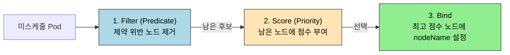

# 스케줄링과 노드 선택

> Pod를 만드는 것과 Pod가 어디서 동작할지 정하는 것은 다른 문제입니다. kube-scheduler는 모든 Pod에 대해 "어느 노드에 둘 것인가"를 두 단계(Filter → Score)로 결정하고, 그 결정을 운영자가 nodeSelector·Affinity·Taint/Toleration으로 좁혀 줍니다. 무엇을 어디에 둘 것인가가 가용성·비용·격리의 출발점입니다.


## 학습 목표
> 스케줄러의 결정 흐름과 운영자가 그 결정에 개입하는 네 가지 도구를 정리합니다.

이 장에서 확인할 목표는 다음과 같다:

1. kube-scheduler의 Filter·Score 두 단계가 각각 무엇을 평가하는지 설명할 수 있습니다.
2. nodeSelector와 nodeAffinity의 표현력 차이를 비교할 수 있습니다.
3. requiredDuringSchedulingIgnoredDuringExecution과 preferred 변형의 의미를 구분할 수 있습니다.
4. podAffinity·podAntiAffinity의 `topologyKey`가 왜 필수인지 설명할 수 있습니다.
5. Taint·Toleration이 nodeAffinity와 어떻게 보완 관계를 이루는지 설명할 수 있습니다.
6. dedicated 노드, GPU 노드, zone 분산 같은 실무 시나리오에서 어떤 도구를 쓰는지 판단할 수 있습니다.


## 1. 왜 스케줄러를 알아야 하는가
> Pod 생성과 노드 배치가 분리된 이유, 그리고 운영자가 개입해야 하는 이유를 정리합니다.

`kubectl apply -f deployment.yaml`을 하면 Pod가 만들어지지만, "어느 노드에서 실행될지"는 그 명령에 들어 있지 않습니다. API 서버는 spec에 `nodeName`이 비어 있는 Pod를 etcd에 저장만 하고, 실제 노드 결정은 비동기로 동작하는 kube-scheduler 컴포넌트가 맡습니다. 즉 Pod 생성과 배치는 두 단계로 분리돼 있고, 그 사이에 운영자가 정책을 끼워 넣을 자리가 있습니다.

운영자가 스케줄러의 기본 결정을 그대로 받아들이지 않는 이유는 세 가지로 모입니다.

1. **하드웨어 제약**입니다. GPU가 있는 노드에만 추론 워크로드를 두고, ARM 노드에는 ARM 빌드 이미지만 두어야 합니다.
2. **격리 요구**다. 보안·과금 경계 때문에 특정 팀의 Pod는 그 팀 전용 노드에서만 동작해야 합니다.
3. **가용성 요구**다. 한 zone이 죽어도 서비스를 지키려면 같은 Deployment의 Pod들이 두 zone 이상에 분산돼야 합니다.

이 세 가지를 표현하는 도구가 nodeSelector·Affinity·Taint/Toleration·Topology Spread다.


## 2. kube-scheduler 흐름
> 결정이 어떤 두 단계를 거치는지 한 번에 잡습니다.

kube-scheduler는 모든 미스케줄 Pod에 대해 다음 절차를 반복합니다.



Filter 단계는 **하드 제약**을 평가합니다. 노드 자원(CPU/메모리 Allocatable)이 Pod의 Requests를 수용할 수 있는가, nodeSelector·nodeAffinity의 required 조건을 만족하는가, Taint를 toleration으로 받아들일 수 있는가 등이 여기서 걸러집니다. Filter를 통과한 노드가 한 곳도 없으면 Pod는 `Pending` 상태에서 `0/N nodes are available` 이벤트를 남깁니다.

Score 단계는 **선호**를 평가합니다. 잔여 자원이 많은 노드, 이미 같은 이미지가 캐시된 노드, preferredDuringScheduling을 만족하는 노드에 더 높은 점수를 줍니다. 점수가 가장 높은 노드 하나에 Bind하고, 그 결과로 Pod 객체에 `spec.nodeName`이 채워집니다.

공식 문서 기준으로 `KubeSchedulerConfiguration`을 직접 작성하면 Filter·Score 플러그인 목록과 가중치를 조정할 수 있습니다. 다만 대부분의 운영 환경에서는 기본 프로필을 그대로 쓰고, 정책은 nodeSelector·Affinity·Taint 같은 워크로드 측 도구로 표현하는 편이 변경 폭이 작습니다.


## 3. nodeSelector
> 가장 단순한 노드 매칭 도구의 한계까지 정리합니다.

nodeSelector는 Pod 스펙에 key-value 한 쌍을 적고, **모든 키가 일치하는 라벨을 가진 노드**에서만 실행하도록 강제합니다.

```yaml
apiVersion: v1
kind: Pod
metadata:
  name: gpu-pod
spec:
  nodeSelector:
    accelerator: nvidia-a100
    workload-type: ml
  containers:
  - name: trainer
    image: pytorch/pytorch:latest
```

위 Pod는 `accelerator=nvidia-a100`과 `workload-type=ml` 라벨을 동시에 가진 노드에서만 동작합니다. 라벨은 노드 운영자가 `kubectl label node <node> accelerator=nvidia-a100`처럼 부여합니다.

nodeSelector의 한계는 표현력입니다. `OR` 조건, "있으면 좋고 없어도 되는" 약한 선호, `NotIn` 같은 부정 매칭이 불가능합니다. "GPU가 nvidia-a100이거나 nvidia-h100이면 모두 OK"라는 조건도 단일 nodeSelector로는 표현할 수 없습니다. 이 한계가 nodeAffinity가 필요한 이유입니다.


## 4. nodeAffinity
> required와 preferred 두 축으로 노드 매칭을 표현합니다.

### 4.1 두 종류의 강도

nodeAffinity는 두 가지 강도를 제공합니다.

| 종류 | 의미 | 위반 시 |
|------|------|--------|
| `requiredDuringSchedulingIgnoredDuringExecution` | 스케줄링 시 반드시 만족해야 함 | 만족 노드 없으면 Pending |
| `preferredDuringSchedulingIgnoredDuringExecution` | 가능하면 만족시키고, 없으면 다른 노드에서 실행 | 점수에만 영향, 배치 자체는 가능 |

이름의 `IgnoredDuringExecution`은 "스케줄링 후에는 라벨이 바뀌어도 Pod를 옮기지 않는다"는 뜻입니다. K8s는 Pod 이동이 아니라 새 Pod 생성·기존 Pod 종료의 흐름으로 동작하기 때문입니다.

### 4.2 표현 예시

```yaml
spec:
  affinity:
    nodeAffinity:
      requiredDuringSchedulingIgnoredDuringExecution:
        nodeSelectorTerms:
          - matchExpressions:
              - key: accelerator
                operator: In
                values: ["nvidia-a100", "nvidia-h100"]
      preferredDuringSchedulingIgnoredDuringExecution:
        - weight: 50
          preference:
            matchExpressions:
              - key: topology.kubernetes.io/zone
                operator: In
                values: ["asia-northeast3-a"]
```

required 블록은 "GPU가 a100 또는 h100"이라는 OR 조건을 표현합니다. preferred 블록은 zone-a를 50점 가중치로 선호하지만, 다른 zone에서도 실행을 허용합니다. 운영 관점에서는 required는 "절대 위반하면 안 되는 제약", preferred는 "유지되면 좋은 정렬"이라는 분리로 외워 두는 편이 안전합니다.

`operator`는 `In`, `NotIn`, `Exists`, `DoesNotExist`, `Gt`, `Lt`를 지원합니다. nodeSelector의 단순 등호와 비교하면 표현력이 본격적으로 늘어납니다.


## 5. podAffinity와 podAntiAffinity
> 다른 Pod의 위치를 기준으로 배치를 정하는 두 도구를 다룹니다.

### 5.1 무엇이 다른가

podAffinity는 "이 Pod와 같은 토폴로지에 있는 Pod 옆에 두고 싶다"고 말합니다. 캐시 Pod를 같은 노드의 애플리케이션 Pod 옆에 두어 네트워크 홉을 줄이는 식입니다. podAntiAffinity는 그 반대로 "같은 토폴로지 안에 두지 마라"고 말합니다. 같은 Deployment의 Pod 3개를 서로 다른 노드에 분산시키는 가장 흔한 사례가 podAntiAffinity다.

### 5.2 topologyKey의 의미

```yaml
spec:
  affinity:
    podAntiAffinity:
      preferredDuringSchedulingIgnoredDuringExecution:
        - weight: 100
          podAffinityTerm:
            labelSelector:
              matchLabels:
                app: my-app
            topologyKey: kubernetes.io/hostname
```

`topologyKey`는 "어느 라벨 값이 같으면 같은 토폴로지로 본다"의 기준입니다. `kubernetes.io/hostname`이면 노드 단위, `topology.kubernetes.io/zone`이면 zone 단위, `topology.kubernetes.io/region`이면 리전 단위입니다. 위 예시는 "같은 노드(hostname이 같은 노드)에 같은 app=my-app Pod가 있으면 가산점을 깎는다"는 뜻으로, Pod를 가능한 한 다른 노드에 분산시킵니다.

`topologyKey`를 빼먹으면 Pod가 어디에 있을 때 충돌로 볼 것인지가 정의되지 않아 스케줄러가 거부합니다. podAffinity는 표현력이 강한 만큼 Filter 단계에서 모든 후보 노드와 모든 기존 Pod를 비교해야 해서, 큰 클러스터에서는 비용이 큽니다. 100노드 이상이라면 required 변형은 신중히 쓰고, 분산은 다음 장의 Topology Spread Constraints로 옮기는 것이 현실적입니다.


## 6. Taints와 Tolerations
> 노드가 Pod를 거부하는 메커니즘과, Pod가 그 거부를 받아들이는 방법을 정리합니다.

### 6.1 방향이 반대인 도구

nodeSelector·nodeAffinity는 **Pod가 노드를 고른다**. Taint·Toleration은 반대 방향입니다. **노드가 Pod를 거부**하고, Pod가 명시적으로 toleration을 가질 때만 허용합니다.

```bash
# 노드에 taint 부여 — 일반 Pod는 이 노드를 피한다
kubectl taint node gpu-1 dedicated=ml-team:NoSchedule
```

위 명령은 `gpu-1` 노드에 `dedicated=ml-team:NoSchedule` taint를 답니다. 이제 다음 toleration 없이는 어떤 Pod도 이 노드에 배치되지 못합니다.

```yaml
spec:
  tolerations:
    - key: dedicated
      operator: Equal
      value: ml-team
      effect: NoSchedule
```

### 6.2 effect 세 종류

| effect | 의미 |
|--------|------|
| NoSchedule | toleration 없는 새 Pod는 스케줄 불가, 기존 Pod는 유지 |
| PreferNoSchedule | toleration 없는 Pod도 가능하면 피하지만 강제 아님 |
| NoExecute | toleration 없는 새 Pod는 스케줄 불가 + 기존 Pod도 즉시 퇴거 |

`NoExecute`는 운영 영향이 가장 큽니다. 노드를 점검 모드로 옮길 때 `NoExecute`를 추가하면 그 위에서 동작하던 Pod가 즉시 퇴거되며, 다른 노드에서 다시 만들어집니다. toleration이 있는 Pod에 `tolerationSeconds: 300`을 설정하면 5분 유예 후 퇴거되도록 조정할 수 있습니다.

### 6.3 nodeAffinity와 짝이 되는 시나리오

GPU 노드를 ML 팀 전용으로 두는 시나리오는 두 도구를 함께 써야 깔끔합니다.

- 노드 측: `dedicated=ml-team:NoSchedule` taint를 부여해 일반 Pod의 침입을 막습니다.
- ML Pod 측: 위 taint에 대한 toleration을 가집니다. 그러나 toleration만 있다고 ML Pod가 GPU 노드에만 가는 것은 아닙니다. 다른 일반 노드에도 갈 수 있습니다.
- ML Pod 측: 추가로 `nodeAffinity`로 `accelerator=nvidia-a100`을 required 조건으로 걸어 일반 노드를 후보에서 뺍니다.

즉 Taint/Toleration은 "노드를 일반 Pod로부터 보호"하고, nodeAffinity는 "Pod를 특정 노드 부류로 끌어당긴다". 두 도구는 보완 관계입니다. 한쪽만 쓰면 격리가 새거나 끌어당김이 부족합니다.


## 7. 실무 패턴
> 자주 묶어 쓰는 세 가지 시나리오를 모아 둡니다.

### 7.1 Zone 분산으로 가용성 확보

같은 Deployment의 Pod 3개를 가능한 한 서로 다른 zone에 두려면 podAntiAffinity의 preferred 형식을 zone 토폴로지로 둡니다. 단, 분산이 정확하지 않을 수 있습니다. 강한 분산이 필요하면 다음 장의 Topology Spread Constraints가 더 적합합니다.

### 7.2 GPU 노드 격리

위 §6.3 시나리오를 그대로 씁니다. taint로 일반 Pod를 차단하고, ML Pod에 toleration + nodeAffinity를 함께 둡니다.

### 7.3 점검 모드(Cordon·Drain)

`kubectl cordon <node>`는 노드에 `node.kubernetes.io/unschedulable:NoSchedule` taint와 비슷한 효과를 만들어 새 Pod 배치를 막습니다. `kubectl drain <node>`는 cordon에 더해 기존 Pod를 다른 노드로 옮깁니다. drain 시 PodDisruptionBudget이 충족되지 않으면 차단되는데, 이 안전 가드는 다음 장에서 다룹니다.

`tolerationSeconds`로 점검 시 Pod 이전을 천천히 진행시키는 패턴, `taintBasedEvictions`로 노드 비정상 시그널(NotReady, Unreachable)에 따라 자동 퇴거되도록 두는 패턴은 K8s가 기본으로 켜 둔 정책입니다. 이 정책 자체는 컨트롤러가 자동으로 관리하지만, 운영자가 직접 toleration을 추가해 "비정상 노드에서도 일정 시간 버티는" 시스템 Pod를 만들 수 있습니다.


## 8. 점검 질문
> 본문 개념을 운영 판단 질문으로 다시 점검합니다.

### Q1. Pod가 Pending인데 어느 단계에서 막혔는지 어떻게 구분하는가?

`kubectl describe pod <name>`의 `Events` 섹션이 출발점입니다. `0/N nodes are available: ...` 메시지가 보이면 Filter 단계에서 모든 노드가 탈락했다는 뜻이고, 메시지 본문에 `5 Insufficient cpu`, `3 node(s) had untolerated taint`, `2 node(s) didn't match Pod's node affinity/selector`처럼 사유별 노드 수가 분리돼 출력됩니다. 어떤 사유가 가장 많은지를 보면 풀 문제가 자원인지, taint인지, affinity 라벨 누락인지가 갈립니다.

Filter가 통과되었는데 Score 단계가 막히는 일은 사실상 없습니다. Score는 점수 부여만 하고 후보 노드가 0이 되지는 않기 때문입니다. Pending이 길게 유지되면 거의 항상 Filter 문제입니다. 보조 도구로 `kubectl get events --sort-by=.metadata.creationTimestamp` 또는 `kubectl get pod -o wide`로 다른 Pod의 분포를 보면, 어느 노드에 자원 여유가 남아 있는데 왜 Filter에서 걸렸는지 추적하기 쉽습니다.

스케줄러 자체의 동작은 `kube-system/kube-scheduler` Pod의 로그에서 확인합니다. `--v=4` 이상으로 verbosity를 높이면 각 후보 노드의 Score까지 찍히지만, 운영 환경에서는 노이즈가 많아 단발 디버깅에서만 켭니다.

### Q2. nodeAffinity만으로 GPU 노드 격리가 충분하지 않은 이유는?

nodeAffinity는 Pod가 특정 라벨의 노드를 선택하도록 끌어당길 뿐, 그 노드를 다른 Pod로부터 보호하지는 않습니다. GPU 노드에 `accelerator=nvidia-a100` 라벨만 달면, ML Pod는 그 노드를 잘 찾아가지만 일반 웹 서버 Pod도 자원 여유가 있으면 그 노드에 스케줄될 수 있습니다. 결과적으로 GPU 노드에 일반 Pod가 섞여 GPU 메모리·CPU를 잡아먹습니다.

이 격리를 강제하는 도구가 Taint입니다. 노드에 `dedicated=ml-team:NoSchedule` taint를 추가하면 toleration 없는 일반 Pod는 그 노드를 후보에서 자동으로 제외합니다. ML Pod는 toleration을 가져 taint를 통과하고, 추가로 nodeAffinity로 GPU 라벨을 요구해 다른 일반 노드도 후보에서 뺍니다. 두 도구를 함께 써야 한 방향에 새는 구멍이 없습니다.

조직 단위 격리에서는 taint·toleration을 ResourceQuota·NetworkPolicy와 함께 묶기도 합니다. taint로 노드를 분리하고, ResourceQuota로 네임스페이스 자원 상한을 두고, NetworkPolicy로 통신 경계를 그어야 "전용 환경"이라는 운영 약속이 한 차원에서만 무너지지 않습니다.

### Q3. podAntiAffinity의 required와 preferred를 어떻게 선택하는가?

required는 "어겨서는 안 되는 분산", preferred는 "유지하면 좋은 분산"입니다. 세 노드짜리 클러스터에서 같은 라벨의 Pod를 노드별 1개로 required 분산을 걸어 두면, 4번째 Pod는 만들 수 없습니다. 클러스터 크기와 desired replica 수를 함께 고려하지 않으면 ReplicaSet이 4번째 Pod를 영원히 만들지 못해 Deployment 롤아웃이 멈춥니다.

운영에서 자주 쓰는 패턴은 "노드 단위 분산은 preferred, zone 단위 분산은 required"다. zone은 보통 3개 이상이고 노드 수보다 적으므로 required로 강제해도 4번째 Pod를 못 만드는 일이 잘 생기지 않습니다. 노드는 변동이 크므로 preferred로 두고 가산점에 맡깁니다. 다만 분산을 깐깐하게 강제하고 싶으면 다음 장의 Topology Spread Constraints가 같은 목적을 더 정밀하게 표현합니다.

required로 갈 때는 `replicas <= 사용 가능한 토폴로지 수`인지 미리 점검합니다. HPA로 replicas가 늘어나는 워크로드라면 maxReplicas까지 검산해야 합니다. 한 번이라도 위반될 수 있는 상한이면 preferred로 내리는 편이 안전합니다.

### Q4. topologyKey를 hostname/zone/region 중 어떻게 고르는가?

목표가 무엇인지에서 출발합니다. "노드 한 대가 죽어도 살아남는다"가 목표면 `kubernetes.io/hostname`입니다. "AZ 한 곳이 죽어도 살아남는다"면 `topology.kubernetes.io/zone`입니다. "리전 한 개가 죽어도 살아남는다"면 `topology.kubernetes.io/region`이지만, 단일 클러스터에서 다리전 운영은 거의 없으므로 region 분산은 클러스터 단위 분리(멀티 클러스터)나 글로벌 LB 단계에서 푸는 편이 일반적입니다.

비용도 고려합니다. zone 분산은 클라우드 사업자 기준으로 zone 간 트래픽 비용이 청구되므로, 트래픽이 많은 워크로드를 zone 단위로 강하게 분산시키면 네트워크 비용이 올라갑니다. 가용성 요구가 약한 내부 워크로드는 hostname 분산까지만 두고 zone은 preferred로 내리는 식의 절충이 자주 쓰입니다.

라벨 자체는 클라우드 또는 ccm(Cloud Controller Manager)이 자동으로 노드에 부여합니다. on-prem 클러스터에서는 노드 라벨을 직접 채워 넣어야 zone/region 토폴로지가 의미를 갖습니다.

### Q5. NoSchedule와 NoExecute의 운영 영향 차이는?

`NoSchedule`은 새 Pod에만 영향을 줍니다. 이미 그 노드에서 동작하던 Pod는 toleration이 없어도 그대로 유지됩니다. 반면 `NoExecute`는 toleration 없는 기존 Pod를 즉시 퇴거시킵니다. 같은 taint라도 effect 한 글자 차이로 클러스터 전체가 동시에 흔들릴 수 있습니다.

`NoExecute`는 보통 자동 시그널과 결합돼 운영됩니다. 노드가 NotReady 상태로 5분 이상 머물면 controller-manager가 자동으로 `node.kubernetes.io/unreachable:NoExecute` taint를 답니다. 이때 toleration이 없거나 `tolerationSeconds`가 짧은 Pod는 즉시 퇴거됩니다. 시스템 핵심 Pod(예: 노드의 metrics-agent, log-shipper)는 이 taint에 대해 toleration을 두고 `tolerationSeconds: 0` 또는 충분히 큰 값으로 설정해 "노드가 잠깐 끊겨도 끝까지 버티는" 동작을 보장합니다.

운영자가 수동으로 `NoExecute`를 거는 경우는 드뭅니다. 보통 `kubectl drain`이 동일한 효과를 더 안전하게 만듭니다. drain은 cordon(NoSchedule 효과)을 먼저 걸고 PDB를 점검하면서 Pod를 차례로 옮기기 때문입니다.

### Q6. taint based evictions와 시스템 Pod의 관계는?

K8s는 노드 상태가 비정상일 때(`NotReady`, `Unreachable`, `MemoryPressure`, `DiskPressure`, `NetworkUnavailable`, `PIDPressure`) 자동으로 그 노드에 해당 taint를 부여합니다. 일반 Pod는 이 taint들에 toleration이 없어 자동 퇴거되지만, kube-system의 일부 Pod는 toleration을 가져 노드가 비정상 상태에서도 끝까지 동작합니다.

특히 DaemonSet은 기본 toleration이 자동 주입돼 `node.kubernetes.io/disk-pressure:NoSchedule`, `node.kubernetes.io/memory-pressure:NoSchedule` 같은 taint를 통과합니다. 노드 비정상의 진단·복구를 담당하는 Pod 자체가 그 노드에서 빠져나가면 진단을 할 수 없기 때문입니다.

운영자가 만든 워크로드도 비슷한 의도가 필요하면 toleration을 명시해야 합니다. 예: 노드 모니터링 사이드카는 `node.kubernetes.io/unreachable`에 대한 toleration이 있어야 노드 일시 단절 구간에서도 메트릭을 끝까지 보낼 수 있습니다.

### Q7. cordon·drain은 PodDisruptionBudget과 어떻게 상호작용하는가?

`kubectl drain <node>`는 두 단계로 동작합니다. 먼저 cordon을 걸어 노드에 새 Pod가 추가되지 못하게 막고, 그다음 노드 위 Pod를 하나씩 evict API로 옮깁니다. evict API는 PDB를 검사하므로, `minAvailable`을 위반하는 시점에는 다음 Pod의 evict가 차단됩니다.

차단되면 drain은 무한 대기에 들어가지 않고 일정 시간 동안 재시도합니다. 그래도 실패하면 운영자가 결정해야 합니다. PDB를 일시적으로 완화하든가, drain을 분산해 다른 노드로 미리 트래픽을 옮기든가, 워크로드를 일시 정지하든가, 셋 중 하나를 택합니다. PDB를 우회해 drain하려면 `kubectl drain --disable-eviction --force` 같은 위험한 옵션이 있는데, 이는 가용성 약속을 깨므로 비상시에만 씁니다.

PDB·drain·HPA가 동시에 움직이는 현실에서는 노드 한 대 점검이 의외로 길어지기 쉽습니다. 점검 시작 전 같은 워크로드의 다른 노드 Pod가 충분한지 확인하고, 점검 도중 HPA가 minReplicas를 채우는 데 충분한 자원이 다른 노드에 있는지 보는 두 단계를 묶어 두면 사고를 줄입니다.

### Q8. KubeSchedulerConfiguration을 직접 손대야 하는 시점은?

대부분의 클러스터는 기본 프로필(`default-scheduler`)이면 충분합니다. 직접 수정하는 시점은 두 가지입니다.

1. **여러 스케줄러 프로필을 운영**하는 경우입니다. 배치 워크로드 전용 프로필(예: bin packing 가중치를 높여 자원 활용을 극대화)을 만들고, Pod에 `spec.schedulerName`을 명시해 그 프로필을 쓰게 합니다.
2. **특정 플러그인의 가중치를 바꿀 때**다. 예를 들어 노드 자원 균형(`NodeResourcesBalancedAllocation`)을 더 강하게 가중치를 두면 같은 워크로드를 여러 노드에 더 평탄하게 분산시킬 수 있습니다.

수정은 ConfigMap을 통해 진행하고, kube-scheduler를 재시작합니다. 자체 운영 클러스터(kubeadm 기반)에서는 `/etc/kubernetes/manifests/kube-scheduler.yaml`을 수정하면 kubelet이 정적 Pod를 자동 재시작합니다. 매니지드 K8s에서는 보통 KubeSchedulerConfiguration 변경을 지원하지 않거나 제한된 옵션만 노출합니다.

같은 효과를 nodeAffinity·Topology Spread·PriorityClass로 워크로드 측에서 표현할 수 있는지를 먼저 따져 봅니다. 워크로드 표현으로 풀리면 그쪽이 변경 폭과 롤백 비용이 작습니다. 스케줄러 프로필 변경은 클러스터 전체 동작에 영향을 주므로, 카나리 적용을 할 수 없다는 점에서 더 보수적으로 접근합니다.


## 9. 다음 단계
> 어디에 둘지 정한 다음에 풀어야 할 분산·중단 정책으로 이어 갑니다.

스케줄링은 "어디에 둘지"를 정하는 단계까지입니다. 운영의 다음 질문은 두 가지입니다.

1. "Pod를 여러 zone·노드에 균형 있게 분산시키려면?"
2. "노드 점검·자동 퇴거 같은 자발적 중단에서 가용성을 어떻게 지키는가?"

다음 장 [토폴로지 분산과 중단 정책](05-02.%ED%86%A0%ED%8F%B4%EB%A1%9C%EC%A7%80%20%EB%B6%84%EC%82%B0%EA%B3%BC%20%EC%A4%91%EB%8B%A8%20%EC%A0%95%EC%B1%85.md)에서 Topology Spread Constraints, PodDisruptionBudget, PriorityClass·Preemption, Eviction 흐름을 한 번에 정리합니다.


## 관련 문서
> 점검 문서와 같은 Part의 다음 두 장을 한 번에 모읍니다.

- [토폴로지 분산과 중단 정책](05-02.%ED%86%A0%ED%8F%B4%EB%A1%9C%EC%A7%80%20%EB%B6%84%EC%82%B0%EA%B3%BC%20%EC%A4%91%EB%8B%A8%20%EC%A0%95%EC%B1%85.md) — 다음 장, Topology Spread/PDB/PriorityClass/Eviction
- [배치 워크로드](../01_workloads/01-02.%EB%B0%B0%EC%B9%98%20%EC%9B%8C%ED%81%AC%EB%A1%9C%EB%93%9C.md) — Job·CronJob·DaemonSet·InitContainer·Sidecar
