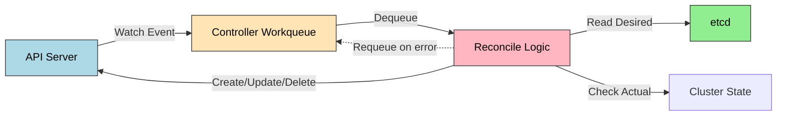

# Operator 패턴

> Operator는 CRD(Custom Resource Definition) + Custom Controller의 조합으로, 애플리케이션 운영 지식을 코드로 자동화하는 패턴입니다. 선언적 API로 "원하는 상태"만 명시하면 Reconciliation Loop가 실제 상태를 자동으로 맞춰 나갑니다.


## 학습 목표
> Operator를 설치 자동화 이후의 운영 자동화 계층으로 이해합니다.

이 장에서 확인할 목표는 다음과 같다:

1. Operator가 해결하는 문제와 기본 K8s 리소스만으로 부족한 이유를 설명할 수 있습니다.
2. `CRD`의 역할과 Reconciliation Loop 동작 원리를 이해할 수 있습니다.
3. Operator 성숙도 모델(Level 1~5)의 자동화 범위를 단계별로 구분할 수 있습니다.
4. Operator SDK와 Kubebuilder의 차이, OLM의 필요성을 설명할 수 있습니다.


## 1. 왜 Operator가 필요한가
> 설치 이후 반복되는 운영 작업을 왜 코드화해야 하는지 설명합니다.

### 1.1 기본 리소스의 한계

Kubernetes는 Stateless 애플리케이션을 쉽게 관리합니다. Deployment는 레플리카 수를 유지하고 Service는 로드밸런싱을 제공합니다. 하지만 PostgreSQL 클러스터 같은 Stateful 애플리케이션은 다릅니다.

StatefulSet으로 초기 배포는 가능하지만 그 이후가 문제입니다. 백업은 누가 언제 실행하는가. Primary가 죽으면 누가 Standby를 승격시키는가. 버전 업그레이드 시 데이터 마이그레이션은 어떻게 처리하는가. 이 모든 작업은 운영 지식(operational knowledge)이 필요하고, 기존에는 사람이 kubectl과 스크립트로 수동 실행했습니다.

### 1.2 Day-1 vs Day-2 Operation

| 단계 | 작업 예시 | 기본 K8s | Operator |
|------|----------|---------|----------|
| Day-1 | 애플리케이션 배포 | 가능 | 자동화 가능 |
| Day-2 | 백업, 복구, 업그레이드, Failover | 수동 스크립트 | 자동화 |

Operator는 특히 Day-2 Operation을 자동화합니다. 백업 CronJob 자동 생성, Primary 장애 시 자동 Failover, 버전 업그레이드 시 마이그레이션 Job 실행이 대표적입니다.


## 2. CRD: Kubernetes API 확장
> Kubernetes API를 도메인 리소스로 확장하는 방법을 정리합니다.

### 2.1 CRD란 무엇인가

Kubernetes API는 기본적으로 Pod, Service, Deployment 등을 제공합니다. CRD는 이 API를 확장해 새로운 리소스 타입을 추가합니다. `PostgresCluster`라는 CRD를 정의하면 `kubectl get postgrescluster`로 조회하고 `kubectl apply -f`로 생성할 수 있습니다.

### 2.2 CRD vs ConfigMap

| 항목 | ConfigMap | CRD |
|------|-----------|-----|
| 용도 | 설정 데이터 저장 | API 확장, 리소스 정의 |
| 스키마 검증 | 없음 | OpenAPI v3 스키마 |
| kubectl 통합 | `get configmap` | `get postgrescluster` (타입별 조회) |
| 버전 관리 | 없음 | v1, v1alpha1 등 |
| RBAC | 범용 ConfigMap 권한 | 리소스별 세밀한 권한 |

CRD는 Kubernetes API의 일급 시민(first-class citizen)입니다. RBAC, 버전 관리, admission webhook 등 K8s API의 모든 기능을 사용할 수 있습니다.

여기서 많이 헷갈리는 점이 있습니다. CRD는 새로운 타입을 추가할 뿐 자동화를 보장하지 않습니다. 실제 복구, 생성, 정리 로직은 Controller가 담당합니다. 그래서 Operator는 "CRD만 있는 상태"가 아니라 "CRD를 해석해 desired state를 actual state로 맞추는 Controller까지 포함된 패턴"으로 보는 편이 정확합니다.


## 3. Reconciliation Loop
> 원하는 상태와 실제 상태의 차이를 줄이는 핵심 반복 구조를 설명합니다.

### 3.1 동작 원리



Controller는 API Server에 특정 리소스를 watch 요청합니다. 리소스가 생성·수정·삭제되면 이벤트가 Workqueue에 쌓입니다. Worker goroutine이 큐에서 하나씩 꺼내 Reconcile 로직을 실행합니다. etcd에서 desired state를 읽고 클러스터 actual state와 비교해 차이를 해소합니다.

### 3.2 핵심 특성

Reconciliation Loop는 **Level-driven**입니다. "Pod가 추가되었다"(edge)가 아니라 "현재 총 몇 개인가"(level)를 확인합니다. 이벤트를 놓쳐도 다음 reconcile에서 상태를 맞춥니다.

**멱등성**이 핵심입니다. 같은 입력에 여러 번 호출해도 결과가 같아야 합니다. "Pod 1개 추가"가 아니라 "총 3개여야 함"으로 판단하는 방식입니다.

에러 발생 시 exponential backoff로 재시도합니다. 일시적 에러(네트워크 장애)와 영구 에러(잘못된 설정)를 구분해 영구 에러는 status에 기록하고 재시도를 중단해야 합니다.


## 4. Operator 성숙도 모델
> 단순 설치 자동화부터 완전한 자가 복구까지 성숙도 단계를 구분합니다.

| Level | 자동화 범위 | 예시 |
|-------|-----------|------|
| 1 Basic Install | 초기 배포 | Helm Chart를 CRD로 감싼 형태 |
| 2 Seamless Upgrades | 버전 업그레이드 + 데이터 마이그레이션 | Postgres Operator (Zalando) |
| 3 Full Lifecycle | 백업, 복원, 모니터링 자동화 | Percona XtraDB Cluster Operator |
| 4 Deep Insights | 메트릭 기반 이상 탐지 + 알림 | CockroachDB Operator |
| 5 Auto Pilot | 완전 자율 운영 (자동 Failover, 자동 스케일링) | Google Cloud SQL Operator 개념 |

대부분의 Operator는 Level 2~3에 머뭅니다. Level 5는 예측 불가능성과 디버깅 난이도가 높아 신중하게 접근해야 합니다.


## 5. 개발 프레임워크
> 직접 구현할 때 어떤 프레임워크를 고를지 판단 기준을 정리합니다.

**Operator SDK**는 Red Hat이 유지 보수하며 Go, Ansible, Helm 세 가지 개발 방식을 제공합니다. 기존 Ansible playbook이나 Helm Chart를 재사용하거나 OLM 통합이 필요한 경우에 적합합니다.

**Kubebuilder**는 Kubernetes SIG가 유지 보수하며 Go 전용입니다. 두 프레임워크 모두 Controller Runtime 라이브러리를 공유하므로 코드 구조가 거의 같습니다.

선택 기준은 단순합니다. 기존 Ansible/Helm 자산이 많으면 Operator SDK, 순수 Go 개발이면 Kubebuilder를 선택합니다. 복잡한 Day-2 로직은 반드시 Go 기반으로 작성해야 합니다. Ansible과 Helm 기반 Operator는 Level 1~2에만 적합합니다.


## 6. OLM(Operator Lifecycle Manager)
> Operator 배포와 업그레이드 관리를 위한 별도 계층을 짚습니다.

Operator를 수동으로 설치하려면 CRD, Controller Deployment, RBAC를 파일 여러 개에 나눠 순서대로 적용해야 합니다. OLM은 Subscription 리소스 하나로 이 과정을 자동화합니다. 업그레이드 순서 관리, 의존성 자동 해결, 멀티 테넌트 지원이 장점입니다.

Air-gapped 환경이나 자동 업그레이드를 원하지 않는 프로덕션에서는 수동 설치가 더 적합할 수 있습니다.


## 7. 점검 질문
> Operator 핵심 개념을 운영 자동화 판단 질문으로 다시 점검합니다.

### Q1. CRD와 ConfigMap의 차이 — 왜 CRD를 만들어야 하는가?

ConfigMap은 key-value 데이터를 저장하는 범용 컨테이너입니다. 어떤 데이터든 자유롭게 넣을 수 있지만 스키마 검증이 없어 잘못된 값이 들어가도 API 서버가 거부하지 않습니다.

CRD는 Kubernetes API를 확장해 새로운 리소스 타입을 추가합니다. `kubectl get postgrescluster`처럼 타입별 조회가 가능하고, OpenAPI v3 스키마로 필드 타입·필수 여부·범위를 강제합니다. 잘못된 값은 API 서버 단계에서 거부됩니다.

버전 관리도 다릅니다. ConfigMap은 버전 개념이 없지만 CRD는 v1alpha1, v1beta1, v1 등으로 API 버전을 관리하고 버전 간 변환 webhook도 지원합니다. RBAC 통합도 세밀합니다. ConfigMap은 "모든 ConfigMap"에 대한 권한만 설정 가능하지만 CRD는 리소스 타입별로 권한을 부여할 수 있습니다.

Controller 연동 관점에서 ConfigMap은 Controller가 데이터를 직접 파싱해야 하지만, CRD는 API 서버가 watch 이벤트를 제공하고 typed client를 생성할 수 있어 개발이 쉽습니다. Admission Webhook도 CRD에서만 지원됩니다.

```bash
# CRD 확인
kubectl get crd
kubectl describe crd postgresclusters.postgres-operator.crunchydata.com

# status subresource 확인 (spec=desired, status=actual)
kubectl get postgrescluster mycluster -o jsonpath='{.status}'
```

심화: CRD를 삭제하면 해당 타입의 모든 Custom Resource도 삭제됩니다. finalizer가 설정된 리소스가 있으면 Controller가 정리를 완료한 후 삭제됩니다.

### Q2. Reconciliation Loop의 동작 원리 — Watch → Queue → Reconcile은?

Controller는 API 서버에 HTTP long-polling 또는 WebSocket으로 연결하고 특정 리소스의 변경 이벤트를 실시간으로 받습니다. etcd 변경이 감지되면 API 서버가 즉시 이벤트를 보냅니다.

이벤트를 받자마자 처리하지 않고 Workqueue에 넣는 이유는 동시성 제어와 재시도 때문입니다. 여러 리소스가 동시에 변경되어도 순차 처리하고, 에러 발생 시 exponential backoff(5초 → 10초 → 20초 →...)로 재시도합니다.

Reconcile 로직은 세 단계입니다. etcd에서 desired state를 읽고(`spec.replicas: 3`), 클러스터에서 actual state를 확인(`현재 Pod 2개`), 차이를 해소한다(`Pod 1개 추가`). 멱등성이 핵심입니다.

Kubernetes Controller는 Level-driven입니다. "Pod가 추가됐다"(edge)가 아니라 "현재 총 몇 개인가"(level)를 확인합니다. 이벤트를 놓쳐도 다음 reconcile에서 상태를 맞출 수 있습니다.

Reconcile 함수는 `(ctrl.Result, error)`를 반환합니다. `error != nil`이면 자동 재시도, `Result.Requeue = true`이면 명시적 재시도, `Result.RequeueAfter = 5분`이면 일정 시간 후 재확인입니다.

```bash
# Controller 로그로 Reconcile 추적
kubectl logs -n operator-system deploy/my-operator -f | grep Reconcile

# Custom Resource 이벤트 확인
kubectl describe postgrescluster mycluster | grep -A 10 Events
```

심화: 동일 리소스에 이벤트가 빠르게 연속 발생하면 Workqueue가 중복을 제거해 한 번만 처리합니다. Reconcile 중 리소스가 삭제되면 `client.IgnoreNotFound(err)`로 처리합니다.

### Q3. Operator 성숙도 Level 1~5 — 각 단계에서 어떤 자동화가 추가되는가?

Level 1(Basic Install)은 CRD 적용 시 Controller가 기본 리소스를 생성합니다. 사용자는 `spec.replicas`, `spec.image` 정도만 설정하고 나머지는 수동입니다. Helm Chart를 CRD로 감싼 형태가 대표적입니다.

Level 2(Seamless Upgrades)는 `spec.version`을 변경하면 Controller가 롤링 업데이트를 자동 실행합니다. 데이터 마이그레이션이 필요한 경우 Job을 자동 생성합니다. 백업/복원은 여전히 수동입니다.

Level 3(Full Lifecycle)은 백업, 복원, 모니터링이 자동화됩니다. `spec.backup.schedule: "0 2 * * *"`로 CronJob이 자동 생성되고, 복원 요청 시 자동 실행됩니다. Prometheus ServiceMonitor도 자동 생성합니다.

Level 4(Deep Insights)는 메트릭을 분석해 이상 징후를 탐지합니다. 쿼리 응답 시간이 평소보다 3배 느리면 알림을 보내고 에러 패턴을 인식합니다.

Level 5(Auto Pilot)는 완전 자율 운영입니다. Primary DB 장애 시 Standby를 자동 승격하고, 디스크 부족 시 PVC를 자동 확장합니다.

대부분의 Operator는 Level 2~3에 머뭅니다. Level 5는 예측 불가능한 동작의 위험과 비용 증가 등 트레이드오프가 있어 신중하게 접근합니다.

### Q4. Operator SDK vs Kubebuilder — 차이와 선택 기준은?

두 도구 모두 Controller Runtime 라이브러리를 사용합니다. CRD 생성, Reconcile 로직, RBAC 설정, Deployment 매니페스트 생성 등 핵심 기능은 같고 프로젝트 구조도 거의 동일합니다.

Operator SDK는 Red Hat이 관리하며 Go, Ansible, Helm 세 가지 개발 방식을 제공합니다. 기존 Ansible playbook이나 Helm Chart를 빠르게 Operator로 전환할 수 있고 OLM 통합이 긴밀합니다.

Kubebuilder는 Kubernetes SIG가 관리하며 순수 Go 개발에 특화됐습니다. 코드가 더 간결하고 최신 Controller Runtime 기능을 빠르게 반영합니다.

Ansible 기반 Operator는 복잡한 조건부 Reconcile이나 status 업데이트가 어렵습니다. Level 1~2 Operator에 적합합니다. Helm 기반 Operator는 배포만 자동화하고 Day-2 Operation은 지원하지 않아 Level 1에만 적합합니다.

선택 기준: 기존 Ansible/Helm 자산이 많으면 Operator SDK, 순수 Go 개발이면 Kubebuilder. 복잡한 비즈니스 로직이 필요하면 둘 다 Go 기반을 사용해야 합니다.

### Q5. Operator가 해결하는 Day-2 Operation 예시는?

백업 자동화는 CronJob을 자동 생성해 매일 새벽 2시에 pg_dump를 실행하고 S3에 업로드한 뒤 보존 기간이 지난 데이터를 삭제합니다. `spec.backup.schedule`과 `spec.backup.retention`으로 선언하면 Controller가 CronJob, PVC, S3 자격증명 Secret을 모두 생성합니다.

장애 복구(Failover)는 Primary DB Pod의 liveness probe가 실패하면 Controller가 Standby를 자동 승격시킵니다. Service의 selector를 변경해 트래픽을 새 Primary로 라우팅하고, 기존 Primary는 복구 후 Standby로 재구성합니다.

버전 업그레이드는 `spec.version`을 변경하면 Controller가 백업 실행 → 마이그레이션 Job → 새 이미지로 Pod 재시작 → 헬스 체크 순서로 처리합니다.

스케일링은 `spec.replicas`를 변경하면 StatefulSet이 Pod를 추가하고, Controller는 새 Pod가 Ready 상태가 될 때까지 대기한 후 Replication 설정을 자동 업데이트합니다.

인증서 갱신은 Cert Manager Operator가 만료일을 모니터링하고 30일 전에 Let's Encrypt에 자동 갱신을 요청합니다. Prometheus Operator는 ServiceMonitor CRD를 자동 생성해 메트릭 수집을 자동 설정합니다.

### Q6. OLM 없이 Operator를 설치하는 방법과 OLM의 장점은?

수동 설치는 CRD YAML, Controller Deployment, ServiceAccount/Role/RoleBinding을 순서대로 적용합니다. 총 5~10개의 YAML 파일을 관리해야 합니다.

```bash
# 수동 설치
kubectl apply -f crd.yaml
kubectl apply -f rbac.yaml
kubectl apply -f deployment.yaml
```

OLM은 Subscription 리소스 하나만 생성하면 CatalogSource에서 CSV(ClusterServiceVersion)를 가져와 나머지를 자동 생성합니다.

OLM의 장점은 세 가지입니다. 업그레이드 순서를 CSV의 `replaces` 필드로 자동 관리하고 롤백도 지원합니다. Operator 간 의존성을 자동으로 해결해 필요한 Operator를 먼저 설치합니다. `installMode`로 클러스터 전역(AllNamespaces)과 네임스페이스별(OwnNamespace) 설치를 선택할 수 있습니다.

OLM 없이 설치해야 하는 경우도 있습니다. 자동 업그레이드를 원하지 않거나, 외부 레지스트리에 접근할 수 없는 Air-gapped 환경이거나, CRD에 커스텀 필드를 추가하는 등 커스터마이징이 많이 필요할 때입니다.

### Q7. Operator Anti-pattern — 피해야 할 설계 실수는?

너무 많은 책임이 가장 흔한 실수입니다. DB 배포 + 백업 + 모니터링 + 로깅을 하나의 Operator가 담당하면 복잡도가 폭발합니다. 단일 책임 원칙을 지켜야 합니다.

상태 관리 실패는 Reconcile 로직에서 외부 API를 호출하거나 외부 DB에 상태를 저장할 때 발생합니다. etcd를 진실의 원천(source of truth)으로 삼아야 하며 외부 상태와 불일치하면 복구가 어렵습니다.

비멱등성 로직은 "Pod 1개 추가"가 아니라 "총 3개여야 함"으로 판단해야 합니다. 비멱등성 로직은 재시도 시 중복 생성 문제를 일으킵니다.

즉시 실행(Imperative) 로직은 `spec.backup: "now"`처럼 즉시 실행 요청을 담으면 이벤트가 중복 발생할 수 있습니다. 고유 ID를 사용하고 status에 실행 여부를 기록하는 방식으로 선언적으로 설계해야 합니다.

과도한 watch는 API 서버에 부담을 줍니다. Owner Reference로 내가 생성한 리소스만 watch해야 합니다.

에러 처리는 일시적 에러(네트워크 장애)와 영구 에러(잘못된 설정)를 구분해야 합니다. 영구 에러는 status에 기록하고 재시도를 중단해야 합니다.

```bash
# Owner Reference 확인
kubectl get pod mycluster-0 -o jsonpath='{.metadata.ownerReferences}'

# CR status 에러 정보 확인
kubectl get postgrescluster mycluster -o jsonpath='{.status.conditions}'
```


## 8. Operator가 적합한 경우
> 모든 워크로드에 Operator가 필요한 것은 아니라는 점을 경계합니다.

Operator가 적합한 상황과 그렇지 않은 상황을 구분하는 것이 중요합니다.

적합한 경우는 복잡한 상태 저장 애플리케이션(DB, 메시지 큐), 반복적인 운영 작업(백업, 인증서 갱신), 도메인 특화 자동화(ML 파이프라인)다.

부적합한 경우는 단순 Stateless 애플리케이션(Deployment로 충분), 일회성 작업(Job/CronJob), 운영 로직이 없는 단순 배포입니다. 이런 경우 Operator를 만드는 것은 과잉 설계입니다.


## 관련 문서
> Helm 다음 단계와 실제 Operator 사례 장들로 이어 줍니다.

- [Helm 고급](../10_packaging/10-02.Helm%20%EA%B3%A0%EA%B8%89.md) — 이전 장, 차트 개발과 템플릿 설계
- [MySQL Operator](08-02.MySQL%20Operator.md) — 다음 절, MySQL HA 자동화
