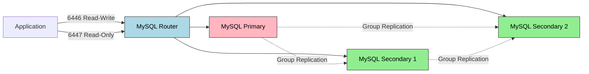
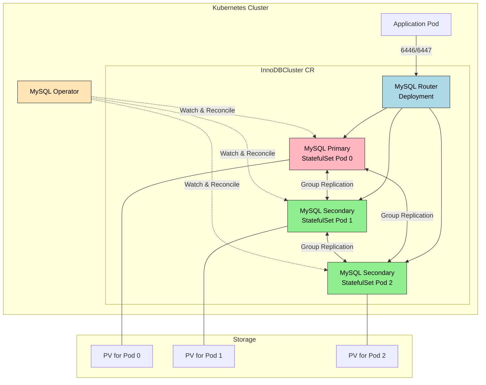

# MySQL Operator

> MySQL Operator for Kubernetes는 InnoDB Cluster 기반의 고가용성 MySQL 환경을 K8s 위에서 자동으로 관리합니다. Group Replication으로 데이터를 동기화하고, MySQL Router가 애플리케이션의 연결을 Primary/Secondary로 자동 라우팅하며, Operator가 장애 복구와 백업을 선언적으로 관리합니다.


## 학습 목표
> MySQL HA를 Operator가 어떻게 선언형으로 관리하는지 파악하는 장입니다.

이 장에서 확인할 목표는 다음과 같다:

1. Kubernetes 위에서 데이터베이스를 운영하는 장점과 한계를 설명할 수 있습니다.
2. InnoDB Cluster의 아키텍처와 Group Replication 기반 HA 구조를 이해할 수 있습니다.
3. `InnoDBCluster` CR을 정의하고 클러스터를 생성하는 흐름을 설명할 수 있습니다.
4. Primary 장애 시 자동 페일오버 동작을 운영 관점에서 해석할 수 있습니다.
5. `MySQLBackup` CR로 백업과 복원을 선언적으로 관리하는 방식을 이해할 수 있습니다.
6. 리소스 제약 환경에서 DB 클러스터를 테스트하는 전략을 세울 수 있습니다.


## 1. 왜 데이터베이스를 K8s 위에 올리는가
> 상태 저장 데이터베이스를 Kubernetes에 올릴 때 기대하는 이점과 비용을 먼저 봅니다.

### 1.1 Day-2 Operation의 자동화

"데이터베이스는 K8s에 올리지 말라"는 말을 들어봤을 것입니다. 초기 K8s는 Stateless 애플리케이션을 위해 설계되었고, StatefulSet이 안정화되기까지 시간이 걸렸습니다. 하지만 현재는 K8s 위에서 데이터베이스를 운영하는 것이 더 이상 금기가 아닙니다.

데이터베이스 운영에서 가장 고통스러운 부분은 초기 설치가 아니라 "어제 잘 돌던 DB가 오늘 왜 안 돌아가는가"에 대응하는 것입니다. Operator 패턴은 이런 Day-2 Operation을 코드로 만듭니다. Primary가 죽으면 Replica를 승격시키고, 백업이 실패하면 재시도하는 로직이 Go 코드로 구현되어 24시간 감시합니다. 운영자는 선언적 명세(CR)만 작성하면 됩니다.

### 1.2 인프라 통합과 비용

애플리케이션은 K8s에서 돌고 DB는 별도 VM이나 RDS에서 돌면, 네트워크 설정, 인증서 관리, 모니터링 스택이 이원화됩니다. DB를 K8s로 가져오면 Helm Chart로 배포하고, kubectl로 관리하고, Prometheus로 모니터링하는 것이 일관된 방식으로 가능해집니다.

클라우드 RDS는 편리하지만 개발/테스트 환경에서는 과도한 비용입니다. K8s 위에서 돌리면 노드의 자원을 효율적으로 공유할 수 있고, 필요할 때 스케일 아웃하고 필요 없을 때 스케일 인할 수 있습니다.

### 1.3 여전히 논쟁은 있습니다

"프로덕션 DB는 K8s 밖에 두는 것이 안전하다"는 의견도 타당합니다. Storage 레이어의 복잡도, Network 레이어의 복잡도, 그리고 운영 숙련도 세 가지가 주된 이유입니다. Operator가 자동화를 제공하지만, 문제가 생겼을 때 디버깅하려면 K8s와 DB와 Operator를 모두 이해해야 합니다. 결론은 상황에 따라 다르다는 것입니다.


## 2. MySQL Operator for Kubernetes
> MySQL 전용 Operator가 어떤 운영 작업을 추상화하는지 정리합니다.

MySQL Operator for Kubernetes는 Oracle이 공식으로 개발하고 유지보수하는 오픈소스 Operator다. 핵심 특징은 세 가지입니다.

1. InnoDB Cluster 기반입니다. MySQL InnoDB Cluster는 Group Replication + MySQL Router + MySQL Shell을 결합한 고가용성 솔루션으로, 이미 MySQL 생태계에서 검증된 기술을 K8s 위로 가져온 것입니다.
2. 선언적 관리입니다. `InnoDBCluster` CR을 작성하면 Operator가 StatefulSet, Service, Secret, ConfigMap을 생성합니다.
3. 자동 복구입니다. Primary Pod가 죽으면 Secondary 중 하나를 승격시키고, Quorum을 재계산해 스플릿 브레인을 방지합니다.

```bash
# Helm으로 설치 (권장)
helm repo add mysql-operator https://mysql.github.io/mysql-operator/
helm install mysql-operator mysql-operator/mysql-operator --namespace mysql-operator --create-namespace
```

공식 문서 기준으로 `InnoDBCluster`를 배포하면 Operator는 MySQL 인스턴스용 StatefulSet뿐 아니라 메인 서비스, 인스턴스별 접근 서비스, 초기 설정용 ConfigMap, 여러 Secret까지 함께 관리합니다. 따라서 생성된 하위 리소스를 직접 수정하기보다 `InnoDBCluster` 스펙을 수정해 원하는 상태를 반영하는 편이 안전합니다.


## 3. InnoDB Cluster 아키텍처
> Group Replication, Router, 인스턴스 구성이 어떻게 HA를 만드는지 설명합니다.

### 3.1 Group Replication

Group Replication은 Paxos 기반의 합의 알고리즘을 사용해 데이터 일관성을 보장합니다. 클라이언트가 Primary에 쓰기 요청을 보내면, Primary는 변경 내용을 Group에 브로드캐스트하고, 과반수(Quorum)가 승인하면 트랜잭션이 커밋됩니다. 모든 멤버가 동일한 순서로 트랜잭션을 적용합니다.

Single-Primary 모드가 기본값입니다. 하나의 Primary만 쓰기를 받고 나머지는 Secondary로 읽기 전용이며, 장애 시 Secondary 중 하나가 자동으로 Primary로 승격됩니다. Multi-Primary 모드는 모든 멤버가 쓰기를 받을 수 있지만 충돌 감지 로직이 복잡해 대부분의 경우 Single-Primary가 더 안전합니다.

### 3.2 MySQL Router

MySQL Router는 애플리케이션과 MySQL 클러스터 사이에서 프록시 역할을 합니다. Primary는 언제든지 바뀔 수 있으므로, 애플리케이션이 직접 Pod에 연결하면 현재 Primary를 추적해야 하는 부담이 생깁니다. Router가 이를 대신합니다.

Router는 두 가지 포트를 제공합니다. 6446은 Read-Write 포트로 Primary로만 라우팅하고, 6447은 Read-Only 포트로 Primary와 Secondary 중에서 라운드 로빈으로 라우팅합니다. Primary가 바뀌어도 Router가 자동으로 추적합니다.



### 3.3 전체 아키텍처




## 4. InnoDBCluster CR 정의
> 실제 운영자가 조정하는 선언형 인터페이스를 필드 단위로 봅니다.

```yaml
apiVersion: mysql.oracle.com/v2
kind: InnoDBCluster
metadata:
  name: mycluster
  namespace: default
spec:
  secretName: mycluster-secret
  instances: 3
  router:
    instances: 1
  tlsUseSelfSigned: true
  version: "8.0.35"
  podSpec:
    resources:
      requests:
        memory: "512Mi"
        cpu: "500m"
      limits:
        memory: "1Gi"
        cpu: "1000m"
  datadirVolumeClaimTemplate:
    accessModes:
      - ReadWriteOnce
    resources:
      requests:
        storage: 2Gi
```

| 필드 | 설명 | 기본값 |
|------|------|--------|
| `secretName` | root 비밀번호가 저장된 Secret 이름 | 필수 |
| `instances` | MySQL 인스턴스 개수 | 1 (최소 3 권장) |
| `router.instances` | MySQL Router 개수 | 1 |
| `tlsUseSelfSigned` | 자체 서명 인증서 사용 여부 | false |
| `datadirVolumeClaimTemplate` | PVC 템플릿 | - |

Secret을 먼저 생성한 후 CR을 적용합니다.

```bash
kubectl create secret generic mycluster-secret \
  --from-literal=rootUser=root \
  --from-literal=rootPassword=MySecretPassword123 \
  --from-literal=rootHost=%

kubectl apply -f mycluster.yaml
```

`STATUS`가 `ONLINE`이고 `ONLINE` 컬럼이 `3`이면 성공입니다.

접속 경로도 용도별로 나뉩니다. 애플리케이션은 보통 Router나 대표 서비스를 사용하고, 개별 인스턴스 서비스는 점검이나 유지보수 용도로만 직접 접근하는 편이 좋습니다. 이렇게 경로를 분리해야 Primary 전환 시 애플리케이션이 현재 리더를 추적하는 부담을 줄일 수 있습니다.


## 5. 장애 테스트
> 장애가 났을 때 Operator가 어떤 순서로 복구를 진행하는지 확인합니다.

### 5.1 Primary Pod 삭제 시나리오

Primary Pod를 삭제하면 StatefulSet이 즉시 새 Pod를 생성하지만, 클러스터 재합류에는 시간이 걸립니다. 그동안 Group Replication이 새 Primary를 선출합니다. 보통 5~10초 안에 Secondary 중 하나가 승격되고, 2분 후 원래 Pod가 Secondary로 재합류합니다.

### 5.2 Quorum 손실 시나리오

3개 클러스터에서 2개 Pod가 동시에 죽으면 Quorum이 깨집니다. 남은 1개는 읽기 전용 모드로 전환되고, Pod들이 복구되면 Operator가 자동으로 클러스터를 재구성합니다.

| 장애 유형 | Quorum | 복구 시간 | 쓰기 가용성 |
|-----------|--------|-----------|-------------|
| Primary Pod 삭제 | 유지 (2/3) | 5~10초 | 5~10초 중단 |
| Secondary 1개 삭제 | 유지 (2/3) | 즉시 | 영향 없음 |
| Secondary 2개 삭제 | 손실 (1/3) | Pod 복구 후 자동 | 완전 중단 |


## 6. 백업과 복원
> Day-2 운영에서 빠질 수 없는 백업 흐름을 정리합니다.

### 6.1 On-Demand 백업

```yaml
apiVersion: mysql.oracle.com/v2
kind: MySQLBackup
metadata:
  name: mycluster-backup-20260213
spec:
  clusterName: mycluster
  backupProfileName: dump-instance
  storage:
    persistentVolumeClaim:
      claimName: backup-pvc
```

`backupProfileName`은 `dump-instance`(mysqldump 논리 백업)와 `clone-instance`(Clone Plugin 물리 백업) 중에서 선택합니다.

### 6.2 스케줄 백업과 복원

`MySQLBackupSchedule` CR로 주기적 백업을 설정합니다. 복원은 새 InnoDBCluster를 생성하면서 `initDB.dump`로 백업 리소스를 지정합니다. 기존 클러스터는 영향을 받지 않습니다.


## 7. 리소스 고려사항
> 로컬과 실제 클러스터에서 요구 자원이 어떻게 달라지는지 짚습니다.

3개 MySQL 인스턴스와 Router를 돌리려면 최소 8GB 메모리가 필요합니다. 리소스가 부족하면 인스턴스 수를 줄이거나 메모리 제한을 낮출 수 있지만, 프로덕션에서는 최소 3개 인스턴스와 충분한 메모리, Router 사용이 필수입니다.

| 컴포넌트 | CPU 요청 | 메모리 요청 |
|----------|----------|-------------|
| MySQL Pod (각) | 500m | 512Mi |
| Router Pod | 100m | 128Mi |
| 합계 (3 MySQL + 1 Router) | 1600m | 1664Mi |


## 8. 점검 질문
> MySQL Operator 운영 포인트를 장애와 복구 관점에서 다시 점검합니다.

### Q1. Group Replication이 전통적인 비동기 복제와 어떻게 다른가?

전통적인 MySQL 비동기 복제는 Primary가 binlog를 Secondary로 전송하고 Secondary가 비동기로 적용하는 구조입니다. Primary가 죽으면 Secondary가 어디까지 적용했는지 확실히 알 수 없어 데이터 손실 가능성이 있고, 수동 개입 없이 승격이 불가능합니다.

Group Replication은 Paxos 기반 합의 프로토콜로 이 문제를 해결합니다. 트랜잭션이 Primary에서 실행되면 변경 내용이 그룹에 브로드캐스트되고, 과반수(Quorum)가 승인하면 커밋됩니다. 이후 모든 멤버가 동일한 순서로 트랜잭션을 적용하므로 일관성이 보장됩니다.

충돌 감지도 내장되어 있습니다. Multi-Primary 모드에서 같은 행을 수정하면 First-Commit-Wins 정책으로 먼저 커밋된 트랜잭션이 승리하고 나머지는 롤백됩니다. Single-Primary 모드는 하나의 Primary만 쓰기를 받으므로 이런 충돌이 발생하지 않습니다.

3개 클러스터 기준으로 2개가 살아있으면 Quorum이 유지되어 계속 쓰기가 가능합니다. 2개가 죽으면 Quorum이 깨지고 남은 1개는 읽기 전용으로 전환됩니다. 이는 스플릿 브레인(네트워크 파티션으로 두 그룹이 각각 Primary를 선출하는 상황)을 방지하기 위한 설계입니다.

심화. 5개 클러스터는 2개 장애를 허용하고 3개 클러스터는 1개 장애를 허용합니다. Flow Control은 느린 멤버가 복제를 따라가지 못할 때 전체 처리량을 제한하는 메커니즘으로, 과도한 지연 누적을 방지하지만 일시적인 쓰기 성능 저하를 유발합니다.

### Q2. MySQL Router가 필요한 이유는 무엇인가?

Group Replication에서 Primary는 언제든 바뀔 수 있습니다. 애플리케이션이 Pod에 직접 연결하면 "현재 Primary가 누구인가?"를 계속 추적해야 하는데, 이는 애플리케이션의 책임이 아닙니다.

MySQL Router는 이 추적을 대신 처리합니다. 6446 포트(Read-Write)로 연결하면 Router가 현재 Primary로만 라우팅하고, Primary가 바뀌면 자동으로 새 Primary로 전환합니다. 6447 포트(Read-Only)로 연결하면 Primary와 Secondary 간 라운드 로빈으로 분산하여 읽기 부하를 줄입니다.

연결 풀 관리 효과도 있습니다. 애플리케이션이 수백 개의 연결을 열어도 Router는 MySQL에 적은 수의 연결만 유지할 수 있어 `max_connections` 제한을 완화합니다. Primary 장애 시에는 새 Primary 선출을 기다렸다가 자동으로 재연결하므로, 애플리케이션은 연결 재시도 로직만 구현하면 됩니다.

심화. Router는 Stateless이므로 여러 개 배포해도 문제없고 Service LoadBalancer가 분산을 담당합니다. 6447 포트의 읽기 분산에서 Replication Lag가 있으면 사용자가 방금 입력한 데이터를 못 볼 수 있습니다. 이를 해결하려면 쓰기 후 일정 시간은 6446으로 유도하거나(세션 스티키니스) 동기 복제를 사용합니다.

### Q3. Primary Pod 삭제 시 누가 새 Primary를 선출하는가?

Primary Pod가 죽으면 나머지 Secondary들이 Group Replication 프로토콜로 새 Primary를 선출합니다. 이 과정은 MySQL 자체 기능이고, Operator는 개입하지 않습니다. 보통 5~10초 내에 완료됩니다.

Operator는 그 이후의 복구 작업을 담당합니다. Pod가 삭제되었음을 감지하고 StatefulSet Controller와 협력하여 새 Pod를 생성합니다. 새 Pod가 시작되면 MySQL Shell을 호출하여 이 Pod를 클러스터에 추가합니다. 이 과정에서 데이터 동기화(Clone 또는 Incremental Recovery)가 발생하며, 해당 Pod는 Secondary로 합류합니다.

MySQL Router는 `performance_schema.replication_group_members`를 주기적으로 폴링하여 현재 Primary를 추적하므로, Primary가 바뀌면 자동으로 새 Primary로 연결을 전환합니다. Operator 개입 없이 동작합니다.

Quorum이 깨져서 클러스터 전체가 읽기 전용이 된 경우에는 Operator가 `force-quorum-using-partition-of` 명령을 실행하여 클러스터를 재구성합니다. 이 상황에서는 수동 개입이 필요할 수 있습니다.

심화. Primary 선출 중(5~10초) 쓰기 트랜잭션이 들어오면 실패하므로 애플리케이션은 재시도 로직이 필요합니다. StatefulSet Pod가 재생성될 때 PV는 Pod 이름과 바인딩되어 있어 데이터가 보존됩니다.

### Q4. InnoDBCluster CR의 주요 spec 필드는 무엇인가?

`instances`는 MySQL 인스턴스 개수이며 StatefulSet의 replicas로 변환됩니다. HA를 위해 최소 3이 권장되고, 스플릿 브레인 방지를 위해 홀수(3, 5, 7)로 설정해야 합니다.

`router.instances`는 MySQL Router 개수이며 Deployment의 replicas로 변환됩니다. Router는 Stateless이므로 SPOF 방지를 위해 2~3으로 설정하는 것이 좋습니다.

`version`은 MySQL 버전입니다. 프로덕션에서는 `latest` 대신 `8.0.35`처럼 명시적 버전을 지정해야 합니다.

`tlsUseSelfSigned`는 자체 서명 인증서 사용 여부입니다. `true`로 설정하면 Operator가 자동으로 인증서를 생성하고 인스턴스 간 통신이 TLS로 암호화됩니다. 프로덕션에서는 `false`로 설정하고 실제 CA 인증서를 제공해야 합니다.

`datadirVolumeClaimTemplate`는 PVC 템플릿으로 StatefulSet의 `volumeClaimTemplates`로 변환됩니다. 프로덕션에서는 SSD 기반 StorageClass를 사용하고 용량은 데이터 크기의 2~3배로 여유 있게 설정합니다.

`podSpec.resources`는 Pod CPU/메모리 제한입니다. InnoDB Buffer Pool은 메모리의 70~80%로 설정되므로 메모리가 2Gi면 Buffer Pool은 약 1.5Gi입니다.

심화. `instances`를 3에서 5로 변경하면 Operator가 Rolling Update로 Pod를 추가하므로 클러스터 재시작이 필요 없습니다. `tlsUseSelfSigned: true`로 설정해도 Router가 TLS를 종료하므로 애플리케이션은 평문으로 Router에 연결할 수 있습니다.

### Q5. StatefulSet 기반 MySQL과 Operator 기반 MySQL의 차이는?

StatefulSet만 사용하는 경우 MySQL의 Replication 설정, Primary/Secondary 구성, 장애 복구를 모두 수동으로 처리해야 합니다. 각 Pod에 접속하여 `CHANGE MASTER TO` 명령을 실행하는 식입니다.

Operator는 InnoDBCluster CR을 감시하고 필요한 모든 리소스(StatefulSet, Service, Secret, ConfigMap)를 생성합니다. Day-2 Operation이 핵심 차입니다. Primary Pod가 죽으면 Operator가 즉시 감지하고 MySQL Shell을 호출하여 클러스터를 재구성합니다. 백업 스케줄, 모니터링 메트릭, TLS 인증서 갱신도 자동으로 처리됩니다.

선언적 관리 철학에서도 차이가 있습니다. StatefulSet 방식은 "어떻게(How)"를 명시하는 명령형이고, Operator 방식은 "무엇을(What)" 원하는지 선언하면 상태가 틀어질 때 Operator가 자동으로 재조정(Reconcile)합니다.

Operator를 사용하면 MySQL 관리는 쉬워지지만 Operator 자체를 관리해야 하는 복잡도가 추가됩니다. 그러나 소규모 팀이거나 여러 DB를 관리해야 한다면 Operator가 훨씬 효율적입니다.

심화. Operator가 죽어도 기존 MySQL 클러스터는 계속 동작하지만, 장애 복구나 스케일 아웃은 불가능합니다.

### Q6. mysqlsh로 클러스터 상태를 어떻게 확인하는가?

```bash
# Pod 내부에서 접속
kubectl exec -it mycluster-0 -- mysqlsh --uri root@localhost:3306

# 클러스터 객체 획득 및 상태 확인
var cluster = dba.getCluster()
cluster.status()
```

`cluster.status()` 출력에서 `defaultReplicaSet.primary`가 현재 Primary 주소를 나타내고, `topology` 섹션의 각 멤버의 `status: "ONLINE"`과 `replicationLag`로 복제 상태를 확인합니다.

SQL로 직접 확인하려면:

```sql
SELECT MEMBER_HOST, MEMBER_ROLE, MEMBER_STATE
FROM performance_schema.replication_group_members;
```

`status`가 `OK`이고 모든 멤버가 `ONLINE`이면 Quorum이 정상입니다. `NO_QUORUM`이나 `OFFLINE` 멤버가 있으면 장애 상황입니다.

심화. `cluster.status({extended: 1})`을 실행하면 네트워크 통신량, 트랜잭션 처리량 등 추가 정보를 볼 수 있습니다. `ERROR` 상태의 인스턴스는 `cluster.rejoinInstance()`로 복구할 수 있지만, 데이터 불일치가 심한 경우에는 전체 재구성이 필요할 수 있습니다.

### Q7. minikube에서 MySQL HA 테스트의 한계는?

minikube는 단일 노드 클러스터라서 3개 MySQL Pod가 모두 같은 물리 머신에서 동작합니다. 프로덕션에서 `podAntiAffinity`로 Pod를 다른 노드에 분산시키는 구성은 minikube에서 의미가 없습니다.

노드 장애 테스트를 할 수 없습니다. 프로덕션에서 "노드 하나가 통째로 죽으면 어떻게 되는가?"를 검증해야 하는데, minikube는 노드가 하나뿐이므로 이 시나리오를 재현할 수 없습니다.

네트워크 파티션 시뮬레이션도 어렵습니다. `iptables`로 Pod 간 트래픽을 차단하는 방법이 있지만 복잡하고 불완전합니다. 스토리지 장애나 I/O 오류 시나리오도 마찬가지입니다.

그럼에도 minikube는 "기본 동작 확인"에 충분합니다. Operator 설치, CR 작성, 클러스터 생성, Router 연결, Pod 삭제 복구 같은 Happy Path를 빠르게 검증하는 용도로 적합합니다.

심화. kind나 k3d로 멀티 노드 환경을 로컬에서 시뮬레이션할 수 있지만 리소스 소모가 큽니다. Chaos Mesh나 Litmus 같은 도구를 설치하면 네트워크 파티션, Pod 장애를 더 정교하게 시뮬레이션할 수 있습니다.

---


## 9. 정리
> MySQL Operator를 도입할 때 기억해야 할 운영 포인트를 짧게 묶습니다.

MySQL Operator는 InnoDB Cluster를 K8s 위에서 선언적으로 관리하는 도구입니다. 중소 규모 MySQL 클러스터를 운영하거나 Day-2 Operation을 자동화하고 싶을 때, 그리고 K8s 생태계로 인프라를 통합하고 싶을 때 적합합니다. 반면 대규모 샤딩이 필요하거나 초저지연이 필수인 경우, 또는 팀이 K8s와 MySQL을 모두 깊이 이해하지 못한 경우에는 다른 방안을 고려해야 합니다.

다음 장에서는 PostgreSQL의 CloudNativePG Operator를 살펴봅니다.


## 관련 문서
> 개념 장, 다음 장, 점검 문서를 함께 둡니다.

- [Operator 패턴](08-01.Operator%20%ED%8C%A8%ED%84%B4.md) — 이전 절, CRD와 컨트롤러 연동 원리
- [PostgreSQL Operator](08-03.PostgreSQL%20Operator.md) — 다음 절, CloudNativePG 비교
