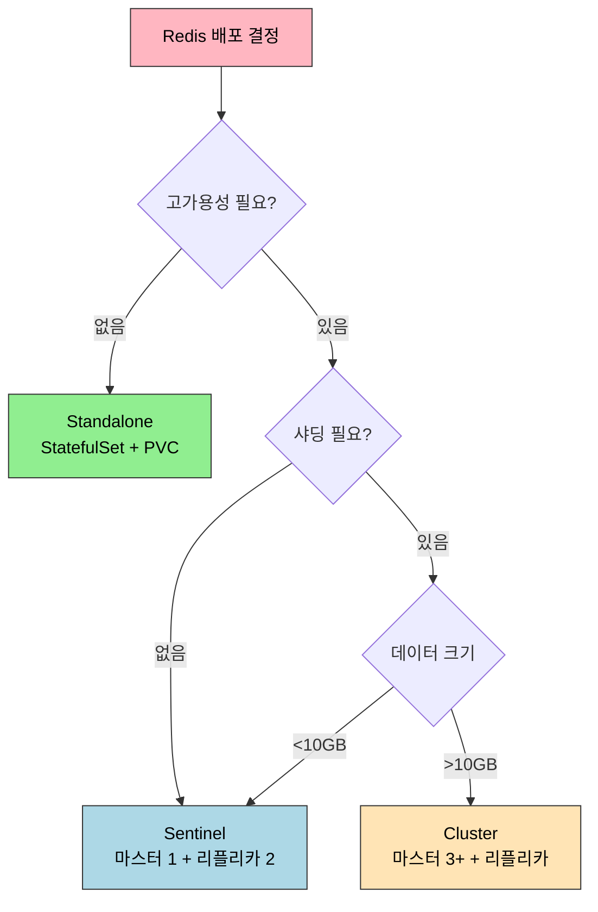

# Redis Operator

> Redis Operator는 Redis Cluster/Sentinel을 Kubernetes 네이티브 방식으로 관리하는 도구입니다. Standalone 배포는 StatefulSet만으로 가능하지만, 프로덕션 고가용성 환경에서는 Sentinel(마스터 1개 + 자동 페일오버) 또는 Cluster(샤딩 + 고가용성)가 필요합니다. OpsTree Redis Operator는 CR로 Redis 인스턴스를 선언하면 Pod, Service, ConfigMap을 자동으로 생성하고 장애 발생 시 페일오버를 처리합니다.


## 학습 목표
> Redis 배포 모드와 Operator 관리 방식을 함께 이해하는 장입니다.

이 장에서 확인할 목표는 다음과 같다:

1. Redis Standalone, Sentinel, Cluster 모드의 차이를 설명할 수 있습니다.
2. OpsTree Redis Operator를 Helm으로 설치하고 Redis Sentinel CR을 배포할 수 있습니다.
3. Redis 마스터 Pod를 삭제했을 때 Sentinel이 자동으로 페일오버하는 과정을 해석할 수 있습니다.
4. Redis Cluster CR을 정의하고 해시 슬롯 분배를 이해할 수 있습니다.
5. 클라이언트에서 Sentinel discovery 또는 Cluster 모드로 연결하는 방법을 설명할 수 있습니다.


## 1. 왜 Redis를 Kubernetes에 올리는가
> 캐시와 세션 저장소로서 Redis를 K8s 위에 올릴 때 기대와 제약을 먼저 봅니다.

Redis는 캐시, 세션 스토어, Pub/Sub, Rate Limiting 등 다양한 용도로 사용됩니다. Kubernetes 환경에서 올리면 애플리케이션 Pod와 동일한 네임스페이스에서 네트워크 정책, Secret, ConfigMap을 일관되게 관리할 수 있습니다. Pod의 CPU/메모리 제한과 QoS로 멀티테넌시 환경에서 인스턴스를 안전하게 격리하고, Helm Chart로 설치하면 환경 간 설정 차이를 최소화할 수 있습니다.

다만 고려사항이 있습니다. AOF/RDB 백업을 사용하면 PersistentVolume이 필요하고, Pod 네트워크를 거쳐 약간의 레이턴시가 추가됩니다. Sentinel/Cluster 모드는 여러 Pod를 조율해야 하므로 Standalone보다 설정이 복잡합니다.


## 2. Redis 배포 모드 비교
> Sentinel과 Cluster가 해결하는 문제가 어떻게 다른지 구분합니다.

| 모드 | 구조 | 고가용성 | 샤딩 | 사용 사례 |
|------|------|---------|------|----------|
| Standalone | 단일 인스턴스 | 없음 | 없음 | 개발 환경, 간단한 캐시 |
| Sentinel | 마스터 1 + 리플리카 N + Sentinel 3 | 자동 페일오버 | 없음 | 세션 스토어, 중소규모 캐시 |
| Cluster | 마스터 3+ + 리플리카 N | 샤드별 페일오버 | 16384 슬롯 | 대규모 캐시, 샤딩 필요 |



**Sentinel** 모드는 마스터 1개 + 리플리카 N개 + Sentinel 3개로 구성됩니다. Sentinel이 마스터를 모니터링하고 장애 시 리플리카를 마스터로 승격시킵니다. 데이터는 단일 마스터에 집중되므로 샤딩은 불가능합니다.

**Cluster** 모드는 최소 마스터 3개가 필요하고 각 마스터는 16384개 슬롯 중 일부를 담당합니다. 클라이언트는 키의 해시를 계산하여 해당 슬롯을 담당하는 마스터에 요청을 보냅니다. 멀티키 연산(MGET, 트랜잭션)이 제한되고 클라이언트가 Cluster 프로토콜을 지원해야 합니다.


## 3. OpsTree Redis Operator 선택 이유
> 현재 문서가 이 Operator를 기준으로 삼는 이유를 정리합니다.

Kubernetes에서 Redis를 운영하는 방법은 Bitnami Helm Chart, Spotahome Redis Operator, OpsTree Redis Operator 세 가지가 있습니다. Bitnami Helm Chart는 Day-2 Operation이 수동이고, Spotahome은 Sentinel 모드만 지원하며 업데이트가 적습니다.

OpsTree Redis Operator를 선택합니다. CR 기반 선언적 관리로 `kind: Redis` CR만 작성하면 StatefulSet, Service, ConfigMap이 자동 생성됩니다. Sentinel/Cluster 모두 지원하고 장애 복구를 자동화하며, GitHub 2k+ stars로 활발히 유지보수됩니다.

다만 Redis는 데이터 성격에 따라 판단이 달라집니다. 캐시라면 빠른 복구와 단순성이 더 중요하고, 영속 데이터를 담는다면 AOF/RDB, PVC 성능, 네트워크 지연을 더 엄격하게 봐야 합니다. Operator는 페일오버를 자동화하지만 데이터 손실 허용 범위를 대신 결정해 주지는 않습니다.


## 4. OpsTree Redis Operator 설치
> 선언형 운영을 위한 설치 단계와 핵심 구성 요소를 봅니다.

```bash
helm repo add ot-helm https://ot-container-kit.github.io/helm-charts/
helm repo update

kubectl create namespace redis-operator
helm install redis-operator ot-helm/redis-operator \
  --namespace redis-operator \
  --set redisOperator.replicas=1
```

CRD가 세 개 생성된다: `redis.redis.redis.opstreelabs.in`, `redisclusters.redis.redis.opstreelabs.in`, `redisreplications.redis.redis.opstreelabs.in`.


## 5. Redis Sentinel CR 배포
> Sentinel 모드에서 primary/replica와 감시 구성이 어떻게 표현되는지 설명합니다.

### 5.1 Secret 생성

```bash
kubectl create secret generic redis-secret \
  --from-literal=password=my-redis-password \
  --namespace default
```

### 5.2 CR 정의

```yaml
apiVersion: redis.redis.opstreelabs.in/v1beta2
kind: Redis
metadata:
  name: redis-sentinel
  namespace: default
spec:
  kubernetesConfig:
    image: quay.io/opstree/redis:v7.0.12
    imagePullPolicy: IfNotPresent
    resources:
      requests:
        cpu: 100m
        memory: 128Mi
      limits:
        cpu: 200m
        memory: 256Mi
    redisSecret:
      name: redis-secret
      key: password
  storage:
    volumeClaimTemplate:
      spec:
        accessModes: ["ReadWriteOnce"]
        resources:
          requests:
            storage: 1Gi
  redisExporter:
    enabled: true
    image: quay.io/opstree/redis-exporter:v1.44.0
  redisConfig:
    additionalRedisConfig: |
      maxmemory 200mb
      maxmemory-policy allkeys-lru
  redisSentinel:
    enabled: true
    replicas: 3
    quorum: 2
    sentinelConfig:
      downAfterMilliseconds: 30000
      failoverTimeout: 180000
      parallelSyncs: 1
```

`redisSentinel.quorum: 2`는 Sentinel 2개 이상이 동의해야 페일오버를 시작한다는 의미입니다. `downAfterMilliseconds: 30000`은 마스터가 30초 응답 없으면 장애로 판단합니다.

### 5.3 생성된 리소스

Operator가 다음을 생성합니다.

- **StatefulSet** `redis-sentinel`: 마스터 1 + 리플리카 2 (총 3 Pod)
- **Deployment** `redis-sentinel-sentinel`: Sentinel 3 Pod
- **Service** `redis-sentinel`: 마스터 Service (6379 포트)
- **Service** `redis-sentinel-sentinel`: Sentinel Service (26379 포트)
- **Service** `redis-sentinel-additional`: 헤드리스 Service (Pod discovery)

각 Redis Pod는 redis 컨테이너(6379)와 redis-exporter 컨테이너(9121) 두 개를 실행합니다.


## 6. Redis Cluster CR 배포
> 슬롯 기반 분산 구성이 선언형 CR로 어떻게 관리되는지 봅니다.

```yaml
apiVersion: redis.redis.opstreelabs.in/v1beta2
kind: RedisCluster
metadata:
  name: redis-cluster
  namespace: default
spec:
  clusterSize: 3
  clusterReplicas: 1
  kubernetesConfig:
    image: quay.io/opstree/redis:v7.0.12
    resources:
      requests:
        cpu: 100m
        memory: 128Mi
      limits:
        cpu: 200m
        memory: 256Mi
    redisSecret:
      name: redis-secret
      key: password
  storage:
    volumeClaimTemplate:
      spec:
        accessModes: ["ReadWriteOnce"]
        resources:
          requests:
            storage: 1Gi
```

`clusterSize: 3`은 마스터 3개를, `clusterReplicas: 1`은 마스터당 리플리카 1개를 의미합니다. 총 6 Pod(마스터 3 + 리플리카 3)가 생성됩니다.

Operator가 자동으로 `redis-cli --cluster create`를 실행하여 슬롯을 초기화합니다. 마스터 3개가 각각 5461, 5462, 5461 슬롯을 담당합니다.

해시 슬롯 동작 원리는 이렇습니다. Redis Cluster는 키를 CRC16 해시로 변환하고 16384로 나눈 나머지를 슬롯 번호로 사용합니다. 클라이언트는 첫 요청 시 `CLUSTER SLOTS` 명령으로 슬롯 매핑을 받아오고, 잘못된 노드에 요청하면 `-MOVED 12345 redis-cluster-leader-2:6379` 응답으로 리다이렉트됩니다.


## 7. 클라이언트 연결
> Redis 배포 모드별로 애플리케이션 연결 전략이 어떻게 달라지는지 정리합니다.

### 7.1 Sentinel 모드 (Go 예시)

```go
client := redis.NewFailoverClient(&redis.FailoverOptions{
    MasterName:    "mymaster",
    SentinelAddrs: []string{
        "redis-sentinel-sentinel.default.svc.cluster.local:26379",
    },
    Password: "my-redis-password",
})
```

클라이언트가 Sentinel에게 `SENTINEL get-master-addr-by-name mymaster`를 요청하면 현재 마스터 주소가 반환됩니다. 마스터가 죽으면 Sentinel이 페일오버를 수행하고 클라이언트가 자동으로 새 마스터를 발견합니다.

### 7.2 Cluster 모드 (Go 예시)

```go
client := redis.NewClusterClient(&redis.ClusterOptions{
    Addrs: []string{
        "redis-cluster-leader-0.redis-cluster-leader-headless.default.svc.cluster.local:6379",
        "redis-cluster-leader-1.redis-cluster-leader-headless.default.svc.cluster.local:6379",
        "redis-cluster-leader-2.redis-cluster-leader-headless.default.svc.cluster.local:6379",
    },
    Password: "my-redis-password",
})
```

Sentinel/Cluster 모드에서 클라이언트가 특정 마스터에 연결해야 하므로 Headless Service DNS 이름을 사용합니다.


## 8. 장애 테스트: Sentinel 자동 페일오버
> 장애 시 Sentinel 기반 승격이 실제로 어떻게 일어나는지 확인합니다.

```bash
# 현재 마스터 확인
kubectl exec -it redis-sentinel-sentinel-<pod> -- redis-cli -p 26379 \
  sentinel master mymaster | grep -E "^(name|ip|port)"
# redis-sentinel-0이 마스터

# 마스터 Pod 삭제
kubectl delete pod redis-sentinel-0

# Sentinel 로그 관찰
kubectl logs redis-sentinel-sentinel-<pod> -f
```

페일오버 로그에서 다음 이벤트가 순서대로 나타납니다.

```
+sdown master mymaster redis-sentinel-0... 6379
+odown master mymaster ...  #quorum 2/2
+failover-triggered master mymaster ...
+selected-slave slave redis-sentinel-1...
+failover-state-send-slaveof-noone slave redis-sentinel-1...
+promoted-slave slave redis-sentinel-1...
+slave-reconf-sent slave redis-sentinel-2...
+failover-end master mymaster ...
+switch-master mymaster redis-sentinel-0... redis-sentinel-1...
```

`+sdown`은 단일 Sentinel의 주관적 판단이고, `+odown`은 quorum 충족 후 객관적 장애 확정입니다. `+switch-master`에서 마스터가 `redis-sentinel-1`으로 변경되었음을 알립니다.

StatefulSet이 `redis-sentinel-0`을 자동으로 재생성하고, 이 Pod는 새 마스터(`redis-sentinel-1`)의 리플리카로 합류합니다.


## 9. minikube 고려사항
> 학습 환경과 운영 환경 사이의 차이를 명확히 구분합니다.

minikube에서는 Sentinel 모드를 권장합니다. Cluster 모드와 Pod 수는 비슷하지만 Sentinel이 더 가볍고, 클라이언트 라이브러리가 Sentinel discovery를 더 잘 지원하며, 개발 환경에서는 샤딩이 필요 없습니다.

리소스가 부족하면 Redis Pod의 제한을 줄입니다.

```yaml
resources:
  requests:
    cpu: 50m
    memory: 64Mi
  limits:
    cpu: 100m
    memory: 128Mi
```

Redis Exporter를 비활성화(`redisExporter.enabled: false`)하면 각 Redis Pod가 단일 컨테이너만 실행하여 메모리 사용량이 50% 감소합니다. PVC를 프로비저닝할 수 없는 환경에서는 `emptyDir`로 대체하되 Pod 재시작 시 데이터가 사라진다는 점을 감수해야 합니다.


## 10. 점검 질문
> Redis Sentinel과 Cluster 운영 차이를 질문 중심으로 다시 점검합니다.

### Q1. Redis Sentinel vs Cluster 모드 선택 기준은?

Sentinel은 데이터 크기가 10GB 미만이고 단일 마스터의 쓰기 성능(초당 10만 ops)으로 충분하며 멀티키 연산(MGET, MSET, 트랜잭션)을 자주 사용하는 경우에 적합합니다. 고가용성은 필요하지만 샤딩이 불필요한 세션 스토어, 소규모 캐시에 맞습니다.

Cluster는 데이터 크기가 10GB 이상이거나 쓰기 부하가 단일 노드를 초과하거나 수평 확장이 필요한 경우에 적합합니다. 대규모 캐시, 순위표, 분산 카운터에 적합합니다.

멀티키 연산 제약이 중요한 판단 기준입니다. Cluster 모드에서 `MGET key1 key2`는 두 키가 같은 슬롯에 있어야 실행 가능합니다. Hash Tag(`{user:1000}:session`, `{user:1000}:cart`)로 같은 슬롯에 강제 배치할 수 있지만 샤딩 효율이 떨어집니다.

클라이언트 복잡도도 고려해야 합니다. Sentinel은 대부분의 클라이언트가 지원하지만, Cluster는 클라이언트가 MOVED/ASK 리다이렉션을 처리해야 합니다. 일부 언어는 Cluster 클라이언트 성숙도가 낮습니다.

운영 복잡도는 비슷합니다. Sentinel은 총 6개 Pod(Redis 3 + Sentinel 3)이고 Cluster도 최소 6개 Pod(마스터 3 + 리플리카 3)입니다. Cluster가 노드 추가 시 슬롯 리밸런싱이 필요하여 운영이 더 복잡합니다.

심화. Sentinel 마스터가 10GB 메모리 제한에 도달하면 Cluster로 마이그레이션해야 합니다. `redis-cli --cluster` 명령으로 데이터를 이동할 수 있지만 다운타임 없이 하려면 Cluster를 새로 구성하고 Replication으로 동기화한 뒤 트래픽을 전환하는 Blue-Green 방식을 사용합니다.

### Q2. Sentinel이 마스터 장애를 감지하고 페일오버하는 과정은?

각 Sentinel은 마스터에게 1초마다 PING을 보내고 `down-after-milliseconds`(기본 30초) 동안 응답이 없으면 SDOWN(Subjectively Down)으로 표시합니다. 이것은 단일 Sentinel의 주관적 판단입니다.

Sentinel은 다른 Sentinel들에게 `SENTINEL is-master-down-by-addr` 명령을 보내 마스터 상태를 물어봅니다. `quorum` 개수 이상의 Sentinel이 SDOWN에 동의하면 ODOWN(Objectively Down)으로 전환하고 페일오버를 시작합니다.

ODOWN 상태가 되면 Sentinel들이 투표하여 페일오버를 수행할 리더 Sentinel을 선출합니다. 과반수 이상의 표를 받은 Sentinel이 리더가 됩니다. 리더 Sentinel이 리플리카 중 하나를 새 마스터로 선택합니다. 선택 기준은 마스터와 연결이 끊긴 시간이 짧을수록, 리플리카 우선순위가 높을수록, 복제 오프셋이 클수록 우선됩니다.

선택된 리플리카에 `SLAVEOF NO ONE` 명령을 보내 마스터로 승격합니다. 나머지 리플리카들에게는 `SLAVEOF <새 마스터>` 명령을 보내 새 마스터를 따르도록 설정합니다. `parallel-syncs` 설정에 따라 병렬로 수행됩니다.

심화. Sentinel 2개가 죽으면 quorum=2인 경우 페일오버 시작이 불가능합니다. Sentinel은 홀수로, 쿼럼은 과반수 이상으로 설정하는 것이 중요합니다.

### Q3. Redis Cluster의 해시 슬롯 분배와 리밸런싱은?

클러스터 초기화 시 `redis-cli --cluster create`가 16384개 슬롯을 마스터 수로 균등 분배합니다. 마스터 3개이면 각각 5461, 5462, 5461 슬롯을 담당합니다.

키를 CRC16 해시로 변환하고 16384로 나눈 나머지가 슬롯 번호입니다. 슬롯 12345를 담당하는 마스터가 해당 키를 저장합니다.

노드 추가 시 리밸런싱은 `redis-cli --cluster reshard`로 수행합니다. 기존 마스터들로부터 슬롯을 이동하는데, 슬롯 이동 중에도 서비스는 계속되며 클라이언트는 ASK 리다이렉션으로 이동 중인 키에 접근합니다.

슬롯 이동 과정은 다음과 같습니다. 대상 마스터에 `CLUSTER SETSLOT <slot> IMPORTING` 전송, 소스 마스터에 `CLUSTER SETSLOT <slot> MIGRATING` 전송, 소스에서 `MIGRATE` 명령으로 키를 대상으로 전송, 이동 완료 시 `CLUSTER SETSLOT <slot> NODE` 명령으로 매핑 업데이트.

이동 중 클라이언트가 소스에 요청하면 `-ASK` 응답을 받고 대상 마스터에 `ASKING` 명령 후 재요청합니다. 이동 완료 후에는 `-MOVED` 응답으로 영구 리다이렉션합니다.

심화. 슬롯 리밸런싱 중에도 데이터 일관성은 보장됩니다. 키 이동은 원자적으로 처리되며 소스에서 삭제되기 전에 대상에 복사됩니다.

### Q4. Kubernetes Service와 Sentinel discovery 통합 방식은?

OpsTree Operator는 `redis-sentinel-sentinel` Service(ClusterIP, 26379)를 생성하여 3개 Sentinel Pod를 로드밸런싱합니다. 클라이언트는 이 Service DNS를 Sentinel 주소로 사용합니다.

`redis-sentinel-additional` Headless Service는 StatefulSet Pod의 고정 DNS 이름을 제공한다(`redis-sentinel-0.redis-sentinel-additional.default.svc.cluster.local`). Sentinel이 마스터 주소를 반환할 때 이 DNS 이름을 사용합니다.

클라이언트 연결 흐름은 이렇습니다. 클라이언트가 `redis-sentinel-sentinel:26379`에 연결하면 Service가 3개 Sentinel 중 하나로 라우팅합니다. Sentinel이 `SENTINEL get-master-addr-by-name mymaster` 응답으로 현재 마스터의 Headless DNS 이름을 반환합니다. 클라이언트가 해당 주소로 Redis에 연결합니다.

페일오버 시 Service 엔드포인트는 업데이트되지 않습니다. Service는 여전히 모든 Pod를 가리킵니다. 클라이언트는 Sentinel에게 다시 물어봐서 새 마스터를 발견합니다. 이것이 Sentinel discovery를 사용하는 핵심 이유입니다.

Sentinel Service가 3개 Pod를 로드밸런싱하므로 Sentinel 1개가 죽어도 클라이언트는 계속 연결 가능합니다.

심화. Sentinel이 페일오버를 수행한 후 Kubernetes Service Endpoint가 업데이트되지 않아도 문제없습니다. 클라이언트가 Redis 연결을 Sentinel을 통해 발견하기 때문입니다.

### Q5. Redis Operator가 자동화하는 Day-2 Operation은?

리플리카 스케일링은 StatefulSet replicas를 변경하면 Operator가 새 리플리카 Pod를 생성하고 Sentinel이 새 리플리카를 마스터에 연결(`SLAVEOF`)합니다.

버전 업그레이드는 `kubernetesConfig.image`를 변경하면 Operator가 StatefulSet Rolling Update를 수행합니다. Sentinel 모드는 리플리카 → 마스터 순서로 업그레이드하여 다운타임을 최소화합니다.

백업은 OpsTree Operator가 자동화하지 않습니다. CronJob으로 `redis-cli --rdb /backup/dump.rdb`를 실행하거나 Velero로 PVC 스냅샷을 생성해야 합니다.

장애 복구는 Sentinel 모드에서 마스터 Pod 삭제 시 Sentinel이 자동 페일오버를 수행하고, Cluster 모드에서는 리플리카가 자동으로 승격됩니다. Operator는 CR 상태를 업데이트하지만 실제 페일오버는 Redis/Sentinel 프로토콜이 수행합니다.

심화. Operator가 백업/복원을 자동화하지 않는 이유는 Redis의 백업 방식이 RDB/AOF 두 가지이고 각각 트레이드오프가 다르기 때문입니다. 운영 환경에 따라 전략이 달라야 하므로 Operator가 강제하지 않습니다.

### Q6. Standalone Redis와 Operator 관리 Redis의 차이는?

StatefulSet으로 Standalone Redis를 배포하면 단일 장애점(SPOF)이 됩니다. 마스터 Pod가 죽으면 StatefulSet이 자동으로 재시작하지만 수십 초의 서비스 중단이 발생합니다.

StatefulSet으로 마스터 1 + 리플리카 2를 배포하고 수동으로 `SLAVEOF`로 복제를 설정할 수 있지만 마스터 장애 시 자동 페일오버가 없습니다. 운영자가 수동으로 리플리카를 마스터로 승격해야 합니다.

Operator는 CR로 선언적 관리를 제공합니다. `kind: Redis` 하나로 StatefulSet, Service, ConfigMap이 자동 생성됩니다. Sentinel/Cluster 프로토콜로 장애 감지와 자동 페일오버가 이루어집니다.

Redis는 Deployment가 아닌 StatefulSet으로 배포해야 합니다. Pod 이름이 고정되어(`redis-0`, `redis-1`) Headless Service DNS로 접근 가능하고, PVC가 Pod에 바인딩되어 재시작 시에도 데이터가 보존되며, 순차 시작/종료로 복제 관계가 유지됩니다.

개발/테스트 환경에서 간단한 캐시만 필요하다면 Standalone으로 충분합니다. 프로덕션에서는 Operator 또는 관리형 서비스(AWS ElastiCache, GCP Memorystore)를 사용하는 것이 권장됩니다.

심화. Helm Chart(Bitnami)로 Sentinel을 배포하면 페일오버는 Redis/Sentinel 프로토콜이 자동으로 처리하지만, Day-2 Operation(스케일링, 버전 업그레이드, 모니터링 통합)은 Helm values를 수동으로 수정해야 합니다. Operator는 이 과정을 CR 변경으로 추상화합니다.

---


## 11. 정리
> Redis Operator 학습에서 가져가야 할 핵심 판단만 짧게 묶습니다.

핵심 개념 체크리스트:

- Redis 배포 모드: Standalone(개발), Sentinel(자동 페일오버), Cluster(샤딩 + 고가용성)
- OpsTree Redis Operator: CR 기반 선언적 관리, Sentinel/Cluster 모두 지원
- Sentinel 모드: 마스터 1 + 리플리카 2 + Sentinel 3. quorum 충족 시 페일오버
- Cluster 모드: 마스터 3 + 리플리카 3. 16384 슬롯을 마스터가 분담
- 클라이언트 연결: Sentinel discovery(26379) 또는 Cluster slots(6379)
- minikube: Sentinel 모드 추천, 리소스 제한 완화, Ephemeral storage 가능


## 관련 문서
> 앞선 PostgreSQL 장, 다음 Kafka 장, 점검 문서를 함께 둡니다.

- [PostgreSQL Operator](08-03.PostgreSQL%20Operator.md) — 이전 절
- [Kafka Operator](08-05.Kafka%20Operator.md) — 다음 절, Strimzi 기반 Kafka 운영
