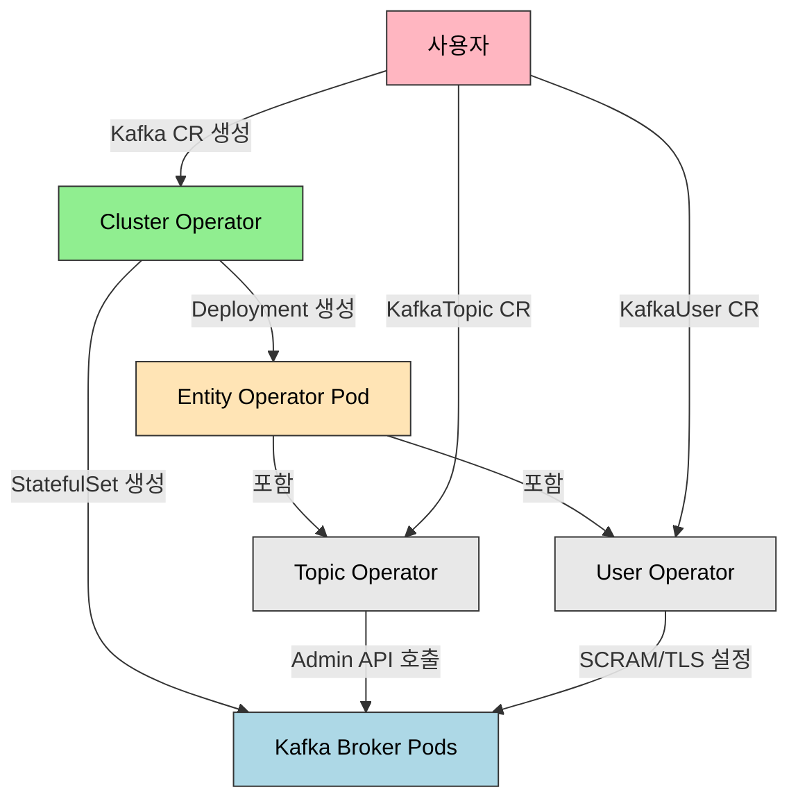

# Kafka Operator

> Strimzi는 Kafka를 Kubernetes 네이티브 방식으로 운영하는 CNCF Sandbox 프로젝트입니다. Kafka CR로 브로커 수, 리스너, 스토리지, 리소스를 선언하면 Cluster Operator가 StatefulSet, Service, ConfigMap을 자동 생성합니다. Kafka 4.0부터 기본이 될 KRaft 모드는 ZooKeeper를 제거하고 Kafka 자체가 Raft 프로토콜로 메타데이터를 관리하여 아키텍처를 단순화합니다.


## 학습 목표
> Kafka 운영 지식을 Strimzi가 어떤 리소스로 추상화하는지 이해하는 장입니다.

이 장에서 확인할 목표는 다음과 같다:

1. Strimzi Operator 아키텍처(Cluster, Entity, Topic, User Operator)를 설명할 수 있습니다.
2. Kafka CR을 KRaft 모드로 정의하고 클러스터를 배포하는 흐름을 이해할 수 있습니다.
3. `KafkaTopic` CR로 토픽을 생성하고 메시지를 송수신하는 방식을 설명할 수 있습니다.
4. Kafka listener 타입(`internal`, `route`, `nodeport`, `loadbalancer`)의 차이를 설명할 수 있습니다.
5. KRaft 모드와 ZooKeeper 모드의 차이를 이해할 수 있습니다.
6. minikube에서 1 broker Kafka의 한계를 파악하고 프로덕션 설정과 비교할 수 있습니다.


## 1. 왜 Kafka를 Kubernetes에 올리는가
> 메시지 브로커를 K8s에 올릴 때 기대하는 자동화와 부담을 함께 봅니다.

Apache Kafka는 대규모 메시지 처리, 이벤트 소싱, CDC(Change Data Capture), 로그 수집에 사용됩니다. Kubernetes 환경에서는 Kafka 브로커, Kafka Connect, Schema Registry를 Kubernetes Pod로 관리하면 스케일링, 재시작, 롤링 업데이트를 Kubernetes API로 통합할 수 있습니다. Kafka 클러스터를 YAML로 정의하고 GitOps로 버전 관리하면 환경 간 설정 차이를 최소화할 수 있습니다.

다만 고려사항이 있습니다. Kafka는 디스크 I/O가 중요하므로 PersistentVolume의 IOPS와 처리량이 프로덕션 요구사항을 충족하는지 확인해야 합니다. StatefulSet으로 배포하므로 Pod가 재스케줄될 때 동일 PVC를 재사용해야 합니다.

이 장에서는 **Strimzi**를 선택합니다. Apache 2.0 라이선스의 오픈소스이고, Apache Kafka 공식 배포판을 사용하며, CNCF Sandbox 프로젝트로 Red Hat, IBM 등이 기여하고 있습니다.


## 2. Strimzi 아키텍처
> Strimzi가 어떤 Operator들로 Kafka 생명주기를 나누어 관리하는지 설명합니다.

Strimzi는 여러 Operator로 구성되어 있으며 각 Operator가 특정 리소스를 관리합니다.



**Cluster Operator** 는 Kafka CR을 읽고 StatefulSet, Service, ConfigMap, PVC, Secret을 생성합니다. KafkaConnect, KafkaMirrorMaker2, KafkaBridge CR도 관리합니다. 여러 Namespace를 감시할 수 있습니다.

**Entity Operator** 는 단일 Pod에서 Topic Operator와 User Operator를 실행합니다. Cluster Operator가 Kafka CR을 배포할 때 자동으로 생성됩니다.

**Topic Operator** 는 KafkaTopic CR을 감시하고 Kafka Admin API로 토픽을 생성/수정/삭제합니다. 양방향 동기화를 수행하므로, Strimzi 사용 시 `kafka-topics.sh`로 직접 토픽을 생성하면 CR과 충돌할 수 있습니다.

**User Operator** 는 KafkaUser CR을 감시하고 SCRAM-SHA-512 또는 TLS mTLS 인증을 설정합니다. SCRAM 사용자 생성 시 비밀번호를 Secret으로 저장합니다.

| Operator | 관리 대상 | 생성 리소스 | CR 예시 |
|----------|----------|------------|---------|
| Cluster Operator | Kafka 클러스터 | StatefulSet, Service | `Kafka`, `KafkaConnect` |
| Topic Operator | Kafka 토픽 | (Kafka 내부 토픽) | `KafkaTopic` |
| User Operator | Kafka 사용자 | Secret (SCRAM 비밀번호) | `KafkaUser` |


## 3. KRaft 모드와 ZooKeeper 모드 비교
> 최신 Kafka 운영에서 왜 KRaft가 기본 흐름이 되었는지 정리합니다.

| 항목 | ZooKeeper 모드 | KRaft 모드 |
|------|---------------|-----------|
| 메타데이터 저장 | ZooKeeper (별도 클러스터) | Kafka 자체 (Raft 로그) |
| 아키텍처 | Kafka 브로커 + ZooKeeper 앙상블 | 브로커/컨트롤러 통합 |
| 복잡도 | 높음 (2개 시스템 운영) | 낮음 (단일 시스템) |
| 파티션 수 제한 | ~20만 (ZooKeeper 메모리 제약) | 수백만 (Raft 로그) |
| 리더 선출 속도 | 느림 (수초) | 빠름 (수백ms) |
| Kafka 버전 | 3.x 이하 기본 | 3.3+ (실험), 4.0+ (기본) |

KRaft 모드의 핵심 장점은 단일 시스템 운영입니다. ZooKeeper 3개 Pod를 제거하여 리소스를 절약하고 운영 복잡도를 낮춥니다. Raft 로그는 디스크 기반이므로 ZooKeeper 대비 파티션 수 제한이 없고, 리더 선출이 수백ms로 단축됩니다.

KRaft 모드는 Combined 모드(브로커 + 컨트롤러 통합)와 Dedicated 모드(컨트롤러 전용 Pod)를 지원합니다. 학습 환경에서는 Combined가 단순하지만, 프로덕션에서는 컨트롤러 역할과 브로커 역할을 분리해 장애 반경과 리소스 경합을 줄이는 구성이 더 자연스럽습니다.

`spec.zookeeper` 섹션이 없으면 Strimzi 0.32+ 버전에서 자동으로 KRaft 모드로 동작합니다.

실무에서는 "이제 ZooKeeper를 완전히 잊어도 된다"로 단순화하면 안 됩니다. 새 클러스터는 KRaft가 자연스럽지만, 기존 ZooKeeper 기반 클러스터는 마이그레이션 전략, 운영 도구 호환성, 버전 조합을 함께 검토해야 합니다.


## 4. Strimzi 설치
> Kafka 운영을 시작하기 위한 컨트롤 플레인 설치 단계를 간단히 봅니다.

```bash
helm repo add strimzi https://strimzi.io/charts/
helm repo update

kubectl create namespace kafka
helm install strimzi-kafka-operator strimzi/strimzi-kafka-operator \
  --namespace kafka \
  --set watchNamespaces="{kafka}" \
  --set logLevel=INFO
```

설치되는 주요 리소스는 `strimzi-cluster-operator` Deployment와 `kafkas.kafka.strimzi.io`, `kafkatopics.kafka.strimzi.io` 등 다수의 CRD다.


## 5. Kafka CR 정의 (KRaft 모드)
> 클러스터 토폴로지와 저장소, 자원 설정을 선언형으로 표현하는 방식을 설명합니다.

```yaml
apiVersion: kafka.strimzi.io/v1beta2
kind: Kafka
metadata:
  name: my-cluster
  namespace: kafka
spec:
  kafka:
    version: 3.8.0
    replicas: 1
    listeners:
      - name: plain
        port: 9092
        type: internal
        tls: false
      - name: tls
        port: 9093
        type: internal
        tls: true
    config:
      offsets.topic.replication.factor: 1
      transaction.state.log.replication.factor: 1
      transaction.state.log.min.isr: 1
      default.replication.factor: 1
      min.insync.replicas: 1
      log.retention.hours: 168
    storage:
      type: ephemeral
    resources:
      requests:
        memory: 512Mi
        cpu: 250m
      limits:
        memory: 1Gi
        cpu: 500m
  entityOperator:
    topicOperator: {}
    userOperator: {}
```

주요 필드 설명입니다. `kafka.replicas`는 브로커 수로 minikube에서는 1, 프로덕션에서는 3 이상 권장합니다. `kafka.storage.type: ephemeral`은 emptyDir을 사용하여 Pod 재시작 시 데이터가 사라집니다. 프로덕션에서는 `persistent-claim`으로 변경해야 합니다. `offsets.topic.replication.factor: 1`은 1 broker이므로 반드시 1로 설정해야 합니다.

Cluster Operator가 다음 리소스를 생성합니다.

- **StatefulSet** `my-cluster-kafka`: 브로커 1 Pod
- **Service** `my-cluster-kafka-bootstrap`: ClusterIP (9092, 9093 포트, 클라이언트 연결)
- **Service** `my-cluster-kafka-brokers`: 헤드리스 Service (브로커 간 통신)
- **Deployment** `my-cluster-entity-operator`: Topic + User Operator


## 6. Listener 타입
> 내부 통신과 외부 통신을 어떤 Listener 조합으로 나눌지 정리합니다.

| 타입 | 설명 | 사용 사례 | 프로덕션 |
|------|------|----------|---------|
| internal | ClusterIP Service | Pod 간 통신 | 권장 |
| route | OpenShift Route | 외부 접근 (OpenShift 전용) | OpenShift 한정 |
| nodeport | NodePort Service | 외부 접근 (개발용) | 비권장 |
| loadbalancer | LoadBalancer Service | 외부 접근 (Cloud LB) | 권장 |
| ingress | Ingress + TLS Passthrough | 외부 접근 | 조건부 권장 |

**internal** 은 가장 낮은 레이턴시를 제공하며 클러스터 내부 Pod만 접근 가능합니다. `my-cluster-kafka-bootstrap.kafka.svc.cluster.local:9092`로 연결합니다.

**loadbalancer** 는 클라우드 로드밸런서를 통해 외부 접근이 가능합니다. Strimzi가 브로커당 LoadBalancer Service를 생성하므로 각 브로커에 고정 외부 IP가 부여됩니다. TLS 필수 권장입니다.

minikube에서는 **internal** 만 사용합니다. 외부 접근이 필요하면 `kubectl port-forward`를 사용합니다.

```bash
kubectl port-forward svc/my-cluster-kafka-bootstrap 9092:9092 -n kafka
```


## 7. KafkaTopic CR
> 토픽을 운영 산출물이 아니라 선언형 리소스로 다루는 방법을 설명합니다.

```yaml
apiVersion: kafka.strimzi.io/v1beta2
kind: KafkaTopic
metadata:
  name: my-topic
  namespace: kafka
  labels:
    strimzi.io/cluster: my-cluster
spec:
  partitions: 3
  replicas: 1
  config:
    retention.ms: 604800000
    segment.bytes: 1073741824
    compression.type: producer
```

`labels.strimzi.io/cluster`는 어떤 Kafka 클러스터에 속하는지 명시하는 필수 레이블입니다. Topic Operator가 이 레이블을 보고 해당 Kafka 클러스터에 토픽을 생성합니다.

```bash
kubectl get kafkatopic -n kafka
# NAME       CLUSTER      PARTITIONS   REPLICATION FACTOR   READY
# my-topic   my-cluster   3            1                    True
```

Strimzi 사용 시 `kafka-topics.sh`로 직접 토픽을 생성하면 Topic Operator가 이를 감지하고 CR을 생성하려 시도하는데 충돌이 발생할 수 있습니다. KafkaTopic CR만 사용하는 것이 권장됩니다.


## 8. KafkaUser CR (SCRAM 인증)
> 사용자와 인증 정보를 클러스터 안에서 어떻게 관리하는지 봅니다.

```yaml
apiVersion: kafka.strimzi.io/v1beta2
kind: KafkaUser
metadata:
  name: my-user
  namespace: kafka
  labels:
    strimzi.io/cluster: my-cluster
spec:
  authentication:
    type: scram-sha-512
  authorization:
    type: simple
    acls:
      - resource:
          type: topic
          name: my-topic
        operations: [Read, Write, Describe]
      - resource:
          type: group
          name: my-consumer-group
        operations: [Read]
```

User Operator가 SCRAM 사용자를 생성하고 비밀번호를 Secret(`my-user`)에 저장합니다. 이 Secret을 클라이언트 Pod에 마운트하여 인증합니다.


## 9. 프로듀서/컨슈머 테스트
> 선언형 구성이 실제 애플리케이션 연결까지 이어지는지 확인합니다.

```bash
# 프로듀서
kubectl exec -it my-cluster-kafka-0 -n kafka -- bin/kafka-console-producer.sh \
  --bootstrap-server localhost:9092 \
  --topic my-topic
# > Hello Kafka
# > (Ctrl+C 종료)

# 컨슈머 (별도 터미널)
kubectl exec -it my-cluster-kafka-0 -n kafka -- bin/kafka-console-consumer.sh \
  --bootstrap-server localhost:9092 \
  --topic my-topic \
  --from-beginning
# Hello Kafka
```


## 10. minikube 고려사항
> 단일 노드 학습 환경에서 Kafka를 다룰 때 생기는 제약을 분명히 합니다.

minikube에서는 1 broker + KRaft + ephemeral storage + replication factor 1을 권장합니다. ZooKeeper를 제거하면 총 2 Pod(Kafka 1 + Entity Operator 1)만 필요합니다.

| 항목 | minikube | 프로덕션 |
|------|----------|---------|
| 브로커 수 | 1 | 3 이상 |
| 스토리지 | ephemeral | persistent-claim (10GB 이상) |
| Replication Factor | 1 | 3 |
| Min ISR | 1 | 2 |
| 리소스 | 250m/512Mi | 1000m/4Gi |
| Listener | internal | loadbalancer/ingress |

메모리 부족 시 Kafka Pod의 리소스 제한을 줄이되, 256Mi 이하로 내리면 OOMKilled가 발생할 수 있습니다. JMX Exporter를 비활성화하면 메모리 사용량이 약 100Mi 감소합니다.


## 11. 점검 질문
> Kafka Operator 운영 포인트를 토픽, 인증, 장애 대응 관점에서 다시 점검합니다.

### Q1. Strimzi의 Cluster/Entity/Topic/User Operator 각각의 역할

Strimzi는 4개의 Operator로 구성되어 있으며 각자 관심사가 다릅니다.

**Cluster Operator**는 Kafka 클러스터 전체 생명주기를 관리합니다. Kafka CR을 감시하고 StatefulSet, Service, ConfigMap, PVC를 생성/업데이트/삭제합니다. KafkaConnect, KafkaMirrorMaker2, KafkaBridge CR도 담당합니다. Cluster-scoped이며 `watchNamespaces` 설정으로 여러 Namespace를 감시할 수 있습니다.

**Entity Operator**는 Topic Operator와 User Operator를 단일 Pod에서 실행합니다. Cluster Operator가 Kafka CR을 배포할 때 Entity Operator Deployment도 자동 생성합니다. Namespace-scoped이며 Kafka 클러스터당 1개 Pod가 실행됩니다.

**Topic Operator**는 KafkaTopic CR을 감시하고 Kafka Admin API(`AdminClient`)로 토픽을 생성/수정/삭제합니다. 양방향 동기화를 수행합니다. CR 변경이 Kafka에 반영되고, Kafka 토픽 변경이 CR 상태 업데이트로 이어집니다. `kafka-topics.sh`로 직접 토픽을 생성하면 Topic Operator가 이를 감지하고 CR 생성을 시도하는데 충돌이 발생할 수 있습니다.

**User Operator**는 KafkaUser CR을 감시하고 SCRAM-SHA-512 또는 TLS mTLS 인증 및 ACL을 설정합니다. SCRAM 사용자 생성 시 비밀번호를 Secret으로 저장합니다.

4개로 분리한 이유는 세 가지입니다.

1. 관심사 분리입니다. Cluster Operator는 인프라(Pod, Service), Topic/User Operator는 애플리케이션 리소스(토픽, 사용자)를 담당합니다.
2. 권한 분리입니다. Cluster Operator는 ClusterRole이 필요하고, Topic/User Operator는 Role만 필요합니다.
3. 스케일링입니다. Kafka 클러스터 100개가 있어도 Cluster Operator는 1개지만 Entity Operator는 클러스터당 1개씩 100개가 실행됩니다.

협력 방식은 이렇습니다. Cluster Operator가 Kafka CR의 `spec.entityOperator` 섹션을 읽고 Entity Operator Deployment를 생성합니다. Entity Operator는 같은 Namespace의 KafkaTopic/KafkaUser CR만 감시하며 `labels.strimzi.io/cluster`로 어떤 Kafka 클러스터에 속하는지 판단합니다.

심화. Topic Operator를 비활성화하고 `kafka-topics.sh`로 직접 관리하면 GitOps 통합이 어렵습니다. 이력 추적을 포기하는 대신 Kafka Admin API의 모든 기능을 사용할 수 있습니다.

### Q2. KRaft 모드와 ZooKeeper 모드의 차이 (Kafka 4.0 방향)

ZooKeeper 모드는 메모리에 모든 메타데이터를 저장하므로 약 20만 파티션이 한계입니다. 대규모 멀티테넌시 환경에서 병목이 생기고, Kafka와 ZooKeeper 두 시스템을 별도로 운영해야 합니다. 컨트롤러 브로커가 죽으면 ZooKeeper Watch로 감지하고 새 컨트롤러를 선출하는 데 수초가 소요되며, 이 시간 동안 메타데이터 업데이트가 불가능합니다.

KRaft는 이 문제를 해결합니다. Kafka만 운영하면 되므로 운영 복잡도가 크게 줄어든다(Pod 수, 설정 파일, 모니터링 대상 감소). Raft 로그는 디스크 기반이므로 수백만 파티션을 지원합니다. Raft 프로토콜로 과반수 투표를 통해 수백ms 내 새 컨트롤러를 선출하므로 메타데이터 업데이트 중단 시간이 크게 줄어듭니다.

메타데이터는 `__cluster_metadata` 내부 토픽에 저장됩니다. 컨트롤러만 쓸 수 있고, 복제 계수는 컨트롤러 수(보통 3)와 동일합니다.

Strimzi는 Combined 모드(브로커 + 컨트롤러 통합)를 기본으로 사용합니다. Dedicated 모드(컨트롤러 전용 노드)는 100개 이상 브로커의 대규모 클러스터에서 컨트롤러 부하를 분리할 때 사용합니다.

Kafka 4.0에서 ZooKeeper 지원이 완전히 제거되어 KRaft만 지원합니다. 3.x에서 4.0으로 업그레이드하려면 먼저 KRaft로 마이그레이션이 필수입니다. Strimzi에서는 아직 이 마이그레이션이 자동화되지 않았습니다.

심화. KRaft의 컨트롤러 쿼럼이 과반수를 잃으면(3개 중 2개가 죽으면) 새 컨트롤러 선출이 불가능합니다. 브로커는 이미 복제된 데이터로 메시지를 계속 처리할 수 있지만, 파티션 리더 변경 같은 메타데이터 작업이 중단됩니다.

### Q3. Kafka listener 타입(internal, route, nodeport, ingress, loadbalancer) 선택 기준

**internal(ClusterIP)**은 Kubernetes 클러스터 내부 Pod만 Kafka에 접근하는 방식입니다. `my-cluster-kafka-bootstrap.kafka.svc.cluster.local:9092`로 연결합니다. 가장 낮은 레이턴시를 제공하며, 프로덕션에서 마이크로서비스 간 통신에 권장됩니다.

**loadbalancer(LoadBalancer Service)**는 클라우드 로드밸런서를 통해 외부 접근이 가능합니다. Strimzi가 브로커당 LoadBalancer Service를 생성하므로 각 브로커에 고정 외부 IP가 부여됩니다. TLS 필수를 권장합니다. 프로덕션에서 클러스터 외부 클라이언트(데이터 파이프라인, 외부 서비스) 연결에 사용합니다.

**nodeport(NodePort Service)**는 Node IP:NodePort로 외부 접근하는 방식입니다. 포트 범위 제한(30000-32767)이 있고 프로덕션에는 비추천입니다. minikube/kind 테스트용으로 사용합니다.

**route(OpenShift Route)**는 OpenShift 전용입니다. Kubernetes에서는 지원하지 않습니다.

**ingress(Ingress + TLS Passthrough)**는 Nginx Ingress Controller 등에서 TLS Passthrough로 외부 접근합니다. Kafka는 HTTP가 아니므로 L7 라우팅이 불가능하여 TLS Passthrough가 필수입니다. Ingress Controller가 `--enable-ssl-passthrough`를 지원해야 합니다.

클라이언트는 먼저 부트스트랩 주소(bootstrap Service)로 연결하여 브로커 목록을 받아온 뒤, 브로커별 주소로 직접 연결합니다. internal은 단일 Service로 충분하지만, loadbalancer/nodeport/ingress는 클라이언트가 브로커별 외부 IP를 받아야 하므로 브로커당 별도 Service/Ingress가 필요합니다.

심화. Strimzi는 `advertisedHost`와 `advertisedPort` 설정을 통해 브로커 Pod의 외부 IP를 Kafka 브로커 설정에 자동 주입합니다.

### Q4. KafkaTopic CR로 토픽을 관리하는 것과 kafka-topics.sh의 차이

KafkaTopic CR은 선언적 방식입니다. "파티션 3개, 복제 계수 2인 토픽이 존재해야 한다"를 선언하면 Topic Operator가 현재 상태를 desired state로 수렴합니다. `kafka-topics.sh`는 명령형 방식으로 "파티션을 3개에서 5개로 증가시켜라"를 직접 실행합니다.

GitOps 통합 측면에서 KafkaTopic CR은 Git 저장소에 YAML로 관리하고 ArgoCD, Flux로 자동 배포할 수 있습니다. 토픽 생성/변경 이력이 Git 커밋 로그로 남습니다. `kafka-topics.sh`는 수동 실행이므로 이력 추적이 어렵습니다.

양방향 동기화 문제가 있습니다. Topic Operator 사용 시 `kafka-topics.sh`로 토픽을 생성하면 Topic Operator가 이를 감지하고 CR을 자동 생성하려 시도하는데, 같은 이름의 CR이 이미 있으면 충돌이 발생합니다. Topic Operator 사용 시 `kafka-topics.sh` 사용은 금지하는 것이 권장됩니다.

파티션 감소는 데이터 손실 위험 때문에 Kafka가 지원하지 않습니다. KafkaTopic CR에서 `partitions: 5` → `partitions: 3`으로 변경하면 Topic Operator가 에러를 냅니다. 파티션 증가만 가능합니다.

심화. `spec.config`에 없는 Kafka 토픽 설정을 변경하려면 Topic Operator의 한계에 부딪힙니다. `kafka-configs.sh`로 직접 변경하거나, 해당 설정을 `spec.config`에 추가하는 Strimzi 기여를 고려해야 합니다.

### Q5. Strimzi에서 Kafka 버전 업그레이드 과정 (Rolling Update)

`spec.kafka.version: 3.7.0` → `3.8.0`으로 변경하고 `kubectl apply`로 업데이트합니다. Cluster Operator가 변경을 감지하고 StatefulSet Rolling Update를 시작하여 Pod를 하나씩 재시작합니다.

Rolling Update 순서는 이렇습니다. 브로커 0을 종료하고 새 이미지(3.8.0)로 시작하여 Ready를 기다립니다. 이어서 브로커 1, 브로커 2를 순서대로 처리합니다. 한 번에 1개 Pod만 재시작하여 나머지 브로커가 서비스를 제공합니다.

브로커가 종료되면 해당 브로커가 리더였던 파티션은 ISR 중 다른 브로커로 리더를 재선출합니다. 재선출 시간은 수백ms이며 클라이언트는 메타데이터 업데이트로 새 리더를 발견하고 재연결합니다.

Kafka 브로커는 종료 시 `controlled.shutdown.enable=true`(기본값) 덕분에 리더 파티션을 먼저 다른 브로커로 이전한 후 종료하여 가용성 영향을 최소화합니다.

Inter-broker Protocol Version은 Strimzi가 자동화하지 않습니다. 모든 브로커가 3.8.0이 된 후 `inter.broker.protocol.version`을 3.8로 수동 변경해야 합니다.

심화. Rolling Update 중 브로커가 재시작될 때 해당 브로커의 리플리카 파티션은 ISR에서 일시적으로 제외되었다가 재시작 후 복구 과정을 거쳐 다시 추가됩니다.

### Q6. JBOD vs 단일 디스크 스토리지 전략

단일 PVC는 `spec.kafka.storage.type: persistent-claim`으로 설정하며 브로커당 PVC 1개를 생성합니다. 간단하지만 PVC 크기 제한에 도달하면 확장이 어렵습니다.

JBOD는 `spec.kafka.storage.type: jbod`로 설정하며 브로커당 PVC 여러 개를 생성합니다. Kafka가 파티션을 여러 디스크에 분산 저장하므로 처리량이 증가하고(단일 PVC 대비 2~3배), 디스크 1개가 고장나도 다른 디스크의 파티션은 정상 동작합니다. 디스크를 추가할 때 기존 데이터 이동 없이 새 PVC만 추가하면 됩니다.

단점은 운영 복잡도입니다. 브로커당 PVC 3개 × 브로커 5개 = 15개 PVC를 관리해야 합니다. Kafka가 디스크 간 리밸런싱을 지원하지 않으므로 일부 디스크만 과부하될 수 있습니다.

Kafka는 새 파티션 생성 시 여유 공간이 가장 많은 디렉토리를 선택합니다. 기존 파티션은 이동하지 않으므로 초기 배치가 중요합니다.

대규모 Kafka 클러스터(브로커당 10TB+ 데이터)에서 처리량과 장애 격리가 중요한 경우 JBOD를 사용합니다. LinkedIn, Uber는 브로커당 JBOD 12개를 사용합니다. GCP 클러스터처럼 리소스가 제한적인 환경에서는 단일 PVC로 충분합니다.

심화. JBOD에서 디스크 1개가 고장나면 해당 디스크의 파티션은 오프라인이 됩니다. 브로커 재시작 후 고장난 디스크를 교체하면 Kafka가 다른 브로커의 리플리카에서 데이터를 복구합니다. 데이터 손실 없이 복구 가능합니다.

### Q7. minikube에서 Kafka 1 broker로 운영할 때의 한계

1 broker이므로 `replication.factor: 1`로 설정해야 합니다. 파티션 리플리카가 없으므로 브로커가 죽으면 데이터 손실이 발생합니다. 브로커 재시작 시 모든 파티션이 오프라인이 되어 클라이언트는 복구될 때까지 연결이 불가능합니다.

파티션 리더 재선출도 불가능합니다. 모든 파티션의 리더가 브로커 0이고, 리플리카가 없으므로 브로커가 재시작될 때까지 대기해야 합니다. 처리량도 단일 브로커의 네트워크/디스크 한계에 갇힙니다.

토픽의 모든 파티션이 브로커 0에 집중되어 파티션을 여러 브로커에 분산하여 부하를 분산하는 Kafka의 핵심 기능을 사용할 수 없습니다. Consumer Group 리밸런싱 테스트도 불가능합니다.

`storage.type: ephemeral` 사용 시 Pod 재시작 시 데이터가 사라집니다.

프로덕션 전환 체크리스트는 다음과 같습니다. 브로커 3+ 증가, replication.factor 3 설정, min.insync.replicas 2 설정, persistent-claim 스토리지 전환, 리소스 증가(2000m CPU, 4Gi 메모리), TLS 활성화, SCRAM 인증 + ACL 설정, JMX Exporter + Prometheus 메트릭 수집, MirrorMaker2로 DR 클러스터 미러링 구성이 필요합니다.

심화. minikube에서 파티션 수 1로 개발한 애플리케이션을 프로덕션 3 broker 환경으로 배포할 때 파티션을 1에서 3으로 증가시키면 Consumer Group 리밸런싱이 발생합니다. 새 파티션에 대한 파티션 할당이 이루어지므로 리밸런싱 중 짧은 지연이 발생할 수 있습니다.

---


## 12. 정리
> Kafka Operator 학습에서 가져가야 할 운영 판단을 짧게 묶습니다.

핵심 개념 체크리스트:

- Strimzi: Kafka on Kubernetes를 위한 CNCF Sandbox 프로젝트
- Cluster Operator(인프라), Topic Operator(토픽), User Operator(사용자/ACL) 역할 분리
- KRaft 모드: ZooKeeper 제거, Kafka 자체가 Raft 프로토콜로 메타데이터 관리. Kafka 4.0부터 기본
- KafkaTopic CR: 선언적 토픽 관리. `kafka-topics.sh` 직접 사용과 혼용 금지
- KafkaUser CR: SCRAM/TLS 인증, ACL 관리
- minikube: 1 broker + KRaft + ephemeral + replication factor 1


## 관련 문서
> 앞선 Redis 장, 다음 Redpanda 장, 점검 문서를 함께 둡니다.

- [Redis Operator](08-04.Redis%20Operator.md) — 이전 절
- [Redpanda Operator](08-06.Redpanda%20Operator.md) — 다음 절, Strimzi 대안 비교
