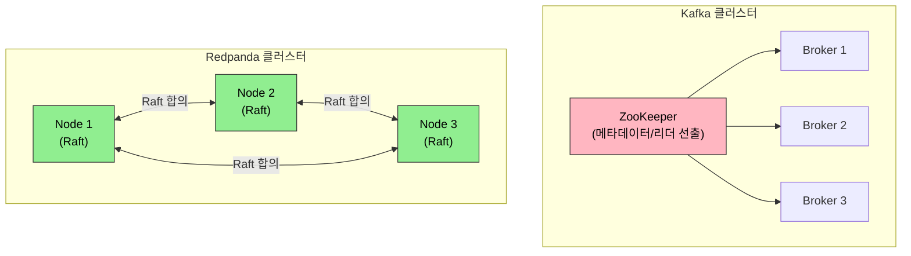

# Redpanda Operator

> Redpanda는 C++/Seastar로 구현된 Kafka 호환 스트리밍 플랫폼입니다. JVM 없이 동작하며, Schema Registry와 REST Proxy를 내장합니다. Kubernetes에서는 Operator 패턴으로 배포와 운영을 자동화합니다.


## 학습 목표
> Kafka 호환 메시징을 더 가볍게 운영하는 Redpanda 관점을 다루는 장입니다.

이 장에서 확인할 목표는 다음과 같다:

1. Redpanda가 JVM 기반 Kafka와 설계 철학에서 어떻게 다른지 이해할 수 있습니다.
2. Strimzi와의 비교를 통해 두 Operator의 운영 철학 차이를 설명할 수 있습니다.
3. `Redpanda` CR의 핵심 필드를 읽고 배포 결과를 예측할 수 있습니다.
4. Schema Registry 내장의 의미와 트레이드오프를 이해할 수 있습니다.
5. minikube에서 Redpanda를 실행하기 위한 리소스 조정 전략을 세울 수 있습니다.


## 1. Redpanda 설계 철학
> Redpanda가 왜 Kafka 대안으로 주목받는지 구조적 차이를 먼저 봅니다.

### 1.1 C++/Seastar 기반 아키텍처

Redpanda는 처음부터 JVM 없이 C++로 작성됐습니다. 동시성 모델로 Seastar 프레임워크를 사용합니다. Seastar는 CPU 코어 하나에 스레드 하나를 고정 배치하고(Shared-Nothing), 코어 간 데이터 이동을 최소화해 컨텍스트 스위칭 오버헤드를 제거합니다. 메모리도 코어별로 파티셔닝합니다.

이 설계의 실질적 효과는 두 가지입니다. GC 중단이 없어 tail latency가 안정적입니다. JVM Kafka에서 p99 응답 시간이 GC 주기에 따라 튀는 현상이 Redpanda에서는 나타나지 않습니다. 메모리 사용도 예측 가능합니다. JVM Heap 크기와 GC 튜닝 없이 컨테이너 메모리 Limits를 예측대로 설정할 수 있습니다.

### 1.2 Raft 기반 복제

Kafka는 ZooKeeper(또는 KRaft)로 메타데이터를 관리하고, 파티션 리더를 선출합니다. Redpanda는 ZooKeeper가 없습니다. 파티션 단위로 Raft 합의 알고리즘을 직접 구현해 리더 선출과 데이터 복제를 모두 처리합니다. 외부 코디네이터 의존성이 없어 배포 구성이 단순하고, 노드 장애 시 복구 시간이 빠릅니다.



### 1.3 내장 Schema Registry

Redpanda는 Schema Registry를 별도 프로세스 없이 내장합니다. Confluent Schema Registry는 Kafka 클러스터와 별도로 배포해야 하며 JVM 프로세스입니다. Redpanda에서는 같은 브로커 포트로 Kafka API와 Schema Registry API를 동시에 사용할 수 있습니다.

내장의 장점은 운영 단순화입니다. Schema Registry 장애가 브로커 장애와 분리되지 않는다는 점은 트레이드오프입니다. 대규모 환경에서 Schema Registry만 독립적으로 스케일할 수 없습니다. 사용 규모와 격리 요구에 따라 선택이 달라집니다.


## 2. Strimzi vs Redpanda Operator
> 두 Operator가 같은 문제를 어떤 방식으로 다르게 푸는지 비교합니다.

두 Operator는 대상 워크로드와 설계 철학이 다릅니다.

| 기준 | Strimzi | Redpanda Operator |
|------|---------|-------------------|
| 대상 | Apache Kafka (JVM) | Redpanda (C++) |
| CRD 수 | Kafka, KafkaTopic, KafkaUser 등 다수 | Redpanda, Topic |
| 업그레이드 | 롤링 업그레이드, 버전 간 마이그레이션 자동화 | StatefulSet 롤링 업데이트 |
| 네트워크 | 내부/외부 리스너 세분화 | Kafka API, Schema Registry, Admin API, REST Proxy 포트 통합 |
| 기존 Kafka 호환 | 기존 클러스터 이관에 유리 | Kafka 클라이언트 호환, 브로커는 Redpanda |

Strimzi는 기존 Kafka 워크로드를 Kubernetes로 옮기는 시나리오에 적합합니다. Redpanda Operator는 새로운 스트리밍 플랫폼을 Kubernetes 네이티브로 시작하는 시나리오에 어울립니다.


## 3. Redpanda CR 구조
> Redpanda 클러스터를 선언형으로 표현하는 주요 필드를 살핍니다.

`Redpanda` CR로 클러스터 전체를 선언합니다.

```yaml
apiVersion: cluster.redpanda.com/v1alpha2
kind: Redpanda
metadata:
  name: redpanda
  namespace: redpanda
spec:
  clusterSpec:
    statefulset:
      replicas: 3
    resources:
      cpu:
        cores: 1
      memory:
        container:
          max: 2Gi
    storage:
      persistentVolume:
        size: 20Gi
    listeners:
      kafka:
        port: 9092
      schemaRegistry:
        port: 8081
      adminApi:
        port: 9644
```

`Topic` CR은 토픽을 선언적으로 관리합니다. `kubectl apply`로 토픽을 생성하고 `kubectl delete`로 삭제합니다. 파티션 수와 복제 인수를 스펙으로 정의하므로 토픽 설정이 Git에 기록됩니다.

공식 문서에서는 Helm과 Operator를 분리해 안내합니다. Helm은 단순 배포에 적합하고, Operator는 설치 이후 업데이트와 정리까지 포함한 생명주기 관리에 적합합니다. 그래서 학습용 단일 노드는 Helm도 충분하지만, GitOps와 운영 자동화를 연결하려면 Operator 쪽이 더 자연스럽습니다.


## 4. minikube에서의 실행 전략
> 학습 환경에서 Redpanda를 무리 없이 띄우기 위한 현실적 전략을 정리합니다.

Redpanda는 기본값이 프로덕션 워크로드를 위해 설계됐습니다. 기본 메모리 요구사항(2.5GB 이상)이 로컬 환경에서 부담이 됩니다. 학습 목적으로 실행할 때는 두 가지를 조정합니다.

1. 리소스를 최소화합니다. `cpu.cores: 1`, `memory.container.max: 2Gi`, `storage.size: 5Gi`로 줄입니다.
2. `developerMode: true`를 활성화합니다. 이 모드는 프로덕션 안전 검사(fsync, 최소 복제본 수 검증 등)를 완화해 단일 노드로도 기동할 수 있게 합니다.

```yaml
spec:
  clusterSpec:
    config:
      developerMode: true
    resources:
      cpu:
        cores: 1
      memory:
        container:
          max: 2Gi
```

minikube에는 최소 4GB 메모리를 할당(`minikube start --memory=4096`)해야 Redpanda 단일 노드와 시스템 Pod가 공존할 수 있습니다.


## 5. Tiered Storage
> 스토리지 비용과 보관 기간 문제를 완화하는 Redpanda의 차별점을 다룹니다.

Tiered Storage는 오래된 세그먼트를 S3나 GCS 같은 오브젝트 스토리지로 자동으로 내보내는 기능입니다. 브로커 디스크는 최신 데이터만 유지하고, 클라이언트는 투명하게 오래된 데이터도 읽을 수 있습니다. 보존 기간을 늘리면서 브로커 스토리지 비용을 줄이는 데 효과적입니다. Kafka에서 동일 기능은 Confluent Tiered Storage(유료) 또는 커뮤니티 플러그인으로 제한적으로 지원합니다.


## 6. 점검 질문
> Redpanda Operator의 경량성과 운영 제약을 질문 중심으로 다시 점검합니다.

### Q1. C++/Seastar 아키텍처가 JVM과 다른 점

Redpanda는 C++/Seastar로 작성됐습니다. Seastar는 CPU 코어 하나에 스레드 하나를 고정 배치하고(Shared-Nothing) 코어 간 데이터 이동을 최소화합니다. GC 중단이 없어 tail latency가 안정적입니다. JVM Kafka에서 GC 주기에 따라 p99 응답 시간이 튀는 현상이 Redpanda에서는 나타나지 않습니다.

실용적 차이는 메모리 설정입니다. JVM Kafka는 Heap 크기와 GC 알고리즘 튜닝이 필요합니다. Redpanda는 컨테이너 메모리 Limits를 그대로 사용하면 됩니다.

심화 질문. Kafka JVM 힙 튜닝 없이 Redpanda를 컨테이너에 배포하면 메모리 사용이 예측 가능한가? Redpanda는 메모리를 직접 관리하므로 `memory.container.max`로 설정한 값이 실제 사용 상한이 됩니다. JVM처럼 Heap 외부 사용량이 예상을 초과하는 문제가 없습니다.

### Q2. Strimzi와 Redpanda Operator 비교

Strimzi는 Apache Kafka(JVM)를 Kubernetes에서 운영하기 위한 Operator입니다. 기존 Kafka 클러스터를 이관하거나 Kafka 에코시스템(Kafka Streams, KSQL)을 그대로 유지해야 할 때 적합합니다. `KafkaTopic`, `KafkaUser` 같은 세분화된 CRD로 세밀한 제어가 가능합니다.

Redpanda Operator는 Redpanda 클러스터를 관리합니다. 새로운 스트리밍 플랫폼을 Kubernetes 네이티브로 시작하는 시나리오에 적합합니다. Schema Registry와 REST Proxy가 내장돼 별도 컴포넌트 없이 시작할 수 있습니다.

심화 질문. 기존 Kafka 클라이언트 코드를 Redpanda로 마이그레이션할 때 변경이 필요한가? Kafka 프로토콜이 호환되므로 클라이언트 코드는 변경 없이 브로커 주소만 바꾸면 됩니다. 단, Kafka 고급 기능(Kafka Streams의 일부, 트랜잭션 API)은 지원 현황을 버전별로 확인해야 합니다.

### Q3. Schema Registry 내장의 트레이드오프

Confluent Schema Registry는 Kafka와 별도 JVM 프로세스로 배포합니다. Redpanda는 같은 브로커 프로세스 안에 Schema Registry를 내장합니다.

내장의 장점은 운영 단순화입니다. 배포 컴포넌트 수가 줄어들고 Schema Registry 장애가 별도로 발생하지 않습니다. 단점은 독립 스케일링이 불가하다는 것입니다. Schema Registry 트래픽이 많아져도 브로커와 분리해서 스케일할 수 없습니다. 대규모 환경에서는 이 제약이 중요할 수 있습니다.

```bash
# Schema Registry API 직접 접근
kubectl port-forward svc/redpanda 8081:8081 -n redpanda

# 스키마 등록
curl -X POST http://localhost:8081/subjects/orders-value/versions \
  -H "Content-Type: application/vnd.schemaregistry.v1+json" \
  -d '{"schema": "{\"type\": \"string\"}"}'

# 스키마 목록 조회
curl http://localhost:8081/subjects
```

### Q4. Raft vs ZooKeeper/KRaft

Kafka는 역사적으로 ZooKeeper로 메타데이터와 리더 선출을 처리했습니다. Kafka 2.8+에서 ZooKeeper 없이 내장 합의 프로토콜(KRaft)을 도입하는 전환이 진행 중입니다.

Redpanda는 처음부터 ZooKeeper가 없습니다. 파티션 단위로 Raft 합의를 직접 구현합니다. 외부 코디네이터 의존성이 없어 배포 구성이 단순하고 노드 장애 시 복구가 빠릅니다. 클러스터를 구성하는 컴포넌트 수가 적어 디버깅도 쉽습니다.

### Q5. Topic CR vs CLI 비교

```bash
# Redpanda CLI로 토픽 생성 (명령적)
rpk topic create orders --partitions 6 --replicas 3

# Topic CR로 토픽 생성 (선언적 - GitOps 적합)
kubectl apply -f - <<EOF
apiVersion: cluster.redpanda.com/v1alpha2
kind: Topic
metadata:
  name: orders
  namespace: redpanda
spec:
  partitions: 6
  replicationFactor: 3
  additionalConfig:
    retention.ms: "86400000"
EOF
```

Topic CR을 사용하면 토픽 설정이 Git에 기록됩니다. ArgoCD와 결합하면 Git PR로 토픽 변경을 리뷰하고 적용할 수 있습니다. `kubectl delete topic orders`로 삭제하면 실제 토픽도 삭제됩니다.

심화 질문. Topic CR이 삭제됐을 때 `deletionPolicy`로 실제 토픽 삭제 여부를 제어할 수 있는가? Redpanda Operator는 CR 삭제 시 기본적으로 토픽도 삭제합니다. 운영 환경에서 실수로 CR을 삭제하면 데이터 유실 위험이 있으므로 `kubectl annotate topic orders finalizers-` 같은 방법으로 finalizer를 제거하기 전에 신중히 확인해야 합니다.

### Q6. minikube 리소스 최소화

개인 GCP 클러스터에서 Redpanda 단일 노드를 테스트할 때 기본값은 과도합니다. `developerMode: true`와 리소스 축소로 실행 가능합니다.

```yaml
# ch16-redpanda.yaml
apiVersion: cluster.redpanda.com/v1alpha2
kind: Redpanda
metadata:
  name: redpanda
  namespace: redpanda
spec:
  clusterSpec:
    config:
      developerMode: true
    statefulset:
      replicas: 1
    resources:
      cpu:
        cores: 1
      memory:
        container:
          max: 2Gi
    storage:
      persistentVolume:
        size: 5Gi
```

```bash
kubectl apply -f ch16-redpanda.yaml

# 준비 상태 확인
kubectl get redpanda -n redpanda
kubectl get pods -n redpanda

# rpk로 클러스터 상태 확인
kubectl exec -it redpanda-0 -n redpanda -- rpk cluster info

# 정리
kubectl delete -f ch16-redpanda.yaml
```

심화 질문. `developerMode: true`가 비활성화하는 프로덕션 검사는 무엇인가? fsync 비활성화(디스크 쓰기 성능 향상, 전원 장애 시 데이터 유실 위험), 최소 복제본 수 검사 완화, 세그먼트 플러시 주기 완화 등이 포함됩니다. 이 설정은 학습과 개발 환경에서만 사용해야 합니다.

---


## 7. 다음 단계
> 데이터 플랫폼 사례를 마무리하고 DevTools 장으로 넘어갑니다.

Ch17에서는 RBAC과 보안을 다룹니다. Redpanda 클러스터에 접근하는 사용자와 서비스 계정의 권한을 최소화하는 Kubernetes RBAC 설계가 이어집니다.


## 관련 문서
> Kafka 장과 다음 Jenkins 장, 점검 문서를 함께 둡니다.

- [Kafka Operator](08-05.Kafka%20Operator.md) — 이전 절, Strimzi 기반 Kafka 운영
- [Jenkins on K8s](../11_devtools/11-01.Jenkins%20on%20K8s.md) — 다음 장, CI/CD 자동화
