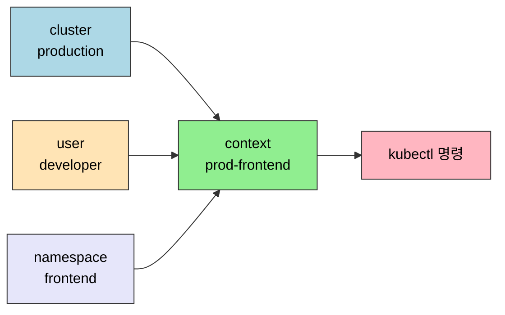
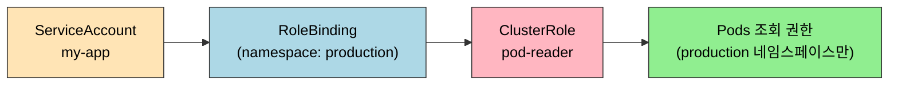
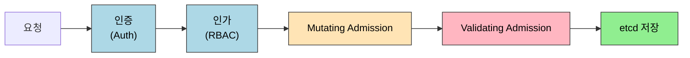

# RBAC과 보안

> Kubernetes 보안의 핵심 원칙은 최소 권한이다. "필요한 것만, 필요한 시간만큼"이라는 원칙이 RBAC 설계, ServiceAccount 토큰, Admission 정책, 네트워크 정책 모두에 관통한다.


## 학습 목표
> 클러스터 보안을 권한·실행 경계·네트워크 세 축으로 정리한다.

이 장에서 확인할 목표는 다음과 같다:

1. `kubeconfig`의 `cluster`, `user`, `context`가 무엇을 의미하는지 설명할 수 있다.
2. `Role`, `ClusterRole`, `RoleBinding`, `ClusterRoleBinding` 네 리소스의 관계를 설명할 수 있다.
3. ServiceAccount의 기본 토큰 동작과 Bound Service Account Token, Projected Volume의 차이를 구분할 수 있다.
4. Admission Controllers의 in-tree vs Webhook 흐름과 ValidatingAdmissionPolicy(CEL)의 위치를 설명할 수 있다.
5. Pod Security Standards 세 수준(Privileged·Baseline·Restricted)의 차이를 구분할 수 있다.
6. `NetworkPolicy`로 Pod 간 통신을 제한하는 방법과 CiliumNetworkPolicy의 L7 확장을 설명할 수 있다.
7. Secret의 한계와 보완 방법(Sealed Secrets, External Secrets, etcd 암호화)을 설명할 수 있다.


## 1. kubeconfig와 context
> 보안의 첫 단계는 "어디에 접속하는가"를 분명히 하는 것이다. `context`는 접속 대상과 기본 작업 공간을 고르는 개념이고, RBAC은 그 안에서 무엇을 할 수 있는지를 결정한다.

`kubectl`은 먼저 어느 클러스터에 어떤 신원으로 접속할지 결정해야 한다. 이 정보는 보통 `~/.kube/config` 같은 `kubeconfig` 파일에 들어 있다. 여기에는 크게 `cluster`, `user`, `context` 세 종류의 정보가 담긴다.

- `cluster`: API 서버 주소와 CA 인증서 같은 접속 대상 정보
- `user`: 인증서, 토큰, exec credential plugin 같은 인증 정보
- `context`: 어떤 `cluster`와 어떤 `user`, 그리고 기본 `namespace`를 묶은 작업 프로필

공식 문서 기준으로 `context`는 `(cluster, user, namespace)` 조합이다. 실무에서는 `dev-frontend`, `prod-admin`처럼 이름을 붙여 두고 필요할 때 전환한다. 즉, `context`는 "어느 환경에 어떤 사용자 자격으로 들어가 기본적으로 어느 네임스페이스를 볼 것인가"를 한 번에 고르는 스위치다.



다음 명령으로 현재 문맥을 확인하고 전환할 수 있다:

```bash
kubectl config get-contexts
kubectl config current-context
kubectl config use-context dev-frontend
kubectl config view --minify
```

여기서 혼동하기 쉬운 점이 있다. `context`를 `production`으로 바꿨다고 해서 자동으로 관리자 권한이 생기지는 않는다. `context`는 어디에 접속할지 정할 뿐이고, 실제 권한은 그 `user` 또는 `ServiceAccount`에 연결된 RBAC 규칙이 결정한다. 즉 "잘못된 클러스터에 접속하는 사고"와 "과도한 권한을 가진 사고"는 서로 다른 문제지만, 운영에서는 둘 다 자주 함께 발생한다.


## 2. RBAC 핵심 구조
> 인증 이후 실제 권한 결정을 누가 담당하는지 구조를 정리한다.

### 2.1 네 가지 리소스

Kubernetes RBAC은 네 가지 리소스로 구성된다.

`Role`은 특정 네임스페이스 안에서만 유효한 권한 집합이다. `ClusterRole`은 클러스터 전체에서 유효하며, 네임스페이스가 없는 리소스(Node, PersistentVolume)에 대한 권한도 정의할 수 있다.

`RoleBinding`은 Role(또는 ClusterRole)을 특정 주체(ServiceAccount, User, Group)에 연결하며 네임스페이스 범위다. `ClusterRoleBinding`은 ClusterRole을 클러스터 전체 범위로 연결한다.

조합에서 중요한 패턴이 있다. ClusterRole을 정의하고 RoleBinding으로 특정 네임스페이스에 바인딩하면, 그 역할은 해당 네임스페이스에서만 유효하다. 같은 ClusterRole을 여러 네임스페이스에서 재사용하면서 범위는 각 네임스페이스로 제한하는 방식이다.



### 2.2 최소 권한 Role 작성

```yaml
apiVersion: rbac.authorization.k8s.io/v1
kind: Role
metadata:
  name: pod-reader
  namespace: production
rules:
  - apiGroups: [""]
    resources: ["pods", "pods/log"]
    verbs: ["get", "list", "watch"]
```

`verbs`에 `*`(와일드카드)를 쓰는 것은 최소 권한 원칙에 어긋난다. 실제로 필요한 동사만 나열한다. `get`은 단일 리소스 조회, `list`는 목록 조회, `watch`는 스트리밍 감시다.

### 2.3 ServiceAccount 기본 동작

Pod는 특별히 지정하지 않으면 같은 네임스페이스의 `default` ServiceAccount를 사용한다. 이 계정에 아무 Role이 없어도 Pod는 기동한다. 그러나 Kubernetes API에 접근하는 JWT 토큰이 자동으로 마운트된다(`/var/run/secrets/kubernetes.io/serviceaccount/token`). 토큰 자체로는 접근 권한이 없지만, 실수로 ClusterRoleBinding을 default SA에 연결하면 모든 Pod가 해당 권한을 갖게 된다.

원칙은 두 가지다. 애플리케이션마다 전용 ServiceAccount를 만든다. API 접근이 불필요한 경우 `automountServiceAccountToken: false`로 토큰 마운트를 차단한다.


## 3. ServiceAccount 토큰의 진화
> 옛 영구 토큰 모델이 왜 위험했고, 현행 Bound Token 모델이 어떻게 짧은 수명·정확한 주체를 만들어 내는지 정리한다.

### 3.1 옛 모델: ServiceAccount Secret

K8s 1.23 이전에는 ServiceAccount를 만들면 컨트롤러가 `<sa-name>-token-xxxxx` 형식의 Secret을 자동 생성하고, JWT 토큰을 그 안에 영구적으로 저장했다. Pod는 이 Secret을 마운트해 토큰을 읽었다.

문제는 두 가지였다. 토큰이 **만료되지 않아** 한 번 유출되면 폐기 외에는 무효화 방법이 없었다. 그리고 Pod가 끝나도 Secret은 남아 있어, 같은 토큰이 여러 Pod·세션에서 재사용되며 감사 로그에서 누가 썼는지 분리하기 어려웠다.

### 3.2 현행 모델: Bound Service Account Token

K8s 1.24부터 Pod의 ServiceAccount 토큰은 Secret이 아니라 **Projected Volume의 일부로 동적으로 발급**된다. 이 토큰은 다음 속성을 가진다.

- **시간 제한**: 기본 1시간 만료. kubelet이 만료 전에 자동 갱신한다.
- **대상 제한**: `audience`가 `https://kubernetes.default.svc`처럼 명시돼 그 audience에서만 유효하다.
- **주체 바인딩**: 토큰의 클레임에 Pod UID와 ServiceAccount UID가 포함돼, "이 Pod의 토큰"임을 검증할 수 있다.

```yaml
spec:
  serviceAccountName: my-app
  containers:
    - name: app
      image: my-app
      volumeMounts:
        - name: vault-token
          mountPath: /var/run/secrets/tokens
  volumes:
    - name: vault-token
      projected:
        sources:
          - serviceAccountToken:
              path: vault-token
              expirationSeconds: 600        # 10분
              audience: vault.example.com
```

위 예시는 외부 Vault에 인증할 때 쓰는 짧은 수명의 토큰을 별도 Projected Volume으로 만든다. Vault는 토큰의 audience와 expirationSeconds를 검증해 "vault.example.com을 위한 10분짜리 토큰"으로만 받아들인다. 만료 후에는 다른 토큰이 발급되므로 유출 영향이 시간으로 제한된다.

### 3.3 외부 시스템과 Workload Identity

매니지드 K8s에서는 ServiceAccount 토큰을 클라우드 IAM 자격증명과 연결하는 흐름이 표준이다. GKE Workload Identity, EKS IRSA, AKS Workload Identity Federation이 같은 모델이다. K8s ServiceAccount의 OIDC 토큰을 클라우드 IAM이 신뢰하면, Pod는 따로 시크릿을 배포받지 않고도 클라우드 자원에 접근할 수 있다.

운영 관점에서는 두 가지 점검 항목이 있다.

1. 모든 워크로드가 자체 ServiceAccount를 가지는가. default를 그대로 쓰는 Pod는 권한 분리 자체가 안 된다.
2. 외부 호출이 있는 워크로드는 audience를 분리해 받는가. 같은 토큰을 여러 외부 시스템에 던지면 한 곳에서 유출된 토큰이 다른 시스템까지 흔들 수 있다.


## 4. Admission Controllers와 Webhook
> RBAC을 통과한 요청을 한 번 더 검사·변환하는 단계다.

### 4.1 요청 처리 파이프라인

API 서버는 들어온 요청을 다음 순서로 처리한다.



Admission은 RBAC 이후, 저장 직전 단계다. **Mutating**은 객체를 변환하고(예: 기본 라벨 주입, 사이드카 자동 추가), **Validating**은 변환을 확인하지 않고 객체가 정책을 만족하는지만 검사해 거부 여부를 결정한다.

### 4.2 in-tree와 Webhook

Admission 플러그인은 두 종류다.

**in-tree 플러그인**은 API 서버 바이너리에 빌드돼 있다. `--enable-admission-plugins=NamespaceLifecycle,ResourceQuota,LimitRanger,PodSecurity,...` 같은 플래그로 활성화한다. ResourceQuota·LimitRange·PodSecurity가 대표 사례로, 운영자가 직접 추가할 수는 없고 K8s 릴리스가 제공하는 항목을 골라 켠다.

**Admission Webhook**은 외부 서비스로 동작한다. 정책 결정을 클러스터 외부의 Pod·서비스에 위임하면서, 운영자가 임의 정책을 코드로 작성할 수 있다. 두 종류의 CR로 등록한다.

| CR | 역할 |
|----|------|
| `MutatingWebhookConfiguration` | API 서버가 객체 변환 webhook을 호출해 응답한 patch를 적용 |
| `ValidatingWebhookConfiguration` | API 서버가 검사 webhook을 호출해 응답이 reject면 요청 실패 |

```yaml
apiVersion: admissionregistration.k8s.io/v1
kind: ValidatingWebhookConfiguration
metadata:
  name: image-policy
webhooks:
  - name: enforce-registry.example.com
    rules:
      - apiGroups: [""]
        apiVersions: ["v1"]
        resources: ["pods"]
        operations: ["CREATE", "UPDATE"]
    clientConfig:
      service:
        name: image-policy-webhook
        namespace: policy-system
        path: /validate
      caBundle: <BASE64_CA>
    admissionReviewVersions: ["v1"]
    sideEffects: None
    failurePolicy: Fail
    timeoutSeconds: 5
```

이 정의 하나가 "Pod 생성·수정 요청은 image-policy-webhook으로 보내 검사받는다"를 표현한다. webhook 응답이 timeout이거나 거부면 요청은 실패한다. `failurePolicy: Fail`은 webhook 자체가 죽었을 때 안전하게 거부하는 보수적 설정이다. `Ignore`로 두면 webhook이 죽어도 요청이 통과해 보안 약속이 새는 사고가 난다.

### 4.3 운영 시 함정

Webhook이 항상 응답해야 한다는 점에서 가용성 자체가 클러스터 가용성과 묶인다. 같은 클러스터의 서비스로 webhook을 두면 그 webhook 자신이 동작하지 않는 시점에 webhook 자체를 못 띄울 수 있다. 안전 장치로 두 가지가 흔하다.

- **`namespaceSelector`로 webhook 자기 네임스페이스 제외**: 웹훅을 운영하는 네임스페이스의 객체는 그 웹훅으로 검사하지 않게 한다. webhook 자기 자신을 만드는 흐름이 데드락에 빠지지 않게 한다.
- **`failurePolicy: Fail`을 정책 위반 보호와 가용성 사이에서 결정**: 정책이 SLA 자체보다 중요하면 Fail, 정책 위반보다 가용성이 더 중요하면 Ignore로 둔다. 보수적으로는 Fail.


## 5. ValidatingAdmissionPolicy
> Webhook 없이 CEL로 정책을 표현하는 새 표준이다.

### 5.1 무엇을 풀려고 했나

ValidatingAdmissionPolicy(VAP)는 K8s 1.30에서 GA된 기능이다. 옛 모델에서는 정책을 두려면 Validating Webhook을 작성해야 했고, 그 webhook을 운영하는 Pod·인증서·가용성을 모두 책임져야 했다. 단순 정책에도 인프라 비용이 컸다.

VAP는 같은 정책을 **API 서버 안에서 CEL(Common Expression Language)로 직접 평가**하게 한다. 외부 Pod 없이 동작하므로 가용성 의존이 사라지고, 평가 지연이 작다.

### 5.2 표현 모델

```yaml
apiVersion: admissionregistration.k8s.io/v1
kind: ValidatingAdmissionPolicy
metadata:
  name: deployment-replica-cap
spec:
  failurePolicy: Fail
  matchConstraints:
    resourceRules:
      - apiGroups: ["apps"]
        apiVersions: ["v1"]
        operations: ["CREATE", "UPDATE"]
        resources: ["deployments"]
  validations:
    - expression: "object.spec.replicas <= 50"
      messageExpression: "'replicas는 50 이하여야 합니다 (요청: ' + string(object.spec.replicas) + ')'"
---
apiVersion: admissionregistration.k8s.io/v1
kind: ValidatingAdmissionPolicyBinding
metadata:
  name: deployment-replica-cap-binding
spec:
  policyName: deployment-replica-cap
  validationActions: [Deny]
  matchResources:
    namespaceSelector:
      matchLabels:
        environment: production
```

Policy는 정책의 "내용"(어떤 리소스를 어떤 CEL식으로 검사할지)을 정의한다. Binding은 "어디에 적용할지"(어느 네임스페이스, 어떤 매칭 조건)를 정의한다. 한 Policy를 여러 Binding으로 재사용할 수 있다.

`validationActions`는 위반 시 동작을 정한다. `Deny`(요청 거부), `Warn`(경고만), `Audit`(감사 로그) 중 골라 쓰며, 동시에 여러 개를 둘 수도 있다(예: `[Warn, Audit]`로 한동안 데이터를 모은 뒤 `[Deny]`로 강화).

### 5.3 Webhook과의 선택 기준

VAP가 Webhook을 100% 대체하지는 않는다. 두 도구의 선택은 다음 기준으로 갈린다.

| 기준 | VAP | Webhook |
|------|-----|---------|
| 외부 데이터 조회 필요 | 어렵다 | 가능(외부 API 호출) |
| 객체 변환(Mutating) | 불가 | Mutating Webhook 필요 |
| 단순 검증 정책 | 적합 | 과한 인프라 |
| 복잡 흐름·상태 보유 | 어렵다 | 적합 |

운영의 90% 이상을 차지하는 단순 정책(라벨 강제, replica 상한, image registry 화이트리스트 등)은 VAP로 단순해진다. Mutating·외부 데이터 의존 정책은 Webhook이 필요하다.


## 6. Pod Security Standards
> 컨테이너 실행 시 허용할 권한 범위를 정책으로 고정하는 방식을 설명한다.

### 6.1 세 가지 수준

Pod Security Standards(PSS)는 세 수준의 보안 프로파일을 정의한다.

`Privileged`는 제한 없음이다. 기존 클러스터 이관이나 시스템 수준 Pod(노드 에이전트 등)에 사용한다. `Baseline`은 알려진 권한 상승 벡터를 차단한다. `hostPID`, `hostNetwork` 사용 금지, 위험한 기능(SYS_ADMIN 등) 요청 불가다. `Restricted`는 가장 엄격하며 현재 보안 모범 사례를 따른다. 루트 실행 금지, 읽기 전용 파일시스템 권장, 모든 기능 드롭 후 필요한 것만 추가가 요구된다.

수준은 네임스페이스 레이블로 설정하고, 모드를 `enforce`(위반 시 생성 거부), `audit`(위반 시 감사 로그), `warn`(위반 시 경고)으로 조합한다. 운영에서는 바로 `enforce: restricted`로 가기보다 `warn`과 `audit`으로 위반 항목을 먼저 파악한 뒤 점진적으로 올리는 편이 안전하다.

```yaml
apiVersion: v1
kind: Namespace
metadata:
  name: production
  labels:
    pod-security.kubernetes.io/enforce: restricted
    pod-security.kubernetes.io/warn: restricted
```

PSS는 in-tree Admission(`PodSecurity` 플러그인)으로 동작한다. 옛 PodSecurityPolicy(PSP)는 K8s 1.25에서 제거됐고, PSS가 그 자리를 대체한다.


## 7. NetworkPolicy와 Cilium 확장
> 네트워크 차원에서도 최소 권한을 적용해야 하는 이유와 L7 정책으로의 확장을 다룬다.

### 7.1 기본 허용과 기본 거부

Kubernetes는 NetworkPolicy 없이는 모든 Pod 간 통신을 허용한다. NetworkPolicy를 하나라도 적용하면, 그 Pod에 대해 나머지 트래픽은 모두 기본 거부가 된다.

전체 네임스페이스에 default-deny를 적용하고 필요한 트래픽만 명시적으로 허용하는 방식이 권장된다.

```yaml
# 기본 거부: 모든 Ingress 차단
apiVersion: networking.k8s.io/v1
kind: NetworkPolicy
metadata:
  name: default-deny-ingress
  namespace: production
spec:
  podSelector: {}    # 네임스페이스 내 모든 Pod
  policyTypes:
    - Ingress

---
# 허용: frontend → backend 8080 포트만
apiVersion: networking.k8s.io/v1
kind: NetworkPolicy
metadata:
  name: allow-frontend-to-backend
  namespace: production
spec:
  podSelector:
    matchLabels:
      app: backend
  policyTypes:
    - Ingress
  ingress:
    - from:
        - podSelector:
            matchLabels:
              app: frontend
      ports:
        - port: 8080
```

NetworkPolicy는 CNI 플러그인이 지원해야 동작한다. Flannel은 NetworkPolicy를 지원하지 않는다. Calico, Cilium, Weave Net이 지원한다.

### 7.2 표준 NetworkPolicy의 한계

표준 NetworkPolicy는 L3/L4(IP·포트)만 표현한다. "frontend가 backend의 8080 포트로 트래픽을 보낼 수 있다"는 표현 가능하지만, "그 트래픽 중 GET /api/* 만 허용"처럼 HTTP 메서드·경로 단위 정책은 표현할 수 없다.

운영에서는 두 가지가 자주 부족하다.

1. **HTTP 경로별 차등 권한**. 같은 Pod의 다른 경로에 다른 권한을 두고 싶을 때.
2. **gRPC 메서드·Kafka 토픽 같은 애플리케이션 프로토콜 단위 정책**. 표준 NetworkPolicy로는 표현 불가다.

### 7.3 CiliumNetworkPolicy의 L7 확장

Cilium CNI를 쓰면 `CiliumNetworkPolicy` CR이 표준 NetworkPolicy의 표현력을 L7으로 확장한다.

```yaml
apiVersion: cilium.io/v2
kind: CiliumNetworkPolicy
metadata:
  name: api-restrict
  namespace: production
spec:
  endpointSelector:
    matchLabels:
      app: backend
  ingress:
    - fromEndpoints:
        - matchLabels:
            app: frontend
      toPorts:
        - ports:
            - port: "8080"
              protocol: TCP
          rules:
            http:
              - method: "GET"
                path: "/api/.*"
              - method: "POST"
                path: "/api/orders"
```

위 정책은 frontend → backend의 8080/TCP 중 `GET /api/*`와 `POST /api/orders`만 허용한다. 다른 메서드·경로는 거부된다. 같은 모델로 Kafka(`kafka` 키워드로 토픽·apiKey 차원), gRPC(서비스·메서드 차원)도 표현 가능하다.

L7 정책은 Cilium의 Envoy 통합 또는 자체 프록시가 필요하므로 노드 자원·지연이 추가로 든다. 모든 Pod 간 트래픽을 L7으로 검사하는 것보다, 외부 노출 또는 보안 민감 경계에 한정해 적용하는 편이 비용 효율이다. 실제 운영 매니페스트에서도 Cilium L7 정책은 표준 NetworkPolicy(빈도 84) 대비 적게(빈도 12) 등장한다.


## 8. Secret 관리
> 민감정보를 단순 주입이 아니라 접근 제어와 함께 봐야 하는 이유를 짚는다.

### 8.1 Secret의 한계

Kubernetes Secret은 기본적으로 etcd에 Base64 인코딩으로 저장된다. Base64는 암호화가 아니므로 etcd 접근 권한이 있으면 내용을 그대로 읽을 수 있다. Git에 Secret YAML을 커밋하면 Base64 디코딩만으로 값이 노출된다.

### 8.2 보완 방법

`Sealed Secrets`는 공개키로 Secret을 암호화해 `SealedSecret` CR로 저장한다. Git에 커밋해도 프라이빗키 없이는 복호화가 불가능하다. 클러스터 안의 Sealed Secrets Controller만 복호화할 수 있다.

`External Secrets Operator`는 AWS Secrets Manager, GCP Secret Manager, HashiCorp Vault 같은 외부 비밀 저장소에서 값을 가져와 Kubernetes Secret을 자동으로 생성한다. 비밀 원본이 외부 저장소에 있어 클러스터 삭제 후에도 유지된다.

etcd 암호화(Encryption at Rest)를 활성화하면 etcd에 저장되는 Secret 자체를 AES로 암호화한다. 이는 etcd 파일 직접 접근에 대한 방어층이다.


## 9. Audit Log
> 사후 추적과 컴플라이언스를 위해 어떤 행위를 기록해야 하는지 설명한다.

감사 로그는 "누가 언제 무엇을 했는가"를 kube-apiserver 수준에서 기록한다. 정책 파일로 어떤 요청을 어느 수준으로 기록할지 정의한다. Secret의 data 필드는 감사 로그에서 제외하도록 설정하는 것이 표준이다. 비밀 값이 로그에 노출되지 않도록 한다.

운영에서 감사 로그는 두 흐름과 짝을 맞춘다. 하나는 **VAP의 `Audit` 액션**으로, 정책 위반 자체를 감사 항목으로 남긴다. 다른 하나는 **Webhook이 호출된 결정**의 흐름이다. webhook이 거부한 요청은 audit 정책에서 `RequestReceived`·`ResponseComplete` 단계 모두를 기록해 두면 사후 분석에 충분한 맥락이 남는다.


## 10. 다음 단계
> 보안 경계 위에서 자원 거버넌스를 설계하는 장으로 이어 간다.

[자원 관리](./10-03.자원%20관리.md)에서는 Requests/Limits, QoS, LimitRange/ResourceQuota를 묶어 다룬다. RBAC로 권한을 통제한 ServiceAccount가 ResourceQuota의 한도 안에서 워크로드를 만들고, Admission Controllers가 Requests 누락을 막는 흐름이 자연스럽게 연결된다.


## 관련 문서
> 이전 관측 장, 다음 자원 관리 장, 점검 문서를 함께 둔다.

- [RBAC과 보안 점검](./deepdive/10-02.RBAC%EA%B3%BC%20%EB%B3%B4%EC%95%88%20점검.md) — 본 장의 점검 편
- [모니터링과 트러블슈팅](./10-01.모니터링과%20트러블슈팅.md) — 이전 장
- [자원 관리](./10-03.자원%20관리.md) — 다음 장, Requests/Limits와 QoS
