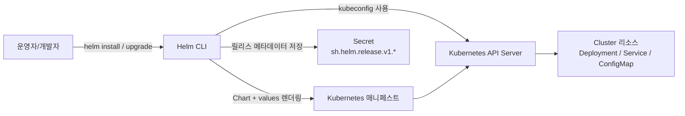
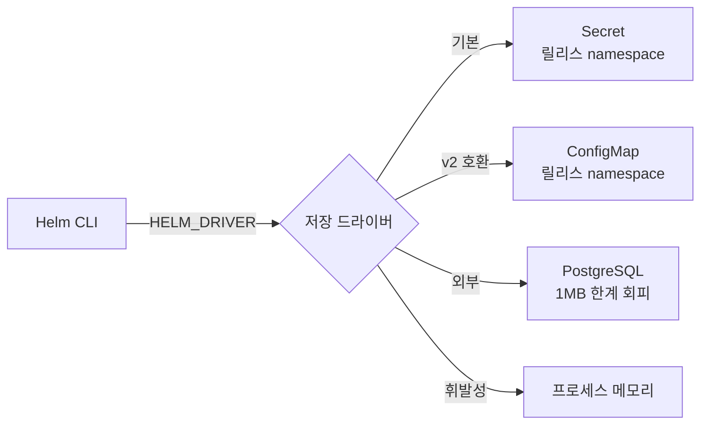
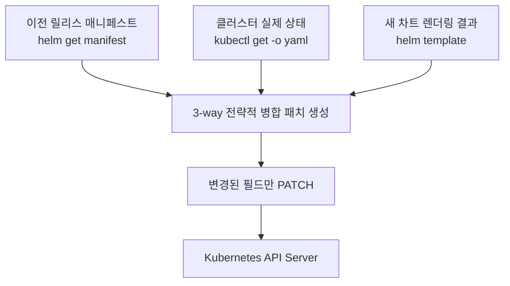
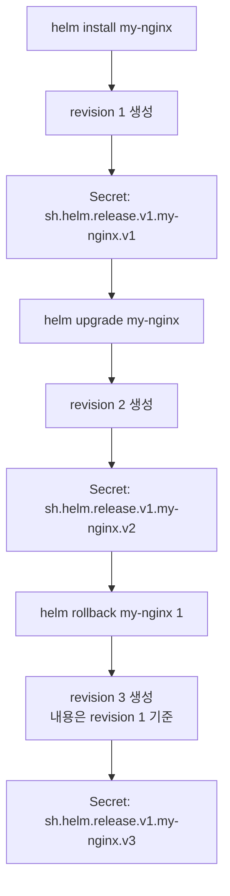
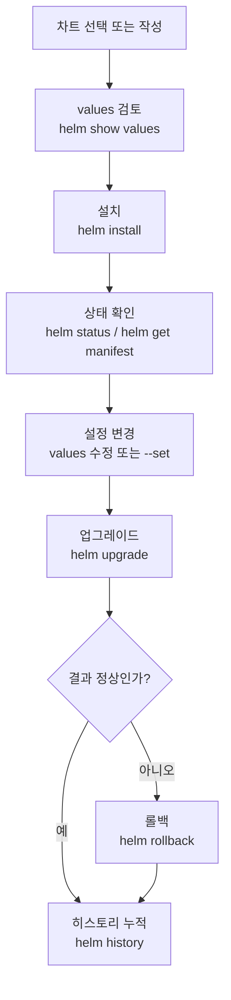

# Helm 기초

> Helm은 Kubernetes의 패키지 관리자입니다. 수십 개의 YAML 매니페스트를 하나의 차트로 관리하고, 환경별 설정을 values 파일로 분리하며, 릴리스 히스토리를 통해 안전한 배포와 롤백을 제공합니다.


## 학습 목표
> 매니페스트 집합을 배포 가능한 패키지로 바꾸는 Helm의 역할을 봅니다.

이 장에서 확인할 목표는 다음과 같다:

1. Helm이 `kubectl apply` 방식보다 어떤 운영 이점을 주는지 설명할 수 있습니다.
2. Helm v3의 3-way merge와 릴리스 관리 메커니즘을 이해할 수 있습니다.
3. 저장소 관리, 차트 검색, 설치, 업그레이드, 롤백의 기본 명령어를 한 흐름으로 사용할 수 있습니다.
4. `--set`과 `-f` 플래그로 환경별 설정을 분리하는 방식을 설명할 수 있습니다.


## 1. 왜 Helm이 필요한가
> raw YAML만으로 운영할 때 생기는 반복과 드리프트 문제를 짚습니다.

### 1.1 YAML 관리의 복잡성

단일 애플리케이션을 배포하려면 Deployment, Service, ConfigMap, Secret, Ingress, PVC 등 여러 리소스가 필요합니다. 이를 개별 파일로 관리하면 파일 수가 폭증하고, ConfigMap을 먼저 만들어야 Deployment가 시작되는 의존성 순서를 사람이 직접 챙겨야 합니다.

환경별 설정 중복도 문제입니다. 개발과 프로덕션이 replicas 수, 이미지 태그, 리소스 제한만 다를 때 거의 같은 YAML을 복사해서 값만 바꾸면 DRY 원칙을 위반하게 됩니다. 어느 한 파일을 수정할 때 나머지도 함께 업데이트해야 하는데 하나라도 빠뜨리면 환경 간 불일치가 발생합니다.

버전 관리와 롤백도 `kubectl apply`만으로는 어렵습니다. Deployment는 `kubectl rollout undo`로 롤백할 수 있지만 Service나 ConfigMap은 수동으로 이전 버전을 재적용해야 합니다.

### 1.2 Helm의 해결책

| 문제 | Helm 솔루션 |
|------|------------|
| YAML 관리 복잡성 | 차트: 관련 리소스를 하나의 패키지로 묶어 버전 관리 |
| 환경별 설정 중복 | Values: 템플릿 + values 파일로 설정 분리 |
| 버전/롤백 부재 | 릴리스: 배포 히스토리 자동 추적, 명령어 하나로 롤백 |
| 재사용/공유 어려움 | 레포지토리: 차트를 저장소에 퍼블리시해 공유 |


## 2. Helm 아키텍처
> Chart와 Release가 어떤 계층으로 나뉘는지 간단히 정리합니다.

Helm이 차트를 실제 클러스터 상태로 바꾸는 흐름은 다음과 같다:



### 2.1 Helm v3: Tiller 제거

**Helm v2에서는 클러스터 내부에 Tiller라는 서버 컴포넌트가 필요했습니다.** 

- Tiller가 cluster-admin 권한을 가지므로 Tiller에 접근할 수 있는 모든 사용자가 사실상 클러스터 전체 권한을 가지는 보안 취약점이 있었습니다.

**Helm v3는 Tiller를 제거했습니다.** 

- Helm CLI가 kubeconfig를 직접 사용해 API 서버와 통신하므로 사용자의 kubectl 권한이 그대로 Helm에 적용됩니다. 
- 릴리스 정보는 ConfigMap에서 Secret으로 바꿔 보안을 강화했습니다.

### 2.2 릴리스 저장 백엔드

Helm v3는 릴리스 메타데이터를 클러스터의 어떤 객체에 저장할지 드라이버로 고를 수 있습니다. 기본은 `secret`이지만 큰 차트나 통합 이력 관리가 필요하면 다른 드라이버로 바꿔야 합니다.



| 드라이버 | 저장소 | 기본 여부 | 사용 시나리오 |
|----------|--------|-----------|--------------|
| `secret` | 릴리스 namespace의 Secret | v3 기본 | 일반 운영 |
| `configmap` | 릴리스 namespace의 ConfigMap | 아니오 | v2 호환, 평문 가시성 필요 시 |
| `sql` | 외부 PostgreSQL | 아니오(beta) | 1 MB 초과, 멀티 클러스터 통합 이력 |
| `memory` | 프로세스 메모리 | 아니오 | CI/단위 테스트 |

운영에서 자주 쓰는 환경변수는 다음과 같다:

- `HELM_DRIVER` — 드라이버 선택 (`secret`/`configmap`/`sql`/`memory`)
- `HELM_DRIVER_SQL_CONNECTION_STRING` — `sql` 드라이버의 PostgreSQL 접속 문자열
- `HELM_MAX_HISTORY` — 릴리스당 보관할 revision 상한 (CLI `--history-max`와 같은 의미)

특히 Kubernetes 객체는 한 개당 1 MB 제한이 있어서, 차트 매니페스트가 커지거나 history가 많아지면 Secret 저장 자체가 실패할 수 있습니다. 이 한계에 가까워지면 `sql` 드라이버 전환을 검토합니다.

### 2.3 3-Way Merge

Helm v3의 업그레이드는 세 가지 상태를 비교해 변경된 필드만 패치합니다. 이전 릴리스 매니페스트, 클러스터 실제 상태, 새 차트 렌더링 결과를 한자리에 모은 다음 strategic merge patch를 만들어 API 서버에 보냅니다.



`kubectl apply`는 이전 적용 내용과 새 매니페스트만 비교해 수동 변경을 덮어쓰는 반면, Helm v3는 라이브 상태를 함께 봅니다. 그래서 운영자가 `kubectl scale`로 바꿔 둔 replicas나 서비스 메시 사이드카가 주입한 annotation처럼 "Helm이 소유하지 않은 필드"는 보존됩니다.

다만 다음 두 가지 함정은 미리 알아둬야 합니다.

- **Immutable 필드 충돌**: `Deployment.spec.selector`, `Service.spec.clusterIP` 같은 변경 불가 필드를 차트에서 바꾸면 패치가 실패합니다. 이때는 `helm upgrade --force`로 재생성하거나 수동 삭제 후 재설치가 필요합니다.
- **Orphaned field**: 직전 릴리스가 `failed`/`pending-upgrade`로 남으면 Helm이 더 이상 추적하지 못하는 필드가 생겨 다음 업그레이드가 꼬입니다. `helm history`에서 비정상 revision이 보이면 `helm rollback`으로 정상 상태로 정렬한 뒤 다시 시도하는 편이 안전합니다.

### 2.4 릴리스 관리

릴리스는 Helm이 클러스터에 차트를 설치한 인스턴스입니다. 하나의 차트로 여러 릴리스를 만들 수 있습니다. 각 릴리스는 클러스터의 Secret으로 저장된다(`sh.helm.release.v1.<name>.v<revision>`). Secret에는 렌더링된 매니페스트, 사용된 values, 차트 메타데이터가 포함됩니다.

Helm이 이력을 남기는 방식은 "릴리스 이름별 revision 누적"으로 이해하면 된다:



- 중요한 점은 `rollback`이 기존 revision을 덮어쓰지 않는다는 것입니다. 
- revision 1로 되돌리더라도 "현재 상태를 revision 1 내용으로 재적용한 새 revision"이 하나 더 생깁니다. 
- 그래서 이력은 선형으로 계속 누적되고, 운영자는 언제 어떤 설정으로 바뀌었는지 추적할 수 있습니다.

실제 조회는 다음 명령으로 한다:

```bash
helm history my-nginx
helm get values my-nginx --revision 2
helm get manifest my-nginx --revision 2
kubectl get secret -n default | grep 'sh.helm.release.v1.my-nginx'
```

- `helm history`는 revision 번호, 상태(`deployed`, `superseded`, `failed`, `pending-upgrade`), 차트 버전, 앱 버전, 변경 시각을 보여줍니다. 
- `helm get values`는 그 revision에 사용된 설정값을, `helm get manifest`는 최종 렌더링 결과를 보여줍니다. 
- 마지막 `kubectl get secret`은 Helm이 실제로 이력을 Secret으로 저장했다는 사실을 클러스터 관점에서 확인하는 용도입니다.

여기서 Helm과 ArgoCD를 분리해서 이해해야 합니다. 

- Helm으로 직접 배포하면 이 revision 이력이 Helm release의 일부로 남습니다. 
- 반면 ArgoCD가 Helm chart를 배포할 때는 보통 `helm install`이 아니라 `helm template`로 매니페스트만 생성하고, 이후 적용 이력과 롤백은 ArgoCD가 자체적으로 관리합니다. 
- 따라서 ArgoCD가 Helm의 revision Secret(`sh.helm.release.v1.*`)을 그대로 이어받거나 `helm history`를 재사용하는 구조는 아닙니다.

이력은 무한정 두는 것이 아니라 필요에 따라 관리합니다. 기본적으로 revision이 계속 쌓이므로 장기간 운영 릴리스는 개수를 제한하는 편이 낫습니다.

```bash
helm upgrade --install my-nginx bitnami/nginx -f values.yaml --history-max 10
```

`--history-max`를 주면 오래된 revision은 정리되고 최신 이력만 유지됩니다. 운영에서는 "롤백 가능한 개수"와 "Secret 누적량" 사이에서 적절한 숫자를 정합니다.


## 3. 기본 명령어
> 실제 운영에서 자주 쓰는 배포·업그레이드·롤백 명령을 한 흐름으로 봅니다.

### 3.1 레포지토리 관리

```bash
helm repo add bitnami https://charts.bitnami.com/bitnami
helm repo add ingress-nginx https://kubernetes.github.io/ingress-nginx
helm repo add prometheus-community https://prometheus-community.github.io/helm-charts
helm repo update
helm repo list
```

Helm 3.8부터는 OCI 호환 레지스트리(Harbor, ECR, GHCR, GitLab Registry)를 차트 저장소로 직접 쓸 수 있습니다. 별도의 HTTP 인덱스 없이 컨테이너 이미지와 같은 인증·스캔·서명 도구를 그대로 재사용할 수 있다는 장점이 있습니다.

```bash
helm registry login registry.example.com
helm push my-chart-0.1.0.tgz oci://registry.example.com/charts
helm install my-app oci://registry.example.com/charts/my-chart --version 0.1.0
```

OCI 경로는 `helm repo add` 단계가 필요 없고 `oci://` URL을 명령어에 직접 넘깁니다. `helm pull`/`helm show values`도 동일하게 동작합니다.

### 3.2 차트 탐색

```bash
helm search repo nginx
helm search repo bitnami/nginx --versions   # 버전 목록
helm show values bitnami/nginx              # 기본 values 확인 (중요)
helm show chart bitnami/nginx               # 차트 메타데이터
```

설치 전에 반드시 `helm show values`로 기본 값을 확인하고 필요한 항목만 오버라이드합니다.

### 3.3 설치·업그레이드·롤백

```bash
# 기본 설치
helm install my-nginx bitnami/nginx

# values 오버라이드 (--set은 단순값, -f는 복잡한 설정에 권장)
helm install my-nginx bitnami/nginx \
  -f base-values.yaml \
  -f prod-values.yaml \
  --set image.tag=1.25.0

# CI/CD 멱등 패턴: 설치 없으면 install, 있으면 upgrade
helm upgrade --install my-nginx bitnami/nginx -f values.yaml

# 업그레이드
helm upgrade my-nginx bitnami/nginx -f updated-values.yaml

# 히스토리 및 롤백
helm history my-nginx
helm rollback my-nginx 2      # 특정 리비전으로
helm rollback my-nginx        # 직전 리비전으로
```

운영 관점의 기본 사이클은 다음 순서로 이해하면 된다:



values 우선순위는 낮은 순서로 차트 기본값 → `-f` 첫 번째 파일 → `-f` 두 번째 파일 → `--set`입니다. 항상 `-f values.yaml`로 모든 설정을 명시하는 것이 `--reuse-values`보다 안전합니다.

### 3.4 릴리스 조회

```bash
helm list -A                           # 모든 네임스페이스 릴리스
helm status my-nginx                   # 릴리스 상태
helm get values my-nginx               # 사용된 values
helm get manifest my-nginx             # 렌더링된 최종 매니페스트
helm get values my-nginx --revision 2  # 특정 리비전의 values
helm get notes my-nginx                # NOTES.txt 출력 (설치 후 안내문)
helm get hooks my-nginx                # 등록된 Hook 매니페스트
helm get all my-nginx --revision 2     # values+manifest+notes+hooks 한꺼번에
```

`helm get all`은 디버깅 시 한 revision의 모든 컨텍스트를 한 번에 끌어오기에 유용합니다. `helm get hooks`는 어떤 Hook이 어느 시점에 동작하는지 잊었을 때 차트를 다시 읽지 않아도 빠르게 확인할 수 있습니다.


## 4. 주요 레포지토리
> 공용 차트를 가져올 때 어떤 기준으로 신뢰도를 판단할지 정리합니다.

| 레포지토리 | 주요 차트 |
|-----------|-----------|
| Bitnami | nginx, postgresql, redis, kafka, mongodb |
| ingress-nginx | ingress-nginx |
| prometheus-community | kube-prometheus-stack |
| jetstack | cert-manager |
| argo | argo-cd, argo-workflows |

차트 선택 기준은 다음과 같습니다. 대부분의 오픈소스 소프트웨어는 Bitnami 버전이 가장 잘 유지보수됩니다. Ingress-Nginx, Prometheus 등은 각 프로젝트의 공식 레포지토리를 사용합니다. Artifact Hub에서 다운로드 수와 최근 업데이트 날짜를 확인하는 것이 좋습니다.


## 5. 점검 질문
> Helm 기초 개념을 릴리스 운영 질문으로 다시 점검합니다.

### Q1. Helm v3에서 Tiller를 제거한 이유와 보안 개선은?

Helm v2의 Tiller는 클러스터 내부에서 실행되며 cluster-admin 권한을 보유했습니다. RBAC로 사용자를 제한해도 Tiller에 접근하면 사실상 클러스터 전체를 제어할 수 있었고, 단일 인스턴스가 모든 네임스페이스를 담당해 멀티테넌시 격리가 어려웠습니다.

Kubernetes 1.6부터 RBAC가 기본 활성화되면서 Tiller의 과도한 권한이 보안 취약점으로 부각됐습니다. kubeconfig 인증만으로 CLI가 직접 API 서버와 통신할 수 있으므로 중간 레이어 자체가 불필요하다는 인식이 확산됐습니다.

v3에서는 Tiller를 제거하고 사용자 kubeconfig 권한이 Helm에 그대로 적용됩니다. 릴리스 정보는 ConfigMap 대신 Secret으로 저장되어 etcd 암호화 저장과 RBAC 접근 제어가 가능해졌습니다. Helm 설치도 `brew install helm` 하나로 끝나며 클러스터에 추가 컴포넌트가 배포되지 않습니다.

심화: v2 시절 네임스페이스별 Tiller 분리는 각 인스턴스 간 릴리스 이름 충돌과 버전 불일치 문제를 안고 있었습니다. v3가 이를 구조적으로 해소합니다.

### Q2. helm install vs kubectl apply의 차이(릴리스 관리, 롤백)는?

`kubectl apply`는 각 파일을 독립적으로 처리하며 Deployment, Service, ConfigMap의 연관성을 추적하지 않습니다. Deployment에 대해서만 `kubectl rollout undo`가 가능하고 나머지는 수동으로 이전 상태를 재적용해야 합니다.

Helm은 여러 리소스를 하나의 릴리스로 묶어 REVISION 단위로 관리합니다. 릴리스 정보는 Secret에 저장되므로 `helm history`로 이력을 조회하고 `helm rollback`으로 모든 리소스를 일괄 복원할 수 있습니다. Helm v3의 3-way merge는 이전 릴리스, 새 차트 렌더링, 클러스터 실제 상태를 비교해 수동 변경(`kubectl scale` 등)도 감지합니다.

```bash
helm history <release-name>
helm get values <release-name> --revision 2
helm rollback <release-name> 2
```

Helm upgrade 중 일부 리소스가 실패하면 전체가 failed 상태로 표시되어 일관성이 유지됩니다. kubectl apply는 부분 적용 상태가 될 수 있다는 점이 핵심 차입니다.

### Q3. helm upgrade --install 플래그의 의미와 CI/CD 활용은?

릴리스가 존재하면 upgrade, 없으면 install을 수행합니다. CI/CD 파이프라인은 여러 번 실행되어도 동일한 결과를 내야 하는데, `helm install`은 중복 시 실패하고 `helm upgrade`는 미존재 시 실패하므로 조건 분기가 필요합니다. `--install` 하나로 이를 단순화합니다.

```bash
# 조건 분기 없이 멱등 배포
helm upgrade --install myapp ./chart \
  -f values-prod.yaml \
  --set image.tag=${GIT_SHA} \
  --namespace production \
  --create-namespace \
  --wait --timeout 5m
```

재시도 안전성도 중요합니다. 배포가 중간에 실패해도 동일 명령을 재실행하면 이어서 진행됩니다. `--atomic`을 추가하면 업그레이드 실패 시 자동으로 이전 버전으로 롤백돼 CI/CD가 항상 안정된 상태를 유지합니다.

주의: `--install`과 `--reset-values`를 함께 쓰면 기존 릴리스의 values가 모두 사라집니다. 항상 `-f values.yaml`로 설정을 명시하는 편이 안전합니다.

### Q4. Values 우선순위(chart defaults → -f values.yaml → --set)는?

우선순위가 낮은 순서부터 나열하면 차트의 values.yaml, `-f` 파일(여러 개면 나중 파일이 우선), `--set` 플래그 순입니다. 값은 재귀적으로 병합되므로 상위 우선순위가 특정 키만 덮어쓰고 나머지는 유지됩니다.

```yaml
# 차트 기본값
resources:
  limits:
    memory: 512Mi
    cpu: 500m

# -f prod-values.yaml (memory만 오버라이드)
resources:
  limits:
    memory: 2Gi
    # cpu는 명시 안 함 → 500m 유지
```

실전 패턴은 base-values.yaml(공통) + 환경별 파일 + `--set`(CI/CD 동적 값)입니다. `helm upgrade --reuse-values`는 이전 릴리스의 values를 재사용하는데, 차트의 새 기본값이 무시될 수 있어 권장하지 않습니다. 항상 `-f`로 모든 설정을 명시하는 편이 낫습니다.

### Q5. Helm 릴리스와 K8s 네임스페이스의 관계는?

릴리스는 네임스페이스 스코프입니다. 릴리스 이름은 같은 네임스페이스 내에서만 고유하면 되므로 다른 네임스페이스에 동일한 이름의 릴리스를 설치할 수 있습니다. 릴리스 메타데이터는 `helm install -n` 플래그로 지정한 네임스페이스의 Secret에 저장됩니다.

```bash
helm install myapp ./chart -n dev   # OK
helm install myapp ./chart -n prod  # OK (다른 네임스페이스)
helm list -A                        # 전체 네임스페이스 조회
```

차트가 ClusterRole처럼 클러스터 레벨 리소스를 생성해도 릴리스 Secret은 지정 네임스페이스에만 존재합니다. 권한 관리는 kubeconfig 권한을 그대로 사용하므로 네임스페이스별 RBAC이 자연스럽게 적용됩니다.

심화: 템플릿에서 `namespace: production`처럼 하드코딩하면 다른 네임스페이스 설치 시 충돌이 발생합니다. 항상 `{{ .Release.Namespace }}`를 사용해야 합니다.

### Q6. helm template vs helm install --dry-run의 차이는?

`helm template`은 클라이언트 측에서만 렌더링합니다. API 서버와 통신하지 않으므로 kubeconfig 없이 실행 가능하고 속도가 빠릅니다. `.Capabilities`는 기본값을 사용하며 `lookup` 함수는 항상 빈 값을 반환합니다.

`helm install --dry-run`은 실제 설치를 시뮬레이션하며 API 서버와 통신합니다. `.Capabilities`를 클러스터에서 가져오고, 리소스 validation과 deprecated API 감지가 가능합니다. kubeconfig가 필요합니다.

| 특징 | helm template | helm install --dry-run |
|------|---------------|------------------------|
| API 서버 접근 | 없음 | 있음 |
| .Capabilities | 기본값 | 실제 클러스터 정보 |
| 리소스 validation | 없음 | 있음 |
| 오프라인 사용 | 가능 | 불가능 |

CI/CD에서는 보통 `helm template` + `kubeconform`으로 정적 검증을 수행합니다. 클러스터 접근이 가능한 환경에서는 `--dry-run`으로 최종 검증을 추가합니다.


## 6. 다음 단계
> 차트를 소비하는 단계에서 직접 만드는 단계로 넘어갑니다.

Ch06에서는 직접 Helm 차트를 작성합니다. Go 템플릿 언어로 values를 동적으로 주입하고, Hooks로 배포 라이프사이클을 제어하며, 차트 의존성으로 서브차트를 통합하는 방법을 다룹니다.


## 관련 문서
> 앞선 네트워킹 장과 다음 Helm 심화 장을 함께 연결합니다.

- [Ingress와 Gateway API](../04_networking/04-06.Ingress%EC%99%80%20Gateway%20API.md) — 이전 장, 외부 트래픽 진입 계층
- [Helm 고급](10-02.Helm%20%EA%B3%A0%EA%B8%89.md) — 다음 절, 차트 개발과 템플릿 설계
