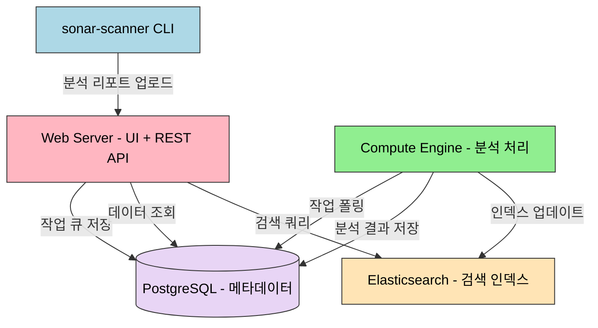

# SonarQube on K8s

> SonarQube는 정적 분석으로 코드 품질을 측정하고, Quality Gate로 배포 가부를 자동 판단합니다. Helm 차트로 Kubernetes에 설치하고, PostgreSQL과 연동하며, Jenkins 파이프라인에 통합합니다. 코드 커버리지, 버그, 보안 취약점, 코드 스멜을 추적하고 팀의 품질 기준을 강제할 수 있습니다.


## 학습 목표
> SonarQube를 Kubernetes 위에서 품질 게이트 엔진으로 운영하는 장입니다.

이 장에서 확인할 목표는 다음과 같다:

1. SonarQube의 가치와 정적 분석의 필요성을 설명할 수 있습니다.
2. 아키텍처(Web Server, Compute Engine, Elasticsearch, DB)를 파악할 수 있습니다.
3. Edition 간 차이를 비교하고 팀에 맞는 선택 기준을 세울 수 있습니다.
4. Helm 차트로 설치하고 PostgreSQL을 연동하는 흐름을 이해할 수 있습니다.
5. `sonar-scanner`로 프로젝트 분석을 실행하는 방법을 설명할 수 있습니다.
6. Quality Gate와 Quality Profile을 설정하는 이유를 설명할 수 있습니다.
7. Jenkins 파이프라인과 통합해 배포 가부를 자동 판단하는 흐름을 이해할 수 있습니다.
8. 리소스 제약 환경에서 SonarQube를 안정적으로 운영하는 포인트를 정리할 수 있습니다.


## 1. 왜 SonarQube인가
> 정적 분석이 CI/CD 안에서 어떤 역할을 하는지 먼저 정리합니다.

코드 리뷰는 버그를 잡고 품질을 높이는 강력한 방법이지만, 리뷰어는 비즈니스 로직과 아키텍처에 집중해야 합니다. "이 변수는 안 쓰이네요", "null 체크가 없어요" 같은 기계적인 지적에 시간을 쓰는 것은 비효율적입니다.

정적 분석은 코드를 실행하지 않고 소스코드를 읽어서 잠재적 버그, 보안 취약점, 코드 스멜을 찾습니다. SonarQube는 이 분석을 자동화하고, 결과를 시각화하며, 품질 기준을 강제하는 플랫폼입니다. Quality Gate는 "커버리지 80% 미만이면 배포 금지" 같은 기준을 설정하고 CI/CD 파이프라인에서 자동으로 체크합니다. 시간에 따른 버그 수, 커버리지, 기술 부채를 그래프로 보여주므로 팀의 품질 개선을 객관적으로 측정할 수 있습니다.


## 2. SonarQube 아키텍처
> SonarQube가 어떤 구성 요소로 동작하는지 운영 관점에서 봅니다.

SonarQube는 단일 바이너리가 아니라 여러 컴포넌트로 구성된 분산 시스템입니다.



**Web Server**는 UI와 REST API를 제공하며 기본 포트는 9000입니다. **Compute Engine**은 백그라운드 워커로, sonar-scanner가 분석 리포트를 업로드하면 DB 큐에서 작업을 가져와 처리합니다. 이슈 생성, 메트릭 계산, Elasticsearch 인덱싱이 이 단계에서 이루어집니다. **Elasticsearch**는 코드와 이슈 검색에 사용되며 SonarQube 7.x부터 내장되어 있습니다. **PostgreSQL**은 모든 프로젝트 메타데이터, 이슈, 측정값을 영속화합니다. 내장 H2는 테스트 용도일 뿐 프로덕션에서는 사용하면 안 됩니다.

| 구성 요소 | 역할 | 메모리 사용 |
|----------|------|-------------|
| Web Server | UI + REST API | 512Mi~1Gi |
| Compute Engine | 백그라운드 분석 처리 | 512Mi~2Gi |
| Elasticsearch | 코드/이슈 검색 인덱스 | 512Mi~1Gi |
| PostgreSQL | 메타데이터 영속화 | 256Mi~512Mi |


## 3. Edition 비교
> 기능 차이를 통해 어떤 배포 모델이 팀에 맞는지 판단합니다.

| 기능 | Community | Developer | Enterprise | Data Center |
|------|-----------|-----------|------------|-------------|
| 가격 | 무료 | 유료 | 유료 | 유료 |
| 브랜치 분석 | main만 | 전체 브랜치 | 전체 브랜치 | 전체 브랜치 |
| PR 데코레이션 | 없음 | GitHub/GitLab 코멘트 | 동일 | 동일 |
| 보안 리포트 | 기본 | OWASP, CWE | + PCI-DSS | 동일 |
| 고가용성 | 없음 | 없음 | 없음 | 클러스터 |

Community Edition의 가장 큰 한계는 브랜치 분석 불가입니다. Feature 브랜치나 PR을 분석하려면 Developer 이상이 필요합니다. 소규모 팀이나 개인 프로젝트라면 Community Edition으로 충분하지만, Git Flow를 적극 사용하는 팀은 Developer Edition을 고려해야 합니다.


## 4. Helm 차트로 설치
> 선언형 설치와 영속성 구성을 한 번에 정리합니다.

```bash
helm repo add sonarqube https://SonarSource.github.io/helm-chart-sonarqube
helm repo update
```

공식 문서 기준으로 SonarQube Helm chart는 최신 SonarQube 버전과 지원되는 Kubernetes 버전 조합을 기준으로 관리됩니다. 따라서 예시처럼 이미지 태그를 고정해 두더라도, 실제 설치 시에는 차트 지원 범위와 LTS 전용 차트 여부를 먼저 확인하는 편이 안전합니다.

minikube 기준 `values.yaml` 핵심 설정입니다.

```yaml
image:
  repository: sonarqube
  tag: "10.3.0-community"

resources:
  requests:
    cpu: "200m"
    memory: "1Gi"
  limits:
    cpu: "1000m"
    memory: "2Gi"

jvmOpts: "-Xmx1024m -Xms512m"
elasticsearch:
  javaOpts: "-Xmx512m -Xms512m"

service:
  type: NodePort
  nodePort: 32001

persistence:
  enabled: true
  size: 5Gi
  storageClass: "standard"

postgresql:
  enabled: false

jdbcOverwrite:
  enable: true
  jdbcUrl: "jdbc:postgresql://postgres-postgresql:5432/sonarqube"
  jdbcUsername: "sonarqube"
  jdbcSecretName: "sonarqube-postgres-secret"
  jdbcSecretPasswordKey: "password"

readinessProbe:
  initialDelaySeconds: 60
  periodSeconds: 30
  failureThreshold: 6
```

SonarQube의 특이점은 내장 Elasticsearch다. 공식 문서에서도 인덱스 영속화 옵션은 신중히 보라고 안내합니다. 시작 시간은 줄일 수 있지만, Kubernetes의 반복적인 재스케줄링이나 강제 종료와 결합되면 인덱스 손상 위험이 있습니다. 그래서 학습 문서에서는 "DB 영속화는 필수, Elasticsearch 영속화는 장단점을 따져 결정"으로 정리하는 편이 현실적입니다.

PostgreSQL을 별도로 설치하고 Secret을 생성한 뒤 SonarQube를 설치합니다.

```bash
helm repo add bitnami https://charts.bitnami.com/bitnami

helm install postgres bitnami/postgresql \
  --namespace sonarqube \
  --create-namespace \
  --set auth.username=sonarqube \
  --set auth.password=sonarqube123 \
  --set auth.database=sonarqube

kubectl create secret generic sonarqube-postgres-secret \
  --from-literal=password=sonarqube123 \
  -n sonarqube

helm install sonarqube sonarqube/sonarqube \
  --namespace sonarqube \
  --values values.yaml \
  --wait --timeout 10m
```

첫 시작은 DB 스키마 생성과 Elasticsearch 초기화로 2~3분 걸립니다. 기본 자격 증명은 `admin/admin`이며 첫 로그인 시 비밀번호 변경 프롬프트가 나옵니다.

현재 운영 문서에서는 단일 인스턴스 SonarQube를 전제로 설명하는 것이 맞습니다. 고가용성 자체가 필요하면 Data Center Edition과 별도 아키텍처를 봐야 하므로, Community/Developer/Enterprise 일반판을 Kubernetes에 올린다고 해서 자동으로 HA가 생긴다고 이해하면 안 됩니다.


## 5. 프로젝트 분석 실행
> 실제 코드 분석이 파이프라인 안에서 어떻게 실행되는지 봅니다.

sonar-scanner CLI로 프로젝트를 분석합니다. 프로젝트 루트에 `sonar-project.properties`를 작성합니다.

```properties
sonar.projectKey=my-app
sonar.projectName=My Application
sonar.projectVersion=1.0
sonar.sources=src
sonar.tests=src/test
sonar.java.binaries=target/classes
sonar.host.url=http://localhost:32001
sonar.login=<토큰>
```

Maven이나 Gradle을 사용하면 `sonar-project.properties` 없이 플러그인이 경로를 자동 인식합니다.

```bash
# Maven
mvn clean verify sonar:sonar \
  -Dsonar.projectKey=my-app \
  -Dsonar.host.url=http://localhost:32001 \
  -Dsonar.login=<토큰>
```


## 6. Quality Gate와 Quality Profile
> 품질 기준을 팀 규칙으로 고정하는 방법을 설명합니다.

Quality Gate는 "이 코드를 배포해도 되는가?"를 판단하는 기준입니다. 기본 Gate(Sonar way)의 조건은 다음과 같습니다.

| 조건 | 기준 | 적용 대상 |
|------|------|----------|
| Coverage | < 80% → Failed | New Code |
| Duplications | > 3% → Failed | New Code |
| Maintainability Rating | worse than A | New Code |
| Reliability Rating | worse than A | New Code |
| Security Rating | worse than A | New Code |

신규 코드(New Code)에만 조건을 적용하는 것이 핵심입니다. 레거시 프로젝트는 기술 부채가 쌓여 있어서 전체 코드를 기준으로 하면 항상 실패합니다. "과거는 용서하되, 미래는 깨끗하게"라는 현실적인 접근이 가능합니다.

Quality Profile은 어떤 규칙을 활성화할지 정의합니다. "Quality Profiles" 메뉴에서 기본 프로필을 복사하고, 규칙을 추가/제거하거나 심각도를 조정합니다. 규칙의 임계값도 커스터마이징할 수 있습니다. 예를 들어 Cognitive Complexity 기본값 15를 팀 사정에 맞게 조정합니다. Quality Profile은 XML로 백업하고 Git에 커밋하여 다른 인스턴스에 복원할 수 있습니다.


## 7. Jenkins 통합
> 분석 결과를 배포 결정으로 연결하는 자동화 흐름을 다룹니다.

SonarQube의 진가는 CI/CD 파이프라인에 통합했을 때 나타납니다. Jenkins에 "SonarQube Scanner" 플러그인을 설치하고, 시스템 설정에서 서버를 등록한 뒤 Webhook을 설정합니다.

```groovy
pipeline {
  agent {
    kubernetes {
      yaml """
apiVersion: v1
kind: Pod
spec:
  containers:
  - name: maven
    image: maven:3.8-jdk11
    command: ['sleep']
    args: ['infinity']
"""
    }
  }

  environment {
    SONAR_TOKEN = credentials('sonarqube-token')
  }

  stages {
    stage('Build') {
      steps {
        container('maven') {
          sh 'mvn clean package'
        }
      }
    }

    stage('SonarQube Analysis') {
      steps {
        container('maven') {
          withSonarQubeEnv('sonarqube') {
            sh 'mvn sonar:sonar -Dsonar.projectKey=my-app'
          }
        }
      }
    }

    stage('Quality Gate') {
      steps {
        timeout(time: 5, unit: 'MINUTES') {
          waitForQualityGate abortPipeline: true
        }
      }
    }

    stage('Deploy') {
      steps {
        echo 'Deploying...'
      }
    }
  }
}
```

`waitForQualityGate`는 Quality Gate 결과를 폴링합니다. "Failed"가 리턴되면 파이프라인을 중단하고, "Passed"면 배포 단계로 진행합니다. Webhook을 설정하면 폴링 대신 이벤트를 받으므로 대기 시간이 줄어듭니다. Webhook URL은 `http://jenkins:8080/sonarqube-webhook/`입니다.


## 8. minikube 리소스 설정
> 학습 환경에서 SonarQube가 요구하는 자원 규모를 현실적으로 잡습니다.

| 구성 요소 | Requests | Limits |
|----------|----------|--------|
| SonarQube | CPU 200m, Memory 1Gi | CPU 1000m, Memory 2Gi |
| Elasticsearch (내장) | CPU 100m, Memory 512Mi | CPU 500m, Memory 1Gi |
| PostgreSQL | CPU 100m, Memory 256Mi | CPU 500m, Memory 512Mi |

JVM 힙은 컨테이너 메모리 limits의 50~75%를 할당하는 것이 일반적입니다. 리소스가 제한되면 시작이 느려지므로 `initialDelaySeconds`와 `failureThreshold`를 늘려 최대 240초(4분)를 기다리도록 설정합니다.


## 9. 점검 질문
> SonarQube 운영과 품질 게이트 설계를 질문 중심으로 다시 점검합니다.

### Q1. SonarQube를 Kubernetes에 올리면 자동으로 고가용성이 되는가?

아닙니다. 일반 SonarQube Server를 Helm으로 설치하면 Kubernetes 위에서 실행될 뿐, 애플리케이션 자체는 보통 단일 인스턴스입니다. DB가 살아 있고 Pod가 재기동되더라도, 동시에 여러 애플리케이션 노드가 일을 나누는 구조는 Data Center Edition과 별도 구성이 필요합니다.

```bash
kubectl get pods -n sonarqube
kubectl get deploy,statefulset -n sonarqube
kubectl get pvc -n sonarqube
```

심화 질문. DB를 HA로 만들면 SonarQube도 HA라고 볼 수 있는가? 아닙니다. DB 고가용성은 데이터 영속성 측면이고, SonarQube 애플리케이션 계층의 다중 활성 노드와는 다른 문제입니다.

### Q2. SonarQube의 Quality Gate가 CI/CD 파이프라인에서 하는 역할

Quality Gate는 "이 코드를 배포해도 되는가?"라는 질문에 자동으로 답합니다. 사람이 수백 개의 이슈를 일일이 검토하지 않고, 사전에 정의된 기준(커버리지 80%, Critical 버그 0개 등)으로 통과/실패를 판단합니다.

Jenkins에서 `waitForQualityGate`를 호출하면 Quality Gate 결과를 폴링합니다. "Failed"가 리턴되면 파이프라인을 중단하고, "Passed"면 다음 스테이지(배포)로 진행합니다. 품질이 떨어지는 코드는 프로덕션에 도달할 수 없습니다.

Quality Gate의 핵심은 신규 코드에만 조건을 적용하는 것입니다. 레거시 프로젝트는 수천 개의 기술 부채를 안고 있어서 전체 코드를 기준으로 하면 항상 실패합니다. 신규 코드만 체크하면 "과거는 용서하되, 미래는 깨끗하게"라는 현실적인 접근이 가능합니다.

Quality Gate는 팀의 품질 기준을 코드로 만든 것이기도 합니다. "커버리지를 높이자"는 추상적인 목표가 "신규 코드 커버리지 80% 미만이면 배포 금지"라는 구체적인 규칙이 되어, 코드 리뷰에서 주관적 논쟁 대신 객관적 피드백을 줄 수 있습니다.

개발자가 코드를 푸시한 지 몇 분 만에 품질 결과를 받으므로 피드백 루프가 단축됩니다. 배포 후에 문제를 발견하는 것보다 개발 중에 발견하는 것이 수정 비용이 훨씬 낮습니다. 이것이 "Shift Left" 전략의 핵심입니다.

심화. Quality Gate가 너무 엄격하면 개발 속도가 느려집니다. 팀과 협의하여 점진적으로 강화하고, 리팩토링 기간에는 별도 브랜치 전략이나 임시 게이트를 활용합니다.

### Q3. Community Edition과 Developer Edition의 핵심 차이

가장 결정적인 차이는 브랜치 분석 유무입니다. Community Edition은 단일 브랜치(`main` 또는 `master`)만 분석할 수 있습니다. Feature 브랜치, PR 브랜치를 분석하려고 하면 "Branch analysis is not supported in Community Edition" 에러가 발생합니다. Developer Edition은 모든 브랜치를 독립적으로 분석하고, 브랜치 간 비교를 제공합니다. Git Flow나 GitHub Flow를 사용한다면 Developer Edition이 사실상 필수입니다.

PR 데코레이션도 차이가 있습니다. Developer Edition은 GitHub, GitLab, Bitbucket PR에 자동으로 코멘트를 답니다. Community Edition은 이 기능이 없어서 개발자가 수동으로 SonarQube 링크를 클릭해야 합니다.

신규 코드 정의의 유연성도 다릅니다. Developer Edition은 특정 날짜 이후, 특정 버전 이후, PR 기준 등 다양한 방법으로 신규 코드를 정의할 수 있습니다. Community Edition은 이전 분석 대비 변경된 코드만 신규 코드로 봅니다.

언어 지원은 Community Edition이 Java, JavaScript, Python, C#, Go 등 29개를 지원하며 대부분의 팀에게 충분합니다. Developer Edition은 Apex, COBOL, PL/SQL, Swift 등을 추가 지원하지만 언어 차이보다 브랜치 분석 차이가 더 결정적입니다.

가격은 Community Edition이 완전 무료이고, Developer Edition은 코드 라인 수 기준으로 과금합니다. 10만 라인까지 연 $150 정도입니다.

심화. Community Edition에서 브랜치별 분석을 흉내 내려면 `sonar.projectKey`를 브랜치별로 다르게 설정(예: `my-app-feature-login`)합니다. 다만 브랜치 간 비교 기능은 없습니다.

### Q4. SonarQube가 PostgreSQL을 필요로 하는 이유 (H2의 한계)

SonarQube에 내장된 H2 데이터베이스는 기본적으로 인메모리 모드로 동작합니다. 프로세스가 종료되면 모든 데이터가 사라집니다. SonarQube가 재시작되면 지난 분석 기록, 이슈, 사용자 설정이 모두 사라지므로 프로덕션에서는 절대 사용할 수 없습니다.

SonarQube는 수백만 개의 이슈, 메트릭, 스냅샷을 저장합니다. Compute Engine이 분석 리포트를 처리할 때 여러 테이블에 트랜잭션을 걸고 원자적으로 커밋해야 합니다. PostgreSQL은 ACID 트랜잭션을 완벽히 지원하지만 H2는 동시성이 높아지면 병목이 생깁니다.

PostgreSQL은 MVCC(Multi-Version Concurrency Control)로 읽기-쓰기 간 락 충돌을 최소화하고, B-tree, GIN, GiST 같은 다양한 인덱스와 강력한 쿼리 최적화기를 제공합니다. 프로덕션 SonarQube는 분석 기록과 품질 트렌드가 중요한 자산이므로 `pg_dump`, PITR 같은 엔터프라이즈급 백업 기능도 필요합니다.

심화. CloudNativePG(CNPG)로 PostgreSQL HA를 구성하면 DB는 HA가 되지만 SonarQube 자체는 단일 인스턴스로 남습니다. Data Center Edition만 SonarQube 자체 HA를 지원합니다.

### Q5. sonar-scanner의 동작 과정 (분석 → 리포트 → CE 처리)

sonar-scanner는 프로젝트 디렉토리를 재귀적으로 탐색하고 `sonar.sources`에 정의된 파일들을 읽습니다. 각 파일의 언어를 감지하고 해당 파서를 사용해서 AST(Abstract Syntax Tree)를 생성합니다. Java 파일이면 JavaParser, JavaScript 파일이면 ESLint Parser를 사용합니다.

Quality Profile에 정의된 규칙들을 AST에 적용합니다. 예를 들어 "Cognitive Complexity > 15" 규칙이 활성화되어 있으면 각 메서드의 복잡도를 계산하고 15를 넘으면 이슈를 생성합니다. 수백 개의 규칙이 병렬로 실행되며 패턴 매칭이나 데이터 플로우 분석을 수행합니다.

테스트 커버리지는 별도 리포트(JaCoCo, Istanbul 등)를 읽어서 통합합니다. 모든 이슈, 메트릭, 소스코드 정보를 JSON 형태의 분석 리포트로 패키징하고, HTTP POST로 SonarQube Web Server의 `/api/ce/submit`에 업로드합니다.

Web Server는 리포트를 받으면 DB의 작업 큐에 넣고 Task ID를 리턴합니다. sonar-scanner는 이 Task ID를 출력하고 종료합니다. 이후 Compute Engine이 백그라운드에서 큐를 폴링하여 이전 분석과 비교하고, Quality Gate 조건을 평가하고, 결과를 DB에 저장하며 Elasticsearch에 인덱싱합니다.

심화. Compute Engine이 처리 중에 크래시하면 작업이 큐에 남아있고 재시작 시 재처리됩니다. 대용량 프로젝트(100만 라인 이상)는 수십 분~시간이 걸리며, 병렬화와 인크리멘탈 분석으로 최적화합니다.

### Q6. Quality Profile 커스터마이징 방법과 팀 표준화

"Quality Profiles" 메뉴에서 기본 프로필(Sonar way)을 복사하여 팀 전용 프로필을 만듭니다. "Activate More" 버튼으로 비활성화된 규칙을 검색해서 추가하거나, 팀이 동의하지 않는 규칙은 "Deactivate"합니다.

규칙의 심각도(Blocker, Critical, Major, Minor, Info)를 조정할 수 있습니다. "TODO 주석" 규칙을 기본 Info에서 Critical로 올리면 Quality Gate에서 걸립니다. Cognitive Complexity 같은 임계값 기반 규칙은 파라미터를 변경하여 팀 사정에 맞게 조정합니다.

두 개의 Quality Profile을 비교하는 "Compare" 기능으로 Sonar way와 팀 프로필의 차이를 한눈에 확인할 수 있습니다. "Backup" 버튼으로 XML을 다운로드하고 Git에 커밋합니다. 새로운 SonarQube를 설치하면 "Restore"로 XML을 업로드하면 프로필이 자동 생성됩니다.

```bash
# Quality Profile 백업
curl -u admin:admin \
  "http://localhost:9000/api/qualityprofiles/backup?language=java&qualityProfile=My+Team+Profile" \
  -o my-profile.xml
```

팀 전체가 같은 프로필을 사용하면 일관된 품질 기준을 강제할 수 있습니다. 프로젝트마다 "Project Settings" → "Quality Profiles"에서 언어별로 프로필을 지정합니다.

### Q7. SonarQube와 Jenkins 통합 시 필요한 설정

Jenkins에 "SonarQube Scanner for Jenkins" 플러그인을 설치해야 합니다. 이 플러그인이 `withSonarQubeEnv`와 `waitForQualityGate` 스텝을 제공합니다.

Jenkins 시스템 설정에서 SonarQube 서버를 등록합니다. "Manage Jenkins" → "Configure System" → "SonarQube servers". 서버 이름, URL(`http://sonarqube:9000`), 인증 토큰을 입력합니다. GCP 클러스터에서는 Kubernetes Service 이름으로 서버 URL을 설정합니다.

Webhook을 설정하지 않으면 `waitForQualityGate`가 타임아웃까지 폴링하면서 시간을 낭비합니다. SonarQube UI → "Administration" → "Configuration" → "Webhooks" → "Create". URL은 `http://jenkins:8080/sonarqube-webhook/`입니다.

sonar-scanner를 실행할 때 프로젝트 키와 토큰을 전달해야 합니다. 토큰은 Jenkins Credentials로 저장하고 `credentials('sonarqube-token')`으로 주입합니다. SonarQube 분석은 컴파일된 바이너리와 테스트 리포트를 필요로 하므로 빌드 스테이지 다음에 배치합니다.

`waitForQualityGate`는 기본적으로 1분 동안 결과를 폴링합니다. 대형 프로젝트는 `timeout(time: 5, unit: 'MINUTES')`로 타임아웃을 늘리거나 Webhook을 설정합니다. `abortPipeline: true` 옵션으로 Quality Gate 실패 시 빌드를 중단합니다.

Community Edition은 브랜치 분석이 안 되므로, Jenkins 멀티브랜치 파이프라인에서 `sonar.projectKey`를 브랜치별로 다르게 설정해야 합니다.

### Q8. 리소스 제약 환경에서 SonarQube를 안정적으로 운영하려면 무엇을 봐야 하는가?

가장 자주 데이는 자리가 Elasticsearch heap입니다. SonarQube는 임베디드 ES를 띄우므로 노드 메모리가 부족하면 ES가 먼저 OOM이 나거나 인덱싱이 지연됩니다. Helm 차트의 `sonarqube.elasticsearch.javaOpts`로 heap을 명시하고, 노드의 `vm.max_map_count`를 ES 요구치(`262144`) 이상으로 올립니다. K8s `securityContext`나 init container로 sysctl을 적용합니다.

다음은 PVC 크기와 백업입니다. SonarQube의 분석 이력과 ES 인덱스가 같은 PVC에 쌓이므로 시간이 지나면 채워집니다. 분기별로 PVC 사용량을 점검하고, `data/` 디렉토리를 별도 백업 스케줄에 포함합니다. 임시 환경이라면 Resource Requests/Limits를 명시해 OOMKilled을 우선 막고, 정상 운영에서는 메모리 여유를 두는 편이 ES 안정성에 도움이 됩니다.


## 10. 정리
> SonarQube on K8s에서 기억해야 할 도입 포인트를 짧게 묶습니다.

핵심 개념 체크리스트:

- 정적 분석: 코드를 실행하지 않고 버그, 취약점, 코드 스멜을 자동으로 탐지
- Web Server + Compute Engine + Elasticsearch + PostgreSQL 4개 컴포넌트
- H2는 테스트 전용, 프로덕션은 PostgreSQL 필수
- Quality Gate: 신규 코드 기준으로 배포 가부를 자동 판단
- Quality Profile: 팀의 품질 규칙 집합, XML로 백업/복원 가능
- Community Edition 한계: 브랜치 분석 불가, PR 데코레이션 없음
- Jenkins 통합: `withSonarQubeEnv` + `waitForQualityGate` + Webhook


## 관련 문서
> CI 품질 분석 흐름의 앞뒤 장과 점검 문서를 함께 둡니다.

- [Jenkins on K8s](11-01.Jenkins%20on%20K8s.md) — 이전 장, CI/CD 자동화
- [ArgoCD와 GitOps](11-03.ArgoCD%EC%99%80%20GitOps.md) — 다음 장
