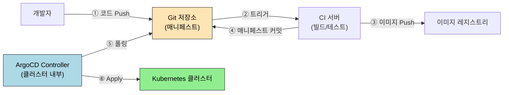
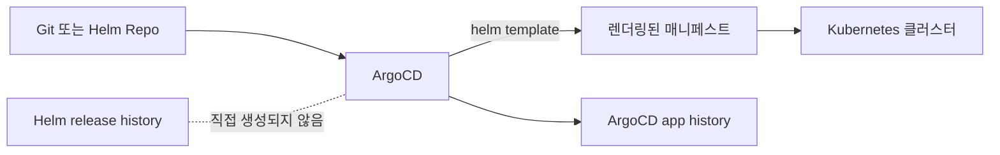

# ArgoCD와 GitOps

> GitOps는 "Git이 인프라의 단일 진실 공급원"이라는 원칙 위에 섭니다. ArgoCD는 이 원칙을 Kubernetes 위에서 구현한 CD 도구로, Git 상태를 클러스터에 지속적으로 반영합니다.

이 문서는 Kubernetes 흐름 안의 입문/브리지 문서입니다. ArgoCD 전체 설치, AppProject, App of Apps, ApplicationSet, Image Updater, 운영 심화는 별도 [`argocd` 카테고리](../../argocd/README.md)에서 상세히 다룹니다.


## 학습 목표
> Git을 배포의 기준 상태로 삼는 흐름을 ArgoCD 중심으로 정리합니다.

이 장에서 확인할 목표는 다음과 같다:

1. Push 모델과 Pull 모델의 차이를 이해하고 GitOps가 Pull 모델을 택한 이유를 설명할 수 있습니다.
2. ArgoCD `Application` CR의 핵심 필드를 읽고 어떤 동작을 유발하는지 설명할 수 있습니다.
3. Sync 상태와 Health 상태를 구분해 장애 원인을 추론할 수 있습니다.
4. App of Apps 패턴으로 다수 애플리케이션을 구조화하는 방법을 이해할 수 있습니다.
5. ArgoCD를 RBAC과 SSO와 연동하는 기본 전략을 설명할 수 있습니다.


## 1. GitOps란 무엇인가
> Git을 단일 진실 공급원으로 삼는다는 말이 실제 운영에서 무엇을 뜻하는지 정리합니다.

### 1.1 Push 모델의 한계

전통적인 CI/CD 파이프라인은 Push 모델입니다. CI 서버(Jenkins, GitHub Actions)가 빌드를 마치면 `kubectl apply`나 Helm을 직접 실행해 클러스터에 변경을 밀어 넣습니다. 이 구조에는 세 가지 취약점이 있습니다.

1. CI 서버에 클러스터 자격증명이 반드시 존재해야 합니다. CI 서버가 탈취되면 클러스터 전체가 위협받습니다.
2. 파이프라인 밖에서 누군가 직접 `kubectl apply`를 실행하면 Git과 클러스터 상태가 어긋납니다.
3. 감사 추적이 어렵습니다. "언제 누가 무엇을 배포했는가"라는 질문에 답하려면 CI 로그와 클러스터 이벤트를 교차 검증해야 합니다.

### 1.2 Pull 모델: ArgoCD의 접근법

ArgoCD는 Pull 모델로 동작합니다. 클러스터 안에 ArgoCD Controller가 상주하며 Git 저장소를 주기적으로 폴링합니다. Git에 변경이 생기면 Controller가 이를 감지하고 클러스터에 동기화합니다. CI 서버는 이미지를 빌드하고 Git에 매니페스트를 커밋하는 역할만 합니다. 클러스터 자격증명이 외부에 노출되지 않으며, Git 커밋 히스토리가 배포 감사 로그를 겸합니다. 드리프트(drift) — Git과 클러스터 상태의 불일치 — 도 ArgoCD가 지속 감시해 자동으로 수정하거나 경고할 수 있습니다.




## 2. ArgoCD 핵심 개념
> ArgoCD가 Git 상태와 클러스터 상태를 어떻게 비교하고 동기화하는지 설명합니다.

### 2.1 Application CR

ArgoCD의 핵심은 `Application` Custom Resource다. 이 CR이 "어떤 Git 저장소의 어떤 경로를, 어떤 클러스터의 어떤 네임스페이스에 배포할지"를 선언합니다.

```yaml
apiVersion: argoproj.io/v1alpha1
kind: Application
metadata:
  name: my-app
  namespace: argocd
spec:
  project: default
  source:
    repoURL: https://github.com/org/k8s-manifests
    targetRevision: HEAD
    path: apps/my-app
  destination:
    server: https://kubernetes.default.svc
    namespace: production
  syncPolicy:
    automated:
      prune: true       # Git에서 삭제된 리소스를 클러스터에서도 삭제
      selfHeal: true    # 드리프트 감지 시 자동 복구
```

### 2.2 Sync 상태와 Health 상태

두 상태는 독립적으로 관리됩니다. Sync 상태는 Git과 클러스터의 일치 여부입니다. `Synced`는 일치, `OutOfSync`는 불일치를 의미합니다. Health 상태는 클러스터 리소스가 실제로 정상 동작하는지를 나타냅니다. `Healthy`, `Progressing`, `Degraded`, `Suspended` 네 가지입니다.

두 상태의 조합이 진단에 중요합니다. `Synced + Degraded`는 Git 내용이 그대로 반영됐으나 Pod가 뜨지 않는 상황입니다. 이미지 오류나 설정 실수일 가능성이 높습니다. `OutOfSync + Healthy`는 클러스터는 잘 돌아가지만 Git과 달라진 상태입니다. 수동으로 직접 변경이 가해졌을 때 자주 나타납니다.

### 2.3 Sync Waves와 Hook

복잡한 배포에서는 리소스 생성 순서가 중요합니다. 데이터베이스 스키마 마이그레이션이 완료된 뒤 애플리케이션이 기동해야 하는 경우가 대표적입니다. ArgoCD는 두 가지 메커니즘을 제공합니다.

`sync-wave` 어노테이션은 리소스에 정수 순서를 부여합니다. 낮은 wave 번호의 리소스가 Healthy 상태가 돼야 다음 wave로 넘어갑니다.

```yaml
metadata:
  annotations:
    argocd.argoproj.io/sync-wave: "1"   # 먼저 실행
```

Sync Hook은 배포 전후에 Job을 실행합니다. `PreSync`는 배포 전 마이그레이션, `PostSync`는 배포 후 스모크 테스트에 활용합니다.

### 2.4 Helm과의 관계: 템플릿 엔진 vs 배포 이력

ArgoCD는 Helm chart를 소스로 사용할 수 있지만, Helm release를 직접 운영하는 방식과는 다릅니다. 공식 문서 기준으로 ArgoCD는 Helm을 `helm template` 단계에만 사용하고, 애플리케이션의 라이프사이클은 ArgoCD가 관리합니다. 그래서 ArgoCD로 배포한 Helm 기반 애플리케이션은 일반적으로 `helm ls`, `helm history` 같은 명령으로 추적되지 않습니다.



이 차이는 롤백 방식에서도 그대로 드러납니다. Helm 직접 배포는 release revision 기준으로 `helm rollback`을 수행합니다. ArgoCD는 `argocd app history`와 `argocd app rollback` 또는 Git의 이전 커밋/태그로 되돌리는 방식으로 롤백합니다. 즉 "Helm의 버전 관리를 ArgoCD가 그대로 가져간다"기보다 "ArgoCD가 자기 이력 체계로 대체한다"에 가깝습니다.


## 3. App of Apps 패턴
> 애플리케이션 수가 늘어날 때 GitOps 구조를 어떻게 계층화할지 다룹니다.

애플리케이션이 10개, 20개로 늘어나면 각각을 수동으로 등록하는 방식이 한계에 달합니다. App of Apps 패턴은 이를 해결합니다. 최상위 Application CR이 여러 하위 Application CR을 가리키는 Git 경로를 소스로 지정합니다. ArgoCD가 최상위를 Sync하면 하위 Application들이 자동으로 생성되고, 각 하위 Application이 실제 서비스를 배포합니다.

```
apps/
  app-of-apps.yaml          # 최상위 Application (ArgoCD에 직접 등록)
  apps/
    frontend.yaml           # 하위 Application
    backend.yaml
    database.yaml
```

ArgoCD ApplicationSet은 App of Apps를 더 선언적으로 확장합니다. Generator(List, Git Directory, Cluster)를 통해 패턴에 맞는 Application을 동적으로 생성합니다. 예를 들어 Git의 `apps/` 디렉토리 아래 새 폴더가 생기면 자동으로 Application CR이 만들어집니다.


## 4. 롤백 전략
> Git revert와 클러스터 동기화가 결합된 롤백 흐름을 정리합니다.

ArgoCD의 롤백은 Git 히스토리를 기반으로 합니다. 특정 커밋 SHA나 태그로 `targetRevision`을 변경하면 ArgoCD가 해당 시점의 매니페스트로 클러스터를 복원합니다. `automated syncPolicy`가 활성화된 경우, 롤백 후 다시 HEAD로 Sync되지 않도록 잠시 비활성화하거나 별도 브랜치를 사용해야 합니다.

CLI 기준으로는 다음 흐름을 사용한다:

```bash
argocd app history my-app
argocd app rollback my-app 3
```

여기서 `3`은 Helm release revision이 아니라 ArgoCD가 기록한 application history ID다. 따라서 이전에 Helm으로 직접 배포했던 revision 2, revision 5 같은 이력을 ArgoCD가 읽어와 그대로 롤백하는 방식은 기대하면 안 됩니다. Helm의 이력은 Helm release에, ArgoCD의 이력은 ArgoCD Application에 각각 따로 남습니다.

Blue-Green 배포와 Canary 배포는 ArgoCD Rollouts를 별도로 설치해 활용합니다. `Rollout` CR이 Deployment를 대체하며, 트래픽 가중치를 단계적으로 조정하면서 새 버전을 검증합니다. 이상 감지 시 자동 롤백 트리거를 설정할 수 있습니다.


## 5. RBAC과 SSO 연동
> GitOps 도구도 결국 조직 권한 체계 안에 들어가야 한다는 점을 설명합니다.

ArgoCD는 자체 RBAC 시스템을 가집니다. `argocd-rbac-cm` ConfigMap에 역할과 정책을 정의합니다. 정책은 `p, <role>, <resource>, <action>, <scope>, <allow|deny>` 형태입니다.

실무에서는 Dex를 통해 GitHub/Google/LDAP SSO와 연동합니다. 조직의 팀이나 그룹을 ArgoCD 역할에 매핑하면 별도의 계정 관리가 필요 없습니다. `admin` 역할은 모든 애플리케이션을 관리하고, `readonly` 역할은 조회만 허용하며, 팀별 역할은 자신의 네임스페이스 애플리케이션만 제어하도록 범위를 제한합니다.


## 6. 점검 질문
> ArgoCD 운영 모델과 GitOps 판단 포인트를 질문 중심으로 다시 점검합니다.

### Q1. ArgoCD가 Helm의 버전 이력을 그대로 가져가는가?

아닙니다. 공식 문서 기준으로 ArgoCD는 Helm을 패키지 매니저처럼 유지하지 않고 템플릿 엔진처럼 사용합니다. 즉 `helm install`처럼 릴리스 revision Secret을 누적 관리하는 방식이 아니라, Git의 소스 revision과 ArgoCD의 sync history를 중심으로 배포 이력을 기록합니다.

```bash
# ArgoCD 앱 히스토리 확인
argocd app history my-app

# Helm release 히스토리 확인
helm history my-app -n production
```

둘을 비교하면 기록 단위가 다릅니다. Helm은 release revision 중심이고, ArgoCD는 app sync와 Git revision 중심입니다. 그래서 Helm chart를 ArgoCD로 배포해도 클러스터에 Helm release Secret이 항상 남는다고 가정하면 안 됩니다.

심화 질문. 이전 버전 롤백은 가능한가? 가능하지만 기준이 다릅니다. Helm은 `helm rollback <release> <revision>`처럼 revision 번호로 되돌리고, ArgoCD는 `argocd app rollback <app> <history-id>`처럼 application history ID 기준으로 되돌립니다. 자동 동기화가 켜져 있으면 롤백 직후 Git 상태와 다시 충돌할 수 있으므로 운영 절차를 먼저 정해야 합니다.

### Q2. Push 모델과 Pull 모델의 차이는?

Push 모델에서 CI 서버는 클러스터 자격증명을 직접 보유하고 `kubectl apply`를 실행합니다. CI 서버가 탈취되면 클러스터 전체가 위협받습니다. Git과 클러스터 상태의 드리프트가 발생해도 즉시 감지되지 않습니다.

Pull 모델에서 ArgoCD Controller는 클러스터 안에서 Git을 폴링합니다. 자격증명이 외부에 노출되지 않습니다. 드리프트 감지가 지속 실행되며, `selfHeal: true`를 켜면 자동으로 복원됩니다.

심화 질문. 외부 CI가 `kubectl apply`를 직접 실행하면 ArgoCD와 충돌하는가? `selfHeal`이 활성화된 경우 CI가 배포한 내용을 ArgoCD가 즉시 되돌립니다. 의도한 변경은 반드시 Git 커밋을 통해 이뤄져야 합니다. CI는 Git에만 쓰고 배포는 ArgoCD에 맡기는 역할 분리가 핵심입니다.

### Q3. Sync 상태와 Health 상태의 조합

두 상태는 독립적입니다. `Synced + Healthy`가 정상입니다. `Synced + Degraded`는 Git 내용이 그대로 반영됐으나 Pod가 뜨지 않는 상황입니다. 이미지 오류, 설정 실수, 의존 서비스 미준비가 원인입니다. `OutOfSync + Healthy`는 클러스터가 잘 동작하지만 Git과 달라진 상태입니다. 누군가 직접 `kubectl apply`를 실행했을 때 나타납니다.

```bash
# Application 상태 전체 확인
kubectl get applications -n argocd

# 특정 Application 상세
kubectl describe application my-app -n argocd
```

심화 질문. `SyncFailed` 상태는 무엇인가? Git 파일은 있지만 `kubectl apply` 자체가 실패한 상태입니다. YAML 문법 오류, 존재하지 않는 CRD 참조, 권한 부족이 원인입니다. ArgoCD UI의 Sync 탭에서 실패한 리소스와 에러 메시지를 확인합니다.

### Q4. selfHeal과 prune의 차이

`selfHeal`은 클러스터 상태가 Git과 달라질 때 Git 상태로 복원합니다. 누군가 직접 `kubectl edit`으로 Deployment 이미지를 바꾸면 ArgoCD가 감지하고 Git 값으로 되돌립니다.

`prune`은 Git에서 삭제된 리소스를 클러스터에서도 삭제합니다. `prune: false`(기본값)이면 Git에서 파일을 지워도 클러스터에 리소스가 남습니다. `prune: true`이면 함께 삭제됩니다.

```bash
# 수동 Sync (prune 포함)
argocd app sync my-app --prune

# selfHeal 임시 비활성화 (롤백 중 되돌림 방지)
argocd app set my-app --self-heal=false
```

### Q5. Application CR 핵심 필드

```yaml
spec:
  source:
    repoURL: https://github.com/org/k8s-manifests
    targetRevision: HEAD      # 브랜치, 태그, 커밋 SHA 모두 가능
    path: apps/my-app         # 이 경로의 모든 매니페스트를 적용
  destination:
    server: https://kubernetes.default.svc   # 같은 클러스터
    namespace: production
  syncPolicy:
    automated:
      prune: true
      selfHeal: true
    syncOptions:
      - CreateNamespace=true  # 네임스페이스 없으면 자동 생성
```

`targetRevision: HEAD`는 기본 브랜치의 최신 커밋을 추적합니다. 특정 태그나 커밋 SHA를 지정하면 해당 버전에 고정됩니다. 롤백 시 이 값을 변경하는 것이 ArgoCD의 롤백 방법입니다.

심화 질문. 여러 환경(dev/staging/prod)을 어떻게 구성하는가? 방법은 두 가지입니다.

1. 환경별 브랜치(`main`, `staging`, `production`)를 두고 각 Application의 `targetRevision`을 다르게 설정합니다.
2. 단일 브랜치에 환경별 디렉토리(`apps/dev/`, `apps/prod/`)를 두고 각 Application의 `path`를 다르게 설정합니다.

두 번째 방식이 단일 진실 공급원 원칙에 더 가깝습니다.

### Q6. App of Apps 패턴

최상위 Application CR이 여러 하위 Application CR을 포함하는 Git 경로를 가리킵니다. 최상위를 Sync하면 하위 Application들이 모두 생성됩니다.

```bash
# 최상위 Application 등록
kubectl apply -f - <<EOF
apiVersion: argoproj.io/v1alpha1
kind: Application
metadata:
  name: app-of-apps
  namespace: argocd
spec:
  source:
    repoURL: https://github.com/org/k8s-manifests
    path: apps
    targetRevision: HEAD
  destination:
    server: https://kubernetes.default.svc
    namespace: argocd
  syncPolicy:
    automated:
      prune: true
      selfHeal: true
EOF
```

심화 질문. 하위 Application이 100개로 늘면 관리가 어렵습니다. ApplicationSet은 Generator를 통해 패턴에 맞는 Application을 동적으로 생성합니다. Git Directory Generator는 `apps/` 디렉토리 아래 새 폴더가 생기면 자동으로 Application을 만듭니다.

### Q7. Sync Waves와 배포 순서 제어

데이터베이스 마이그레이션 Job이 완료된 뒤 애플리케이션이 기동해야 하는 순서를 강제합니다.

```yaml
# 1단계: 마이그레이션 Job
metadata:
  annotations:
    argocd.argoproj.io/sync-wave: "1"
    argocd.argoproj.io/hook: PreSync
    argocd.argoproj.io/hook-delete-policy: HookSucceeded
---
# 2단계: 애플리케이션
metadata:
  annotations:
    argocd.argoproj.io/sync-wave: "2"
```

낮은 wave 번호의 리소스가 Healthy 상태가 돼야 다음 wave로 넘어갑니다. `HookSucceeded` 삭제 정책은 Job이 성공하면 자동으로 삭제해 이후 Sync 시 재실행되지 않도록 합니다.

### Q8. RBAC과 SSO 연동

```bash
# 현재 RBAC 정책 확인
kubectl get configmap argocd-rbac-cm -n argocd -o yaml

# 사용자별 권한 확인
argocd account can-i sync applications '*'
```

`argocd-rbac-cm` ConfigMap에 정책을 작성합니다.

```yaml
data:
  policy.default: role:readonly
  policy.csv: |
    p, role:developer, applications, sync, */*, allow
    p, role:developer, applications, get, */*, allow
    g, github-org:team-a, role:developer
```

심화 질문. Dex와 GitHub OAuth를 연동하면 GitHub 팀 멤버십이 ArgoCD 역할에 자동 매핑됩니다. `argocd-cm`의 `dex.config`에 GitHub OAuth 앱 credentials를 설정합니다. 팀원이 조직에 합류하거나 떠날 때 ArgoCD 계정을 별도 관리할 필요가 없어집니다.

---


## 7. 다음 단계
> 배포 자동화 다음 단계로 관측과 장애 대응 흐름으로 넘어갑니다.

Ch15에서는 클러스터 모니터링과 트러블슈팅을 다룹니다. ArgoCD의 Health 상태가 `Degraded`로 떨어졌을 때 Prometheus와 Grafana로 원인을 추적하는 흐름이 이어집니다.

실제 운영 흐름에서는 GitOps 앞뒤에 두 가지가 자주 붙습니다. 하나는 Kustomize로 환경별 매니페스트 차이를 정리하는 단계이고, 다른 하나는 Harbor 같은 OCI 레지스트리로 이미지와 Helm chart를 함께 관리하는 단계입니다. 그래서 Helm 다음에 Kustomize, ArgoCD 옆에 Harbor를 두면 도구 간 연결이 더 자연스럽습니다.


## 관련 문서
> DevTools 흐름의 마지막 장과 운영 장의 첫 진입점을 연결합니다.

- [argocd MOC](../../argocd/README.md) — ArgoCD 상세 시리즈 전체
- [App of Apps와 ApplicationSet](../../argocd/02-03.App%20of%20Apps%EC%99%80%20ApplicationSet.md) — 여러 애플리케이션 구조화
- [CI 연동과 Image Updater](../../argocd/04-02.CI%20%EC%97%B0%EB%8F%99%EA%B3%BC%20Image%20Updater.md) — 자주 쓰는 자동화 확장
- [SonarQube on K8s](11-02.SonarQube%20on%20K8s.md) — 이전 장
- [Harbor](11-04.Harbor.md) — 이미지와 OCI Helm chart를 함께 관리하는 레지스트리
- [모니터링과 트러블슈팅](../09_operations/09-01.%EB%AA%A8%EB%8B%88%ED%84%B0%EB%A7%81%EA%B3%BC%20%ED%8A%B8%EB%9F%AC%EB%B8%94%EC%8A%88%ED%8C%85.md) — 다음 장
