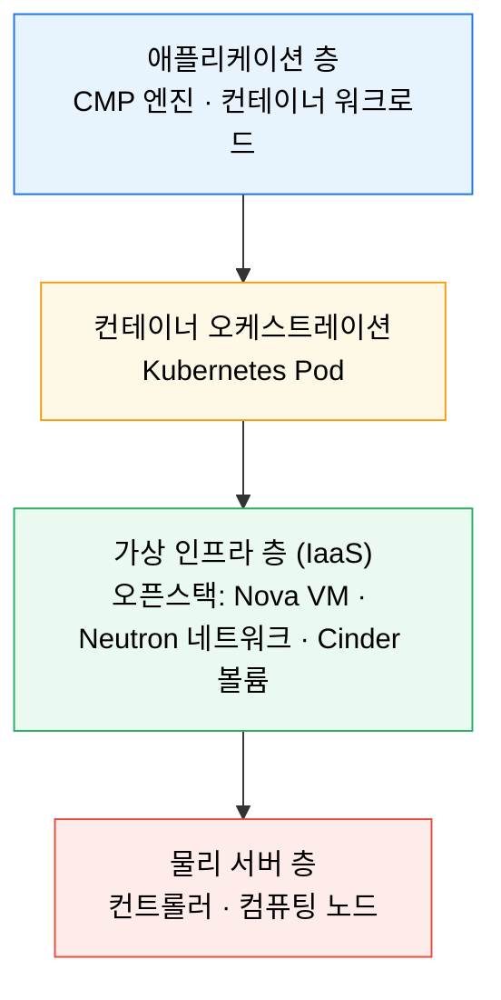

# 오픈스택 개요 — IaaS와 컨테이너 층

---

> 오픈스택은 "내 데이터센터에 AWS를 직접 구축하는" 오픈소스 IaaS 플랫폼입니다. Kubernetes 보다 한 층 아래, VM·네트워크·스토리지 같은 인프라 자체를 만드는 층이고, 회사 CMP·컨테이너는 그 위에서 돕니다. 이 문서는 개발자가 "내 앱이 도는 바닥 인프라"를 조망하는 참고용 개요입니다.

## 학습 목표

> 서비스 내부까지 파지 않고, 층과 대응 관계만 잡습니다.

이 문서를 읽으면 다음에 답할 수 있습니다.

1. IaaS 가 무엇이고 오픈스택이 어떤 문제를 푸는지 한 문장으로 설명할 수 있습니다.
2. 오픈스택 주요 서비스를 이미 아는 AWS 서비스에 대응시켜 이해할 수 있습니다.
3. 오픈스택(IaaS)과 Kubernetes(컨테이너)가 어떤 층 관계인지, 왜 개발자가 바닥 층을 알아야 하는지 설명할 수 있습니다.

## 1. 오픈스택이란

> 물리 서버 여러 대를 묶어, 그 위에 가상 자원을 API 로 찍어내게 해 주는 오픈소스 소프트웨어입니다.

오픈스택(OpenStack)은 **오픈소스 IaaS(Infrastructure as a Service) 플랫폼**입니다. 쉽게 말해 "내가 소유한 데이터센터 안에 AWS 같은 클라우드를 직접 구축하는 소프트웨어"입니다. 물리 서버 여러 대를 하나로 묶어, 그 위에 가상 머신(VM)·가상 네트워크·가상 스토리지를 REST API 로 생성·삭제할 수 있게 해 줍니다.

핵심은 **"인프라를 코드/API 로 다룬다"** 는 점입니다. 관리자가 서버실에 들어가 물리 장비를 직접 꽂는 대신, `openstack server create` 같은 명령 한 줄로 VM 을 띄웁니다. AWS 콘솔에서 EC2 인스턴스를 만드는 경험을, 사내 서버에서 그대로 재현하는 것입니다.

회사(오케스트로) 관점에서 중요한 이유가 여기 있습니다. 제품 **CMP·TROMBONE 이 오픈스택 위에서 동작**합니다. 오픈스택이 만든 VM 안에서 Kubernetes Pod(컨테이너)가 돌고, 그 위에서 CMP 엔진이 실행됩니다. 즉 오픈스택은 우리 서비스가 딛고 선 **바닥 인프라**입니다.

## 2. AWS 서비스 대응표

> 오픈스택 서비스는 대부분 익숙한 AWS 서비스에 1:1 로 대응됩니다. 새 이름을 외우기보다 아는 것에 붙이면 빠릅니다.

| 오픈스택 | AWS 대응 | 역할 |
|----------|----------|------|
| **Nova** | EC2 | 가상 머신(인스턴스) 생성·관리 |
| **Neutron** | VPC | 가상 네트워크·서브넷·라우팅 |
| **Cinder** | EBS | 블록 스토리지(1 VM 1 볼륨) |
| **Manila** | EFS | 파일 공유 스토리지(다수 VM 동시 마운트, NFS/CIFS) |
| **Swift** | S3 | 오브젝트 스토리지 |
| **Glance** | AMI | VM 이미지 저장소 |
| **Keystone** | IAM | 인증·인가(모든 서비스의 관문) |
| **Barbican** | KMS / Secrets Manager | 키·인증서·비밀 관리 |
| **Octavia** | ELB | 로드 밸런서 |
| **Horizon** | 관리 콘솔 | 웹 대시보드(GUI) |

오픈스택 특화라서 AWS 에 딱 맞는 대응이 없는 것도 있습니다. **Placement** 는 "어느 물리 노드에 VM 을 올릴지" 를 위해 vCPU·RAM·디스크 자원을 추적하는 내부 컴포넌트로, Nova 스케줄러가 배치를 결정할 때 호출합니다. **httpd** 는 별도 서비스가 아니라, Keystone·Horizon·Placement 같은 서비스의 API 를 실제로 호스팅하는 웹 서버(mod_wsgi 로 Python 코드 실행, TLS 종단)입니다.

## 3. IaaS와 컨테이너 층 관계

> 오픈스택은 인프라를 *만드는* 층, Kubernetes 는 그 위에서 앱을 *굴리는* 층입니다. 둘은 경쟁이 아니라 위아래로 쌓입니다.

세미나 아키텍처를 층으로 그리면 다음과 같습니다.

오픈스택이 물리 서버를 묶어 **VM 을 만들면**, 그 VM 안에 Kubernetes 클러스터가 설치되고, K8s 가 그 위에서 **컨테이너(Pod)를 굴립니다.** 우리가 `08_cloud/kubernetes` 에서 다룬 모든 내용은 이 그림의 위쪽 두 층이고, 오픈스택은 그 아래 IaaS 층입니다.

개발자가 이 바닥 층을 알아야 하는 이유는 분명합니다. 내 앱이 "왜 이 노드에 배치됐는지", "네트워크가 왜 이렇게 격리됐는지", "스토리지가 왜 이 성격인지" 는 결국 IaaS 층이 어떻게 깔렸는지에 좌우됩니다. 클라우드 매니지드 K8s(EKS·GKE)에서는 이 층이 감춰져 있지만, 사내 오픈스택 위에서는 이 층이 그대로 드러납니다.

## 4. 세미나가 다룬 8개 서비스 한눈에

> 5차 세미나는 오픈스택 서비스 8개를 소개했습니다. 이 중 절반은 오픈스택 특화이고, 절반은 오픈스택 밖에서도 쓰는 범용 미들웨어입니다. 범용 3종은 이미 다른 카테고리에 정리돼 있어 링크로 대신합니다.

| 서비스 | 한 줄 역할 | 성격 | 더 볼 곳 |
|--------|-----------|------|----------|
| **httpd** | Keystone·Horizon·Placement API 를 호스팅하는 웹 서버(mod_wsgi·TLS 종단) | 오픈스택 특화 | 본 문서 §2 |
| **Placement** | vCPU·RAM·디스크 자원을 추적해 Nova 스케줄러의 VM 배치 결정을 지원 | 오픈스택 특화 | 본 문서 §2 |
| **Manila** | NFS/CIFS/CephFS 파일 공유 스토리지(다수 VM 동시 마운트) = EFS | 오픈스택 특화 | 본 문서 §2 |
| **Barbican** | 암호화 키·인증서·비밀 관리(HSM 연동) = KMS | 오픈스택 특화 | 본 문서 §2 |
| **Octavia** | 로드 밸런서(Amphora VM·컨트롤러·헬스매니저) = ELB | 오픈스택 특화 | 본 문서 §2 |
| **Prometheus** | 메트릭 기반 모니터링(TSDB·PromQL·Pull·Alertmanager) | 범용 | [`06_observability/`](../../06_observability/README.md) |
| **RabbitMQ** | 메시지 큐(Exchange·Queue·라우팅) | 범용 | [`99_ETC/분석/06-eda-messaging-patterns.md`](../../99_ETC/%EB%B6%84%EC%84%9D/06-eda-messaging-patterns.md) |
| **Memcached** | 인메모리 캐싱(Redis 대비 단순·멀티스레드) | 범용 | (미작성 — 추후 `05_data` 에 정리 예정) |

오픈스택 특화 5종은 여기서 역할만 잡아 둡니다. 서비스별 상세는 필요해질 때 별도 편으로 확장할 여지를 둡니다(이 문서는 참고용 조망까지가 범위입니다).

## 5. 한 줄 정리

오픈스택은 사내 서버에 AWS 를 세우는 오픈소스 IaaS 이고, Nova(=EC2)·Neutron(=VPC)·Cinder(=EBS)·Keystone(=IAM) 이 그 뼈대이며, 회사 CMP·Kubernetes 는 이 오픈스택이 만든 VM 위에서 도는 상위 층입니다. 개발자에게 오픈스택은 "내 앱이 딛고 선 바닥" 을 이해하는 지도입니다.

## 관련 문서

> 위층(컨테이너)과 옆 카테고리(모니터링·메시징)로 이어집니다.

- [08_cloud/openstack MOC](README.md) — 이 카테고리 진입점
- [kubernetes MOC](../kubernetes/README.md) — 오픈스택 VM 위에서 도는 컨테이너 층
- [06_observability](../../06_observability/README.md) — Prometheus 상세
- [오픈스택 개요 점검](00-01.%EC%98%A4%ED%94%88%EC%8A%A4%ED%83%9D%20%EA%B0%9C%EC%9A%94%20%EC%A0%90%EA%B2%80.md) — 자가 점검
