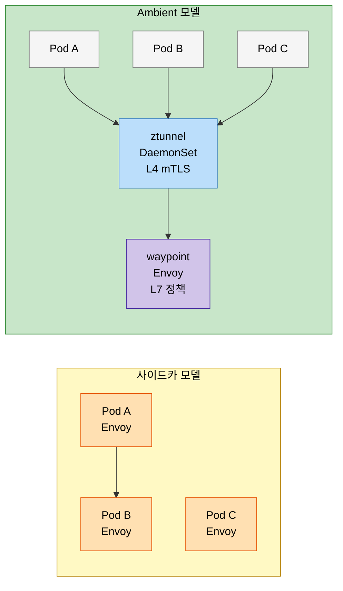

# 서비스 메시 기초 점검

> 본 장의 심화 점검 질문입니다. LEARN에서 다룬 개념의 경계와 운영 환경에서 주의할 판단 포인트를 Q&A 형태로 정리했습니다.

## 점검 질문
> 라이브러리 방식과 메시의 차이, 사이드카 세금, 도입 안티패턴, Ambient mesh 트레이드오프, 도입 결정 프레임워크를 Q&A로 점검합니다.

### Q1. 라이브러리 방식(Hystrix, Resilience4j)이 이미 재시도·서킷 브레이커를 제공하는데, 사이드카 기반 메시는 어떤 문제를 실제로 해결하는가?

라이브러리 방식의 근본 한계는 언어 이질성과 정책 드리프트에 있습니다. Java 팀은 Resilience4j를 쓰고 Go 팀은 go-resiliency를 쓰고 Python 팀은 별도 구현을 유지하면, 타임아웃 값 하나를 통일하려면 세 팀의 코드베이스를 동시에 수정해야 합니다. 운영 중인 프로덕션 환경에서 이 동기화가 실제로 이루어지는 경우는 드뭅니다.

더 깊은 문제는 신뢰의 경계(trust boundary)입니다. 라이브러리는 애플리케이션 코드와 같은 프로세스에서 실행됩니다. 취약한 의존성이나 코드 버그가 서킷 브레이커 로직 자체를 우회하거나 훼손할 수 있습니다. 사이드카는 별도 프로세스에서 실행되므로 애플리케이션의 버그나 침해가 네트워크 정책에 영향을 주기 어렵습니다. 이는 제로 트러스트 보안 모델의 핵심 전제조건이기도 합니다.

라이브러리 방식의 고유한 장점도 있습니다. 애플리케이션 내부 상태(비즈니스 로직 기반 서킷 조건)를 기준으로 서킷 브레이커를 트리거할 수 있습니다. HTTP 200이지만 비즈니스적으로 실패인 응답을 사이드카는 구별하기 어렵습니다. 이 지점에서 라이브러리와 메시의 역할이 상호 보완적임을 알 수 있습니다.

팀이 단일 언어로 구성되어 있고 이미 Spring Cloud Gateway와 Resilience4j가 안정적으로 운영 중이라면, 메시 도입의 ROI는 현저히 낮아집니다. 반면 폴리글랏 마이크로서비스가 10개 이상이고 컴플라이언스 요구사항이 있다면 메시가 실질적 가치를 가집니다.

### Q2. 사이드카 세금(sidecar tax)은 실제로 얼마인가? 비용이 용납되는 워크로드와 용납되지 않는 워크로드는 어떻게 구분하는가?

Linkerd의 공개 벤치마크(2023, 2024) 기준으로 500바이트 페이로드 HTTP/1.1 요청에서 p50 레이턴시 추가는 약 0.3ms, p99에서 약 1ms 수준입니다. Istio(Envoy 기반)는 같은 조건에서 p50 약 0.7ms, p99 약 3-5ms가 추가됩니다. Linkerd의 linkerd2-proxy는 Rust로 작성된 마이크로프록시로, Envoy 대비 메모리 사용량과 레이턴시 오버헤드가 낮은 것이 특징입니다. (출처: https://linkerd.io/2024/05/07/linkerd-vs-istio-benchmarks-2024/)

이 수치가 의미 있으려면 기준선이 필요합니다. 애플리케이션 자체의 p99가 200ms라면 3ms 추가는 1.5%에 불과합니다. 그러나 고빈도 트레이딩이나 실시간 게임처럼 p99 목표가 5ms 이하인 워크로드에서는 3ms 추가가 허용 불가능합니다. 오버헤드의 절대값이 아닌 비율과 SLO 대비 여유분으로 판단해야 합니다.

메모리는 다른 차원의 문제입니다. Envoy 사이드카는 약 50-80MB, Linkerd proxy는 약 10-25MB를 소비합니다. 100개 노드, 노드당 20개 Pod = 2,000개 Pod 클러스터에서 Envoy 사이드카만 100GB, linkerd2-proxy는 20GB가 됩니다. Ambient mesh가 이 문제를 해결하려는 이유가 여기에 있습니다.

사이드카 세금 허용 여부를 판단하는 프레임워크: 현재 서비스의 p99 레이턴시에서 SLO까지 남은 버짓을 계산합니다. 그 버짓이 메시 오버헤드의 3배 이상이라면 수용 가능합니다.

### Q3. 서비스 메시가 오히려 독이 되는 상황은 언제인가?

도입하지 말아야 할 신호는 세 가지 범주로 나눌 수 있습니다.

1. 팀 규모와 역량 불일치입니다. Kubernetes를 운영한 경험이 6개월 미만인 팀이 Istio를 도입하면, 두 개의 복잡한 시스템을 동시에 학습하게 됩니다. Istio의 디버깅은 Envoy 필터 체인, xDS 프로토콜, Kubernetes CRD를 동시에 이해해야 합니다.

2. 서비스 수가 적을 때입니다. 서비스가 5개 이하라면 메시가 제공하는 가시성과 정책 관리의 이점이 운영 비용을 정당화하기 어렵습니다. 실질적으로 가치를 발휘하기 시작하는 임계점은 대략 10-15개 서비스부터입니다.

3. 성능 요구사항이 극단적일 때입니다. 금융 거래 매칭, 실시간 경매 입찰처럼 단방향 레이턴시가 마이크로초 단위로 중요한 워크로드에서는 사이드카의 추가 홉이 허용되지 않습니다.

간단한 메시 준비도 체크리스트: Kubernetes 운영 경험 1년 이상, 서비스 10개 이상, 전담 플랫폼 엔지니어 1명 이상, p99 SLO 여유분 10ms 이상. 이 네 가지 중 두 가지 이상을 충족하지 못하면 도입 시기를 재검토할 것을 권합니다.

### Q4. Ambient mesh는 사이드카 모델의 어떤 근본적 한계를 해결하려 하고, 그 접근법이 만들어내는 새로운 트레이드오프는 무엇인가?

Ambient mesh의 핵심 아이디어는 L4(TCP) 처리와 L7(HTTP) 처리를 분리하는 것입니다. 모든 노드에 ztunnel을 DaemonSet으로 배포해 mTLS와 기본 접근 제어를 처리하고, L7 정책이 필요한 서비스에만 waypoint proxy(Envoy 기반)를 추가하는 구조입니다. Istio 1.24(2024-11-07)에서 Ambient mode가 GA(Stable)로 승격되었으며, K8s 1.28~1.31을 지원합니다. (출처: https://istio.io/latest/blog/2024/ambient-reaches-ga/)

정책 집행 경계도 명확히 분리됩니다. L4 AuthorizationPolicy(source.principals 기반)는 ztunnel이 집행하고, L7 정책(targetRefs kind:Service, HTTP methods 기반)은 waypoint가 집행합니다. 관측성 측면에서 ztunnel 메트릭은 `reporter="source"`, waypoint 메트릭은 `reporter="waypoint"`로 구분됩니다. (출처: https://istio.io/latest/docs/ambient/migrate/migrate-policies/)

해결하는 문제는 명확합니다. 사이드카 메모리 오버헤드가 사라지고, 애플리케이션 재시작 없이 메시 업그레이드가 가능해집니다. 사이드카 인젝션 실패로 인한 배포 차단 문제도 사라집니다.

그러나 새로운 복잡성이 등장합니다. ztunnel이 노드의 모든 Pod 트래픽을 처리하므로, ztunnel 장애는 해당 노드 전체 트래픽에 영향을 줍니다. 사이드카 모델에서 하나의 Envoy 장애는 하나의 Pod에만 영향을 미쳤습니다. 폭발 반경(blast radius)이 Pod 수준에서 노드 수준으로 커지는 것입니다.

### Q5. 서비스 메시 도입 결정 프레임워크를 어떻게 설계할 것인가?

의사결정 프레임워크의 핵심 변수는 세 가지입니다: 필요성 점수, 역량 점수, 비용 예측.

필요성 점수 기준: 폴리글랏 환경인가(+2점), 10개 이상 서비스인가(+2점), 보안/컴플라이언스 요구사항이 있는가(+3점), 카나리/A-B 배포가 필요한가(+1점), 서비스 간 트레이싱이 부재한가(+2점). 합산 6점 이상이면 메시가 유의미한 가치를 제공합니다.

역량 점수: Kubernetes 운영 경험 1년 이상(+2점), 전담 플랫폼 팀 존재(+3점), Envoy/프록시 경험 있음(+1점). 합산 4점 미만이면 도입 시기를 6-12개월 연기하고 역량 구축에 투자해야 합니다.

결정 트리를 단순화하면: 필요성 6점 이상 AND 역량 4점 이상이면 도입 진행, 필요성 6점 이상 AND 역량 4점 미만이면 역량 구축 후 재검토, 필요성 6점 미만이면 라이브러리 방식을 유지합니다.
