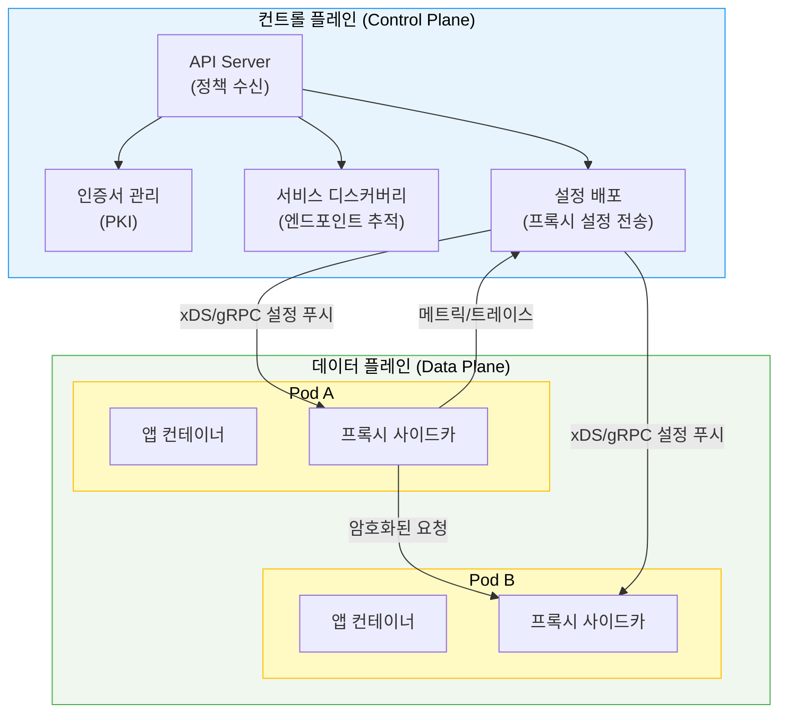
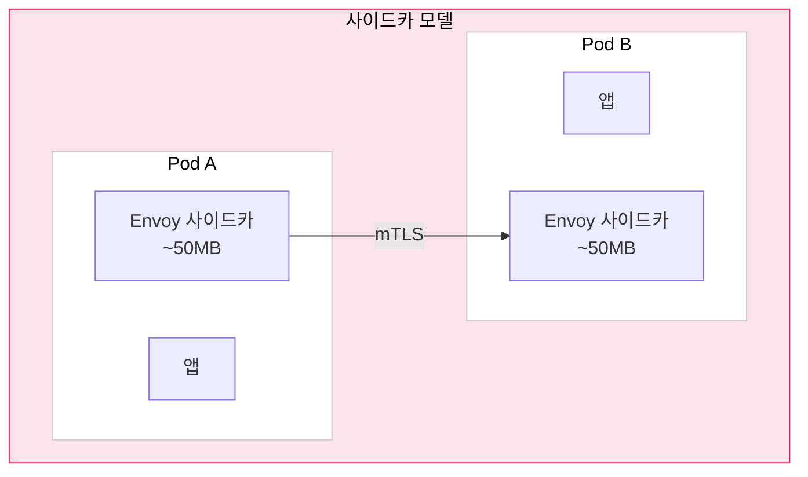
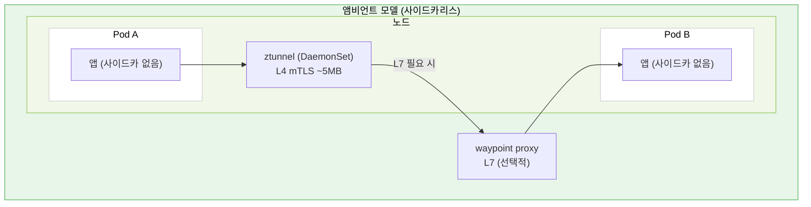

# 서비스 메시 기초

> 서비스 메시는 마이크로서비스 간 통신 문제(보안, 신뢰성, 관측성)를 애플리케이션 코드가 아닌 인프라 계층에서 해결하는 전용 네트워크 레이어입니다. 2026년 기준 시장 규모는 약 6.2억 달러이며 연평균 41.3%로 성장 중입니다. Istio(2023 CNCF 졸업)와 Linkerd(2024 CNCF 졸업)가 생태계를 주도하고, Cilium의 eBPF 기반 접근이 사이드카 오버헤드 문제에 새로운 대안을 제시합니다.


## 학습 목표

> 서비스 메시 등장 배경부터 사이드카/앰비언트 모델 비교, 2026년 CNCF 지형도, 도입 판단 기준까지 다섯 가지 목표를 다룹니다.

학습 목표는 다섯 가지입니다:

1. 마이크로서비스 환경에서 서비스 메시가 등장한 이유를 네트워크 복잡도 관점에서 설명합니다. 
2. 데이터 플레인과 컨트롤 플레인의 역할 분리를 구체적인 예시로 설명합니다. 
3. 사이드카 모델과 앰비언트(사이드카리스) 모델의 트레이드오프를 비교합니다. 
4. 2026년 CNCF 서비스 메시 지형도에서 주요 플레이어를 파악합니다. 
5. 서비스 메시가 필요한 상황과 불필요한 상황을 판단하는 기준을 세웁니다.


## 1. 왜 서비스 메시가 필요한가

> 마이크로서비스 전환이 만들어내는 네트워크 복잡도와, 서비스 메시가 인프라 계층에서 이를 해결하는 방식을 설명합니다.

### 1.1 마이크로서비스의 통신 복잡도

모놀리스 애플리케이션에서 함수 호출은 단순합니다. 호출자와 피호출자가 같은 프로세스 안에 있어서 에러 처리, 성능 측정, 보안이 단일 컨텍스트 안에서 해결됩니다. 그러나 마이크로서비스로 전환하면 이 단순한 함수 호출이 네트워크 요청으로 바뀝니다. 네트워크는 신뢰할 수 없고, 패킷이 손실되고 지연이 발생하며 서비스가 간헐적으로 응답하지 않습니다.

서비스가 10개일 때 서비스 간 가능한 통신 경로는 최대 90개(n×(n-1))입니다. 서비스가 50개로 늘어나면 2,450개가 됩니다. 각 경로마다 타임아웃 설정, 재시도 로직, 서킷 브레이커, mTLS 인증서 관리를 개발자가 직접 구현해야 한다면 — 그리고 그 로직이 Java, Go, Python, Node.js로 각각 다르게 구현된다면 — 운영팀의 부담은 감당하기 어려운 수준이 됩니다.

Netflix가 2010년대 초반 마이크로서비스로 전환할 때 이 문제를 직접 겪었습니다. 그들의 해결책은 Hystrix(서킷 브레이커), Ribbon(로드 밸런싱), Eureka(서비스 디스커버리) 같은 라이브러리를 만드는 것이었지만, 이 라이브러리들은 JVM 위에서만 동작해 다른 언어로 작성된 서비스에는 적용할 수 없었습니다.

서비스 메시는 이 문제를 다른 방향에서 접근합니다. 애플리케이션 코드가 네트워크 신뢰성 문제를 해결하는 게 아니라 인프라가 해결해야 한다는 관점입니다. 언어에 무관하게, 코드 변경 없이 네트워크 계층에서 이 모든 기능을 제공합니다.

### 1.2 서비스 메시가 해결하는 세 가지 핵심 문제

**보안**: 기본적으로 클러스터 내부 서비스 간 통신은 암호화되지 않습니다. Pod A가 Pod B에 HTTP 요청을 보낼 때 중간에서 트래픽을 가로채면 내용을 그대로 읽을 수 있습니다. 서비스 메시는 mutual TLS(mTLS)를 자동으로 제공해 각 서비스에 인증서를 발급하고, 모든 서비스 간 통신을 암호화하며, 인증서 기반으로 접근 자격을 검증합니다.

**신뢰성**: 타임아웃, 재시도, 서킷 브레이커, 헬스 체크 기반 로드 밸런싱을 애플리케이션 코드 수정 없이 정책으로 선언합니다. "주문 서비스가 결제 서비스에 요청할 때 3초 타임아웃, 실패 시 2번 재시도, 5번 연속 실패 시 30초 차단"을 YAML로 정의하면 메시가 이를 실행합니다.

**관측성**: 모든 서비스 간 통신이 프록시를 거치므로, 요청 수, 지연 시간, 에러율, 트래픽 경로를 코드 변경 없이 자동으로 측정합니다. "서비스 A → B → C 경로에서 C가 느린가, B가 느린가"를 분산 추적으로 정확히 파악할 수 있습니다.


## 2. 데이터 플레인과 컨트롤 플레인

> 서비스 메시는 논리적으로 두 레이어로 분리됩니다. 이 분리를 이해하면 서비스 메시의 작동 원리가 명확해집니다.



컨트롤 플레인은 "무엇을 해야 하는가"를 결정하는 두뇌입니다. 운영자가 정의한 정책(트래픽 규칙, 보안 정책, 관측성 설정)을 받아서 데이터 플레인의 모든 프록시에 설정을 배포합니다. 인증서를 발급하고, 서비스가 어디에 있는지 추적하며, 이 정보를 프록시에 실시간으로 전달합니다. 컨트롤 플레인 자체는 실제 트래픽을 처리하지 않습니다.

데이터 플레인은 "실제로 실행"하는 영역입니다. 각 서비스 Pod 옆에 사이드카 프록시가 배치되어, Pod로 들어오고 나가는 모든 트래픽을 가로챕니다. 프록시는 컨트롤 플레인에서 받은 설정에 따라 트래픽을 라우팅하고, mTLS를 적용하고, 메트릭을 수집합니다.

이 분리의 핵심 이점은 복원력입니다. 컨트롤 플레인이 다운되어도 데이터 플레인은 마지막으로 받은 설정으로 계속 트래픽을 처리합니다. 뇌가 잠시 응답하지 않아도 몸이 기억한 대로 움직이는 것과 비슷합니다.


## 3. 사이드카 모델 vs 앰비언트 모델

> 사이드카 주입 방식과 Ambient L4/L7 분리 방식의 리소스·운영 트레이드오프를 비교합니다.

### 3.1 사이드카 모델

사이드카 모델은 각 애플리케이션 Pod에 프록시 컨테이너를 함께 배치하는 방식입니다. 마치 오토바이 사이드카처럼 애플리케이션 옆에 딱 붙어서 동행합니다.



Init Container가 먼저 실행되어 iptables 규칙을 설정합니다. 이 규칙은 Pod의 모든 인바운드/아웃바운드 트래픽을 프록시 포트(보통 15001/15006)로 리다이렉트합니다. 이후 애플리케이션 컨테이너와 프록시 컨테이너가 동시에 실행됩니다. 애플리케이션은 자신이 프록시를 통해 통신한다는 사실조차 모릅니다.

사이드카 모델의 장점은 격리성입니다. 각 Pod는 자신만의 프록시를 가지므로 프록시 정책을 Pod 수준에서 세밀하게 제어할 수 있습니다. 단점은 오버헤드입니다. Envoy 사이드카는 Pod당 약 50MB 메모리를 소비하므로, 1,000개 Pod 클러스터라면 사이드카만으로 50GB 메모리가 필요합니다.

### 3.2 앰비언트 모델

앰비언트 모델은 사이드카 없이 서비스 메시 기능을 제공합니다. Istio가 2022년부터 개발한 이 모드는 2024년 11월(Istio 1.24)에 CNCF TOC로부터 Stable(GA) 선언을 받았으며 (istio.io/blog/2024/ambient-reaches-ga), 두 개의 레이어로 기능을 분리합니다.



첫 번째 레이어는 ztunnel입니다. 노드당 하나씩 DaemonSet으로 실행되는 Rust 기반 프록시로, L4(TCP) 수준의 보안만 담당합니다. mTLS 암호화와 기본 접근 제어(source.principals 기반 AuthorizationPolicy)를 처리하지만, HTTP 라우팅이나 헤더 기반 정책 같은 L7 기능은 다루지 않습니다. 트래픽 인터셉트는 inpod 모드로 동작하며, ztunnel.sock을 통해 각 Pod의 네트워크 네임스페이스 안에서 직접 리다이렉션합니다 (istio.io/docs/ambient/architecture/traffic-redirection).

두 번째 레이어는 waypoint proxy입니다. L7 기능이 필요한 서비스에만 선택적으로 배포하는 Envoy 기반 프록시로, 네임스페이스 또는 서비스 단위로 배포합니다. HTTP 메서드·헤더 기반 AuthorizationPolicy와 상세 트래픽 라우팅은 waypoint가 집행하며, 관측성 메트릭에서 `reporter="waypoint"`로 구분됩니다 (istio.io/docs/ambient/migrate/migrate-policies).

앰비언트 모델의 핵심 이점은 단계적 채택입니다. 사이드카 주입 없이 먼저 L4 보안을 얻고, L7 기능이 필요한 서비스에만 waypoint를 추가합니다. 1,000개 Pod 클러스터에서 ztunnel이 노드당 하나씩만 실행되므로 프록시 오버헤드가 Pod 수가 아닌 노드 수에 비례합니다.

| 항목 | 사이드카 | 앰비언트(사이드카리스) |
|------|---------|----------------------|
| 프록시 위치 | Pod 내 컨테이너 | 노드(ztunnel) + 선택적 waypoint |
| 메모리 오버헤드 | Pod 수 × ~50MB | 노드 수 × ~5MB |
| L7 기능 | 기본 제공 | waypoint 추가 시만 |
| 성숙도(2026) | 프로덕션 표준 | Istio 1.24 GA (2024-11-07) |
| 격리성 | Pod 수준 | 공유 ztunnel |


## 4. 2026년 서비스 메시 지형도

> CNCF Graduated 프로젝트인 Istio, Linkerd, Cilium, Consul의 특성과 선택 기준을 정리합니다.

CNCF는 2023년 Istio를, 2024년 Linkerd를 Graduated 프로젝트로 승격시켰습니다. Graduated 지위는 프로덕션 사용에 충분히 성숙했음을 CNCF가 공식 인증하는 것으로, 두 프로젝트 모두 가장 높은 성숙도 단계에 있습니다.

**Istio**: 구글이 2017년 론칭하고 현재 Solo.io가 엔터프라이즈 지원을 주도합니다. 데이터 플레인으로 Envoy 프록시를 사용하며 기능 집합이 가장 풍부합니다. 트래픽 관리의 세밀한 제어, 다양한 관측성 도구 통합, 멀티클러스터 지원에서 강점이 있습니다. 학습 곡선이 가파르고 운영 복잡도가 높다는 평가를 받지만, 기능 범위에서는 경쟁자가 없습니다. 클러스터 내 IstioOperator 컨트롤러는 Istio 1.23에서 deprecated, 1.24에서 제거되었으며, `istioctl install -f IstioOperator.yaml` 형식은 계속 지원됩니다 (istio.io/blog/2024/in-cluster-operator-deprecation).

**Linkerd**: Buoyant가 개발하며 "단순함(simplicity)"을 핵심 철학으로 삼습니다. 자체 개발한 Rust 기반 linkerd2-proxy를 데이터 플레인으로 사용합니다. Envoy 대비 메모리 사용량이 약 5배 낮고 지연 시간 오버헤드도 작습니다. Linkerd의 철학은 "서비스 메시가 눈에 띄어서는 안 된다"는 것으로, 운영자가 메시 자체를 관리하는 데 시간을 쓰지 않도록 설계되었습니다. Linkerd 2.14부터는 Gateway API GAMMA(동서 방향 메시 트래픽)를 지원합니다 (gateway-api.sigs.k8s.io/docs/implementations).

**Cilium**: eBPF 기반 쿠버네티스 네트워킹으로 시작해 서비스 메시 기능으로 확장했습니다. Isovalent가 개발하고 2023년 Cisco가 인수했습니다. 기존 서비스 메시가 iptables에 의존하는 것과 달리 커널 수준에서 네트워킹을 처리해 오버헤드가 낮습니다.

**Consul**: HashiCorp(현 IBM)의 서비스 메시로, 쿠버네티스 외에 VM, 베어메탈 환경도 지원합니다. 하이브리드 클라우드 환경에서 강점이 있습니다.


## 5. 서비스 메시 채택 판단 기준
> 서비스 메시 도입이 유리한 상황과 운영 복잡도가 이득을 상쇄하는 상황을 구분하는 실용적 기준을 제시합니다.


서비스 수가 10개를 넘어서고 서비스 간 mTLS 설정을 수동으로 관리하기 시작할 때가 서비스 메시를 고려할 시점입니다. 규제 준수가 필요한 환경(PCI-DSS, HIPAA)이나 여러 언어로 작성된 서비스가 혼재하는 폴리글랏 환경에서 효과가 명확합니다.

서비스가 5개 미만이고 팀이 소규모라면 서비스 메시의 운영 복잡도가 이득을 상쇄할 수 있습니다. 서비스 메시 자체가 또 하나의 운영 대상이 된다는 점을 간과해선 안 됩니다. 컨트롤 플레인 업그레이드, 인증서 만료 관리, 프록시 버전 관리가 새로운 운영 부담이 됩니다.

실용적인 판단 기준은 이렇습니다. 현재 팀이 네트워크 보안, 신뢰성, 관측성 문제를 수동으로 해결하는 데 역량의 10% 이상을 쏟고 있다면, 서비스 메시 도입이 투자 대비 가치가 있습니다.


## 6. 서비스 메시와 관련 기술 비교
> API Gateway, NetworkPolicy와 서비스 메시의 역할 경계를 구분하고 상호 보완 관계를 설명합니다.


**API Gateway vs 서비스 메시**: API Gateway는 외부 클라이언트와 백엔드 서비스 사이의 진입점으로, 인증과 속도 제한이 주요 기능입니다. 서비스 메시는 서비스 간(east-west) 통신을 다룹니다. 두 기술은 상호 보완적으로 함께 사용하는 경우가 많습니다.

**쿠버네티스 NetworkPolicy vs 서비스 메시**: NetworkPolicy는 IP/포트 수준의 L3/L4 접근 제어입니다. 서비스 메시는 이보다 상위 수준에서 HTTP 헤더, JWT, 서비스 아이덴티티 기반 정책을 적용합니다.


## 7. 핵심 기능 상세
> 트래픽 관리, SPIFFE 기반 보안, 황금 신호(Golden Signals) 관측성의 구체적인 동작 방식을 상세히 다룹니다.


### 7.1 트래픽 관리

카나리 배포는 새 버전을 전체 트래픽의 5%에만 노출하고, 에러율과 지연 시간을 관찰한 뒤 점진적으로 트래픽을 늘리는 방식입니다. 쿠버네티스 Deployment만으로는 Pod 수 비율로만 분산이 가능하지만, 서비스 메시는 트래픽 가중치를 Pod 수와 독립적으로 제어합니다.

```yaml
# Istio VirtualService 예시 — 카나리 배포
apiVersion: networking.istio.io/v1beta1
kind: VirtualService
metadata:
  name: payment-service
spec:
  http:
  - route:
    - destination:
        host: payment-service
        subset: v1
      weight: 95
    - destination:
        host: payment-service
        subset: v2
      weight: 5
```

서킷 브레이커는 다운스트림 서비스가 느리거나 오류를 반환할 때, 계속 요청을 보내면 스레드 풀이 고갈되어 업스트림 서비스 전체가 연쇄 장애를 겪는 상황을 막습니다. 실패 임계치를 넘으면 즉시 차단하고 빠른 실패(fail-fast)로 응답해 cascading failure를 방지합니다.

### 7.2 보안 — SPIFFE와 SPIRE

서비스 메시의 보안 기반은 SPIFFE(Secure Production Identity Framework For Everyone)입니다. 각 워크로드는 SPIFFE ID를 부여받습니다. 형태는 `spiffe://cluster.local/ns/production/sa/payment-service`처럼 URI 형식입니다. 이 ID가 X.509 인증서에 포함되어 mTLS 핸드셰이크에 사용됩니다.

인증서 수명은 짧습니다. Linkerd는 기본 24시간, Istio는 기본 24시간입니다. 수명이 짧으면 인증서 유출 시 피해 범위가 시간적으로 제한됩니다. 메시가 자동으로 갱신하므로 운영 부담은 없습니다.

### 7.3 관측성 — 황금 신호

서비스 메시는 모든 서비스 간 통신을 프록시가 중계하므로, 코드 한 줄 수정 없이 황금 신호(Golden Signals)를 자동으로 수집합니다. 황금 신호는 Google SRE 책에서 정의한 네 가지 핵심 메트릭입니다.

- **지연(Latency)**: 요청 처리 시간. 성공 요청과 실패 요청의 지연을 분리해야 합니다.
- **트래픽(Traffic)**: 초당 요청 수(RPS). 시스템의 부하 수준을 나타냅니다.
- **에러(Errors)**: 요청 실패율. HTTP 5xx 기준이지만 비즈니스 레벨 실패에도 주의가 필요합니다.
- **포화도(Saturation)**: CPU, 메모리, 큐 깊이 등 자원이 얼마나 찼는가.


## 8. 단계적 도입 전략
> 서비스 메시를 전체 클러스터에 한 번에 도입하지 않고 관측성 → mTLS → 트래픽 정책 → 접근 제어 순으로 단계적으로 확장하는 전략을 설명합니다.


서비스 메시를 한 번에 전체 클러스터에 도입하는 것은 위험합니다. 단계적으로 접근해야 합니다.

1단계는 관측성 확보입니다. 메시를 설치하되, 실제 트래픽 정책은 적용하지 않습니다. 메트릭과 분산 추적만 활성화해 현재 서비스 간 통신 패턴을 파악합니다.

2단계는 mTLS 활성화입니다. Istio의 경우 먼저 PERMISSIVE 모드(암호화 연결과 평문 연결 모두 허용)로 시작하고, 안정화 후 STRICT 모드(암호화만 허용)로 전환합니다.

3단계는 트래픽 정책 적용입니다. 서킷 브레이커, 재시도, 타임아웃을 서비스별로 적용합니다.

4단계는 접근 제어입니다. 기본 거부(default-deny) 정책을 적용하고 필요한 경로만 허용하는 방식이 Zero Trust의 완성입니다.


## 점검 질문
> 본 장에서 다룬 핵심 개념을 Q&A 형태로 점검합니다.


**Q1. 서비스 메시가 필요한 이유를 한 문장으로 설명하면?**

마이크로서비스 환경에서 서비스 간 통신의 보안(mTLS), 신뢰성(서킷 브레이커, 재시도), 관측성(분산 추적)을 애플리케이션 코드 변경 없이 인프라 레이어에서 일관되게 제공하기 위해서입니다.

**Q2. 데이터 플레인과 컨트롤 플레인의 차이는?**

컨트롤 플레인은 정책을 정의하고 프록시에 설정을 배포하는 관리 레이어로, 실제 트래픽은 처리하지 않습니다. 데이터 플레인은 실제 네트워크 패킷을 처리하는 프록시 집합입니다. 컨트롤 플레인이 다운되어도 데이터 플레인은 마지막 설정으로 계속 동작합니다.

**Q3. 사이드카 모델과 앰비언트 모델의 트레이드오프는?**

사이드카 모델은 Pod 수준 격리성과 즉각적인 L7 기능을 제공하지만, Pod당 프록시 오버헤드(Envoy는 약 50MB)가 발생합니다. 앰비언트 모델은 노드당 ztunnel 하나로 L4 보안을 제공해 오버헤드를 줄이고, L7 기능은 waypoint를 선택적으로 추가합니다.

**Q4. Linkerd와 Istio 중 어느 것을 선택해야 하는가?**

기능 요구사항과 운영 역량에 따라 다릅니다. 세밀한 트래픽 관리, 멀티클러스터, 다양한 프로토콜 지원이 필요하면 Istio가 적합합니다. 빠른 도입, 낮은 오버헤드, 단순한 운영이 우선이라면 Linkerd가 유리합니다.

**Q5. 서비스 메시 없이 mTLS를 구현하는 것과의 차이는?**

서비스 메시 없이 mTLS를 구현하면 각 서비스가 인증서 발급, 갱신, 검증 로직을 직접 구현해야 합니다. 서비스 메시는 SPIFFE/SPIRE 기반으로 워크로드 아이덴티티를 자동 발급하고, 인증서 갱신을 자동화하며, 모든 서비스에 일관되게 적용합니다.
