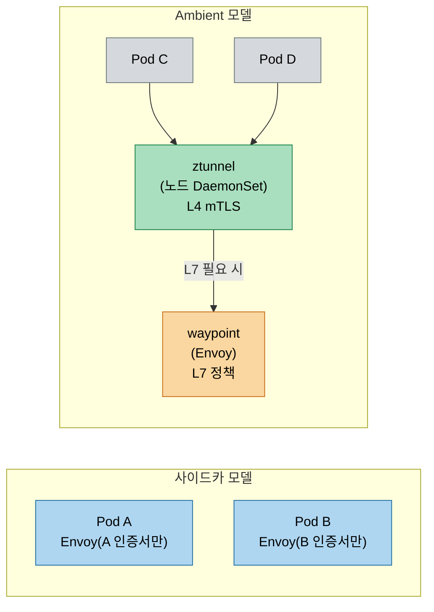

# 프록시 아키텍처 점검

> 본 장의 심화 점검 질문입니다. LEARN에서 다룬 개념의 경계와 운영 환경에서 주의할 판단 포인트를 Q&A 형태로 정리했습니다.

## 점검 질문
> Envoy 지위의 배경, Rust 프록시 이점, WASM·ext_proc 선택 기준, ztunnel 신뢰 모델, 고처리량 오버헤드 측정을 Q&A로 점검합니다.

### Q1. Envoy가 서비스 메시 표준 데이터 플레인이 된 이유는 무엇이고, 그 설계 결정이 가져온 트레이드오프는 무엇인가?

Nginx, HAProxy, Linkerd proxy가 모두 훌륭한 프록시인데도 Istio, Consul Connect, AWS App Mesh, Kuma 등 대부분의 메시 컨트롤 플레인이 Envoy를 데이터 플레인으로 선택했습니다. Envoy의 지위가 기술적 우월성만에서 비롯된 것은 아닙니다. Lyft의 오픈소스 타이밍, Google의 지지, xDS API의 범용성이 복합적으로 작용했습니다.

Envoy의 핵심 설계 결정은 네 가지입니다. 첫째는 xDS(eXtensible Discovery Service) API입니다. Envoy는 설정을 파일에서 읽지 않고 gRPC 스트림을 통해 컨트롤 플레인으로부터 동적으로 수신합니다. 재시작 없이 설정을 변경할 수 있어 Istio, Envoy Gateway, AWS 등 다양한 컨트롤 플레인이 xDS를 구현했습니다. 둘째는 L7 First 설계입니다. Nginx가 L4 HTTP 서버로 시작해 L7 기능을 추가한 반면 Envoy는 처음부터 HTTP/2, gRPC, Thrift를 1등 시민으로 취급했습니다. 셋째는 필터 체인 아키텍처입니다. HTTP 요청이 여러 필터를 순서대로 통과하는 구조 덕분에 기능 추가가 코어를 건드리지 않고 가능하며, WASM 필터 지원이 이 설계의 자연스러운 확장입니다.

그러나 트레이드오프도 분명합니다. Envoy는 C++로 작성되어 최소 50MB 메모리를 사용하고 설정 YAML의 학습 곡선이 가파릅니다. 잘못된 설정이 미묘한 문제를 일으키기 쉬워, 실제로 Envoy를 직접 설정하는 경우보다 Istio나 Envoy Gateway를 통해 간접적으로 사용하는 경우가 대부분입니다. 디버깅 시에는 `kubectl exec -it <pod> -c istio-proxy -- curl localhost:15000/config_dump`로 Envoy 설정 전체를 볼 수 있고, 예상치 못한 라우팅 동작의 원인을 찾을 때 이 덤프를 해석하는 능력이 필요합니다.

### Q2. Rust로 프록시를 작성하는 것이 C++ Envoy 대비 실질적 이점을 제공하는가? 메모리 안전성이 프록시 맥락에서 어떤 의미를 갖는가?

Linkerd v2는 Go로 작성된 프록시를 Rust로 교체했고, Istio의 Ambient mesh ztunnel도 Rust로 작성됐습니다. 이 선택은 "Rust의 메모리 안전성"이라는 마케팅적 이유만이 아닌 실제 공학적 판단에 기반합니다.

C++의 메모리 관련 버그(use-after-free, buffer overflow, dangling pointer)는 역사적으로 CVE의 약 70%를 차지합니다. 프록시처럼 외부 입력을 파싱하고 처리하는 소프트웨어에서 이런 버그는 특히 위험합니다. 악의적으로 조작된 HTTP 요청으로 프록시 프로세스 메모리를 읽거나 실행 흐름을 바꿀 수 있기 때문입니다. Rust는 컴파일 타임에 이런 버그를 원천 차단합니다. `unsafe` 블록 없이는 메모리 오류가 발생하지 않음을 컴파일러가 보증하고, 이는 런타임 검사나 가비지 컬렉터 없이 달성됩니다.

그러나 실제 이점은 맥락에 따라 다릅니다. linkerd2-proxy의 메모리 사용량이 Envoy 대비 낮은 것은 Rust의 언어 특성이기도 하지만, 더 좁은 기능 범위(HTTP/2와 gRPC에만 집중)의 영향도 큽니다. 순수하게 언어 차이만으로 성능 차이를 설명하기는 어렵습니다. 생산성 측면에서 Rust의 학습 곡선은 가파르고, Envoy의 C++ 코드베이스에 기여하는 엔지니어 풀이 Rust보다 현실적으로 큽니다.

사용자 관점에서 차이가 드러나는 시점은 CVE가 발생했을 때입니다. Rust 프록시에서 메모리 관련 CVE가 나오기는 어렵지만, 로직 버그나 `unsafe` 코드의 CVE는 여전히 가능합니다. 최소 footprint와 보안이 최우선이라면 Linkerd(Rust proxy), 기능 완성도와 생태계 통합이 우선이라면 Envoy 기반 메시를 선택하는 것이 현실적입니다.

Linkerd는 CNCF graduated 프로젝트로, linkerd2-proxy는 Rust 마이크로프록시이며 Linkerd 2.14부터 GAMMA(Gateway API Mesh)를 통한 east-west 트래픽 제어를 지원합니다. (출처: https://gateway-api.sigs.k8s.io/implementations/)

### Q3. WASM 필터는 Envoy 확장성을 어떻게 바꾸는가? 내장 필터, WASM, ext_proc 중 어느 상황에서 무엇을 선택해야 하는가?

Envoy 필터 확장의 세 방식을 비교하면 선택 기준이 명확해집니다.

내장 필터(built-in C++ filter)는 Envoy 소스 코드에 포함됩니다. 최고 성능과 모든 Envoy API 접근이 가능하지만 Envoy를 직접 빌드해야 하고, 업스트림 기여 없이는 유지보수 부담이 큽니다. 소수의 조직만 현실적으로 선택 가능합니다.

WASM 필터는 별도 컴파일된 WASM 모듈을 Envoy가 로드합니다. 언어 독립적(Rust, C++, TinyGo로 작성 가능)이고 샌드박스 격리로 안전하며 동적 로드가 가능합니다. 단점은 요청당 약 5-20μs의 런타임 오버헤드, WASM 모듈이 Envoy 내부 상태에 완전히 접근하지 못하는 제한, 그리고 Proxy-WASM 스펙이 아직 발전 중이라는 불안정성입니다.

ext_proc(External Processing)는 HTTP 요청과 응답을 외부 gRPC 서비스로 전달해 처리합니다. 가장 유연하고 어떤 언어로도 작성 가능하며 복잡한 비즈니스 로직 삽입에 적합합니다. 단점은 네트워크 홉이 추가되어 레이턴시 오버헤드가 크고, 외부 서비스 장애가 트래픽에 영향을 준다는 점입니다.

선택 기준은 요청당 허용 처리 시간으로 단순화할 수 있습니다. 마이크로초 단위가 중요하면 내장 필터, 수 밀리초까지 허용되면 WASM, 수십 밀리초까지 허용되고 복잡한 로직이 필요하면 ext_proc을 선택합니다. 2026년 현재 WASM 필터의 실용적 사례는 JWT 검증 커스텀 로직, 요청 본문 기반 라우팅, API 키 변환 등입니다.

### Q4. ztunnel의 보안 모델은 무엇이고, 노드 수준 프록시가 Pod 수준 사이드카보다 신뢰 모델에서 어떤 약점을 가지는가?

사이드카 모델의 신뢰 경계는 Pod입니다. 각 Pod의 Envoy 사이드카는 해당 Pod의 SPIFFE 인증서만 보유하고 다른 Pod의 트래픽을 처리하지 않습니다. Pod가 침해되어도 해당 Pod의 사이드카만 영향을 받습니다.

ztunnel의 신뢰 경계는 노드입니다. ztunnel은 노드의 모든 Pod 인증서를 관리하거나 접근해야 합니다(mTLS 처리를 위해). Istio의 구현에서 ztunnel은 워크로드 API를 통해 필요한 인증서를 Just-in-Time으로 요청해 모든 인증서를 미리 캐싱하지는 않습니다. 그러나 ztunnel 프로세스 자체가 침해된다면 해당 노드의 모든 워크로드 트래픽에 접근할 수 있습니다.

이를 완화하는 Istio의 접근법은 ztunnel을 privileged 없이 실행하고 최소 권한 원칙을 적용하는 것입니다. Node level의 RBAC으로 ztunnel이 접근할 수 있는 시크릿을 제한하지만, 이것이 사이드카 모델의 Pod 수준 격리만큼 강한 보안 경계를 제공하는지는 환경과 위협 모델에 따라 다르게 평가될 수 있습니다.

Istio Ambient mode는 1.24(2024-11-07)에 GA(Stable)로 선언됐습니다. ztunnel은 DaemonSet으로 노드마다 배치되어 L4 mTLS를 담당하고, L7 정책이 필요한 경우에만 waypoint(Envoy 기반)가 추가됩니다. L4 AuthorizationPolicy는 ztunnel이, L7 AuthorizationPolicy(targetRefs kind:Service, HTTP methods 등)는 waypoint가 집행합니다. (출처: https://istio.io/latest/blog/2024/ambient-reaches-ga/, https://istio.io/latest/docs/ambient/migrate/migrate-policies/)

보안 감사에서 ztunnel의 신뢰 모델을 설명해야 하는 상황이라면 두 가지를 강조합니다:

1. ztunnel의 폭발 반경은 노드지만 DaemonSet 자체의 속성이며 사이드카보다 물리적으로 더 안전한 환경(호스트 네임스페이스 분리)에서 실행됩니다.
2. SPIFFE 기반 인증서 관리는 ztunnel과 사이드카 모두 동일하게 적용됩니다. 엄격한 멀티테넌시 요구사항이 있는 환경에서는 Ambient mesh 채택 전 Istio의 보안 문서와 최신 CVE 이력을 반드시 검토해야 합니다.

### Q5. 고처리량 시나리오에서 프록시 오버헤드를 어떻게 측정해야 하고, 실질적으로 효과가 있는 최적화 기법은 무엇인가?

"프록시 오버헤드"를 단일 숫자로 표현하는 것은 가장 흔한 실수입니다. 오버헤드는 RPS(초당 요청 수), 페이로드 크기, 연결 패턴(단기 연결 vs 연결 재사용), CPU 코어 수에 따라 크게 달라집니다. 초당 수만 건 이상을 처리하는 서비스에서 CPU 사용량 20% 증가가 클러스터 전체로 곱해지면 수십 개 노드에 해당하는 비용이 됩니다.

프록시 오버헤드의 주요 구성 요소를 분해하면 원인이 보입니다. 연결 처리 비용에서 새로운 TCP 연결 수립(TLS handshake 포함)은 기존 연결 재사용 대비 10-100배 비용이 높습니다. HTTP/1.1에서 매 요청마다 새 연결을 만드는 패턴이 있다면 프록시 오버헤드의 대부분이 여기서 발생하며, 이 경우 프록시 튜닝보다 애플리케이션의 연결 관리 개선이 더 효과적입니다. HTTP/2는 헤더 압축(HPACK)으로 반복적인 헤더 전송 비용을 줄이므로, 서비스 간 통신에서 HTTP/2를 기본으로 설정하면 네트워크 오버헤드와 프록시 처리 비용이 함께 줄어듭니다.

실제 효과가 있는 최적화는 Connection pool 크기 증가, HTTP/2 활성화(upstream/downstream 모두), 불필요한 telemetry 필터 제거, Envoy worker 스레드 수를 CPU 코어 수에 맞게 조정하는 것입니다. 고처리량 시나리오의 프록시 오버헤드를 측정하는 올바른 접근은 먼저 `envoy/stats` 엔드포인트(포트 15000)에서 `downstream_cx_*`와 `upstream_cx_*` 메트릭을 수집해 연결 패턴을 파악하는 것입니다. "프록시가 느리다"는 증상이 나타날 때 실제로는 DNS 조회, 인증서 검증 캐시 미스, 또는 upstream 연결 풀 고갈이 원인인 경우가 많습니다.

Istio Ambient mode에서는 관측성 확인 방법이 사이드카와 다릅니다. `proxy-status` 대신 `istioctl ztunnel-config workloads`로 워크로드 등록 상태를 확인하고, ztunnel 메트릭은 `reporter="source"`, waypoint 메트릭은 `reporter="waypoint"`로 구분해 Prometheus에서 따로 스크랩합니다. waypoint는 hop당 trace span 1개를 생성하며, 사이드카가 hop당 2개를 생성하는 것과 차이가 있습니다. (출처: https://istio.io/latest/docs/ambient/migrate/enable-ambient-mode/)

## 관련 문서
> 본 점검 편과 연관된 개념 편 및 실습 환경 문서 목록입니다.

- [프록시 아키텍처](./02-01.%ED%94%84%EB%A1%9D%EC%8B%9C%20%EC%95%84%ED%82%A4%ED%85%8D%EC%B2%98.md) — 본 실습의 개념 편
- [gcp 스킬](../../../../.claude/skills/gcp/SKILL.md) — 실습 대상 클러스터의 운영 문서
