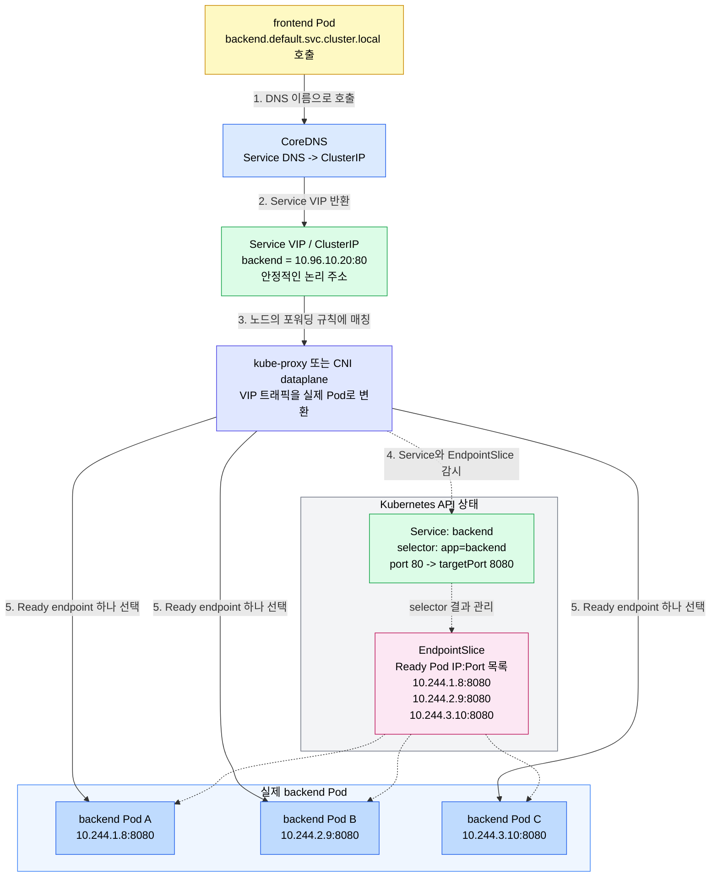
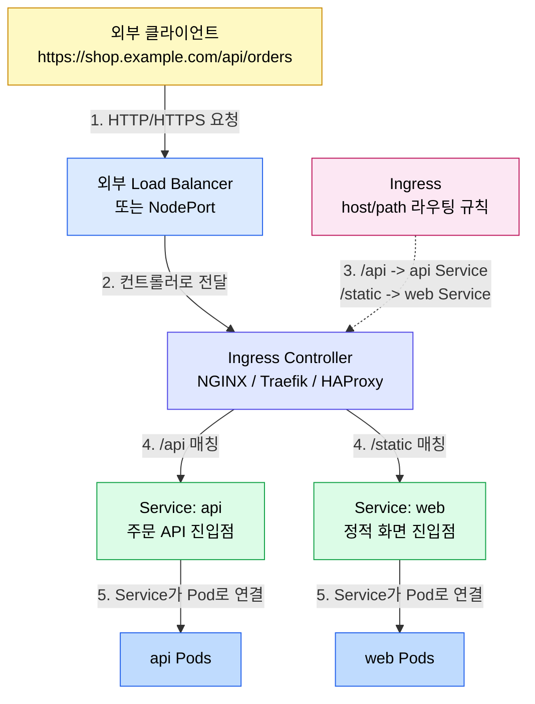
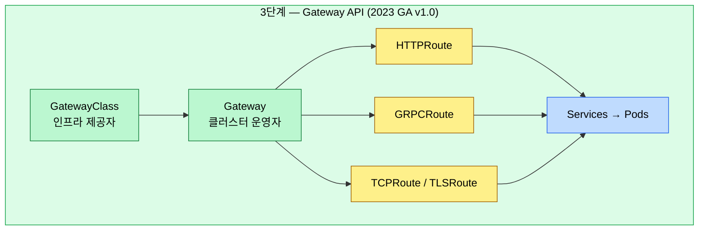
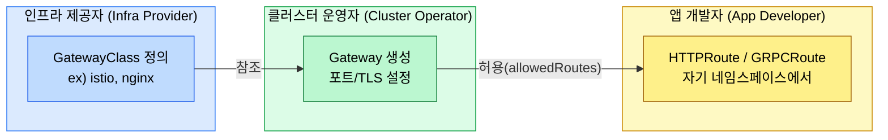
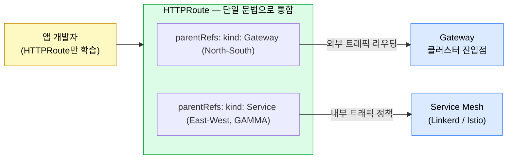

# Gateway API와 트래픽 관리

> **Kubernetes 네트워킹은 Service → Ingress → Gateway API 순으로 진화했다.** 
>
> - Gateway API는 역할 분리(인프라 제공자 / 클러스터 운영자 / 앱 개발자)를 설계 철학으로 삼아, 기존 Ingress의 한계(HTTP 전용, 벤더 어노테이션 난립)를 극복한다. 
> - 2025년 기준 v1.4에서는 GRPCRoute, TCPRoute 등 다양한 프로토콜을 공식 지원하며, GAMMA 이니셔티브를 통해 서비스 메시 내부(east-west) 트래픽 관리까지 영역을 확장하고 있다.


## 학습 목표
> Kubernetes 네트워킹 진화, Gateway API 역할 분리, GAMMA 이니셔티브, Linkerd·Istio 활용 비교 등 일곱 가지 목표를 다룬다.


학습 목표는 일곱 가지다:

1. Kubernetes 네트워킹의 진화 과정(Service → Ingress → Gateway API)을 설명할 수 있다.
2. Ingress의 구조적 한계 세 가지를 구체적인 예시와 함께 나열할 수 있다.
3. Gateway API의 핵심 리소스(GatewayClass, Gateway, HTTPRoute)와 역할 분리 모델을 그림으로 설명할 수 있다.
4. GAMMA 이니셔티브가 서비스 메시와 Gateway API를 연결하는 방식을 이해한다.
5. Linkerd와 Istio 각각이 Gateway API를 어떻게 활용하는지 비교할 수 있다.
6. 트래픽 관리의 핵심 패턴(카나리, 서킷 브레이커, 폴트 인젝션 등)을 목적과 함께 설명할 수 있다.
7. Ingress, Gateway API, Istio VirtualService의 표현력 차이를 비교할 수 있다.


## 1. Kubernetes 네트워킹의 진화
> Service → Ingress → Gateway API 순으로 진화한 Kubernetes 네트워킹의 각 단계와 한계를 설명한다.


### 1.1 Service: 기초 단계

Kubernetes에서 네트워킹의 출발점은 `Service`다. Service가 해결하는 문제는 **Pod IP가 안정적인 주소가 아니라는 점**이다. Deployment가 롤링 업데이트되거나 오토스케일링되면 Pod는 계속 생성·삭제되고, 그때마다 Pod IP도 바뀐다.

프론트엔드 Pod가 백엔드 Pod IP를 직접 들고 있으면 백엔드 Pod가 재시작되는 순간 연결 대상이 사라진다. 

- Service는 이 문제를 `ClusterIP`와 DNS 이름으로 감싼다. 클라이언트는 `backend.default.svc.cluster.local` 같은 안정적인 이름만 호출하고, Kubernetes는 그 뒤에서 현재 살아 있는 Pod 목록을 `EndpointSlice`로 계속 갱신한다.

Service가 제공하는 추상화는 세 가지로 요약된다:

1. **안정적인 진입점**: Pod가 바뀌어도 Service 이름과 ClusterIP는 유지된다.
2. **동적 엔드포인트 추적**: selector에 매칭되는 Ready Pod 목록이 EndpointSlice에 반영된다.
3. **기본 부하 분산** : kube-proxy나 CNI dataplane이 Service VIP로 들어온 트래픽을 실제 Pod 엔드포인트로 전달한다.

여기서 VIP는 `ClusterIP`처럼 클라이언트가 바라보는 Service의 가상 IP이고, EndpointSlice는 그 Service 뒤에 붙은 실제 Ready Pod IP 목록이다. 자세한 내부 동작은 Kubernetes 쪽 [Service와 EndpointSlice](../../kubernetes/02_networking/04-04.Service%EC%99%80%20EndpointSlice.md) 문서에서 별도로 정리한다.

Service 내부 통신 흐름은 다음과 같다:



- 다만 Service는 L4 수준의 안정적인 진입점에 가깝다. 클러스터 내부에서 `backend`라는 목적지를 찾는 문제는 해결하지만, 외부 사용자의 `https://shop.example.com/api` 요청을 어떤 HTTP 경로 규칙으로 어느 서비스에 보낼지는 표현하지 못한다. 
- `/api`는 백엔드 서비스로, `/static`은 프론트엔드 서비스로 보내려면 Service 레이어 위에 L7 라우팅 계층이 필요하다.

### 1.2 Ingress: 과도기적 해결책

`Ingress`는 Service만으로 풀기 어려운 외부 HTTP/HTTPS 진입 문제를 해결하기 위해 Kubernetes 1.1(2015년)에 도입됐다. NGINX, Traefik, HAProxy 등 다양한 컨트롤러가 Ingress 스펙을 구현하고, 규칙을 YAML로 선언하면 컨트롤러가 이를 읽어 실제 L7 라우팅 설정으로 변환한다.

Service를 `LoadBalancer` 타입으로 외부에 직접 노출할 수도 있지만, 서비스가 많아질수록 문제가 커진다. 서비스마다 외부 로드 밸런서를 붙이면 비용과 운영 포인트가 늘고, 하나의 도메인 아래에서 host/path 기반으로 여러 서비스를 나누기도 어렵다. TLS 종료, 가상 호스트, 경로 기반 라우팅을 한 곳에서 처리하려면 Ingress 같은 L7 진입점이 필요하다.

Ingress가 처리하는 외부 요청 흐름은 다음과 같다:



핵심은 Ingress 리소스 자체가 트래픽을 처리하지 않는다는 점이다. Ingress는 "이 host와 path가 들어오면 이 Service로 보내라"는 선언이고, 실제 프록시 설정을 만들고 요청을 중계하는 주체는 Ingress Controller다.

Ingress 이후에는 Service가 한 번 더 추상화 경계가 된다. 이 문서에서는 "Ingress가 외부 HTTP 요청을 Service 단위로 나눈다"는 점까지만 잡고 넘어간다. Ingress Controller가 Service와 EndpointSlice를 어떻게 읽어 실제 Pod로 보내는지는 Kubernetes 쪽 [Ingress와 Gateway API](../../kubernetes/02_networking/04-06.Ingress%EC%99%80%20Gateway%20API.md) 문서에서 다룬다.

그러나 Ingress는 설계상의 한계를 안고 태어났다:

1. HTTP와 HTTPS만 지원한다. TCP나 UDP, gRPC 트래픽을 처리하려면 컨트롤러 벤더마다 다른 어노테이션을 붙여야 한다.
2. 어노테이션 지옥이 발생한다. `nginx.ingress.kubernetes.io/rewrite-target`, `traefik.ingress.kubernetes.io/router.middlewares`처럼 벤더마다 다른 어노테이션을 사용하기 때문에 컨트롤러를 교체하면 Ingress YAML을 전부 다시 써야 한다.
3. 역할 분리가 없다. 누가 어떤 설정을 담당하는지 스펙상 구분이 없어 앱 개발자가 TLS 인증서 설정을 직접 Ingress에 쓰거나 인프라 운영자의 설정과 충돌하는 일이 잦다.

### 1.3 Gateway API: 표준의 재정립

Gateway API는 2019년 SIG-Network에서 시작된 프로젝트로, Ingress의 구조적 한계를 처음부터 다시 설계한 결과물이다. 2023년 v1.0에서 GA(Generally Available)를 선언했고, 2025년 v1.4에서는 gRPC, TCP, TLS 라우팅을 표준에 포함시켰다.

핵심 설계 철학은 두 가지다:

1. 표현력(expressiveness)으로 벤더 어노테이션 없이도 고급 라우팅 기능을 스펙 내에서 표현할 수 있어야 한다.
2. 역할 분리(role-orientation)로 인프라 제공자, 클러스터 운영자, 앱 개발자가 각자 담당하는 리소스를 명확히 구분한다.




## 2. Gateway API 핵심 리소스 모델
> GatewayClass, Gateway, HTTPRoute 세 리소스의 역할 분리 모델과 실제 YAML 사용법을 다룬다.


### 2.1 역할 분리 모델

Gateway API의 가장 중요한 설계 원칙은 세 가지 페르소나(persona)의 역할을 명확히 분리한다는 점이다.



비유하자면, GatewayClass는 "택시 회사의 차종 카탈로그", Gateway는 "배차된 특정 차량", HTTPRoute는 "승객이 기사에게 건네는 목적지 메모"와 같다. 이 분리는 실용적인 이점을 가져온다. 앱 팀이 Route를 수정해도 인프라 팀의 Gateway 설정에 영향을 주지 않는다. 반대로 인프라 팀이 로드 밸런서를 교체해도 앱 팀의 HTTPRoute는 그대로 유효하다.

### 2.2 GatewayClass와 Gateway

**GatewayClass**는 로드 밸런서 구현체를 정의하는 클러스터 범위 리소스다. AWS Load Balancer Controller, Istio, Envoy Gateway 등이 각자의 GatewayClass를 제공한다.

```yaml
apiVersion: gateway.networking.k8s.io/v1
kind: GatewayClass
metadata:
  name: istio
spec:
  controllerName: istio.io/gateway-controller
```

**Gateway**는 특정 GatewayClass를 참조해 실제 게이트웨이 인스턴스를 생성한다. 어떤 포트에서, 어떤 프로토콜로, 어떤 TLS 인증서를 사용할지를 결정한다.

```yaml
apiVersion: gateway.networking.k8s.io/v1
kind: Gateway
metadata:
  name: shared-gateway
  namespace: infra
spec:
  gatewayClassName: istio
  listeners:
    - name: http
      protocol: HTTP
      port: 80
      allowedRoutes:
        namespaces:
          from: Same
```

### 2.3 HTTPRoute

HTTPRoute는 "HTTP 요청이 들어왔을 때, 어떤 조건이면 어디로 보낼지 적는 규칙서"다. 벤더 어노테이션 없이 순수 스펙만으로 경로 매칭, 헤더 추가, 가중치 기반 트래픽 분할(카나리)을 모두 표현할 수 있다.

```yaml
apiVersion: gateway.networking.k8s.io/v1
kind: HTTPRoute
metadata:
  name: payment-route
  namespace: payments
spec:
  parentRefs:
    - name: shared-gateway
      namespace: infra
  rules:
    - matches:
        - path:
            type: PathPrefix
            value: /api/v1/payment
      filters:
        - type: RequestHeaderModifier
          requestHeaderModifier:
            add:
              - name: x-routed-by
                value: gateway-api
      backendRefs:
        - name: payment-service
          port: 8080
          weight: 90
        - name: payment-service-v2
          port: 8080
          weight: 10        # 카나리: 신버전 10%
```


## 3. GAMMA 이니셔티브: 메시 내부까지 확장

> East-West 트래픽에도 HTTPRoute를 적용해 메시 내부 정책을 표준화하는 GAMMA 이니셔티브를 설명한다.


### 3.1 East-West vs North-South

Kubernetes 클러스터에서 트래픽은 두 방향으로 흐른다. North-south는 클러스터 외부에서 내부로(또는 내부에서 외부로) 이동하는 트래픽으로 Ingress와 Gateway가 전통적으로 이 영역을 담당한다. East-west는 클러스터 내부에서 서비스 간에 오가는 트래픽으로 서비스 메시가 이 영역을 책임진다.

문제는 두 영역이 오랫동안 서로 다른 API 체계를 사용했다는 점이다. North-south는 Gateway API, east-west는 메시마다 다른 CRD(Linkerd의 `ServiceProfile`, Istio의 `VirtualService`)를 사용했다. 개발자 입장에서는 두 API를 모두 배워야 했다.

### 3.2 GAMMA의 해답

GAMMA는 HTTPRoute의 `parentRefs`에서 `kind`를 `Service`로 지정함으로써 메시 내부 트래픽에도 동일한 Route 문법을 적용할 수 있게 한다.

```yaml
# North-South: Gateway를 parentRef로 참조
apiVersion: gateway.networking.k8s.io/v1
kind: HTTPRoute
metadata:
  name: checkout-north-south
spec:
  parentRefs:
    - group: gateway.networking.k8s.io
      kind: Gateway
      name: app-gateway
  rules:
    - backendRefs:
        - name: checkout-service
          port: 8080
---
# East-West: Service를 parentRef로 참조 (GAMMA)
apiVersion: gateway.networking.k8s.io/v1
kind: HTTPRoute
metadata:
  name: checkout-east-west
spec:
  parentRefs:
    - group: ""
      kind: Service
      name: checkout-service
      port: 8080
  rules:
    - backendRefs:
        - name: checkout-service
          port: 8080
```



2026년 현재 GAMMA는 Kubernetes SIG-Network의 공식 이니셔티브이고 Istio와 Linkerd 모두 실험적 수준의 GAMMA 지원을 구현했으나, 전체 기능 패리티는 아직 달성되지 않았다.


## 4. Linkerd와 Istio의 Gateway API 활용
> Linkerd의 HTTPRoute 기반 접근법과 Istio의 VirtualService에서 Gateway API로의 전환 과정을 비교한다.


### 4.1 Linkerd의 접근법

Linkerd는 Gateway API를 메시 정책의 기본 인터페이스로 채택했다. 기존의 `ServiceProfile` CRD를 레거시로 유지하면서 신규 기능은 모두 HTTPRoute 기반으로 구현한다.

```yaml
# Linkerd: HTTPRoute로 카나리 배포
apiVersion: gateway.networking.k8s.io/v1
kind: HTTPRoute
metadata:
  name: orders-v2-canary
  namespace: shop
spec:
  parentRefs:
    - kind: Service
      name: orders
      port: 8080
  rules:
    - backendRefs:
        - name: orders-v1
          port: 8080
          weight: 80
        - name: orders-v2
          port: 8080
          weight: 20
```

### 4.2 Istio의 전환 과정

Istio는 자체 CRD(VirtualService, DestinationRule)를 수년간 사용해왔다. Gateway API가 GA를 선언한 이후 Istio는 점진적으로 Gateway API를 지원하기 시작했고, 2025년 현재는 Gateway API를 권장(preferred) 인터페이스로 안내하고 있다.

| Istio VirtualService | Gateway API HTTPRoute |
|---|---|
| `http.route.destination.weight` | `backendRefs[].weight` |
| `http.retries` | `rules[].retry` |
| `http.timeout` | `rules[].timeouts` |
| `http.mirror` | `filters[].type: RequestMirror` |

VirtualService는 Istio 전용이지만 HTTPRoute는 다른 메시나 Ingress 컨트롤러에서도 동작한다. 이식성(portability)이 필요한 환경이라면 Gateway API로 마이그레이션이 합리적이다.


## 5. 트래픽 관리 핵심 패턴
> 재시도, 타임아웃, 서킷 브레이커, 카나리/블루-그린 배포, 폴트 인젝션, 트래픽 미러링, 로드 밸런싱 알고리즘을 다룬다.


### 5.1 재시도와 타임아웃

**재시도**는 일시적인 오류(5xx, 연결 실패)에 대해 자동으로 요청을 다시 시도하는 기능이다. 단, 멱등성(idempotent)이 보장되는 작업에만 안전하게 적용된다. `GET /products/123`은 몇 번 호출해도 같은 결과를 반환하므로 재시도가 안전하지만, `POST /orders`(주문 생성)는 재시도 시 중복 주문이 생길 수 있어 주의가 필요하다.

**타임아웃**은 응답이 오지 않을 때 언제까지 기다릴지를 정의한다. 타임아웃이 없으면 하나의 느린 서비스가 커넥션 풀을 고갈시켜 연쇄 장애(cascading failure)를 유발한다. 타임아웃과 재시도를 함께 쓸 때는 `전체 타임아웃 > (재시도 횟수 × 단건 타임아웃)`이 되도록 설정해야 의도한 대로 동작한다.

### 5.2 서킷 브레이커

서킷 브레이커는 서비스 호출 실패율이 임계치를 초과하면 해당 서비스로의 요청을 일시적으로 차단한다. 상태는 세 가지다.

```
실패율 > 임계치 → Open 전환 (fast-fail, 연쇄 장애 방지)
일정 시간 후    → Half-Open 전환 (복구 탐색)
성공률 회복 시  → Closed 복귀
```

**Closed**(정상 동작, 요청 허용) → **Open**(차단, 요청 즉시 실패 반환) → **Half-Open**(일부 요청 허용해 복구 여부 탐색) → Closed로 복귀. Open 상태의 목적은 fast-fail이다. 이미 장애 중인 서비스에 계속 요청을 보내면 호출자 측의 스레드/커넥션 자원이 고갈되어 연쇄 장애로 이어진다.

Istio는 `DestinationRule.trafficPolicy.outlierDetection`으로 이를 구현하고, Linkerd는 재시도 + 타임아웃 조합으로 유사 효과를 낸다.

### 5.3 카나리와 블루-그린 배포

**카나리 배포**는 신버전을 소수의 사용자에게만 먼저 노출하는 전략이다. 예를 들어 v2 버전을 전체 트래픽의 5%에만 라우팅하고 에러율이 정상이면 10% → 50% → 100%로 점진적으로 올린다. 문제가 생기면 즉시 `weight: 0`으로 롤백한다.

**블루-그린 배포**는 구버전(blue)과 신버전(green) 환경을 모두 운영하다가 스위치를 전환하듯 한 번에 라우팅을 바꾸는 전략이다. 롤백이 빠르다는 장점이 있지만 두 버전 환경을 동시에 운영하는 비용이 든다. 카나리는 점진적 검증이 필요할 때, 블루-그린은 즉시 전환이 필요하거나 롤백 속도가 중요할 때 적합하다.

### 5.4 폴트 인젝션과 트래픽 미러링

**폴트 인젝션**은 의도적으로 오류를 발생시켜 시스템의 내결함성을 검증하는 기법이다. 카오스 엔지니어링의 핵심 도구로, 결제 서비스 응답에 3초 지연을 주입했을 때 프론트엔드 타임아웃이 올바르게 동작하는지 확인할 수 있다.

```yaml
# Istio: 30% 확률로 500 에러 주입
fault:
  abort:
    percentage:
      value: 30
    httpStatus: 500
```

**트래픽 미러링**은 실제 트래픽을 복제해 새 버전 서비스에도 동시에 보내는 기법이다. 복제된 트래픽의 응답은 클라이언트에게 반환되지 않고 버려진다. 실제 사용자에게 영향 없이 신버전의 동작을 실프로덕션 데이터로 검증할 수 있어, 폴트 인젝션과 달리 정상 트래픽을 그대로 사용한다는 점이 다르다.

### 5.5 로드 밸런싱 알고리즘 비교

| 알고리즘 | 동작 방식 | 적합한 경우 |
|---|---|---|
| Round Robin | 순서대로 돌아가며 분배 | 처리 시간이 균일한 서비스 |
| Least Request | 현재 요청 수 가장 적은 파드에 분배 | 처리 시간 편차가 큰 서비스 |
| Random | 무작위 선택 | 상태 없는 단순 서비스 |
| Ring Hash | 키 기반 일관된 해싱 | 세션 친화성(sticky session) 필요 시 |
| EWMA | 최근 지연시간 기반 가중치 | Linkerd 기본, 레이턴시 최소화 |

Linkerd는 EWMA(Exponentially Weighted Moving Average) 알고리즘으로 최근 지연시간이 낮은 파드를 선호하는 **Latency-aware load balancing**을 기본으로 사용한다.


## 6. API 비교 및 마이그레이션
> Ingress, Gateway API HTTPRoute, Istio VirtualService의 표현력을 비교하고 점진적 마이그레이션 전략을 제시한다.


### 6.1 세 API 표현력 비교

| 기능 | Ingress | Gateway API HTTPRoute | Istio VirtualService |
|---|---|---|---|
| HTTP 라우팅 | O | O | O |
| gRPC 라우팅 | 어노테이션 의존 | O (GRPCRoute) | O |
| TCP/UDP | 어노테이션 의존 | O (TCPRoute) | O |
| 가중치 기반 분할 | 어노테이션 의존 | O (weight 필드) | O |
| 재시도 | 어노테이션 의존 | O | O |
| 폴트 인젝션 | X | 구현체 의존 | O |
| east-west 트래픽 | X | O (GAMMA) | O |
| 이식성 | 낮음 | 높음 | 낮음 (Istio 전용) |
| 역할 분리 | X | O | X |

### 6.2 Ingress에서 Gateway API로 마이그레이션

Ingress와 Gateway API는 동시에 클러스터에 공존할 수 있다. 따라서 전체를 한 번에 전환하지 않고 도메인이나 팀 단위로 나눠서 점진적으로 이동하는 전략이 현실적이다. 두 API는 별도의 컨트롤러가 처리하므로 충돌하지 않는다.

전환 시 주의해야 할 함정은 세 가지다:

1. TLS 인증서 위치가 바뀐다. Ingress에서는 `tls.secretName`으로 인증서를 지정했지만 Gateway API에서는 Gateway 리소스의 `listeners[].tls.certificateRefs`로 이동한다.
2. `allowedRoutes` 설정이 필요하다. Gateway는 기본적으로 같은 네임스페이스의 Route만 허용한다.
3. gRPC는 GRPCRoute를 써야 한다. HTTPRoute로 gRPC 트래픽을 라우팅하면 Content-Type 매칭이 제대로 동작하지 않을 수 있다.


## 7. 다음 단계
> Ch04에서 다룰 mTLS와 제로 트러스트 아키텍처로의 연결 고리를 안내한다.


Ch04에서는 서비스 메시에서 모든 통신의 기반이 되는 mTLS(mutual TLS)와 SPIFFE 기반 워크로드 신원, 그리고 제로 트러스트 아키텍처를 다룬다. 트래픽 관리 정책은 mTLS로 보호된 채널 위에서 동작하므로 두 개념은 밀접하게 연결된다.


## 면접 대비

> Gateway API의 의도·구조·도입 판단에 자주 등장하는 네 가지 질문을 답변 형식으로 정리한다.

**Gateway API는 기존 Kubernetes Ingress의 무엇을 해결하는가?**

Ingress는 어노테이션에 의존한 사실상의 단일 리소스라 컨트롤러마다 동작이 달라지고, L7 라우팅·트래픽 가중치·헤더 기반 분기 같은 표현이 표준화되어 있지 않았다. Gateway API는 GatewayClass·Gateway·HTTPRoute(또는 TCPRoute/TLSRoute)로 역할을 분리해, 인프라 운영자가 GatewayClass와 Gateway를, 애플리케이션 팀이 HTTPRoute를 소유하는 멀티 테넌트 모델을 표준 CRD로 표현한다.

**GatewayClass·Gateway·HTTPRoute 세 리소스의 역할 경계는?**

GatewayClass는 어떤 컨트롤러(Istio·Linkerd·Contour 등)가 Gateway를 구현하는지를 가리키는 클러스터 수준 정의다. Gateway는 그 컨트롤러로 만들어지는 진입점 인스턴스로 포트·프로토콜·TLS 인증서를 명시한다. HTTPRoute는 Gateway에 attach되어 호스트·경로·헤더 매칭과 백엔드 서비스, 가중치를 선언한다. 세 리소스를 분리하면 인프라 변경과 애플리케이션 라우팅 변경을 다른 권한 경로로 처리할 수 있다.

**GAMMA 이니셔티브가 의미하는 변화는 무엇인가?**

GAMMA는 Gateway API를 east-west(서비스 간) 트래픽까지 확장하는 작업이다. 같은 HTTPRoute CRD로 north-south 진입 트래픽과 서비스 간 내부 트래픽을 표현할 수 있게 되어, Istio `VirtualService`나 Linkerd `ServiceProfile` 같은 메시 전용 CRD를 표준으로 흡수한다. 결과적으로 메시를 바꿔도 라우팅 매니페스트를 재작성하지 않아도 되는 휴대성이 생긴다.

**Istio VirtualService와 Linkerd HTTPRoute 중 무엇을 골라야 하는가?**

기능 폭이 우선이면 VirtualService(매칭 규칙·재시도 조건·미러링·Fault Injection이 풍부), 표준 휴대성과 운영 단순성이 우선이면 Gateway API HTTPRoute(Linkerd 권장)다. 같은 클러스터에서 두 도구가 공존할 때 HTTPRoute로 통일해 두면 메시 교체 시 라우팅 정의가 그대로 따라간다. 단, 메시 특화 고급 기능이 필요하면 VirtualService를 부분적으로 유지하는 하이브리드도 현실적 선택이다.


## 관련 문서
> 본 장과 연관된 문서 목록이다.


- [Gateway API와 트래픽 점검](./03-00.%EC%A0%90%EA%B2%80.%ED%95%B5%EC%8B%AC%20%EC%A7%88%EB%AC%B8%EA%B3%BC%20%EB%8B%B5%20%28Gateway%20API%EC%99%80%20%ED%8A%B8%EB%9E%98%ED%94%BD%29.md) — 본 장의 점검 편
- [프록시 아키텍처](./02-01.%ED%94%84%EB%A1%9D%EC%8B%9C%20%EC%95%84%ED%82%A4%ED%85%8D%EC%B2%98.md) — 트래픽이 흐르는 프록시 구조
- [mTLS와 제로 트러스트](./04-01.mTLS%EC%99%80%20%EC%A0%9C%EB%A1%9C%20%ED%8A%B8%EB%9F%AC%EC%8A%A4%ED%8A%B8.md) — 트래픽 보안의 기반
