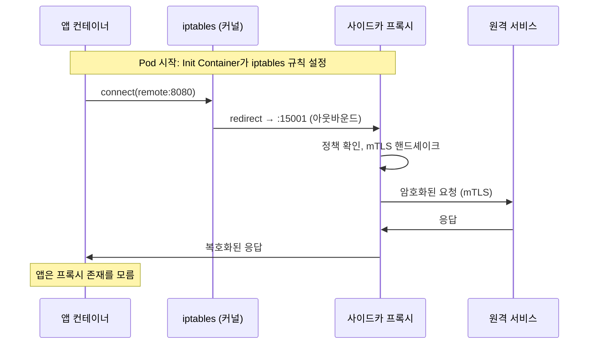
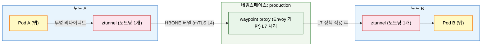

# 프록시 아키텍처

> 서비스 메시의 데이터 플레인은 프록시가 실행한다. 어떤 프록시를 선택하느냐가 메모리 오버헤드, 지연 시간, 확장성을 결정한다. - 
>
> - Envoy(C++)는 기능이 풍부하지만 무겁고, linkerd2-proxy(Rust)는 경량이지만 범용성이 낮다. 
> - Istio의 앰비언트 모드는 ztunnel(L4)과 waypoint(L7)로 역할을 분리해 오버헤드를 줄였고, Kubernetes 1.28+의 네이티브 사이드카는 사이드카 수명주기 문제를 해결하는 새로운 접근이다.


## 학습 목표
> 서비스 프록시의 트래픽 인터셉트 원리부터 Envoy xDS, linkerd2-proxy, ztunnel, 사이드카 주입 방식까지 여섯 가지 목표를 다룬다.


학습 목표는 여섯 가지다:

1. 서비스 프록시가 필요한 이유와 트래픽 인터셉트 원리를 설명한다.
2. Envoy의 xDS API 구조와 WASM 필터 확장성을 설명한다.
3. linkerd2-proxy의 설계 철학과 Envoy 대비 트레이드오프를 비교한다.
4. ztunnel과 waypoint proxy의 역할 분리를 설명한다.
5. 사이드카 주입 방식 세 가지의 차이를 설명한다.
6. 프록시별 성능 특성을 수치 기반으로 비교한다.


## 1. 서비스 프록시란 무엇인가
> 서비스 메시에서 프록시가 관찰자이자 집행자로 동작하는 방식과 iptables 기반 트래픽 인터셉트 원리를 설명한다.


프록시는 두 엔드포인트 사이에서 트래픽을 중계하는 소프트웨어다. 서비스 메시 맥락에서 프록시는 단순한 중계를 넘어 관찰자이자 집행자 역할을 한다. 모든 요청이 프록시를 통과하므로, 프록시는 "무슨 요청이 왔는가", "얼마나 걸렸는가", "성공했는가"를 측정하고, "이 요청이 허용된 것인가", "어느 인스턴스로 보낼 것인가"를 결정한다.

대형 건물의 로비 안내 데스크와 비슷하다. 건물 입주자(서비스)들은 외부 방문객(요청)을 직접 만나지 않는다. 모든 방문객은 안내 데스크(프록시)를 거친다. 안내 데스크는 방문 기록을 남기고(관측성), 신분을 확인하고(인증), 방문 가능 층을 제한하며(접근 제어), 엘리베이터 배정을 최적화한다(로드 밸런싱).

### 트래픽 인터셉트의 원리

서비스 메시에서 프록시가 모든 트래픽을 가로채는 방법은 애플리케이션을 수정하지 않는다. 대신 네트워크 계층에서 가로챈다. 사이드카 패턴에서는 Init Container가 Pod 시작 시 iptables 규칙을 설정한다. 이 규칙은 Pod 네트워크 네임스페이스 내에서 모든 인바운드 TCP 트래픽은 포트 15006으로, 모든 아웃바운드 TCP 트래픽은 포트 15001로 리다이렉트하도록 지시한다.




## 2. Envoy — 범용 고성능 프록시
> Lyft가 개발한 C++ 기반 Envoy의 xDS API, WASM 필터 확장성, 리소스 오버헤드를 다룬다.


Envoy는 Lyft가 2016년 오픈소스로 공개한 C++ 기반 L7 프록시다. 현재 CNCF Graduated 프로젝트이며, Istio의 기본 데이터 플레인이자 AWS App Mesh, Google Cloud Traffic Director 등 다수의 서비스 메시가 채택했다.

Envoy의 핵심 설계 원칙은 세 가지다. 모든 기능은 API를 통해 동적으로 구성된다(재시작 없이 라우팅 규칙을 변경할 수 있다). 관측성이 내장 기능이다(모든 서브시스템에서 메트릭을 내보낸다). 확장 가능하다(WASM 필터로 사용자 정의 로직을 삽입할 수 있다).

### xDS API — 동적 설정의 핵심

xDS(eXtensible Discovery Service)는 Envoy가 컨트롤 플레인과 통신하는 gRPC 기반 API 집합이다. 이 API가 있어서 Envoy는 재시작 없이 설정을 실시간으로 업데이트할 수 있다. 다섯 가지 하위 API가 요청이 Envoy를 통과하는 물리적 순서와 동일하게 Listener→Route→Cluster→Endpoint를 책임지고, 별도 채널인 SDS가 TLS 자료를 전달한다.

| API | 풀네임 | 역할 |
|-----|--------|------|
| LDS | Listener Discovery Service | 어느 포트에서 트래픽을 받을지 |
| RDS | Route Discovery Service | 받은 트래픽을 어느 클러스터로 라우팅할지 |
| CDS | Cluster Discovery Service | 업스트림 서비스 목록과 로드 밸런싱 설정 |
| EDS | Endpoint Discovery Service | 각 클러스터의 실제 IP:포트 목록 |
| SDS | Secret Discovery Service | TLS 인증서와 키 |

새 Pod가 배포되어 엔드포인트가 추가되는 순간, 수십 초 안에 클러스터 전체 Envoy가 이를 인식한다.

### WASM 필터 확장성

Envoy의 강력한 기능 중 하나는 WebAssembly(WASM) 기반 필터 확장이다. 사용자가 Go, Rust, C++ 등으로 커스텀 로직을 작성하고 WASM으로 컴파일해 Envoy에 로드할 수 있다. 커스텀 인증 로직, 특정 헤더 변환, API 사용량 과금 로직 삽입 등이 실제 사용 사례다.

### Envoy의 리소스 오버헤드

Envoy의 주요 약점은 리소스 소비다. 초기화 후 최소 메모리 사용량은 약 50MB이며, 트래픽이 많은 서비스에서는 100MB 이상 사용하는 경우도 흔하다. 1,000개 Pod 클러스터에서 사이드카만으로 50-100GB 메모리가 필요하다는 계산이 나온다.


## 3. linkerd2-proxy — 목적 지향 경량 프록시
> 서비스 메시 전용으로 설계된 Rust 기반 linkerd2-proxy의 설계 철학과 Envoy 대비 트레이드오프를 비교한다.


Linkerd의 창업자 William Morgan은 "Envoy는 범용 프록시다. Linkerd는 서비스 메시만을 위한 프록시가 필요했다"고 설명했다. 이 철학에서 linkerd2-proxy가 탄생했다.

linkerd2-proxy는 Rust로 작성됐다. Rust는 GC(Garbage Collection)가 없어 예측 가능한 지연 시간을 제공하고, 메모리 안전성을 컴파일 타임에 보장한다. C++로 작성된 Envoy가 메모리 관련 버그에 취약할 수 있는 영역을 Rust의 소유권 시스템이 원천 차단한다.

linkerd2-proxy의 메모리 사용량은 약 10MB로 Envoy의 1/5 수준이다. 같은 1,000개 Pod 클러스터에서 약 10GB 메모리가 필요하다는 계산이 나온다(Envoy 대비 80% 절감). 지연 시간 오버헤드도 낮다. Linkerd의 공식 벤치마크에 따르면 linkerd2-proxy는 Envoy 대비 p99 지연 시간이 30-50% 낮은 결과를 보인다.

linkerd2-proxy는 의도적으로 범용 기능을 배제한다. WASM 필터 지원이 없고, xDS API도 지원하지 않으며(Linkerd는 자체 컨트롤 플레인 프로토콜을 사용한다), Redis/MongoDB 같은 비HTTP 프로토콜 프록시 기능도 없다. 이는 단점이기도 하지만, 서비스 메시에 필요하지 않은 기능을 배제해 단순성을 달성하는 의도된 선택이다.


## 4. ztunnel — 앰비언트 모드의 L4 레이어
> Istio 앰비언트 모드에서 노드당 하나씩 실행되며 L4 mTLS와 기본 텔레메트리를 담당하는 ztunnel을 설명한다.


ztunnel은 Istio 앰비언트 모드의 핵심 컴포넌트다. "ztunnel"의 z는 zero-trust에서 왔다. 노드당 하나씩 DaemonSet으로 실행되며 Rust로 작성됐다. 사이드카 모델에서 Pod 1,000개마다 1,000개의 프록시가 필요했다면, ztunnel은 노드 50개 클러스터에서 50개만 실행된다.

ztunnel이 처리하는 것들: mTLS 암호화, L4 접근 제어, 기본 텔레메트리(TCP 연결 수, 바이트 전송량).

ztunnel이 처리하지 않는 것들: HTTP 헤더 검사, JWT 검증, HTTP 레벨 트래픽 분할, gRPC 라우팅. 이런 L7 기능은 waypoint proxy의 영역이다.


## 5. waypoint proxy — 앰비언트 모드의 L7 레이어
> L7 기능이 필요한 서비스에만 선택적으로 배포하는 waypoint proxy의 역할과 HBONE 터널링 프로토콜을 설명한다.


waypoint proxy는 앰비언트 모드에서 L7 기능이 필요한 곳에만 배포한다. 기본적으로 클러스터에 배포되지 않으며, 운영자가 특정 네임스페이스나 서비스에 대해 명시적으로 waypoint를 생성해야 한다.

```bash
# 네임스페이스에 waypoint 배포
istioctl waypoint apply --namespace production

# 특정 서비스에만 waypoint 배포
istioctl waypoint apply --name payment-waypoint --for service
```

이 선택적 배포가 핵심 가치다. 결제 서비스는 L7 헤더 기반 라우팅과 JWT 검증이 필요하지만, 단순한 내부 캐시 서비스는 L4 mTLS만으로 충분하다는 판단을 인프라 레벨에서 표현할 수 있다.



HBONE(HTTP-Based Overlay Network Encapsulation)은 앰비언트 모드에서 ztunnel 간 터널링에 사용하는 프로토콜이다. HTTP/2 CONNECT 메서드를 사용해 mTLS 터널을 설정한다.


## 6. 사이드카 주입 방식 비교
> Init Container+iptables, K8s 1.28+ 네이티브 사이드카, CNI 플러그인 세 가지 주입 방식의 차이와 수명주기 보장을 비교한다.


### 방식 1: Init Container + iptables (전통적 방식)

가장 오래되고 널리 사용되는 방식이다. 쿠버네티스 MutatingWebhook이 Pod 생성 시 Init Container를 자동으로 주입한다. Init Container가 iptables 규칙을 설정하고 종료된다. 이후 앱 컨테이너와 프록시 컨테이너가 병렬로 시작된다.

주요 문제점은 수명주기다. Pod 종료 시 쿠버네티스는 컨테이너 종료 순서를 보장하지 않는다. 프록시가 먼저 종료되면 앱 컨테이너가 아직 실행 중인데 네트워크가 끊기는 상황이 발생한다. Job이나 CronJob처럼 완료 후 종료하는 워크로드에서 이 문제가 특히 두드러진다.

### 방식 2: K8s 1.28+ 네이티브 사이드카

쿠버네티스 1.28(2023년 8월)부터 사이드카 컨테이너를 네이티브로 지원한다. `initContainers`에 `restartPolicy: Always`를 설정하면 해당 Init Container가 사이드카로 동작한다.

```yaml
initContainers:
- name: linkerd-proxy
  image: cr.l5d.io/linkerd/proxy:stable-2.14.0
  restartPolicy: Always  # 이것이 네이티브 사이드카로 만드는 키
```

네이티브 사이드카의 핵심 이점은 수명주기 보장이다. 쿠버네티스가 사이드카를 앱 컨테이너보다 먼저 시작하고, 앱 컨테이너 종료 후에 사이드카를 종료한다. Job 워크로드에서 앱이 완료되면 사이드카도 함께 종료된다.

### 방식 3: CNI 플러그인 주입

Istio CNI 플러그인 방식은 Init Container를 완전히 제거한다. 대신 CNI 플러그인이 Pod 네트워크 설정 시 iptables 규칙을 주입한다. Init Container 방식은 Pod가 `NET_ADMIN` capability를 요구하지만, CNI 플러그인 방식은 이 권한이 필요 없다. 보안에 민감한 환경에서 컨테이너에 `NET_ADMIN` 권한 부여를 거부하는 정책이 있을 때 해결책이 된다.


## 7. 성능 비교
> Envoy, linkerd2-proxy, ztunnel의 p50/p99 지연 시간과 메모리 사용량을 수치로 비교한다.


| 프록시 | p50 추가 지연 | p99 추가 지연 | 메모리/인스턴스 |
|--------|--------------|--------------|----------------|
| Envoy (Istio 사이드카) | ~1ms | ~5-10ms | ~50-100MB |
| linkerd2-proxy | ~0.5ms | ~2-5ms | ~10-20MB |
| ztunnel (앰비언트 L4) | ~0.3ms | ~1-2ms | ~5MB/노드 |
| 메시 없음 (베이스라인) | — | — | 0 |

100개 노드, 노드당 평균 20개 Pod = 2,000 Pod 클러스터로 환산하면 메모리 비용 차이가 명확히 드러난다. Envoy 사이드카는 `2,000 × 50MB = 100GB`, linkerd2-proxy는 `2,000 × 10MB = 20GB`, ztunnel은 `100 × 5MB = 0.5GB`로 두 자릿수 배율 차이가 난다. 노드 수에만 비례하는 ztunnel이 가장 효율적이고, Pod 수에 비례하는 사이드카 모델은 Pod 수가 늘어날수록 비용이 누적된다.


## 8. 프록시 선택 가이드
> 기능 요구사항과 리소스 제약에 따라 Envoy, linkerd2-proxy, ztunnel+waypoint 중 적합한 프록시를 선택하는 기준을 제시한다.


**Envoy가 적합한 경우**: 세밀한 트래픽 제어, WASM 필터를 통한 커스텀 확장, Envoy 기반 API Gateway와의 통합, 풍부한 생태계 활용이 우선순위일 때.

**linkerd2-proxy가 적합한 경우**: 메모리/비용 최적화가 중요하고, 서비스 메시 기능이 상대적으로 단순하며, 운영 단순성을 최우선으로 삼을 때.

**ztunnel + waypoint가 적합한 경우**: 기존 Istio 사용자가 사이드카 오버헤드를 줄이고 싶거나, 점진적으로 L7 기능을 추가하고 싶을 때.


## 점검 질문
> 본 장에서 다룬 프록시 아키텍처 핵심 개념을 Q&A 형태로 점검한다.


**Q1. 사이드카 프록시가 애플리케이션 코드 변경 없이 트래픽을 가로채는 원리는?**

Pod 시작 시 Init Container가 iptables 규칙을 설정한다. 이 규칙은 Pod 네트워크 네임스페이스 안에서 모든 인바운드/아웃바운드 TCP 트래픽을 프록시 포트로 리다이렉트한다. 애플리케이션이 `remote:8080`으로 TCP 연결을 시도하면, 커널이 이를 프록시 포트로 투명하게 전달한다. 앱은 프록시 존재를 알지 못한다.

**Q2. Envoy의 xDS API가 왜 중요한가?**

xDS API는 Envoy가 재시작 없이 설정을 동적으로 받는 메커니즘이다. LDS(리스너), RDS(라우팅), CDS(클러스터), EDS(엔드포인트), SDS(인증서)로 구성된 gRPC 스트림을 통해 컨트롤 플레인이 변경 사항을 즉시 푸시한다. 새 서비스 배포, 인증서 갱신, 트래픽 정책 변경이 트래픽 중단 없이 이루어진다.

**Q3. linkerd2-proxy가 Envoy 대비 메모리가 적은 이유는?**

두 가지 이유가 있다:

1. linkerd2-proxy는 서비스 메시 기능만 구현하는 목적 지향 설계로, Envoy가 포함하는 Redis/MongoDB 프록시 등 범용 기능이 없어 바이너리와 기저 메모리가 작다.
2. Rust의 소유권 기반 메모리 관리로 GC 힙 오버헤드가 없다. 결과적으로 Envoy 약 50MB 대비 linkerd2-proxy는 약 10MB다.

**Q4. ztunnel과 waypoint proxy의 역할 분리가 왜 효율적인가?**

ztunnel은 L4만 처리해 노드당 하나로 모든 워크로드를 대신할 수 있다. L4 처리는 상태가 거의 없어 여러 서비스를 하나의 프록시가 처리해도 격리 문제가 적다. waypoint는 L7이 필요한 서비스에만 선택적으로 배포해 오버헤드를 지불하는 서비스를 최소화한다.

**Q5. K8s 1.28+ 네이티브 사이드카가 기존 Init Container 방식과 다른 점은?**

핵심은 수명주기 보장이다. 기존 방식은 Pod 종료 시 프록시와 앱 컨테이너 종료 순서가 보장되지 않아, 프록시가 먼저 종료되면 앱이 네트워크를 잃는 문제가 있었다. 네이티브 사이드카는 쿠버네티스가 앱보다 먼저 시작하고 앱 종료 후에 종료하는 것을 보장한다. Job 워크로드에서 앱이 완료되면 사이드카도 함께 종료된다.
