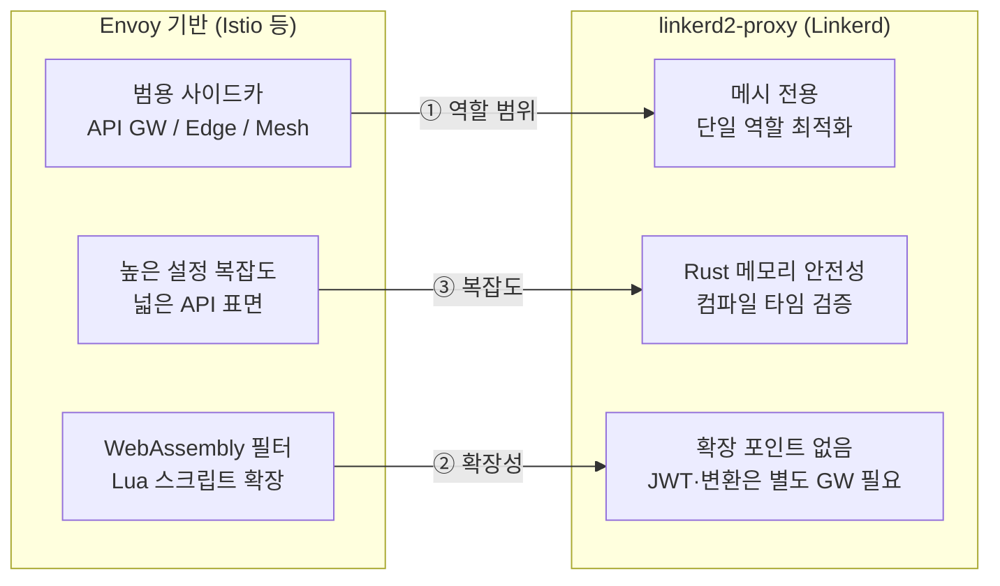
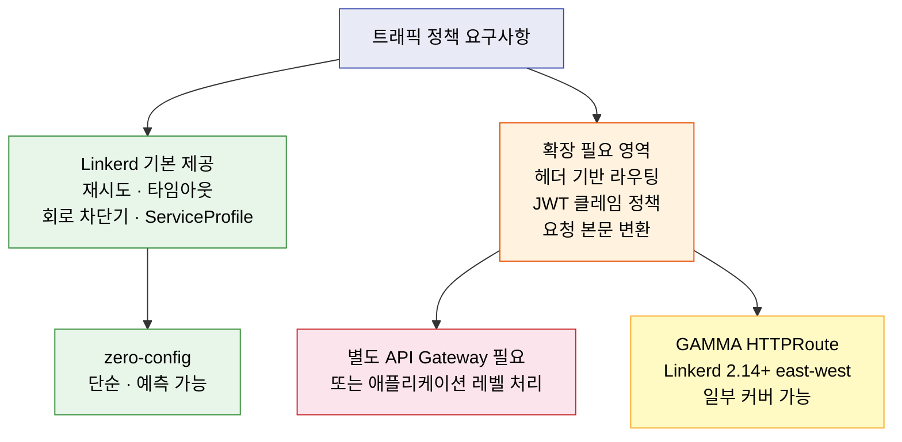

# Linkerd 아키텍처 점검

> 본 장의 심화 점검 질문입니다. LEARN에서 다룬 개념의 경계와 운영 환경에서 주의할 판단 포인트를 Q&A 형태로 정리했습니다.


## Q1. BEL 라이선스 변경이 오픈소스 생태계에 미친 실질적 영향은 무엇인가?

> BEL 라이선스 구조와 edge 채널·무료 티어 우회 방법, 대규모 프로덕션에서의 비용 비교 분석을 다룹니다.


Buoyant가 2023년 stable 릴리스를 BEL 상용 라이선스로 전환한 결정은 CNCF 프로젝트 역사에서 드문 사례입니다. 이 변경은 두 가지 현실적 질문을 낳습니다:

1. edge 릴리스(비안정 버전)만 무료로 사용할 수 있다면 프로덕션 적용이 가능한가?
2. 대안으로 Istio나 Cilium으로 이동하는 비용이 BEL 라이선스 비용보다 낮은가?

라이선스 구조를 정확히 이해하는 것이 출발점입니다. Buoyant는 edge 채널은 Apache 2.0으로 유지하고 stable 채널만 BEL로 전환했습니다. 즉, 무료 사용자는 최신 버전을 빠르게 따라가야 하는 운영 부담을 안게 됩니다. BEL은 30노드 이하 클러스터에 대해 무료 티어를 제공하므로, 소규모 팀이라면 실질적 비용 없이 stable 채널을 사용할 수 있습니다.

한편, Linkerd는 CNCF Graduated 프로젝트로서 프로젝트 자체의 성숙도는 검증됩니다. (출처: cncf.io/projects/linkerd)

대규모 프로덕션 환경에서는 Linkerd edge 채널 운영 오버헤드(잦은 업그레이드)와 BEL 비용, 그리고 Istio 전환 비용을 정량적으로 비교하는 분석이 선행돼야 합니다.


## Q2. Linkerd가 Envoy 대신 Rust로 자체 프록시를 구현한 결정은 어떤 트레이드오프를 수반하는가?

> Envoy 범용성을 포기하고 서비스 메시 전용 Rust 프록시를 선택한 이유와 확장 포인트 부재라는 단점을 설명합니다.


Envoy를 선택하지 않은 이유는 Envoy의 범용성 자체에 있습니다. Envoy는 API Gateway, 사이드카 프록시, 엣지 프록시 등 다양한 역할을 지원하도록 설계됐기 때문에 설정 복잡도와 API 표면적이 큽니다. Linkerd 팀은 "서비스 메시 사이드카"라는 단일 역할에 최적화된 프록시가 더 단순하고 안전하다는 판단을 내렸습니다.

Rust 선택의 핵심 이점은 메모리 안전성입니다. C++로 작성된 Envoy는 역사적으로 메모리 관련 CVE가 다수 발생했습니다. Rust는 컴파일 타임에 메모리 오류를 방지하므로, 모든 트래픽이 통과하는 프록시에서 공격 표면을 줄이는 효과가 있습니다. linkerd2-proxy는 Rust로 구현된 마이크로프록시입니다. (출처: github.com/linkerd/linkerd2-proxy)

그러나 트레이드오프도 분명합니다. linkerd2-proxy는 Envoy보다 확장 포인트가 훨씬 적습니다. Envoy는 WebAssembly 필터와 Lua 스크립트를 통해 커스텀 로직을 주입할 수 있지만 linkerd2-proxy는 이런 확장 메커니즘이 없습니다. JWT 검증, 요청 본문 변환, gRPC 트랜스코딩 같은 기능이 필요하다면 Linkerd만으로는 부족하고 별도의 API Gateway가 필요합니다.

아래는 Envoy 기반 사이드카와 Rust 마이크로프록시의 트레이드오프를 구조로 나타낸 것입니다.



```bash
# linkerd2-proxy 내부 메트릭 확인
kubectl exec -n <namespace> <pod> -c linkerd-proxy -- \
  curl -s http://localhost:4191/metrics | grep -E "tcp_open_connections|request_duration"
```


## Q3. Linkerd 컨트롤 플레인이 단일 장애점(SPOF)이 되지 않으려면 어떤 설계가 필요한가?

> HA 모드 구성, 인증서 갱신 중단 위험, identity 서버 가용성 모니터링 방법을 다룹니다.


컨트롤 플레인이 다운되더라도 이미 실행 중인 데이터 플레인은 마지막으로 받은 설정으로 계속 동작합니다. 단, 인증서 갱신이 중단되므로 identity 서버 다운이 24시간을 넘으면 mTLS 연결이 실패하기 시작합니다.

고가용성 구성은 `--ha` 플래그 또는 Helm 옵션으로 활성화합니다. 컨트롤 플레인 컴포넌트가 3개 이상의 replica로 배포되고, PodDisruptionBudget이 적용되며, anti-affinity 규칙으로 여러 노드에 분산됩니다.

```bash
# HA 모드로 Linkerd 설치 (Helm)
helm install linkerd-control-plane \
  -n linkerd \
  --set controllerReplicas=3 \
  --set-file identityTrustAnchorsPEM=ca.crt \
  --set-file identity.issuer.tls.crtPEM=issuer.crt \
  --set-file identity.issuer.tls.keyPEM=issuer.key \
  linkerd/linkerd-control-plane

# 컨트롤 플레인 상태 확인
linkerd check

# 프록시 인증서 만료 시간 확인
linkerd check --proxy
```

identity 서버 가용성을 직접 모니터링하는 알림을 설정하고, 인증서 만료까지 남은 시간을 추적하는 것이 예상치 못한 mTLS 장애를 예방하는 현실적 방법입니다.


## Q4. linkerd2-proxy의 Tokio/Tower 기반 비동기 아키텍처는 어떤 시나리오에서 한계를 드러내는가?

> 동기 작업 혼재 시 이벤트 루프 블로킹 위험과 부하 테스트로 성능 한계를 파악하는 방법을 설명합니다.


linkerd2-proxy는 Rust의 비동기 에코시스템인 Tokio(런타임)와 Tower(미들웨어)를 기반으로 구축됐습니다. 이 아키텍처는 CPU를 오래 점유하는 동기 작업이 비동기 태스크 안에 섞이면 전체 이벤트 루프가 블로킹될 수 있습니다. 대용량 요청 본문을 버퍼링하거나 TLS 핸드셰이크가 집중되는 상황에서는 레이턴시 스파이크가 나타날 수 있습니다.

성능 한계를 파악하려면 실제 트래픽 패턴을 시뮬레이션하는 부하 테스트가 필수입니다.

```bash
# 프록시 내부 메트릭으로 연결 상태 확인
linkerd diagnostics proxy-metrics <pod> -n <namespace>

# 특히 아래 메트릭을 집중 관찰
# tcp_open_connections: 현재 열려 있는 TCP 연결 수
# request_duration_ms: 요청별 처리 시간 분포
```

연결 수가 급격히 증가하는 패턴이 있다면, 업스트림 서비스의 커넥션 풀 설정을 검토해 불필요한 연결 생성을 줄이는 것이 우선입니다.


## Q5. Linkerd의 "zero config" 철학은 복잡한 트래픽 정책이 필요한 환경에서 어떤 설계 긴장을 일으키는가?

> Linkerd가 기본 제공하는 정책 범위와 헤더 기반 라우팅·JWT 클레임 정책이 필요할 때 별도 API Gateway가 필요한 한계를 다룹니다.


Linkerd가 기본적으로 제공하는 트래픽 정책은 재시도, 타임아웃, 회로 차단기, ServiceProfile 기반 라우팅입니다. 이 범위 안에서는 설정이 간결하고 예측 가능합니다. 그러나 헤더 기반 라우팅, 가중치 미러링, 요청 변환, JWT 클레임 기반 정책으로 확장될 때 Linkerd의 한계가 드러납니다.

Istio의 VirtualService는 정규식 기반 경로 매칭, 헤더 조작, 결함 주입, 미러링을 네이티브로 지원합니다. Linkerd에서 동일한 기능을 구현하려면 별도의 API Gateway를 도입하거나 애플리케이션 레벨에서 처리해야 합니다.

Linkerd 도입 결정 전에 "18개월 후 우리에게 필요한 트래픽 정책이 무엇인가?"를 먼저 정의해야 합니다. 카나리 배포, A/B 테스트, 지역 기반 라우팅이 로드맵에 있다면 Linkerd만으로는 부족할 가능성이 높습니다.

한편 Linkerd 2.14부터는 GAMMA(Gateway API for Mesh) east-west 라우팅을 지원하여 HTTPRoute 등 Gateway API 리소스로 서비스 간 트래픽을 제어할 수 있습니다. 다만 헤더 조작·결함 주입·미러링 같은 고급 정책은 여전히 별도 API Gateway와 병행해야 합니다. (출처: gateway-api.sigs.k8s.io/mesh)

아래는 Linkerd의 기본 정책 범위와 외부 Gateway가 필요한 경계를 나타낸 것입니다.




## Q6. Linkerd 멀티클러스터 아키텍처에서 게이트웨이 기반 접근법의 보안 모델은 어떻게 작동하는가?

> 서비스 미러링 방식과 게이트웨이가 복호화 지점이 되는 보안 모델의 제약, 클러스터 간 크레덴셜 관리를 설명합니다.


Linkerd 멀티클러스터의 핵심은 서비스 미러링(service mirroring)입니다. 소스 클러스터의 service-mirror 컨트롤러가 대상 클러스터의 서비스를 감시하고, 로컬 클러스터에 미러 서비스를 생성합니다. 애플리케이션은 이 미러 서비스로 요청을 보내고, 실제 트래픽은 대상 클러스터의 멀티클러스터 게이트웨이로 전달됩니다.

게이트웨이 기반 접근법의 제약은 게이트웨이가 트래픽의 복호화 지점이 된다는 것입니다. 소스 Pod에서 소스 게이트웨이 구간은 Linkerd mTLS로 보호되지만, 게이트웨이는 트래픽을 복호화하고 대상 클러스터 게이트웨이와 새로운 mTLS 연결을 맺습니다. 엄밀한 단대단 암호화는 아니며, 게이트웨이 자체가 신뢰 경계 내에 있어야 한다는 전제가 있습니다.

```bash
# 멀티클러스터 설치 및 연결
linkerd multicluster install | kubectl apply -f -
linkerd multicluster link --cluster-name west | \
  kubectl apply -f - --context east

# 클러스터 간 게이트웨이 상태 확인
linkerd multicluster gateways
```

클러스터 간 크레덴셜(링크 시크릿)은 별도의 시크릿 관리 솔루션(Vault, External Secrets Operator)으로 관리하는 것이 하드코딩보다 안전합니다.


## Q7. Linkerd가 HTTP/2 멀티플렉싱을 기본 적용하는 방식은 기존 HTTP/1.1 서비스와 어떤 호환성 문제를 일으킬 수 있는가?

> 서버 선발 프로토콜(MySQL, Redis 등)의 자동 감지 실패와 opaque-ports 어노테이션으로 해결하는 방법을 다룹니다.


Linkerd는 Pod 간 통신에 자동으로 HTTP/2 프로토콜 업그레이드를 적용합니다. MySQL, Redis, MongoDB 등 바이너리 프로토콜 서비스는 서버가 먼저 데이터를 보내는 구조라 자동 감지 타임아웃이 발생합니다. 이런 서비스는 반드시 `opaque-ports` 어노테이션으로 지정해야 합니다.

```bash
# MySQL 포트를 opaque로 지정 (Namespace 어노테이션)
kubectl annotate namespace my-app \
  config.linkerd.io/opaque-ports="3306,5432,6379"

# 특정 Deployment에 지정
kubectl annotate deploy my-db \
  config.linkerd.io/opaque-ports="3306"

# 현재 opaque port 설정 확인
kubectl get ns my-app -o \
  jsonpath='{.metadata.annotations.config\.linkerd\.io/opaque-ports}'
```

Linkerd 주입 전에 각 서비스의 프로토콜과 연결 패턴을 명세화하는 것이 예상치 못한 타임아웃을 막는 가장 확실한 방법입니다.
