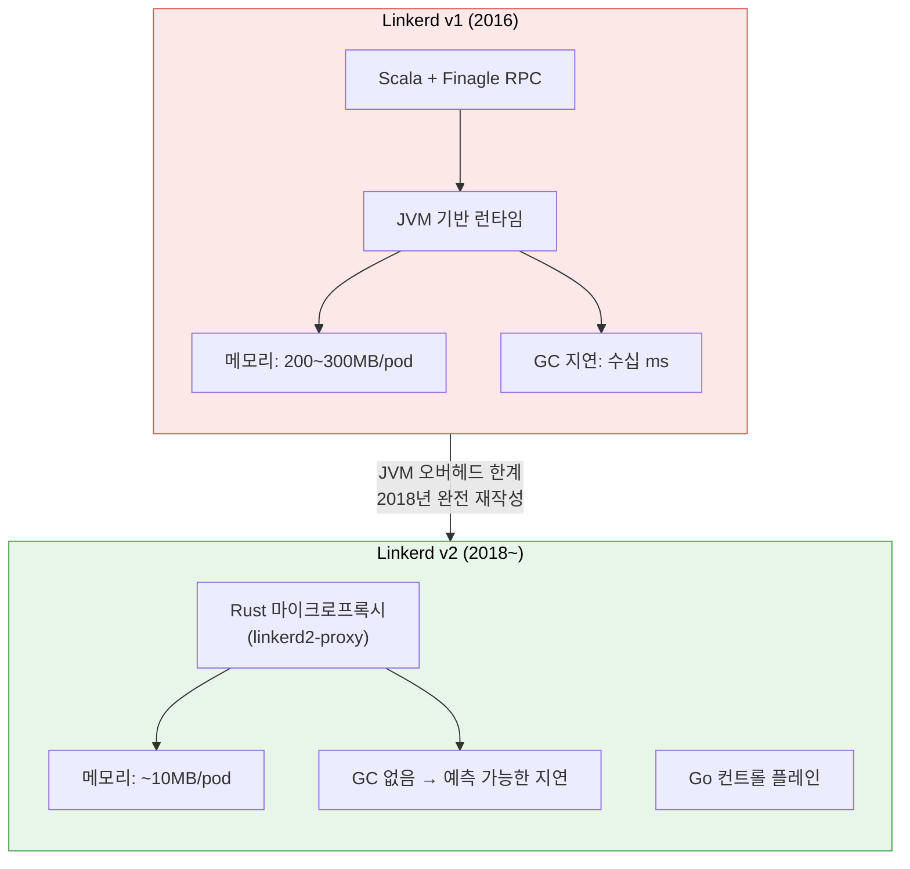
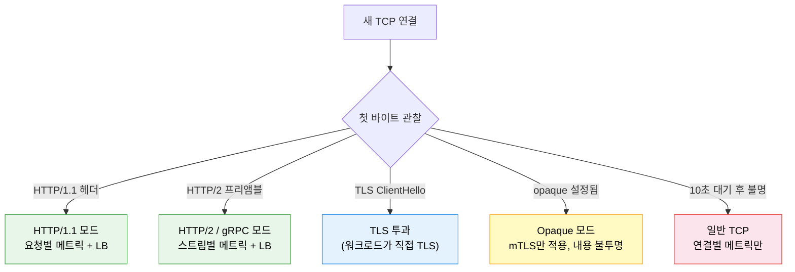
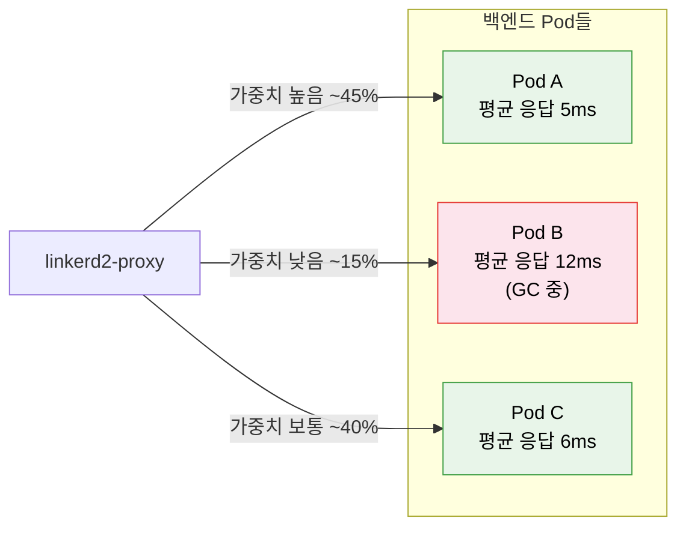
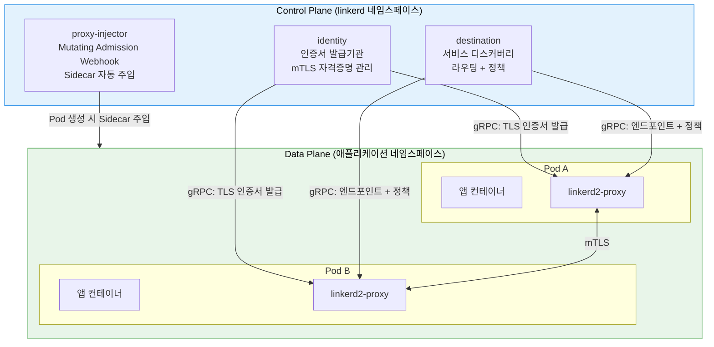

# Linkerd 아키텍처

> Linkerd는 "운영 단순성(Operational Simplicity)"을 최우선으로 삼은 서비스 메시다. Scala/JVM 기반의 v1을 버리고 Rust 마이크로프록시와 Go 컨트롤 플레인으로 재작성한 v2는, 바이너리 크기 10MB라는 수치가 상징하듯 메시에 꼭 필요한 기능만 담는다.


## 학습 목표
> Linkerd v1 실패 원인, Rust 선택 배경, EWMA 로드밸런싱, BEL 라이선스, Istio 비교까지 여섯 가지 목표를 다룬다.


학습 목표는 여섯 가지다:

1. Linkerd v1에서 v2로 완전 재작성된 이유와 기술 결정 배경을 설명한다.
2. 컨트롤 플레인 세 구성요소(destination, identity, proxy-injector)의 역할을 구분한다.
3. linkerd2-proxy가 Rust로 작성된 이유와 Envoy 대비 장단점을 말한다.
4. EWMA 로드밸런싱이 Round-Robin과 어떻게 다른지 설명한다.
5. BEL 라이선스 모델의 핵심 조건과 우회 방법을 파악한다.
6. Linkerd와 Istio 아키텍처를 비교해 상황별 선택 기준을 세운다.


## 1. 역사: v1의 실패와 v2의 탄생
> Scala/JVM 기반 Linkerd v1의 한계와 Rust 마이크로프록시·Go 컨트롤 플레인으로 재작성된 v2의 세 가지 핵심 결정을 설명한다.


### 1.1 서비스 메시라는 단어를 처음 만든 프로젝트

2016년 Buoyant의 William Morgan과 Oliver Gould가 "서비스 메시"라는 개념을 처음 명명하고 Linkerd를 출시했다. Twitter 내부에서 사용하던 Finagle RPC 라이브러리를 기반으로 했기 때문에 Linkerd v1은 자연스럽게 Scala와 JVM 위에서 동작했다.

문제는 처음부터 내재되어 있었다. JVM은 범용 런타임으로는 훌륭하지만 수천 개의 Pod에 Sidecar로 붙이기에는 지나치게 무겁다. 각 Sidecar가 최소 200~300MB의 힙 메모리를 점유하고 가비지 컬렉션이 발생할 때마다 수십 밀리초의 예측 불가한 지연이 생겼다. 1,000개 Pod 클러스터라면 Sidecar만을 위해 200GB 이상의 메모리가 필요한 셈이다.



### 1.2 세 가지 핵심 결정

2018년 재작성 당시 팀이 내린 결정은 다음 세 가지였다:

1. Kubernetes 외의 플랫폼 지원을 포기했다. 범용성이 오히려 복잡성의 원인이었기 때문에, Kubernetes 하나에 집중함으로써 Mutating Webhook·CRD·RBAC 같은 Kubernetes 네이티브 기능을 적극 활용할 수 있게 됐다.
2. 컨트롤 플레인은 Go로 작성했다. Kubernetes 자체와 같은 언어라 생태계와 운영 도구 호환성이 좋고, 정적 바이너리로 빌드되어 배포가 단순하다.
3. 데이터 플레인 프록시를 Envoy 대신 Rust로 직접 작성하는 가장 대담한 결정을 내렸다.


## 2. 데이터 플레인: linkerd2-proxy의 설계
> Rust 선택 이유, 프로토콜 자동 감지 원리, EWMA 기반 지연 시간 인식 로드밸런싱을 다룬다.


### 2.1 왜 Rust인가

네트워크 프록시에는 상충되는 두 요구사항이 있다. 메모리 관리가 자동화되어야 하는 동시에 GC에 의한 지연 없이 예측 가능한 레이턴시를 보장해야 한다. C/C++는 GC가 없어 지연이 예측 가능하지만 메모리 버그가 끊이지 않는다. Java/Go는 메모리 안전하지만 GC가 지연을 유발한다. Rust는 소유권 시스템으로 컴파일 타임에 메모리 안전성을 보장하면서 런타임 GC가 없다.

실제로 linkerd2-proxy의 바이너리는 약 10MB다. Envoy는 약 50MB에 달한다. 메모리 사용량도 idle 상태에서 Envoy가 40~50MB인 반면 linkerd2-proxy는 10MB 미만이다. 수천 개 Pod 규모에서 이 차이는 클러스터 노드 수로 직결된다.

### 2.2 프로토콜 감지

linkerd2-proxy는 연결이 맺어지면 첫 바이트를 기다렸다가 프로토콜을 자동 감지한다. HTTP/1.1, HTTP/2, gRPC는 클라이언트가 먼저 요청을 보내기 때문에 자동 감지가 가능하다. 반면 MySQL, Redis, SMTP처럼 서버가 먼저 인사를 건네는 프로토콜은 자동 감지가 불가능하다. 연결은 됐지만 클라이언트가 아무것도 보내지 않아 프록시가 대기하다 10초 후 타임아웃을 낸다. 이런 프로토콜에는 반드시 `opaque-ports` 어노테이션으로 수동 설정이 필요하다.



### 2.3 EWMA 로드밸런싱

linkerd2-proxy가 일반 프록시와 가장 차별화되는 부분이 EWMA(Exponentially Weighted Moving Average) 기반 로드밸런싱이다. Round-Robin은 모든 Pod가 동일한 응답 속도라고 가정하지만, 현실에서는 GC가 발생 중인 Pod나 메모리 압박을 받는 Pod가 있다. EWMA는 각 백엔드의 최근 응답 지연을 지수 이동 평균으로 추적해, 응답이 느린 Pod에는 가중치를 낮춰 요청을 덜 보낸다.




## 3. 컨트롤 플레인: 세 개의 구성요소
> destination, identity, proxy-injector 세 컴포넌트의 역할과 데이터 플레인과의 gRPC 통신 구조를 설명한다.


Linkerd의 컨트롤 플레인은 고의적으로 단순하게 설계됐다. Istio가 수십 개의 컴포넌트로 시작했던 것과 달리 Linkerd v2의 컨트롤 플레인은 세 개 컴포넌트로 구성된다.



### 3.1 destination

destination은 프록시에게 "이 서비스로 요청을 보내려면 어디로 가야 하는가"를 알려준다. Kubernetes의 Service·Endpoint·EndpointSlice 리소스를 감시하다가 프록시가 gRPC로 질의하면 실시간으로 엔드포인트 목록을 스트리밍한다. HTTPRoute·TCPRoute 같은 Gateway API 리소스와 ServiceProfile도 해석해 라우팅 규칙과 재시도 정책을 프록시에 전달한다.

메모리 사용량에 주의가 필요하다. destination은 클러스터의 모든 Endpoint를 메모리에 유지하므로 클러스터가 클수록 메모리 사용량이 비례해 늘어난다. 프로덕션에서는 메모리 리소스 제한을 보수적으로 낮게 설정하지 않도록 해야 한다.

### 3.2 identity

identity는 클러스터의 내부 CA 역할을 한다. 새 프록시가 시작되면 identity에 CSR을 보내고, identity는 Issuer 인증서로 서명한 단기 TLS 인증서(기본 24시간)를 발급한다. 24시간이라는 짧은 유효 기간은 의도적 설계다. 인증서가 유출되더라도 최대 24시간 후에는 무효화된다. 프록시가 만료 전에 자동으로 갱신 요청을 보내기 때문에 운영자가 따로 관리할 필요가 없다.

### 3.3 proxy-injector

proxy-injector는 Kubernetes의 Mutating Admission Webhook으로 동작한다. Pod 생성 요청이 API 서버에 도달하면 proxy-injector를 호출해 `linkerd.io/inject: enabled` 어노테이션 유무를 확인한다. 있으면 Pod 정의에 두 가지를 추가해 반환한다. 첫 번째는 `linkerd-init` init 컨테이너로, iptables 규칙을 설정해 모든 인바운드/아웃바운드 트래픽이 프록시를 거치도록 강제한다. 두 번째는 `linkerd-proxy` 사이드카 컨테이너 자체다.


## 4. 버전 역사와 BEL 라이선스
> 2024년 도입된 BEL 라이선스의 핵심 조건과 edge 채널·직접 빌드 우회 방법을 설명한다.


2024년부터 Buoyant는 BEL(Buoyant Enterprise for Linkerd) 라이선스 모델을 도입했다. 소스 코드는 여전히 Apache 2.0이다. 변경된 것은 stable 릴리스 바이너리로, 직원 수 50명 이상의 조직이 stable 바이너리를 프로덕션에서 사용하려면 BEL 라이선스가 필요하다(클러스터당 월 약 $2,000 수준). 우회 방법은 두 가지다. edge 채널 릴리스를 사용하거나, 소스에서 직접 빌드하면 된다. 둘 다 Buoyant의 공식 지원을 받지 못한다.


## 5. mTLS와 SPIFFE 신원 모델
> Linkerd가 메시 내 모든 통신에 자동으로 mTLS를 적용하는 방식과 SPIFFE 기반 워크로드 신원을 설명한다.


Kubernetes 클러스터 내부 네트워크는 기본적으로 평문이다. Linkerd는 메시에 포함된 모든 통신을 자동으로 mTLS로 보호한다. 일반 TLS는 클라이언트가 서버의 신원만 검증하지만, mTLS는 서버도 클라이언트의 신원을 검증한다. 결제 서비스가 주문 서비스로부터 요청을 받을 때 "이 요청이 정말 주문 서비스에서 왔는가"를 인증서로 확인하는 것이다.

각 프록시는 SPIFFE 형식의 신원을 가진다.

```
spiffe://cluster.local/ns/<namespace>/sa/<service-account>
```

이 신원은 Kubernetes Service Account와 연결된다. 서비스 간 정책을 "어떤 IP에서 왔는가"가 아니라 "어떤 신원을 가졌는가"로 정의할 수 있어, IP가 바뀌어도 정책이 유지된다.


## 6. Linkerd vs Istio 비교
> 프록시, 컨트롤 플레인, 트래픽 관리, 리소스 사용, WASM 지원 등 주요 항목을 표로 비교한다.


| 항목 | Linkerd | Istio |
|------|---------|-------|
| 프록시 | linkerd2-proxy (Rust, ~10MB) | Envoy (C++, ~50MB) |
| 컨트롤 플레인 | Go, 3개 컴포넌트 | Go, istiod 단일 바이너리 |
| 트래픽 관리 | HTTPRoute 기반, 기능 제한적 | VirtualService 등 풍부한 CRD |
| 설정 복잡도 | 낮음 (어노테이션 중심) | 높음 (다수의 CRD) |
| 리소스 사용 | 낮음 (프록시 ~10MB) | 보통~높음 (프록시 ~50MB) |
| WASM 확장 | 미지원 | Envoy WASM 필터 지원 |
| 라이선스 | Apache 2.0 (소스), BEL (50인↑ 바이너리) | Apache 2.0 |

Linkerd가 유리한 상황은 서비스 메시 운영 경험이 없어 학습 곡선을 최소화하고 싶을 때, 클러스터 리소스 여유가 적을 때, mTLS·관측성·기본 로드밸런싱만 필요할 때다. Istio는 세밀한 트래픽 제어, WASM으로 프록시 확장, 복잡한 멀티클러스터 페더레이션이 필요할 때 강점을 발휘한다.

> 위 표는 Linkerd 관점의 요약이다. 세 메시(Linkerd·Istio·Cilium)를 같은 축으로 정렬한 전체 비교는 [비교 매트릭스](../05_comparison/01-01.비교%20매트릭스.md)를 참조한다.


## 면접 대비
> Linkerd 아키텍처 핵심 개념을 면접 Q&A 형태로 정리한다.


Q1. Linkerd v1이 실패한 이유와 v2가 Rust를 선택한 이유는?

v1은 Scala/JVM 기반이어서 Pod당 200~300MB 메모리를 점유하고 GC 지연이 불규칙하게 발생해 수천 개 Sidecar 운영에 부적합했다. v2에서 Rust를 선택한 이유는 소유권 시스템으로 컴파일 타임에 메모리 안전성을 보장하면서 런타임 GC가 없기 때문이다. 결과적으로 linkerd2-proxy는 10MB 바이너리 크기와 예측 가능한 레이턴시를 달성했다.

Q2. EWMA 로드밸런싱이 Round-Robin보다 나은 점은?

Round-Robin은 모든 백엔드가 동일한 처리 속도를 가진다고 가정한다. EWMA는 각 백엔드의 최근 응답 지연을 추적해 응답이 느린 Pod에는 적은 요청을 보낸다. 특히 HTTP/2와 gRPC처럼 하나의 연결에 여러 요청이 흐르는 경우에 중요하다.

Q3. destination 컴포넌트가 메모리를 많이 사용하는 이유와 대응 방법은?

destination은 클러스터 내 모든 Service의 Endpoint 정보를 메모리에 유지한다. 대응 방법은 두 가지다:

1. 메모리 제한을 여유 있게 설정한다(너무 낮으면 OOMKilled 루프).
2. destination Pod의 메모리 사용량을 Prometheus로 모니터링해 추이를 파악한다.
