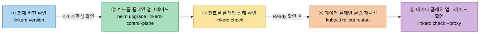
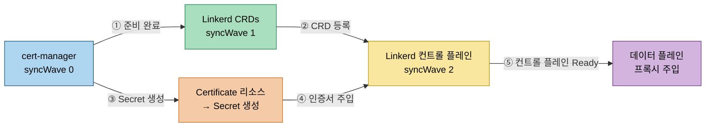
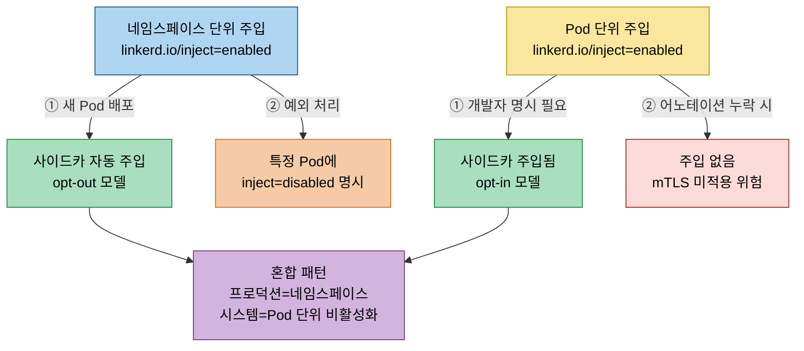

# Linkerd 설치 점검

> 본 장의 심화 점검 질문입니다. LEARN에서 다룬 개념의 경계와 운영 환경에서 주의할 판단 포인트를 Q&A 형태로 정리했습니다.


## Q1. 프로덕션 환경에서 신뢰 앵커(trust anchor)를 무중단으로 교체하는 절차는?
> 무중단 신뢰 앵커 교체를 위한 번들 배포 전략과 단계별 절차를 다룹니다.


신뢰 앵커 교체의 핵심 원리는 "새 신뢰 앵커를 기존 앵커와 함께 번들(bundle)로 배포하는 중간 단계"입니다. 모든 프록시가 새 신뢰 앵커를 신뢰하도록 업데이트된 이후에야 기존 앵커를 제거할 수 있습니다. 이 과정은 최소 두 단계가 필요합니다.

1단계는 새 신뢰 앵커 생성 후 기존 앵커와 결합한 번들을 Linkerd에 적용하는 것입니다. 기존 프록시는 이미 실행 중이므로 롤링 재시작이 필요합니다.

```bash
# 새 Trust Anchor 생성
step certificate create root.linkerd.cluster.local ca-new.crt ca-new.key \
  --profile root-ca --no-password --insecure

# 기존 + 새 Trust Anchor 번들 생성
cat ca.crt ca-new.crt > ca-bundle.crt

# 번들로 컨트롤 플레인 업데이트
linkerd upgrade \
  --identity-trust-anchors-file=ca-bundle.crt | kubectl apply -f -

# 모든 프록시가 번들을 받도록 롤링 재시작
kubectl rollout restart deployment -n production
kubectl rollout restart deployment -n staging

# 재시작 완료 후 프록시 상태 확인
linkerd check --proxy
```

2단계는 모든 프록시가 새 번들로 업데이트됐음을 확인한 후 기존 앵커만 제거하고 새 앵커만 남기는 것입니다. 이 시점에서 Issuer 인증서도 새 신뢰 앵커로 서명된 것으로 교체해야 합니다.

신뢰 앵커 유효 기간을 10년으로 충분히 길게 설정하고, Issuer 인증서는 1년 주기로 자동 갱신하는 패턴이 운영 부담을 줄이는 현실적 방법입니다. 만료 90일 전부터 교체 프로세스를 시작하는 것이 안전합니다.


## Q2. GitOps 환경에서 Helm과 CLI 기반 설치의 차이는 단순한 도구 선택 이상의 의미를 가지는가?
> GitOps 맥락에서 Helm values.yaml 기반 선언적 관리의 이점과 ArgoCD 통합 시 순환 의존성 주의사항을 설명합니다.


CLI 기반 설치(`linkerd install | kubectl apply -f -`)의 문제는 생성되는 매니페스트가 명령 실행 시점의 상태 스냅샷이라는 점입니다. 이 스냅샷을 Git에 커밋해 GitOps로 관리할 수 있지만, 업그레이드 시 새 매니페스트를 생성해 diff를 관리해야 합니다. 이 과정에서 설정 드리프트(config drift)가 발생하기 쉽습니다.

Helm 차트는 values.yaml 파일로 환경별 설정을 선언적으로 관리합니다. Linkerd의 공식 Helm 차트는 `linkerd-crds`, `linkerd-control-plane`, 선택적으로 `linkerd-viz` 세 차트로 구성됩니다. CRD를 별도 차트로 분리한 것은 Helm의 CRD 업그레이드 제한 문제를 우회하기 위한 설계입니다.

ArgoCD와의 통합에서 주의해야 할 점이 있습니다. proxy-injector가 ArgoCD 자체의 Pod에도 Linkerd 사이드카를 주입할 수 있습니다. Linkerd 컨트롤 플레인이 준비되지 않은 상태에서 cert-manager Pod가 주입 시도를 하면 교착 상태가 됩니다.

```bash
# ArgoCD 네임스페이스에 주입 비활성화
kubectl annotate namespace argocd linkerd.io/inject=disabled

# cert-manager 네임스페이스도 비활성화
kubectl annotate namespace cert-manager linkerd.io/inject=disabled
```

GitOps 환경에서는 Helm + values.yaml의 환경별 오버레이가 관리 복잡도를 줄이는 효과적인 패턴입니다. Linkerd 버전 업그레이드는 별도 PR로 관리해 리뷰 프로세스를 거치게 하면 실수를 줄일 수 있습니다.


## Q3. 사이드카 주입 실패를 디버깅할 때 체계적으로 접근하는 방법은?
> 웹훅 연결 문제, 인증서 검증, 주입 조건 불일치 세 범주로 나누어 단계별 디버깅 절차를 안내합니다.


주입 실패의 원인은 크게 세 범주로 나뉩니다. 첫째는 웹훅 연결 문제, 둘째는 인증서 검증 문제, 셋째는 주입 조건 불일치입니다.

```bash
# 1단계: Pod 생성 이벤트 확인
kubectl get events -n <namespace> --sort-by='.lastTimestamp'

# 2단계: Pod 어노테이션에 linkerd 항목이 있는지 확인
kubectl describe pod <pod-name> -n <namespace> | grep -A5 "Annotations"

# 3단계: proxy-injector 웹훅 서버 로그 확인
kubectl logs -n linkerd \
  -l linkerd.io/control-plane-component=proxy-injector \
  --tail=50

# 4단계: 전체 시스템 상태 점검
linkerd check

# 5단계: 특정 네임스페이스 프록시 점검
linkerd check --proxy -n <namespace>
```

주입이 기대되는 Pod에 어노테이션이 없는 경우가 흔한 실수입니다. 새 네임스페이스 생성 시 자동으로 주입 어노테이션을 붙이는 Kyverno 정책으로 누락을 방지할 수 있습니다.


## Q4. 무중단 업그레이드(zero-downtime upgrade)를 위한 Linkerd 버전 관리 전략은?
> n-1 호환성을 활용한 컨트롤 플레인 먼저 업그레이드 후 데이터 플레인 롤링 업그레이드 전략을 다룹니다.


Linkerd는 컨트롤 플레인과 데이터 플레인 사이에 n-1 버전 호환성을 보장합니다. 컨트롤 플레인이 2.15라면 데이터 플레인은 2.14 또는 2.15 프록시와 함께 동작합니다. 이 덕분에 "컨트롤 플레인 먼저 업그레이드, 데이터 플레인을 이후 롤링 업그레이드"하는 안전한 순서가 가능합니다.

```bash
# 1. 현재 버전 확인
linkerd version
# Client version: stable-2.14.6
# Server version: stable-2.14.6
---

# 2. 컨트롤 플레인 업그레이드
helm upgrade linkerd-control-plane \
  -n linkerd \
  --set-file identityTrustAnchorsPEM=ca.crt \
  --set-file identity.issuer.tls.crtPEM=issuer.crt \
  --set-file identity.issuer.tls.keyPEM=issuer.key \
  linkerd/linkerd-control-plane

# 3. 컨트롤 플레인 상태 확인
linkerd check

# 4. 데이터 플레인 순차 재시작 (네임스페이스별)
kubectl rollout restart deployment -n production
kubectl rollout restart deployment -n staging

# 5. 데이터 플레인 업그레이드 확인
linkerd check --proxy -n production
```

업그레이드를 스테이징 환경에서 먼저 검증한 후 프로덕션에 적용하는 것이 기본 원칙입니다. 특히 인증서 갱신 주기와 업그레이드 시점이 겹치지 않도록 일정을 조율합니다.




## Q5. cert-manager를 Linkerd 인증서 관리에 통합할 때 발생하는 의존성 순서 문제는?
> cert-manager → Linkerd CRD → 컨트롤 플레인 순서의 부트스트랩 절차와 ArgoCD syncWave 설정을 설명합니다.


핵심 부트스트랩 순서는 다음과 같아야 합니다. cert-manager가 먼저 실행되어야 Linkerd가 사용하는 Certificate 리소스를 처리할 수 있습니다. Linkerd 컨트롤 플레인은 Certificate 리소스가 실제 인증서 시크릿으로 변환된 이후에 시작돼야 합니다.

```bash
# cert-manager 상태 확인 후 Linkerd 설치 진행
kubectl wait --for=condition=Available \
  deployment/cert-manager \
  -n cert-manager \
  --timeout=120s

# Linkerd 설치 후 인증서 상태 확인
cmctl status certificate linkerd-identity-issuer -n linkerd

# cert-manager 인증서 갱신 모니터링
kubectl get certificate -n linkerd -w
```

ArgoCD를 사용한다면 App-of-Apps 패턴에서 `syncWave` 어노테이션으로 순서를 제어합니다. cert-manager(`syncWave: "0"`) → Linkerd CRD(`syncWave: "1"`) → Linkerd 컨트롤 플레인(`syncWave: "2"`) 순서가 권장됩니다.

인증서 갱신이 정상적으로 이루어지는지 확인하려면 cert-manager의 `certificate_expiry_seconds` 메트릭을 Prometheus에서 모니터링하는 것이 좋습니다.




## Q6. 네임스페이스 단위 주입과 Pod 단위 주입 중 어떤 전략이 더 나은 균형을 제공하는가?
> opt-out(네임스페이스)과 opt-in(Pod) 주입 전략의 장단점과 혼합 운영 패턴을 비교합니다.


네임스페이스 단위 주입은 "기본 활성화(opt-out)" 모델입니다. 네임스페이스에 어노테이션을 붙이면 새로 배포되는 모든 Pod에 사이드카가 주입됩니다. 운영팀이 인프라 레이어에서 정책을 일관되게 적용할 수 있다는 장점이 있습니다.

Pod 단위 주입은 "기본 비활성화(opt-in)" 모델입니다. 개발자가 명시적으로 주입을 요청해야 하므로 세밀한 제어가 가능하지만, 어노테이션을 추가하지 않으면 주입이 누락되는 실수가 발생합니다.

실제 운영에서는 두 방식을 혼합하는 패턴이 일반적입니다.

```bash
# 프로덕션 네임스페이스: 네임스페이스 단위 활성화
kubectl annotate namespace production linkerd.io/inject=enabled
kubectl annotate namespace staging linkerd.io/inject=enabled

# 시스템 네임스페이스: 명시적 비활성화
kubectl annotate namespace kube-system linkerd.io/inject=disabled
kubectl annotate namespace cert-manager linkerd.io/inject=disabled
kubectl annotate namespace ingress-nginx linkerd.io/inject=disabled

# 배포 후 주입 상태 자동 검증 (CI/CD 파이프라인에 포함)
linkerd check --proxy --namespace production
```

보안 관점에서 네임스페이스 단위 활성화가 더 안전한 기본값입니다. 개별 서비스가 메시를 잊고 배포하는 실수를 방지하고, mTLS 커버리지를 감사할 때 네임스페이스 목록만 확인하면 됩니다.




## Q7. linkerd check가 통과했지만 실제 트래픽에서 문제가 발생하는 상황은 어떻게 진단하는가?
> 프로토콜 감지 실패, 네트워크 정책 충돌, opaque port 설정 누락을 tap·metrics로 진단하는 방법을 다룹니다.


컨트롤 플레인 체크와 데이터 플레인 실제 동작 사이의 간극은 주로 프로토콜 감지 실패, 네트워크 정책 충돌, opaque port 설정 누락에서 발생합니다.

```bash
# 실시간 트래픽 관찰로 프로토콜 처리 확인
linkerd viz tap deploy/my-service -n my-namespace

# 특정 경로 필터링
linkerd viz tap deploy/my-service -n my-namespace \
  --path /api/health

# 프록시 메트릭 직접 확인
kubectl exec -n my-namespace <pod> -c linkerd-proxy -- \
  curl -s http://localhost:4191/metrics | \
  grep -E "request_total|tcp_open"

# 네트워크 정책 확인 (4143, 4191 포트 차단 여부)
kubectl get networkpolicy -n my-namespace -o yaml

# opaque port 설정 확인
kubectl get ns my-namespace -o \
  jsonpath='{.metadata.annotations.config\.linkerd\.io/opaque-ports}'
```

새 서비스를 메시에 추가할 때는 해당 서비스의 통신 패턴(프로토콜, 포트, 연결 수명)을 사전에 문서화하고, opaque ports 설정이 필요한지 검토하는 체크리스트를 팀 내에서 공유합니다.
