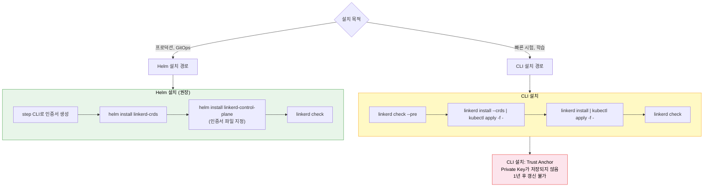
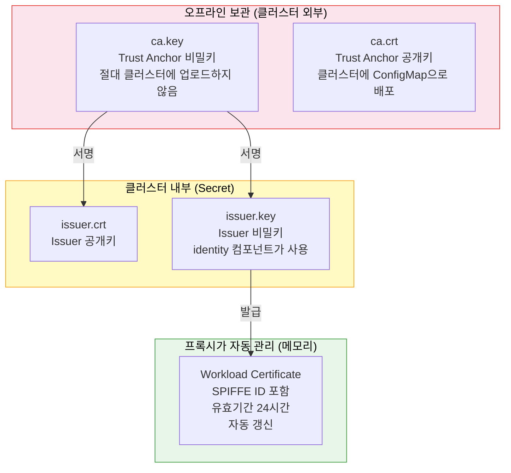
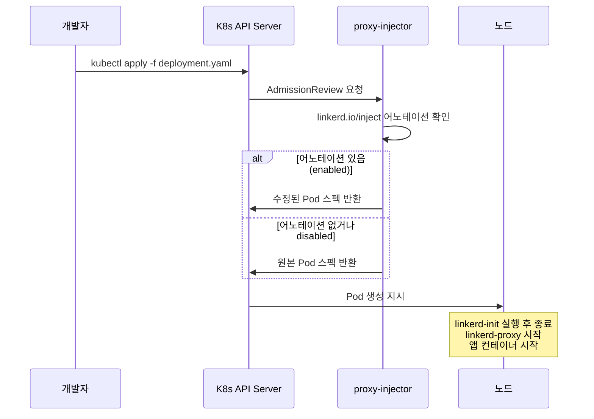
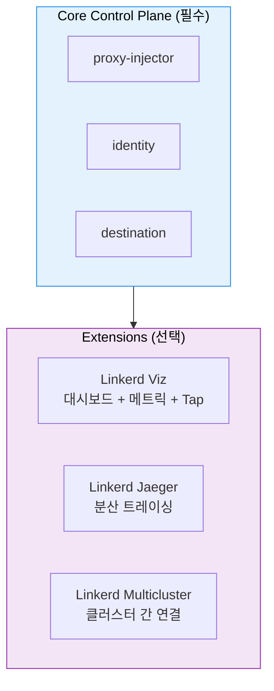

# Linkerd 설치

> Linkerd 설치는 두 단계로 나뉩니다:

1. 인증서 계획입니다. 기본 CLI 설치가 자동 생성하는 Trust Anchor의 Private Key는 어디에도 저장되지 않아 나중에 인증서를 갱신할 방법이 없습니다. 프로덕션에서는 반드시 `step` CLI로 인증서를 직접 생성한 뒤 Helm으로 설치해야 합니다.
2. 워크로드 주입입니다. Namespace 또는 Deployment에 `linkerd.io/inject: enabled` 어노테이션을 추가하면 Mutating Webhook이 나머지를 처리합니다.


## 학습 목표
> CLI vs Helm 설치 차이, Trust Anchor 생성, cert-manager 갱신, linkerd check 모드, Sidecar 주입, Extension까지 여섯 가지 목표를 다룹니다.


학습 목표는 여섯 가지입니다:

1. Linkerd 설치의 CLI 방식과 Helm 방식 차이를 인증서 관점에서 설명합니다.
2. Trust Anchor와 Issuer 인증서를 `step` CLI로 직접 생성합니다.
3. cert-manager를 이용한 인증서 자동 갱신 흐름을 이해합니다.
4. `linkerd check`의 세 가지 실행 모드(--pre, 기본, --proxy)를 구분해 사용합니다.
5. Sidecar 주입 시 init 컨테이너와 proxy 컨테이너가 각각 무슨 일을 하는지 설명합니다.
6. Viz·Jaeger·Multicluster Extension의 용도와 설치 방법을 익힙니다.


## 1. 설치 전 체크리스트
> Linkerd 2.x의 Kubernetes 버전 요구사항, CoreDNS 상태 확인, 인증서를 미리 계획해야 하는 이유를 설명합니다.


### 1.1 사전 요구사항

Linkerd 2.x는 Kubernetes 1.24 이상을 요구합니다. EndpointSlice API와 Server-Side Apply가 안정화된 버전부터 Linkerd가 의존하는 API가 갖춰지기 때문입니다. 클러스터 DNS가 올바르게 동작하는지 먼저 확인해야 합니다. Linkerd 컨트롤 플레인 컴포넌트들이 서로를 DNS로 찾기 때문에, CoreDNS가 정상 상태가 아니라면 설치 직후부터 문제가 발생합니다.

Linkerd는 CNCF Graduated 프로젝트입니다 (출처: cncf.io/projects/linkerd). 데이터 플레인 프록시인 linkerd2-proxy는 Rust로 작성된 마이크로프록시로, 메모리 안전성과 낮은 오버헤드를 목표로 설계되었습니다 (출처: github.com/linkerd/linkerd2-proxy). Envoy 기반 프록시와 달리 Linkerd 전용으로 제작되어 바이너리 크기와 메모리 사용량이 작습니다.

### 1.2 인증서를 미리 계획해야 하는 이유

많은 팀이 Linkerd를 빠르게 시험해보고 싶어 `linkerd install | kubectl apply -f -`로 시작합니다. 이 방법은 수분 안에 Linkerd가 동작하게 해주지만 숨겨진 함정이 있습니다.

자동 설치 시 Trust Anchor의 Private Key는 메모리에서 생성되고 사용된 뒤 어디에도 저장되지 않습니다. Issuer 인증서는 기본 1년 유효기간으로 설정됩니다. 1년 후 Issuer가 만료되면 새 Issuer를 Trust Anchor로 서명해야 하는데, Private Key가 없으니 새 Issuer를 만들 수 없습니다. 결국 Linkerd 전체를 재설치해야 하는 상황이 됩니다.

Trust Anchor의 Private Key는 아파트 마스터키와 같습니다. 마스터키 없이도 각 세대 열쇠(Issuer)로 일상적인 출입은 가능합니다. 그러나 세대 열쇠를 새로 만들려면 반드시 마스터키가 있어야 합니다.


## 2. 설치 방법 선택
> 빠른 시험용 CLI 설치와 프로덕션 권장 Helm 설치의 절차와 인증서 관리 차이를 비교합니다.




### 2.1 CLI 설치 (빠른 시작용)

```bash
# 1. 사전 점검
linkerd check --pre

# 2. CRD 먼저 설치 (Server, AuthorizationPolicy 등)
linkerd install --crds | kubectl apply -f -

# 3. 컨트롤 플레인 설치
linkerd install | kubectl apply -f -

# 4. 설치 완료 확인 — 모든 항목이 ✓ 이어야 한다
linkerd check
```

CLI 설치의 장점은 명확합니다. 명령 네 줄로 끝납니다. 데모, 로컬 개발 환경, PoC 단계에서는 충분합니다. 단, 앞서 설명한 인증서 문제 때문에 프로덕션에는 적합하지 않습니다.

### 2.2 Helm 설치 (프로덕션 권장)

Helm 설치의 핵심은 인증서를 설치 전에 직접 생성하는 점입니다.

```bash
# 1. step CLI 설치 (macOS)
brew install step

# 2. Trust Anchor(Root CA) 생성
step certificate create root.linkerd.cluster.local ca.crt ca.key \
  --profile root-ca \
  --no-password \
  --insecure

# 3. Issuer 인증서 생성
step certificate create identity.linkerd.cluster.local issuer.crt issuer.key \
  --profile intermediate-ca \
  --not-after 8760h \
  --no-password \
  --insecure \
  --ca ca.crt \
  --ca-key ca.key

# 4. Helm으로 설치
helm repo add linkerd https://helm.linkerd.io/stable
helm repo update

helm install linkerd-crds linkerd/linkerd-crds \
  -n linkerd --create-namespace

helm install linkerd-control-plane \
  -n linkerd \
  --set-file identityTrustAnchorsPEM=ca.crt \
  --set-file identity.issuer.tls.crtPEM=issuer.crt \
  --set-file identity.issuer.tls.keyPEM=issuer.key \
  linkerd/linkerd-control-plane

linkerd check
```

`ca.key`는 절대 클러스터에 저장하지 않고 오프라인 저장소에 보관합니다.


## 3. Trust Anchor 인증서 계층
> Trust Anchor·Issuer·Workload 인증서의 역할과 보관 위치, cert-manager를 이용한 Issuer 자동 갱신 설정을 다룹니다.




Trust Anchor는 최상위 인증서입니다. 유효기간을 10년 이상 길게 설정하고 Private Key는 오프라인에 보관합니다. Issuer 인증서는 identity 컨트롤러가 매일 수천 개의 Workload 인증서를 발급하는 데 사용합니다. 클러스터 Secret에 저장되므로 유효기간을 1년 정도로 설정하고 cert-manager로 자동 갱신하는 것이 표준 패턴입니다. Workload 인증서는 기본 24시간 유효기간으로 발급되고, 만료 전 프록시가 자동으로 갱신 요청을 보냅니다.

### 3.1 cert-manager로 Issuer 자동 갱신

```bash
# cert-manager 설치
helm install cert-manager jetstack/cert-manager \
  --namespace cert-manager --create-namespace \
  --set installCRDs=true

# Trust Anchor를 Secret으로 저장
kubectl create secret tls linkerd-trust-anchor \
  --cert=ca.crt \
  --key=ca.key \
  --namespace cert-manager
```

```yaml
# ClusterIssuer 생성
apiVersion: cert-manager.io/v1
kind: ClusterIssuer
metadata:
  name: linkerd-trust-anchor
spec:
  ca:
    secretName: linkerd-trust-anchor
---
# Certificate: Issuer 인증서 자동 갱신
apiVersion: cert-manager.io/v1
kind: Certificate
metadata:
  name: linkerd-identity-issuer
  namespace: linkerd
spec:
  secretName: linkerd-identity-issuer
  duration: 48h
  renewBefore: 25h
  issuerRef:
    name: linkerd-trust-anchor
    kind: ClusterIssuer
  commonName: identity.linkerd.cluster.local
  dnsNames:
  - identity.linkerd.cluster.local
  isCA: true
  privateKey:
    algorithm: ECDSA
  usages:
  - cert sign
  - crl sign
  - server auth
  - client auth
```

엄격한 보안이 필요하다면 Vault PKI나 AWS ACM 같은 외부 CA를 사용합니다.


## 4. Sidecar 주입 메커니즘
> Mutating Webhook 기반 주입 흐름과 linkerd-init, linkerd-proxy 두 컨테이너의 역할, 어노테이션 기반 주입 제어를 설명합니다.


### 4.1 주입 흐름



### 4.2 주입으로 추가되는 두 컨테이너

`linkerd-init` init 컨테이너는 앱과 프록시 컨테이너가 시작되기 전에 실행됩니다. 역할은 iptables 규칙을 설정하는 것으로, 인바운드 트래픽을 `:4143` 포트로, 아웃바운드 트래픽을 `:4140` 포트로 리다이렉트합니다. 이 두 포트가 linkerd2-proxy가 리슨하는 포트입니다.

`linkerd-proxy` 사이드카 컨테이너는 앱 컨테이너와 동일한 네트워크 네임스페이스에서 실행됩니다. 앱은 여전히 `localhost:8080`으로 바인딩하면 되고, 외부에서 들어오는 트래픽은 iptables가 자동으로 프록시를 거치게 합니다.

### 4.3 어노테이션 기반 주입 제어

```yaml
# 네임스페이스 전체에 주입 활성화
apiVersion: v1
kind: Namespace
metadata:
  name: production
  annotations:
    linkerd.io/inject: enabled
---
# 특정 Deployment만 제외
apiVersion: apps/v1
kind: Deployment
metadata:
  name: legacy-app
  namespace: production
spec:
  template:
    metadata:
      annotations:
        linkerd.io/inject: disabled
```

Pod 레벨 어노테이션이 네임스페이스 어노테이션보다 우선합니다. `kube-system` 네임스페이스의 구성요소들은 절대 메시에 추가하지 않습니다. CoreDNS와 kube-proxy는 Linkerd가 의존하는 기반 시스템이어서, 이들에 Sidecar를 주입하면 닭이 먼저냐 달걀이 먼저냐 같은 순환 의존성 문제가 생깁니다.


## 5. linkerd check: 상태 진단 도구
> 설치 전 점검(--pre), 설치 후 전체 점검, 데이터 플레인 점검(--proxy) 세 모드의 용도를 구분합니다.


`linkerd check`는 Linkerd를 운영하며 가장 자주 쓰는 명령입니다. 세 가지 모드로 동작합니다.

| 모드 | 명령 | 용도 |
|------|------|------|
| 설치 전 점검 | `linkerd check --pre` | Kubernetes 버전, 필요 권한 확인 (Linkerd 없이 실행 가능한 유일한 모드) |
| 설치 후 전체 점검 | `linkerd check` | 컨트롤 플레인 상태, 인증서 유효성, Extension |
| 데이터 플레인 점검 | `linkerd check --proxy` | 각 프록시 버전 및 인증서 유효성 |

오류 메시지에 일반적으로 힌트가 포함되어 있어 셀프 진단이 가능합니다. 지원 요청 시 `linkerd check` 결과를 첨부하는 것이 표준 관행입니다.


## 6. 업그레이드 전략
> 컨트롤 플레인 먼저 업그레이드 후 데이터 플레인을 롤링 업그레이드하는 n-1 호환성 기반 안전 절차를 다룹니다.


컨트롤 플레인 업그레이드 후 Data Plane의 프록시는 자동으로 새 버전이 되지 않습니다. 프록시 업그레이드는 Deployment를 재시작해야 합니다. Linkerd는 컨트롤 플레인과 데이터 플레인 사이에 n-1 버전 호환성을 보장하므로, "컨트롤 플레인 먼저 업그레이드, 데이터 플레인을 이후 롤링 업그레이드"하는 순서가 안전합니다.

```bash
# Helm 업그레이드
helm upgrade linkerd-control-plane \
  -n linkerd \
  --set-file identityTrustAnchorsPEM=ca.crt \
  --set-file identity.issuer.tls.crtPEM=issuer.crt \
  --set-file identity.issuer.tls.keyPEM=issuer.key \
  linkerd/linkerd-control-plane

linkerd check

# 데이터 플레인 프록시 업그레이드 (네임스페이스별 재시작)
kubectl rollout restart deployment -n my-namespace
linkerd check --proxy -n my-namespace
```


## 7. Extensions
> Linkerd Viz, Jaeger, Multicluster Extension의 용도와 설치 방법을 설명합니다.


Linkerd의 핵심 컨트롤 플레인은 최소한의 기능만 제공합니다. 추가 기능은 Extension으로 분리되어 있어 필요한 것만 설치할 수 있습니다.



### 7.1 Linkerd Viz

Viz는 서비스 메시의 상태를 시각적으로 확인하는 대시보드와, 실시간 요청 메타데이터를 조회하는 Tap 기능을 제공합니다. 내부에 Prometheus를 포함하는데, 기본 설치는 영구 볼륨이 없어 Pod 재시작 시 메트릭이 사라집니다. 프로덕션에서는 반드시 외부 Prometheus와 연동해야 합니다. 또 하나의 주의사항은 인증이 없다는 점입니다. Ingress로 외부에 노출할 경우 API Gateway나 OAuth proxy를 앞에 두어야 합니다.

```bash
linkerd viz install | kubectl apply -f -
linkerd viz dashboard &

# 실시간 트래픽 조회 (Tap)
linkerd viz tap deploy/web -n emojivoto
linkerd viz tap deploy/web -n emojivoto --path /api/vote
```

### 7.2 Linkerd Jaeger

Jaeger Extension은 Linkerd 프록시가 OpenTelemetry 형식의 span을 Jaeger 백엔드로 전송할 수 있게 합니다. 한 가지 중요한 전제가 있습니다. 애플리케이션이 먼저 분산 트레이싱을 구현하고 `b3` 헤더(또는 `traceparent`)를 전파해야 합니다. Linkerd가 자동으로 애플리케이션에 트레이싱 코드를 심어주지는 않습니다.

```bash
linkerd jaeger install | kubectl apply -f -
```

### 7.3 Linkerd Multicluster

```bash
linkerd multicluster install | kubectl apply -f -
linkerd multicluster link --cluster-name west | \
  kubectl apply -f - --context east
```


## 면접 대비
> Linkerd 설치 핵심 개념을 면접 Q&A 형태로 정리합니다.


Q1. CLI 설치와 Helm 설치의 가장 중요한 차이는?

인증서 관리 방식입니다. CLI 설치는 Trust Anchor의 Private Key를 자동 생성 후 어디에도 저장하지 않아 1년 후 재설치가 필요합니다. Helm 설치는 인증서를 명시적으로 제공하므로 Private Key를 안전하게 보관하고 갱신할 수 있습니다.

Q2. `linkerd check --pre`와 `linkerd check`의 차이는?

`--pre`는 Linkerd가 설치되지 않은 상태에서 실행할 수 있는 유일한 모드로 클러스터 사전 조건을 점검합니다. 기본 `linkerd check`는 Linkerd 설치 후 컨트롤 플레인 상태, 인증서 유효성, Extension 상태를 종합 점검합니다.

Q3. Linkerd Viz의 Prometheus를 프로덕션에서 그대로 사용하면 안 되는 이유는?

기본 설치되는 Prometheus는 영구 볼륨(PV)이 없습니다. Pod가 재시작되거나 노드가 교체되면 모든 메트릭 데이터가 사라집니다. 장애 발생 후 원인을 분석하려는 시점에 메트릭이 없는 상황이 됩니다. 프로덕션에서는 PV가 있는 외부 Prometheus를 구축하고 Linkerd 메트릭을 스크레이핑하도록 설정해야 합니다.
