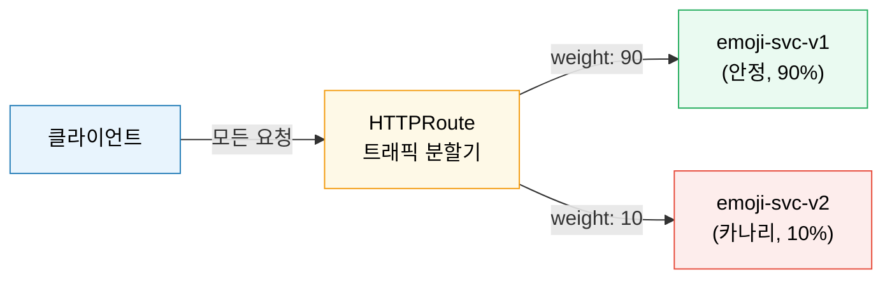

# Linkerd 트래픽 관리

> Linkerd의 트래픽 관리는 "단순함이 기본값이 되어야 한다"는 철학 위에 세워집니다. 복잡한 설정 없이도 지능형 로드밸런싱과 자동 재시도가 동작하고, Gateway API 표준인 HTTPRoute로 카나리 배포·타임아웃·재시도 예산을 선언적으로 제어할 수 있습니다.


## 학습 목표
> 단순함 철학, HTTPRoute 카나리, 재시도 예산, EWMA, Ingress 연동, Opaque 포트, ServiceProfile→HTTPRoute 전환까지 일곱 가지 목표를 다룹니다.


학습 목표는 일곱 가지입니다:

1. Linkerd의 "단순함 우선" 철학이 Istio와 어떻게 다른지 설명합니다.
2. HTTPRoute로 카나리 배포 YAML을 작성합니다.
3. 재시도 예산 개념과 기본값 20%의 의미를 설명합니다.
4. EWMA 알고리즘이 라운드로빈보다 유리한 이유를 설명합니다.
5. NGINX Ingress + Linkerd 조합 시 필요한 설정을 나열합니다.
6. Opaque 포트가 필요한 상황과 제약을 설명합니다.
7. Service Profile이 HTTPRoute로 대체되는 맥락을 이해합니다.


## 1. Linkerd의 철학: 단순함이 기본값입니다
> 올바른 기본값으로 mTLS·로드밸런싱·메트릭이 즉시 동작하고, 고급 기능은 Gateway API 표준으로 추가하는 Linkerd의 설계 철학을 설명합니다.


Istio를 처음 접하면 VirtualService, DestinationRule, EnvoyFilter 등 수십 개의 CRD에 압도됩니다. Linkerd는 다른 방향을 선택했습니다. "올바른 기본값이 존재한다면, 사용자는 기본값을 건드릴 이유가 없어야 한다"는 것입니다.

이 철학은 세 가지 형태로 드러납니다:

1. 사이드카 주입만 하면 mTLS·로드밸런싱·메트릭이 즉시 동작합니다.
2. 고급 기능은 표준 Kubernetes API인 Gateway API HTTPRoute로 추가합니다. Linkerd 전용 CRD를 최소화하겠다는 의지입니다.
3. 데이터 플레인이 Rust로 작성된 경량 프록시(linkerd2-proxy)여서 디버깅이 쉽습니다.

Istio가 "모든 기능을 갖춘 항공기 조종석"이라면 Linkerd는 "안전 장치가 충분히 내장된 자동차"입니다. 일반 주행은 자동차가 훨씬 편하고, 예외적인 특수 임무에서만 항공기가 필요합니다.

이 철학이 트래픽 관리에서 가장 잘 드러나는 영역이 로드밸런싱입니다. 사용자가 설정하지 않아도 Linkerd는 EWMA 알고리즘으로 지연 시간 기반 스마트 로드밸런싱을 수행합니다.

Linkerd는 CNCF Graduated 프로젝트이며, linkerd2-proxy는 Rust로 작성된 마이크로프록시입니다 (github.com/linkerd/linkerd2-proxy). Linkerd 2.14부터는 GAMMA(Gateway API for Mesh Architecture) 표준도 지원해 east-west 메시 트래픽에도 Gateway API HTTPRoute를 사용할 수 있습니다 (gateway-api.sigs.k8s.io/mesh).


## 2. HTTPRoute 기반 트래픽 관리
> Gateway API HTTPRoute로 카나리 배포, 재시도 예산, 타임아웃을 선언적으로 제어하는 방법을 다룹니다.


### 2.1 Gateway API와 Linkerd

Linkerd 2.12부터 Kubernetes SIG-Network가 표준화한 Gateway API를 지원합니다. Linkerd가 Gateway API를 채택한 이유는 특정 메시 구현에 종속되지 않는 이식 가능한 설정을 원하기 때문입니다.

HTTPRoute는 `parentRefs`로 어떤 서비스에 적용할지 지정하고, `rules`로 매칭 조건과 백엔드를 정의합니다. Linkerd는 이 HTTPRoute를 읽어서 트래픽 분할, 헤더 기반 라우팅, 타임아웃, 재시도를 적용합니다.

Gateway API v1.0은 2023년 10월 31일 GA가 되었고(kubernetes.io/blog/2023/10/31/gateway-api-ga), GAMMA(메시용 Gateway API)는 Standard Channel v1.1.0부터 GA 상태입니다 (gateway-api.sigs.k8s.io/mesh).

### 2.2 트래픽 분할: 카나리 배포

카나리 배포는 새 버전에 일부 트래픽만 먼저 보내어 위험을 줄이는 기법입니다. 90%는 안정 버전(v1)에, 10%는 새 버전(v2)에 보내다가 문제가 없으면 점진적으로 비율을 높입니다.



```yaml
apiVersion: gateway.networking.k8s.io/v1beta1
kind: HTTPRoute
metadata:
  name: emoji-canary
  namespace: emojivoto
spec:
  parentRefs:
    - name: emoji-svc
      kind: Service
      group: ""
      port: 8080
  rules:
    - backendRefs:
        - name: emoji-svc-v1
          port: 8080
          weight: 90
        - name: emoji-svc-v2
          port: 8080
          weight: 10
```

weight 합이 100일 필요는 없습니다. Linkerd는 비율로 계산하므로 `weight: 9`와 `weight: 1`도 동일한 90/10 분할을 의미합니다.

### 2.3 재시도와 재시도 예산

네트워크 요청은 일시적 오류로 실패할 수 있습니다. 그러나 무분별한 재시도는 시스템을 더 악화시킵니다. 이미 과부하 상태인 서비스에 재시도가 쏟아지면 연쇄 장애로 이어집니다.

Linkerd는 **재시도 예산(Retry Budget)**으로 이 문제를 해결합니다. "전체 요청 중 몇 퍼센트까지 재시도를 허용할 것인가"를 제한하는 개념이며, 기본값은 **20%**입니다. 초당 100개의 요청이 들어오면 최대 20개의 재시도만 허용됩니다. 재시도가 예산을 소진하면 Linkerd는 즉시 실패를 반환합니다.

재시도는 멱등(idempotent) 요청에만 안전합니다. GET·HEAD는 멱등이지만 POST는 중복 처리가 발생할 수 있습니다. Linkerd는 기본적으로 GET/HEAD에만 자동 재시도를 적용하고, POST 재시도는 명시적으로 `isRetryable: true`를 설정해야 합니다.

### 2.4 타임아웃

타임아웃 설정 없이 재시도만 활성화하면 느린 백엔드가 전체 요청 처리를 지연시킬 수 있습니다. HTTPRoute에서 요청 타임아웃과 백엔드 응답 타임아웃을 각각 설정할 수 있습니다.

```yaml
rules:
  - backendRefs:
      - name: backend-svc
        port: 8080
    timeouts:
      request: 10s
      backendRequest: 3s
```

`request`는 클라이언트가 기다리는 전체 시간이고, `backendRequest`는 개별 백엔드 시도당 시간입니다. 재시도가 있다면 `backendRequest` × (재시도 횟수 + 1) ≤ `request` 관계를 유지해야 합니다.


## 3. EWMA 로드밸런싱
> P2C와 결합한 EWMA 알고리즘의 동작 원리와 사용자 설정 없이 자동으로 지연 인식 로드밸런싱이 활성화되는 방식을 설명합니다.


### 3.1 알고리즘 동작 원리

Linkerd는 기본 로드밸런싱 알고리즘으로 EWMA(Exponentially Weighted Moving Average)를 P2C(Power of Two Choices)와 함께 사용합니다. EWMA의 핵심 가정은 "최근 지연시간이 미래 지연시간을 예측한다"는 것입니다.

EWMA가 유리한 상황은 특정 Pod가 GC pause, 리소스 경합, 쿼리 슬로우다운으로 일시적으로 느려질 때입니다. EWMA는 이 Pod의 지연시간이 높다는 것을 빠르게 반영해 다른 건강한 Pod에 더 많은 요청을 보냅니다. Round Robin은 이 상황을 인식하지 못하고 느린 Pod에 계속 요청을 보냅니다.

반면 EWMA가 혼란을 줄 수 있는 경우도 있습니다. 빠른 캐시 히트 요청과 느린 DB 쿼리 요청이 혼재하면, DB 쿼리를 처리한 Pod의 EWMA 지연시간이 높아져 이후 요청이 다른 Pod로 쏠립니다. P2C는 무작위로 두 엔드포인트를 선택하고 그 중 EWMA 기반으로 더 나은 것을 선택해 계산 비용을 낮춥니다.

### 3.2 사용자 설정 없이 동작

EWMA 로드밸런싱은 별도 설정 없이 사이드카 주입만으로 활성화됩니다. `linkerd viz top` 명령으로 엔드포인트별 요청 분포를 실시간으로 관찰하고, 특정 Pod에 요청이 집중되거나 배제되는 패턴이 보이면 해당 Pod의 지연시간 히스토그램을 확인하면 됩니다.


## 4. Ingress 연동
> NGINX Ingress와 Linkerd 조합 시 필요한 사이드카 주입과 service-upstream 어노테이션 설정을 다룹니다.


### 4.1 NGINX Ingress + Linkerd

외부 트래픽은 Ingress Controller를 통해 메시로 진입합니다. NGINX Ingress와 Linkerd를 조합할 때 필요한 설정이 두 가지 있습니다:

1. Ingress Controller Pod 자체에 Linkerd 사이드카를 주입해야 합니다. 그러지 않으면 Ingress → 백엔드 트래픽에 mTLS가 적용되지 않습니다.
2. `nginx.ingress.kubernetes.io/service-upstream: "true"` 어노테이션을 추가해야 합니다. 이 설정이 없으면 NGINX가 Pod IP로 직접 요청을 보내고, Linkerd가 트래픽을 인식하지 못할 수 있습니다.

```yaml
metadata:
  annotations:
    nginx.ingress.kubernetes.io/service-upstream: "true"
```

### 4.2 어떤 Ingress Controller와도 조합 가능

Linkerd는 Ingress Controller에 종속되지 않습니다. NGINX, Traefik, Envoy-based Gateway 등 어떤 구현체와도 조합할 수 있습니다. 핵심은 Ingress Controller Pod에 사이드카를 주입하는 것입니다.


## 5. Opaque 포트
> 비-HTTP 프로토콜에 Opaque 모드를 적용하는 방법과 mTLS 보호와 L7 관측성 사이의 트레이드오프를 설명합니다.


### 5.1 Opaque 모드가 필요한 상황

Linkerd는 HTTP/gRPC 트래픽을 자동으로 감지해 L7 기능을 제공합니다. 그러나 MySQL, Redis, Kafka 같은 비-HTTP 프로토콜은 자동 감지가 실패하거나 프로토콜을 HTTP로 잘못 해석할 수 있습니다. 이때 Opaque 포트를 사용합니다.

```yaml
# Pod 어노테이션으로 Opaque 포트 지정
annotations:
  config.linkerd.io/opaque-ports: "3306,6379"
```

Opaque 포트로 지정하면 Linkerd는 해당 트래픽을 TCP 레벨에서 불투명하게 처리하며 mTLS로 보호합니다. 단, L7 메트릭(요청 레이턴시, 상태 코드, 경로별 통계)은 수집할 수 없습니다. TCP 레벨 메트릭(바이트 수, 연결 수)만 이용 가능합니다.

### 5.2 트레이드오프 관리

Opaque 모드는 mTLS 보호와 L7 관측성 사이의 트레이드오프입니다. 데이터베이스처럼 SQL 쿼리 수준 분석이 필요 없는 서비스는 Opaque 모드로 충분합니다. 반면 서비스 간 API 트래픽처럼 요청 레이턴시와 오류율이 중요한 경우는 HTTP 감지를 유지해야 합니다.


## 6. Service Profile에서 HTTPRoute로
> Linkerd 전통 CRD인 ServiceProfile을 Gateway API HTTPRoute로 대체하는 전환 맥락과 점진적 마이그레이션 전략을 다룹니다.


Service Profile은 Linkerd 전통적인 트래픽 정책 CRD였습니다. Linkerd는 이를 Kubernetes 표준인 Gateway API HTTPRoute로 대체하는 방향으로 나아가고 있습니다. 두 API가 동시에 지원되는 전환 기간에는 HTTPRoute가 Service Profile보다 우선순위를 갖습니다.

HTTPRoute는 Service Profile보다 표현력이 풍부합니다. 경로 매칭, 헤더 매칭, 메서드 매칭을 조합해 세밀한 라우팅 규칙을 정의할 수 있습니다. 또한 클라이언트 쪽 네임스페이스에서도 서버 서비스에 대한 정책을 설정할 수 있어, 서비스 소비자가 자신이 필요한 트래픽 정책을 관리하는 모델이 가능합니다.

마이그레이션은 서비스 단위로 점진적으로 진행하는 것이 안전합니다. 먼저 HTTPRoute를 새로운 서비스에만 적용하고, 기존 Service Profile이 있는 서비스는 안정성이 확인될 때까지 유지합니다.


## 면접 대비

> Linkerd 트래픽 관리에서 가장 자주 묻는 네 가지 질문을 답변 형식으로 정리합니다.

**Linkerd가 "단순함이 기본값"이라고 말할 수 있는 근거는?**

별도 설정 없이도 자동 mTLS·자동 재시도 예산·지능형 로드밸런싱(EWMA)이 동작한다는 점입니다. Istio는 같은 기능을 얻으려면 `PeerAuthentication`·`DestinationRule`·`VirtualService`를 명시적으로 작성해야 하지만, Linkerd는 메시에 합류한 순간 안전한 기본값이 켜집니다. 고급 기능 표면적이 작은 대신 도입 첫날 실수할 여지가 줄어든다는 트레이드오프입니다.

**재시도 예산 20%가 단순한 `attempts=3`보다 안전한 이유는?**

`attempts=3`은 장애 시 트래픽을 최대 3배로 부풀리는 재시도 폭풍을 그대로 허용합니다. 재시도 예산은 "전체 요청의 20%만 재시도 가능"이라는 비율 제한이라 다운스트림이 정상 트래픽을 처리할 여유를 구조적으로 보장합니다. 장애가 길어져도 백엔드가 재시도 자체에 무너지지 않게 합니다.

**EWMA 로드밸런싱이 라운드로빈보다 유리한 시나리오는?**

백엔드 인스턴스 간 응답 시간 편차가 큰 환경입니다. 라운드로빈은 느린 인스턴스에도 동일한 비율로 요청을 보내 큐가 쌓이고 p99 레이턴시가 악화됩니다. EWMA는 최근 응답 시간을 지수 가중 이동평균으로 추적해 빠른 인스턴스에 더 많은 요청을 보냅니다. GC 일시정지·콜드 스타트·이종 노드 같이 응답 시간이 흔들리는 환경에서 효과가 분명합니다.

**ServiceProfile에서 HTTPRoute로 넘어가야 하는 이유는?**

Gateway API HTTPRoute가 Kubernetes 표준이라 메시를 바꿔도 같은 매니페스트가 동작하고, 매칭 규칙(경로·헤더·메서드)의 표현력도 더 넓습니다. 클라이언트 측 네임스페이스에서 서버 정책을 설정할 수 있어 서비스 소비자가 자기 호출 정책을 소유하는 모델이 가능합니다. 점진적 전환에서는 신규 서비스에만 HTTPRoute를 적용하고 기존 ServiceProfile은 안정화 확인 후 교체합니다.
