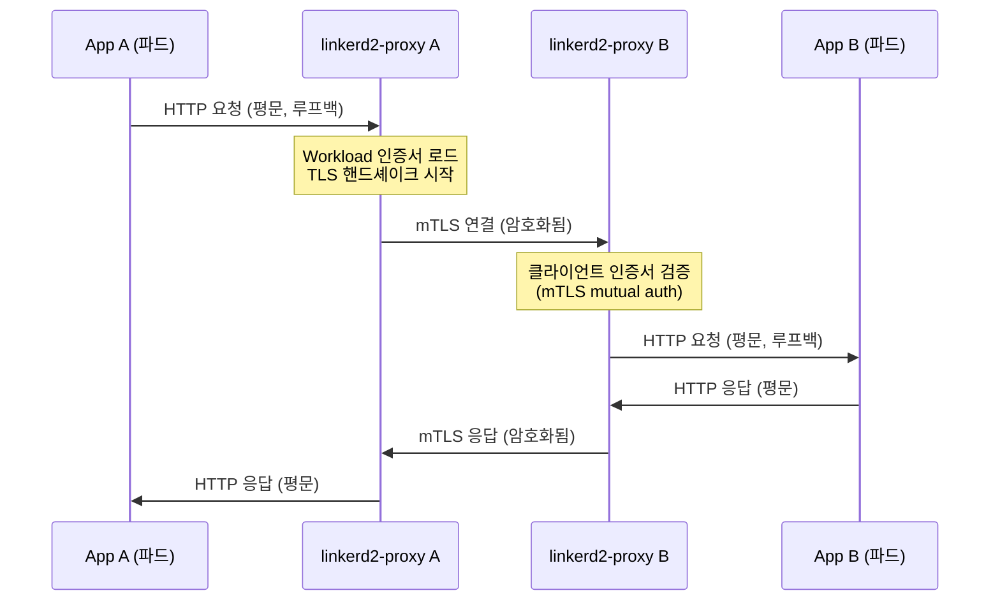

# Linkerd 보안과 정책

> Linkerd의 보안은 "설정하지 않아도 안전해야 한다"는 원칙에서 시작한다. 사이드카를 주입하는 순간 자동 mTLS가 활성화되어 모든 메시 내 통신이 암호화된다. 여기에 Server와 AuthorizationPolicy를 추가하면 "누가 누구와 통신할 수 있는가"를 세밀하게 제어할 수 있다.


## 학습 목표
> 자동 mTLS 원리, mTLS 상태 확인, Server/AuthorizationPolicy 구성, 기본 정책 모드, 후양자 암호화, 외부 워크로드 통합까지 일곱 가지 목표를 다룬다.


학습 목표는 일곱 가지다:

1. Linkerd의 자동 mTLS가 설정 없이 동작하는 원리를 설명한다.
2. `linkerd viz edges`로 mTLS 상태를 확인한다.
3. Server 리소스를 정의하고 AuthorizationPolicy로 접근 제어를 구성한다.
4. 다섯 가지 기본 정책 모드와 적절한 사용 시점을 선택한다.
5. MeshTLSAuthentication과 NetworkAuthentication의 차이를 설명한다.
6. "Harvest now, decrypt later" 공격 시나리오와 ML-KEM-768의 역할을 설명한다.
7. 외부 워크로드를 메시에 편입하는 방법을 이해한다.


## 1. 자동 mTLS: 설정 없이 시작되는 암호화
> 사이드카 주입만으로 모든 메시 내 트래픽에 mTLS가 자동 적용되는 원리와 상태 확인 방법을 설명한다.


### 1.1 왜 자동 mTLS인가

마이크로서비스 보안의 현실은 가혹하다. 개발팀마다 TLS를 직접 구성하라고 하면 일부는 자체 서명 인증서를 사용하고, 일부는 인증서 갱신을 잊어 서비스가 중단되고, 일부는 그냥 평문으로 통신한다. 보안 수준이 가장 약한 서비스가 전체 시스템의 취약점이 된다.

Linkerd는 이 문제를 인프라 계층에서 해결한다. 사이드카(linkerd2-proxy)를 주입하는 순간, 해당 파드의 모든 인바운드·아웃바운드 트래픽에 자동으로 mTLS가 적용된다. 애플리케이션 코드는 변경하지 않아도 된다.

자동 mTLS는 건물의 중앙 공조 시스템과 같다. 각 방에 별도 에어컨을 설치하는 대신, 건물 전체에 균일한 온도를 제공한다.

### 1.2 자동 mTLS 동작 원리



핵심은 애플리케이션이 "자신이 mTLS를 사용한다"는 사실을 전혀 모른다는 점이다. 앱은 로컬 루프백(127.0.0.1)을 통해 프록시와 평문으로 통신하고, 프록시가 외부로 나가는 순간 mTLS 암호화를 적용한다.

### 1.3 mTLS 상태 확인

`linkerd viz edges` 명령으로 메시 내 연결의 mTLS 상태를 확인할 수 있다.

```bash
linkerd viz edges -n emojivoto
```

`✔` 표시는 mTLS가 적용된 연결이고, 비메시 워크로드에서 오는 연결은 `✘`로 표시된다. 이 명령은 보안 감사와 문제 진단에 모두 유용하다.


## 2. Server 리소스: 정책의 시작점
> Server 리소스가 특정 포트를 정책으로 보호하는 방식과 생성 즉시 기본 차단이 시작되는 운영 주의사항을 다룬다.


### 2.1 Server란 무엇인가

mTLS는 암호화를 보장하지만, 접근 제어는 별개다. "결제 서비스가 암호화된 연결로 데이터베이스에 접근한다"는 것은 좋다. 하지만 "어떤 서비스든 암호화된 연결로 데이터베이스에 접근할 수 있다"는 보안상 문제다.

Server는 "이 파드의 이 포트를 정책으로 보호한다"고 선언하는 리소스다. Server를 생성한 순간부터 해당 포트는 명시적인 AuthorizationPolicy가 없는 모든 트래픽을 차단한다.

```yaml
apiVersion: policy.linkerd.io/v1beta3
kind: Server
metadata:
  name: backend-http
  namespace: myapp
spec:
  podSelector:
    matchLabels:
      app: backend
  port: 8080
  proxyProtocol: HTTP/1.1
```

`proxyProtocol`은 Linkerd가 해당 포트의 트래픽을 어떻게 처리할지 결정한다. `HTTP/1.1`, `HTTP/2`, `gRPC`는 L7 기능을 사용할 수 있고, `opaque`는 TCP 수준만 지원한다.

### 2.2 Server 생성 후 즉시 차단된다

이것이 가장 중요한 운영 주의사항이다. Server를 만들면 AuthorizationPolicy 없이는 아무도 접근할 수 없다. 프로덕션에서 Server를 먼저 만들고 AuthorizationPolicy를 나중에 만들면 서비스 중단이 발생한다.

안전한 순서는 다음과 같다. 먼저 AuthorizationPolicy를 작성하고 검토한다. 그런 다음 Server와 AuthorizationPolicy를 동시에 또는 역순(AuthorizationPolicy 먼저)으로 적용한다.


## 3. AuthorizationPolicy: 세밀한 접근 제어
> MeshTLSAuthentication과 NetworkAuthentication을 연결해 ServiceAccount 기반 또는 IP 기반 접근 제어를 구성하는 방법을 설명한다.


### 3.1 AuthorizationPolicy 구조

AuthorizationPolicy는 Server(또는 HTTPRoute)와 인증 조건을 연결해 최종 접근 허용 규칙을 만든다. 인증 조건으로 두 가지가 있다.

**MeshTLSAuthentication**은 ServiceAccount 기반 인증이다. "결제 서비스의 서비스 어카운트만 허용"처럼 Kubernetes RBAC과 유사한 방식으로 메시 내 워크로드를 식별한다.

**NetworkAuthentication**은 IP/CIDR 기반 인증이다. 메시에 속하지 않는 외부 시스템(헬스 체크 프로브, 레거시 VM)에서 오는 트래픽을 IP 주소 범위로 허용할 때 사용한다.

```yaml
# MeshTLSAuthentication: ServiceAccount 기반
apiVersion: policy.linkerd.io/v1alpha1
kind: MeshTLSAuthentication
metadata:
  name: payment-authn
  namespace: myapp
spec:
  identities:
    - "payment-svc.payment.serviceaccount.identity.linkerd.cluster.local"
---
apiVersion: policy.linkerd.io/v1alpha1
kind: AuthorizationPolicy
metadata:
  name: backend-allow-payment
  namespace: myapp
spec:
  targetRef:
    group: policy.linkerd.io
    kind: Server
    name: backend-http
  requiredAuthenticationRefs:
    - name: payment-authn
      kind: MeshTLSAuthentication
      group: policy.linkerd.io
```

### 3.2 기본 정책 모드

Server가 없는 포트는 네임스페이스 또는 클러스터 수준의 기본 정책을 따른다. 다섯 가지 모드가 있다.

| 모드 | 설명 | 적합한 상황 |
|------|------|------------|
| `all-unauthenticated` | 모든 트래픽 허용 | 마이그레이션 초기 |
| `all-authenticated` | mTLS 인증된 트래픽만 허용 | 메시 내부 서비스 |
| `cluster-unauthenticated` | 클러스터 내 모든 트래픽 허용 | 헬스 체크 포함 필요 |
| `cluster-authenticated` | 클러스터 내 mTLS 트래픽만 허용 | 일반 프로덕션 |
| `deny` | 모든 트래픽 차단 | 고보안 환경 |

### 3.3 default-deny 마이그레이션 전략

기존 허용 중심 네트워크에서 default-deny로 전환할 때 가장 흔한 실수는 "차단 전에 관찰"을 생략하는 것이다. 안전한 마이그레이션은 4단계로 진행한다.

1단계는 현재 통신 패턴 매핑이다. `linkerd viz tap` 명령과 메트릭의 소스/목적지 레이블을 분석해 서비스 간 의존 관계를 파악한다. 2단계는 Server 리소스를 audit 모드로 배포하고 정책 위반 메트릭을 모니터링한다. 3단계는 관찰된 트래픽 패턴을 기반으로 AuthorizationPolicy를 작성한다. 4단계는 Server를 deny 모드로 전환하고 차단된 트래픽이 없는지 확인한다.

헬스 체크 프로브도 정책의 적용을 받는다는 점을 놓치면 안 된다. kubelet의 liveness/readiness probe는 mTLS를 수행하지 않으므로, 헬스 체크 포트에 대해 unauthenticated 출처 접근을 별도로 허용해야 한다.


## 4. 후양자 암호화(Post-Quantum Cryptography)
> Harvest Now Decrypt Later 위협 모델과 Linkerd 2.19의 ML-KEM-768 하이브리드 방식 도입 배경, 성능 오버헤드를 다룬다.


### 4.1 위협 모델: Harvest Now, Decrypt Later

양자 컴퓨터가 현재의 RSA와 타원곡선(ECC) 암호화를 파괴할 수 있다는 위협이 현실화되고 있다. "Harvest Now, Decrypt Later" 공격은 공격자가 현재 암호화된 트래픽을 저장해뒀다가 미래의 양자 컴퓨터로 복호화하는 시나리오다. 기밀성이 중요한 트래픽이라면 지금 저장된 데이터가 미래에 복호화될 수 있다.

### 4.2 ML-KEM-768의 역할

NIST가 2024년에 표준화한 ML-KEM(Kyber의 후속)은 양자 컴퓨터에 안전한 키 캡슐화 메커니즘이다. Linkerd 2.19부터 업계 최초로 서비스 메시에 후양자 암호화를 도입했다. linkerd2-proxy는 TLS 1.3 기반으로 X25519(ECDH)를 사용하는데, ML-KEM과 하이브리드로 결합하면 기존 보안과 후양자 보안을 동시에 제공한다.

성능 오버헤드는 주로 핸드셰이크 시 인증서 크기 증가에서 온다. 장기 연결(gRPC)은 연결 수립 시 한 번만 핸드셰이크가 발생하므로 오버헤드가 희석되지만, 짧은 HTTP 요청이 많은 REST API는 오버헤드가 더 크게 느껴질 수 있다.

현재 대부분의 조직에서 우선순위는 후양자 전환보다 기본 mTLS의 올바른 구성과 신뢰 앵커 관리다. 지금 할 수 있는 준비는 인증서 유효 기간을 짧게 유지하고 자동 갱신을 구성하는 것이다.


## 5. 외부 워크로드(External Workload) 통합
> Linkerd 2.14부터 지원하는 ExternalWorkload 리소스로 클러스터 외부 VM을 메시에 편입하는 방법을 설명한다.


Linkerd 2.14부터 클러스터 외부의 VM이나 베어메탈 서비스를 메시에 포함시키는 ExternalWorkload 리소스가 추가됐다. 하이브리드 환경에서 일관된 mTLS와 정책을 적용할 수 있게 한다.

클러스터 내부 워크로드는 Kubernetes 서비스 어카운트 토큰을 기반으로 인증서를 발급받는다. 외부 워크로드는 이 메커니즘을 직접 사용할 수 없어, 별도 부트스트랩 인증이 필요하다. 네트워크 측면에서 외부 워크로드가 Linkerd identity 서버에 접근하려면 VPN이나 AWS PrivateLink 같은 프라이빗 연결이 필요하다.

외부 워크로드 통합은 소수 서비스부터 파일럿으로 시작해 인증서 발급, 갱신, 정책 적용이 올바르게 작동하는지 충분히 검증한 후 확장하는 것이 안전하다.


## 6. Zero Trust와 네트워크 세분화의 관계
> Linkerd mTLS·AuthorizationPolicy와 NetworkPolicy가 상호 대체가 아닌 보완 관계임을 설명하며 방어 깊이 구현을 다룬다.


"Zero trust를 구현하면 방화벽과 네트워크 세분화가 필요 없다"는 주장은 위협 모델을 단순화한 것이다. 두 접근법은 상호 대체가 아닌 보완 관계다.

Linkerd의 mTLS와 AuthorizationPolicy는 신원(identity) 기반 접근 제어를 제공한다. 그러나 애플리케이션 취약점을 통해 컨테이너 내에서 코드가 실행된다면, 그 컨테이너는 정당한 신원을 가지고 있으므로 정책을 우회할 수 있다. 네트워크 세분화는 이런 경우 피해 범위를 제한한다.

실무에서는 두 레이어를 함께 사용한다. Kubernetes NetworkPolicy로 네임스페이스 간 네트워크 이동을 제한하고, Linkerd AuthorizationPolicy로 서비스 수준 접근 제어를 추가한다. 이 두 계층이 함께 작동할 때 방어 깊이(defense in depth)가 실현된다.


## 면접 대비

> Linkerd 보안 모델을 설명할 때 자주 받는 네 가지 질문을 답변 형식으로 정리한다.

**Linkerd가 "자동 mTLS"라고 말할 수 있는 근거는 무엇인가?**

proxy-injector가 사이드카를 주입하는 시점에 identity 컴포넌트로부터 SPIFFE ID가 담긴 24시간 짜리 인증서를 자동 발급받고, 메시에 합류한 워크로드 간 트래픽은 별도 CRD 없이 mTLS가 적용된다는 점이다. Istio는 `PeerAuthentication`으로 STRICT 모드를 명시해야 하지만, Linkerd는 기본 동작이 mTLS다.

**Server·AuthorizationPolicy·MeshTLSAuthentication·NetworkAuthentication이 분리된 이유는?**

권한 정책의 책임을 좁고 명확하게 만들기 위해서다. Server는 "어떤 포트의 트래픽을 정책 대상으로 삼을지", MeshTLSAuthentication은 "어떤 SPIFFE 신원을 인증 주체로 받을지", NetworkAuthentication은 "어떤 IP 대역까지 허용할지"를 각각 표현한다. AuthorizationPolicy는 이들을 조합해 최종 허용 규칙을 만든다. 한 리소스에 모두 묻으면 정책 검토와 권한 위임이 어려워진다.

**왜 모든 워크로드 인증서를 24시간 수명으로 두는가?**

폐기(CRL/OCSP) 인프라를 운영하지 않기 위해서다. 침해된 인증서도 하루 안에 자연 만료되고, identity 컴포넌트가 만료 전 자동 갱신한다. 운영 부담을 늘리지 않으면서 위험 노출 시간을 좁히는 트레이드오프다.

**mTLS + AuthorizationPolicy만으로 NetworkPolicy를 대체할 수 있는가?**

아니다. 두 계층은 위협 모델이 다르다. mTLS·AuthorizationPolicy는 신원 기반이므로 정당한 신원을 탈취한 공격에는 그대로 노출된다. NetworkPolicy는 네트워크 이동 경로 자체를 막아 신원 탈취 후 측면 이동을 한정한다. 방어 깊이 관점에서 네임스페이스·노드 경계는 NetworkPolicy로, 서비스 호출 쌍은 AuthorizationPolicy로 이중화한다.
