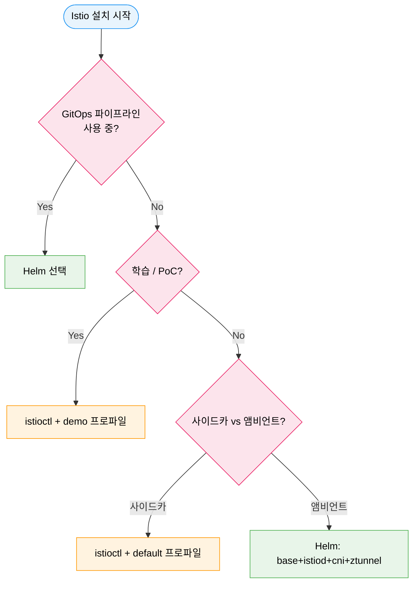

# Istio 설치

> Istio 파트를 시작할 때는 내부 구조보다 먼저 "어떻게 띄우는가"를 잡는 편이 이해가 빠릅니다. `istioctl`과 Helm 중 무엇을 선택할지, 사이드카 모드와 앰비언트 모드 설치가 어떻게 갈리는지, 리비전 기반 업그레이드를 어떤 순서로 적용하는지를 먼저 정리하면 뒤 문서의 아키텍처와 트래픽 정책이 훨씬 덜 추상적으로 읽힙니다.


## 학습 목표

> istioctl vs Helm 선택 기준, 설치 프로파일 차이, 앰비언트 모드 설치, 사이드카 인젝션, 리비전 기반 카나리 업그레이드, 진단 도구까지 일곱 가지 목표를 다룹니다.

학습 목표는 일곱 가지입니다:

1. istioctl, Helm 설치 방법의 차이와 각 방법이 적합한 상황을 설명합니다.
2. 설치 프로파일(minimal / default / demo / ambient)의 구성 요소 차이를 말합니다.
3. 앰비언트 모드 설치 절차와 네임스페이스 등록 방법을 실행합니다.
4. Mutating Webhook 기반 사이드카 인젝션 흐름을 설명합니다.
5. 리비전 기반 카나리 업그레이드로 제어 플레인을 무중단 교체하는 절차를 이해합니다.
6. `istioctl analyze`로 설정 오류를 진단합니다.
7. 게이트웨이 배포 모델의 트레이드오프를 비교합니다.


## 1. 설치 방법 비교

> istioctl은 빠른 시작에, Helm은 GitOps 기반 프로덕션에 적합하며 IstioOperator의 in-cluster 컨트롤러는 1.23 deprecated·1.24 제거되어 새 배포에 사용하면 안 됩니다(설정 형식은 `istioctl install -f`로 유지).

Istio를 클러스터에 올리는 방법은 크게 두 가지입니다. 어떤 방법을 선택하느냐는 팀의 운영 성숙도, GitOps 파이프라인 유무, 시작 속도에 따라 달라집니다.

### 1.1 istioctl

`istioctl`은 Istio 공식 CLI 도구로, 가장 빠르게 클러스터에 Istio를 올릴 수 있습니다. 단일 명령으로 프로파일 기반 설치가 가능하고, `istioctl analyze` 같은 진단 도구도 함께 제공됩니다.

먼저 `istioctl` 바이너리를 로컬에 설치합니다. 공식 설치 스크립트는 GitHub 릴리스에서 현재 OS/아키텍처에 맞는 아카이브를 내려받아 `istio-<version>/` 디렉토리에 풀어 줍니다.

```bash
# 최신 안정 버전 다운로드 (원하는 버전을 지정하려면 ISTIO_VERSION=1.24.0 같이 지정)
curl -L https://istio.io/downloadIstio | sh -

# 다운로드된 디렉토리로 이동
cd istio-*/

# istioctl을 PATH에 추가 (현재 셸 기준)
export PATH="$PWD/bin:$PATH"

# 영구 적용: ~/.zshrc 또는 ~/.bashrc에 같은 줄 추가
# echo 'export PATH="$HOME/istio-1.24.0/bin:$PATH"' >> ~/.zshrc

# 설치 확인
istioctl version --remote=false

# (선택) 클러스터가 Istio 설치 요구사항을 만족하는지 사전 검증
istioctl x precheck
```

macOS에서 Homebrew를 쓰는 경우 `brew install istioctl`로 대체할 수 있고, 리눅스에서는 `/usr/local/bin`에 심볼릭 링크를 걸어 두면 셸 초기화 없이 바로 쓸 수 있습니다.

바이너리 준비가 끝나면 클러스터에 Istio를 설치합니다.

```bash
# PoC/학습용: demo 프로파일
istioctl install --set profile=demo -y

# 프로덕션 기본값
istioctl install --set profile=default -y
```

장점은 명령 한 줄로 설치가 끝나고 사전 검증(`--dry-run`)이 내장되어 있다는 점입니다. 단점은 GitOps 파이프라인에서 선언적으로 관리하기 어렵다는 것입니다.

### 1.2 Helm

Helm은 쿠버네티스 생태계의 표준 패키지 관리 도구입니다. Istio를 Helm으로 설치하면 GitOps 파이프라인(ArgoCD, Flux)과 자연스럽게 통합되고 values 파일로 설정을 선언적으로 관리할 수 있습니다.

Helm CLI가 설치되어 있지 않다면 먼저 설치합니다. 공식 스크립트는 OS/아키텍처를 자동 감지해 `/usr/local/bin`에 바이너리를 배치합니다.

```bash
# macOS (Homebrew)
brew install helm

# Linux (공식 스크립트)
curl -fsSL -o get_helm.sh https://raw.githubusercontent.com/helm/helm/main/scripts/get-helm-3
chmod 700 get_helm.sh
./get_helm.sh

# 또는 패키지 매니저 (예: Debian/Ubuntu)
# curl https://baltocdn.com/helm/signing.asc | sudo apt-key add -
# sudo apt-get install apt-transport-https --yes
# echo "deb https://baltocdn.com/helm/stable/debian/ all main" | sudo tee /etc/apt/sources.list.d/helm-stable-debian.list
# sudo apt-get update && sudo apt-get install helm

# 설치 확인 (Helm 3.x 필요)
helm version
```

Helm이 준비되면 Istio 차트 저장소를 등록하고 단계별로 설치합니다.

```bash
# 1단계: Helm 레포 추가
helm repo add istio https://istio-release.storage.googleapis.com/charts
helm repo update

# 2단계: CRD + 클러스터 수준 리소스
helm install istio-base istio/base \
  -n istio-system --create-namespace \
  --set defaultRevision=default

# 3단계: 제어 플레인 (istiod)
helm install istiod istio/istiod -n istio-system --wait

# 4단계 (선택): 인그레스 게이트웨이
helm install istio-ingress istio/gateway \
  -n istio-ingress --create-namespace

# 앰비언트 모드 추가 설치
helm install istio-cni istio/cni -n istio-system
helm install ztunnel istio/ztunnel -n istio-system
```

### 1.3 IstioOperator (사용 중단)

클러스터 안에서 도는 IstioOperator 컨트롤러(in-cluster operator)는 Istio 1.23부터 deprecated 되었고 1.24에서 제거되었습니다. 다만 `IstioOperator` 설정 형식 자체가 사라진 것은 아니어서, `istioctl install -f` 로 IstioOperator YAML을 넘겨 설치하는 방식은 계속 지원됩니다. **새 배포에 in-cluster 컨트롤러는 사용하지 않아야 합니다.** 기존에 in-cluster 컨트롤러를 사용하고 있다면 Helm 기반으로 마이그레이션을 계획해야 합니다.

IstioOperator에서 Helm으로 전환 시 단일 CRD에서 각 컴포넌트별 Helm 차트로 분리된다는 점이 다릅니다. `istioctl manifest generate`로 현재 설치의 Kubernetes 리소스를 추출하고 Helm values로 역변환하는 과정에서 설정이 누락될 위험이 있으므로 스테이징에서 먼저 검증해야 합니다.

> 출처: istio.io/latest/blog/2024/in-cluster-operator-deprecation-announcement/

### 1.4 방법별 비교

| 항목 | istioctl | Helm |
|------|----------|------|
| 시작 속도 | 빠름 (단일 명령) | 보통 (3단계) |
| GitOps 통합 | 어려움 | 자연스러움 |
| 진단 도구 | `istioctl analyze` 내장 | 별도 설치 필요 |
| 프로덕션 추천 | PoC / 빠른 시작 | 프로덕션 |




## 2. 설치 프로파일

> minimal·default·demo·ambient 네 프로파일의 구성 요소 차이와 프로덕션에서 demo 프로파일을 절대 사용하면 안 되는 이유를 설명합니다.

| 구성 요소 | minimal | default | demo | ambient |
|-----------|---------|---------|------|---------|
| istiod | O | O | O | O |
| istio-ingress-gateway | X | O | O | X |
| istio-egress-gateway | X | X | O | X |
| ztunnel | X | X | X | O |
| istio-cni | X | X | X | O |

**demo**: 기능을 빠르게 탐색하거나 튜토리얼을 따라하기에 좋습니다. 그러나 리소스 제한이 느슨해 프로덕션에는 절대 사용하면 안 됩니다.

**default**: 프로덕션 사이드카 메시의 출발점입니다. 단, 기본 `replicaCount: 1`은 반드시 재정의해야 합니다.

**ambient**: 사이드카 없이 ztunnel(레이어 4)과 웨이포인트(레이어 7, 선택)로 메시를 구성합니다. 기존 앱 파드를 재시작하지 않아도 메시에 참여할 수 있습니다. Ambient mode는 Istio 1.24(2024-11-07)에 Istio TOC가 Stable로 선언했으며, ztunnel은 노드 레벨 DaemonSet으로 L4 mTLS를 처리하고 L7 정책이 필요한 경우 waypoint(Envoy 기반)를 선택적으로 추가합니다 (istio.io/blog/2024/ambient-reaches-ga).


## 3. 앰비언트 모드 설치

> 노드 레벨 ztunnel이 L4를 담당하는 앰비언트 모드의 설치 절차, 네임스페이스 등록, 사이드카 모드와의 혼합 운영 주의사항을 다룹니다.

앰비언트 모드는 사이드카를 파드에 주입하는 대신, 노드 레벨의 ztunnel이 레이어 4 트래픽을 처리합니다. 아파트 건물에 비유하면 각 세대(파드)에 경비원(사이드카)을 두는 게 아니라 건물 로비(노드)에 공통 경비 시스템(ztunnel)을 두는 방식입니다.

```bash
# istioctl로 앰비언트 설치
istioctl install --set profile=ambient -y

# 네임스페이스를 앰비언트 메시에 등록
kubectl label namespace myapp istio.io/dataplane-mode=ambient

# 레이어 7 정책이 필요하면 웨이포인트 추가
istioctl waypoint apply --enroll-namespace -n myapp
```

앰비언트와 사이드카 모드는 같은 클러스터에 공존할 수 있습니다. 그러나 이 혼합 구성은 이주 기간의 과도적 상태로만 사용하는 것이 권장됩니다. 장기 혼합 운영은 운영 복잡도를 높이고 AuthorizationPolicy 적용 주체가 모호해지는 문제가 생깁니다. L4 AuthorizationPolicy(`source.principals` 기반)는 ztunnel이 집행하고, L7 정책(`targetRefs kind:Service`, HTTP methods 등)은 waypoint가 집행하므로, 혼합 운영 시 정책 경로를 명확히 분리해야 합니다 (istio.io/latest/docs/ambient/migrate/migrate-policies).


## 4. 사이드카 인젝션

> 네임스페이스 레이블과 Pod 어노테이션으로 주입을 제어하고, holdApplicationUntilProxyStarts 설정으로 사이드카 준비 전 트래픽 유입 문제를 방지하는 방법을 설명합니다.

사이드카 인젝션은 두 가지 방법으로 제어할 수 있습니다. 첫째는 네임스페이스 레이블입니다.

```bash
kubectl label namespace myapp istio-injection=enabled
```

둘째는 Pod 레벨 어노테이션입니다. 네임스페이스 인젝션이 활성화된 경우에도 특정 Pod를 제외할 수 있습니다.

```yaml
metadata:
  annotations:
    sidecar.istio.io/inject: "false"
```

`holdApplicationUntilProxyStarts: true` 설정은 istiod에 연결되기 전까지 애플리케이션 컨테이너 시작을 지연시켜, 사이드카가 완전히 준비되기 전 트래픽이 발생하는 문제를 방지합니다. 기본값은 `false`이므로 프로덕션에서 명시적으로 활성화해야 합니다.


## 5. 리비전 기반 카나리 업그레이드

> 리비전 메커니즘으로 구 버전과 신 버전 istiod를 공존시키고 네임스페이스 단위로 점진 전환한 뒤 구 버전을 제거하는 무중단 업그레이드 절차를 다룹니다.

Istio의 리비전(revision) 메커니즘은 클러스터에 여러 Istio 버전을 공존시켜 점진적 업그레이드를 가능하게 합니다.

```bash
# 새 리비전으로 istiod 설치
istioctl install --set profile=default \
  --set revision=1-21 -y

# 네임스페이스를 새 리비전으로 전환
kubectl label namespace myapp \
  istio.io/rev=1-21 --overwrite

# Pod 롤링 재시작으로 새 사이드카 적용
kubectl rollout restart deployment -n myapp

# 이전 istiod 삭제 (모든 Pod 전환 확인 후)
istioctl uninstall --revision=1-20 -y
```

롤백 시 주의사항이 있습니다. 네임스페이스 레이블을 이전 리비전으로 되돌려도 기존에 실행 중인 Pod는 여전히 새 버전의 사이드카를 사용합니다. Pod를 재시작해야 이전 버전의 사이드카가 인젝션됩니다. 또한 이전 istiod를 너무 빨리 삭제하면 아직 이전 리비전 사이드카를 사용하는 Pod들이 컨트롤 플레인을 잃습니다.


## 6. 진단과 프로덕션 설정 체크리스트

> `istioctl analyze`로 CRD 충돌을 사전 감지하고, replicaCount·PodDisruptionBudget·traceSampling 등 프로덕션 values 파일에 반드시 명시해야 할 일곱 가지 항목을 정리합니다.

`istioctl analyze`는 설정 오류를 진단하는 핵심 도구입니다.

```bash
# 현재 클러스터 설정 분석
istioctl analyze -n myapp

# CI 파이프라인용 (파일 기반)
istioctl analyze --recursive ./manifests/
```

프로덕션 values 파일 체크리스트는 다음과 같습니다.

1. `pilot.replicaCount: 3` 이상
2. `pilot.podAntiAffinityTermLabelSelector` 설정
3. `gateways.istio-ingressgateway.replicaCount: 2` 이상
4. `meshConfig.holdApplicationUntilProxyStarts: true`
5. `global.proxy.resources` 명시 (부하 테스트 기반)
6. `pilot.traceSampling` 낮춤 (기본 1.0은 100% 샘플링)
7. `global.defaultPodDisruptionBudget.enabled: true`

이 체크리스트를 기반으로 팀의 프로덕션 values 파일 템플릿을 만들고 새 클러스터 구축 시 재활용해야 합니다.


## 면접 대비

> Istio 설치·업그레이드를 결정할 때 자주 받는 네 가지 질문을 답변 형식으로 정리합니다.

**istioctl과 Helm 중 무엇을 선택해야 하는가?**

학습·PoC·소규모 단일 클러스터라면 istioctl이 빠르고 진단 명령(`istioctl analyze`, `verify-install`)이 한 번에 따라옵니다. 멀티 환경·GitOps·리비전 카나리 업그레이드까지 가야 하는 프로덕션은 Helm이 권장됩니다. values.yaml을 Git에서 관리해 동일 매니페스트가 dev/stage/prod에 일관 적용되고 ArgoCD/Flux의 drift 감지와도 자연스럽게 맞물립니다.

**리비전 기반 카나리 업그레이드가 in-place 업그레이드보다 안전한 이유는?**

신·구 컨트롤 플레인을 같은 클러스터에 공존시켜 워크로드를 네임스페이스 단위로 점진적으로 옮길 수 있기 때문입니다. 문제가 발견되면 라벨만 되돌려 즉시 롤백됩니다. in-place 업그레이드는 컨트롤 플레인이 한 번에 교체되므로 호환성 회귀가 발견된 순간 클러스터 전체가 영향을 받습니다.

**설치 프로파일(minimal·default·demo·ambient)을 어떻게 고르는가?**

용도별로 다릅니다. minimal은 istiod만 띄우는 베이스라 자체 게이트웨이를 따로 배포할 때, default는 ingress gateway 포함 표준 사이드카 모드, demo는 부가 도구가 모두 켜진 학습용(프로덕션 금지), ambient는 ztunnel 기반 사이드카리스 모드입니다. 프로덕션은 default 또는 ambient를 시작점으로 잡고 필요 컴포넌트만 켭니다.

**`holdApplicationUntilProxyStarts: true` 옵션이 왜 프로덕션 필수인가?**

이 설정 없이는 앱 컨테이너가 사이드카보다 먼저 시작돼 초기 트래픽이 메시 정책을 거치지 않고 빠져나가거나 503을 받을 수 있습니다. 옵션을 켜면 사이드카 준비 완료 전까지 앱 시작이 지연돼 초기 트래픽이 안전하게 mTLS·정책 경로를 탑니다. 무중단 배포의 사일런트 실패를 예방하는 가장 흔한 누락 포인트입니다.
