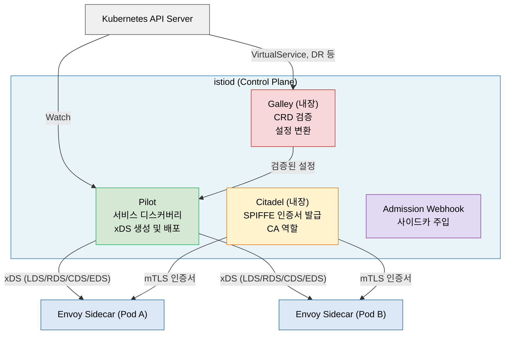
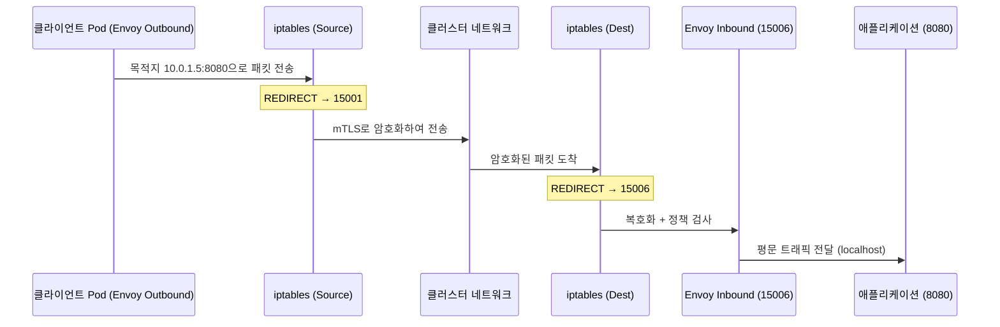

# Istio 아키텍처 (v1.29)

> 설치를 마친 뒤에는 "무엇이 실제로 돌아가는가"를 구조 관점에서 해부해야 합니다. Istio는 `istiod`가 제어 플레인을 통합하고 Envoy가 데이터 플레인을 담당하는 구조 위에 CRD 기반 선언형 모델을 얹어, 트래픽 제어·보안·관측성을 코드 변경 없이 밀어 넣습니다.

## 학습 목표

> istiod 통합 진화(v1.0→v1.5→v1.29), Pilot·Citadel·Galley 역할, xDS 네 API, Envoy 사이드카의 iptables 가로채기, 핵심 CRD 일곱 가지, Linkerd 비교까지 다섯 가지 목표를 다룹니다.

학습 목표는 다섯 가지입니다:

1. Istio의 주요 버전별 진화 흐름(v1.0 → istiod → Ambient)을 설명합니다.
2. istiod 내부의 Pilot·Citadel·Galley 역할을 구분하고 xDS 프로토콜 흐름을 추적합니다.
3. Envoy 사이드카가 iptables를 통해 트래픽을 가로채는 원리를 설명합니다.
4. 주요 CRD의 용도를 구분합니다.
5. Istio와 Linkerd의 철학적 차이를 트레이드오프 관점에서 비교합니다.

## 1. Istio는 어떻게 탄생했나

> Google·IBM·Lyft의 협업으로 시작된 Istio가 Mixer 병목을 제거하고 istiod로 통합되기까지의 버전별 진화 흐름을 설명합니다.

Istio는 2017년 Google·IBM·Lyft가 공동 발표했습니다. Lyft는 이미 Envoy 프록시를 사내에서 운영하고 있었고, Google과 IBM은 Kubernetes 기반 마이크로서비스 플랫폼에 네트워크 정책을 코드 없이 주입할 방법을 찾고 있었습니다.

### 1.1 버전별 진화: 단순화의 역사

| 버전(연도) | 변경의 핵심 | 의미 |
|------------|------------|------|
| v1.0 (2018) | Pilot·Citadel·Galley·Mixer 네 컴포넌트로 분리 | Mixer 동기 RPC가 단일 장애점·레이턴시 병목 |
| v1.5 (2020) | Pilot·Citadel·Galley를 `istiod`로 병합, Mixer 폐기 | 텔레메트리가 Envoy 내장으로 이전돼 운영 복잡도가 급감 |
| v1.24 (2024) | Ambient Mesh GA | 사이드카 리소스 오버헤드를 노드 단위 ztunnel로 우회 |
| v1.27 (2025) | Ambient 멀티클러스터 알파 + Gateway API 통합 성숙 | 메시 경계 확장(아직 알파)과 표준 API 흡수의 안정화 단계 |

Ambient Mesh GA(v1.24, 2024-11-07)는 Istio TOC가 Stable로 선언한 사이드카 없는 메시 모드입니다. 노드당 DaemonSet으로 배포되는 **ztunnel**이 L4 mTLS를 처리하고, L7 정책이 필요한 워크로드만 **waypoint**(Envoy 기반) 프록시를 선택적으로 추가합니다. 이 구조 덕분에 L7 기능이 불필요한 서비스는 사이드카 메모리 비용을 완전히 제거할 수 있습니다. K8s 1.28~1.31을 지원하며, L4 AuthorizationPolicy(source.principals)는 ztunnel이 집행하고 L7 정책(methods, headers)은 waypoint가 집행합니다 (istio.io/blog/2024/ambient-reaches-ga).

v1.0 시기 Mixer는 매 요청마다 동기 RPC로 정책·텔레메트리를 검사해 요청 자체의 레이턴시를 끌어올렸고, Mixer가 다운되면 트래픽 처리가 막혔습니다. v1.5의 istiod 통합은 이 동기 의존을 잘라낸 결정이라 단순히 "컴포넌트 통합"이 아니라 데이터 플레인의 가용성 모델 자체를 바꾼 변화로 평가됩니다.

### 1.2 CNCF 졸업 (2023): 왜 중요한가

2023년 CNCF 졸업은 단순한 행정 절차가 아닙니다. CNCF 졸업 기준에는 보안 감사 통과, 다양한 공급업체 기여, 거버넌스 문서화가 포함됩니다. 엔터프라이즈 관점에서 졸업 프로젝트는 "단일 벤더 종속 리스크 없음"을 의미합니다.

## 2. Control Plane — istiod 해부

> istiod 단일 바이너리 내부에서 Pilot(xDS 생성)·Citadel(인증서 발급)·Galley(설정 검증)가 역할을 분담하고 Envoy에 설정을 푸시하는 구조를 설명합니다.

istiod는 하나의 바이너리지만 내부에 세 가지 논리적 역할이 공존합니다.

### 2.1 Pilot: 신경계

Pilot은 istiod의 핵심입니다. Kubernetes API Server를 지속적으로 Watch하면서 Service·Endpoint·VirtualService·DestinationRule 등의 변화를 감지합니다. 변화가 감지되면 이를 Envoy가 이해할 수 있는 **xDS 설정**으로 변환해 각 사이드카에 푸시합니다.

xDS는 "x Discovery Service"의 약자로 Envoy의 동적 설정 프로토콜입니다. 파일 기반 설정이 아닌 gRPC 스트림으로 실시간 업데이트를 주고받습니다. 네 가지 API로 구성되며, 요청이 Envoy를 통과하는 물리적 순서와 동일하게 Listener→Route→Cluster→Endpoint로 추적할 수 있습니다.

| API | 풀네임 | 역할 |
|-----|--------|------|
| LDS | Listener Discovery Service | 어떤 포트에서 리스닝할지 |
| RDS | Route Discovery Service | 어떤 URL을 어디로 라우팅할지 |
| CDS | Cluster Discovery Service | 어떤 업스트림 서비스가 있는지 |
| EDS | Endpoint Discovery Service | 각 서비스의 실제 IP:Port 목록 |

istiod 장애 시 기존 Envoy 인스턴스는 마지막으로 수신한 xDS 설정을 메모리에 유지한 채 트래픽을 계속 처리합니다. 이것이 Mixer 아키텍처와의 핵심 차이입니다. Mixer가 다운되면 check 호출이 실패해 요청 자체가 거부됐지만, istiod는 비동기 푸시 모델이라 컨트롤 플레인 장애가 기존 트래픽에 영향을 주지 않습니다.

### 2.2 Citadel: 신뢰의 뿌리

Citadel은 PKI(Public Key Infrastructure) 역할을 담당합니다. 모든 워크로드에 **SPIFFE(Secure Production Identity Framework for Everyone)** 형식의 인증서를 발급합니다.

SPIFFE ID는 `spiffe://cluster.local/ns/default/sa/productpage`처럼 생긴 URI입니다. 이 URI에는 클러스터·네임스페이스·서비스어카운트가 인코딩되어 있어, 해당 인증서를 가진 워크로드의 신원을 암호학적으로 증명할 수 있습니다.

### 2.3 Galley: 게이트키퍼

Galley는 Kubernetes Admission Webhook으로 동작하면서 CRD 설정이 istiod에 반영되기 전에 유효성을 검사합니다. VirtualService의 `host` 필드가 존재하지 않는 서비스를 가리키거나, DestinationRule의 subset 이름이 VirtualService에서 참조한 이름과 다르면 API Server 수준에서 거부합니다.

### 2.4 Admission Webhook: 사이드카 주입의 마법

파드가 생성될 때 Kubernetes는 `MutatingAdmissionWebhook`을 호출합니다. istiod는 이 Webhook을 구현해, 네임스페이스에 `istio-injection: enabled` 레이블이 있으면 파드 Spec에 두 컨테이너를 자동으로 추가합니다. 하나는 `istio-init` Init Container로 iptables 규칙을 설정해 모든 트래픽이 Envoy로 흐르도록 준비하고, 다른 하나는 `istio-proxy` 본체로 실제 Envoy 사이드카 역할을 합니다.

## 3. Data Plane — Envoy 사이드카

> istio-init이 설정한 iptables 규칙이 Pod의 모든 인바운드·아웃바운드 트래픽을 Envoy 포트로 리다이렉트해 애플리케이션 코드 수정 없이 메시 기능을 적용하는 원리를 설명합니다.

Envoy는 Lyft가 C++로 작성한 고성능 L7 프록시입니다. Istio는 Envoy를 그대로 가져다 쓰되, istiod가 생성한 xDS 설정으로 동적 제어합니다.

### 3.1 트래픽 가로채기: iptables의 역할

`istio-init` Init Container가 iptables 규칙을 설정해 모든 트래픽이 Envoy를 통과하게 만듭니다. 인바운드 포트 15006, 아웃바운드 포트 15001, 관리 포트 15000이 Istio 사이드카의 고정 포트입니다.

## 4. 주요 CRD

> VirtualService·DestinationRule·AuthorizationPolicy 등 Istio 핵심 CRD 일곱 가지의 용도와 CRD 증식을 GitOps로 관리하는 방법을 다룹니다.

| CRD | 역할 |
|-----|------|
| VirtualService | 트래픽 라우팅, 재시도, 타임아웃, Fault Injection |
| DestinationRule | 로드밸런싱, Circuit Breaker, mTLS 모드 |
| Gateway | 외부 트래픽 진입점 (포트, 호스트, TLS) |
| ServiceEntry | 메시 외부 서비스를 메시에 등록 |
| AuthorizationPolicy | 서비스 간 접근 제어 |
| PeerAuthentication | mTLS 모드 설정 (STRICT/PERMISSIVE) |
| EnvoyFilter | Envoy 설정 직접 패치 (탈출구, 주의 필요) |

CRD 증식(sprawl)은 실제 운영 문제입니다. 동일 호스트에 여러 VirtualService가 존재하면 병합 규칙에 따라 처리되지만 결과가 직관적이지 않을 수 있습니다. `istioctl analyze` 명령이 충돌을 일부 감지하고, Kiali는 CRD 간 의존성을 그래프로 시각화합니다.

GitOps 접근법이 CRD 증식 관리에 효과적입니다. 모든 Istio CRD를 Git 저장소에서 관리하면 변경 이력이 남고, `istioctl analyze --recursive`를 CI 파이프라인에 포함시켜 변경 전 검증을 자동화할 수 있습니다.

## 5. Istio vs Linkerd: 철학적 차이

> 경량 Rust 프록시 대 범용 Envoy 프록시 선택이 메모리·운영 부담·고급 기능 가용성에 어떤 구체적 차이를 만드는지 비교합니다.

Linkerd는 linkerd2-proxy(Rust 경량 마이크로프록시)를 사용하고, Istio는 Envoy(C++ 범용 프록시)를 사이드카로 사용합니다. 이 선택이 리소스 사용량, 디버깅 용이성, 운영 부담에 구체적인 차이를 만듭니다.

| 항목 | Linkerd | Istio |
|------|---------|-------|
| 프록시 | linkerd2-proxy (Rust, 경량) | Envoy (C++, 범용) |
| 메모리 (사이드카당) | ~20MB | ~50-100MB |
| 설정 CRD 수 | 소수 (HTTPRoute 위주) | 12개 이상 |
| 학습 곡선 | 완만 | 가파름 |
| 고급 기능 | 제한적 | 풍부 (Fault Injection 등) |
| CNCF 졸업 | 2021 | 2023 |

Linkerd는 "단순함이 기본값"이라는 철학으로 80%의 케이스를 쉽게 처리합니다. Istio는 Fault Injection, 복잡한 재시도 조건, WASM 필터 확장 등 20%의 고급 케이스까지 포괄합니다.

xDS 확장성 관점에서 istiod는 클러스터 규모가 커지면 병목이 될 수 있습니다. `pilot_xds_push_time` 메트릭이 5초를 초과하면 경고 신호입니다. 실무에서는 istiod 인스턴스당 약 1,000개 Envoy 연결을 안전한 상한으로 볼 수 있습니다.

Linkerd는 2021년 CNCF Graduated 프로젝트로, linkerd2-proxy는 Rust로 작성된 마이크로프록시입니다 (github.com/linkerd/linkerd2-proxy, cncf.io/projects/linkerd). Istio의 현재 안정 버전은 1.30(직전 1.29)입니다 (istio.io).

## 면접 대비

> Istio 아키텍처를 설명할 때 가장 자주 받는 네 가지 질문을 답변 형식으로 정리합니다.

**istiod 통합 이전 Mixer 아키텍처의 핵심 문제는 무엇이고 어떻게 해결됐는가?**

Mixer는 매 요청마다 동기 RPC로 정책 체크와 텔레메트리 수집을 처리했습니다. 이 동기 의존성이 두 가지 문제를 만들었습니다. 첫째, 요청 레이턴시에 Mixer 호출 시간이 가산됐습니다. 둘째, Mixer가 다운되면 데이터 플레인이 요청 자체를 거부했습니다. v1.5에서 istiod로 Pilot·Citadel·Galley를 통합하면서 Mixer를 폐기하고 텔레메트리를 Envoy 내장 기능으로 옮겨, 컨트롤 플레인이 데이터 플레인 요청 경로에서 완전히 빠졌습니다.

**xDS 푸시 모델이 Mixer 동기 RPC 대비 컨트롤 플레인 장애 내성에서 어떤 차이를 만드는가?**

xDS는 비동기 푸시 모델이라 Envoy가 마지막으로 수신한 설정을 메모리에 유지합니다. istiod가 다운돼도 기존 Envoy는 그 설정 그대로 트래픽을 계속 처리합니다. 새 설정 반영만 멈출 뿐입니다. Mixer 모델에서는 컨트롤 플레인 장애가 곧 요청 거부였다는 점과 본질적으로 다르며, 컨트롤 플레인과 데이터 플레인의 가용성을 독립적으로 다룰 수 있게 만든 결정입니다.

**iptables 가로채기에서 인바운드 15006·아웃바운드 15001 분리가 필요한 이유는?**

같은 Envoy 사이드카라도 인바운드 트래픽은 mTLS 복호화와 인가 검사를 거쳐 평문으로 앱(localhost)에 넘기고, 아웃바운드 트래픽은 앱에서 받은 평문을 mTLS로 감싸 외부로 내보냅니다. 두 흐름은 적용해야 할 필터 체인이 정반대이므로 동일 포트에서 처리하면 분기 로직이 복잡해집니다. 포트를 나누면 iptables 룰이 단순해지고 Envoy 설정도 인바운드/아웃바운드 리스너로 명확히 갈라집니다.

**Linkerd2-proxy(Rust) vs Envoy 선택이 메시 운영 비용에 만드는 실질 차이는?**

사이드카당 메모리에서 Linkerd2-proxy는 약 20MB, Envoy는 50~100MB로 2~5배 차이가 납니다. 1000 Pod 클러스터에서 사이드카만으로 30~80GB 메모리 차이가 생깁니다. 설정 CRD 수도 Linkerd는 HTTPRoute 위주의 소수인 반면 Istio는 12개 이상이라 학습 곡선이 가파릅니다. 대신 Envoy는 Fault Injection·WASM 필터·풍부한 트래픽 정책을 제공하므로 고급 기능이 요구사항이면 그 비용을 감수하는 선택이 됩니다.
