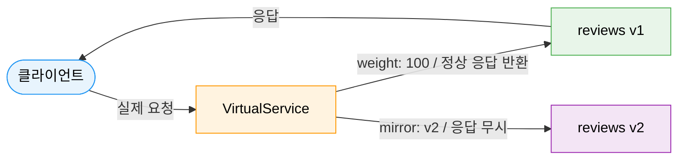
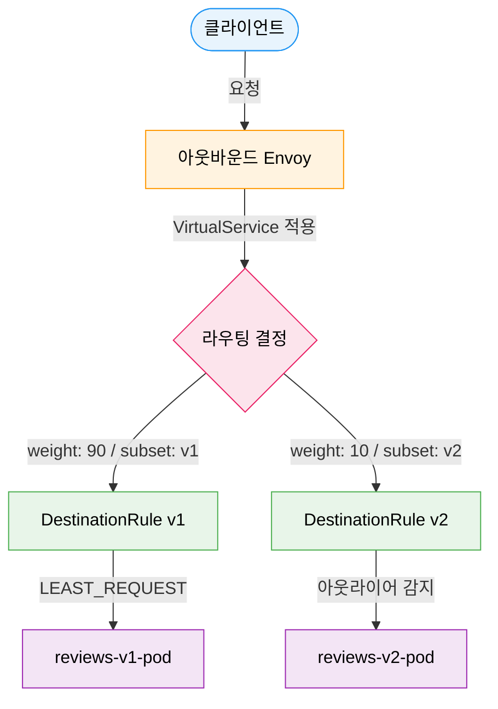
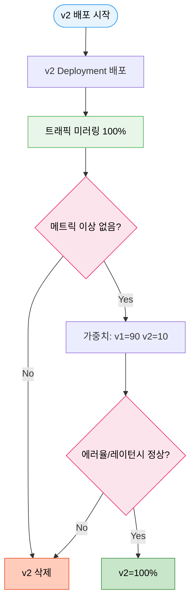

# Istio 트래픽 관리

> 외부에서 들어온 요청을 어디로, 어떤 조건으로, 어떤 비율로 보낼지 정하는 단계가 트래픽 관리다. VirtualService와 DestinationRule을 함께 보면 Ingress Gateway 뒤에서 벌어지는 내부 라우팅, 버전 분기, 카나리 배포를 선언적으로 조합할 수 있다.


## 학습 목표

> VirtualService 라우팅 매칭, DestinationRule 카나리, 장애 주입, 서킷 브레이킹, Gateway API 대체, 트래픽 미러링까지 여섯 가지 목표를 다룬다.

학습 목표는 여섯 가지다:

1. VirtualService의 HTTP 라우팅 매칭 규칙(URI, 헤더, 메서드)을 작성한다.
2. DestinationRule로 subset을 정의하고 가중치 기반 카나리를 구현한다.
3. 장애 주입(delay, abort)으로 복원력 테스트 시나리오를 설계한다.
4. 아웃라이어 감지로 서킷 브레이킹이 동작하는 원리를 설명한다.
5. Gateway API의 HTTPRoute가 VirtualService를 어떻게 대체하는지 매핑한다.
6. 트래픽 미러링으로 프로덕션 트래픽을 복사해 새 버전을 검증하는 패턴을 이해한다.


## 1. VirtualService — 트래픽 라우팅의 중심

> URI·헤더·메서드 조건 매칭, 가중치 기반 카나리, 장애 주입, 재시도·타임아웃, 트래픽 미러링을 선언적으로 표현하는 VirtualService의 구조와 활용 패턴을 다룬다.

쿠버네티스 Service가 "어디로 가야 하는가"를 정의한다면, VirtualService는 "어떻게, 어떤 조건으로 가야 하는가"를 정의한다. 고속도로 나들목의 목적지 표지판(Service)과 달리, VirtualService는 교통 경찰관처럼 실시간으로 조건을 보고 차량을 분류한다.

### 1.1 기본 구조와 HTTP 라우팅

```yaml
apiVersion: networking.istio.io/v1
kind: VirtualService
metadata:
  name: reviews-vs
spec:
  hosts:
  - reviews
  http:
  - match:
    - uri:
        prefix: /api/v2
      headers:
        x-api-version:
          exact: "v2"
      method:
        exact: GET
    route:
    - destination:
        host: reviews
        subset: v2
      weight: 100
  - route:
    - destination:
        host: reviews
        subset: v1
      weight: 100
```

`match` 조건은 AND 연산이다. 위 예시는 URI가 `/api/v2`로 시작하고, 헤더에 `x-api-version: v2`가 있으며, GET 메서드인 요청만 v2로 보낸다. 여러 `match` 블록을 나열하면 OR 조건이 된다.

### 1.2 가중치 기반 카나리

weight 합계는 반드시 100이어야 한다. 카나리 배포는 보통 5% → 10% → 25% → 50% → 100% 순으로 단계적으로 높인다. 각 단계에서 에러율과 레이턴시를 확인한 뒤 다음 단계로 진행한다.

```yaml
http:
- route:
  - destination:
      host: reviews
      subset: v1
    weight: 90
  - destination:
      host: reviews
      subset: v2
    weight: 10
```

### 1.3 장애 주입

장애 주입은 카오스 엔지니어링의 핵심 도구다. 실제 의존 서비스에 장애를 일으키지 않고 시스템이 어떻게 반응하는지 안전하게 테스트할 수 있다. 지연 주입(`delay`)은 타임아웃과 재시도 정책을 테스트할 때, 중단 주입(`abort`)은 서킷 브레이커나 폴백 로직을 확인할 때 사용한다.

### 1.4 재시도와 타임아웃

`retryOn` 필드는 어떤 조건에서 재시도할지 결정한다. 전체 타임아웃(`timeout`)이 `attempts × perTryTimeout`보다 넉넉해야 재시도가 의미 있다.

### 1.5 트래픽 미러링

미러링은 프로덕션 트래픽의 복사본을 새 버전으로 보내는 기법이다. 원본 요청의 응답은 클라이언트에게 정상 반환되고, 미러 요청의 응답은 무시된다. 새 버전이 실제 트래픽 패턴에서 어떻게 동작하는지 리스크 없이 검증할 수 있다.




## 2. DestinationRule — 목적지 동작 정의

> subset 정의로 버전별 Pod를 식별하고, 로드밸런싱 알고리즘·연결 풀·아웃라이어 감지(서킷 브레이킹)를 선언하는 DestinationRule의 역할을 설명한다.

VirtualService가 "어디로 보낼지"를 결정한다면, DestinationRule은 "목적지에서 어떻게 연결할지"를 정의한다. 로드밸런싱 알고리즘, 연결 풀 크기, 서킷 브레이킹, TLS 설정이 모두 여기에 들어간다.

### 2.1 Subset 정의

VirtualService에서 `subset: v1`을 참조하면, DestinationRule이 `version: v1` 레이블을 가진 파드들로만 트래픽을 보낸다. VirtualService의 subset 참조는 반드시 해당 DestinationRule이 먼저 존재해야 동작한다. 순서를 잘못 배포하면 503 에러가 발생하는 흔한 실수다.

### 2.2 로드밸런서와 연결 풀

| 알고리즘 | 설명 | 적합한 상황 |
|---------|------|------------|
| `ROUND_ROBIN` | 순서대로 균등 분배 | 동질적인 파드 집합 |
| `LEAST_REQUEST` | 활성 요청 가장 적은 파드 | 처리 시간이 다양할 때 |
| `RANDOM` | 무작위 선택 | 간단한 부하 분산 |

연결 풀은 업스트림 서비스가 받을 수 있는 부하를 제한한다. `maxConnections`를 넘으면 새 연결이 거부되고, `http1MaxPendingRequests`를 넘으면 대기 요청이 거부된다.

### 2.3 아웃라이어 감지

서킷 브레이킹은 특정 파드가 반복적으로 실패하면 일정 시간 동안 그 파드로의 트래픽을 차단(이젝션)하고, 시간이 지나면 조금씩 복구를 시도한다. `maxEjectionPercent`는 전체 파드 중 이젝션 가능한 최대 비율로, 너무 많은 파드가 동시에 이젝션되어 서비스 전체가 다운되는 것을 방지한다.


## 3. VirtualService + DestinationRule 전체 흐름

> 클라이언트 요청이 아웃바운드 Envoy → VirtualService 라우팅 결정 → DestinationRule 로드밸런싱 → 대상 Pod로 전달되는 전체 경로를 도식화한다.




## 4. 고급 트래픽 패턴

> 헤더 기반 카나리로 특정 사용자 집단만 새 버전에 노출하고, 블루-그린으로 즉각 전환하며, 미러링→가중치 카나리→100% 전환으로 이어지는 안전한 배포 시나리오를 다룬다.

### 4.1 헤더 기반 카나리

가중치 기반 카나리는 무작위로 사용자를 분산시키지만, 헤더 기반 라우팅은 특정 요청(QA팀, 내부 사용자, 베타 테스터)만 새 버전으로 보낼 수 있다. 프로덕션에서 정해진 사용자 집단을 대상으로 새 버전을 검증하는 것이 가능해진다.

### 4.2 블루-그린 배포

블루-그린은 VirtualService의 weight를 바꾸는 것만으로 즉각적인 전환과 즉각적인 롤백이 가능하다.

### 4.3 카나리 전체 시나리오




## 5. Gateway API — 새로운 표준

> 이식성·역할 분리·크로스 네임스페이스 제어를 이유로 새 배포에서 HTTPRoute가 VirtualService를 점진적으로 대체하며, 두 리소스가 공존할 때 Gateway API가 우선하는 규칙을 설명한다.

Kubernetes Gateway API는 Ingress의 후계자로, Istio의 VirtualService와 DestinationRule을 점진적으로 대체하고 있다. 새 배포에서 권장하는 이유는 세 가지다.

1. 표준 쿠버네티스 API이므로 다른 메시 구현체와도 호환된다.
2. 역할 기반 설계(인프라 관리자 / 애플리케이션 개발자)가 명확하다.
3. 크로스 네임스페이스 라우팅이 ReferenceGrant로 안전하게 제어된다.

VirtualService와 비교하면 `http.route.destination.host + subset`이 `backendRefs.name + port`로 바뀌었고, subset 개념 대신 각 버전별로 별도의 쿠버네티스 Service를 만드는 패턴을 사용한다. VirtualService와 HTTPRoute를 동시에 실행할 수 있으며, 같은 Service에 두 리소스가 모두 적용되면 Gateway API가 우선한다.


## 6. ServiceEntry — 외부 서비스를 메시에 등록

> REGISTRY_ONLY 모드에서 클러스터 외부 서비스를 메시에 등록해 재시도·타임아웃·메트릭을 적용하고, DNS 스푸핑 방어를 위해 STATIC resolution을 사용하는 보안 고려사항을 다룬다.

Istio의 `REGISTRY_ONLY` 모드에서는 ServiceEntry에 등록된 서비스만 허용된다. ServiceEntry를 등록하면 외부 서비스에도 재시도, 타임아웃, 서킷 브레이킹을 적용할 수 있고, 메트릭과 트레이싱도 자동으로 수집된다. DNS 기반 ServiceEntry는 DNS 스푸핑 공격에 취약할 수 있으므로, 민감한 외부 서비스는 `resolution: STATIC`과 `addresses`를 명시하는 것이 안전하다.


## 면접 대비

> VirtualService·DestinationRule 역할 분리, 아웃라이어 감지와 연결 풀의 차이, 미러링과 카나리의 적절한 사용 구분을 Q&A 형태로 점검한다.

**VirtualService와 DestinationRule의 역할 분리가 왜 중요한가?** VirtualService는 트래픽 라우팅 결정을, DestinationRule은 목적지의 동작을 담당한다. 이 분리 덕분에 동일한 DestinationRule을 여러 VirtualService가 재사용할 수 있다. 단, VirtualService에서 subset을 참조하려면 반드시 DestinationRule이 먼저 존재해야 한다는 배포 순서 의존성이 있다.

**아웃라이어 감지와 연결 풀의 차이는?** 연결 풀은 요청이 목적지에 도달하기 전에 차단하는 사전 제한이고, 아웃라이어 감지는 요청 결과를 분석하는 사후 반응이다. 두 메커니즘은 보완적으로 함께 사용한다.

**미러링과 카나리의 차이는?** 미러링은 사용자가 전혀 v2를 인식하지 못하므로 기능적 정확성과 성능 검증에 적합하다. 단, 데이터 변경(DB write) 엔드포인트에는 중복 쓰기가 발생하므로 주의해야 한다. 가중치 기반 카나리는 실제 사용자 트래픽의 일부가 v2로 가므로, 비즈니스 지표를 측정해야 할 때 사용한다.
