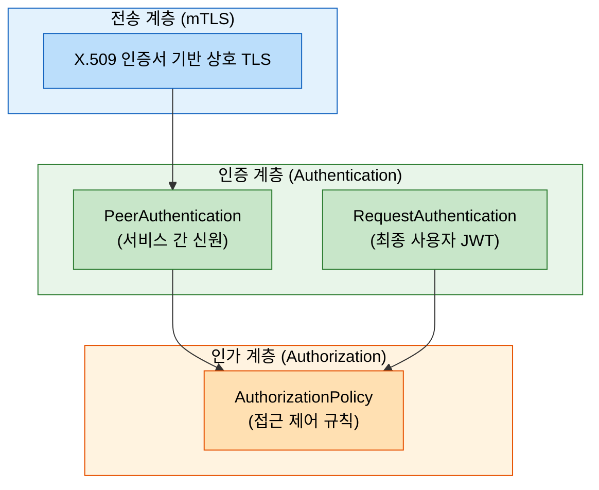
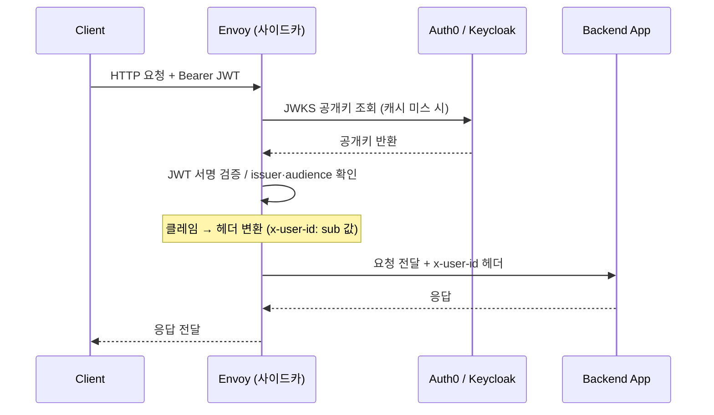
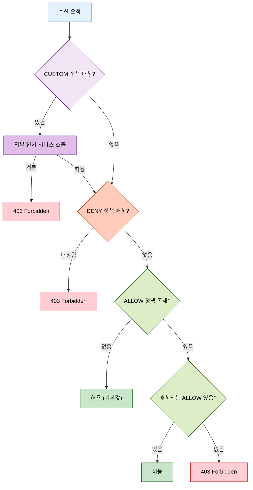
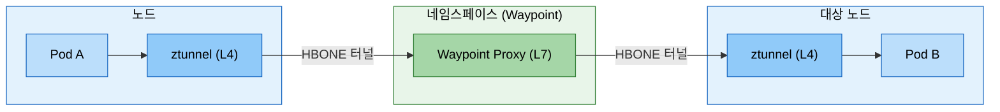

# Istio 보안

> 운영 묶음의 첫 단계는 보안 기준선을 세우는 일입니다. Istio는 애플리케이션 코드 수정 없이 전송 암호화(mTLS), 신원 인증(Authentication), 접근 제어(Authorization)를 서비스 메시에 밀어 넣지만, 진짜 제로 트러스트는 "누가"와 "무엇을"을 함께 설계할 때만 성립합니다.


## 학습 목표

> mTLS 전송 보안, JWT 인증, AuthorizationPolicy 인가의 세 계층이 어떻게 맞물려 제로 트러스트를 구성하는지 다룹니다.

1. Istio 보안의 세 축(전송 보안, 인증, 인가)이 어떻게 상호 보완하는지 설명합니다.
2. PeerAuthentication의 네 가지 모드와 적용 범위 우선순위를 이해합니다.
3. RequestAuthentication으로 JWT를 검증하고 클레임을 업스트림에 전달하는 흐름을 설명합니다.
4. AuthorizationPolicy의 액션 유형과 평가 순서를 정확히 기술합니다.
5. CUSTOM 액션과 OPA 연동 패턴을 이해합니다.
6. Ambient Mesh에서 L4/L7 보안 정책이 어떻게 분리 적용되는지 설명합니다.


## 1. Istio 보안 아키텍처

> Istio는 네트워크 위치가 아닌 서비스 신원으로 신뢰를 판단하며, 전송 암호화·인증·인가 세 계층이 맞물려야 진정한 제로 트러스트 네트워크가 성립합니다.

Istio 보안의 목표는 단순히 트래픽을 암호화하는 것이 아닙니다. 실행 중인 서비스가 누구인지 증명하고(Authentication), 증명된 신원에 기반해 어떤 작업을 허용할지 결정하며(Authorization), 그 전제 조건으로 통신 자체를 안전하게 보호합니다(Transport Security). 이 세 계층이 맞물려야 진정한 제로 트러스트 네트워크가 성립합니다.

전통적인 경계 보안은 방화벽 안에 들어온 트래픽을 신뢰하는 가정에 기댑니다. 내부 공격자나 컨테이너 탈출 시나리오에서는 이 가정이 무너집니다. Istio는 각 Pod가 자신만의 X.509 인증서를 가지고 통신하도록 강제함으로써, 네트워크 위치가 아닌 신원으로 신뢰를 판단하는 패러다임을 도입합니다.




## 2. PeerAuthentication: 서비스 간 신원 검증

> PeerAuthentication은 SPIFFE 인증서를 기반으로 서비스 신원을 검증하며, PERMISSIVE에서 시작해 STRICT로 단계적으로 전환하는 마이그레이션 전략이 표준입니다.

### 2.1 mTLS 동작 원리

일반 TLS는 서버만 인증서를 제시합니다. mTLS(Mutual TLS)는 서버와 클라이언트 모두 인증서를 교환합니다. Istio에서는 istiod가 SPIFFE 표준에 따라 각 Pod에 인증서를 자동 발급하며, 형식은 `spiffe://<trust-domain>/ns/<namespace>/sa/<service-account>`입니다. Envoy 사이드카는 이 인증서를 사용해 피어 간 TLS 핸드셰이크를 수행하고, 애플리케이션은 평문 HTTP로 통신하면서 Envoy가 투명하게 암호화와 복호화를 처리합니다.

### 2.2 네 가지 모드

`PeerAuthentication`의 `mtls.mode` 필드는 네 가지 값을 가집니다.

`STRICT`는 mTLS만 허용합니다. 평문 트래픽은 즉시 거부되며, 완전한 제로 트러스트 환경에서 사용합니다. 모든 클라이언트가 Istio 사이드카를 가져야 합니다. `PERMISSIVE`는 mTLS와 평문 모두 허용합니다. 사이드카가 없는 레거시 클라이언트도 계속 통신할 수 있어 마이그레이션 과도기에 유용합니다. `DISABLE`은 사이드카가 있어도 mTLS를 사용하지 않는 특수 상황용으로 권장되지 않습니다. `UNSET`은 상위 범위의 설정을 상속하는 기본값입니다.

### 2.3 적용 범위와 우선순위

PeerAuthentication은 세 가지 범위로 적용할 수 있고, 가장 좁은 범위가 우선합니다.

```
메시 전체 (istio-system 네임스페이스, selector 없음)
    ↓ 상속
네임스페이스 전체 (해당 네임스페이스, selector 없음)
    ↓ 상속
워크로드별 (selector 지정)  ← 이 정책이 최종 적용
```

메시 전체를 STRICT으로 설정하더라도 특정 워크로드는 포트 레벨에서 예외 처리할 수 있습니다.

```yaml
apiVersion: security.istio.io/v1beta1
kind: PeerAuthentication
metadata:
  name: default
  namespace: production
spec:
  mtls:
    mode: STRICT
  portLevelMtls:
    9090:              # Prometheus /metrics 포트
      mode: PERMISSIVE
    8086:              # Health check 포트
      mode: DISABLE
```

### 2.4 PERMISSIVE → STRICT 마이그레이션

프로덕션 환경에서 갑자기 STRICT 모드로 전환하면 사이드카가 없는 클라이언트 트래픽이 단절됩니다. 안전한 전환 순서는 다음과 같습니다.

1. 전체를 PERMISSIVE로 설정해 기존 트래픽 영향 없이 mTLS를 활성화합니다.
2. `connection_security_policy` 레이블로 평문 트래픽이 남아 있는지 식별합니다.
3. 네임스페이스 단위로 STRICT을 전환하며 문제를 국소화합니다.
4. 모든 트래픽이 mTLS로 전환된 것을 확인한 후 메시 전체에 STRICT을 적용합니다.

`security.istio.io/v1` API 버전이 안정화되어 있어(1.22에서 Stable 승격) PeerAuthentication 리소스에 이 버전을 사용할 수 있습니다. (istio.io/latest/docs/reference/config/security/)


## 3. RequestAuthentication: JWT 검증

> RequestAuthentication은 JWT 유효성만 검증하며 JWT가 없는 요청은 통과시키므로, 완전한 차단은 반드시 AuthorizationPolicy와 함께 구성해야 합니다.

### 3.1 역할과 한계

`PeerAuthentication`이 서비스 신원을 검증한다면, `RequestAuthentication`은 최종 사용자가 누구인지를 JWT로 검증합니다. 중요한 점은 `RequestAuthentication` 단독으로는 접근을 거부하지 않는다는 것입니다. 유효하지 않은 JWT는 거부하지만, JWT가 없는 요청은 통과시킵니다. JWT 없는 요청을 차단하려면 반드시 `AuthorizationPolicy`와 함께 사용해야 합니다.

### 3.2 JWT 검증 설정

```yaml
apiVersion: security.istio.io/v1beta1
kind: RequestAuthentication
metadata:
  name: jwt-auth
  namespace: production
spec:
  selector:
    matchLabels:
      app: api-gateway
  jwtRules:
  - issuer: "https://auth.example.com"
    jwksUri: "https://auth.example.com/.well-known/jwks.json"
    audiences:
    - "api.example.com"
    forwardOriginalToken: true
    outputClaimToHeaders:
    - header: x-user-id
      claim: sub
    - header: x-user-role
      claim: role
```

Envoy는 `jwksUri` 엔드포인트에서 공개키를 자동으로 가져와 캐시하고 서명을 검증합니다. 키 로테이션도 자동으로 처리됩니다. `outputClaimToHeaders`는 JWT 클레임을 HTTP 헤더로 변환해 업스트림에 전달하므로, 백엔드 서비스는 JWT 파싱 없이 `x-user-id` 헤더만 읽어 사용자를 식별할 수 있습니다.




## 4. AuthorizationPolicy: 접근 제어

> ALLOW 정책이 하나라도 존재하면 매칭되지 않는 요청은 모두 거부되므로, 빈 spec의 ALLOW 정책으로 기본 거부를 구현하고 필요한 경로만 명시적으로 허용해야 합니다.

### 4.1 네 가지 액션 유형

`ALLOW`는 매칭된 요청을 허용하며, 정책이 하나라도 있으면 기본적으로 나머지는 모두 거부됩니다. `DENY`는 매칭된 요청을 명시적으로 거부하며 ALLOW보다 우선합니다. `CUSTOM`은 외부 인가 서비스(OPA, 커스텀 웹훅)에 인가 판단을 위임합니다. `AUDIT`는 트래픽을 허용하되 감사 로그를 기록하며 규정 준수 목적으로 사용합니다.

### 4.2 평가 순서

같은 워크로드에 여러 `AuthorizationPolicy`가 적용될 때의 평가 순서입니다.



핵심은 "ALLOW 정책이 하나라도 존재하면, 매칭되지 않는 요청은 모두 거부됩니다"라는 점입니다. 빈 `spec`의 ALLOW 정책은 아무것도 허용하지 않아 기본 거부(Default Deny)를 구현하는 표준 패턴입니다.

### 4.3 조건 구성 요소

AuthorizationPolicy의 `rules`는 from(소스), to(대상 작업), when(추가 속성) 세 가지 조건의 AND 조합입니다.

```yaml
apiVersion: security.istio.io/v1beta1
kind: AuthorizationPolicy
metadata:
  name: frontend-to-backend
  namespace: production
spec:
  selector:
    matchLabels:
      app: backend
  action: ALLOW
  rules:
  - from:
    - source:
        principals:
        - "cluster.local/ns/production/sa/frontend"
        namespaces:
        - "production"
    to:
    - operation:
        methods: ["GET", "POST"]
        paths: ["/api/*"]
        ports: ["8080"]
    when:
    - key: request.auth.claims[role]
      values: ["admin", "editor"]
```

`source.principals`는 SPIFFE ID(서비스 어카운트), `source.namespaces`는 발신 네임스페이스입니다. 두 조건을 같은 `from` 블록에 넣으면 AND 조건, 별도 `from` 블록에 넣으면 OR 조건이 됩니다. `when` 조건의 `request.auth.claims[role]`처럼 JWT 클레임을 직접 참조할 수 있어 RBAC 구현이 가능합니다.

### 4.4 실전 패턴

기본 거부는 빈 규칙의 ALLOW 정책으로 구현합니다.

```yaml
# Default Deny
apiVersion: security.istio.io/v1beta1
kind: AuthorizationPolicy
metadata:
  name: deny-all
  namespace: production
spec: {}  # 규칙 없음 = 아무것도 허용 안 함

# JWT 역할 기반 접근 제어
apiVersion: security.istio.io/v1beta1
kind: AuthorizationPolicy
metadata:
  name: require-admin
  namespace: production
spec:
  selector:
    matchLabels:
      app: admin-api
  action: ALLOW
  rules:
  - from:
    - source:
        requestPrincipals: ["https://auth.example.com/*"]
    when:
    - key: request.auth.claims[role]
      values: ["admin"]
```

`requestPrincipals`는 JWT의 `iss/sub` 조합을 검사합니다. JWT 없는 요청은 `requestPrincipals`를 만족시킬 수 없으므로 자연스럽게 거부됩니다.


## 5. CUSTOM 액션과 외부 인가 서비스

> 시간대 제한·조직 계층 기반 접근처럼 선언적 정책으로 표현하기 어려운 복잡한 인가 로직은 CUSTOM 액션으로 OPA 같은 외부 인가 서비스에 위임합니다.

복잡한 인가 로직(시간대 제한, 조직 계층 기반 접근, 외부 DB 조회 등)은 Istio의 선언적 정책만으로 표현하기 어렵습니다. CUSTOM 액션은 외부 인가 서비스(ext_authz)에 판단을 위임합니다. OPA(Open Policy Agent) + Envoy 플러그인 조합이 가장 일반적입니다.

```yaml
# ExtensionProvider 등록 (MeshConfig)
extensionProviders:
- name: opa-authz
  envoyExtAuthzGrpc:
    service: opa.opa.svc.cluster.local
    port: 9191

---
apiVersion: security.istio.io/v1beta1
kind: AuthorizationPolicy
metadata:
  name: opa-policy
  namespace: production
spec:
  selector:
    matchLabels:
      app: sensitive-api
  action: CUSTOM
  provider:
    name: opa-authz
  rules:
  - to:
    - operation:
        paths: ["/admin/*"]
```

CUSTOM 정책이 매칭되면 Envoy는 요청을 즉시 처리하지 않고 OPA 서비스에 gRPC 체크 요청을 보냅니다. OPA가 허용하면 원래 요청을 진행하고, 거부하면 403을 반환합니다. ext_authz 레이턴시 예산이 10ms 이하인 서비스에서는 선언적 AuthorizationPolicy를 우선 검토합니다.


## 6. Ambient Mesh 보안 모델

> Ambient Mesh에서 L4 정책은 ztunnel이, L7 정책은 Waypoint가 담당하며, L4만으로 충분한 경우 Waypoint를 생략해 리소스 오버헤드를 줄일 수 있습니다.

Ambient Mesh는 사이드카 없이 ztunnel(노드별 L4 프록시)과 Waypoint(네임스페이스별 L7 프록시)로 보안을 구현합니다.



ztunnel(L4)에서 적용되는 정책은 네임스페이스와 서비스 어카운트 기반 조건만 사용할 수 있습니다. HTTP 메서드나 경로 같은 L7 속성은 사용할 수 없습니다. Waypoint(L7)에서 적용되는 정책은 `targetRef`로 Waypoint를 명시적으로 지정해야 합니다. L4 정책만으로 충분한 경우(서비스 계정 기반 접근 제어)는 Waypoint 없이 ztunnel만 사용해 리소스 오버헤드를 줄입니다.

Ambient 모드는 Istio 1.24(2024-11-07)에 Istio TOC 기준으로 Stable(GA)을 선언했습니다. L4 AuthorizationPolicy(source.principals 조건)는 ztunnel이 집행하고, L7 정책(targetRefs kind:Service, HTTP methods/paths 조건)은 waypoint가 집행합니다. (istio.io/blog/2024/ambient-reaches-ga, istio.io/latest/docs/ambient/migrate/migrate-policies)


## 면접 대비

> mTLS와 인가 정책의 차이, JWT 없는 요청 처리 방식, ALLOW 정책의 암묵적 거부 동작이 주요 면접 주제입니다.

**PeerAuthentication의 PERMISSIVE와 STRICT 차이는?** PERMISSIVE는 mTLS와 평문 모두 허용해 마이그레이션 과도기에 씁니다. STRICT는 mTLS만 허용하고 평문을 거부해 완전한 제로 트러스트를 구현합니다. 전환 전략은 메시 전체 PERMISSIVE → 네임스페이스별 STRICT → 메시 전체 STRICT 순서를 따릅니다.

**RequestAuthentication만으로 JWT 없는 요청을 차단할 수 없는 이유는?** `RequestAuthentication`은 JWT가 있을 때 유효성을 검증하는 역할만 담당합니다. JWT가 없는 요청은 검증 대상이 없어 통과됩니다. 차단하려면 `AuthorizationPolicy`에서 `requestPrincipals: ["*"]` 조건을 추가해야 합니다.

**ALLOW 정책이 하나라도 있을 때 기본 동작이 어떻게 바뀌는가?** ALLOW 정책이 없으면 기본적으로 모든 요청이 허용됩니다. 그러나 ALLOW 정책이 하나라도 존재하면, 매칭되는 ALLOW 규칙이 없는 요청은 모두 거부됩니다(Implicit Deny). 빈 `spec`의 AuthorizationPolicy가 기본 거부 역할을 하는 이유가 여기에 있습니다.

**mTLS와 AuthorizationPolicy를 혼동하면 어떤 보안 허점이 생기는가?** mTLS만 설정된 클러스터에서는 메시 내 모든 서비스가 서로에게 무제한 접근 가능합니다. mTLS는 암호화와 ID 검증을 제공할 뿐 최소 권한 원칙을 자동으로 구현하지 않습니다. 공격자가 메시 내 하나의 서비스를 탈취하면 인가 정책 없이 모든 서비스에 수평 이동(lateral movement)이 가능합니다.
