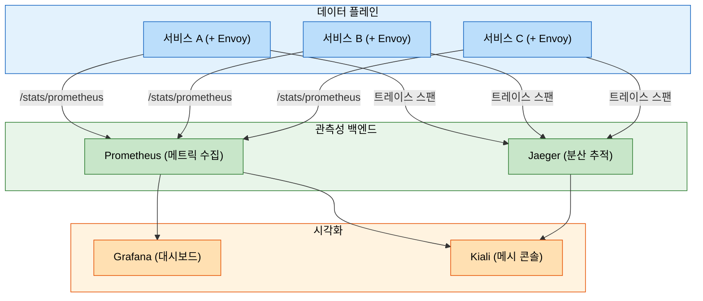
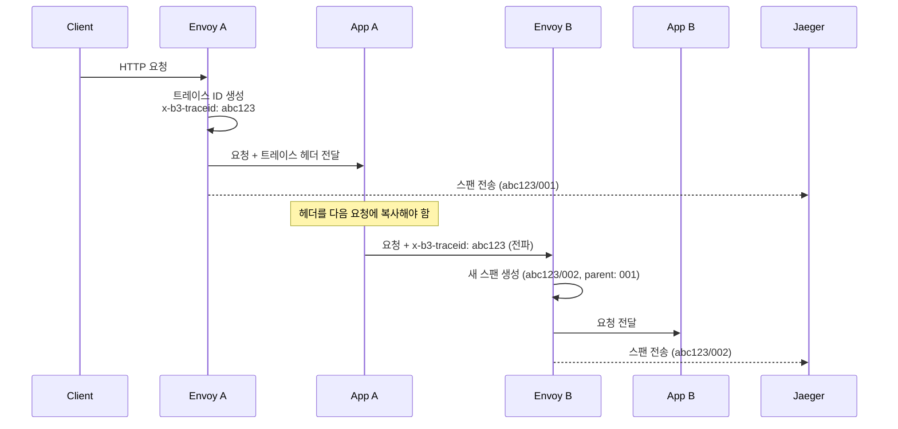

# Istio 관측성

> 보안과 트래픽 정책을 배치했다면, 그다음에는 메시가 실제로 무엇을 하고 있는지 보여 주는 관측성이 필요하다. Istio는 Envoy 프록시가 메트릭·분산 추적·액세스 로그를 자동 생성하지만, 트레이스 헤더 전파처럼 애플리케이션이 계속 책임져야 하는 구간도 남겨 둔다.


## 학습 목표

> Envoy가 자동으로 생성하는 메트릭·추적·로그의 구조와, 분산 추적에서 애플리케이션이 직접 처리해야 하는 헤더 전파를 다룬다.

1. 관측성 스택(Prometheus, Grafana, Jaeger, Kiali)의 역할 분담을 설명한다.
2. Istio 표준 메트릭의 레이블 구조와 주요 PromQL 쿼리를 작성한다.
3. 분산 추적에서 애플리케이션이 반드시 처리해야 하는 헤더 전파를 이해한다.
4. Kiali 그래프 뷰에서 트래픽 흐름과 설정 오류를 해석한다.
5. Telemetry API로 추적 샘플링 비율과 액세스 로그를 설정한다.
6. OpenTelemetry Collector를 Istio 텔레메트리 파이프라인에 통합하는 방법을 이해한다.


## 1. 관측성 스택 전체 구조

> Envoy 사이드카가 메트릭과 스팬을 자동 생성하지만, 분산 추적이 서비스 체인을 하나의 트레이스로 연결하려면 애플리케이션이 트레이스 헤더를 전파해야 한다.

Istio가 "무료 관측성"을 제공한다는 말은 정확히 절반만 맞다. Envoy 사이드카가 모든 인바운드/아웃바운드 트래픽을 가로채 메트릭과 스팬을 자동 생성하는 것은 사실이다. 그러나 분산 추적이 의미 있게 동작하려면 애플리케이션이 트레이스 헤더를 다음 서비스로 전달해야 한다.




## 2. 표준 메트릭

> `response_flags` 레이블이 HTTP 상태 코드만으로 구분하기 어려운 Envoy 수준 에러(서킷브레이커, 타임아웃)를 즉시 식별하게 해주어 메트릭의 진단 가치를 높인다.

### 2.1 메트릭의 종류

HTTP/gRPC 메트릭은 요청 단위 통계를 추적한다. `istio_requests_total`은 요청 수를 카운트하며 `response_code` 레이블로 HTTP 상태 코드를 구분한다. `istio_request_duration_milliseconds`는 히스토그램 형식으로 레이턴시 분포를 기록한다. TCP 메트릭은 연결 단위 통계로 `istio_tcp_sent_bytes_total` 등이 있다.

### 2.2 레이블 구조

메트릭의 진정한 가치는 레이블에 있다. 동일한 `istio_requests_total`이라도 레이블 조합으로 세밀한 분석이 가능하다.

| 레이블 | 설명 | 예시 |
|--------|------|------|
| `reporter` | 메트릭 보고 주체 | `source` (발신측), `destination` (수신측) |
| `source_workload` | 발신 워크로드 이름 | `frontend` |
| `destination_service` | 대상 서비스 FQDN | `backend.production.svc.cluster.local` |
| `destination_workload` | 대상 워크로드 이름 | `backend-v2` |
| `response_code` | HTTP 응답 코드 | `200`, `500`, `503` |
| `response_flags` | Envoy 응답 플래그 | `UO` (서킷브레이커), `UT` (타임아웃) |
| `connection_security_policy` | 보안 정책 | `mutual_tls`, `none` |

`response_flags`는 특히 유용하다. HTTP 500은 애플리케이션 에러와 인프라 에러를 구분하지 못하지만, `UO`(업스트림 오버플로, 서킷브레이커 발동)라면 애플리케이션 버그가 아닌 부하 관련 문제임을 즉시 알 수 있다.

### 2.3 핵심 PromQL 쿼리

```promql
# 서비스별 에러율 (5xx 비율)
sum(rate(istio_requests_total{
  reporter="destination",
  destination_service="backend.production.svc.cluster.local",
  response_code=~"5.*"
}[5m]))
/
sum(rate(istio_requests_total{
  reporter="destination",
  destination_service="backend.production.svc.cluster.local"
}[5m]))

# p99 레이턴시 (밀리초)
histogram_quantile(0.99,
  sum(rate(istio_request_duration_milliseconds_bucket{
    reporter="destination",
    destination_workload="backend"
  }[5m])) by (le)
)

# 워크로드별 초당 요청 수 (RPS)
sum(rate(istio_requests_total{
  reporter="destination"
}[1m])) by (destination_workload, destination_namespace)
```

`reporter="destination"`으로 필터링하면 수신측 관점의 메트릭만 집계된다. 같은 요청을 발신측과 수신측 모두에서 기록하기 때문에 이를 구분하지 않으면 수치가 두 배로 계산된다. 에러율 계산에는 `reporter="destination"`을 권장한다. 발신측은 타임아웃, 서킷브레이커 같은 Envoy 수준 에러를 포함하지만 수신측은 실제 HTTP 응답 코드를 기록하기 때문에 더 정확하다.


## 3. Grafana 대시보드

> Istio 제공 대시보드는 메시 전체→단일 서비스→Pod 수준으로 드릴다운하는 구조이며, p99 레이턴시와 평균 레이턴시의 괴리가 크면 노이지 네이버나 GC 이슈를 의심한다.

Istio는 세 종류의 Grafana 대시보드를 사전 구성해 제공한다. **Istio Mesh Dashboard**는 메시 전체의 전역 RPS, 에러율, 서비스 목록을 한눈에 보여주는 인시던트 감지의 첫 번째 확인 지점이다. **Istio Service Dashboard**는 단일 서비스에 집중해 클라이언트별 레이턴시 분포와 에러 현황을 분석한다. **Istio Workload Dashboard**는 Pod 수준까지 내려가 CPU/메모리 대비 요청 처리량을 비교한다.

핵심 패널 해석은 다음과 같다. Success Rate는 SLO와 대비해 SLI로 활용한다. p99 레이턴시가 평균과 크게 다르면 노이지 네이버 문제나 가비지 컬렉션 이슈를 의심한다. Request Volume은 트래픽 급증이 에러율 증가와 동기화되는지 확인한다.


## 4. Kiali — 서비스 메시 콘솔

> Kiali는 메트릭·추적·Istio 설정을 통합해 "왜 느린지"를 설정 오류 관점에서 추론하며, 존재하지 않는 서브셋 참조나 매칭되지 않는 정책을 자동으로 감지한다.

Kiali는 Prometheus(메트릭), Jaeger(추적), Grafana(대시보드), istiod(설정)를 모두 통합해 서비스 메시를 단일 창으로 관리하는 콘솔이다. Grafana는 트래픽이 "얼마나 느린지"를 알려주지만, Kiali는 "왜 느린지"를 설정 오류 관점에서 추론하는 데 도움을 준다.

Kiali 그래프의 엣지 색상은 건강 상태를 나타낸다. 초록색은 정상, 노란색은 경고(에러율 20% 이상), 빨간색은 위험이다. Kiali는 다음과 같은 설정 오류를 자동으로 감지한다.

- `VirtualService`가 존재하지 않는 `DestinationRule` 서브셋을 참조하는 경우
- `AuthorizationPolicy`의 셀렉터가 어떤 Pod와도 매칭되지 않는 경우
- `PeerAuthentication`이 STRICT이지만 mTLS가 아닌 연결이 감지되는 경우

초기 원인 파악에는 Kiali, 상세 분석과 근거 수집에는 Grafana를 사용하는 워크플로우가 자연스럽다.


## 5. 분산 추적

> 헤더 전파를 누락하면 서비스 경계에서 트레이스가 끊겨 전체 요청 경로를 단일 트레이스로 조회할 수 없으며, OpenTelemetry SDK 도입이 이 전파를 자동화하는 표준 해법이다.

### 5.1 헤더 전파: 개발자의 의무

Envoy는 서비스에 들어오는 요청마다 스팬을 자동 생성한다. 그러나 A → B → C 호출 체인에서 A의 트레이스 ID가 C까지 이어지게 하려면 B 애플리케이션이 수신한 헤더를 C로의 요청에 포함시켜야 한다.



전파해야 하는 헤더는 추적 형식에 따라 다르다. B3 형식(Zipkin)은 `x-b3-traceid`, `x-b3-spanid`, `x-b3-parentspanid`, `x-b3-sampled`, `x-b3-flags`다. W3C TraceContext는 `traceparent`와 `tracestate`만 전파하면 된다. OpenTelemetry SDK를 도입하면 이 전파를 자동으로 처리할 수 있다.

헤더 전파를 누락하면 추적이 서비스 경계에서 끊긴다. Jaeger에서 A→B 스팬과 B→C 스팬이 별개 트레이스로 기록되어 전체 요청 경로를 단일 트레이스로 조회할 수 없다.

### 5.2 샘플링 설정

모든 요청을 추적하면 성능 부하와 저장 비용이 크다. 기본 샘플링 비율은 1%(0.01)다. `Telemetry` CRD로 변경한다.

```yaml
apiVersion: telemetry.istio.io/v1alpha1
kind: Telemetry
metadata:
  name: tracing-config
  namespace: production
spec:
  tracing:
  - providers:
    - name: jaeger
    randomSamplingPercentage: 5.0
```

프로덕션 권장 전략은 두 단계다. 헤드 기반 샘플링으로 비율을 낮게 유지하고(0.1~1%), OTel Collector의 Tail Sampling Processor로 에러가 있는 요청은 100% 저장하는 방식을 조합한다.


## 6. OpenTelemetry 연동

> OTel Collector를 파이프라인 중간에 두면 백엔드를 교체해도 애플리케이션 설정을 변경할 필요가 없고, Tail Sampling으로 에러 요청을 100% 보존하는 전략과 조합할 수 있다.

Istio 1.12에서 도입된 `Telemetry` CRD는 EnvoyFilter 직접 패치 없이 텔레메트리 동작을 선언적으로 제어한다. OpenTelemetry Collector는 메트릭, 추적, 로그를 단일 파이프라인으로 처리하는 벤더 중립 수집기다.

```yaml
# MeshConfig에 OTel Provider 등록
extensionProviders:
- name: otel-collector
  opentelemetry:
    service: otel-collector.monitoring.svc.cluster.local
    port: 4317    # gRPC OTLP

---
# Telemetry CRD로 OTel 추적 활성화
apiVersion: telemetry.istio.io/v1alpha1
kind: Telemetry
metadata:
  name: otel-tracing
  namespace: istio-system
spec:
  tracing:
  - providers:
    - name: otel-collector
    randomSamplingPercentage: 1.0

---
# 액세스 로깅 (선택적 활성화)
apiVersion: telemetry.istio.io/v1alpha1
kind: Telemetry
metadata:
  name: access-log
  namespace: production
spec:
  accessLogging:
  - providers:
    - name: otel-collector
  - disabled: false
    match:
      mode: CLIENT_AND_SERVER
```

OTel Collector를 도입하면 백엔드를 변경해도 애플리케이션 설정을 건드릴 필요가 없다. Jaeger에서 Tempo로 마이그레이션한다면 Collector의 Exporter 설정만 바꾸면 된다. 액세스 로그는 성능 비용(CPU, I/O)이 발생하므로 전체 활성화보다 문제 있는 워크로드에만 선택적으로 활성화하는 것이 바람직하다.


## 7. Istio vs Linkerd 관측성 비교

> 소규모 팀이라면 Linkerd의 내장 대시보드가 빠른 시작에 유리하고, 다중 클러스터·세밀한 메트릭이 필요한 엔터프라이즈 환경이라면 Istio + Kiali 조합이 적합하다.

두 서비스 메시 모두 강력한 관측성을 제공하지만 철학이 다르다.

| 항목 | Istio | Linkerd |
|------|-------|---------|
| 전용 UI | Kiali (별도 설치) | 내장 대시보드 |
| 메트릭 세밀도 | 높음 (레이블 다양) | 기본적 (간결) |
| CLI 관측 | `istioctl` | `linkerd viz top/tap/stat` |
| 초기 설정 비용 | 높음 (Prometheus+Grafana+Jaeger+Kiali) | 낮음 (내장) |

팀 규모가 작고 빠르게 시작해야 한다면 Linkerd의 단순한 관측성이 유리하다. 다중 클러스터, 세밀한 메트릭, 풍부한 시각화가 필요한 엔터프라이즈 환경이라면 Istio + Kiali 조합이 적합하다.


## 면접 대비

> 분산 추적 헤더 전파, Kiali와 Grafana의 차이, 고트래픽 환경의 샘플링 전략이 주요 면접 주제다.

**분산 추적이 자동으로 동작하지 않는 이유와 애플리케이션이 해야 할 일은?** Envoy는 인바운드 요청마다 스팬을 생성하지만 서비스 간 호출 체인을 자동으로 연결하지는 않는다. 서비스 A 애플리케이션이 수신한 트레이스 헤더를 서비스 B로의 아웃바운드 요청에 포함시켜야 한다. OpenTelemetry SDK를 사용하면 이 전파를 자동으로 처리할 수 있다.

**Kiali가 Grafana와 다른 차별점은?** Grafana는 시계열 데이터 시각화 도구로 이미 수집된 메트릭을 대시보드로 보여준다. Kiali는 서비스 메시 전용 콘솔로 메트릭, 추적, Istio 설정을 통합한다. 가장 중요한 차별점은 설정 유효성 검사다. 존재하지 않는 서브셋을 참조하거나 어떤 Pod와도 매칭되지 않는 AuthorizationPolicy를 감지해 경고를 표시한다.

**고트래픽 프로덕션에서 샘플링 전략을 어떻게 설계하는가?** 단일 고정 비율이 아닌 두 단계 조합을 권장한다. 헤드 기반 샘플링(`randomSamplingPercentage`)으로 비율을 낮게 유지하고, OTel Collector의 Tail Sampling Processor로 에러 요청은 100% 저장, 정상 요청은 1% 저장하는 정책을 추가한다. 이렇게 하면 저장 비용을 줄이면서 진단 가치가 높은 에러 데이터를 전수 보존할 수 있다.
