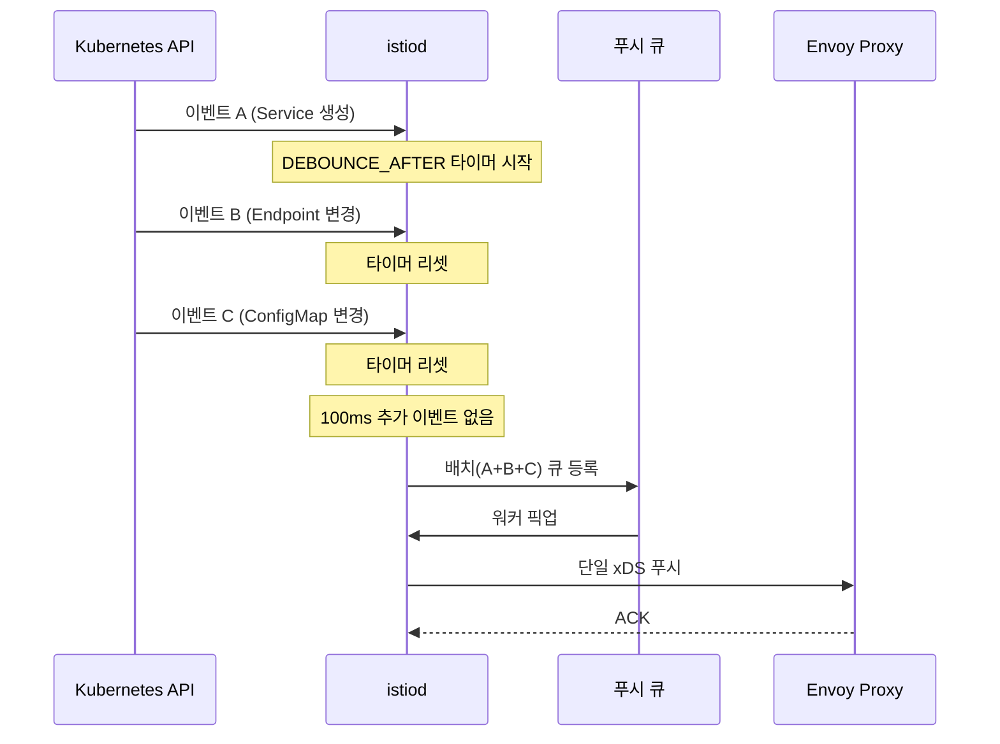

# Istio 성능 튜닝

> 장애 원인 분석 체계를 익혔다면, 이제는 병목을 예방하고 줄이는 성능 튜닝 단계로 넘어간다. Istio 컨트롤 플레인은 서비스 수와 설정 변경 빈도에 비례해 부하가 증가하므로, Golden Signals로 병목을 찾고 Sidecar CRD·discoverySelectors·디바운스 튜닝·리소스 스케일링을 순서대로 적용해야 한다.


## 학습 목표

> Golden Signals로 컨트롤 플레인 병목을 정확히 짚고, Sidecar CRD·discoverySelectors·디바운스 튜닝·리소스 스케일링을 순서대로 적용하는 성능 튜닝 체계를 다룬다.

일곱 가지다. Istio 컨트롤 플레인의 Golden Signals 4가지를 설명하고 각 신호를 측정하는 PromQL을 작성한다. `config_dump`로 xDS 설정 크기를 측정하고 병목 서비스를 식별한다. Sidecar CRD로 워크로드별 설정 범위를 제한해 xDS 페이로드를 줄인다. `discoverySelectors`로 istiod가 관찰하는 네임스페이스를 필터링한다. `PILOT_DEBOUNCE_AFTER`와 `PILOT_DEBOUNCE_MAX`의 역할을 이해하고 트레이드오프를 설명한다. 수신 트래픽 병목과 송신 트래픽 병목을 구분해 스케일 업/아웃 방향을 결정한다.


## 1. 컨트롤 플레인 성능 지표 — Golden Signals

> `pilot_proxy_convergence_time` P99가 1초를 넘으면 튜닝을 검토하고, 10초를 초과하면 데이터 플레인 라우팅 불일치가 발생할 수 있어 즉시 조치가 필요하다.

Istio 컨트롤 플레인(istiod)의 성능은 Google SRE의 Golden Signals 프레임워크로 측정한다. 지연 시간·포화도·트래픽·오류 네 가지 관점에서 메트릭을 수집하면 어떤 리소스가 병목인지 좁혀낼 수 있다.

### 1.1 지연 시간 (Latency)

지연 시간 지표는 istiod가 설정 변경을 감지한 시점부터 Envoy 사이드카에 반영되기까지 걸리는 시간을 추적한다. 세 가지 메트릭이 파이프라인 각 단계를 커버한다.

`pilot_proxy_convergence_time`은 변경 감지부터 모든 프록시에 설정이 수렴될 때까지의 전체 시간을 히스토그램으로 기록한다. `pilot_proxy_queue_time`은 변경 이벤트가 처리 큐에서 대기하는 시간이며, 이 값이 높으면 워커 스레드나 CPU가 포화 상태임을 의미한다. `pilot_xds_push_time`은 실제 xDS 페이로드를 프록시에 전송하는 데 걸린 시간으로, 설정 크기가 클수록 길어진다.

```promql
# P99 수렴 시간
histogram_quantile(0.99,
  sum(rate(pilot_proxy_convergence_time_bucket[5m])) by (le)
)

# P99 큐 대기 시간
histogram_quantile(0.99,
  sum(rate(pilot_proxy_queue_time_bucket[5m])) by (le)
)

# P99 xDS 푸시 시간
histogram_quantile(0.99,
  sum(rate(pilot_xds_push_time_bucket[5m])) by (le)
)
```

수렴 시간 P99가 1초를 넘기 시작하면 성능 튜닝을 검토한다. 10초를 초과하면 데이터 플레인에서 라우팅 불일치가 발생할 수 있어 즉시 조치가 필요하다.

### 1.2 포화도 (Saturation)

포화도는 istiod 프로세스가 사용 가능한 리소스를 얼마나 소진하고 있는지를 측정한다.

```promql
# istiod 컨테이너 CPU 사용률
sum(rate(container_cpu_usage_seconds_total{
  namespace="istio-system",
  container="discovery"
}[5m]))
```

서비스 배포가 대규모로 이뤄질 때 CPU 사용량이 급격히 스파이크하는 패턴이 나타난다. 이는 단시간에 다수의 xDS 푸시가 발생하기 때문이다.

### 1.3 트래픽 (Traffic)

트래픽 메트릭은 istiod로 들어오는 변경 이벤트(수신)와 나가는 xDS 푸시(송신) 두 방향으로 나뉜다.

수신 측 주요 메트릭으로는 Kubernetes API 서버로부터 수신한 리소스 변경 이벤트 수인 `pilot_inbound_updates`, 실제 xDS 푸시를 유발한 이벤트 수인 `pilot_push_triggers`, istiod가 추적하는 서비스 총 수인 `pilot_services`가 있다.

```promql
# CDS/EDS/LDS/RDS 타입별 푸시 횟수
sum(rate(pilot_xds_pushes[5m])) by (type)
```

### 1.4 오류 (Errors)

`pilot_total_xds_rejects`는 Envoy가 xDS 설정을 수신했지만 유효성 검사에서 거부한 횟수다. `pilot_xds_write_timeout`은 istiod가 프록시에 설정을 쓰는 도중 타임아웃이 발생한 횟수다. 오류가 0이 아닌 경우 즉시 조사가 필요하다.


## 2. 성능 병목 진단

> `config_dump` 크기 측정과 디바운스 이해가 병목 위치를 좁히는 두 가지 핵심 도구이며, 설정 크기가 크면 xDS 푸시 시간이 직접적으로 늘어난다.

### 2.1 xDS 설정 크기 측정

Envoy의 `config_dump` 엔드포인트는 현재 사이드카가 보유한 전체 xDS 설정을 JSON으로 반환한다. 이 크기가 클수록 푸시 시간이 길어지고 메모리 사용량이 증가한다.

```bash
# 특정 Pod의 config_dump 크기 확인
kubectl exec -n default <pod-name> -c istio-proxy -- \
  curl -s http://localhost:15000/config_dump | \
  wc -c | awk '{printf "%.2f MB\n", $1/1024/1024}'
```

튜닝 전 일반적인 서비스 메시에서 `config_dump` 크기는 수 MB에 달하는 경우가 많다. 3절과 4절에서 1.8MB를 516KB로 줄이는 과정을 다룬다.

### 2.2 딜레이와 배치 처리의 관계

istiod는 변경 이벤트를 즉시 처리하지 않고 짧은 딜레이 동안 이벤트를 수집한 뒤 한꺼번에 처리한다. 이를 디바운스(debounce)라고 한다. 딜레이가 0이면 이벤트 하나마다 푸시가 발생해 총 푸시 횟수가 많아진다. 딜레이를 늘리면 여러 이벤트가 하나의 배치로 묶여 푸시 횟수가 줄지만, 개별 이벤트의 처리 지연 시간은 늘어난다.

| 딜레이(ms) | 총 푸시 횟수 |
|-----------|------------|
| 100ms | ~320회 |
| 500ms | ~180회 |
| 1000ms | ~95회 |
| 2500ms | ~42회 |


## 3. Sidecar 리소스로 설정 크기 줄이기

> Sidecar CRD로 워크로드별 접근 범위를 선언하면 각 Envoy가 보유하는 xDS 설정량이 줄어 푸시 시간과 메모리 사용량이 함께 감소하며, 메시 전역 기본값 설정만으로도 즉각적인 효과를 얻을 수 있다.

기본 설정에서 istiod는 메시 전체의 모든 서비스 정보를 각 사이드카에 배포한다. 서비스가 1,000개이면 각 Pod의 Envoy는 999개 업스트림에 대한 라우팅 규칙을 모두 보유한다. 대부분의 서비스는 실제로 필요한 업스트림이 10개 미만이므로 이는 명백한 낭비다.

Sidecar CRD는 "이 워크로드는 어떤 서비스에만 접근하면 된다"는 선언을 통해 xDS 설정 범위를 명시적으로 제한한다.

### 3.1 Sidecar CRD 구조

```yaml
apiVersion: networking.istio.io/v1beta1
kind: Sidecar
metadata:
  name: payment-sidecar
  namespace: payment
spec:
  workloadSelector:
    labels:
      app: payment-service
  egress:
  - hosts:
    - "./order-service"          # 같은 네임스페이스의 order-service
    - "inventory/inventory-svc"  # inventory 네임스페이스의 특정 서비스
    - "istio-system/*"           # 컨트롤 플레인 서비스 전체
  outboundTrafficPolicy:
    mode: REGISTRY_ONLY          # 명시되지 않은 목적지 차단
```

`outboundTrafficPolicy: REGISTRY_ONLY`는 `egress`에 명시되지 않은 모든 아웃바운드 트래픽을 차단한다. 이 모드를 쓰면 실수로 의존하게 된 서비스를 조기에 발견할 수 있다.

### 3.2 메시 전체 기본 Sidecar

모든 워크로드에 개별 Sidecar CRD를 붙이기 전에 `istio-system` 네임스페이스에 메시 전역 기본값을 먼저 설정하면 즉각적인 효과를 얻을 수 있다.

```yaml
apiVersion: networking.istio.io/v1beta1
kind: Sidecar
metadata:
  name: default
  namespace: istio-system
spec:
  egress:
  - hosts:
    - "./*"
    - "istio-system/*"
  outboundTrafficPolicy:
    mode: REGISTRY_ONLY
```

이 리소스는 네임스페이스 수준 Sidecar가 없는 모든 워크로드에 폴백으로 적용된다.

### 3.3 적용 전후 비교

```bash
# 적용 전: ~1.8MB
kubectl exec -n payment payment-pod -c istio-proxy -- \
  curl -s http://localhost:15000/config_dump | wc -c

# 메시 전역 Sidecar 적용 후: ~516KB (약 72% 감소)
kubectl apply -f mesh-default-sidecar.yaml

kubectl exec -n payment payment-pod -c istio-proxy -- \
  curl -s http://localhost:15000/config_dump | wc -c
```

xDS 페이로드가 줄면 `pilot_xds_push_time`이 직접적으로 감소하고, Envoy 메모리 사용량과 재시작 시간도 함께 줄어든다.


## 4. 디스커버리 범위 줄이기

> `discoverySelectors`로 istiod가 관찰하는 네임스페이스 자체를 제한하면 이벤트 처리량이 줄어들며, Sidecar CRD가 워크로드 수준의 설정 범위를 제어하는 것과 상호 보완적이다.

Sidecar CRD가 "특정 워크로드가 받는 설정 범위"를 줄인다면, `discoverySelectors`는 "istiod가 아예 관찰하는 네임스페이스 자체"를 제한한다. 메시에 포함할 필요가 없는 네임스페이스를 제외하면 istiod의 이벤트 처리량이 줄어든다.

### 4.1 discoverySelectors

```yaml
apiVersion: install.istio.io/v1alpha1
kind: IstioOperator
spec:
  meshConfig:
    discoverySelectors:
    - matchLabels:
        istio-discovery: enabled
```

```bash
# 네임스페이스에 레이블 추가로 점진적 적용
kubectl label namespace payment istio-discovery=enabled
kubectl label namespace order istio-discovery=enabled
```

### 4.2 NotIn 연산자로 제외

포함할 네임스페이스보다 제외할 네임스페이스가 명확한 경우 `NotIn` 연산자가 더 편리하다.

```yaml
meshConfig:
  discoverySelectors:
  - matchExpressions:
    - key: kubernetes.io/metadata.name
      operator: NotIn
      values:
      - kube-system
      - monitoring
      - ci-ephemeral
      - logging
```

`kubernetes.io/metadata.name`은 Kubernetes 1.21부터 모든 네임스페이스에 자동으로 부여되는 레이블로, 별도 레이블 추가 없이 네임스페이스 이름으로 필터링할 수 있다.


## 5. 이벤트 배치 처리와 푸시 스로틀링

> `PILOT_DEBOUNCE_AFTER`를 늘리면 푸시 횟수가 줄지만 `pilot_proxy_convergence_time` 메트릭에 대기 시간이 포함되지 않아 실제 반영 지연을 과소 측정하게 된다.

### 5.1 디바운스 메커니즘



대규모 배포처럼 짧은 시간에 수십~수백 개의 이벤트가 쏟아질 때, 디바운스가 없으면 같은 수의 푸시가 발생한다. 디바운스를 통해 이 모두를 하나의 푸시로 묶을 수 있다.

### 5.2 PILOT_DEBOUNCE_AFTER, PILOT_DEBOUNCE_MAX

```yaml
# istiod Deployment 환경 변수 설정
env:
- name: PILOT_DEBOUNCE_AFTER
  value: "2500ms"    # 기본 100ms → 2500ms로 증가
- name: PILOT_DEBOUNCE_MAX
  value: "10s"       # 기본값 유지
```

`PILOT_DEBOUNCE_AFTER`를 100ms에서 2500ms로 늘리면 같은 배포 시나리오에서 푸시 횟수가 약 10분의 1로 줄어든다.

### 5.3 중요한 함정: 메트릭에 대기시간이 포함되지 않는다

`pilot_proxy_convergence_time` 메트릭은 istiod가 처리를 시작한 시점부터 측정하므로 디바운스 대기 시간은 이 메트릭에 포함되지 않는다. 즉, `pilot_proxy_convergence_time`이 좋아 보여도 실제 end-to-end 반영 시간은 `PILOT_DEBOUNCE_AFTER` 값만큼 항상 추가된다. 카나리 배포나 즉각적인 트래픽 전환이 필요한 서비스에서 디바운스 값을 크게 설정하면 의도치 않은 지연이 발생할 수 있다.


## 6. 리소스 추가 할당

> 수신 이벤트 처리 병목은 CPU를 늘리는 스케일 업이 유효하고, 프록시 연결 수 병목은 replica를 늘리는 스케일 아웃이 유효하므로 병목 방향을 먼저 판단해야 한다.

Sidecar CRD, discoverySelectors, 디바운스 조정으로도 부족하다면 istiod 자체 리소스를 늘린다. 단, 스케일 업과 스케일 아웃 중 어느 방향이 맞는지는 병목 위치에 따라 다르다.

| 병목 신호 | 원인 | 해결 방향 |
|-----------|------|-----------|
| `pilot_inbound_updates` 증가, CPU 포화 | 이벤트 파싱·계산 처리 부하 | 스케일 업 (CPU/메모리 증가) |
| `pilot_xds_pushes` 증가, 연결 수 한계 | 동시 프록시 연결 처리 한계 | 스케일 아웃 (replica 수 증가) |

수신 트래픽 병목은 이벤트를 파싱하고 새 설정을 계산하는 단계에서 발생한다. 이 작업은 단일 프로세스 내에서 처리되므로 replica를 늘려도 분산되지 않아 스케일 업이 유효하다. 반면 프록시 연결 수가 많고 `pilot_xds_push_time`이 높은 경우는 각 istiod 인스턴스가 독립적으로 프록시 연결을 처리할 수 있으므로 스케일 아웃이 효과적이다.

```yaml
# 스케일 업: istiod 리소스 증가
resources:
  requests:
    cpu: "2000m"
    memory: "2Gi"
  limits:
    cpu: "4000m"
    memory: "4Gi"
```

```bash
# 스케일 아웃: istiod replica 수 증가
kubectl scale deployment istiod \
  -n istio-system \
  --replicas=3
```


## 핵심 정리

> 측정 없이 튜닝하지 않는다. 설정 크기·디스커버리 범위·디바운스 세 가지를 먼저 조정하고, 그래도 부족할 때 리소스 증가를 검토한다.

Istio 성능 튜닝은 측정 → 병목 식별 → 최소 침습 조치 순서로 진행한다. Golden Signals 네 가지 중 지연 시간(`pilot_proxy_convergence_time`)과 트래픽(`pilot_xds_pushes`)이 가장 먼저 살펴볼 지표다. 병목이 설정 크기에 있으면 Sidecar CRD를, 관찰 범위가 넓으면 `discoverySelectors`를, 이벤트 폭풍이 원인이면 디바운스 튜닝을 적용한다. 이 세 가지를 적용했는데도 부족하다면 리소스 증가를 고려하되, 병목 방향에 따라 스케일 업과 스케일 아웃을 구분해야 한다.


## 면접 대비

> Istio 성능 튜닝의 의사결정 흐름에 자주 등장하는 네 가지 질문을 답변 형식으로 정리한다.

**istiod 병목을 의심할 때 가장 먼저 보는 지표는?**

`pilot_proxy_convergence_time`(설정이 프록시에 반영되는 시간)과 `pilot_xds_pushes`(푸시 횟수)다. 컨버전스 시간 p99가 1초를 넘기 시작하면 설정 크기·푸시 빈도·디바운스 셋 중 하나가 흔들린다는 신호다. 두 지표는 클러스터 규모가 커질수록 가장 먼저 무너지는 지표이고, CPU·메모리 증설보다 먼저 확인해야 한다.

**Sidecar CRD와 `discoverySelectors`는 같은 문제를 푸는가?**

비슷하지만 층위가 다르다. Sidecar CRD는 각 워크로드가 수신할 xDS 설정 범위를 좁히는 사이드카 단위 조치이고, `discoverySelectors`는 istiod가 watch하는 네임스페이스 자체를 줄이는 컨트롤 플레인 단위 조치다. 큰 클러스터에서는 `discoverySelectors`로 컨트롤 플레인 관찰 범위를 먼저 줄이고, 그래도 사이드카 설정이 큰 워크로드에 Sidecar CRD를 덧붙이는 순서가 효과적이다.

**스케일 업과 스케일 아웃 중 istiod에 무엇이 맞는가?**

병목 방향에 따라 다르다. CPU 사용률이 높고 푸시 처리 속도가 한계라면 인스턴스당 CPU·메모리를 올리는 스케일 업이 효과적이다. 동시 연결된 Envoy 수가 한 인스턴스당 1000을 넘어가기 시작하면 스케일 아웃으로 인스턴스 수를 늘려야 안전하다. 두 방향을 동시에 늘리면 비용만 커지고 효과는 한 방향으로만 나타나기 쉽다.

**디바운스 튜닝의 트레이드오프는?**

푸시 디바운스 윈도우(`PILOT_DEBOUNCE_AFTER`/`MAX`)를 키우면 이벤트 폭풍이 합쳐져 푸시 횟수가 줄지만, 설정 반영 지연이 그만큼 늘어난다. 카나리 배포 가중치 변경이 5초 안에 반영돼야 하는 워크플로라면 디바운스를 너무 키울 수 없다. 디바운스는 "안정적이지만 반영이 빠를 필요 없는" 컨버전스 시간을 가진 환경에서 우선 적용한다.
